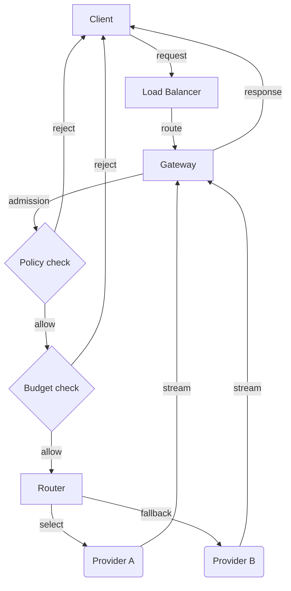
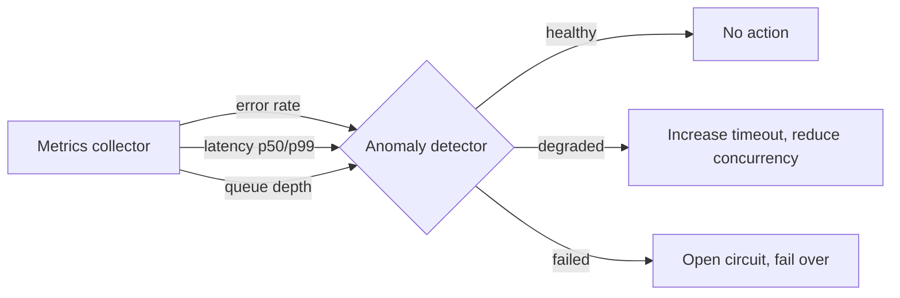

# Chapter 1 — Distributed Systems for AI Workloads

> Traditional distributed systems knowledge transfers to AI systems, but the
> numbers change by two orders of magnitude, and the numbers are where the
> architecture lives.

---

## Learning Objectives

By the end of this chapter you will be able to:

- Explain why CAP theorem tradeoffs differ for AI workloads and choose an
  appropriate consistency model for a given feature.
- Design timeout and retry strategies that account for LLM latency
  distributions without causing retry storms.
- Calculate token-based capacity for an AI system and explain why
  request-based capacity planning fails.
- Implement failure detection that adapts to the high variance of model
  inference latency.
- Describe three failure modes specific to AI workloads and their mitigations.
- Size a circuit breaker for a provider integration that has 40-second p99
  latency.

---

## The Production Story

Consider a fintech company launching an AI-powered document processing
system. The system extracts data from uploaded contracts, validates terms
against policy, and generates summaries. The team has experience building
distributed systems — they have run microservices, Kafka, and Redis in
production for years.

They deploy with sensible defaults: 5-second timeouts, 3 retries with
exponential backoff, and circuit breakers that open after 5 consecutive
failures. The system handles 100 documents per hour smoothly.

Two weeks after launch, a large customer uploads 500 documents at once.
The mid-tier model they use for extraction has a p50 latency of 3 seconds
and a p99 of 12 seconds. Under the burst, p99 climbs to 25 seconds as the
provider queues requests.

The 5-second timeout fires on 60% of requests. Each timed-out request
retries three times, tripling the load on an already-saturated provider.
The circuit breaker never trips because requests are not failing — they are
timing out, and the team configured the breaker to count failures, not
latency.

Within minutes, the retry storm has quadrupled outbound traffic. The
provider's rate limiter engages. Now requests that would have succeeded
start failing. The circuit breaker finally opens, but by then the rate limit
will not reset for another 60 seconds.

The customer's 500 documents? 340 processed, 160 stuck in a failed state.
The team spends the next four hours manually reprocessing while a product
manager explains to the customer why their "AI system" cannot handle a
batch upload.

At the incident review, the CTO asks: "We have built distributed systems
before. Why did this one break so differently?"

---

## Why This Exists

Every distributed systems textbook covers the same fundamentals: CAP
theorem, consensus protocols, failure detection, timeout design, capacity
planning. These fundamentals transfer directly to AI systems. The problem
is that the numbers change.

**Traditional systems operate in milliseconds; AI systems operate in
seconds.** A database query returns in 5ms with a p99 of 50ms. A mid-tier
model request returns in 800ms with a p99 of 5 seconds. A frontier model
can take 15 seconds at p50 and 45 seconds at p99. The variance is 100x
higher, and the baseline is 100x longer.

This changes everything downstream. A 5-second timeout is conservative for
a database — it gives the p99 100x headroom. That same 5-second timeout for
a mid-tier model is aggressive — it cuts off 10% of requests at p50 load and
50% under pressure. The number was fine; the workload changed.

**Traditional capacity is measured in requests; AI capacity is measured in
tokens.** Two requests to a model endpoint can differ in cost by 20x
depending on input and output length. Rate limiting by request count allows
10 expensive requests to consume the budget meant for 200 cheap ones. The
rate limiter sees "10 requests," the provider sees "200,000 tokens," and the
bill sees $40 that the budget expected to be $2.

**Traditional failures are binary; AI failures are gradual.** A database
is up or down. A model provider degrades: latency doubles, then triples,
then rate limits engage, then errors appear. Each stage requires a different
response. A circuit breaker that waits for errors misses the first two
stages entirely.

**Traditional escalation pages someone; AI escalation waits.** When your
database is slow, you can page the DBA. When a third-party model provider
is slow, your options are "wait" or "fail over to a different provider."
The incident management playbook changes fundamentally when you cannot
page the people operating your dependency.

This chapter adapts distributed systems fundamentals to these realities.
The principles are the same; the parameters are not.

---

## Core Concepts

**Consistency model.** A contract about what reads see after writes.
Eventual consistency guarantees convergence but allows stale reads. Strong
consistency guarantees reads see the latest write but may fail during
partitions. Causal consistency preserves ordering within causal chains.
For AI systems, the choice usually comes down to: can your feature tolerate
showing slightly stale data for a few hundred milliseconds?

**CAP theorem.** During a network partition, a distributed system must
choose between consistency (reject requests to maintain correctness) and
availability (serve requests with potentially stale data). AI systems add a
twist: the "partition" is often a third-party provider, and you cannot
choose to fix it. You can only choose how to fail.

**Phi accrual failure detector.** A failure detection algorithm that
adapts to observed network conditions rather than using fixed thresholds.
Critical for AI workloads where latency variance is high. A fixed 10-second
heartbeat timeout is aggressive for a frontier model under load and lenient
for a small model with spare capacity.

**Circuit breaker.** A pattern that stops calling a failing dependency to
prevent cascade failures. Three states: closed (normal operation), open
(requests rejected immediately), and half-open (testing if recovery has
occurred). For AI workloads, circuit breakers must trip on latency, not
just errors — a provider at 40-second latency is effectively failed even
if no errors appear.

**Token budget.** Capacity allocated in tokens rather than requests. Two
requests with 100 and 2,000 output tokens consume 20x different capacity.
Token budgets match how providers actually bill and rate-limit.

**Time to first token (TTFT).** The latency between request submission and
receiving the first token of the response. Mostly fixed overhead —
authentication, queue wait, initial context processing. Highly variable
under load. The component of LLM latency that timeout strategies most often
underestimate.

**Exponential backoff with jitter.** A retry strategy where wait time
doubles after each failure, with random jitter to prevent synchronized
retries. Without jitter, retries from multiple clients align and create
periodic spikes. With jitter, retries spread across time.

---

## Internal Architecture

A request to an AI system passes through layers, each with its own failure
modes.



*Request flow through an AI system. Each diamond is a potential rejection
point; each rounded box is an external dependency you cannot control.*

### Consistency at each layer

**Client to gateway.** Usually eventual consistency is sufficient. If a
client reads their conversation history and misses the last message for
200ms, no harm done. Strong consistency here adds latency for minimal
benefit.

**Gateway to cache.** Exact-match caching is strongly consistent by
definition — a cache hit returns exactly what was stored. Semantic caching
(matching "similar" queries) introduces eventual consistency semantics
even when the cache itself is strongly consistent, because similarity is
approximate.

**Gateway to provider.** No consistency model applies — each request is
independent. But the lack of consistency guarantees means you cannot rely
on reading your writes. If you send a request and immediately send a
follow-up, the provider may process them out of order.

### Failure detection architecture

Failure detection in AI systems requires monitoring three distinct signals.

**Error rate.** The obvious one. If requests return 5xx errors, something
is wrong. But providers rarely fail this cleanly — they degrade first.

**Latency percentiles.** The early warning signal. If p99 doubles, the
system is under stress. If p50 doubles, the system is in trouble. Latency
monitoring must track percentiles, not averages — a 2-second average hides
whether you have uniform 2-second requests or a mix of 500ms and 20-second
requests.

**Queue depth at the provider.** Some providers expose queue metrics.
Rising queue depth predicts latency increases before they manifest. If
available, this is the earliest warning signal.



*Anomaly detection must act on latency increases before errors appear.*

### Timeout architecture

LLM timeouts have two components that must be budgeted separately.

**Time to first token (TTFT) budget.** How long to wait for generation to
begin. This is mostly provider queue time and initial processing. Under
load, TTFT can exceed generation time for short responses.

**Generation budget.** How long to wait for the complete response once
generation starts. Approximately linear with output tokens. More
predictable than TTFT once generation begins.

The formula for a reasonable timeout:

```
timeout = TTFT_p99 + (max_output_tokens * ms_per_token) * 1.5
```

The 1.5x multiplier provides headroom for variance. Adjust based on how
acceptable timeout-induced failures are for your feature.

---

## Production Design

**Deploy with latency-aware circuit breakers.** A circuit breaker that
only counts errors will not trip until the provider is catastrophically
failed. Configure breakers to count requests exceeding a latency threshold
(e.g., 3x the p50) as failures. This catches brownouts — the dominant
failure mode.

**Set timeouts based on token count, not fixed values.** A 100-token
classification and a 4,000-token summary cannot share a timeout. Either
the classification timeout is too generous (wasting resources waiting for
stuck requests) or the summary timeout is too aggressive (cutting off valid
long responses).

```ts
// examples/ch01-distributed-systems/src/failures.ts
calculateTimeout(maxOutputTokens: number): number {
  const ttftBudget = this.p99Ms;
  const generationBudget = maxOutputTokens * this.tokenGenerationRateMs;
  return Math.ceil((ttftBudget + generationBudget) * 1.5);
}
```

**Use token-based rate limiting, not request-based.** A tenant with a
10,000 token/minute budget can make 100 small requests or 5 large ones.
Request-based limiting would allow 20 large requests, exhausting 4x the
intended budget.

**Implement reserve-then-reconcile for budget tracking.** At request
admission, reserve the pessimistic estimate (max_tokens from the request).
At response completion, reconcile to actual usage. This prevents
overshoot while requests are in flight.

**Configure retries with full jitter.** Without jitter, retries from
multiple clients synchronize and create periodic load spikes. Full jitter
(random delay between 0 and the backoff ceiling) spreads retries uniformly.

```ts
// examples/ch01-distributed-systems/src/failures.ts
nextTimeout(): number {
  const base = this.config.initialMs *
    Math.pow(this.config.multiplier, this.attempt);
  const capped = Math.min(base, this.config.maxMs);
  const jitter = capped * this.config.jitterRatio * (Math.random() * 2 - 1);
  this.attempt++;
  return Math.max(0, capped + jitter);
}
```

**Monitor these metrics:**

| Metric | Why it matters | Alert threshold |
| --- | --- | --- |
| TTFT p99 | Early indicator of provider stress | >2x baseline |
| Token throughput | Actual capacity consumption | >80% of budget |
| Timeout rate | Requests cut off prematurely | >5% of requests |
| Retry rate | Retry storm indicator | >20% of requests |
| Circuit state | Provider health | Any non-closed |

---

## Failure Scenarios

### Failure: retry storm under brownout

**Symptom.** Outbound request volume to a provider suddenly triples or
quadruples. Rate limit errors follow within minutes. Request success rate
drops despite no changes on your side.

**Mechanism.** The provider enters a brownout — latency increases but
errors do not. Your timeout fires on slow requests. Each timed-out request
retries. Because the provider is slow (not down), retries also queue. Each
retry times out and retries again. The exponential retry policy meant for
discrete failures instead compounds load on a continuous degradation.

**Detection.** Compare outbound request rate to inbound request rate. If
outbound exceeds inbound by more than 1.5x sustained, a retry storm is
forming. Additionally, monitor for correlated timeout spikes across multiple
client instances.

**Mitigation.** Immediately increase timeouts to stop the bleeding — a
request that eventually succeeds is better than a retry storm. If retries
are already consuming capacity, reduce concurrency or enable a circuit
breaker that trips on latency, not just errors.

**Prevention.** Implement latency-aware circuit breakers that trip when
p99 exceeds a threshold (e.g., 3x baseline), not just when errors appear.
Add retry budgets: if more than 10% of requests in a window are retries,
stop retrying and fail fast.

### Failure: token budget exhaustion by large requests

**Symptom.** A tenant's requests start failing with budget-exceeded errors
despite making fewer requests than usual. Or: your provider rate limit is
reached despite a low request count.

**Mechanism.** Request-based budgeting does not distinguish between a
100-token request and a 10,000-token request. A few large requests consume
the entire token budget while appearing as normal request volume. The rate
limiter sees "5 requests," well under the limit. The provider sees "50,000
tokens," well over the token limit.

**Detection.** Track token consumption alongside request count. Alert when
token consumption increases without a proportional request increase. This
signals a shift toward larger requests.

**Mitigation.** Reject requests that would exceed the remaining token
budget. Return a clear error indicating the budget state and when it resets.

**Prevention.** Budget in tokens, not requests. Reserve tokens at request
admission based on max_tokens, reconcile to actual at completion. Set
per-request maximum token limits to bound worst-case consumption.

### Failure: consensus failure during provider partition

**Symptom.** Reads return stale or inconsistent data across clients.
Writes appear to succeed but changes do not persist. Or, depending on your
consistency choice: all writes fail during the partition.

**Mechanism.** Your system uses multiple nodes for state (conversation
history, document processing status, etc.). A network partition or node
failure prevents the nodes from reaching consensus. If configured for
strong consistency (CP), writes fail until consensus is restored. If
configured for eventual consistency (AP), writes succeed on available
nodes but may conflict when the partition heals.

**Detection.** For CP systems: write failure rate spikes, reads succeed
but are stale. For AP systems: conflict rate increases after partition
heals, or users see their writes "disappear" after reading from a different
node.

**Mitigation.** For CP: accept the write failures, communicate clearly to
users ("temporarily unavailable"). For AP: implement conflict resolution
(last-write-wins, vector clocks, or application-specific merge). Either
way, do not mix models — decide per data type whether you prefer
availability or consistency during partitions.

**Prevention.** Choose the consistency model deliberately. For conversation
history, eventual consistency usually suffices — a message visible 200ms
late is acceptable. For financial transactions or audit logs, strong
consistency is worth the availability tradeoff.

---

## Scaling Strategy

Things break in a specific order as load grows.

**First: connection pool exhaustion, around 50-100 concurrent requests per
instance.** Each in-flight request to a provider holds a connection.
Mid-tier model requests average 3 seconds; at 30 RPS per instance, that is
90 concurrent connections. If your pool is sized for traditional APIs
(10-20 connections), requests queue behind the pool before they reach the
provider.

**Second: token throughput limits, around 100,000-1,000,000 tokens per
minute per provider.** Provider rate limits are denominated in tokens, not
requests. A request that generates 4,000 tokens uses 40x the token budget
of a 100-token request but counts the same toward request limits. Scale
providers (add more API keys, use multiple providers) when token throughput
becomes the constraint.

**Third: memory from conversation history, around 1,000-10,000 concurrent
sessions.** Each session holds context. A 128k-context model at 4 bytes
per token uses 512KB per session. At 10,000 sessions, that is 5GB just
for context storage, before any response caching.

**Fourth: cost.** Unlike traditional infrastructure that scales with
hardware costs, AI systems scale with per-request costs. Doubling traffic
doubles the bill. Monitor cost as a scaling dimension — it will become the
constraint before hardware does.

---

## Trade-offs

| Decision | Buys you | Costs you | Choose when |
| --- | --- | --- | --- |
| Eventual consistency | Availability during partitions | Stale reads for ~200ms | User-facing state where freshness is not critical |
| Strong consistency | No stale reads | Failures during partitions | Financial data, audit logs, anything users compare |
| Short timeout | Fast failure, low resource usage | More requests cut off | Non-critical features, user can retry |
| Long timeout | Higher success rate | Resources held longer, slow failures | Critical features, no manual retry path |
| Aggressive circuit breaker | Fast protection from cascade | False positives during spikes | Providers with clear failure modes |
| Conservative circuit breaker | Fewer false positives | Longer brownout exposure | Providers with gradual degradation |
| Token-based budgeting | Accurate cost control | More complex than request counting | Always for AI workloads |
| Request-based budgeting | Simple implementation | Cannot control actual cost | Never for AI workloads |
| Full jitter on retry | Even load distribution | Slightly higher average wait | Always |
| Fixed backoff | Predictable timing | Synchronized retry spikes | Never |

---

## Code Walkthrough

From `examples/ch01-distributed-systems/`. All code runs in-process without
external dependencies.

### Consistency simulation

```ts
// examples/ch01-distributed-systems/src/consistency.ts

writeEventual(key: string, value: unknown): WriteResult {
  const primary = nodes[0];

  if (!primary.healthy) {
    return { success: false, nodesAcked: 0, ... };  // (1)
  }

  primary.state[key] = value;
  primary.clock++;
  this.writeLog.push({ key, value, timestamp: Date.now() });  // (2)

  return { success: true, nodesAcked: 1, ... };  // (3)
}
```

1. Eventual consistency requires at least one healthy node. If the primary
   is down, the write fails — availability depends on at least partial
   cluster health.
2. The write is logged for asynchronous replication. Secondaries will
   receive it during the next replication cycle.
3. Returns immediately after one ack. The caller cannot know if
   secondaries have the value yet.

### Phi accrual failure detection

```ts
// examples/ch01-distributed-systems/src/failures.ts

calculatePhi(nodeId: string): number {
  const history = this.heartbeatHistory.get(nodeId);
  if (!history || history.length < 2) {
    const timeSinceLast = Date.now() - last;
    return timeSinceLast / this.config.heartbeatIntervalMs;  // (1)
  }

  const mean = history.reduce((a, b) => a + b, 0) / history.length;
  const variance = history.reduce(
    (sum, val) => sum + Math.pow(val - mean, 2), 0
  ) / history.length;
  const stdDev = Math.sqrt(variance);

  const timeSinceLast = Date.now() - last;
  const y = (timeSinceLast - mean) / stdDev;  // (2)
  const phi = -Math.log10(1 - this.normalCDF(y));  // (3)

  return Math.max(0, phi);
}
```

1. Without enough history, fall back to a simple ratio. This prevents
   false positives during startup.
2. Normalize the time since last heartbeat against observed distribution.
   A node with high-variance heartbeats needs more silence before being
   suspected.
3. The phi value represents the log probability that the node has failed.
   Higher phi means more confidence in failure.

### Token-based capacity planning

```ts
// examples/ch01-distributed-systems/src/capacity.ts

compareRequestSizeThroughput(
  tokensPerSecond: number,
  sizes: number[]
): Array<{ size: number; maxRps: number }> {
  return sizes.map((size) => ({
    size,
    maxRps: tokensPerSecond / size,  // (1)
  }));
}
```

1. The key insight: at a fixed token budget, small requests get more RPS
   than large ones. At 10,000 tokens/second: 100-token requests get 100
   RPS, 2,000-token requests get 5 RPS. Request-based rate limiting cannot
   express this relationship.

---

## Hands-On Lab

**Goal:** observe consistency convergence, failure detection adaptation,
and capacity planning differences. About 2 seconds of runtime, Node 22.6+,
no dependencies.

```bash
cd examples/ch01-distributed-systems
node scripts/lab.mjs
```

That runs all twelve steps and asserts forty claims. The rest of this
section explains what it is checking and why.

**Step 1 — eventual consistency converges.**

Write a value with eventual consistency (one ack). Immediately check
convergence — not converged, because secondaries have not received the
write. Wait 100ms, call simulateReplication(), check again — converged.

Observed: writes return in ~10ms (one node latency), convergence takes
~50-100ms (replication delay). The gap between "write succeeded" and
"all nodes agree" is the eventual consistency window.

**Step 2 — strong consistency blocks until majority.**

Write with strong consistency. The write blocks until 2 of 3 nodes ack.
Latency is higher (sum of node latencies) but reads immediately see the
value.

Observed: strong write takes ~50ms vs ~10ms for eventual. The 5x latency
increase is the cost of consistency.

**Step 3 — CAP theorem during partition.**

Simulate a partition isolating 2 of 3 nodes. Attempt a strong write — fails
because majority is unreachable. Attempt an eventual read — succeeds
because one node is available. This is the CAP tradeoff made concrete.

**Step 4 — exponential backoff with jitter.**

Generate 5 retry timeouts. Verify they increase exponentially and include
jitter variance. The jitter prevents synchronized retry spikes.

**Step 5 — phi accrual failure detection.**

Send heartbeats at 10ms intervals, building a history. Verify healthy
status. Wait 500ms without heartbeats. Verify phi increases — the detector
knows something is wrong based on deviation from observed behavior.

**Step 6 — token-based vs request-based capacity.**

Compare capacity calculations for 100-token and 2,000-token requests.
Token-based shows 20x difference. Request-based shows no difference. This
is why request-based rate limiting fails for AI workloads.

**Steps 7-12** continue with token planning, latency distribution, timeout
strategy, circuit breaker state machine, queue models, and timeout impact
on throughput.

---

## Interview Questions

1. Why do timeout strategies that work for traditional APIs fail for LLM
   workloads? What parameters need to change?

2. A circuit breaker is configured to trip after 5 consecutive failures.
   The provider is in a brownout — latency is 10x normal but error rate is
   0%. Will the breaker trip? What should change?

3. Explain the CAP theorem. During a network partition, would you choose
   consistency or availability for: (a) conversation history, (b) billing
   records, (c) model response cache?

4. A tenant is hitting rate limits despite making fewer requests than
   their limit. What is the likely cause?

5. Two requests arrive simultaneously to a distributed system. Request A
   writes a value, Request B reads it. Under eventual consistency, what are
   the possible outcomes? Under strong consistency?

6. Why does phi accrual failure detection outperform fixed-threshold
   detection for AI workloads?

7. Design a retry strategy for a critical feature calling a mid-tier model.
   The model has p50 of 1 second and p99 of 8 seconds. Specify: initial
   timeout, max timeout, backoff multiplier, jitter ratio, and retry limit.

8. What is the difference between time to first token and total latency?
   Why does this distinction matter for timeout design?

9. A system has 1,000 tokens/second capacity and receives a mix of
   100-token and 1,000-token requests. At what request rate does the system
   saturate if the mix is 50/50? What if it is 90/10 small/large?

10. Explain reserve-then-reconcile for budget tracking. What problem does
    it solve?

---

## Staff-Level Answers

**Q2 — circuit breaker in brownout.** The breaker will not trip. It is
configured to count failures, and a slow response that eventually succeeds
is not a failure. This is the most common circuit breaker misconfiguration
for AI workloads.

The fix is a latency-aware breaker: count responses exceeding a threshold
(e.g., 3x p50) as "slow failures" that count toward the trip threshold.
Now the breaker trips on the brownout's latency increase before errors
appear.

The staff-level addition: there is a trade-off here. A latency-aware
breaker can false-positive during legitimate load spikes. The threshold
must be set high enough that normal variance does not trip it but low
enough that brownouts do. This requires knowing your latency distribution
— you cannot configure this breaker without percentile metrics.

**Q7 — retry strategy design.** For a critical feature with p50=1s,
p99=8s:

- Initial timeout: 12 seconds. This is 1.5x p99, allowing most requests to
  complete without cutting off the tail.
- Max timeout: 30 seconds. Beyond this, the user experience degrades
  regardless.
- Backoff multiplier: 2.0. Standard exponential growth.
- Jitter ratio: 1.0 (full jitter). The retry delay is random between 0 and
  the calculated backoff. This maximizes spread.
- Retry limit: 2 (3 total attempts). More retries risk retry storms; fewer
  retries fail too fast for a critical feature.

The staff answer explains the reasoning, not just the numbers. Initial
timeout at 1.5x p99 means 1.5% of requests timeout unnecessarily (those
between p99 and p99.5), but protecting against stuck requests outweighs
this loss. The retry limit of 2 bounds amplification to 3x even if every
initial request times out.

**Q9 — capacity under mixed load.** At 1,000 tokens/second:

- 100-token requests: max 10 RPS
- 1,000-token requests: max 1 RPS

For 50/50 mix at N RPS: (0.5N * 100) + (0.5N * 1000) = 550N tokens/second.
Saturation at N = 1000/550 = 1.82 RPS.

For 90/10 mix at N RPS: (0.9N * 100) + (0.1N * 1000) = 190N tokens/second.
Saturation at N = 1000/190 = 5.26 RPS.

The staff insight: the workload mix matters more than the raw capacity. A
shift from 90/10 to 50/50 (same request volume, larger requests) cuts
effective capacity by 3x. This is why request-based capacity planning
fails and why token budgets must be monitored per-tenant.

**Q10 — reserve-then-reconcile.** The problem: token usage is only known
after the response completes, but you need to check the budget before
admitting the request. If you check against current usage, in-flight
requests are not counted, and concurrent requests can overshoot the budget.

The solution: at request admission, reserve the pessimistic estimate
(max_tokens from the request). This immediately reduces available budget.
At response completion, reconcile: replace the reserved amount with actual
usage. If the request used fewer tokens than reserved, budget is freed.

The overshoot bound is: in-flight concurrency × max_tokens per request.
With 50 concurrent requests each reserving 4,000 tokens, worst-case
overshoot is 200,000 tokens. This is why per-tenant concurrency limits
complement token budgets — they bound the reservation overhead.

---

## Exercises

1. **Timeout sensitivity analysis.** Use `simulateTimeoutImpact` to find
   the timeout that maximizes throughput for each model tier. Plot
   completed requests vs timeout for the range 500ms to 20,000ms.

2. **Phi threshold tuning.** Modify the phi accrual detector to track
   false positives (declared failed but actually responded) and false
   negatives (declared healthy but actually failed). Find the phi
   threshold that minimizes total errors for your latency distribution.

3. **Mixed workload capacity.** Extend `TokenCapacityPlanner` to accept a
   distribution of request sizes (e.g., 80% small, 15% medium, 5% large).
   Calculate effective capacity for different distributions.

4. **Retry storm simulation.** Build a simulation where N clients retry
   failed requests against a provider with fixed capacity. Measure
   amplification factor with and without jitter. Find the jitter ratio
   that minimizes total retry volume.

5. **Consistency cost measurement.** Use the consistency simulator to
   measure write latency under eventual vs strong consistency for
   different cluster sizes (3, 5, 7 nodes). Plot latency vs cluster size
   for each consistency model.

---

## Further Reading

- **Kleppmann, "Designing Data-Intensive Applications"** — the distributed
  systems textbook this chapter builds on. Chapters 5 (replication), 8
  (distributed system problems), and 9 (consistency and consensus) are
  directly relevant. Read this if you have not.

- **The Phi Accrual Failure Detector** (Hayashibara et al., 2004) — the
  original paper on adaptive failure detection. Short, readable, and
  explains why fixed thresholds fail for variable-latency systems.

- **Google SRE Book, Chapter 21: "Handling Overload"** — covers
  load-shedding, retry budgets, and graceful degradation. The retry budget
  concept is essential for preventing retry storms.

- **AWS Builder's Library, "Timeouts, retries, and backoff with jitter"**
  — practical guidance on retry strategies with concrete recommendations.
  The jitter visualization makes the synchronized-retry problem obvious.

- **The Tail at Scale** (Dean and Barroso, 2013) — explains why p99
  matters more than mean latency and techniques for taming tail latency.
  Foundational for understanding why AI system latency is harder than
  traditional APIs.

- **Circuit Breaker Pattern** (Fowler, 2014) — the canonical description
  of circuit breakers. Combined with the SRE book's guidance on fail-open
  vs fail-closed, this gives the complete picture.
