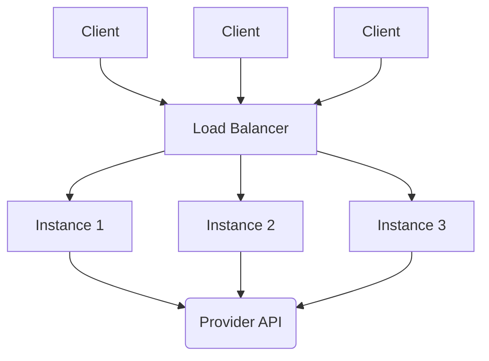
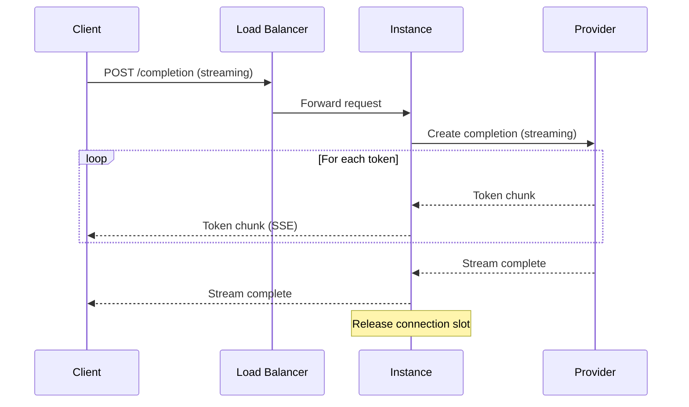

# Chapter 2 - Scaling Stateless and Streaming APIs

> LLM APIs are stateless but not simple: a single request holds a
> connection for seconds or tens of seconds, which means you size for
> concurrent connections, not requests per second.

---

## Learning Objectives

By the end of this chapter you will be able to:

- Calculate connection capacity for streaming APIs using Little's Law.
- Design a horizontal scaling strategy for stateless LLM services.
- Implement backpressure handling that prevents memory overflow without
  dropping data.
- Build graceful degradation that sheds load progressively rather than
  failing catastrophically.
- Explain why traditional request-per-second metrics mislead capacity
  planning for streaming workloads.
- Debug connection exhaustion and backpressure failures in production.

---

## The Production Story

Consider a document analysis platform serving an LLM-powered summarization
API. The system handles 200 requests per minute during business hours.
Each request streams a summary of 500-2000 tokens, taking 5-15 seconds to
complete.

The team deploys three API instances behind a load balancer. Each instance
handles 50 concurrent connections. Total capacity: 150 concurrent
connections. At 200 requests per minute (3.3 per second) with 10-second
average response time, they need 33 concurrent connections on average.
Plenty of headroom.

The product launches a batch processing feature. Enterprise customers
submit 500-document jobs that spawn 500 parallel requests. The first
customer job arrives at 2 PM.

Within 10 seconds, all 150 connection slots fill. New requests queue at
the load balancer. The queue backs up. Connection timeouts start firing.
The load balancer marks instances unhealthy because they are not responding
to health checks (all threads busy). It removes them from rotation.
Remaining instances receive more load. They fail too.

The on-call engineer restarts all instances. They come up, immediately
fill with queued requests, and become unresponsive again. The restart
loop continues for 20 minutes until someone manually drains the queue.

At the incident retro, the team reviews their metrics. Request rate never
exceeded 200/minute. Latency percentiles looked normal until the moment
of collapse. CPU and memory showed headroom. Nothing predicted the outage.

The missing metric was concurrent connections. The system was sized for
throughput but failed on concurrency.

---

## Why This Exists

Traditional APIs complete requests in milliseconds. A server handling
1000 req/s with 10ms average latency has 10 concurrent connections on
average. Connection management is invisible.

LLM APIs change this arithmetic. A streaming response that takes 10
seconds to complete holds its connection for 10 seconds. The same 1000
req/s now requires 10,000 concurrent connections. Connection management
becomes the dominant constraint.

Before streaming became standard, teams used request-response patterns:
send prompt, wait, receive complete response. This worked but created
bad user experience. A 10-second wait with no feedback feels longer than
10 seconds of streaming text. Users refreshed pages, abandoned sessions,
complained about performance.

Streaming fixed the UX but introduced infrastructure complexity. A
streaming response is a long-lived HTTP connection using chunked transfer
encoding or server-sent events. Each connection consumes server resources
for its entire duration. The server cannot recycle that connection until
the stream completes.

This creates three problems that traditional scaling does not address.

**Connection limits bind before compute.** Each instance has a maximum
number of concurrent connections, set by file descriptor limits and
thread/memory capacity. You can add CPU without adding connection capacity.
When connection capacity exhausts, requests fail even though CPU is idle.

**Load balancing loses visibility.** A load balancer distributes new
connections but cannot see how long each will last. Round-robin sends
the next request to an instance that might have 50 in-flight requests
while another has 5. Least-connections helps but introduces its own
latency as the balancer tracks connection state.

**Backpressure propagates unexpectedly.** When a client cannot consume
a stream fast enough, the server must either buffer (memory pressure),
drop (data loss), or pause (coordination overhead). Traditional APIs
complete so quickly that client-side backpressure is invisible. Streaming
APIs surface it.

---

## Core Concepts

**Stateless service.** A service where each request contains all
information needed to process it. No server-side session, no affinity
requirement. Any instance can handle any request. This enables horizontal
scaling because you can add instances without coordination.

**Horizontal scaling.** Adding capacity by running more instances of the
same service, rather than upgrading a single instance. Works linearly
for stateless services until you hit shared resources (database
connections, rate limits, network bandwidth).

**Concurrent connections.** The number of simultaneously active
connections at a point in time. For streaming APIs, this is the primary
capacity constraint. A server with 100 max connections can handle at
most 100 simultaneous streaming responses, regardless of request rate.

**Little's Law.** L = lambda * W. The average number of items in a system
(L) equals the arrival rate (lambda) times the average time in system (W).
For streaming APIs: average concurrent connections = requests per second
* average response duration in seconds.

**Backpressure.** A mechanism for a slow consumer to signal a fast
producer to slow down. Without backpressure, the producer either
overflows memory or drops data. HTTP streaming uses TCP flow control
for backpressure, but application-level buffering can mask this.

**Graceful degradation.** Intentionally reducing service quality under
load to avoid complete failure. Examples: returning cached responses,
shortening outputs, rejecting low-priority requests. The alternative
is treating all requests equally and failing all of them.

**Load shedding.** Rejecting requests during overload to protect
capacity for remaining requests. Counterintuitive but correct: serving
100 requests successfully is better than attempting 150 and failing all
of them due to cascading timeouts.

**Hysteresis.** A gap between the threshold for escalating and
de-escalating a state. Prevents oscillation when metrics hover near a
boundary. If you start shedding load at 80% CPU, you might stop at 70%,
not 79.9%.

---

## Internal Architecture

A stateless API tier for LLM workloads consists of load balancers,
API instances, and connection to downstream providers.



*Stateless API tier. Load balancer distributes requests; any instance
can serve any request; all instances connect to the same provider.*

### Connection flow for streaming

When a client initiates a streaming request:

1. Load balancer accepts the connection and selects an instance.
2. Instance reserves a connection slot, starts processing.
3. Instance opens a streaming connection to the provider.
4. Provider streams tokens back to instance.
5. Instance forwards tokens to client in real-time.
6. Stream completes; instance releases connection slot.

The instance holds two connections: one from the client, one to the
provider. Both remain open for the duration of the stream.



*Streaming request flow. Connections held open for entire response.*

### Capacity math

Given:
- Request rate: R requests per second
- Average stream duration: D seconds
- Connections per instance: C
- Target utilization: U (typically 0.7-0.8)

Required instances:

```
instances = ceil((R * D) / (C * U))
```

Example: 100 req/s, 10-second average duration, 50 connections per
instance, 70% target utilization.

```
instances = ceil((100 * 10) / (50 * 0.7))
          = ceil(1000 / 35)
          = ceil(28.6)
          = 29 instances
```

The 70% target leaves headroom for variance. Real traffic is not uniform;
some requests last longer than average. Without headroom, bursts cause
connection exhaustion even when average load is within capacity.

### Backpressure mechanism

When a client reads slowly, TCP receive buffers fill. The OS stops
acknowledging data. The sending instance's TCP send buffer fills. The
write call blocks or returns a partial write.

The instance has three choices:

1. **Block.** Wait for buffer space. This holds a thread, reducing
   capacity for other requests.
2. **Buffer.** Store data in application memory. This shifts the problem
   from TCP buffers to heap. Eventually memory exhausts.
3. **Signal.** Implement application-level backpressure. Pause the
   upstream provider stream until the client catches up.

Option 3 is correct but requires coordination. The instance must track
buffer levels and send pause/resume signals upstream. If the provider
does not support pause (most do not), the instance must buffer locally
with a bounded size and abort streams that exceed it.

---

## Production Design

**Size for concurrent connections, not RPS.** Use Little's Law. If you
expect 100 req/s with 10-second average stream time, plan for at least
1,200 concurrent connections (1,000 * 1.2 headroom).

**Set explicit connection limits.** Each instance should have a
configured maximum concurrent connections. Reject requests when at limit
rather than queuing unboundedly. A fast rejection (503) is better than
a slow timeout.

**Use least-connections load balancing.** Round-robin distributes new
connections evenly but ignores how long existing connections last. An
instance with a backlog of long-running streams receives more load while
another sits idle. Least-connections routes to the instance with fewest
active connections.

**Implement graceful degradation.** Define levels: normal, shed-new,
shed-streaming, emergency. Each level has specific actions. Escalate
based on CPU and queue depth. De-escalate with hysteresis.

```ts
// examples/ch02-scaling-apis/src/degradation.ts

const DEFAULT_DEGRADATION_CONFIG: DegradationConfig = {
  cpuThresholds: {
    shedNew: 70,
    shedStreaming: 85,
    emergency: 95,
  },
  queueThresholds: {
    shedNew: 100,
    shedStreaming: 200,
    emergency: 500,
  },
  recoveryHysteresis: 10,
};
```

**Bound all buffers.** Any buffer that can grow unbounded will eventually
cause OOM. Set explicit maximums on request queues, response buffers,
and streaming buffers. When the limit is reached, reject or abort rather
than grow.

**Monitor these metrics:**

| Metric | Why it matters | Alert threshold |
| --- | --- | --- |
| `concurrent_connections` | Primary capacity constraint | >80% of limit |
| `connection_wait_time` | Time in queue before processing | >1s p50 |
| `stream_duration_p99` | Long-tail capacity consumption | >2x average |
| `backpressure_pauses` | Slow client events | >10/min sustained |
| `load_shed_rate` | Degradation activation | >5% of requests |

---

## Failure Scenarios

### Failure: connection exhaustion cascade

**Symptom.** All instances become unresponsive simultaneously. Health
checks fail. Load balancer removes all instances. New instances added
immediately become unresponsive.

**Mechanism.** A burst of long-running requests fills all connection
slots across all instances. Queued requests accumulate. When instances
process queued requests, they immediately fill again. The queue never
drains because incoming rate exceeds completion rate.

**Detection.** `concurrent_connections` at 100% across all instances.
Request queue growing without bound. Health check failures.

**Mitigation.** Drain the queue: stop accepting new requests until
in-flight requests complete. This requires a circuit breaker or manual
intervention. Restarting instances does not help because they refill
from the queue.

**Prevention.** Bound queue depth. Reject requests when queue exceeds
limit. This pushes backpressure to the client, which can retry with
exponential backoff.

### Failure: slow client memory exhaustion

**Symptom.** Instance memory grows over time. Eventually OOM kill or
extreme GC pauses. Other requests on the same instance affected.

**Mechanism.** A client with slow network or paused consumption causes
response buffers to grow. If the application buffers data waiting for
the client, memory accumulates. Multiple slow clients multiply the
effect.

**Detection.** Memory growth correlated with specific client connections.
`backpressure_pause_duration` increasing.

**Mitigation.** Abort connections with excessive buffer accumulation.
Return 408 Request Timeout or close the stream with an error.

**Prevention.** Implement bounded buffers with abort-on-overflow. Use
high/low water marks: pause production at high water, resume at low
water, abort if paused too long.

### Failure: health check false negative

**Symptom.** Load balancer removes healthy instances. Remaining instances
overload. Cascade failure despite having capacity.

**Mechanism.** Health check endpoint shares connection pool with request
handling. Under load, no connection slot available for health check.
Health check times out. Load balancer marks instance unhealthy.

**Detection.** Instances removed from rotation with healthy CPU, memory,
and actual request processing. Health check timeout logs.

**Mitigation.** Manually re-add instances to rotation after verifying
they are actually healthy.

**Prevention.** Reserve connection slots for health checks. Or use a
separate port for health checks that does not share the connection pool.

### Failure: thundering herd on recovery

**Symptom.** After an outage, recovered capacity immediately overloads
and fails again. Cycle repeats.

**Mechanism.** During outage, requests queued at client side or load
balancer. When capacity recovers, all queued requests arrive
simultaneously. Volume exceeds steady-state capacity.

**Detection.** Request spike at recovery time. Connection saturation
within seconds of coming online.

**Mitigation.** Add capacity gradually. Bring up instances in stages,
allowing queued requests to drain between stages.

**Prevention.** Implement admission control that ramps up gradually.
Start with 10% of normal connection limit, increase by 10% every 30
seconds until at target.

---

## Scaling Strategy

Things break in a specific order as load grows.

**First: connection limits, around 100-500 concurrent per instance.**
Each instance has a maximum based on file descriptors, threads, and
memory. When reached, new requests must queue or reject. This is the
first constraint hit for streaming APIs.

**Second: provider rate limits, varies by tier.** The provider API has
its own concurrency and rate limits. If all your instances combined
exceed the provider limit, you get 429 errors regardless of local
capacity.

**Third: CPU from request processing, around 70-85% utilization.** If
your preprocessing or postprocessing is compute-heavy, CPU saturates
before connection limits. Monitor CPU to understand your bottleneck.

**Fourth: memory from buffering, varies by buffer config.** Slow clients
and large responses accumulate in buffers. If you allow unbounded
buffering, memory exhausts before other limits.

**Fifth: network bandwidth, around 1-10 Gbps per instance.** Streaming
responses are smaller than typical API payloads, so bandwidth is rarely
the first limit. But at high concurrency with verbose responses, network
can saturate.

For horizontal scaling, the pattern is:

1. Add instances to increase connection capacity.
2. Coordinate provider rate limits across instances.
3. Add buffering capacity carefully with bounds.
4. Add network capacity only after optimizing payloads.

---

## Trade-offs

| Decision | Buys you | Costs you | Choose when |
| --- | --- | --- | --- |
| Streaming responses | Better UX, time-to-first-token | Connection held longer, complexity | User-facing applications |
| Request-response | Simpler infrastructure | Worse perceived latency | Batch/background processing |
| Aggressive load shedding | Protects existing requests | Higher rejection rate | Peak traffic with SLO requirements |
| Conservative shedding | Higher throughput | Risk of cascade failure | Steady traffic, overprovisioned |
| Bounded buffers | Predictable memory | Aborts slow clients | Always |
| Unbounded buffers | Never aborts | OOM risk | Never |
| Least-connections LB | Even distribution | LB state overhead | Streaming workloads |
| Round-robin LB | Simple, stateless | Uneven distribution | Non-streaming workloads |
| High hysteresis | Fewer level transitions | Slower response to change | Bursty traffic |
| Low hysteresis | Faster adaptation | Oscillation risk | Steady traffic |

---

## Code Walkthrough

From `examples/ch02-scaling-apis/`. Pure TypeScript simulations of
production behavior.

### Horizontal scaling with load balancing

```ts
// examples/ch02-scaling-apis/src/scaling.ts

export class APIInstance {
  private config: InstanceConfig;
  private currentConcurrency: number;
  private metrics: InstanceMetrics;

  constructor(config: InstanceConfig) {
    this.config = config;
    this.currentConcurrency = 0;
    this.metrics = {
      instanceId: config.id,
      requestsProcessed: 0,
      requestsRejected: 0,
      // ...
    };
  }

  canAccept(): boolean {
    return this.currentConcurrency < this.config.maxConcurrency;  // (1)
  }

  async process(request: APIRequest): Promise<APIResponse> {
    if (!this.canAccept()) {
      this.metrics.requestsRejected++;                             // (2)
      return { status: 'rejected', /* ... */ };
    }

    this.currentConcurrency++;                                     // (3)
    // ... processing ...
    this.currentConcurrency--;
    return { status: 'success', /* ... */ };
  }
}
```

1. Connection limit enforced per instance. Explicit check, not implicit
   queue growth.
2. Rejection tracked as a metric. This surfaces load shedding in
   dashboards.
3. Concurrency counter tracks active connections for load balancer
   visibility.

### Backpressure with high/low water marks

```ts
// examples/ch02-scaling-apis/src/backpressure.ts

export class BackpressureBuffer {
  private config: BackpressureConfig;
  private buffer: string[];
  private bufferSize: number;
  private isPaused: boolean;

  write(chunk: string): BackpressureSignal | null {
    const chunkSize = Buffer.byteLength(chunk, 'utf8');

    if (this.bufferSize + chunkSize > this.config.maxBufferSize) {
      return { type: 'abort', reason: 'Buffer overflow' };        // (1)
    }

    this.buffer.push(chunk);
    this.bufferSize += chunkSize;

    if (!this.isPaused && this.bufferSize >= this.config.highWaterMark) {
      this.isPaused = true;                                        // (2)
      return { type: 'pause', reason: 'High water mark' };
    }

    return null;
  }

  read(): { chunk: string | null; signal: BackpressureSignal | null } {
    // ... remove from buffer ...

    if (this.isPaused && this.bufferSize <= this.config.lowWaterMark) {
      this.isPaused = false;                                       // (3)
      return { chunk, signal: { type: 'resume' } };
    }

    return { chunk, signal: null };
  }
}
```

1. Hard limit on buffer size. Abort rather than OOM.
2. Pause production at high water mark. Producer must check and stop.
3. Resume at low water mark. Hysteresis between pause and resume points
   prevents oscillation.

### Graceful degradation controller

```ts
// examples/ch02-scaling-apis/src/degradation.ts

export class DegradationController {
  private currentLevel: DegradationLevel;

  updateHealth(
    cpuUtilization: number,
    memoryUtilization: number,
    queueDepth: number
  ): DegradationLevel {
    const newLevel = this.calculateLevel(cpuUtilization, queueDepth);

    if (this.shouldTransition(this.currentLevel, newLevel)) {      // (1)
      this.currentLevel = newLevel;
    }

    return this.currentLevel;
  }

  private shouldTransition(current, proposed): boolean {
    // Escalation is immediate
    if (proposed > current) return true;                           // (2)

    // De-escalation requires hysteresis
    const hysteresis = this.config.recoveryHysteresis;
    // ... check thresholds minus hysteresis ...                   // (3)
  }

  shouldAccept(request: APIRequest): { accept: boolean; degraded: boolean } {
    switch (this.currentLevel) {
      case 'none': return { accept: true, degraded: false };
      case 'shed-new': return this.shedNewRequests(request);       // (4)
      case 'shed-streaming': return { accept: !request.streaming, degraded: true };
      case 'emergency': return { accept: false, degraded: false };
    }
  }
}
```

1. State machine with explicit transitions. Current level persists across
   health updates.
2. Escalation happens immediately when thresholds crossed. Safety first.
3. De-escalation requires metrics to fall below threshold minus
   hysteresis. Prevents oscillation near boundaries.
4. Different levels have different shedding policies. Shed-new rejects
   some new requests. Shed-streaming rejects all streaming requests.

---

## Hands-On Lab

**Goal:** observe horizontal scaling, backpressure, and graceful
degradation. About 3 seconds of runtime, Node 22.6+, no dependencies.

```bash
cd examples/ch02-scaling-apis
node scripts/lab.mjs
```

That runs all twelve steps and asserts thirty-five claims.

**Step 1 - horizontal scaling.**

Run throughput tests with 1, 2, and 4 instances. Observe that throughput
scales linearly. The ratio between 2 and 1 instances is approximately
2.0, accounting for coordination overhead.

**Step 2-4 - stateless processing and load balancing.**

Verify that instances process independently, load balancer distributes
across instances, and connection limits reject excess requests.

**Step 5-6 - streaming connection management.**

Demonstrate that streaming connections are held for the duration of the
response. Calculate connection capacity: 100 req/s with 10-second
responses requires 1,000 connections.

**Step 7-8 - backpressure.**

Simulate a slow consumer (consumes at 25% of production rate). Observe
pause/resume signals coordinating producer and consumer. Verify all
chunks delivered despite speed mismatch. Demonstrate overflow prevention.

**Step 9-11 - graceful degradation.**

Simulate increasing load. Observe degradation levels escalating from
`none` to `shed-new` to `shed-streaming` to `emergency`. Verify
hysteresis prevents immediate de-escalation. Observe priority shedding
protecting high-priority requests.

**Step 12 - metrics.**

Verify that instance metrics (requests processed, tokens, latency) are
tracked correctly.

---

## Interview Questions

1. Why do LLM APIs require different scaling strategies than traditional
   REST APIs?

2. A system handles 100 req/s with average 10-second streaming responses.
   Each instance supports 50 concurrent connections. How many instances
   do you need at 70% target utilization?

3. Your streaming API has healthy CPU and memory but requests are timing
   out. What is the likely cause?

4. Explain why round-robin load balancing works poorly for streaming
   workloads.

5. A slow client causes your server to buffer responses. What happens
   if you do not bound the buffer?

6. Design a graceful degradation strategy for an AI assistant with
   both chat and summarization features.

7. After an outage, recovered instances immediately fail again. What
   is happening and how do you prevent it?

8. What is hysteresis in the context of load shedding, and why is it
   important?

9. Your load balancer health checks are failing even though instances
   can process requests. What is the likely cause?

10. How do you calculate connection capacity for a streaming API, and
    what headroom factor do you apply?

---

## Staff-Level Answers

**Q2 - capacity calculation.** Using Little's Law:

```
required_connections = request_rate * avg_duration
                     = 100 * 10
                     = 1000 concurrent connections

required_instances = required_connections / (connections_per_instance * utilization)
                   = 1000 / (50 * 0.7)
                   = 1000 / 35
                   = 28.6

Round up: 29 instances
```

The staff addition: 70% target utilization leaves 30% headroom for
variance. Real traffic has bursts; some responses last 20 seconds, not
10. Without headroom, a 20% traffic spike causes connection exhaustion.
The 29 instances handle the average; headroom handles the variance.

**Q3 - timeouts with healthy metrics.** Connection exhaustion. All
connection slots are occupied by in-flight requests. New requests
queue at the load balancer. When the queue depth exceeds the timeout,
requests fail.

The tell: CPU and memory are normal, but `concurrent_connections` is
at 100% and `connection_wait_time` is high. The fix: add instances to
increase connection capacity, or reduce response duration.

**Q5 - unbounded buffer.** Memory grows until OOM. The process is killed.
All in-flight requests fail, not just the slow client's request. If
multiple slow clients exist, memory grows faster.

The fix: bounded buffers with abort-on-overflow. Set a maximum buffer
size. When reached, abort the stream for that client. One slow client
loses their connection; others are unaffected.

This seems harsh, but the alternative is worse. Allowing unbounded
growth protects the slow client at the expense of all other clients.
Aborting the slow client protects everyone else.

**Q7 - recovery failure loop.** Thundering herd. During outage, requests
accumulated in client-side queues or at the load balancer. When capacity
returned, all queued requests arrived simultaneously. The volume exceeded
steady-state capacity.

Prevention: admission control with gradual ramp-up. When an instance
starts, accept only 10% of normal capacity. Increase by 10% every 30
seconds. The queue drains gradually. If the queue is smaller than
ramp-up capacity, normal traffic flows by the time you reach 100%.

The staff addition: client-side changes help too. Clients should use
exponential backoff with jitter. If they all retry after exactly 30
seconds, you get a thundering herd every 30 seconds. Jitter spreads
retries over time.

**Q8 - hysteresis.** Hysteresis is the gap between the threshold for
entering a state and the threshold for leaving it. If you start
shedding load at 80% CPU, you might continue shedding until CPU drops
to 70%, not 79%.

Why it matters: metrics fluctuate. Without hysteresis, if CPU oscillates
between 79% and 81%, you rapidly enter and exit shedding mode. Each
transition has overhead (logging, state changes, maybe different code
paths). Rapid oscillation wastes resources and creates confusing logs.

With 10% hysteresis: enter shedding at 80%, exit at 70%. CPU oscillating
between 79% and 81% does not cause oscillation. You stay in whichever
state you were in until the metric moves decisively.

---

## Exercises

1. **Capacity planning.** Your API will serve 50 req/s with average
   20-second streaming responses. Instances support 100 concurrent
   connections. Calculate required instances at 80% utilization. Add
   the calculation to the lab as an assertion.

2. **Adaptive load shedding.** The current degradation controller uses
   fixed thresholds. Modify it to adapt thresholds based on recent
   performance. If p99 latency increases, lower the shedding threshold.

3. **Connection draining.** Implement graceful shutdown. When an instance
   receives SIGTERM, stop accepting new connections but complete in-flight
   requests. Add a timeout after which remaining connections are aborted.

4. **Circuit breaker.** Add a circuit breaker that opens when error rate
   exceeds 50%. While open, reject all requests immediately. After 30
   seconds, allow one request through (half-open). If it succeeds, close
   the circuit.

5. **Provider backpressure.** The simulation does not model provider
   rate limits. Add a shared rate limiter that all instances check
   before calling the provider. Observe what happens when you exceed
   the provider limit.

---

## Further Reading

- **"Little's Law" (John Little, 1961)** - The original paper is short
  and accessible. Understanding L = lambda * W is fundamental to
  capacity planning.

- **"Release It!" by Michael Nygard** - The canonical book on stability
  patterns. Chapters on circuit breakers, bulkheads, and timeouts
  directly apply to API scaling.

- **AWS "Building Well-Architected serverless applications"** - Despite
  the serverless framing, the sections on concurrency and throttling
  apply to any API tier.

- **"Backpressure explained" (reactive.io)** - Clear explanation of
  backpressure in streaming systems. The reactive streams specification
  is more formal but this is more accessible.

- **Envoy load balancing documentation** - Practical comparison of
  round-robin, least-connections, and other algorithms. Includes
  discussion of when each applies.

- **"Overload Control for Scaling WeChat Microservices"** - Production
  experience with graceful degradation at scale. The DAGOR algorithm
  is sophisticated but the paper explains the simpler building blocks
  well.
