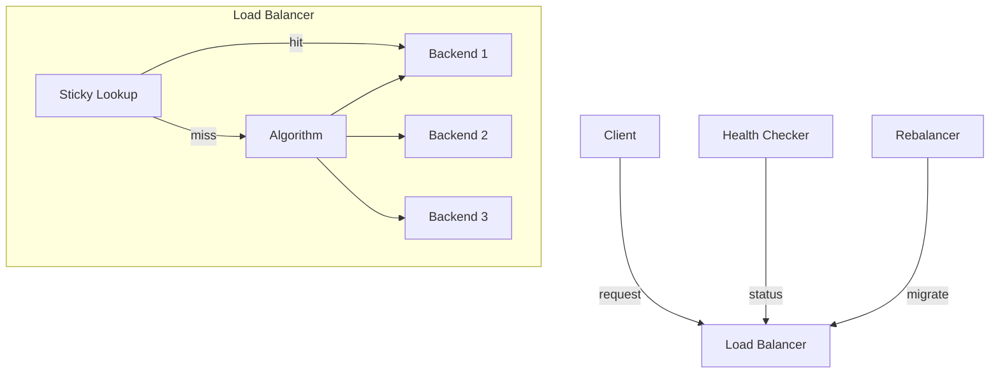
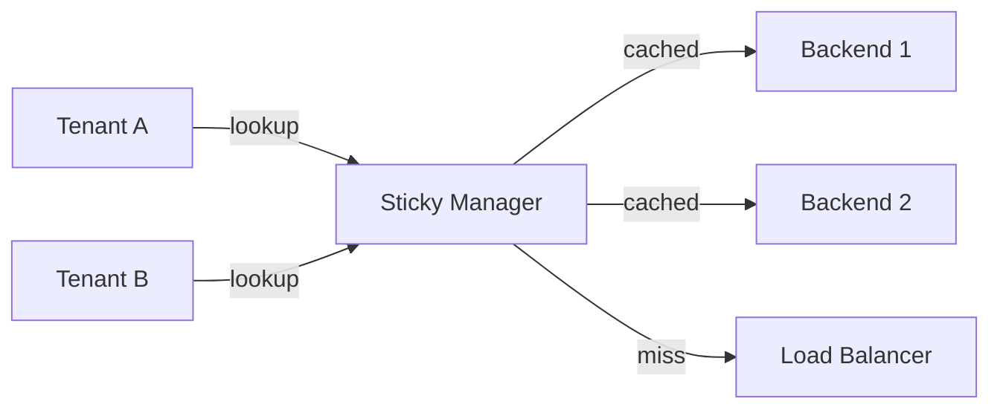

# Chapter 3 - Load Balancing Long-Lived Connections

> Traditional load balancers optimize for short-lived HTTP requests.
> LLM workloads break their assumptions: requests take 2-40 seconds,
> connections persist for streaming, and mid-stream failures lose all
> generated tokens.

---

## Learning Objectives

By the end of this chapter you will be able to:

- Explain why round-robin load balancing fails for LLM workloads and
  identify which algorithm to use instead.
- Implement least-connections selection that naturally adapts to
  variable request durations.
- Design health checking that detects slow backends, not just failed
  ones.
- Configure sticky sessions for stateful conversations and explain
  the imbalance tradeoff.
- Implement graceful connection rebalancing that migrates connections
  without dropping in-flight requests.
- Debug the three most common load balancing failures in LLM
  infrastructure.

---

## The Production Story

Consider a conversational AI platform handling 2,000 concurrent users
across three backend instances. Each backend runs inference on a
mid-tier model, with p50 latency of 3 seconds and p99 of 25 seconds.
The team deploys a standard round-robin load balancer.

For the first week, everything looks healthy. Monitoring shows even
request distribution: each backend handles roughly 667 users. Error
rates are zero. Latency percentiles match expectations.

Then a product launch drives traffic up 3x. Instead of graceful
degradation, the system collapses asymmetrically. Backend-1 shows 40%
error rate while backends 2 and 3 show 5%. Users report inconsistent
behavior: sometimes fast, sometimes timeouts, sometimes errors.

The on-call engineer scales to six backends. The problem gets worse.
Now two backends are overloaded, two are underloaded, and two are
normal. The load balancer distributes requests evenly by count, but
not by duration.

The root cause: a subset of users are running long-running
summarization tasks that hold connections for 30+ seconds. Round-robin
sends these evenly, but they finish at different times. A backend that
received three 30-second requests in a row has 90 seconds of work
queued while another backend that received three 2-second requests
finished in 6 seconds. By request count, they are equal. By load, one
is 15x busier.

The engineer switches to least-connections. The algorithm is simple:
send each new request to the backend with the fewest active
connections. A backend finishing work quickly has fewer active
connections and receives more new requests. A backend stuck on slow
requests has many active connections and receives fewer new requests.
The system naturally balances.

But then the dashboard shows a new problem. Session continuity errors
spike. Users report that the AI "forgot" what they were talking about.
The product team escalates.

---

## Why This Exists

Load balancing is not new. The problem has been solved for decades for
traditional web traffic. But LLM inference changes three assumptions
that load balancers depend on.

**Request duration variance is extreme.** A traditional web request
completes in 10-200ms. An LLM request completes in 500ms to 60
seconds, depending on prompt complexity, output length, and model
size. Round-robin distributes requests evenly by count, not by
duration. When durations vary by 100x, even distribution by count
creates severe imbalance.

**Connections are long-lived.** Streaming responses hold HTTP
connections open until the full response completes. A 30-second
streaming response is one open connection for 30 seconds. A load
balancer that makes routing decisions per-request cannot rebalance
mid-stream. Once a request starts, it stays on that backend.

**Mid-stream failure is expensive.** Dropping a traditional HTTP
request costs a retry and 50ms of user-perceived latency. Dropping an
LLM request costs all generated tokens (real dollars) and 10-30
seconds of user wait time that produces nothing. Graceful handling of
backend failures during streaming is critical.

Before the current generation of LLM infrastructure, teams either
ignored these problems (and suffered the consequences) or built custom
load balancing logic into their application layer. Neither approach
scales. The infrastructure layer needs to understand long-lived
connections natively.

---

## Core Concepts

**Connection-based vs request-based balancing.** Request-based
balancing routes each HTTP request independently. Connection-based
balancing routes at the connection level, keeping all requests on a
persistent connection on the same backend. LLM streaming requires
connection-based routing because the response is one long connection.

**Least-connections algorithm.** Route each new request to the backend
with the fewest active connections. Naturally adapts to variable
request duration: fast backends have fewer active connections and
receive more traffic.

**Sticky sessions.** A mapping from client identifier to backend. All
requests from the same client route to the same backend. Preserves
stateful context like conversation history. Creates imbalance over
time as traffic patterns vary.

**Slow backend detection.** A backend that responds successfully but
slowly is still degrading user experience. Health checks must measure
latency, not just success. A backend with p99 latency of 60 seconds
should be removed from rotation even if it returns no errors.

**Connection draining.** When a backend is removed (for maintenance,
failure, or rebalancing), existing connections should complete before
new connections are rejected. Draining allows in-flight requests to
finish without dropping tokens.

**Graceful rebalancing.** Moving connections between backends without
dropping them. The process: stop sending new requests to the
connection, wait for in-flight requests to complete, reconnect to the
new backend. The connection migrates without the client seeing an
error.

---

## Internal Architecture

A load balancer for LLM workloads has four components: the selection
algorithm, health checking, sticky session management, and the
rebalancing controller.



*Client requests first check sticky sessions, then fall through to the
selection algorithm. Health checking and rebalancing operate
asynchronously.*

### Selection algorithms

**Round-robin** assigns backends in sequence. Simple, deterministic,
and wrong for variable-duration workloads. Use only when request
durations are uniform (within 2x of each other).

**Weighted round-robin** extends round-robin with weights per backend.
A backend with weight 5 receives 5x the traffic of a backend with
weight 1. Use when backends have different capacities (different
hardware, different model sizes).

**Least-connections** picks the backend with fewest active
connections. Automatically adapts to variable duration and variable
backend speed. This is the default choice for LLM workloads.

```ts
// examples/ch03-load-balancing/src/balancer.ts

private selectLeastConnections(backends: Backend[]): Backend {
  let selected = backends[0];
  let minConnections = selected.activeConnections;

  for (let i = 1; i < backends.length; i++) {
    const backend = backends[i];
    // Tie-break by total latency (prefer faster backends)
    if (
      backend.activeConnections < minConnections ||
      (backend.activeConnections === minConnections &&
        this.avgLatency(backend) < this.avgLatency(selected))
    ) {
      selected = backend;
      minConnections = backend.activeConnections;
    }
  }

  return selected;
}
```

1. Start with the first healthy backend as the candidate.
2. Compare each backend's active connection count.
3. On tie, prefer the backend with lower average latency.
4. Return the backend with the minimum active connections.

### Health checking

Traditional health checks verify that a backend responds at all.
For LLM workloads, this is insufficient. A backend returning 200 OK
with 45-second latency is technically healthy but degrading the
system.

LLM-aware health checking tracks both success and latency. A backend
exceeding the slow threshold is marked degraded even if it returns
no errors.

```ts
// examples/ch03-load-balancing/src/health.ts

recordResult(result: HealthCheckResult): boolean {
  const state = this.states.get(result.backendId);
  if (!state) return false;

  if (result.healthy) {
    state.consecutiveFailures = 0;
    state.consecutiveSuccesses++;

    // Check for slow response
    if (result.latencyMs > this.config.slowThresholdMs) {
      state.slowResponses++;
    } else {
      state.slowResponses = Math.max(0, state.slowResponses - 1);
    }
    // ...
  }
}
```

1. Success resets the failure counter.
2. Slow responses increment a separate counter.
3. Fast responses decrement the slow counter (recovery).
4. A backend can be healthy (no errors) but slow (degraded).

### Sticky session management

Sticky sessions map client identifiers to backends. The identifier can
be a tenant ID, session ID, IP address, or cookie value. The mapping
persists until the session expires or the backend becomes unavailable.



*Sticky manager checks cache first. Hits return the cached backend.
Misses fall through to the load balancer.*

The tradeoff: sticky sessions create imbalance. If tenant-A sends 10x
more traffic than tenant-B, and both map to the same backend, that
backend is overloaded. The solution is rebalancing, covered next.

### Connection rebalancing

Long-lived connections accumulate imbalance over time. Rebalancing
fixes this by migrating connections from overloaded backends to
underloaded ones. The challenge is migrating without dropping
in-flight requests.

The rebalancing process:

1. Calculate imbalance (coefficient of variation of connection counts)
2. If imbalance exceeds threshold, identify migrations
3. For each migration: drain the connection, then move it
4. Draining: stop new requests, wait for in-flight to complete
5. After drain completes: reconnect to new backend

```ts
// examples/ch03-load-balancing/src/rebalance.ts

rebalance(): RebalanceResult {
  const imbalanceBefore = this.calculateImbalance();
  const migrations = this.identifyMigrations();

  let completed = 0;

  for (const m of migrations) {
    if (this.startDrain(m.connId, m.to)) {
      if (this.completeMigration(m.connId)) {
        completed++;
      }
    }
  }

  return {
    migrationsCompleted: completed,
    imbalanceBefore,
    imbalanceAfter: this.calculateImbalance(),
    // ...
  };
}
```

1. Measure imbalance before rebalancing.
2. Identify which connections to migrate (from overloaded to underloaded).
3. Drain each connection (stop new requests, wait for completion).
4. Complete migration (move to new backend).
5. Measure imbalance after to verify improvement.

---

## Production Design

**Use least-connections as the default algorithm.** Unless you have
measured request durations and confirmed they are uniform (p99/p50 < 2),
least-connections is the safest choice. It requires no tuning and
adapts automatically.

**Set health check slow threshold to p99 * 2.** If your expected p99
latency is 25 seconds, set the slow threshold to 50 seconds. This
catches backends that are meaningfully degraded without false positives
on normal tail latency.

**Configure sticky session TTL to match conversation timeout.** If
conversations timeout after 30 minutes of inactivity, set sticky
session TTL to 30 minutes. Longer wastes memory on stale sessions.
Shorter causes mid-conversation backend switches.

**Enable rebalancing with a 0.3 imbalance threshold.** A coefficient
of variation of 0.3 means standard deviation is 30% of the mean. Below
this, imbalance is not worth the migration cost. Above this, action
is warranted.

**Set drain timeout to max request duration * 2.** If your longest
requests take 60 seconds, set drain timeout to 120 seconds. This gives
slow requests time to complete. Shorter timeouts drop in-flight
requests.

**Monitor these metrics:**

| Metric | Why it matters | Alert threshold |
| --- | --- | --- |
| Connection imbalance | High imbalance = some backends overloaded | CV > 0.5 |
| Drain timeout rate | Timeouts mean requests being dropped | > 1% of drains |
| Sticky session hit rate | Low hit rate = wasted affinity | < 80% for stateful workloads |
| Backend slow rate | Degraded backends still in rotation | > 10% of checks |
| In-flight during migration | Lost tokens if migration fails | Should be 0 |

---

## Failure Scenarios

### Failure: cascading overload from slow backend

**Symptom.** One backend shows 100% CPU and increasing latency. Other
backends gradually follow. User errors spike across all backends.

**Mechanism.** A backend became slow (GC, memory pressure, model
loading). Round-robin kept sending it equal traffic. Its connection
count grew. Clients waiting for responses held open connections,
reducing the connection pool available for other backends. Eventually,
connection pools exhausted everywhere.

**Detection.** Per-backend connection count diverging from mean.
Backend latency p99 exceeding threshold. Connection pool exhaustion
warnings.

**Mitigation.** Switch to least-connections if not already. Remove the
slow backend from rotation. If least-connections is already active,
check if health checking is enabled and if slow threshold is correctly
set.

**Prevention.** Use least-connections. Enable slow backend detection.
Set aggressive slow thresholds (2x p99). Monitor connection imbalance
as a leading indicator.

### Failure: session continuity loss after scale event

**Symptom.** After adding new backends, users report AI "forgetting"
conversation context. No errors in logs. Latency normal.

**Mechanism.** New backends have no sticky session mappings. Traffic
redistributes to include new backends. Mid-conversation requests hit
new backends that have no context. The conversation continues on a
different backend with empty history.

**Detection.** Sticky session miss rate spikes after scale event.
User-reported context loss correlated with scaling timeline.

**Mitigation.** For active conversations, manually migrate sessions to
maintain affinity. Increase sticky session TTL during scale events.

**Prevention.** Use consistent hashing for session distribution so
adding backends does not remap all sessions. Implement session
state replication or external session storage so any backend can
resume any conversation.

### Failure: rebalancing during traffic spike

**Symptom.** Rebalancing triggers during high traffic. Migrations
timeout. Users see errors and high latency simultaneously.

**Mechanism.** Traffic spike caused imbalance (some backends slow,
some fast). Rebalancer detected imbalance and started migrations.
Drain waited for in-flight requests, but new requests kept arriving.
Drain never completed. Timeout hit. Connections dropped.

**Detection.** Drain timeout rate spikes. Correlation with traffic
spike timeline. Rebalancer log shows migrations started but not
completed.

**Mitigation.** Disable rebalancing during incident. Let traffic spike
subside. Resume rebalancing after.

**Prevention.** Add traffic rate as a rebalancing gate: do not
rebalance if current QPS exceeds threshold. Rebalancing is a
maintenance operation, not an incident response.

---

## Scaling Strategy

Things break in a specific order as traffic grows.

**First: connection pool exhaustion, around 10,000 concurrent
connections.** Each backend has a connection limit. As traffic grows,
connection pools fill. New requests queue. Latency increases. The fix
is more backends or larger connection pools, but larger pools risk
memory exhaustion.

**Second: sticky session storage, around 100,000 active sessions.**
If sessions are stored in memory, the load balancer needs RAM. At
1KB per session and 100,000 sessions, that is 100MB. At 1 million
sessions, 1GB. The fix is external session storage (Redis) with TTL
eviction.

**Third: health check overhead, around 50 backends.** Each backend
gets health checked every 5 seconds. With 50 backends, that is 10
health checks per second. With 200 backends, 40 per second. The checks
themselves become traffic. The fix is hierarchical health checking:
health check representatives that aggregate backend status.

**Fourth: rebalancing coordination, around 100 backends.** Identifying
migrations requires comparing all backend connection counts.
Coordinating migrations requires locks to prevent conflicting moves.
At scale, rebalancing becomes a distributed coordination problem. The
fix is sharded rebalancing: divide backends into groups, rebalance
each group independently.

---

## Trade-offs

| Decision | Buys you | Costs you | Choose when |
| --- | --- | --- | --- |
| Round-robin | Simplicity | Imbalance under variable latency | Request durations uniform |
| Least-connections | Auto-adaptation | Slightly more bookkeeping | Request durations vary (default) |
| Weighted | Capacity-aware | Manual weight tuning | Backends have different specs |
| Sticky sessions | Context preservation | Imbalance over time | Stateful conversations |
| No sticky | Even distribution | Context loss | Stateless requests only |
| Aggressive rebalancing | Tight balance | Migration overhead | Imbalance is expensive |
| Conservative rebalancing | Stability | Accepts some imbalance | Migrations are expensive |
| Fast health checks (1s) | Quick failure detection | Network overhead | Failures must be caught fast |
| Slow health checks (30s) | Low overhead | Slow failure detection | Backends are stable |

---

## Code Walkthrough

From `examples/ch03-load-balancing/`. All components are implemented
in pure TypeScript to model behavior without external dependencies.

### Load balancer with least-connections

```ts
// examples/ch03-load-balancing/src/balancer.ts

export class LoadBalancer {
  private backends: Map<string, Backend>;
  private config: BalancerConfig;

  select(): SelectionResult {
    const healthy = this.getHealthyBackends();

    if (healthy.length === 0) {
      return {
        backend: null,
        reason: 'no_healthy_backends',
        // ...
      };
    }

    let backend: Backend;

    switch (this.config.algorithm) {
      case 'round-robin':
        backend = this.selectRoundRobin(healthy);
        break;
      case 'least-connections':
        backend = this.selectLeastConnections(healthy);
        break;
      // ...
    }

    return { backend, reason: this.config.algorithm, /* ... */ };
  }

  recordConnectionStart(backendId: string): void {
    const backend = this.backends.get(backendId);
    if (backend) {
      backend.activeConnections++;
    }
  }

  recordConnectionEnd(backendId: string, latencyMs: number): void {
    const backend = this.backends.get(backendId);
    if (backend) {
      backend.activeConnections--;
      backend.totalLatencyMs += latencyMs;
    }
  }
}
```

1. `select()` chooses from healthy backends only.
2. Algorithm selection is configurable at runtime.
3. Connection start/end updates active connection count.
4. Latency tracking enables tie-breaking by speed.

### Health checker with slow detection

```ts
// examples/ch03-load-balancing/src/health.ts

export class HealthChecker {
  isHealthy(backendId: string): boolean {
    const state = this.states.get(backendId);
    return state?.healthy ?? false;
  }

  isSlow(backendId: string): boolean {
    const state = this.states.get(backendId);
    if (!state) return false;
    return state.slowResponses >= 2;
  }
}
```

1. `isHealthy()` tracks consecutive failures.
2. `isSlow()` is separate from healthy - a backend can be both.
3. Slow detection uses a separate counter from health.
4. Applications can use both signals for routing decisions.

### Sticky session manager

```ts
// examples/ch03-load-balancing/src/sticky.ts

export class StickySessionManager {
  lookup(key: string): StickyResult {
    const session = this.sessions.get(key);

    if (!session) {
      return { hit: false, /* ... */ };
    }

    // Check TTL
    if (Date.now() - session.lastAccessedAt > this.config.ttlMs) {
      this.sessions.delete(key);
      return { hit: false, /* ... */ };
    }

    const backend = this.backendLookup.get(session.backendId);

    if (!backend?.healthy) {
      return { hit: true, fallback: true, /* ... */ };
    }

    session.lastAccessedAt = Date.now();
    return { hit: true, backend, fallback: false };
  }
}
```

1. Session lookup returns hit/miss status.
2. TTL is checked on access (passive expiration).
3. Unhealthy backend triggers fallback signal.
4. Last-accessed time updates on hit (for LRU eviction).

### Connection rebalancer

```ts
// examples/ch03-load-balancing/src/rebalance.ts

export class ConnectionRebalancer {
  identifyMigrations(): Array<{ connId: string; from: string; to: string }> {
    const imbalance = this.calculateImbalance();
    if (imbalance < this.config.imbalanceThreshold) return [];

    const sorted = [...healthyBackends].sort(
      (a, b) => b.activeConnections - a.activeConnections
    );

    const overloaded = sorted[0];
    const underloaded = sorted[sorted.length - 1];

    // Find connections to migrate from overloaded to underloaded
    return candidateConnections.map((c) => ({
      connId: c.id,
      from: overloaded.id,
      to: underloaded.id,
    }));
  }

  startDrain(connId: string, targetBackendId: string): boolean {
    const conn = this.connections.get(connId);
    conn.state = 'draining';
    conn.migrationTarget = targetBackendId;
    return true;
  }

  completeMigration(connId: string): boolean {
    const conn = this.connections.get(connId);
    // Update connection to new backend
    conn.backendId = conn.migrationTarget;
    conn.state = 'active';
    return true;
  }
}
```

1. Imbalance calculated as coefficient of variation.
2. Migrations go from most-loaded to least-loaded backend.
3. Draining sets state and records target.
4. Completion updates backend assignment atomically.

---

## Hands-On Lab

**Goal:** observe load balancing algorithms, health checking, sticky
sessions, and rebalancing in action. About 1 second of runtime,
Node 22.6+, no dependencies.

```bash
cd examples/ch03-load-balancing
node scripts/lab.mjs
```

That runs all nine steps and asserts thirty-four claims. The rest of
this section explains what it is checking and why.

**Step 1 - round-robin distributes evenly.**

Send 300 requests through a round-robin balancer with 3 backends.

Observed: exactly 100 requests per backend. Round-robin is
deterministic and perfectly even by count.

**Step 2 - weighted round-robin respects weights.**

Configure weights 5:3:2 across three backends. Send 1,000 requests.

Observed: distribution approximately 50%, 30%, 20%. Weighted
round-robin respects the configured ratios.

**Step 3 - least-connections handles variable latency.**

Create two backends. Simulate fast backend completing 8 of 10
connections while slow backend completes only 2.

Observed: next 10 requests route to the fast backend (it has fewer
active connections). Least-connections naturally prefers available
capacity.

**Step 4 - health checks detect slow backends.**

Configure slow threshold of 2,000ms. Send fast checks (100ms), then
slow checks (3,000ms), then failures.

Observed: backend marked slow after slow responses but still healthy.
Backend marked unhealthy after consecutive failures. Recovery after
consecutive successes.

**Step 5 - sticky sessions maintain affinity.**

Create a sticky session mapping tenant-1 to backend-1.

Observed: subsequent lookups return the same backend. Different tenants
have no session. Unhealthy backend triggers fallback flag.

**Step 6 - rebalancing preserves in-flight requests.**

Create 10 connections on one backend, 2 on another.

Observed: imbalance detected (CV > 0.2). Migrations identified from
overloaded to underloaded. After rebalancing, total connections still
12 (none dropped), imbalance reduced.

**Step 7 - no healthy backends returns null.**

Mark all backends unhealthy.

Observed: select() returns null with explicit reason. Applications can
handle gracefully rather than crashing.

**Step 8 - sticky session TTL expiration.**

Create session with 50ms TTL. Wait 60ms.

Observed: session expired, lookup returns miss.

**Step 9 - drain timeout cancels migration.**

Start drain with 50ms timeout. Wait without completing.

Observed: migration cancelled after timeout, connection restored to
original backend.

---

## Interview Questions

1. Why does round-robin load balancing fail for LLM workloads? What
   algorithm should you use instead?

2. A backend is returning 200 OK but users report degraded experience.
   How do you detect and handle this?

3. Explain the tradeoff between sticky sessions and load balance. How
   do you get both?

4. A scale event just added 3 new backends. Users report context loss
   in conversations. What happened and how do you prevent it?

5. Design a graceful connection migration that preserves in-flight
   requests. What are the states and transitions?

6. Your load balancer shows even request distribution but one backend
   is at 100% CPU while others are at 30%. Explain why and fix it.

7. How do you size the drain timeout for connection migration?

8. What metrics would you monitor to detect load balancing problems
   before users report them?

9. Compare connection-based and request-based load balancing. When
   would you use each?

10. Design a sticky session system that survives backend failures
    without losing conversation context.

---

## Staff-Level Answers

**Q1 - round-robin fails for LLM workloads.** Round-robin distributes
requests evenly by count. LLM requests have extreme duration variance:
one request takes 500ms, another takes 30 seconds. Even distribution by
count creates severe imbalance by load.

Use least-connections instead. It routes each new request to the backend
with the fewest active connections. A backend completing work quickly
has fewer active connections and receives more traffic. A backend
stuck on slow requests has many active connections and receives less.
The system naturally balances.

The staff addition: least-connections has failure modes too. If backends
have different capacities (different hardware), pure least-connections
sends too much traffic to the weaker backend. Weighted least-connections
fixes this: multiply active connections by inverse weight before
comparing. The lighter backend appears to have more connections and
receives less traffic.

**Q3 - sticky sessions vs load balance.** Sticky sessions lock clients
to backends. This preserves stateful context but creates imbalance: if
tenant-A sends 10x more traffic than tenant-B, and both stick to the
same backend, that backend is overloaded.

Three approaches to get both:

First, bounded stickiness. Sessions have TTL. After timeout, the next
request redistributes. Conversations have natural breaks; leverage them.

Second, session-aware rebalancing. When imbalance exceeds threshold,
migrate sessions from overloaded to underloaded backends. The client
reconnects to the new backend. Context is preserved if sessions are
externally stored.

Third, context replication. Store conversation state externally (Redis,
Postgres). Any backend can serve any session. Sticky sessions become
an optimization (cache hit) rather than a requirement.

The staff answer picks one and defends it. For LLM workloads, I would
use bounded stickiness with external context storage. Sticky sessions
for the duration of a conversation (TTL = conversation timeout).
Context in Redis so any backend can resume. Rebalancing disabled during
active conversations but enabled between them.

**Q6 - even requests but uneven CPU.** Round-robin sends equal request
counts. One backend is at 100% CPU because it received the slow
requests. CPU usage reflects work done, not requests received.

Fix: switch to least-connections. It accounts for request duration
implicitly. The backend at 100% CPU has more active connections and
receives fewer new requests.

The staff addition: this problem is invisible in request-count metrics.
You need connection-duration metrics or direct CPU monitoring to see it.
Many teams discover this only after an incident because their dashboards
show "healthy" request distribution.

**Q8 - metrics to detect problems early.** Five metrics, in order of
leading indicator strength:

1. **Connection count imbalance** (coefficient of variation). Rising
   imbalance predicts future overload. Alert at CV > 0.3.

2. **Backend latency p99 divergence.** If one backend's p99 is 2x
   others, it is struggling. Alert at 2x divergence.

3. **Health check slow rate.** Percentage of health checks exceeding
   slow threshold. Alert at > 5%.

4. **Sticky session hit rate.** Dropping hit rate means sessions are
   being lost or redistributed. Alert at < 80% for stateful workloads.

5. **Drain timeout rate.** Timeouts mean migrations are failing.
   Alert at > 1% of drains.

The staff answer adds: these metrics require instrumentation that most
off-the-shelf load balancers do not provide. You either need a load
balancer built for LLM workloads or a proxy layer that adds the
instrumentation.

---

## Exercises

1. **Algorithm comparison.** Modify the balancer to support
   power-of-two-choices: pick two random backends and choose the one
   with fewer connections. Compare to pure least-connections under
   high concurrency.

2. **Consistent hashing.** Implement consistent hashing for sticky
   sessions. Compare to hash-modulo for session redistribution when
   backends are added/removed.

3. **Hierarchical health checking.** Design a health check system that
   scales to 500 backends without linear growth in check traffic.

4. **Weighted least-connections.** Extend least-connections to account
   for backend weights. A backend with weight 2 should receive 2x the
   traffic of weight 1 when connection counts are equal.

5. **Rebalancing under load.** The current rebalancer does not account
   for traffic rate. Design a gate that disables rebalancing when
   traffic exceeds a threshold.

---

## Further Reading

- **NGINX documentation on load balancing algorithms** - covers
  round-robin, least-connections, IP hash, and generic hash. The
  diagrams showing connection distribution under different algorithms
  are particularly useful.

- **"The power of two choices in randomized load balancing"
  (Mitzenmacher)** - the foundational paper on why picking two random
  options and choosing the better one performs nearly as well as
  global-optimum selection with far less coordination.

- **HAProxy configuration manual, health checking section** - the most
  detailed public documentation on health check configuration,
  including slow-start, agent checks, and fall/rise thresholds.

- **Envoy proxy documentation on outlier detection** - covers
  consecutive failure ejection, success rate ejection, and failure
  percentage ejection. The failure percentage model is particularly
  relevant for LLM workloads.

- **"Maglev: A Fast and Reliable Software Network Load Balancer"
  (Google)** - describes consistent hashing for load balancing at
  scale. The disruption analysis for backend changes applies directly
  to sticky session redistribution.

- **"Load Balancing in gRPC" (gRPC blog)** - covers connection-based
  balancing for long-lived streams. The pick-first and round-robin
  comparison is relevant to understanding when connection-based
  routing matters.
