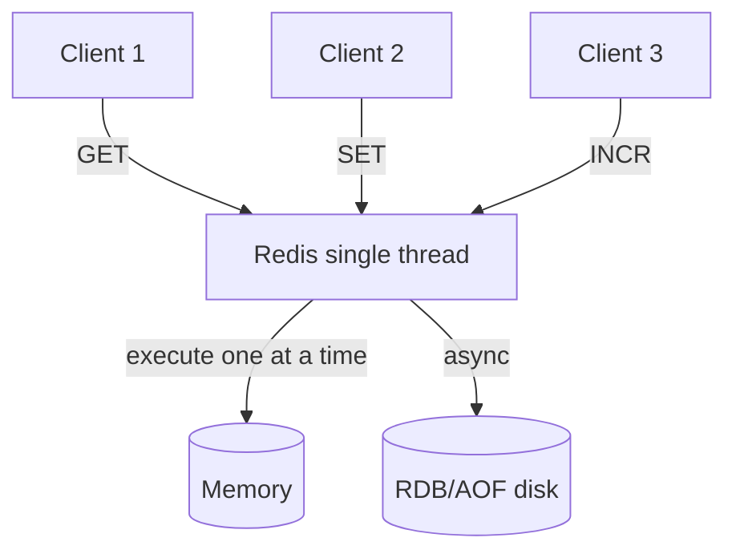

# Chapter 4 - Caching: Redis Deep Dive

> LLM responses are expensive to generate and cheap to store. The question
> is not whether to cache, but what to cache, when to evict, and how to
> avoid turning one hot key into the bottleneck for your entire system.

---

## Learning Objectives

By the end of this chapter you will be able to:

- Implement exact-match prompt caching with TTL and explain why semantic
  caching is a product decision rather than an infrastructure one.
- Design token-based rate limiting and explain why request-based limiting
  fails for LLM workloads.
- Detect hot keys in real time and describe two mitigation strategies.
- Choose between LRU, LFU, and FIFO eviction policies for different
  workload patterns.
- Size a Redis deployment for an LLM caching layer using memory
  calculations, not guesswork.
- Debug the three most common Redis failures in production and explain
  their mechanisms.

---

## The Production Story

Consider a customer service platform running an LLM-powered FAQ assistant.
The system handles 50,000 conversations per day across 200 support agents.
The team deploys with a mid-tier model at roughly $0.002 per 1,000 output
tokens.

For the first month, costs scale linearly with traffic. The team notices
that customers ask similar questions repeatedly: "How do I reset my
password?", "What are your business hours?", "How do I cancel my
subscription?" The top 50 questions account for 60% of all traffic.

The obvious optimization is caching. The team adds a Redis layer in front
of the LLM, hashing prompts and storing responses with a one-hour TTL.
Cache hit rate climbs to 65%. Costs drop by half. The CFO sends a
congratulatory email.

Two weeks later, the system starts returning stale answers. The company
changed its refund policy, but cached responses still describe the old
one. Customers complain. The team reduces TTL to 10 minutes. Hit rate
drops to 20%. Costs climb back up.

Then a viral tweet mentions the product. Traffic spikes 10x in an hour.
The phrase "How do I sign up?" hits the cache 40,000 times in 15 minutes.
Redis CPU pegs at 100%. The cache becomes slower than skipping it
entirely. Other cached keys become unreachable because a single key is
consuming all the capacity.

The team adds more Redis nodes. The hot key still lands on one shard
because the hash is deterministic. They disable caching for that prompt
specifically. Another prompt becomes hot. They play whack-a-mole for
three hours until traffic subsides.

At the incident retro, someone asks: "Why did adding a cache make the
system less reliable than not having one?"

---

## Why This Exists

Every LLM request has a cost in dollars and latency. A mid-tier model
generating 500 tokens takes 2-4 seconds and costs roughly $0.001. A
frontier model takes longer and costs 10x more. Unlike traditional API
calls that complete in milliseconds, the economics of LLM requests make
caching unusually valuable.

Before Redis, teams cached in application memory. This works until you
have more than one instance. Each instance builds its own cache,
duplicating storage and missing cache hits that another instance has.
Worse, invalidation becomes coordination — how do you tell six application
instances that the refund policy changed?

Redis solved this by centralizing the cache. Single namespace, atomic
operations, built-in expiration. For traditional workloads, the pattern
is mature. For LLM workloads, three things break it.

**The cost of a cache miss varies by three orders of magnitude.** A
100-token classification miss costs almost nothing. A 4,000-token
summarization miss costs 40x more. Rate limiting by request count, which
Redis INCR supports natively, cannot distinguish between them. You need
token-based budgets, which requires custom accounting.

**Hot keys hit harder.** In a traditional cache, a hot key means one
database row gets read often. In an LLM cache, a hot key means one
expensive generation gets repeated often. The cache hit saves more money,
but the key concentration risks more throughput. When that key lands on
one shard, the economics flip — the cache becomes the bottleneck instead
of the protection.

**Semantic similarity is a trap.** Traditional caches match exact keys.
LLM prompts tempt teams into semantic matching: if someone asked almost
the same question, return the cached answer. This sounds efficient until
the cache returns an answer to a question nobody asked. The failure mode
is silent and customer-facing. Semantic caching is a product decision
with eval coverage, not an infrastructure optimization.

---

## Core Concepts

**Exact-match caching.** Hash the normalized prompt and system prompt
together. On match, return the cached response. No interpretation, no
similarity, no surprises. The hit rate is lower than semantic caching,
but the failure rate is zero.

**TTL (time-to-live).** How long a cached entry survives before automatic
deletion. Short TTL means fresher data and lower hit rates. Long TTL means
higher hit rates and stale data. There is no universal correct value;
it depends on how often your underlying data changes.

**LRU (least recently used).** An eviction policy that removes the entry
that was accessed longest ago. Good when recent accesses predict future
accesses. Bad when access patterns are bursty.

**LFU (least frequently used).** Removes the entry with the fewest total
accesses. Good when popularity is stable over time. Bad when popularity
shifts, because old popular entries crowd out new ones.

**Hot key.** A cache key that receives disproportionate traffic. In Redis,
this becomes a problem because one key maps to one shard, so one shard
receives disproportionate load.

**Token budget.** A rate limit denominated in tokens rather than requests.
Two requests with 100 tokens and 4,000 tokens consume different amounts
of the budget, which matches how they consume different amounts of model
capacity.

**Sliding window.** A rate-limiting algorithm that tracks events in a
moving time window rather than fixed intervals. Smoother than fixed
windows, which have boundary effects where a burst at minute :59 and :01
looks like two separate minutes but is actually a 2x spike in 2 seconds.

---

## Internal Architecture

Redis is single-threaded for command execution. This is not a limitation
but a design choice that eliminates lock contention. Every command runs
to completion before the next one starts. The consequence: a slow command
blocks every other client.



*All client commands queue for the single execution thread. Slow commands
delay the entire queue.*

### Data structures for LLM caching

**Strings for responses.** The response body is a string. Use `SET key
value EX seconds` to store with automatic expiration. Memory usage is the
string length plus about 50 bytes of overhead per key.

**Hashes for metadata.** If you need to store token counts, timestamps,
or access counts alongside the response, use a hash. One hash with five
fields is more memory-efficient than five separate keys.

**Sorted sets for rate limiting.** The sliding window log algorithm uses
a sorted set where each element is a request timestamp with score equal
to the timestamp. `ZRANGEBYSCORE` removes expired entries, `ZCARD` counts
remaining. Atomic with a Lua script.

```mermaid
graph LR
    subgraph "Sliding Window"
        E1[req@t1] --> E2[req@t2] --> E3[req@t3] --> E4[req@t4]
    end
    W[Window start] -.->|prune older| E1
    N[Now] -.->|add new| E4
```

*Sliding window log: add new events at now, prune events older than
window start, count what remains.*

### Memory layout

Redis stores everything in memory. For prompt caching, the dominant cost
is the response text. A typical cached response is 500-2000 tokens, which
is roughly 2-8 KB of text. At 100,000 cached entries averaging 4 KB each,
the cache needs 400 MB just for response text, plus roughly 50 bytes
overhead per key (about 5 MB), plus hash table overhead (another 10-20%),
yielding approximately 500 MB total.

The formula:

```
memory_bytes = entries * (avg_response_bytes + 50) * 1.15
```

The 1.15 multiplier accounts for hash table overhead and fragmentation.
Increase it to 1.3 if you enable Redis Cluster, which adds slot metadata.

---

## Production Design

**Deploy Redis with persistence disabled for pure caching.** RDB snapshots
and AOF logs protect against data loss. A cache can be rebuilt from the
source of truth (the LLM). Disable both to reduce disk I/O and memory
pressure from fork-based snapshotting.

**Set maxmemory and maxmemory-policy.** Without `maxmemory`, Redis grows
until the OS kills it. Set it to 80% of available RAM, leaving room for
OS buffers and the replication fork. Use `allkeys-lru` or `volatile-lru`
as the eviction policy; `noeviction` rejects writes when full, which
turns memory exhaustion into an outage.

**Use connection pooling.** Each Redis connection consumes a file
descriptor on the server. A single application instance opening 50
connections is fine. Twenty instances each opening 50 connections is
1,000 file descriptors. At that scale, a connection pool with a shared
limit becomes necessary.

**Hash keys consistently.** For exact-match caching, hash the normalized
prompt with SHA-256 truncated to 16 characters. Include the system prompt
in the hash input. Normalization means lowercasing and trimming
whitespace, which improves hit rates for user-typed input.

```ts
// examples/ch04-redis/src/cache.ts
hashPrompt(prompt: string, systemPrompt?: string): string {
  const normalized = (systemPrompt ?? '') + '|' + prompt.trim().toLowerCase();
  return createHash('sha256').update(normalized).digest('hex').slice(0, 16);
}
```

**Separate caching from rate limiting.** Use different Redis instances or
at least different key prefixes. A cache flush should not reset rate
limits, and a rate limit reset should not invalidate the cache.

**Monitor these metrics:**

| Metric | Why it matters | Alert threshold |
| --- | --- | --- |
| `used_memory` | Approaching maxmemory triggers eviction | >85% of maxmemory |
| `evicted_keys` | High eviction means cache is too small | >1000/min sustained |
| `keyspace_hits / total` | Hit rate; low means cache is not helping | <50% over 1 hour |
| `connected_clients` | Pool exhaustion or leak | >expected * 1.5 |
| `slowlog_len` | Slow commands accumulating | >10 entries |

---

## Failure Scenarios

### Failure: hot key overload

**Symptom.** Redis CPU saturates on one shard. Other keys on that shard
become slow. Clients see timeout errors even for keys that are not hot.

**Mechanism.** One key receives thousands of requests per second. In
Redis Cluster, all those requests route to the same shard because the
key hashes to one slot. The shard's single thread cannot keep up.
Response latency increases, clients retry, load amplifies.

**Detection.** Use `redis-cli --hotkeys` (requires maxmemory-policy with
LFU) or track key access counts in application code. A key with >5% of
total traffic is a hot key.

**Mitigation.** Add a local in-process cache in front of Redis for the
hot key only. Serve from local memory for 1-5 seconds before checking
Redis again. The hot key's Redis load drops by 1000x.

**Prevention.** Build hot key detection into the caching layer. When a
key crosses a threshold (e.g., 100 accesses per minute), automatically
replicate it to local caches. See `hot-key.ts` in the example.

### Failure: thundering herd on cache miss

**Symptom.** A popular cached entry expires. Hundreds of requests arrive
simultaneously. All of them miss the cache and call the LLM. The LLM
rate limit rejects most of them. Users see errors.

**Mechanism.** TTL expiration is not gradual; it is instant. If 500
requests per minute hit a key, and that key expires, 8 requests arrive
in the first second and all see a miss. Each calls the LLM. Only the
first one's response gets cached; the other 7 were wasted.

**Detection.** Spike in LLM requests coinciding with cache eviction.
Multiple identical prompts in the LLM request log at the same timestamp.

**Mitigation.** Use a single-flight pattern: the first request to miss
acquires a lock, calls the LLM, and caches the result. Subsequent
requests wait for the lock or return stale data if available.

**Prevention.** Implement cache stampede protection: `SET key value EX
seconds NX` returns null if the key exists, which doubles as a lock. Or
use probabilistic early expiration: refresh the entry when it has 10%
TTL remaining, before it actually expires.

### Failure: memory exhaustion OOM kill

**Symptom.** Redis process disappears. Connection errors from all
clients. On restart, cache is empty (if persistence disabled).

**Mechanism.** `maxmemory` was not set, or was set higher than available
RAM. Redis grew past physical memory, triggered swap, slowed down, and
the OOM killer terminated it.

**Detection.** Process monitoring shows Redis exit code 9 (SIGKILL).
`dmesg` shows OOM killer invocation.

**Mitigation.** Restart Redis. Investigate what caused memory growth:
key leak, large values, or legitimately more data than the instance can
hold.

**Prevention.** Set `maxmemory` to 80% of available RAM. Set
`maxmemory-policy` to `allkeys-lru` so that eviction happens instead of
rejection. Monitor `used_memory` with alerts at 70% and 85%.

### Failure: KEYS * in production

**Symptom.** All Redis clients freeze for 10-30 seconds. No errors,
just latency. Then everything resumes.

**Mechanism.** Someone ran `KEYS *` or `DEBUG SLEEP` or another O(n)
command on a large keyspace. Because Redis is single-threaded, this
command blocks all other clients until it completes.

**Detection.** Check `slowlog get 10`. The blocking command appears with
a long duration.

**Mitigation.** Nothing during the incident; wait for the command to
finish. Afterward, rename or disable dangerous commands via
`rename-command` in redis.conf.

**Prevention.** Use `SCAN` instead of `KEYS`. Rename dangerous commands.
Train operators. Never run admin commands on production during business
hours.

---

## Scaling Strategy

Things break in a specific order as load grows.

**First: connection limits, around 1,000 concurrent connections.** The
default `maxclients` is 10,000, but each connection costs memory and a
file descriptor. If 50 application instances each maintain 20 pooled
connections, you hit 1,000. Connection pooling with a lower per-instance
limit is the fix.

**Second: single-thread CPU saturation, around 100,000 operations per
second.** The exact number depends on command complexity. `GET` and `SET`
are fast. `ZRANGEBYSCORE` on a large sorted set is slower. CPU saturation
manifests as rising latency with no obvious cause. Profile with
`redis-cli --intrinsic-latency` to establish baseline, then compare.

**Third: memory capacity, at whatever maxmemory is set to.** When hit
rate stops improving despite adding entries, you have reached working set
size. Scaling vertically (more RAM) helps until you hit the largest
available instance. Then you need Redis Cluster.

**Fourth: network bandwidth, around 1-2 Gbps.** Large values (8 KB
responses) at 100,000 ops/sec is 800 MB/sec, or 6.4 Gbps. This exceeds
most single-instance network capacity. The fix is sharding: Redis Cluster
distributes keys across nodes, spreading network load.

Redis Cluster adds complexity. Each key hashes to one of 16,384 slots;
each slot maps to one primary. Hot keys still land on one primary. The
hot key problem does not disappear; it moves to the shard level.

---

## Trade-offs

| Decision | Buys you | Costs you | Choose when |
| --- | --- | --- | --- |
| Exact-match caching | Zero false positives, simple debugging | Lower hit rate than semantic | Always start here |
| Semantic caching | Higher hit rate | Wrong answers, complex eval | Only with eval coverage |
| Short TTL (minutes) | Fresh data | Lower hit rate, more LLM calls | Data changes frequently |
| Long TTL (hours) | High hit rate | Stale data risk | Static content only |
| LRU eviction | Simple, good for recency-biased | Forgets frequent but old | Most workloads |
| LFU eviction | Keeps popular entries | Slow to adapt to shifts | Stable popularity |
| Local + Redis | Hot key protection | Consistency lag | Traffic >10k/sec |
| Redis Cluster | Horizontal scale | Operational complexity | Memory >100GB |
| Token-based limits | Matches actual cost | More complex than INCR | Always for LLM |
| Request-based limits | Simple, native INCR | Ignores cost variance | Never for LLM |

---

## Code Walkthrough

From `examples/ch04-redis/`. The cache is implemented in pure TypeScript
to model Redis behavior without requiring an actual Redis instance.

### Prompt cache with LRU eviction

```ts
// examples/ch04-redis/src/cache.ts

export class PromptCache {
  private entries: Map<string, CacheEntry>;
  private config: CacheConfig;
  private stats: CacheStats;

  constructor(config: Partial<CacheConfig> = {}) {
    this.entries = new Map();
    this.config = { ...DEFAULT_CONFIG, ...config };
    this.stats = {
      hits: 0,
      misses: 0,
      evictions: 0,
      currentEntries: 0,
      currentMemoryBytes: 0,
      hitRate: 0,
    };
  }

  get(prompt: string, systemPrompt?: string): CacheResult {
    const key = this.hashPrompt(prompt, systemPrompt);
    const entry = this.entries.get(key);

    if (!entry) {
      this.stats.misses++;                               // (1)
      return { hit: false, entry: null };
    }

    // Check TTL expiration
    if (Date.now() - entry.createdAt > this.config.ttlMs) {
      this.entries.delete(key);                          // (2)
      this.stats.misses++;
      return { hit: false, entry: null };
    }

    entry.lastAccessedAt = Date.now();                   // (3)
    entry.accessCount++;
    this.stats.hits++;
    return { hit: true, entry };
  }
}
```

1. Track misses for hit rate calculation. A low hit rate means the cache
   is not helping.
2. Passive expiration: entries are removed when accessed after TTL, not
   proactively. Redis does both; this models the passive path.
3. Update LRU tracking. The entry with the oldest `lastAccessedAt` is
   evicted first when memory pressure requires it.

### Token-based rate limiting

```ts
// examples/ch04-redis/src/rate-limiter.ts

export class TokenRateLimiter {
  check(tenantId: string, estimatedTokens: number): RateLimitResult {
    const now = Date.now();
    const windowStart = now - this.config.windowMs;

    let records = this.tenantRecords.get(tenantId) ?? [];
    records = records.filter((r) => r.timestamp > windowStart);  // (1)

    const tokensUsed = records.reduce((sum, r) => sum + r.tokens, 0);
    const tokensRemaining = this.effectiveBudget - tokensUsed;

    if (estimatedTokens > tokensRemaining) {
      return {
        allowed: false,
        tokensRemaining,
        reason: 'token_budget_exhausted',                 // (2)
      };
    }

    return { allowed: true, tokensRemaining };
  }

  reconcile(tenantId: string, estimated: number, actual: number): void {
    // Adjust reservation to actual after response arrives   // (3)
  }
}
```

1. Sliding window: prune records older than window start. Each record is
   a timestamp-token pair.
2. Explicit reason for rejection. This enables consumer-side back-off or
   graceful degradation.
3. Reserve-then-reconcile: the estimate is subtracted at request start,
   and reconciled to actual at response end. Overshoot is bounded by
   in-flight concurrency times per-request maximum.

### Hot key detection with Count-Min Sketch

```ts
// examples/ch04-redis/src/hot-key.ts

export class HotKeyDetector {
  recordAccess(key: string): void {
    this.totalRequests++;
    this.incrementSketch(key);                           // (1)

    const approxCount = this.getSketchCount(key);
    if (approxCount >= this.threshold / 10) {            // (2)
      // Track exact count for potential hot keys
      const entry = this.keyAccess.get(key);
      if (entry) {
        entry.count++;
      } else {
        this.keyAccess.set(key, { key, count: approxCount });
      }
    }
  }

  getHotKeys(topN: number = 10): HotKeyReport {
    return Array.from(this.keyAccess.values())
      .filter((e) => e.count >= this.threshold)          // (3)
      .sort((a, b) => b.count - a.count)
      .slice(0, topN);
  }
}
```

1. Count-Min Sketch: a probabilistic data structure that uses O(1) space
   regardless of key cardinality. May overcount but never undercounts.
2. Two-phase detection: use the sketch for all keys (cheap), then track
   exact counts only for keys that appear frequently (accurate for hot
   keys only).
3. Threshold crossing is what defines "hot." The threshold depends on
   traffic volume; 100 accesses per minute is hot at 1,000 QPS, not at
   100,000 QPS.

---

## Hands-On Lab

**Goal:** observe cache hit rates, eviction behavior, and hot key
detection. About 2 seconds of runtime, Node 22.6+, no dependencies.

```bash
cd examples/ch04-redis
node scripts/lab.mjs
```

That runs all eight steps and asserts twenty-one claims. The rest of this
section explains what it is checking and why.

**Step 1 — cache hit rate with Zipf distribution.**

Generate 1,000 prompts where a few are very common and most are rare
(Zipf distribution with skew 1.0, meaning ~20% of unique prompts get
~80% of traffic). Cache with 100 entries.

Observed: hit rate of 95%. The top 50 prompts account for most traffic,
and they all fit in the cache. This is why caching works for LLM
workloads at all — real prompt distributions are not uniform.

**Step 2 — LRU eviction under memory pressure.**

Create a cache with 10 KB limit. Add 20 entries of 1 KB each.

Observed: 11 evictions fire, final size is 9 entries. Verify LRU by
accessing an old entry before adding new ones; it survives while older
untouched entries are evicted.

**Step 3 — TTL expiration.**

Create a cache with 50ms TTL. Add an entry, verify it exists, wait 60ms,
verify it is gone.

**Step 4 — token-based rate limiting.**

Create a limiter with 10,000 tokens per minute. Send 50 requests with
variable token counts (log-normal distribution, 100-2000 tokens each).

Observed: total tokens consumed never exceeds 10,000. Some requests are
rejected when the budget exhausts. This is the behavior request-based
limiting cannot provide.

**Step 5 — token vs request limiting comparison.**

Send a mix of small (100 token) and large (4,000 token) requests through
both a request-based limiter (20 req/min) and a token-based limiter
(10,000 tokens/min).

Observed: request-based allows more total tokens because it cannot
distinguish large from small requests. Token-based respects the budget.

**Step 6 — hot key detection.**

Send 1,000 prompts where one prompt ("hot_prompt") appears 20% of the
time.

Observed: detector identifies "hot_prompt" with count ~200, matching the
expected 20% of traffic.

**Step 7 — hot key replication.**

Use the replicator to serve a hot key from local cache after it crosses
the threshold.

Observed: after initial fetches to warm the local cache, subsequent
requests return `source: 'local'` without hitting the remote.

**Step 8 — hash collision resistance.**

Verify that similar prompts produce different hashes, except for case
differences (which normalize to the same hash).

---

## Interview Questions

1. Why does request-based rate limiting fail for LLM workloads? What
   replaces it?

2. A cache has 95% hit rate but p99 latency is worse than without the
   cache. What is happening?

3. How do you prevent a thundering herd when a popular cache entry
   expires?

4. You need to cache 1 million prompts averaging 2 KB each. How much
   Redis memory do you need?

5. Your Redis cluster has 3 shards but CPU is saturated on one shard
   only. What is the likely cause and how do you fix it?

6. Should prompt caching use LRU or LFU eviction? Defend your choice.

7. What is the difference between exact-match and semantic caching, and
   when would you use each?

8. A developer wants to run `KEYS prompt:*` to count cached entries.
   Explain why this is dangerous and what to use instead.

9. How does token-based rate limiting handle the difference between
   estimated and actual token counts?

10. Design a caching strategy for a support chatbot where responses must
    reflect policy changes within 5 minutes.

---

## Staff-Level Answers

**Q2 — high hit rate but high latency.** The cache is working (95% hit
rate confirms this), but something else is slow. Two likely causes.

First: the hot key problem. A small number of keys receive most of the
traffic. All those requests hit one Redis shard. The cache is fast per
request but serialized, so concurrency becomes latency. The fix is local
in-process caching for hot keys.

Second: large values. If cached responses are 10 KB average, a cache hit
is 10 KB of network I/O. At 10,000 QPS that is 100 MB/sec, which can
saturate a network interface. The fix is compression (responses are
text, compress well) or sharding to spread network load.

The staff-level addition: neither cause is visible in hit rate. Hit rate
measures effectiveness, not efficiency. You need latency percentiles
broken down by cache hit vs miss to see the problem. If cache-hit p99 is
high, the cache itself is slow. If cache-miss p99 is normal and overall
p99 is high, the cache is creating a bottleneck elsewhere (network,
single-threaded Redis, hot key).

**Q4 — memory sizing.** The formula is:

```
memory = entries * (avg_size + overhead) * fragmentation_factor
       = 1,000,000 * (2,048 + 50) * 1.15
       = 2,412,700,000 bytes
       ≈ 2.4 GB
```

Then add 20% headroom for maxmemory safety:

```
maxmemory ≈ 3 GB
```

With AWS ElastiCache or similar, the smallest instance with 3 GB usable
is typically a medium or large tier. A single-node deployment works; you
only need clustering if traffic exceeds 100,000 ops/sec or you need HA.

The staff answer names the fragmentation factor (1.15) and explains it:
Redis uses jemalloc, which allocates in size classes. A 2,100-byte
object might get a 4 KB allocation. Fragmentation is worse with variable
sizes and long-running instances. Monitor `mem_fragmentation_ratio` in
INFO; above 1.5 means memory is being wasted and a restart may help.

**Q5 — one shard hot.** Hot key. One key hashes to one slot, one slot
maps to one shard. All requests for that key hit one shard regardless of
cluster size.

Detection: `CLUSTER KEYSLOT <key>` shows which slot. Compare slot
distribution across shards in `CLUSTER SLOTS`. Or use `redis-cli
--cluster call` with a Lua script that counts operations per key.

Fix: local caching for hot keys at the application layer. The hot key
still hits one shard, but only once per local-cache TTL (typically 1-5
seconds) per application instance, not once per user request.

The staff addition: Redis Cluster does not solve hot keys and was never
designed to. Cluster solves memory capacity by sharding data. It does
not shard traffic within a key. Expecting it to is a common
misunderstanding that leads to "but I added more shards and it didn't
help."

**Q9 — estimated vs actual tokens.** Reserve-then-reconcile. At request
admission, reserve the pessimistic estimate (typically `max_tokens` from
the request). At response completion, reconcile to actual token count
from the usage response.

The window records look like this:

1. Request arrives, estimate 2,000 tokens. Record `{timestamp: now,
   tokens: 2000}`. Budget decreases by 2,000.
2. Response arrives, actual 1,200 tokens. Find the record, update to
   `{timestamp: now, tokens: 1200}`. Budget effectively increases by
   800.

Overshoot is bounded: worst case is in-flight concurrency times
per-request maximum. If you have 50 concurrent requests each reserving
4,000 tokens, worst case is 200,000 tokens over-reserved, which settles
out when responses arrive. This is why per-tenant concurrency limits
matter; they bound the overshoot.

**Q10 — freshness within 5 minutes.** Two options, both valid.

**Option A: short TTL.** Set TTL to 5 minutes. Hit rate drops because
entries expire before they would otherwise be evicted. Simplest to
implement and reason about.

**Option B: cache-aside with invalidation.** Set TTL to 1 hour for
normal entries. When policy changes, publish an invalidation event to a
topic. Cache subscribers receive the event and delete the affected keys.
Hit rate stays high, but you need an invalidation mechanism.

The staff answer picks one and defends it. For a support chatbot, I
would pick Option A (short TTL) because:

1. Policy changes are infrequent; the extra LLM calls from lower hit
   rate cost less than building invalidation infrastructure.
2. Short TTL bounds staleness universally, not just for policy; if the
   LLM's training data changes or the system prompt is updated, the
   cache catches up automatically.
3. Invalidation requires knowing which keys are affected by which
   changes, which is a content-level dependency that caching
   infrastructure cannot derive.

The counterargument for Option B is if policy changes are rare but hit
rate matters a lot (high traffic, expensive model). Then the engineering
cost of invalidation pays back in LLM savings.

---

## Exercises

1. **Eviction policy comparison.** Modify `cache.ts` to support LFU.
   Generate a workload where LFU outperforms LRU and one where LRU
   outperforms LFU. What access pattern distinguishes them?

2. **Thundering herd protection.** Implement single-flight cache miss
   handling: when multiple requests miss the same key simultaneously,
   only one calls the LLM and the others wait for its result.

3. **Memory calculation.** Your cache holds 500,000 entries averaging
   3 KB. Calculate the Redis memory needed with and without Cluster
   overhead. Verify by creating a test dataset and checking INFO
   memory.

4. **Hot key replication.** The `HotKeyReplicator` uses a fixed local
   TTL. Modify it to use adaptive TTL based on access frequency: hotter
   keys get longer local TTL.

5. **Semantic caching evaluation.** Design an eval that measures
   semantic cache safety: generate prompt pairs that are semantically
   similar but require different answers. What false-positive rate is
   acceptable for your use case?

---

## Further Reading

- **Redis documentation on memory optimization** — the official guide to
  `maxmemory`, eviction policies, and the `MEMORY DOCTOR` command. Start
  here before assuming you understand how Redis uses memory.

- **"Count-Min Sketch" (Cormode and Muthukrishnan)** — the original paper
  on the probabilistic data structure used for hot key detection. Short,
  readable, and foundational.

- **Antirez, "Redis persistence demystified"** — the Redis creator
  explains RDB vs AOF, when to use each, and why persistence for caching
  is usually wrong. Read before enabling persistence on a cache.

- **"Scaling Memcache at Facebook"** — applies to Redis with minor
  changes. The thundering herd and hot key sections are directly relevant.
  The leasing solution predates single-flight patterns by a decade.

- **AWS ElastiCache best practices** — vendor documentation, but the
  sizing, monitoring, and operational sections are the best public
  material on running Redis at scale. Applicable even if you do not use
  AWS.

- **"An Analysis of Redis Performance"** — academic benchmarking showing
  where single-threaded throughput saturates and what operations cost.
  Useful for capacity planning when you cannot benchmark your own
  workload.
