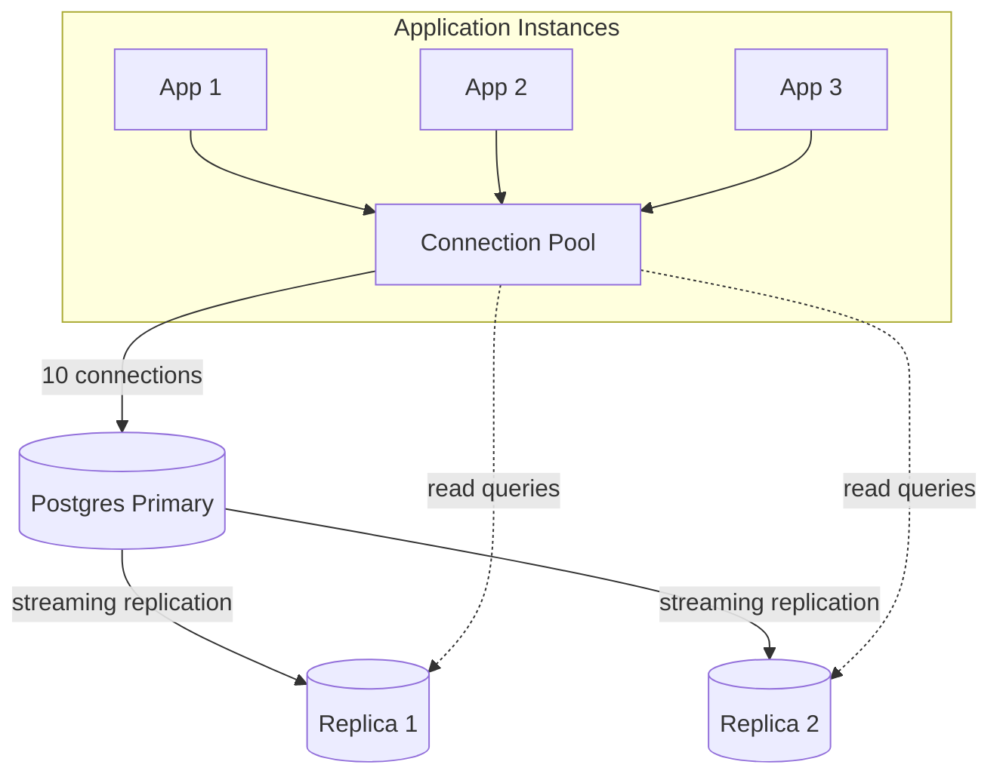
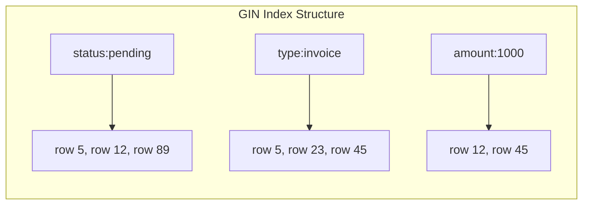

# Chapter 5 — Postgres at Scale

> Postgres handles AI workloads well until it does not. Connection limits,
> unindexed JSONB, and billion-row tables are the patterns that break first.
> The solutions — pooling, GIN indexes, partitioning, read replicas — are
> standard database practices. The difference is that AI systems hit the
> limits faster and harder.

---

## Learning Objectives

By the end of this chapter you will be able to:

- Design a connection pool that handles bursty AI traffic without
  exhausting Postgres connections or leaving queries waiting.
- Choose between B-tree, GIN, BRIN, and partial indexes for common AI
  query patterns including JSONB containment and time-range filters.
- Implement range partitioning for append-only AI tables and explain how
  partition pruning reduces query cost by 90% or more.
- Route read queries to replicas for retrieval pipelines while ensuring
  fresh data when needed.
- Debug the three most common Postgres performance problems in AI systems:
  connection exhaustion, sequential scans on JSONB, and partition-oblivious
  queries.
- Size Postgres for an AI workload using connection counts, table sizes,
  and query patterns.

---

## The Production Story

Consider a document processing platform that uses LLMs to extract structured
data from contracts. Users upload PDFs, the system runs OCR, chunks the text,
generates embeddings, and stores everything in Postgres with pgvector.
Extraction results go into a JSONB column for flexible schema evolution.

The system works well at 1,000 documents per day. Query latency is under 50ms.
The team ships to production.

At 10,000 documents per day, things start to degrade. The embedding lookup
query, which was fast, now takes 200ms. The team adds an index. It helps, but
not enough.

At 50,000 documents per day, the symptom changes. Queries are not slow anymore
— they time out entirely. The application logs show "connection refused" errors.
Postgres is rejecting new connections.

The on-call engineer checks `max_connections`. It is set to 100, the default.
The application has 20 instances, each with a pool of 10 connections. That is
200 connections requested but only 100 allowed. Half the requests fail before
they even run a query.

The engineer increases `max_connections` to 300. The connection errors stop.
But now Postgres memory usage spikes. Each connection is a backend process
consuming 10-20 MB. Three hundred connections is 3-6 GB of memory just for
connection overhead, leaving less for shared buffers and query execution.

The next day, a different problem appears. A query that filters documents by
`data->>'status' = 'pending'` takes 30 seconds. The table has 5 million rows.
The EXPLAIN shows a sequential scan.

Someone asks: "Why is Postgres scanning every row when we only want pending
documents?"

---

## Why This Exists

Postgres is the default database for AI systems because it does everything.
Relational data, JSONB documents, full-text search, and with pgvector, even
embeddings. The ecosystem is mature, the tooling is excellent, and most
engineers already know it.

But Postgres was designed for OLTP workloads with short transactions and
predictable connection patterns. AI systems break these assumptions.

**Connection patterns are bursty.** A retrieval pipeline might open 50
connections simultaneously when traffic spikes. Traditional web applications
have more gradual load curves. Without a connection pool that queues requests,
Postgres rejects connections during spikes.

**Tables grow faster.** AI audit logs, embeddings, and prompt histories
generate millions of rows per week. Traditional CRUD applications update
existing rows; AI systems append new ones. Without partitioning, tables
become too large to index efficiently.

**Queries are different.** JSONB containment, vector similarity, and
time-range filters are common in AI workloads but uncommon in traditional
CRUD. The default B-tree index does not help. You need GIN for JSONB, HNSW
for vectors, and partial indexes for hot paths.

**Read amplification is severe.** A single user request in a retrieval
pipeline might generate 20-50 database queries: conversation history,
embedding lookup, vector search, document fetch, metadata fetch. Without
read replicas, the primary becomes a bottleneck.

The patterns in this chapter are not AI-specific. They are standard database
practices. What changes is the urgency. AI systems hit the limits that would
take a traditional application years to reach in the first few months of
production.

---

## Core Concepts

**Connection pooling.** A layer between the application and the database that
maintains a set of reusable connections. Instead of opening a connection per
request (expensive), the pool hands out existing connections and returns them
when done. PgBouncer is the most common external pooler; application-level
pools work too.

**B-tree index.** The default index type. Stores keys in sorted order,
supports equality, range queries, and ordering. The right choice for most
columns. Does not support JSONB containment or full-text search.

**GIN (Generalized Inverted Index).** An index type that maps values to rows
rather than rows to values. Supports multiple values per row, making it ideal
for JSONB (where a single row has many keys) and full-text search (where a
single row has many words).

**BRIN (Block Range Index).** A compact index that stores min/max values per
block of rows. Effective only when data is physically ordered (e.g., by
insert time). Much smaller than B-tree but only prunes blocks, not rows.

**Partial index.** An index that includes only rows matching a predicate. If
95% of your queries filter for `status = 'pending'` and only 5% of rows are
pending, a partial index on pending rows is 20x smaller and faster than a
full index.

**Range partitioning.** Splitting a table into multiple physical tables based
on a column value (usually time). Queries that filter on the partition key
only scan relevant partitions. A 24-month table becomes 24 smaller tables.

**List partitioning.** Splitting a table by discrete values (usually tenant
ID). Provides tenant isolation and enables partition-level operations like
dropping a single tenant's data.

**Read replica.** A copy of the primary database that receives changes via
replication. Can serve read queries, reducing load on the primary. Has
replication lag: changes on the primary take milliseconds to seconds to
appear on the replica.

---

## Internal Architecture

Postgres uses a process-per-connection model. When a client connects, Postgres
forks a new backend process to handle that connection. This process has its
own memory allocation, typically 5-20 MB depending on work_mem and other
settings.



*A connection pool multiplexes many application requests across a smaller
number of database connections. Read replicas handle read-heavy workloads.*

### Connection pool mechanics

A well-designed pool maintains these invariants:

1. **Minimum connections** are kept open even when idle, avoiding cold-start
   latency.
2. **Maximum connections** caps the total, preventing database overload.
3. **Acquire timeout** fails fast when the pool is exhausted, rather than
   blocking indefinitely.
4. **Idle timeout** closes connections that have been unused, freeing
   resources.
5. **Max lifetime** closes connections after a duration, preventing issues
   with stale connections or memory leaks.

The queue behavior matters. When all connections are in use and a new request
arrives, it waits in a queue. If the queue is unbounded, memory grows. If the
queue is bounded with a short timeout, requests fail fast and can be retried
or shed.

### Index selection

Postgres chooses indexes based on cost estimation. The planner estimates row
counts using statistics from ANALYZE, then calculates the cost of different
access paths: sequential scan, index scan, bitmap scan.

For JSONB columns, B-tree indexes are nearly useless. The `@>` (contains)
operator needs to check arbitrary nested keys. GIN indexes invert the
structure: they map each key-value pair to the rows containing it.



*A GIN index maps JSONB keys to the rows containing them, enabling fast
containment queries.*

### Partition pruning

When you query a partitioned table, Postgres eliminates partitions that
cannot contain matching rows. This is partition pruning. It happens at plan
time (for constant predicates) or execution time (for parameter values).

```sql
-- This scans only the December 2025 partition
SELECT * FROM ai_requests
WHERE created_at BETWEEN '2025-12-01' AND '2025-12-31';
```

For this to work, the query must include the partition key in a way the
planner recognizes. A query on `created_at > now() - interval '30 days'`
prunes partitions. A query that joins without filtering on `created_at`
scans all partitions.

---

## Production Design

**Size the connection pool conservatively.** The formula: `max_connections`
on Postgres divided by the number of application instances, with headroom
for admin connections. If Postgres allows 200 connections and you have 20
application instances, each pool gets 8-10 connections. Do not set pool
sizes that sum to more than `max_connections` minus 10 (for admin overhead).

**Use PgBouncer for high connection counts.** PgBouncer is an external
connection pooler that sits between applications and Postgres. It multiplexes
thousands of client connections onto dozens of database connections.
Transaction pooling mode is the most efficient but breaks session state;
session pooling mode is safer but less efficient.

**Create GIN indexes on JSONB columns you query.** The syntax:

```sql
CREATE INDEX idx_documents_data ON documents USING GIN (data);
```

This indexes all keys in the JSONB column. For specific paths only:

```sql
CREATE INDEX idx_documents_status ON documents USING GIN ((data->'status'));
```

**Partition tables expected to exceed 10 million rows.** For time-series
data (prompts, responses, metrics), use range partitioning by month:

```sql
CREATE TABLE ai_requests (
    id UUID PRIMARY KEY,
    tenant_id TEXT NOT NULL,
    prompt TEXT NOT NULL,
    created_at TIMESTAMPTZ NOT NULL
) PARTITION BY RANGE (created_at);

CREATE TABLE ai_requests_2025_01
    PARTITION OF ai_requests
    FOR VALUES FROM ('2025-01-01') TO ('2025-02-01');
```

For multi-tenant systems, consider list partitioning by tenant:

```sql
CREATE TABLE documents (
    id UUID,
    tenant_id TEXT NOT NULL,
    data JSONB
) PARTITION BY LIST (tenant_id);

CREATE TABLE documents_acme
    PARTITION OF documents
    FOR VALUES IN ('acme');
```

**Route reads to replicas except when freshness matters.** Retrieval
pipelines can tolerate 100-500ms of replication lag. Queries after writes
cannot. Mark reads that require fresh data and route them to the primary;
route everything else to replicas with round-robin or least-connections
load balancing.

**Monitor these metrics:**

| Metric | Why it matters | Alert threshold |
| --- | --- | --- |
| `pg_stat_activity.count` | Active connections | >80% of max_connections |
| `pg_stat_database.blks_hit / blks_read` | Cache hit ratio | <95% |
| `pg_stat_user_tables.seq_scan` | Sequential scans | Increasing on large tables |
| `pg_stat_replication.replay_lag` | Replica lag | >1s sustained |
| `pg_stat_user_tables.n_dead_tup` | Dead tuples | >10% of live tuples |

---

## Failure Scenarios

### Failure: connection exhaustion

**Symptom.** Application logs show "connection refused" or "too many
connections". New queries fail immediately. Existing queries may continue.

**Mechanism.** The sum of all connection pool sizes exceeds `max_connections`.
During traffic spikes, all pools try to open connections simultaneously. The
first pools succeed; the rest are rejected.

**Detection.** `SELECT count(*) FROM pg_stat_activity` shows connection count
near `max_connections`. Application connection pool metrics show acquire
timeout errors.

**Mitigation.** Kill idle connections: `SELECT pg_terminate_backend(pid) FROM
pg_stat_activity WHERE state = 'idle' AND query_start < now() - interval '5
minutes'`. Then reduce pool sizes across all applications.

**Prevention.** Calculate total pool size: sum of all `maxConnections` across
all application instances must be less than Postgres `max_connections` minus
10. Use PgBouncer to multiplex if you need more client connections than
database connections.

### Failure: sequential scan on large table

**Symptom.** A query that was fast becomes slow. EXPLAIN shows "Seq Scan" on
a table with millions of rows.

**Mechanism.** The query does not match any index, or the planner estimates
that a sequential scan is cheaper than an index scan. This happens when
selectivity is low (the query returns many rows) or statistics are stale.

**Detection.** `EXPLAIN ANALYZE` shows Seq Scan with high actual rows. For
JSONB queries, check that a GIN index exists.

**Mitigation.** Create the appropriate index. For JSONB containment, use GIN.
For time ranges, use B-tree. For hot paths with specific filters, use partial
indexes. Run `ANALYZE` to update statistics.

**Prevention.** Review slow query logs weekly. Add indexes before queries
become critical. For JSONB columns you query, create GIN indexes proactively.

### Failure: partition-oblivious query

**Symptom.** A query on a partitioned table is slow despite partitioning.
EXPLAIN shows all partitions being scanned.

**Mechanism.** The query does not include the partition key in a way the
planner can use for pruning. Common causes: joining without filtering on the
partition column, using functions that prevent pruning, or passing parameters
that are only known at execution time with older Postgres versions.

**Detection.** `EXPLAIN ANALYZE` shows scans on all partitions. Look for
"Append" nodes with many children.

**Mitigation.** Rewrite the query to include explicit partition key filters.
If filtering by join, add a redundant filter on the partition column.

**Prevention.** Review query patterns before partitioning. Ensure the most
common queries filter on the partition key. Test with EXPLAIN before
deploying.

### Failure: replication lag spike

**Symptom.** Read queries return stale data. Applications that read-after-
write see missing data. Monitoring shows replica lag exceeding thresholds.

**Mechanism.** The replica cannot keep up with write volume on the primary.
Common causes: high write volume, slow replica disk, network congestion, or
long-running queries on the replica blocking replay.

**Detection.** `SELECT * FROM pg_stat_replication` on the primary shows
`replay_lag`. Application metrics show stale data errors.

**Mitigation.** Route reads to the primary temporarily. Kill long-running
queries on the replica. If sustained, add replica capacity or reduce write
volume.

**Prevention.** Set `max_standby_streaming_delay` to limit how long queries
can block replay. Monitor replica lag continuously. Route latency-sensitive
reads to the primary.

---

## Scaling Strategy

**First: connection limits, around 200 connections.** The default
`max_connections` (100) is too low for most AI systems. Increase to 200-400,
but remember each connection costs memory. Above 400, use PgBouncer.

**Second: sequential scans, around 10 million rows.** When tables exceed 10
million rows, missing indexes become painful. Sequential scans that took 100ms
now take 10 seconds. Add indexes proactively for common query patterns.

**Third: table size, around 100 million rows.** Even with indexes, tables
above 100 million rows strain Postgres. Vacuum takes longer, index maintenance
is expensive, and memory pressure increases. Partition by time or tenant
before reaching this size.

**Fourth: write throughput, around 10,000 writes per second.** Single-primary
Postgres handles about 10,000 simple writes per second. Above that, you need
write sharding (application-level) or a different database. Read replicas do
not help write throughput.

**Fifth: read throughput, around 50,000 reads per second.** A single Postgres
instance handles 50,000-100,000 simple reads per second. Add read replicas to
scale horizontally. Each replica adds capacity, up to the point where
replication itself becomes a bottleneck.

---

## Trade-offs

| Decision | Buys you | Costs you | Choose when |
| --- | --- | --- | --- |
| PgBouncer | More client connections | Operational complexity, no session state | >200 connections needed |
| Application pool | Simpler architecture | Limited total connections | <200 connections total |
| GIN index on JSONB | Fast containment queries | Larger index, slower writes | Query JSONB columns frequently |
| No JSONB index | Faster writes, smaller storage | Full table scan for queries | Rarely query JSONB |
| Partial index | Smaller index, faster for hot path | Does not help other queries | >80% of queries match predicate |
| Full index | Helps all queries | Larger, slower to maintain | Diverse query patterns |
| Range partitioning | Time-range pruning, easy retention | Query must include partition key | Time-series data |
| List partitioning | Tenant isolation, easy deletion | More partitions to manage | Multi-tenant systems |
| Read replicas | Horizontal read scaling | Replication lag, more infra | Read-heavy workloads |
| Primary only | Simplicity, always consistent | Limited read throughput | <50k reads per second |

---

## Code Walkthrough

From `examples/ch05-postgres/`. The code simulates Postgres behavior in pure
TypeScript to demonstrate patterns without requiring a database.

### Connection pool with acquire queue

```ts
// examples/ch05-postgres/src/pooling.ts

export class ConnectionPool {
  private connections: Map<string, PooledConnection>;
  private waitQueue: Array<{
    resolve: (conn: PooledConnection) => void;
    reject: (err: Error) => void;
    enqueuedAt: number;
  }>;

  async acquire(): Promise<PooledConnection> {
    // First, try to find an idle connection
    for (const conn of this.connections.values()) {
      if (!conn.inUse && !this.isConnectionExpired(conn)) {
        conn.inUse = true;                                    // (1)
        return conn;
      }
    }

    // If under max, create a new connection
    if (this.stats.totalConnections < this.config.maxConnections) {
      const conn = this.createConnection();                   // (2)
      conn.inUse = true;
      return conn;
    }

    // At max capacity, wait in queue
    return new Promise<PooledConnection>((resolve, reject) => {
      this.waitQueue.push({ resolve, reject, enqueuedAt: Date.now() });

      setTimeout(() => {                                      // (3)
        // Timeout handler removes from queue and rejects
        reject(new Error('Connection acquire timeout'));
      }, this.config.acquireTimeoutMs);
    });
  }

  release(connection: PooledConnection): void {
    const conn = this.connections.get(connection.id);
    conn.inUse = false;

    // Check wait queue first
    if (this.waitQueue.length > 0) {                          // (4)
      const waiter = this.waitQueue.shift();
      conn.inUse = true;
      waiter.resolve(conn);
    }
  }
}
```

1. Mark idle connection as in-use before returning it. This prevents two
   concurrent acquires from getting the same connection.
2. Create new connections up to the maximum. This scales the pool
   dynamically under load.
3. Timeout prevents indefinite waiting. Fast failure is better than slow
   failure for AI systems where latency matters.
4. On release, hand the connection to the first waiter rather than returning
   it to idle. This ensures FIFO ordering for waiting requests.

### Index selection for query planning

```ts
// examples/ch05-postgres/src/indexing.ts

planQuery(query: Query): QueryPlan {
  const candidates = this.findCandidateIndexes(query, indexes);

  if (candidates.length === 0) {
    return {
      indexUsed: null,
      scanType: 'seq_scan',                                   // (1)
      explanation: 'No matching index found',
    };
  }

  // Score each candidate and pick the best
  let bestCandidate = candidates[0];
  let bestScore = this.scoreIndex(bestCandidate, query, stats);

  for (const candidate of candidates) {
    const score = this.scoreIndex(candidate, query, stats);
    if (score < bestScore) {                                  // (2)
      bestScore = score;
      bestCandidate = candidate;
    }
  }

  return {
    indexUsed: bestCandidate,
    scanType: this.determineScanType(bestCandidate, query),
    estimatedCost: bestScore,
  };
}

private indexTypePenalty(index: IndexDefinition, query: Query): number {
  for (const cond of query.conditions) {
    switch (cond.operator) {
      case '@>':                                              // (3)
        if (index.type !== 'gin') return 10000;
        break;
      case '@@':
        if (index.type !== 'gin' && index.type !== 'gist')
          return 10000;
        break;
    }
  }
  return 0;
}
```

1. Without a matching index, Postgres falls back to sequential scan. This is
   expensive for large tables.
2. Lower score is better. Scoring considers selectivity, index type match,
   and whether the index covers all selected columns.
3. JSONB containment (`@>`) requires GIN. Using B-tree results in a full
   scan regardless of the index.

### Partition routing and pruning

```ts
// examples/ch05-postgres/src/partitioning.ts

routeRow(parentTable: string, row: PartitionableRow): RoutingResult {
  for (const p of partitions) {
    if (keyValue >= start && keyValue < end) {                // (1)
      return {
        partitionName: p.name,
        matched: true,
        reason: `Key falls in range [${p.rangeStart}, ${p.rangeEnd})`,
      };
    }
  }
  return { matched: false, reason: 'No partition found' };
}

prunePartitions(parentTable: string, query: PartitionQuery): PruningResult {
  const scanned: string[] = [];

  for (const p of partitions) {
    let matches = false;
    switch (query.operator) {
      case '=':
        matches = queryValue >= start && queryValue < end;    // (2)
        break;
      case 'BETWEEN':
        matches = !(end <= queryValue || start >= queryValueTo);
        break;
    }
    if (matches) scanned.push(p.name);
  }

  return {
    prunedPartitions: all.filter(n => !scanned.includes(n)),
    scannedPartitions: scanned,
    pruningRatio: pruned.length / all.length,                 // (3)
  };
}
```

1. Range partitioning: each row lands in exactly one partition based on its
   key value. The range is inclusive at start, exclusive at end.
2. Pruning checks which partitions could possibly contain matching rows. For
   equality, only one partition matches. For ranges, multiple may match.
3. Pruning ratio measures effectiveness. For a single-month query on 24
   monthly partitions, the ratio is 23/24 = 96%.

---

## Hands-On Lab

**Goal:** verify pooling, indexing, partitioning, and read routing patterns.
About 1 second, Node 22.6+, no dependencies.

```bash
cd examples/ch05-postgres
node scripts/lab.mjs
```

That runs all ten steps and asserts twenty-nine claims.

**Step 1 — connection pooling reduces overhead.**

Runs 10 queries without pooling (50ms connection overhead each) and with
pooling (connections reused). Without pooling: 600ms. With pooling: 25ms.
The pool saves 575ms by avoiding repeated connection establishment.

**Step 2 — pool handles concurrent requests.**

Fires 20 concurrent requests through a pool with 5 max connections. All 20
complete successfully because the pool queues requests when at capacity.
Only 5 connections are created, demonstrating reuse.

**Step 3 — index type selection.**

Plans a query with equality on `tenant_id`. The planner selects the B-tree
index. For JSONB containment, the planner penalizes B-tree heavily and
prefers GIN. Wrong index type increases estimated cost by 10,000.

**Step 4 — partial indexes.**

Compares a partial index (on pending status only) versus a full index. The
partial index has 30% lower estimated cost because it is smaller and scans
fewer blocks.

**Step 5-6 — partitioning.**

Routes rows to monthly partitions based on timestamp. June 2024 rows land in
`ai_requests_y2024m06`. Queries on December 2024 prune 23 of 24 partitions.
List partitioning routes tenant rows to tenant-specific partitions.

**Step 7-8 — read replica routing.**

Routes fresh-data requests to primary, normal reads to replicas. Simulates a
retrieval pipeline where document fetches go to replicas. When replica lag
exceeds threshold, falls back to primary. Fallback is tracked in metrics.

**Step 9 — JSONB indexing.**

Creates 10,000 documents and queries without index (full scan) versus with
GIN index on `type` path. Both return the same 3,334 results. Index makes
the query faster. Tests containment operator `@>` for nested JSONB.

**Step 10 — partition pruning effectiveness.**

For a 24-month partitioned table, a single-month query prunes 96% of
partitions. Without pruning, all 24 partitions would be scanned.

---

## Interview Questions

1. A Postgres database has `max_connections` set to 100. You have 20
   application instances each configured with a connection pool of 10. What
   happens during a traffic spike?

2. A JSONB query on a 5-million-row table takes 30 seconds. The column has a
   B-tree index. Why is the query slow?

3. How do you decide between range partitioning by time and list partitioning
   by tenant?

4. You have a read replica with 500ms of replication lag. Which queries can
   safely use the replica and which cannot?

5. A connection pool shows 100% utilization and growing acquire latency. What
   are the possible causes and how do you fix them?

6. When should you use a partial index instead of a full index?

7. Your partitioned table has 36 monthly partitions. A query that joins
   without filtering on the partition key is slow. Explain why and how to fix
   it.

8. What is the difference between PgBouncer's transaction mode and session
   mode? When would you use each?

---

## Staff-Level Answers

**Q1 — connection spike with undersized max_connections.** Twenty pools of 10
each is 200 connections requested. `max_connections` is 100. During a spike,
the first 100 connections succeed. The next 100 are rejected with "too many
connections" errors.

The junior fix: increase `max_connections` to 200. The senior fix: also
reduce individual pool sizes to 5, because the total now matches. The staff
fix: deploy PgBouncer with transaction pooling. This lets 200 application
connections share 100 database connections, handling spikes without hitting
the limit.

The staff addition: the reason `max_connections` should not simply be set to
1000 is that each connection costs memory. 1000 connections at 10 MB each is
10 GB just for connection overhead. Poolers amortize this cost by multiplexing.

**Q2 — B-tree index useless for JSONB.** B-tree indexes store keys in sorted
order. The `@>` containment operator needs to find all rows where a JSONB
column contains a pattern. B-tree cannot answer this because JSONB values are
not ordered in a way that maps to containment.

The fix is a GIN index. GIN inverts the structure: it maps each key-value
pair in the JSONB to the rows containing it. The query "find documents where
`data @> '{"status": "pending"}'`" looks up `status:pending` in the GIN index
and returns matching rows directly.

The staff answer notes that creating the index is not enough — you must also
`ANALYZE` the table for the planner to know the new index exists and what its
selectivity looks like. Stale statistics cause the planner to choose wrong.

**Q4 — replica lag and query routing.** With 500ms lag, the replica shows
data from 500ms ago. Safe queries: anything where 500ms staleness is
acceptable. Retrieval queries for AI context, analytics dashboards, read-only
reports.

Unsafe queries: read-after-write scenarios. If a user creates a document and
immediately queries for it, the replica may not have it yet. The user sees
"document not found" despite just creating it. Solution: route writes and
their immediate reads to the primary, or use synchronous replication (which
hurts write latency).

The staff addition: 500ms is quite high for a properly configured replica.
Investigate why lag is so high. Common causes: long-running queries on the
replica blocking replay, slow disk I/O, network congestion. Set
`max_standby_streaming_delay` to limit how long queries can block replay.

**Q5 — 100% pool utilization.** Three possible causes.

First: pool is undersized. The workload legitimately needs more connections
than the pool allows. Fix: increase pool size (if `max_connections` allows)
or add PgBouncer.

Second: connection leak. Code acquires connections but does not release them.
The pool fills with "in use" connections that are actually idle. Fix: review
code for missing `release()` calls, add connection timeouts.

Third: slow queries. Queries take so long that connections are not returned
fast enough. The pool is correctly sized but the workload is too heavy. Fix:
optimize queries, add indexes, or scale horizontally with read replicas.

The staff answer: distinguish causes by checking pool metrics. If
`idleConnections` is 0 and `activeConnections` equals `maxConnections`, the
pool is full. If average query time is low but acquire time is high, it is a
pool size issue. If average query time is high, it is a slow query issue.

**Q6 — partial index decision.** Use a partial index when the query pattern
filters on a value that matches a small fraction of rows, and most queries
include that filter.

Example: 95% of queries filter for `status = 'active'`, and only 5% of rows
are active. A partial index on `WHERE status = 'active'` is 20x smaller than
a full index and covers the common case.

Do not use partial indexes when query patterns are diverse. If 50% of queries
filter for active and 50% for inactive, a partial index on active helps only
half the queries and forces a full scan for the rest.

The staff consideration: partial indexes are maintenance burden. Each one is
a decision to document and explain. Use them for clear hot paths, not for
marginal optimization.

---

## Exercises

1. **Pool sizing calculation.** You have 30 application instances, each
   running 4 processes. Postgres `max_connections` is 200. Calculate the
   maximum pool size per process that avoids connection exhaustion. Then
   calculate the effective pool size if you add PgBouncer with a pool of 150
   server connections.

2. **Index recommendation.** Given a table `embeddings` with columns
   `(id, document_id, vector, model, created_at)` and these query patterns:
   - `WHERE document_id = ?` (80% of queries)
   - `WHERE model = ? AND created_at > ?` (15% of queries)
   - `WHERE created_at BETWEEN ? AND ?` (5% of queries)

   Recommend indexes. Justify each choice.

3. **Partition strategy.** You are building an audit log for AI requests. It
   receives 100,000 rows per day and is queried by tenant and time range.
   Design a partitioning strategy. Consider: What if you need to delete a
   single tenant's data?

4. **Read routing logic.** Implement a router that sends reads to replicas
   when lag is under 1 second, falls back to primary when lag is high, and
   routes fresh-data requests to primary always. Include metrics for
   observability.

5. **Failure simulation.** Modify the connection pool to simulate: (a)
   connection timeout during acquire, (b) connection death mid-query, and
   (c) pool exhaustion. Write tests that verify correct behavior in each
   case.

---

## Further Reading

- **Postgres documentation, "Connection Pooling"** — the official guide to
  PgBouncer and application-level pooling. Includes transaction vs session
  mode trade-offs that are critical for AI workloads.

- **Postgres documentation, "Indexes on JSONB"** — explains GIN index
  internals for JSONB, including the difference between `jsonb_ops` and
  `jsonb_path_ops`. The latter is smaller but only supports `@>`.

- **Postgres documentation, "Table Partitioning"** — the authoritative
  reference on range, list, and hash partitioning. Includes partition
  pruning details and limitations.

- **"Use The Index, Luke" (use-the-index-luke.com)** — a free online book
  explaining index internals across databases. The Postgres sections on
  multi-column indexes and partial indexes are particularly relevant.

- **Citus blog, "Scaling Postgres"** — practical guidance on connection
  pooling, read replicas, and sharding from a team that scales Postgres for
  a living. More opinionated than documentation.

- **pgvector documentation** — if you are using Postgres for vector storage,
  this covers HNSW and IVFFlat indexes. Not covered in this chapter but
  directly relevant for embedding-heavy AI systems.
