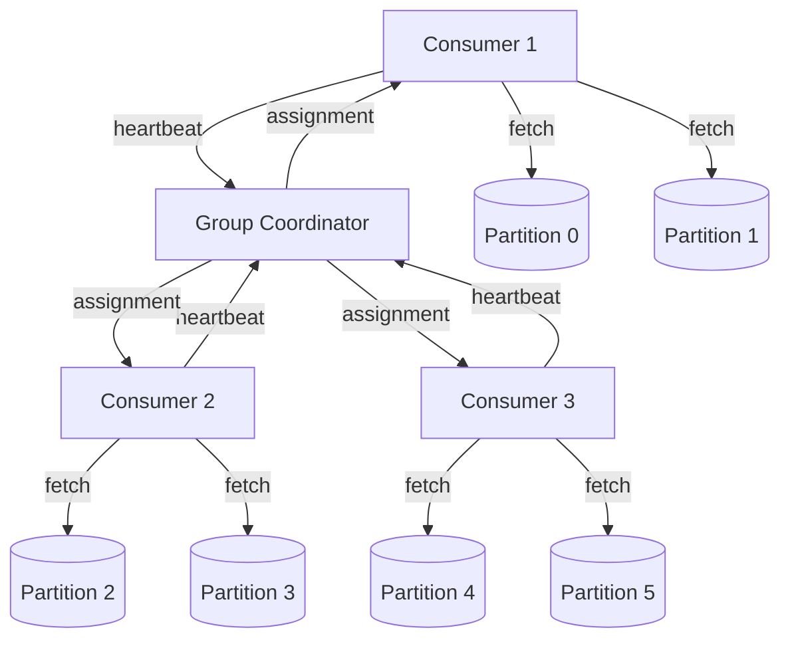

# Chapter 6 — Kafka Internals

> Kafka's default consumer configuration assumes sub-second processing. LLM
> inference takes 10-60 seconds. If you do not change the defaults, you lose
> your partition assignment mid-inference and process the same message twice.

---

## Learning Objectives

By the end of this chapter you will be able to:

- Explain why Kafka's default session timeout breaks under LLM processing times
  and configure timeouts that prevent spurious rebalances.
- Implement idempotent message production that prevents duplicate processing of
  expensive model calls.
- Design a consumer that sends heartbeats during long-running inference without
  blocking the processing thread.
- Route unprocessable messages to a dead letter queue with categorized failure
  reasons for debugging.
- Apply backpressure when the model provider rate-limits you, pausing
  consumption rather than building an unbounded queue.
- Calculate consumer lag and use it to size your consumer group appropriately.

---

## The Production Story

Consider an insurance company building an automated claims processing pipeline.
Documents arrive as scanned PDFs, get OCR'd, and feed into a frontier-tier
model that extracts structured claim data: claimant, date of loss, damage
description, estimated amount. The extraction takes 20-40 seconds per document
depending on complexity.

The team chose Kafka because they needed durability, replay, and decoupling
between the document intake service and the extraction workers. They had run
Kafka in production for years on other workloads.

Within the first week, strange behavior appeared. The extraction workers would
process a document, commit the offset, and then — inexplicably — process the
same document again. Duplicate extractions meant duplicate downstream records,
and the deduplication logic they hastily added was itself buggy. Some claims
appeared three times in the database.

The on-call engineer checked the consumer logs and found rebalance events every
30-45 seconds. The partition assignments were churning constantly. Each
rebalance reset some offsets to the last committed position, causing the same
documents to be reprocessed.

The team suspected network issues between the consumers and the broker. They
checked connectivity, increased timeouts, and added retry logic. Nothing
changed. The rebalances continued, and so did the duplicates.

What they did not check was the relationship between their processing time and
the consumer's session timeout. The default session timeout was 10 seconds. The
average document took 25 seconds to process. By the time extraction finished,
the broker had already decided the consumer was dead, revoked its partitions,
and assigned them to another consumer — which started processing the same
document from the last committed offset.

---

## Why This Exists

Event-driven architectures predate LLMs by decades. Kafka, specifically, solved
the problem of decoupling producers from consumers at scale: write events to
durable logs, let consumers read at their own pace, and guarantee ordering
within a partition.

The traditional consumer model assumes fast processing. A consumer polls for
messages, processes them, and polls again. The broker tracks which consumers
are alive by requiring periodic heartbeats. If a consumer stops heartbeating
for longer than the session timeout, the broker assumes it crashed and
reassigns its partitions.

This model worked because processing was fast. A web request handler might take
50 milliseconds. A data transformation might take 200 milliseconds. Even a slow
database query rarely exceeds a few seconds. The default 10-second session
timeout gave plenty of margin.

LLM inference changes the math. A single request to a frontier model can take
30 seconds. A batch of requests can take minutes. If your consumer is blocked
waiting for a model response, it cannot send heartbeats, and the broker will
reassign its partitions.

The consequences are worse than just rebalances. When a partition is reassigned
mid-processing, the new consumer starts from the last committed offset. If the
original consumer committed before starting processing (common for at-least-once
semantics), the message gets processed twice. If the model call costs money,
you pay twice. If the downstream system does not handle duplicates, you corrupt
your data.

The solution is not to abandon Kafka. The durability, ordering, and decoupling
are still valuable. The solution is to configure Kafka for workloads where
processing time is measured in tens of seconds, not hundreds of milliseconds.

---

## Core Concepts

**Partition.** A Kafka topic is split into partitions, each an ordered,
immutable sequence of messages. Partitions are the unit of parallelism: each
partition is consumed by exactly one consumer in a consumer group at any time.
More partitions allow more consumers to work in parallel.

**Consumer group.** A set of consumers that cooperate to consume a topic. The
broker assigns partitions to consumers in the group, ensuring each partition
has exactly one owner. When a consumer joins or leaves, the broker rebalances
partitions across the remaining consumers.

**Session timeout.** The time a broker waits without a heartbeat before
declaring a consumer dead. Default is 10 seconds. If processing takes longer
than this, the consumer appears dead while it is actually working.

**Heartbeat interval.** How often a consumer sends heartbeats to the broker.
Default is 3 seconds. In traditional consumers, heartbeats are sent by a
background thread while the main thread processes messages.

**Max poll interval.** The maximum time between poll() calls. Unlike session
timeout (which is about heartbeats), this is about the processing loop itself.
If a consumer does not call poll() within this interval, it is considered stuck.
Default is 5 minutes.

**Offset.** A consumer's position in a partition. Offsets are committed
(checkpointed) to track progress. When a consumer restarts or a partition is
reassigned, consumption resumes from the last committed offset.

**Idempotency.** The property that processing a message multiple times produces
the same result as processing it once. Critical for LLM workloads because the
cost of duplicate processing is high.

**Dead letter queue (DLQ).** A destination for messages that cannot be
processed after repeated attempts. Rather than block the partition forever,
unprocessable messages are moved to a separate topic for manual inspection and
potential replay.

**Backpressure.** The mechanism for consumers to signal they cannot keep up.
When the model provider rate-limits you, backpressure pauses consumption
rather than building an unbounded queue of requests that will all fail.

---

## Internal Architecture

Kafka's consumer protocol has three participants: the consumer, the group
coordinator (a broker elected to manage the consumer group), and the partition
leaders (brokers holding the actual data).



*Consumers heartbeat to the group coordinator, which manages partition
assignments. Each consumer fetches directly from the brokers holding its
assigned partitions.*

### The heartbeat problem

In traditional Kafka clients, the consumer runs two threads:

1. **Heartbeat thread** — sends periodic heartbeats to the group coordinator,
   independent of processing.
2. **Processing thread** — calls poll(), processes messages, calls poll() again.

This separation means the heartbeat continues even if processing is slow. The
session timeout triggers only if the heartbeat thread itself stops, which
happens only if the consumer process dies.

The problem: not all clients implement this separation. Some clients send
heartbeats as part of poll(), meaning if processing takes longer than the
session timeout, the broker declares the consumer dead. Even clients that do
separate heartbeats may have the heartbeat thread share resources with
processing in ways that cause stalls.

For LLM workloads, assume the worst case and configure accordingly.

### The rebalance cascade

When a consumer exceeds the session timeout:

1. Group coordinator marks the consumer as dead.
2. Coordinator triggers a rebalance, revoking all partitions.
3. Surviving consumers receive new assignments.
4. New partition owners start from the last committed offset.
5. If the "dead" consumer was mid-processing, that message is now being
   processed by two consumers.
6. When the original consumer finishes and tries to commit, it discovers it
   no longer owns the partition.
7. Depending on the client, it may throw an error or silently fail to commit.

The cascade gets worse under load. Rebalances cause processing delays, which
cause more consumers to exceed their session timeouts, which cause more
rebalances. A minor latency spike becomes a cascade of rebalances that
destabilizes the entire consumer group.

### Offset commit strategies

Three strategies for when to commit offsets:

**Commit-before-process.** Commit the offset immediately after receiving the
message, before processing. Guarantees at-most-once delivery: if processing
fails, the message is lost. Rarely appropriate for LLM workloads where
reprocessing is better than data loss.

**Commit-after-process.** Commit the offset only after successful processing.
Guarantees at-least-once delivery: if the consumer crashes mid-processing, the
message is reprocessed. This is the standard choice, but it means duplicates
are possible.

**Transactional commit.** Commit the offset and produce output atomically using
Kafka transactions. Guarantees exactly-once semantics within Kafka, but does not
extend to external systems like databases or model providers. You still need
idempotency for the model call itself.

---

## Production Design

**Set session timeout to 2-3x your maximum processing time.** If your longest
model call takes 60 seconds, set session.timeout.ms to 120000-180000. This
gives margin for variance without making dead-consumer detection too slow.

**Set heartbeat interval to 1/6 of session timeout.** This ensures at least 3-4
heartbeats within each session window. With a 120-second timeout, use a
20-second heartbeat interval.

**Reduce max.poll.records aggressively.** The default (500) assumes fast
processing. For LLM workloads, set this to 1-10. Processing a batch of 10
messages at 30 seconds each takes 5 minutes; processing 500 would take over 4
hours.

**Emit these metrics, labeled by consumer group and topic:**

| Metric | Type | Why it matters |
| --- | --- | --- |
| `consumer_lag` | gauge | Growing lag means consumers cannot keep up |
| `processing_time_seconds` | histogram | Detect when processing exceeds timeout |
| `rebalances_total` | counter | Frequent rebalances indicate timeout misconfiguration |
| `heartbeat_latency_ms` | histogram | High latency predicts session timeout |
| `dlq_messages_total` | counter | Growing DLQ indicates systemic processing failures |
| `duplicates_detected` | counter | Measures effectiveness of idempotency |

**Use idempotency keys for exactly-once producer semantics.** Generate a
deterministic key from the request content. When the producer retries due to
network errors, the broker deduplicates based on the key. This prevents the
producer-side duplicates that are independent of consumer-side rebalances.

**Route failures to a DLQ after N retries.** A poison message — one that
consistently fails processing — blocks the entire partition if not handled.
After 3-5 retries, move it to a dead letter topic for manual inspection. The
DLQ should capture the original message, the failure reason, and enough context
to replay after fixing the issue.

**Categorize DLQ entries by failure reason.** "Bad request" errors will fail
again on retry; "rate limit" errors might succeed later. Categorization helps
you decide which messages to replay and which to discard.

---

## Failure Scenarios

### Failure: rebalance during inference

**Symptom.** Messages are processed multiple times. Downstream systems show
duplicates. Consumer logs show frequent "Rebalance in progress" messages and
offset commit failures.

**Mechanism.** Processing time exceeds session timeout. The broker declares the
consumer dead, reassigns its partitions, and the new owner starts processing
from the last committed offset. The original consumer finishes processing but
cannot commit because it no longer owns the partition.

**Detection.** Alert on rebalance frequency. More than 1 rebalance per 10
minutes in a stable group is suspicious. Also alert when processing_time_p99
approaches session_timeout * 0.5.

**Mitigation.** Increase session.timeout.ms immediately. This stops the
rebalance cascade. Then reduce max.poll.records to lower per-batch processing
time.

**Prevention.** Configure session.timeout.ms to 2-3x your maximum processing
time before deploying. Include processing time variance in your calculation —
the p99, not the median.

### Failure: poison message blocks partition

**Symptom.** One partition's lag grows indefinitely while others stay healthy.
Consumer logs show the same message being processed repeatedly, always failing.

**Mechanism.** A message cannot be processed due to a bug, corrupt data, or an
edge case the handler does not cover. The consumer retries forever because
there is no retry limit, blocking all subsequent messages in that partition.

**Detection.** Alert when a single partition's lag exceeds 2x the average lag.
Also track per-message retry count and alert when any message exceeds 3
retries.

**Mitigation.** Skip the message manually by advancing the committed offset, or
restart the consumer with a flag to ignore the specific message ID. Both are
emergency measures that risk data loss.

**Prevention.** Implement DLQ routing after a fixed number of retries. Three
retries is usually enough to distinguish transient from permanent failures.
Ensure the DLQ handler captures enough context to debug and replay.

### Failure: backpressure ignored causes retry storm

**Symptom.** After the model provider rate-limits you, error rate stays high
for minutes even after the rate limit window expires. Consumer lag grows
rapidly during the spike.

**Mechanism.** Consumers continue polling and processing during the rate limit.
Each request fails, but the message stays in the queue to be retried. The retry
attempts also fail, and now you have N messages each generating M retry
attempts. When the rate limit expires, you have N*M pending requests all trying
to execute at once, immediately triggering another rate limit.

**Detection.** Alert when 429 (rate limit) errors exceed 5% of requests. Track
the queue depth and alert when it exceeds normal operating levels during a rate
limit period.

**Mitigation.** Pause consumption immediately when rate limited. Apply
exponential backoff before resuming. Do not resume until the rate limit window
has clearly passed.

**Prevention.** Implement automatic backpressure: when the consumer detects a
rate limit response, it pauses its partition assignments and enters a backoff
period. The pause should be at the consumer level, not the request level, to
prevent queue buildup.

### Failure: idempotency key collision

**Symptom.** Different requests are deduplicated as if they were the same.
Some requests never reach the model because they are mistakenly identified as
duplicates.

**Mechanism.** The idempotency key generation does not include all relevant
fields. Two requests with different prompts but the same tenant and workload
hash to the same key. The second request is discarded as a duplicate.

**Detection.** Compare produced message count to unique request count. A
significant gap (beyond expected retries) indicates false-positive deduplication.

**Mitigation.** None that recovers the discarded requests. You must resubmit
with corrected idempotency keys.

**Prevention.** Include all request-varying fields in the idempotency key:
prompt, model tier, max tokens, and any tenant-specific parameters. Hash the
full request, not just metadata.

---

## Scaling Strategy

**First: consumer lag, around 100 requests per consumer.** When lag exceeds
100 messages per consumer, processing cannot keep up with production. Add more
consumers — Kafka supports up to one consumer per partition, so ensure you have
enough partitions. If you have 4 partitions and 4 consumers, adding a 5th
consumer does nothing.

**Second: partition count, around 10 consumers.** If you need more parallelism
than your partition count allows, you must increase partitions. This is a
disruptive operation that rebalances all consumers. Plan partition count for
future scale, not just current needs. 12-24 partitions is reasonable for most
LLM workloads.

**Third: broker throughput, around 100 MB/s per broker.** LLM request messages
are typically small (a few KB), so this limit is rarely reached. If you are
passing large documents through Kafka rather than references, you may hit it
sooner.

**Fourth: coordinator overload, around 500 consumers.** The group coordinator
handles all heartbeats and rebalances for a consumer group. At very high
consumer counts, coordinator operations become a bottleneck. Split into
multiple consumer groups, each handling a subset of partitions.

---

## Trade-offs

| Decision | Buys you | Costs you | Choose when |
| --- | --- | --- | --- |
| High session timeout | No spurious rebalances | Slow dead-consumer detection | Processing time is predictable |
| Low session timeout | Fast failure detection | Rebalances during normal processing | Processing time is sub-second |
| Commit-after-process | At-least-once delivery | Possible duplicates | Data loss is worse than duplicates |
| Commit-before-process | No duplicates | Possible data loss | Duplicates are worse than loss |
| Single message per poll | Predictable processing time | Lower throughput | Processing time varies widely |
| Batch processing | Higher throughput | Risk of timeout on large batches | Processing time is consistent |
| DLQ after 3 retries | Partitions never block | Some messages need manual handling | Failures are rare and require investigation |
| DLQ after 1 retry | Fast partition recovery | Transient failures go to DLQ | Retries rarely succeed |
| Idempotent producer | No producer-side duplicates | Slight latency overhead | Network is unreliable |
| Non-idempotent producer | Lower latency | Duplicates on retry | Network is local and reliable |

---

## Code Walkthrough

From `examples/ch06-kafka/`. The simulator provides Kafka-like semantics
entirely in-memory, allowing the lab to run without Docker or external services.

### Consumer configuration for LLM workloads

The default configuration assumes sub-second processing. This configuration
assumes 60-second maximum processing time.

```ts
// examples/ch06-kafka/src/types.ts

export const DEFAULT_CONSUMER_CONFIG: ConsumerConfig = {
  groupId: 'llm-processor',
  sessionTimeoutMs: 120_000,    // 2 minutes - must exceed max processing
  heartbeatIntervalMs: 10_000,  // Every 10 seconds
  maxProcessingTimeMs: 60_000,  // 1 minute max per message
  maxRetries: 3,
  backoffBaseMs: 1000,
  backoffMaxMs: 30_000,
};
```

1. Session timeout is 2x the maximum processing time, giving margin for
   variance.
2. Heartbeat interval is 1/12 of session timeout, ensuring multiple heartbeats
   per session window.
3. Max retries is 3 — enough to handle transient failures, low enough to route
   permanent failures to DLQ quickly.

### Processing with heartbeats

The consumer must send heartbeats during long processing to maintain its
session.

```ts
// examples/ch06-kafka/src/consumer.ts

async processMessage(
  message: Message,
  partition: number,
  offset: number,
  handler: MessageHandler
): Promise<ProcessResult> {
  const startTime = Date.now();

  try {
    // Check heartbeat before processing
    const hb = this.heartbeat();                                // (1)
    if (!hb.success) {
      throw new Error('Session timeout exceeded');
    }

    // Process with timeout
    const result = await Promise.race([                         // (2)
      handler(message),
      new Promise<never>((_, reject) =>
        setTimeout(
          () => reject(new Error('Processing timeout')),
          this.config.maxProcessingTimeMs
        )
      ),
    ]);

    if (result.success) {
      this.kafka.commitOffset(                                  // (3)
        this.config.groupId, this.topic, partition, offset + 1
      );
      return { success: true, retriable: false, sentToDLQ: false };
    }

    // Determine if failure is retriable
    if (this.isRetriable(result.error) &&
        message.attempts < this.config.maxRetries) {
      return { success: false, retriable: true, sentToDLQ: false };
    }

    // Non-retriable or exhausted retries: send to DLQ
    this.kafka.sendToDLQ(message, result.error);                // (4)
    this.kafka.commitOffset(
      this.config.groupId, this.topic, partition, offset + 1
    );
    return { success: false, retriable: false, sentToDLQ: true };

  } catch (error) {
    // Timeout or session error: send to DLQ
    this.kafka.sendToDLQ(message, error.message);
    return { success: false, retriable: false, sentToDLQ: true };
  }
}
```

1. Check heartbeat status before processing. If we have already exceeded the
   session timeout, do not start processing — the partition may be reassigned.
2. Race the handler against a timeout promise. This enforces max processing
   time even if the handler hangs.
3. Commit offset only after successful processing. This ensures at-least-once
   delivery.
4. DLQ routing for non-retriable errors. The offset is still committed to
   prevent the message from blocking the partition.

### Idempotent message production

The producer generates idempotency keys from request content to prevent
duplicate processing of expensive model calls.

```ts
// examples/ch06-kafka/src/producer.ts

produce(request: LLMRequest, idempotencyKey: string): ProduceResult {
  // Check in-flight limit
  if (this.inFlightCount >= this.config.maxInFlight) {          // (1)
    throw new Error('Max in-flight limit reached');
  }

  this.inFlightCount++;

  try {
    const result = this.kafka.produce(                          // (2)
      this.topic, request, idempotencyKey
    );

    return {
      success: true,
      messageId: result.messageId,
      isDuplicate: result.isDuplicate,                          // (3)
      topic: this.topic,
      partition: this.getPartition(idempotencyKey),
      offset: result.offset,
      idempotencyKey,
    };
  } finally {
    this.inFlightCount--;
  }
}

static generateIdempotencyKey(
  request: LLMRequest,
  additionalSalt?: string
): string {
  const components = [                                          // (4)
    request.tenant,
    request.workload,
    request.prompt,
    request.tier,
    request.maxTokens.toString(),
  ];
  // Hash all components
  return hashComponents(components);
}
```

1. In-flight limit prevents the producer from overloading the broker. For
   exactly-once semantics, this should be 1.
2. The broker checks the idempotency key before writing. If the key exists,
   the message is not written again.
3. The result indicates whether this was a duplicate. The caller can use this
   to avoid unnecessary downstream work.
4. The idempotency key includes all request-varying fields. Two requests with
   identical content produce the same key and are deduplicated.

### Backpressure handling

When the model provider rate-limits you, pause consumption to prevent queue
buildup.

```ts
// examples/ch06-kafka/src/consumer.ts

poll(maxMessages: number): Message[] {
  if (this.paused || this.backpressure.isPaused) {              // (1)
    return [];
  }

  // Check rate limit window
  if (this.backpressure.rateLimitedUntil) {
    if (Date.now() < this.backpressure.rateLimitedUntil) {      // (2)
      return [];
    }
    this.backpressure.rateLimitedUntil = null;
  }

  // Fetch messages from assigned partitions
  const messages = this.fetchFromPartitions(maxMessages);
  this.backpressure.queueDepth = messages.length;
  return messages;
}

applyRateLimit(durationMs: number): void {
  this.backpressure.rateLimitedUntil = Date.now() + durationMs; // (3)
  this.pause();
  this.kafka.recordBackpressurePause();
}
```

1. Check pause state before polling. If paused, return empty immediately.
2. If rate-limited, check whether the window has expired before polling.
3. When a rate limit is detected, set the pause duration and record the event.
   The consumer will not poll until the window expires.

---

## Hands-On Lab

**Goal:** verify that LLM-specific Kafka configuration handles long processing
times, prevents duplicates, routes failures to DLQ, and applies backpressure.
About 1 minute, Node 22.6+, no dependencies.

```bash
cd examples/ch06-kafka
node scripts/lab.mjs
```

The lab runs four steps and asserts sixteen claims. Everything runs in-memory
using the KafkaSimulator.

**Step 1 — consumer timeout handling at 30s processing time.**

Produces a message, processes it with simulated 30-second inference, and
verifies the consumer maintains its session through heartbeats.

```
  [PASS] message produced successfully
  [PASS] message received by consumer
  [PASS] 30s processing completes without session timeout
  [PASS] heartbeats sent during processing
```

The session timeout is 120 seconds; processing takes 30 seconds with periodic
heartbeats. The consumer keeps its partition assignment throughout.

**Step 2 — DLQ routing for failed messages.**

Produces five messages that will fail with "bad request" errors. Verifies all
are routed to the DLQ and categorized as non-retriable.

```
  [PASS] failed messages routed to DLQ
  [PASS] DLQ entries categorized correctly
```

Non-retriable errors (bad request, invalid input, content policy violations)
go directly to DLQ rather than retrying forever.

**Step 3 — exactly-once via idempotency keys.**

Produces the same message three times with the same idempotency key. Verifies
only one message is written; the duplicates are detected and rejected.

```
  [PASS] first produce succeeds
  [PASS] second produce detected as duplicate
  [PASS] third produce detected as duplicate
  [PASS] duplicate counter incremented correctly
  [PASS] only one message produced
```

The idempotency key is generated from the full request content. Retries due to
network errors do not create duplicate messages.

**Step 4 — backpressure pauses consumption.**

Produces messages, polls successfully, then applies a rate limit. Verifies
polling returns nothing while rate-limited, and the backpressure state is
tracked.

```
  [PASS] messages received before pause
  [PASS] no messages during backpressure
  [PASS] backpressure state tracked
  [PASS] backpressure state cleared after resume
  [PASS] backpressure pause recorded
```

When the model provider returns a 429, the consumer pauses rather than building
an unbounded queue of requests that will all fail.

---

## Interview Questions

1. Why does a 10-second session timeout cause problems for LLM consumers, and
   what is the correct setting?

2. A consumer processes a message, commits the offset, and then crashes before
   writing to the database. What happens when it restarts?

3. How do you prevent duplicate model calls when the producer retries due to
   network errors?

4. Your consumer group has 4 consumers and 4 partitions. One consumer starts
   taking 2x longer than the others. What happens?

5. When should a message go to the dead letter queue versus being retried?

6. The model provider starts returning 429 (rate limit) errors. What should
   the consumer do, and why?

7. How do you calculate the right number of partitions for an LLM workload?

8. A partition's lag is growing while other partitions are healthy. What are
   the likely causes?

---

## Staff-Level Answers

**Q1 — session timeout for LLM consumers.** The junior answer is "increase the
timeout." The senior answer names a specific multiplier: 2-3x the maximum
expected processing time. The staff answer adds the reasoning: you need margin
for variance in model response times, but not so much margin that dead
consumers go undetected for minutes. At 60-second max processing, 120-second
timeout gives a 2x safety factor while still detecting a dead consumer within
2 minutes.

Then the staff addition: the session timeout is only half the story. You also
need to ensure heartbeats continue during processing. Some clients send
heartbeats from a separate thread; some send them only during poll(). Know your
client's behavior. If heartbeats are tied to poll(), you need the processing
loop to call poll() periodically even while waiting for model responses —
which means structuring your code around incremental processing rather than
blocking calls.

**Q2 — commit-then-crash recovery.** The message is not reprocessed. Commit-
after-process means you lose data on crash. The more common pattern is process-
then-commit, which means you might reprocess on crash but never lose data.

The staff move is to identify this as the at-least-once versus at-most-once
trade-off and explain why at-least-once is usually correct for LLM workloads:
model calls are expensive, so reprocessing is cheaper than the cost of a lost
request that a customer paid for. Then design for idempotency in the downstream
system so that reprocessing is actually safe.

**Q4 — one slow consumer in a balanced group.** If the slow consumer exceeds
the session timeout, it triggers a rebalance. Its partitions are assigned to
other consumers, which now have 2 partitions each instead of 1. If those
consumers were already at capacity, they may also start exceeding timeouts,
cascading into a rebalance storm.

The staff answer identifies the root cause before proposing solutions. Why is
one consumer slow? Is it processing different data (larger documents, more
complex prompts)? Is it a deployment issue (one node with less resources)? Is
it a noisy neighbor on that host?

If the slowness is inherent to the data, the solution is weighted partition
assignment — give more partitions to faster consumers. If it is a deployment
issue, fix the deployment. Do not increase timeouts to accommodate the
pathological case; that delays detection of actual failures.

**Q6 — handling rate limit responses.** Pause consumption. Do not retry. Do
not queue more requests. The goal is to stop sending requests until the rate
limit window expires.

The junior approach is exponential backoff on the individual request. The
problem: you now have N other messages polling and failing, each contributing
to the retry load. By the time the window expires, you have N*M pending
retries that immediately re-trigger the rate limit.

The staff approach is backpressure at the consumer level. When any request
returns a 429, pause the entire consumer for the rate limit duration (usually
indicated in a Retry-After header). This stops all polling, prevents queue
buildup, and ensures a clean restart when the window expires.

**Q7 — calculating partition count.** Partitions set the upper bound on
parallelism: you cannot have more consumers than partitions doing useful work.
The calculation: expected_peak_throughput / processing_rate_per_consumer.

If peak throughput is 100 requests/minute and each consumer processes 10
requests/minute (6 seconds per request), you need 10 consumers, which means at
least 10 partitions. Round up to 12 or 16 for growth headroom.

The staff consideration: partition count is hard to change later. Increasing
partitions requires rebalancing all consumers, and some messages may be
reordered relative to their original partition. Plan for 2-3x current needs,
not just current needs. 24 partitions is a reasonable default for most LLM
workloads; it supports up to 24 consumers and can be reduced if you over-
provisioned.

---

## Exercises

1. **Timeout math.** Your model calls take 15-45 seconds (uniform distribution).
   Calculate the session timeout that gives 99% confidence no legitimate
   processing will trigger a rebalance. Then calculate how long a dead consumer
   goes undetected with this setting.

2. **Implement a heartbeat thread.** Modify the consumer in `examples/ch06-kafka/`
   to send heartbeats from a background interval rather than inline with
   processing. Verify it prevents rebalances during long processing.

3. **DLQ replay dashboard.** Extend the DLQHandler to support filtering by
   time range and bulk replay with rate limiting. Implement a function that
   replays all messages from the last hour that failed due to rate limits,
   with a 1-second delay between each.

4. **Partition assignment simulation.** Write a simulation that assigns 12
   partitions across 5 consumers, has one consumer fail, and shows how the
   partitions are redistributed. Track which messages are reprocessed due to
   the rebalance.

5. **Design question.** A team wants to process 10,000 LLM requests per hour
   with 30-second average processing time. Design the Kafka configuration:
   partition count, consumer count, timeout settings, and expected lag. Include
   the formula showing how the numbers relate.

---

## Further Reading

- **Apache Kafka documentation, "Consumer Configs"** — the authoritative source
  for session.timeout.ms, heartbeat.interval.ms, max.poll.interval.ms, and
  max.poll.records. Read the descriptions carefully; the interactions between
  these settings are not obvious.

- **Kleppmann, *Designing Data-Intensive Applications*, Chapter 11** — the
  stream processing chapter covers exactly-once semantics, idempotency, and the
  dual-write problem. The framing is not LLM-specific but the patterns apply
  directly.

- **Confluent blog, "Kafka Consumer Group Rebalance"** — a detailed explanation
  of the rebalance protocol, including cooperative rebalancing (which reduces
  stop-the-world pauses). Worth understanding even if you are not using
  Confluent's client.

- **Narkhede, Shapira, and Palino, *Kafka: The Definitive Guide*, Chapter 4** —
  the consumer chapter covers offset management, partition assignment, and the
  various commit strategies. More depth than the official documentation.

- **Your model provider's rate limit documentation** — rate limits vary by
  provider, tier, and time of day. The Retry-After header format differs.
  Understanding your specific provider's behavior is prerequisite to
  implementing backpressure correctly.

- **Jepsen Kafka tests** — analyses of Kafka's durability and consistency
  guarantees under various failure conditions. If you are relying on exactly-
  once semantics, understand when they actually hold and when they do not.
