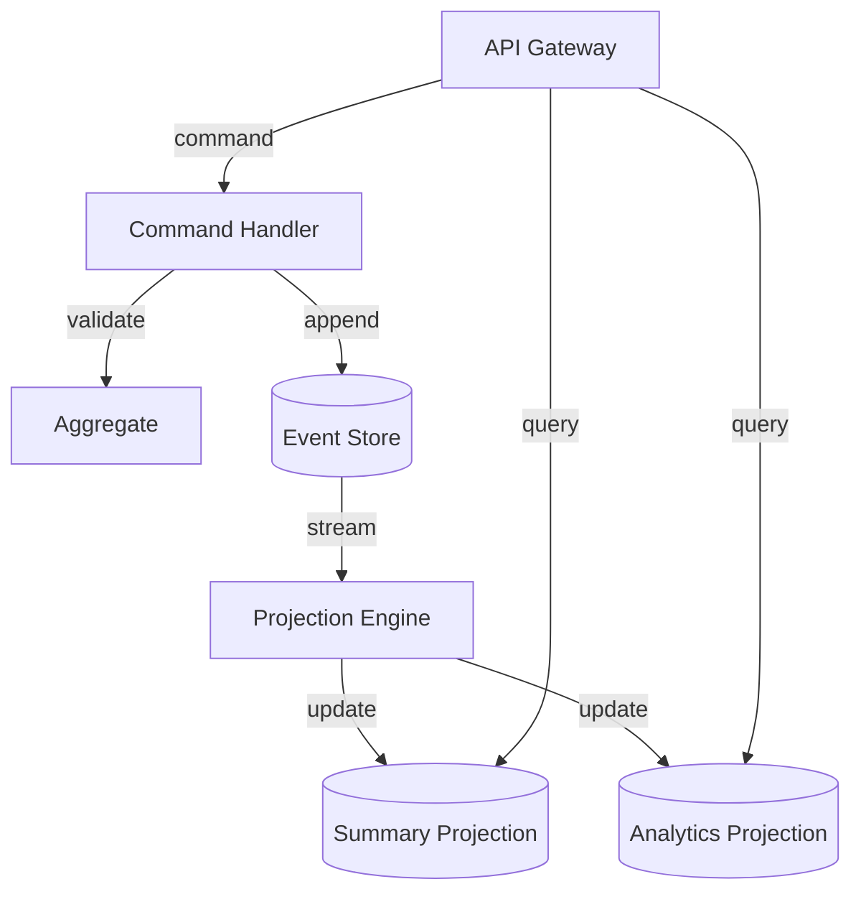

# Chapter 7 — Event-Driven Architecture Patterns

> Every AI interaction is an event. Event sourcing makes this explicit: instead
> of storing "what is", you store "what happened" and derive state by replay.
> The audit trail comes free, temporal queries become trivial, and rebuilding
> any projection is a matter of replaying the stream.

---

## Learning Objectives

By the end of this chapter you will be able to:

- Implement event sourcing for AI conversation state, deriving current state
  from immutable event sequences rather than mutable records.
- Apply CQRS to separate command processing from query optimization, using
  different models for writes and reads.
- Design event schemas that evolve without breaking existing consumers, using
  versioning and migration strategies.
- Enforce ordering guarantees at the aggregate level while allowing parallel
  processing across aggregates.
- Implement idempotent event processing that handles duplicates without
  re-executing expensive model calls.
- Build projections that transform event streams into query-optimized read
  models with eventual consistency.

---

## The Production Story

Consider a customer support platform using AI assistants for first-line
response. Each conversation involves multiple model calls: greeting,
understanding the issue, suggesting solutions, escalating if needed. The
platform logs these interactions for compliance, tracks token usage for
billing, and provides analytics dashboards for support managers.

The initial design used a traditional CRUD approach. Each conversation had a
row in Postgres with a JSONB column holding the message history. Token counts
were updated in place. Tier changes (switching from frontier to mid-tier model
when budget thresholds approached) updated a `current_tier` column.

Three months in, compliance asked for an audit trail. "Show me exactly what
the AI said at 2:47 PM on March 15th." The engineering team added an audit
log table, duplicating write operations to capture history. Now every update
wrote to two tables, and they discovered the hard way that the audit log
sometimes lagged behind the main table during high load.

Then analytics wanted to know how often tier switches correlated with customer
escalations. The current schema did not capture tier changes as discrete
events — it only stored the current tier. A migration was needed to extract
tier change history from application logs, which were incomplete because
not every service logged tier changes consistently.

The billing team reported discrepancies. Some conversations showed token
counts that did not match the sum of individual messages. Investigation
revealed that concurrent updates sometimes overwrote each other — two
assistant responses arriving milliseconds apart, each reading the old token
count and writing a new one. The second write lost the first's tokens.

The on-call engineer stared at the database, trying to figure out how a
conversation reached its current state. The audit log showed writes, but not
the order they were applied. The application logs showed intents, but not
outcomes. Reconstructing what happened required correlating four different
data sources, and even then, the answer was "probably."

---

## Why This Exists

Event-driven architecture predates AI systems by decades. The core insight:
systems that store "what happened" instead of "what is" gain capabilities
that are expensive or impossible to retrofit later.

Traditional state-based systems store the current value. A bank account has
a balance of $1,000. To know the balance, you read the row. Simple. But if
someone asks "what was the balance on Tuesday?", you need a separate audit
system. If the balance is wrong, you have no record of how it got that way.

Event-sourced systems store the history. The account has deposits and
withdrawals. The balance is derived by summing them. To know the balance
on Tuesday, you sum events up to Tuesday. If the balance is wrong, you can
replay the events and find the bug.

The AI domain is naturally event-shaped. A conversation is not a static
document — it is a sequence of interactions. A user sends a message, the
system processes it, the model responds. Each step is an event. Storing
events explicitly, rather than only the resulting state, aligns the data
model with the domain model.

The benefits for AI systems:

**Audit without separate logging.** Every model call, every tier switch,
every response is an event in the primary store. Compliance queries are
just event queries.

**Temporal queries without versioning tables.** "What did the conversation
look like before the hallucination?" Replay events up to that timestamp.

**Analytics from the same data.** Token usage trends, tier switch patterns,
response latency distributions — all derivable from the event stream without
ETL pipelines.

**Recovery without backups.** If a projection corrupts, rebuild it from
events. If a bug miscounted tokens, fix the bug and replay.

The cost is complexity. You need projections to answer queries efficiently.
You need careful schema design to allow evolution. You need idempotency
to handle duplicate deliveries. These are solvable problems, but they are
problems you do not have with a simple CRUD approach.

The trade-off: event sourcing is more work upfront in exchange for more
capability later. For AI systems with compliance requirements, billing
needs, and complex analytics, the trade-off usually favors events.

---

## Core Concepts

**Event.** An immutable record of something that happened. Events have a
type, a timestamp, a payload, and a version. Once written, an event never
changes. "Conversation started" is an event. "Message sent" is an event.
"Tier changed" is an event.

**Event store.** A durable, append-only log of events. You can append new
events and read existing ones. You cannot update or delete. The store
maintains ordering within each aggregate.

**Aggregate.** A cluster of related events that form a consistency boundary.
For conversations, the aggregate is a single conversation. All events for
that conversation are ordered relative to each other. Events across different
conversations have no ordering relationship.

**Rehydration.** The process of reconstructing current state from events.
Load all events for an aggregate, apply them in order, and you have the
current state. This is how you "read" an aggregate.

**Projection.** A read model built by processing events. Projections are
optimized for specific queries. A "conversation summary" projection might
store message count and total tokens. A "tenant analytics" projection
might aggregate across all conversations. Projections can be rebuilt
from scratch by replaying all events.

**Command.** A request to change state. Commands are validated against
business rules and, if valid, produce events. "Send message" is a command.
It validates the conversation is active, then produces a "message sent"
event.

**CQRS.** Command Query Responsibility Segregation. The principle that
the model for changing data (commands) should be separate from the model
for reading data (queries). Commands produce events; queries read
projections.

**Idempotency.** The property that processing something multiple times
produces the same result as processing it once. Critical when events
might be delivered more than once.

**Schema version.** A marker indicating which version of an event schema
a particular event uses. Allows old events to be migrated to new schemas
during replay.

---

## Internal Architecture

An event-driven AI system has three main components: the event store, the
command handler, and the projection engine.



*Commands flow through the handler to the event store. Events flow to
projections that serve queries. The two paths are independent.*

### Event store internals

The event store maintains two indexes:

1. **Per-aggregate log.** Events for a single aggregate, ordered by version.
   Used for rehydration.
2. **Global log.** All events across all aggregates, ordered by position.
   Used for projections that need total ordering.

Appending to the per-aggregate log uses optimistic concurrency. The writer
specifies the expected version; if the actual version differs, the write
fails. This prevents concurrent writers from creating conflicting event
sequences.

```
Aggregate: conv_001
  Version 1: conversation.started
  Version 2: message.sent (user)
  Version 3: message.sent (assistant)
  Version 4: tier.changed
  Version 5: message.sent (user)
```

The global log assigns a monotonically increasing position to each event.
Projections track their position and resume from where they left off after
restart.

### Command processing flow

1. **Receive command.** API receives "send message" request.
2. **Load aggregate.** Read events from store, rehydrate current state.
3. **Validate.** Check business rules against current state. Is conversation
   active? Is user authorized?
4. **Produce events.** If valid, create "message.sent" event with next
   version number.
5. **Append.** Write event to store with expected version. If version
   mismatch, retry from step 2.
6. **Return.** Acknowledge command success.

The key insight: the command handler does not update state directly. It
produces events that describe what happened. The state change is implicit
in the event.

### Projection processing flow

1. **Read from global log.** Get events after current position.
2. **Apply each event.** Update projection state based on event type.
3. **Update position.** Record new position for resume.
4. **Repeat.** Continue until caught up with store.

Projections are eventually consistent with the event store. There is a
small window after an event is written but before projections process it.
For most AI workloads, milliseconds of lag is acceptable.

### Snapshot optimization

For aggregates with many events, rehydration becomes expensive. Snapshots
capture aggregate state at a point in time. To rehydrate, load the snapshot
and replay only events after the snapshot version.

```
Aggregate: conv_001
  Snapshot at version 100: { messages: [...], tokens: 5000, tier: 'mid' }
  Version 101: message.sent
  Version 102: message.sent
  ...
```

Rehydrating this conversation loads the snapshot and replays 2 events,
not 102 events.

Snapshot frequency is a trade-off. More frequent snapshots reduce replay
time but increase storage. For conversations, snapshotting every 50-100
events is reasonable.

---

## Production Design

**Use append-only storage.** Postgres with an insert-only table works.
Event stores like EventStoreDB are purpose-built. Kafka works but requires
compaction configuration that preserves full history.

**Partition by aggregate ID.** Events for different conversations can
be stored in different partitions. This allows parallel writes and reads.
Within a partition, maintain strict ordering.

**Version every event.** Include a version number in every event, starting
at 1 for the first event in each aggregate. Use optimistic concurrency on
writes: `INSERT ... WHERE version = expected_version`.

**Emit these metrics:**

| Metric | Type | Why it matters |
| --- | --- | --- |
| `events_appended_total` | counter | Write throughput |
| `rehydration_events` | histogram | Events per aggregate load |
| `projection_lag_seconds` | gauge | How far behind projections are |
| `snapshot_age_events` | gauge | Events since last snapshot |
| `command_validation_failures` | counter | Business rule violations |
| `duplicate_events_detected` | counter | Idempotency effectiveness |

**Set projection catch-up intervals.** Projections should poll at least
every 100ms for near-real-time updates. Batch processing (every second)
reduces load but increases lag.

**Implement dead letter handling for projections.** If a projection fails
to process an event, do not block the stream. Log the failure, skip the
event, and alert. A failed projection can be rebuilt from scratch after
fixing the bug.

**Use idempotency keys for external calls.** When producing events that
trigger model calls, include an idempotency key. If the event is processed
twice (due to projection restart or duplicate delivery), the model call
should not execute twice.

---

## Failure Scenarios

### Failure: concurrent update conflict

**Symptom.** Command fails with "version mismatch" error. User sees an
error message asking them to retry.

**Mechanism.** Two concurrent commands tried to update the same aggregate.
Both loaded version 5, both tried to write version 6. One succeeded, one
failed the optimistic concurrency check.

**Detection.** Track `concurrent_conflict_total` counter. Occasional
conflicts are normal; frequent conflicts indicate a hot aggregate.

**Mitigation.** Retry the command with exponential backoff. The retry
loads the new version and succeeds.

**Prevention.** For high-contention aggregates, consider command queueing
per aggregate. Or design finer-grained aggregates to reduce contention.

### Failure: projection falls behind

**Symptom.** Queries return stale data. Analytics dashboards show
yesterday's numbers. Conversation summaries miss recent messages.

**Mechanism.** Projection processing is slower than event production.
This can happen during traffic spikes, slow projection logic, or after
a projection restart that requires full replay.

**Detection.** Alert when `projection_lag_seconds` exceeds threshold.
Reasonable threshold depends on use case — 10 seconds for real-time
dashboards, 5 minutes for analytics.

**Mitigation.** If projection is catching up, wait. If projection is
stuck, check for errors and restart. If projection is simply too slow,
scale horizontally or optimize the projection logic.

**Prevention.** Benchmark projection throughput before launch. Ensure
projection can process events faster than peak production rate.

### Failure: schema mismatch on replay

**Symptom.** Rehydration fails with type errors. Old events do not match
current event type definitions.

**Mechanism.** Event schema changed. Old events have field `model_name`,
new events have field `model_tier`. The rehydration code expects `model_tier`
and crashes on old events.

**Detection.** Schema validation during replay. Log which event version
and which field caused the mismatch.

**Mitigation.** Add migration logic for the old schema version. Register
a migration that transforms old events to new format during replay.

**Prevention.** Use explicit schema versions. Never assume events match
the current schema. Always migrate during replay.

### Failure: duplicate event processing

**Symptom.** Same event processed twice. Token counts double. Analytics
show inflated numbers.

**Mechanism.** Projection crashed after processing an event but before
updating its position. On restart, it reprocessed the same event.

**Detection.** Compare event counts in store versus projection. Detect
same event ID processed twice.

**Mitigation.** Rebuild projection from scratch, ensuring idempotent
processing or deduplication.

**Prevention.** Track processed event IDs in the projection. Skip events
already processed. Or design projections to be naturally idempotent
(e.g., use UPSERT instead of INSERT).

---

## Scaling Strategy

**First: projection throughput, around 1,000 events/second per projection.**
A single projection thread hits CPU limits. Add parallel projection workers,
each handling a subset of aggregates. Use consistent hashing to route
events to workers.

**Second: event store writes, around 10,000 events/second per partition.**
Single-partition write throughput is limited by disk sync. Partition by
aggregate ID to distribute writes. With 10 partitions, you get 10x write
throughput.

**Third: rehydration latency, around 1,000 events per aggregate.** Long
event histories make rehydration slow. Implement snapshots. Snapshot every
100 events to bound rehydration to 100 events plus snapshot load.

**Fourth: storage, around 1 TB.** Event stores grow indefinitely. Implement
event archival: move old events to cold storage after a retention period.
Keep recent events hot for rehydration and projection rebuilds.

---

## Trade-offs

| Decision | Buys you | Costs you | Choose when |
| --- | --- | --- | --- |
| Event sourcing vs. CRUD | Audit trail, temporal queries, rebuild capability | Complexity, eventual consistency | Compliance, analytics, or complex domain |
| CQRS vs. unified model | Optimized queries, independent scaling | Two models to maintain, eventual consistency | Read and write patterns differ significantly |
| Snapshots | Fast rehydration | Storage, snapshot management | Aggregates have >100 events typically |
| Global ordering | Deterministic replay | Write throughput limited by single partition | Projections need cross-aggregate consistency |
| Per-aggregate ordering | Parallel writes, higher throughput | No cross-aggregate ordering | Aggregates are independent |
| Synchronous projections | Strong consistency | Slower writes, tighter coupling | Cannot tolerate any lag |
| Asynchronous projections | Decoupled, higher throughput | Eventual consistency, lag | Milliseconds of lag acceptable |
| Schema versioning | Safe evolution | Migration complexity | Schema will change over time |
| Breaking schema changes | Simpler new schema | Existing data incompatible | Can afford full replay after migration |

---

## Code Walkthrough

From `examples/ch07-event-driven/`. The event store, command handler, and
projections are implemented in-memory for testing without external
dependencies.

### Event store with optimistic concurrency

The event store maintains per-aggregate logs with version checking.

```ts
// examples/ch07-event-driven/src/events.ts

append(
  aggregateId: string,
  events: Event[],
  expectedVersion: number,
  metadata?: Partial<EventMetadata>
): AppendResult {
  const existing = this.aggregateEvents.get(aggregateId) ?? [];
  const currentVersion = existing.length;

  // Optimistic concurrency check                            // (1)
  if (currentVersion !== expectedVersion) {
    return {
      success: false,
      newVersion: currentVersion,
      error: `Concurrency conflict: expected version ${expectedVersion}, ` +
             `but current version is ${currentVersion}`,
    };
  }

  // Validate event versions are sequential                  // (2)
  for (let i = 0; i < events.length; i++) {
    const expectedEventVersion = currentVersion + i + 1;
    if (events[i].version !== expectedEventVersion) {
      return {
        success: false,
        newVersion: currentVersion,
        error: `Invalid event version`,
      };
    }
  }

  // Append to aggregate-specific store                       // (3)
  existing.push(...events);
  this.aggregateEvents.set(aggregateId, existing);

  // Append to global log with metadata                       // (4)
  for (const event of events) {
    const envelope: EventEnvelope = {
      event,
      metadata: { ... },
      schemaVersion: this.defaultSchemaVersion,
    };
    this.globalLog.push(envelope);
  }

  return { success: true, newVersion: existing.length };
}
```

1. Optimistic concurrency: if another writer appended since we loaded,
   fail the write. The caller retries with fresh state.
2. Event versions must be sequential. No gaps, no duplicates.
3. Per-aggregate storage for rehydration.
4. Global log for projections that need total ordering.

### Rehydrating aggregate state from events

State is derived by replaying events, not stored directly.

```ts
// examples/ch07-event-driven/src/sourcing.ts

export function rehydrateConversation(
  events: Event[]
): ConversationAggregate | null {
  if (events.length === 0) {
    return null;
  }

  // Initialize from first event                              // (1)
  const firstEvent = events[0];
  if (firstEvent.type !== 'conversation.started') {
    throw new Error('First event must be conversation.started');
  }

  const aggregate: ConversationAggregate = {
    id: firstEvent.aggregateId,
    version: 0,
    messages: [],
    totalInputTokens: 0,
    totalOutputTokens: 0,
    status: 'active',
    // ... other fields from first event
  };

  // Apply each event to update state                         // (2)
  for (const event of events) {
    applyEvent(aggregate, event);
  }

  return aggregate;
}

export function applyEvent(
  aggregate: ConversationAggregate,
  event: Event
): void {
  aggregate.version = event.version;                          // (3)

  switch (event.type) {
    case 'message.sent': {
      aggregate.messages.push({                               // (4)
        role: event.payload.role,
        content: event.payload.content,
        timestamp: event.timestamp,
      });
      aggregate.totalInputTokens += event.payload.inputTokens ?? 0;
      break;
    }
    case 'tier.changed': {
      aggregate.currentTier = event.payload.newTier;
      break;
    }
    // ... other event types
  }
}
```

1. First event must be the creation event. This establishes the aggregate.
2. Each event is applied in order. The final state reflects all events.
3. Track version for optimistic concurrency on writes.
4. State transitions are pure functions of current state plus event.

### CQRS command handler

Commands validate business rules and produce events.

```ts
// examples/ch07-event-driven/src/cqrs.ts

private handleSendMessage(command: SendMessageCommand): CommandResult {
  // Load aggregate                                           // (1)
  const aggregate = this.repository.load(command.conversationId);
  if (!aggregate) {
    return {
      success: false,
      events: [],
      error: `Conversation ${command.conversationId} not found`,
    };
  }

  // Validate: conversation should be active                  // (2)
  if (aggregate.status !== 'active') {
    return {
      success: false,
      events: [],
      error: 'Cannot send message to ended conversation',
    };
  }

  // Create event                                             // (3)
  const event = createMessageSentEvent(
    command.conversationId,
    aggregate.version + 1,
    command.role,
    command.content,
    command.inputTokens ?? null,
    command.outputTokens ?? null,
    command.latencyMs ?? null,
    command.tier ?? null
  );

  // Save event                                               // (4)
  const result = this.repository.save(
    command.conversationId,
    [event],
    aggregate.version
  );

  if (!result.success) {
    return { success: false, events: [], error: result.error };
  }

  return { success: true, events: [event] };
}
```

1. Load current state by rehydrating from events.
2. Validate business rules against current state.
3. Create event with next version number.
4. Save with optimistic concurrency. If conflict, caller retries.

### Read model projection

Projections process events to build query-optimized views.

```ts
// examples/ch07-event-driven/src/cqrs.ts

export class ConversationSummaryProjection {
  private summaries: Map<string, ConversationSummary>;
  private position: number;

  apply(envelope: EventEnvelope): void {
    const event = envelope.event;

    switch (event.type) {
      case 'conversation.started': {                          // (1)
        this.summaries.set(event.aggregateId, {
          id: event.aggregateId,
          tenantId: event.payload.tenantId,
          messageCount: 0,
          totalTokens: 0,
          currentTier: event.payload.tier,
          status: 'active',
        });
        break;
      }

      case 'message.sent': {                                  // (2)
        const summary = this.summaries.get(event.aggregateId);
        if (summary) {
          summary.messageCount++;
          summary.totalTokens += (event.payload.inputTokens ?? 0) +
                                 (event.payload.outputTokens ?? 0);
        }
        break;
      }
      // ... other event types
    }

    this.position++;                                          // (3)
  }

  get(conversationId: string): ConversationSummary | null {   // (4)
    return this.summaries.get(conversationId) ?? null;
  }
}
```

1. Create summary when conversation starts.
2. Update incrementally as events arrive.
3. Track position for resume after restart.
4. Queries read directly from the projection.

### Idempotent event processing

Handle duplicate deliveries without re-executing expensive operations.

```ts
// examples/ch07-event-driven/src/idempotency.ts

export class IdempotentEventProcessor {
  private processedEvents: Map<string, ProcessedEventRecord>;

  async process<T>(
    event: Event,
    handler: (event: Event) => Promise<T>
  ): Promise<{ result: T; wasProcessed: boolean }> {
    // Check if already processed                             // (1)
    const existing = this.processedEvents.get(event.id);
    if (existing && !this.isExpired(existing)) {
      return {
        result: existing.result as T,
        wasProcessed: true,
      };
    }

    // Process the event                                      // (2)
    const result = await handler(event);

    // Record as processed                                    // (3)
    this.processedEvents.set(event.id, {
      eventId: event.id,
      processedAt: Date.now(),
      result,
    });

    return { result, wasProcessed: false };
  }
}
```

1. Check if event ID has been processed recently.
2. If not, execute the handler.
3. Record the result so duplicates return immediately.

---

## Hands-On Lab

**Goal:** verify that event sourcing, CQRS, and idempotency work correctly
for AI conversation management. About 1 minute, Node 22.6+, no dependencies.

```bash
cd examples/ch07-event-driven
node scripts/lab.mjs
```

The lab runs five steps and asserts 42 claims. Everything runs in-memory.

**Step 1 — events are immutable and ordered.**

Appends events to an aggregate, verifies versions are sequential, and
confirms that concurrent writes are rejected.

```
  [PASS] first event appended successfully
  [PASS] sequential events appended
  [PASS] events are ordered by version
  [PASS] concurrent write rejected
  [PASS] conflict error message
  [PASS] invalid event version rejected
```

Optimistic concurrency prevents conflicting updates. Events are always
ordered within an aggregate.

**Step 2 — event sourcing reconstructs state from events.**

Builds a conversation through events, rehydrates state, and verifies
temporal queries return past state.

```
  [PASS] state reconstructed from events
  [PASS] message count correct
  [PASS] tier changed correctly
  [PASS] token counts accumulated
  [PASS] temporal query returns past state
  [PASS] temporal query preserves tier at time
  [PASS] snapshot created at interval
  [PASS] aggregate loaded from snapshot + events
```

State is derived, not stored. Temporal queries work by replaying events
up to a specific time.

**Step 3 — CQRS separates read and write models.**

Executes commands to create and modify a conversation, then verifies
projections reflect the changes.

```
  [PASS] start_conversation command succeeds
  [PASS] command produces events
  [PASS] summary projection updated
  [PASS] summary has correct message count
  [PASS] summary has correct token total
  [PASS] analytics projection updated
  [PASS] analytics tracks conversations
  [PASS] analytics tracks messages
```

Commands produce events. Projections consume events and update read models.
The two are independent.

**Step 4 — idempotency handles duplicate events.**

Tests command idempotency, event deduplication windows, and ordering
enforcement.

```
  [PASS] first command not duplicate
  [PASS] duplicate command detected
  [PASS] previous result returned
  [PASS] different command has different key
  [PASS] first event not duplicate
  [PASS] same event is duplicate
  [PASS] version 1 can be processed
  [PASS] version 3 cannot be processed yet
  [PASS] buffered event released
  [PASS] correct event released
  [PASS] event processed first time
  [PASS] duplicate event detected
  [PASS] handler not called twice
```

Duplicates are detected. Out-of-order events are buffered. Handlers
execute exactly once.

**Step 5 — schema versioning for event evolution.**

Registers schema versions and migrations, then migrates an old event to
a new format.

```
  [PASS] current version tracked
  [PASS] highest version returned
  [PASS] migration adds default field
```

Schema changes do not break existing events. Migrations transform old
events during replay.

---

## Interview Questions

1. What is event sourcing, and how does it differ from traditional CRUD
   for storing conversation state?

2. A conversation has 10,000 messages. Rehydration takes 2 seconds. How
   do you improve this?

3. Two users send messages to the same conversation simultaneously. Both
   commands load version 5. What happens?

4. Your analytics projection shows 1 million active conversations, but the
   conversation summary projection shows 1.1 million. What might cause this?

5. An event schema needs to change: `model_name` becomes `model_tier`. How
   do you handle existing events?

6. Why might you choose per-aggregate ordering over global ordering?

7. A model call takes 30 seconds. The event "message.sent" should be
   idempotent so retries do not call the model twice. How do you implement
   this?

8. What is CQRS, and when does it provide value over a unified data model?

---

## Staff-Level Answers

**Q1 — event sourcing vs. CRUD.** The junior answer describes storage:
CRUD stores current state, event sourcing stores history. The senior answer
adds capabilities: temporal queries, audit trails, projection rebuilds.
The staff answer identifies when each is appropriate.

Event sourcing is more work. You need projections for efficient queries.
You need schema versioning for evolution. You need idempotency for duplicate
handling. Choose it when the capabilities justify the complexity: compliance
requirements, complex analytics, or domains where history matters.

For a simple AI chatbot with no compliance needs, CRUD is fine. For an
enterprise support platform with audit requirements, event sourcing pays
for itself.

**Q3 — concurrent updates.** Both commands try to append version 6. One
succeeds, one fails with a concurrency conflict. The failing command
retries: reload state (now at version 6), create version 7, try again.

The staff consideration: is this a problem? Occasional conflicts are
expected. Frequent conflicts indicate a hot aggregate. For conversations,
conflicts are rare — users do not typically send messages simultaneously.
If you had a shared aggregate (e.g., a document edited by many users),
you would need different strategies: command queueing, operational
transformation, or conflict-free data types.

**Q4 — projection count mismatch.** The projections are at different
positions in the event stream. One processed more events than the other.
This is eventual consistency.

The staff answer: check their positions. If analytics is behind, it will
catch up. If the positions are the same but counts differ, there is a
bug — one projection is counting wrong.

A deeper question: should they ever be consistent? If both process the
same events with the same logic, they should converge. If they use
different definitions (e.g., one counts "started" events, one counts
"active" status), they might legitimately differ. Clarify the requirements
before debugging.

**Q5 — schema migration.** Three options:

1. **Add a new field, keep the old.** Events have both `model_name` and
   `model_tier`. Write both, read either. Works for additive changes.

2. **Version the schema.** Old events are v1 with `model_name`, new events
   are v2 with `model_tier`. Migration function transforms v1 to v2 during
   replay.

3. **Full replay with transformation.** Write a one-time migration that
   reads all events, transforms them, and writes to a new store. Then
   switch to the new store.

The staff choice depends on event volume and downtime tolerance. Small
stores can do option 3. Large stores need option 2 for zero-downtime
migration.

**Q7 — idempotent model calls.** Store the model response keyed by a
deterministic idempotency key (e.g., conversation ID + message version).
Before calling the model, check if the key exists. If yes, return the
stored response. If no, call the model and store the response.

The staff nuance: where do you store it? If in the event store, you need
an event for "model response received". If in a separate cache, you need
TTL management. The event approach is cleaner but couples the model call
to the event system.

Another nuance: what if the model call partially succeeds? Streaming
responses might deliver half an answer before failing. You need
transactional guarantees: either the full response is stored, or nothing
is.

---

## Exercises

1. **Implement event compaction.** Add a feature that compacts a conversation's
   event stream: replace all events with a single "snapshot" event containing
   the current state. Verify rehydration still works.

2. **Add a new event type.** Implement "feedback.submitted" for when users
   rate a response. Update the conversation aggregate to track feedback.
   Ensure old conversations without feedback events still rehydrate correctly.

3. **Build a real-time projection.** Implement a WebSocket-based projection
   that pushes updates to connected clients as events arrive. Handle client
   reconnection by sending missed events.

4. **Implement event archival.** Move events older than 30 days to a separate
   store. Modify rehydration to check the archive if the main store does not
   have the full history.

5. **Design question.** A multi-tenant AI platform needs per-tenant analytics
   (token usage, model calls, error rates) with 5-minute granularity. Design
   the event schema and projections. How do you handle 10,000 tenants with
   varying activity levels?

---

## Further Reading

- **Martin Fowler, "Event Sourcing"** — the canonical introduction to the
  pattern. Covers the basics without vendor specifics. Read this first if
  event sourcing is new to you.

- **Greg Young, "CQRS Documents"** — the original CQRS paper. Dense but
  foundational. Explains why separating reads and writes matters.

- **Kleppmann, *Designing Data-Intensive Applications*, Chapter 11** — the
  stream processing chapter covers event logs, exactly-once semantics, and
  derived data. Not AI-specific but directly applicable.

- **EventStoreDB documentation** — a purpose-built event store. The
  documentation explains projections, subscriptions, and schema evolution
  better than most academic sources.

- **Vaughn Vernon, *Implementing Domain-Driven Design*** — covers aggregates,
  bounded contexts, and event sourcing in detail. Heavy reading but
  comprehensive.

- **Your cloud provider's event streaming documentation** — AWS EventBridge,
  Azure Event Hubs, GCP Pub/Sub all have event-driven patterns. Understand
  their ordering guarantees and delivery semantics before building on them.
