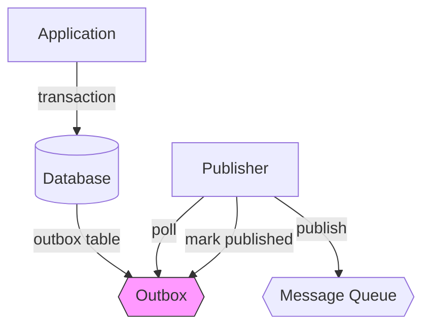
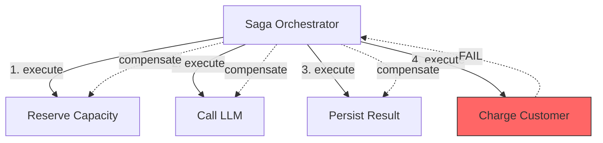

# Chapter 8 — Outbox, Saga, and Exactly-Once

> True exactly-once delivery is impossible in distributed systems. What we
> can build is at-least-once delivery with idempotent processing, which
> achieves the same business outcome at lower cost than trying to solve the
> impossible.

---

## Learning Objectives

By the end of this chapter you will be able to:

- Explain the dual-write problem and why it breaks data consistency when
  publishing messages after database updates.
- Implement the outbox pattern to achieve atomic writes between your database
  and message queue.
- Design sagas for multi-step distributed transactions with compensation for
  partial failures.
- Distinguish between true exactly-once (impossible) and effective exactly-once
  (achievable through idempotency).
- Build idempotent processors that make duplicate LLM calls harmless rather
  than expensive.
- Route unprocessable messages to dead letter queues for manual intervention.

---

## The Production Story

Consider an AI platform that processes insurance claims. When a claim arrives,
the system must: reserve processing capacity, call a frontier model to extract
structured data from the scanned document, persist the extraction to the
database, and record a billing event for the tenant.

The team built this as a straightforward sequence. Each step calls the next.
If any step fails, the whole operation fails and the user retries. This worked
in development.

In production, the billing service occasionally timed out under load. When it
timed out, the extraction was already persisted. The user retried, triggering
another extraction. Now the database had two copies of the same claim, and the
billing service eventually processed both — charging the tenant twice for one
claim.

The team added a deduplication check: before persisting, query whether this
claim already exists. This seemed to work, but then a different failure mode
appeared. The database write succeeded, but the message to downstream systems
never published because the application crashed between the write and the
publish.

They added a retry loop around the publish. Now they had the opposite problem:
when the publish succeeded but the acknowledgment was lost, the retry sent the
message again. Downstream systems processed duplicates.

Each fix created a new failure mode. The team was playing whack-a-mole with
distributed systems edge cases, and each mole had a cost: duplicate charges,
lost messages, or corrupted data.

The root cause was not any individual step. It was that the team was trying
to make multiple independent operations appear atomic without the patterns
that actually achieve atomicity in distributed systems.

---

## Why This Exists

The dual-write problem is older than LLMs. Anytime you need to update a
database and publish a message, you face a coordination problem: either can
fail independently, and there is no distributed transaction that spans both.

Before modern patterns emerged, teams tried several approaches:

**Synchronous chains.** Service A calls Service B synchronously, which calls
Service C. If any fails, the whole chain fails. This couples all services
tightly, makes failure handling everyone's responsibility, and does not
actually solve the problem — what happens if Service A commits but crashes
before hearing Service B's response?

**Two-phase commit.** A coordinator asks all participants if they can commit,
then tells them to commit. This provides atomicity but requires all
participants to be available, blocks on the slowest participant, and does not
work across different types of systems (you cannot 2PC a database and Kafka).

**Hope.** Publish the message first, then update the database. Or update the
database first, then publish. Either way, pray the second operation does not
fail. This is what most teams do before they learn better.

The patterns in this chapter emerged from decades of distributed systems
research. The outbox pattern solves the dual-write problem by collapsing two
writes into one transaction. The saga pattern coordinates multi-step
operations with explicit compensation. Idempotent processing makes retries
safe.

For LLM workloads, these patterns matter more than for traditional web
applications. A duplicate LLM call is not just a correctness problem — it is
a cost problem. A frontier model call can cost dollars, not cents. Duplicate
processing means paying twice for the same work.

---

## Core Concepts

**Dual-write problem.** When you need to update a database AND publish a
message, either operation can fail independently. If the database write
succeeds but the publish fails, you have inconsistent state. If the publish
succeeds but the database write fails, you have a message without backing
data. There is no transaction that spans both.

**Outbox pattern.** Instead of publishing directly, write the message to an
outbox table in the same transaction as your domain data. A separate publisher
reads the outbox and publishes to the message queue. Either both the domain
data and the outbox entry exist, or neither does.

**Saga.** A sequence of local transactions, each with a compensating action.
If step N fails, execute compensation for steps N-1 through 1 in reverse
order. This achieves eventual consistency without distributed locks.

**Compensation.** The reverse of an action. For a reservation, compensation
is cancellation. For a charge, compensation is a refund. For an LLM call,
there is no true compensation — you cannot un-call a model — so you perform
semantic compensation: mark the result as invalid, refund the billing, or
notify downstream systems to ignore it.

**Idempotency.** The property that executing an operation multiple times
produces the same result as executing it once. Idempotent operations make
retries safe. An idempotency key — typically a hash of the request — identifies
duplicate requests.

**At-least-once delivery.** The guarantee that a message will be delivered
one or more times. Achieved through retries. Requires idempotent consumers
to handle duplicates.

**Exactly-once semantics.** The guarantee that a message will be processed
exactly once. True exactly-once requires consensus across all participants
and is expensive. Effective exactly-once — at-least-once delivery plus
idempotent processing — is cheaper and sufficient for most use cases.

**Dead letter queue.** A destination for messages that cannot be processed
after repeated attempts. Rather than block the queue forever, unprocessable
messages are moved aside for manual inspection.

---

## Internal Architecture

The outbox pattern inserts a relay between your application and the message
queue. The application never publishes directly.



*The application writes to the database and outbox atomically. The publisher
polls the outbox and relays to the message queue.*

### The transaction boundary

The critical insight is the transaction boundary. The application writes
domain data and the outbox entry in a single database transaction:

```
BEGIN TRANSACTION
  INSERT INTO claims (id, data) VALUES (...)
  INSERT INTO outbox (aggregate_id, event_type, payload) VALUES (...)
COMMIT
```

If the transaction commits, both rows exist. If it rolls back, neither does.
There is no state where one exists without the other.

The publisher runs in a separate process (or thread). It polls the outbox for
pending entries, publishes each to the message queue, and marks them as
published. If the publish fails, the entry remains pending for retry.

### Saga orchestration

A saga coordinates multiple steps, each with its own local transaction. The
orchestrator tracks which steps have completed and, on failure, executes
compensation in reverse order.



*On failure at step 4, the orchestrator compensates steps 3, 2, and 1 in
reverse order.*

### Why reverse order matters

Compensation happens in reverse order because later steps may depend on
earlier steps. If you reserved capacity, called the LLM, persisted the result,
and then failed to charge — you must unpersist the result before releasing
the capacity. Otherwise, you might have a dangling reference to capacity that
no longer exists.

### Idempotency in the chain

Each component — producer, outbox, consumer — needs its own idempotency
check. The producer deduplicates before writing to the outbox. The outbox
deduplicates before publishing. The consumer deduplicates before processing.

This defense-in-depth ensures that duplicates are caught regardless of where
they originate. Network retries, application restarts, or consumer failures
can all cause duplicates at different points in the chain.

---

## Production Design

**Use the same database for domain data and outbox.** The outbox must be in
the same transaction as the domain data. If you are using Postgres for your
domain, put the outbox in Postgres. Do not try to write to Postgres and Redis
atomically — it is not possible.

**Poll at a frequency that balances latency and load.** 100-500ms is typical.
Faster polling adds database load without meaningful latency improvement.
Slower polling adds latency that users may notice for interactive workloads.

**Include enough context in the outbox entry to retry.** The entry should be
self-contained: aggregate type, event type, full payload, idempotency key.
The publisher should not need to query the domain data to publish.

**Set max attempts based on your failure model.** Transient failures (network
timeouts, rate limits) should retry. Permanent failures (invalid payload,
schema mismatch) should not. Three to five attempts is typical. After max
attempts, route to the dead letter queue.

**Track these metrics, labeled by event type:**

| Metric | Type | Why it matters |
| --- | --- | --- |
| `outbox_entries_pending` | gauge | Growing pending count means publisher is behind |
| `outbox_publish_latency_ms` | histogram | Time from write to publish |
| `outbox_publish_failures` | counter | Rate of publish failures |
| `saga_duration_ms` | histogram | End-to-end saga execution time |
| `saga_compensations` | counter | Rate of compensation triggers |
| `idempotency_duplicates` | counter | Rate of duplicate detection |
| `dlq_entries` | gauge | Size of dead letter queue |

**For sagas, persist the saga state.** The orchestrator should survive
restarts. Store the saga ID, current step, completed steps, and context in a
durable store. On restart, resume from the last completed step.

**Make compensation idempotent.** Compensation might be retried if the first
attempt fails or times out. A refund that can be applied twice creates a
different kind of problem.

---

## Failure Scenarios

### Failure: publisher crashes after publish but before marking published

**Symptom.** Messages are delivered multiple times. Downstream consumers see
duplicates. If consumers are not idempotent, you get duplicate side effects.

**Mechanism.** The publisher published successfully but crashed before marking
the outbox entry as published. On restart, it re-reads the entry and publishes
again.

**Detection.** Compare published message count to outbox marked-published
count. A sustained gap indicates messages being published multiple times.
Also track idempotency-key duplicates at the consumer.

**Mitigation.** If duplicates have already been processed, you need
application-level reconciliation. The consumer's idempotency store should
have caught them; if it did not, fix the idempotency logic.

**Prevention.** Consumers must be idempotent. This is not optional. The
outbox guarantees at-least-once delivery, not exactly-once. Idempotent
consumers make at-least-once delivery safe.

### Failure: saga step times out with unknown outcome

**Symptom.** The saga is stuck in a "running" state. The step neither
succeeded nor failed. The orchestrator does not know whether to proceed or
compensate.

**Mechanism.** The step made an external call (to a model provider, a payment
service) that timed out. The call may have succeeded, may have failed, or may
still be in progress. The orchestrator cannot distinguish.

**Detection.** Alert when saga duration exceeds 2x the expected maximum. Track
per-step timeouts separately.

**Mitigation.** For LLM calls: assume success if you have a request ID you
can query later. Check the provider's status endpoint. For payments: assume
pending and schedule a reconciliation job. For irreversible operations:
manual intervention.

**Prevention.** Design steps to be queryable. Every external call should
return a tracking ID that you can use to check status later. For model
providers that do not support status queries, consider shorter timeouts with
explicit retries.

### Failure: compensation fails

**Symptom.** A saga is stuck in "compensating" state. Partial state exists
that should have been cleaned up. Downstream systems may be inconsistent.

**Mechanism.** The compensation action itself failed — the refund API was
down, the database was unreachable, or the compensation logic had a bug.

**Detection.** Alert on any saga in "compensating" state for more than 5
minutes. Track compensation attempt counts.

**Mitigation.** Retry compensation with exponential backoff. If retries
continue to fail, alert on-call. Compensation failures are critical because
they leave inconsistent state.

**Prevention.** Test compensation paths as thoroughly as happy paths.
Compensation is not optional cleanup; it is load-bearing code that executes
in failure scenarios. Make compensations idempotent so retries are safe.

### Failure: idempotency store loses data

**Symptom.** Duplicates are processed as if they were new requests. Charges
appear twice. LLM calls happen twice.

**Mechanism.** The idempotency store (Redis, in-memory cache, database table)
lost entries. This could be eviction, crash, or misconfigured TTL.

**Detection.** Compare request-rate to idempotency-hit-rate. A sudden drop in
hit rate with stable request rate indicates data loss. Also track LLM request
count against unique request IDs.

**Mitigation.** You cannot un-process duplicates. For charges, issue refunds.
For LLM calls, the cost is sunk. Focus on preventing recurrence.

**Prevention.** Use durable storage for idempotency, not in-memory caches.
Set TTL longer than your retry window. If a request can be retried for up to
24 hours, the idempotency entry must live longer than 24 hours.

---

## Scaling Strategy

**First: outbox table size, around 1M pending entries.** If the publisher
cannot keep up with write rate, the outbox grows. Index on `state` and
`created_at` for efficient polling. Partition the outbox by aggregate type if
you have distinct throughput patterns.

**Second: publisher throughput, around 10K publishes/second per publisher.**
If one publisher cannot keep up, run multiple. Partition the outbox by
aggregate type or ID, and have each publisher own a partition. Avoid
contention by using SKIP LOCKED or similar for polling.

**Third: idempotency store capacity, around 10M entries.** Size based on your
retry window. If requests can be retried for 24 hours and you process 100
requests/second, you need 8.6M entries. Add margin for spikes.

**Fourth: saga orchestrator state.** Each in-flight saga needs tracking. If
sagas take 30 seconds average and you have 1000 concurrent, you need 1000
saga records. This rarely becomes a bottleneck before the underlying services
do.

---

## Trade-offs

| Decision | Buys you | Costs you | Choose when |
| --- | --- | --- | --- |
| Outbox in same DB | True atomicity | Schema coupling | You control the database |
| Separate outbox DB | Schema independence | Dual-write returns | Different teams own domain and messaging |
| Synchronous saga | Simpler implementation | Blocked caller | Operations complete in seconds |
| Async saga | Caller not blocked | Eventual consistency | Operations take minutes |
| Per-request idempotency | Simple key generation | Large key space | Requests are naturally unique |
| Content-hash idempotency | Smaller key space | Hash collisions possible | Many duplicate requests |
| In-memory idempotency | Fast | Data loss on restart | Short retry windows |
| Database idempotency | Durable | Slower | Long retry windows |
| Aggressive DLQ routing | Partitions never block | More manual work | Failures are rare |
| Conservative DLQ routing | Fewer manual interventions | Retries may delay processing | Failures are transient |

---

## Code Walkthrough

From `examples/ch08-outbox-saga/`. Everything runs in-memory; no external
services required.

### Atomic writes with outbox

The outbox wraps database operations in transactions that include both domain
data and the outbox entry.

```ts
// examples/ch08-outbox-saga/src/outbox.ts

executeTransaction<T>(
  aggregateType: string,
  aggregateId: string,
  eventType: string,
  domainData: T,
  idempotencyKey: string
): CreateEntryResult {
  // Check for idempotent duplicate
  const existingId = this.idempotencyStore.get(idempotencyKey);   // (1)
  if (existingId) {
    this.metrics.duplicatesDetected++;
    return { success: true, entryId: existingId, idempotencyKey };
  }

  const entry: OutboxEntry = {
    id: entryId,
    aggregateType,
    aggregateId,
    eventType,
    payload: domainData,
    state: 'pending',
    // ...
  };

  try {
    this.db.beginTransaction();                                   // (2)
    this.db.insertDomainData(aggregateId, domainData);
    this.db.insertEntry(entry);
    this.db.commit();                                             // (3)

    this.idempotencyStore.set(idempotencyKey, entryId);
    return { success: true, entryId, idempotencyKey };
  } catch (error) {
    this.db.rollback();                                           // (4)
    throw error;
  }
}
```

1. Check idempotency first. If we have already processed this key, return
   the existing entry ID without creating a duplicate.
2. Begin the transaction. All writes until commit are staged.
3. Commit atomically. Either both the domain data and outbox entry exist,
   or neither does.
4. On any error, rollback. The database returns to its previous state.

### Saga orchestration with compensation

The saga orchestrator executes steps in order and compensates on failure.

```ts
// examples/ch08-outbox-saga/src/saga.ts

async execute(
  type: string,
  context: Record<string, unknown>
): Promise<SagaExecutionResult> {
  const definition = this.definitions.get(type);
  const saga: Saga = { /* ... state tracking */ };

  let lastCompletedIndex = -1;

  for (let i = 0; i < definition.steps.length; i++) {             // (1)
    const stepDef = definition.steps[i];
    const step = saga.steps[i];

    step.state = 'running';

    try {
      const result = await this.executeStepWithRetry(stepDef, saga.context);

      if (result.success) {
        step.state = 'completed';
        lastCompletedIndex = i;
        saga.context[`${step.name}_result`] = result.output;      // (2)
      } else {
        step.state = 'failed';
        step.error = result.error;

        saga.state = 'compensating';
        await this.compensate(saga, definition, lastCompletedIndex); // (3)

        return { success: false, compensated: true, /* ... */ };
      }
    } catch (error) {
      // Same compensation path for exceptions
    }
  }

  saga.state = 'completed';
  return { success: true, compensated: false, /* ... */ };
}
```

1. Execute steps sequentially. Each step must complete before the next
   begins.
2. Store each step's output in the context. Later steps can access results
   from earlier steps.
3. On failure, compensate all completed steps in reverse order.

### Compensation in reverse order

Compensation executes from the last completed step backwards.

```ts
// examples/ch08-outbox-saga/src/saga.ts

private async compensate(
  saga: Saga,
  definition: SagaDefinition,
  lastCompletedIndex: number
): Promise<void> {
  // Compensate in reverse order
  for (let i = lastCompletedIndex; i >= 0; i--) {                 // (1)
    const stepDef = definition.steps[i];
    const step = saga.steps[i];

    if (step.state !== 'completed') continue;                     // (2)

    step.state = 'compensating';

    try {
      const result = await stepDef.compensate(saga.context);      // (3)

      if (result.success) {
        step.state = 'compensated';
      } else {
        step.error = `Compensation failed: ${result.error}`;
        saga.state = 'failed';                                    // (4)
        return;
      }
    } catch (error) {
      step.error = `Compensation error: ${error.message}`;
      saga.state = 'failed';
      return;
    }
  }

  saga.state = 'compensated';
}
```

1. Start from the last completed step and work backwards.
2. Only compensate completed steps. Failed or pending steps have no state
   to reverse.
3. Execute the compensation action defined for this step.
4. If compensation fails, mark the saga as failed. This requires manual
   intervention — you have partial state that automated compensation could
   not clean up.

### Idempotent processing

The idempotent processor wraps handlers to deduplicate requests.

```ts
// examples/ch08-outbox-saga/src/delivery.ts

async process(request: T): Promise<DeliveryResult> {
  const key = this.keyGenerator(request);                         // (1)

  // Check for duplicate
  const existing = this.store.get(key);
  if (existing) {
    this.metrics.duplicatesDetected++;
    return {
      success: true,
      isDuplicate: true,
      response: existing.response,                                // (2)
      // ...
    };
  }

  // Process new request
  try {
    const response = await this.handler(request);
    this.store.set(key, response);                                // (3)

    return {
      success: true,
      isNew: true,
      isDuplicate: false,
      response,
      // ...
    };
  } catch (error) {
    // Do not store failed responses - allow retry                // (4)
    return { success: false, isNew: true, isDuplicate: false, /* ... */ };
  }
}
```

1. Generate the idempotency key from request content. Same request, same key.
2. For duplicates, return the cached response without calling the handler.
3. For new requests, store the response for future duplicate detection.
4. Failed requests are not stored. This allows the retry to try again rather
   than returning a cached error.

---

## Hands-On Lab

**Goal:** verify that outbox ensures atomic writes, sagas compensate on
failure, and idempotent processing prevents duplicate work. About 1 minute,
Node 22.6+, no dependencies.

```bash
cd examples/ch08-outbox-saga
node scripts/lab.mjs
```

The lab runs twelve steps and asserts forty-three claims. Everything runs
in-memory using simulated databases and message queues.

**Step 1 — outbox pattern ensures atomic writes.**

Creates a transactional operation that writes both domain data and an outbox
entry. Verifies both exist and were written in a single transaction.

```
  [PASS] outbox entry created in transaction
  [PASS] outbox entry persisted
  [PASS] domain data persisted
  [PASS] transaction log shows atomic write
```

The transaction log shows exactly one commit, proving atomicity.

**Step 6 — saga compensates on failure.**

Executes a saga where step 3 fails. Verifies that completed steps 1 and 2
are compensated in reverse order (2 before 1).

```
  [PASS] saga failed
  [PASS] saga compensated
  [PASS] compensation in reverse order
  [PASS] saga state is compensated
```

The compensation order ensures dependencies are unwound correctly.

**Step 7 — idempotent processor handles duplicates.**

Submits the same request twice. Verifies the handler is called only once
and both calls return the same response.

```
  [PASS] first call processed
  [PASS] second call is duplicate
  [PASS] handler called only once
  [PASS] duplicate returns same response
```

The LLM (simulated here) is called exactly once. The second request returns
the cached response without additional cost.

**Step 12 — full saga with LLM steps.**

Executes a complete LLM processing saga: reserve capacity, call model,
persist result, charge customer. Verifies all steps complete and side
effects are recorded.

```
  [PASS] full LLM saga completed
  [PASS] all four steps completed
  [PASS] capacity was reserved
  [PASS] result was persisted
  [PASS] charge was recorded
```

In a failure scenario (not shown), compensation would release the capacity,
delete the persisted result, and refund the charge — in that order.

---

## Interview Questions

1. Why can't you achieve exactly-once delivery with retries alone?

2. Explain the dual-write problem. What goes wrong when you update a database
   and then publish a message?

3. How does the outbox pattern solve the dual-write problem?

4. A saga has completed steps 1 and 2, then step 3 fails. What happens next,
   and in what order?

5. Why does compensation happen in reverse order?

6. What should you do when compensation itself fails?

7. How do idempotency keys make at-least-once delivery safe?

8. When should a message go to the dead letter queue versus being retried?

9. How would you design idempotency for an LLM request? What fields would
   you include in the key?

10. A team reports that their saga occasionally leaves partial state after
    failures. What are the likely causes?

---

## Staff-Level Answers

**Q1 — why retries alone do not achieve exactly-once.** The junior answer
focuses on duplicates: retries can send a message twice. The senior answer
explains why: the sender cannot distinguish "message lost" from "acknowledgment
lost." In both cases, the retry is sent, but in the second case, the original
was already processed.

The staff answer goes deeper: exactly-once requires consensus between sender
and receiver about what has been processed. Consensus requires multiple round
trips and is expensive. At-least-once with idempotent consumers achieves the
same business outcome (each logical request processed once) at lower cost.
The idempotency store becomes the consensus mechanism, and it can be optimized
for the common case where duplicates are rare.

**Q3 — how outbox solves dual-write.** The junior answer: put the message in
a table and publish later. The senior answer explains why this works: the
domain data and the message are written in the same transaction, so they are
atomic.

The staff answer identifies the shift in failure semantics. Without outbox,
you have two failure modes: database succeeds + publish fails, or publish
succeeds + database fails. With outbox, you have one failure mode: the
transaction fails. The publisher introduces a new failure mode — publish
fails — but this is retryable because the outbox entry persists. You have
traded a coordination problem for a delivery problem, and delivery problems
have well-understood solutions (retries, acknowledgments, DLQ).

**Q5 — why reverse order for compensation.** The junior answer: to undo
things in the opposite order they were done. The senior answer: later steps
may depend on earlier steps, so you must undo later steps first.

The staff answer gives a concrete example. Suppose step 1 reserves capacity
and step 2 uses that capacity to call a model. If you release the capacity
before compensating the model call, you might release capacity that is still
in use by a concurrent request that was assigned the same slot. Reverse order
ensures that by the time you release the capacity, no references to it exist.

**Q6 — handling compensation failure.** This is where staff-level thinking
diverges from senior. The senior answer: retry with backoff, alert if retries
fail. The staff answer: compensation failure is a critical incident that
requires human intervention, and the system should be designed assuming it
will happen.

Design for compensation failure means: make compensations idempotent so
retries are safe, log enough context to allow manual recovery, and build
tooling to inspect and repair saga state. The goal is not to prevent
compensation failure (which is impossible) but to make recovery fast and
auditable.

**Q9 — idempotency key for LLM requests.** The junior answer includes the
obvious fields: prompt, model. The senior answer adds tenant and timestamp
(to distinguish retries from genuinely repeated requests).

The staff answer questions the requirements first. Is the goal to prevent
duplicate billing, duplicate processing, or duplicate output? These may have
different keys. For billing, include everything that affects cost: prompt,
model tier, max tokens. For processing, include everything that affects
output: prompt, model, temperature, seed. For output deduplication, you
might hash the response itself.

Then the staff consideration: key lifetime. If a request can be retried for
24 hours after initial submission, the idempotency entry must live 24 hours.
If the same logical request can be submitted weeks later (e.g., reprocessing
a document), you need application-level deduplication rather than
infrastructure-level idempotency.

---

## Exercises

1. **Outbox failure recovery.** Modify the outbox publisher to crash after
   publishing but before marking as published. Verify that the consumer
   receives duplicates. Then add idempotency to the consumer and verify
   duplicates are handled.

2. **Saga timeout.** Implement a saga step that calls a simulated LLM with
   configurable latency. Set a timeout shorter than the latency. Verify
   the saga compensates. Then implement a status-check mechanism where the
   orchestrator can query whether the call completed despite the timeout.

3. **Partial compensation.** Create a saga where compensation of step 2
   fails. Verify the saga enters a "failed" state. Build a manual recovery
   tool that retries failed compensations with configurable backoff.

4. **Idempotency key collisions.** Implement an idempotency key generator
   that uses only prompt and tenant (not model or parameters). Generate
   two requests that collide. Verify one is incorrectly rejected as a
   duplicate. Then fix the key generator and verify both are processed.

5. **DLQ replay.** Add messages to the dead letter queue with various failure
   reasons (timeout, rate limit, invalid payload). Build a replay tool that
   selectively replays based on failure reason, with rate limiting to avoid
   overwhelming the target system.

---

## Further Reading

- **Kleppmann, *Designing Data-Intensive Applications*, Chapter 9** — the
  transactions chapter covers exactly-once semantics, two-phase commit, and
  why distributed transactions are hard. Essential background for
  understanding why the patterns in this chapter exist.

- **Richardson, *Microservices Patterns*, Chapter 4** — the definitive
  treatment of the saga pattern. Includes both choreography (event-driven)
  and orchestration (command-driven) approaches. The orchestration style
  matches this chapter.

- **Debezium documentation, "Outbox Event Router"** — a production
  implementation of the outbox pattern using change data capture. The
  architecture differs (CDC instead of polling), but the guarantees are
  the same.

- **Confluent blog, "Exactly-Once Semantics Are Possible"** — Kafka's
  exactly-once implementation explained. Shows how idempotent producers and
  transactional consumers combine to achieve exactly-once within Kafka. Does
  not cover external systems.

- **Hohpe and Woolf, *Enterprise Integration Patterns*, "Idempotent Receiver"**
  — the original pattern description. Predates modern distributed systems but
  the core insight remains correct: if you cannot prevent duplicates, make
  them harmless.

- **Your payment provider's idempotency documentation** — Stripe, Adyen, and
  similar providers implement idempotency keys in their APIs. Their
  documentation explains how they handle the edge cases, which is relevant
  if you are building similar guarantees.
