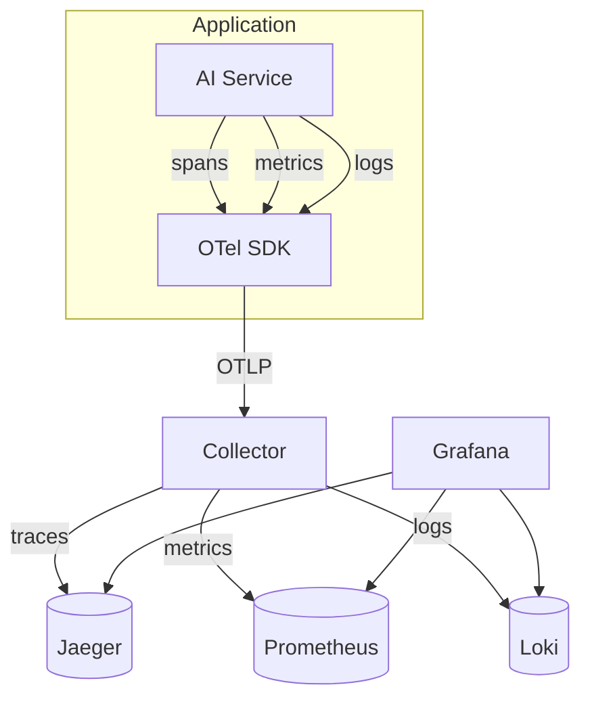
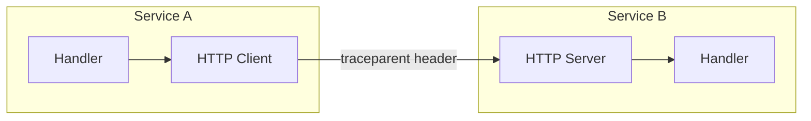

# Chapter 9 - Observability and OpenTelemetry

> You cannot optimize what you cannot measure, and you cannot debug what you
> cannot trace. For AI systems where a single request costs dollars and takes
> seconds, observability is not optional infrastructure — it is the only way
> to know what your system is doing.

---

## Learning Objectives

By the end of this chapter you will be able to:

- Implement distributed tracing across an AI pipeline and explain why
  trace context propagation matters more for LLM workloads than for
  traditional services.
- Design an AI-specific metrics schema with dimensions for tokens, model
  tiers, and tenants, and explain why request counts alone are misleading.
- Build structured logging with trace correlation and explain why
  unstructured logs become useless at scale.
- Configure alert rules that distinguish AI-specific failures from
  traditional ones, avoiding both alert fatigue and missed incidents.
- Explain the three pillars of observability and how they complement each
  other for debugging production issues.
- Use OpenTelemetry concepts to instrument an AI system without vendor
  lock-in.

---

## The Production Story

Consider an enterprise deploying an LLM-powered document assistant. The
system handles contract analysis for legal teams — users upload PDFs,
the system extracts text, runs it through a retrieval pipeline, and
generates summaries with citations. Average request takes 8 seconds.
The team has basic logging: print statements that write to stdout.

On a Tuesday morning, users report slow responses. The team checks their
dashboard: request latency is normal. They check error rates: zero errors.
They check the LLM provider's status page: all green. But users insist
the system is slow.

The team adds more logging. They time individual function calls. They
discover the bottleneck is in the retrieval step, but they cannot
determine why. The retrieval service calls the embedding service, which
calls the vector database, which calls the reranker. Each hop is logged
independently. There is no way to correlate logs across services for a
single user request.

After three hours of grep commands and manual timestamp matching, they
find the issue: the vector database is returning results in 50ms, but
the reranker is taking 6 seconds. The reranker is a separate service that
was deployed last week. It has no logging at all.

They add tracing. They propagate trace context. They correlate spans.
They discover the reranker is calling an external API synchronously for
each of 50 candidate documents. That is 50 sequential network calls where
there should be one batch call.

The fix takes 10 minutes. Finding the fix took three hours because the
system could not answer a basic question: "For this slow request, what
did each component do and how long did it take?"

---

## Why This Exists

The three pillars of observability — logs, metrics, traces — exist because
different questions require different data structures.

**Logs** answer "what happened?" A log entry is an event at a point in
time. Something started, something failed, something completed. Logs are
the most intuitive pillar because they are just print statements with
timestamps.

**Metrics** answer "how many?" and "how much?" Metrics aggregate events
into numbers: request count, error rate, latency percentile, token
consumption. Metrics are how you know the system is healthy or sick
without reading every log line.

**Traces** answer "where did time go?" A trace is a DAG of spans
representing a single request's journey through the system. Traces are
how you find bottlenecks in distributed systems where each service
only sees its own logs.

Before OpenTelemetry, teams built proprietary instrumentation. Each
vendor had its own SDK, its own wire format, its own collector. Switching
vendors meant rewriting instrumentation. Teams either locked into one
vendor or maintained multiple integrations.

OpenTelemetry standardized the problem. One SDK, one wire protocol
(OTLP), one semantic convention. Instrument once, export to any backend.
The ecosystem converged because fragmentation was costing everyone more
than collaboration.

### Why AI workloads need different observability

Traditional web services complete in milliseconds. A slow request is
500ms. Metrics aggregate thousands of requests per minute, so percentiles
stabilize quickly.

LLM requests complete in seconds. A slow request is 30 seconds. A typical
endpoint might serve 10 requests per minute at 10 QPS — not 10,000.
This has three consequences.

**Low request volume means unstable percentiles.** With 10 requests per
minute, p99 is literally the slowest request you saw. Statistical
aggregations that work at scale become noise at low volume.

**High per-request cost means errors are expensive.** A 500ms web request
costs fractions of a cent in compute. A 10-second LLM request costs
cents in tokens. Observability must capture cost, not just count.

**Long-running requests cross more boundaries.** A 10-second request
has time to hit the LLM provider, timeout, retry to a fallback, hit a
cache on the second attempt, and stream back results. Traditional
request-response tracing misses this complexity.

---

## Core Concepts

**Span.** The fundamental unit of distributed tracing. A span has a name,
a start time, an end time, a parent (or none for root spans), and
attributes. Spans form a tree within a trace.

**Trace.** A tree of spans representing a single request's journey. The
root span is the entry point; child spans are operations called by the
parent. All spans in a trace share a trace ID.

**Trace context.** The data propagated across service boundaries to
correlate spans. In HTTP, this is the `traceparent` header. In Kafka,
this is a message header. Without context propagation, traces break at
every boundary.

**W3C Trace Context.** The standard format for trace context. The
`traceparent` header contains version, trace ID, parent span ID, and
flags. Example: `00-4bf92f3577b34da6a3ce929d0e0e4736-00f067aa0ba902b7-01`.

**Counter.** A metric that only increases. Request count, error count,
tokens consumed. Counters reset on process restart.

**Gauge.** A metric that can increase or decrease. Active requests,
queue depth, memory usage. Gauges represent a current value, not an
accumulation.

**Histogram.** A metric that counts observations in buckets. Latency
distribution, token count distribution. Histograms enable percentile
calculation without storing every value.

**Structured log.** A log entry with machine-parseable fields. Instead of
"Request failed for user 123", you log `{level: "error", user_id: 123,
error: "timeout"}`. Structured logs are searchable; unstructured logs
require regex.

**Log correlation.** The practice of including trace ID and span ID in
every log entry. When you find a problematic trace, you can query all
logs for that trace ID across all services.

---

## Internal Architecture

An observability stack has three layers: instrumentation, collection,
and backend.



*The SDK instruments the application, the collector routes telemetry,
and backends store each signal type.*

### Trace context propagation

Context propagation is the mechanism that makes distributed tracing
work. When service A calls service B, it must include context so B's
spans can join A's trace.



*The HTTP client injects context; the HTTP server extracts it.*

For HTTP, context travels in headers. The `traceparent` header contains
trace ID, span ID, and flags. The `tracestate` header carries
vendor-specific data.

For Kafka, context travels in message headers. The producer injects
context; the consumer extracts it. Without this, every consumed message
starts a new trace, and you lose the connection between producer and
consumer.

For internal function calls, context travels in code. The SDK provides
APIs to get the current span's context and create child spans from it.

### AI-specific metrics dimensions

Traditional metrics have dimensions like `method`, `status`, `path`.
AI metrics need additional dimensions.

| Dimension | Why it matters |
| --- | --- |
| `tenant` | Cost attribution, per-tenant SLAs |
| `model` | Tier-specific latency expectations |
| `operation` | Completion vs embedding vs reranking |
| `cached` | Cache effectiveness measurement |

Token metrics are unique to AI. A request that consumes 4,000 tokens
costs 40x more than one consuming 100 tokens, but both count as "one
request" in traditional metrics. Token-based metrics capture actual
resource consumption.

```ts
// examples/ch09-observability/src/metrics.ts

export class MetricsRegistry {
  public readonly requestsTotal: Counter;
  public readonly requestLatency: Histogram;
  public readonly inputTokensTotal: Counter;
  public readonly outputTokensTotal: Counter;
  public readonly cacheHitsTotal: Counter;
  public readonly estimatedCost: Counter;
  // ...
}
```

The `estimatedCost` counter tracks cost in relative units. Actual
pricing changes frequently; relative cost (frontier costs 10x mid,
mid costs 10x small) is stable enough for alerting.

### Histogram bucket design

Histograms lose precision between buckets. A latency histogram with
buckets `[100, 500, 1000]` cannot distinguish between 101ms and 499ms —
both fall in the same bucket.

For traditional services, buckets like `[10, 50, 100, 250, 500, 1000]`
work. For LLM services, you need higher bounds:

```ts
const LLM_LATENCY_BUCKETS = [
  100, 250, 500, 1000, 2500, 5000, 10000, 20000, 40000, 60000,
];
```

A 60-second bucket might seem absurd for traditional services. For
frontier models generating long responses, it is realistic.

---

## Production Design

**Instrument once, export to many.** Use OpenTelemetry SDK, not
vendor-specific SDKs. Configure exporters in deployment, not code.
When you switch from Jaeger to Tempo, you change config, not
instrumentation.

**Propagate context everywhere.** Every HTTP call, every Kafka message,
every internal queue needs context propagation. A broken link in the
chain means orphaned spans that cannot be correlated.

**Use semantic conventions.** OpenTelemetry defines standard attribute
names: `http.method`, `http.status_code`, `db.system`. Use them. Custom
names fragment your queries across services.

**Sample at the edge, not the leaf.** Sampling decisions must be made at
trace start and propagated. If service A samples a trace and service B
does not, you get incomplete traces. The root span decides; children
inherit.

**Set trace IDs in logs early.** Before your code does anything else,
extract or create a trace context and set it in the logger. Every log
line must have a trace ID. The first log without a trace ID is the
hardest to find later.

### Metrics design for multi-tenant systems

Multi-tenant AI systems need metrics that can answer:

- What is tenant X's token consumption?
- What is tenant X's cost this month?
- What is tenant X's p99 latency?
- Is tenant X seeing more errors than baseline?

This requires the `tenant` dimension on every metric. The cardinality
cost (one series per tenant per metric) is acceptable for most systems.
At thousands of tenants, consider separate metric streams or sampling.

### Log retention and cost

Structured logs at high verbosity generate gigabytes per day. AI
workloads add to this: a single request might log prompt length, token
counts, cache status, model tier, and latency. Each field multiplies
storage cost.

Retention strategies:

| Verbosity | Retention | Use case |
| --- | --- | --- |
| ERROR, WARN | 90 days | Incident investigation |
| INFO | 14 days | Recent debugging |
| DEBUG | 1 day | Active development |
| TRACE | Hours | Per-request troubleshooting |

Sample or drop high-volume logs at ingestion. Do not log full prompts
or responses in production — they are large and may contain PII.

---

## Failure Scenarios

### Failure: missing trace context

**Symptom.** Trace view shows disconnected spans. Service A's span ends;
service B's span starts at a similar time but with a different trace ID.
Cannot correlate the two.

**Mechanism.** Context propagation is missing. The HTTP client in
service A is not injecting the `traceparent` header, or the HTTP server
in service B is not extracting it.

**Detection.** Query for traces with only one span when you expect
multiple. High ratio of root spans to child spans indicates propagation
failures.

**Mitigation.** Add instrumentation. For HTTP, use middleware that
auto-injects and auto-extracts. For Kafka, wrap producer and consumer.
For internal queues, pass context explicitly.

**Prevention.** Instrumentation tests: send a request through the full
path, assert that all expected services appear in the trace.

### Failure: high-cardinality metric explosion

**Symptom.** Prometheus/Mimir out of memory or rejecting new series.
Metric queries become slow. Storage costs spike.

**Mechanism.** A metric dimension has unbounded cardinality. Common
causes: request ID as a label, user ID as a label, raw prompt hash as
a label. Each unique value creates a new time series.

**Detection.** Query total series count over time. Correlate spikes with
deployments. Find the metric with the most unique label combinations.

**Mitigation.** Drop the high-cardinality label. Aggregate to a lower-
cardinality dimension (tenant instead of user, bucket instead of exact
value). This may require re-deployment.

**Prevention.** Review metric schemas before deployment. No unbounded
dimensions. If you need per-user metrics, use a separate system or
sample.

### Failure: log volume overwhelms storage

**Symptom.** Log backend rejects new logs. Queries time out. Cost
alerts fire.

**Mechanism.** Logging too much. A common cause in AI systems: logging
prompts and responses at INFO level. A single 8,000-token response is
32KB. At 100 requests/minute, that is 200GB/day of response logs alone.

**Detection.** Monitor log volume per service. Correlate with
deployments. Find the service or log line generating the most bytes.

**Mitigation.** Lower log level for verbose entries. Truncate large
fields. Sample high-frequency logs.

**Prevention.** Log prompts and responses at DEBUG, not INFO. Log token
counts and hashes, not full content. Set log budgets per service.

### Failure: alert fatigue from misconfigured thresholds

**Symptom.** Alerts fire constantly. Team ignores alerts. Real
incidents get missed.

**Mechanism.** Thresholds set for traditional services, not AI.
Alerting on p99 latency > 500ms when normal LLM latency is 5 seconds.
Alerting on error rate > 0.1% when model refusals are expected.

**Detection.** High alert volume. Low alert-to-incident ratio.
Responders routinely resolve alerts as false positives.

**Mitigation.** Review and adjust thresholds. Add context: alert on
p99 > 30s, not p99 > 500ms. Add conditions: alert on error rate > 5%
AND error type != model_refusal.

**Prevention.** Derive thresholds from baseline data, not assumptions.
Run silent for a week before enabling paging.

---

## Scaling Strategy

Observability backends scale differently than applications. The
bottleneck order:

**First: storage for high-cardinality data, around 10GB/day.** Traces
and logs are high-cardinality. Each request generates unique data.
Object storage (S3) is cheap; specialized trace storage is expensive.
Use retention policies aggressively.

**Second: query performance, around 1TB of data.** Queries over months
of traces time out. Index on common dimensions: trace ID, service name,
error status. Avoid full-text search on log bodies.

**Third: ingestion rate, around 100,000 spans/second.** The collector
becomes the bottleneck. Scale collectors horizontally. Use sampling at
the edge to reduce volume.

**Fourth: cardinality explosion, around 1 million active series.** Each
unique label combination is a series. Prometheus-style backends struggle
above this. Use hierarchical aggregation: per-tenant metrics in real
time, per-user metrics in batch.

Sampling is the primary scaling lever. Head-based sampling (decide at
trace start) is simpler but misses interesting traces. Tail-based
sampling (decide after trace completes) captures errors and outliers but
requires buffering.

For AI workloads, consider sampling by cost: sample 100% of traces that
consumed > 10,000 tokens, 10% of traces that consumed > 1,000 tokens,
1% of the rest.

---

## Trade-offs

| Decision | Buys you | Costs you | Choose when |
| --- | --- | --- | --- |
| Sample traces | Lower storage cost | Missed edge cases | Volume > 10k traces/min |
| Log prompts | Full debugging context | Storage, PII risk | Development only |
| Per-user metrics | Fine-grained attribution | Cardinality explosion | < 10k users |
| Per-tenant metrics | Cost attribution | Per-tenant overhead | Multi-tenant systems |
| Short log retention | Lower storage cost | Lost historical data | Cost-sensitive |
| High histogram buckets | Accurate LLM percentiles | More series | LLM latency metrics |
| Structured logging | Queryable logs | More instrumentation | Production systems |
| Unstructured logging | Fast to add | Grep-only debugging | Prototypes |

---

## Code Walkthrough

From `examples/ch09-observability/`. All components are implemented in
pure TypeScript to model OpenTelemetry behavior without requiring the
full SDK.

### Distributed tracing with context propagation

```ts
// examples/ch09-observability/src/tracing.ts

export class Tracer {
  startSpan(
    name: string,
    kind: SpanKind = 'internal',
    parentContext?: TraceContext,
    attributes: Record<string, string | number | boolean> = {}
  ): Span {
    let traceId: string;
    let parentSpanId: string | null;

    if (parentContext) {
      traceId = parentContext.traceId;               // (1)
      parentSpanId = parentContext.spanId;
    } else {
      traceId = generateTraceId();                   // (2)
      parentSpanId = null;
    }

    const span: Span = {
      traceId,
      spanId: generateSpanId(),
      parentSpanId,
      name,
      kind,
      startTimeMs: Date.now(),
      // ...
    };

    return span;
  }
}
```

1. If parent context is provided, continue the existing trace. The child
   span shares the parent's trace ID.
2. If no parent, this is a root span. Generate a new trace ID.

### W3C traceparent parsing

```ts
// examples/ch09-observability/src/tracing.ts

export function parseTraceparent(header: string): TraceContext | null {
  const parts = header.split('-');
  if (parts.length !== 4) return null;

  const [version, traceId, spanId, flags] = parts;

  if (version !== '00') return null;                 // (1)
  if (traceId.length !== 32) return null;            // (2)
  if (spanId.length !== 16) return null;

  return {
    traceId,
    spanId,
    traceFlags: parseInt(flags, 16),
    traceState: '',
  };
}
```

1. Only version 00 is supported. Unknown versions should be rejected.
2. Trace IDs are 32 hex characters (16 bytes). Span IDs are 16 hex
   characters (8 bytes).

### Metrics with AI-specific dimensions

```ts
// examples/ch09-observability/src/metrics.ts

recordRequest(metrics: LLMRequestMetrics): void {
  const labels: AIMetricLabels = {
    tenant: metrics.tenant,
    model: metrics.tier,                             // (1)
    operation: 'completion',
    status: 'success',
  };

  this.requestsTotal.inc(labels);
  this.requestLatency.observe(labels, metrics.latencyMs);
  this.inputTokensTotal.inc(labels, metrics.inputTokens);
  this.outputTokensTotal.inc(labels, metrics.outputTokens);

  if (metrics.cached) {
    this.cacheHitsTotal.inc(labels);                 // (2)
  }

  // Estimate cost by tier (relative units)
  const costMultiplier =
    metrics.tier === 'frontier' ? 10 :
    metrics.tier === 'mid' ? 1 : 0.1;
  const cost = metrics.outputTokens * costMultiplier * 0.003;
  this.estimatedCost.inc(labels, cost);              // (3)
}
```

1. Model tier as a dimension. This allows per-tier latency analysis
   without high cardinality.
2. Cache hits as a separate metric. Cache effectiveness varies by
   workload and tenant.
3. Cost estimation in relative units. Actual prices change; relative
   cost is stable.

### Structured logging with trace correlation

```ts
// examples/ch09-observability/src/logging.ts

log(
  severity: LogSeverity,
  message: string,
  attributes: Record<string, string | number | boolean> = {}
): void {
  const record: LogRecord = {
    timestampMs: Date.now(),
    severity,
    body: message,
    attributes: {
      'service.name': this.config.serviceName,
      ...attributes,
    },
    traceId: this.currentContext?.traceId ?? null,   // (1)
    spanId: this.currentContext?.spanId ?? null,
  };

  this.records.push(record);
}
```

1. Every log record includes trace ID and span ID from the current
   context. This enables querying all logs for a specific trace.

### Alert rule evaluation

```ts
// examples/ch09-observability/src/alerting.ts

evaluate(metrics: Metric[]): AlertState[] {
  for (const rule of this.rules) {
    const metric = metrics.find((m) => m.name === rule.metric);
    const matchingPoints = this.filterByLabels(
      metric.dataPoints,
      rule.labels                                    // (1)
    );

    const latestValue = matchingPoints[matchingPoints.length - 1].value;
    const shouldFire = this.evaluateCondition(
      latestValue,
      rule.condition,
      rule.threshold
    );

    if (shouldFire && !wasFiring) {
      state.firing = true;                           // (2)
      state.firedAt = now;
    } else if (!shouldFire && wasFiring) {
      state.firing = false;                          // (3)
      state.resolvedAt = now;
    }
  }
}
```

1. Filter metric data points by label matchers. A rule for tenant X
   only sees tenant X's data points.
2. Transition to firing state. Record the timestamp for tracking
   alert duration.
3. Transition to resolved state. This enables "alert resolved"
   notifications.

---

## Hands-On Lab

**Goal:** observe distributed tracing, metrics collection, structured
logging, and alerting in action. About 1 second of runtime, Node 22.6+,
no dependencies.

```bash
cd examples/ch09-observability
node scripts/lab.mjs
```

That runs all twelve steps and asserts fifty-five claims. The rest of
this section explains what it is checking and why.

**Step 1 — span creation and correlation.**

Create a root span with no parent, then a child span with the root as
parent.

Observed: child span shares the root's trace ID but has its own span
ID. Parent-child relationship is recorded.

**Step 2 — W3C trace context propagation.**

Parse a `traceparent` header received from upstream. Create a span
continuing that trace.

Observed: the continued span uses the incoming trace ID and references
the incoming span as its parent.

**Step 3 — AI-specific metrics with dimensions.**

Record five requests across two tenants and three model tiers.

Observed: requests are counted by tenant and model. Tokens are summed
correctly. Cache hits are tracked.

**Step 4 — histogram percentile calculation.**

Add observations to a histogram and calculate p50, p90, p99.

Observed: percentiles are in expected ranges based on bucket boundaries.

**Step 5 — structured logging with trace correlation.**

Log messages within a traced context.

Observed: all log records have trace ID and span ID. Logs are searchable
by attribute.

**Step 6 — log severity filtering.**

Configure a logger with minimum severity WARN.

Observed: DEBUG and INFO logs are filtered out. Only WARN and ERROR
appear.

**Step 7 — alert rule evaluation.**

Create an alert rule for high latency. Evaluate with metrics above and
below threshold.

Observed: alert fires when threshold exceeded, resolves when under.

**Step 8 — default AI alert rules.**

Register the built-in alert rules for AI systems.

Observed: rules for error rate, latency, token budget, cache hit rate,
and cost exist.

**Step 9 — counter and gauge behavior.**

Test counter accumulation and gauge bidirectional updates.

Observed: counters only increase, gauges increase and decrease.

**Step 10 — span events and attributes.**

Add custom attributes and events to a span.

Observed: attributes are stored, events have timestamps.

**Step 11 — critical path analysis.**

Build a trace with multiple branches. Find the critical path.

Observed: critical path is the longest chain from root to leaf.

**Step 12 — withSpan helper.**

Use the async helper to trace operations with automatic error handling.

Observed: successful spans have status ok, failed spans have status
error with error.message attribute.

---

## Interview Questions

1. Why does traditional metrics collection fail for LLM workloads?
   What metrics do you add?

2. A trace shows a 10-second request but all individual spans sum to
   3 seconds. What is happening?

3. Your structured logs are correlated to traces, but you cannot find
   logs for a specific trace ID. What are possible causes?

4. How do you design histogram buckets for LLM latency? What happens
   if buckets are too low?

5. A team is logging full prompts and responses for debugging. What
   problems will this cause and how do you fix them?

6. What is the difference between head-based and tail-based trace
   sampling? When would you use each?

7. Your metrics backend is running out of storage. Investigation shows
   one metric has 100,000 unique label combinations. What caused this
   and how do you fix it?

8. How does trace context propagation work across Kafka? What happens
   if you forget to propagate?

9. Design an alerting strategy for an AI system. What thresholds differ
   from traditional services?

10. A service has good individual span latency but end-to-end request
    latency is high. How do you investigate?

---

## Staff-Level Answers

**Q2 — trace shows 10s but spans sum to 3s.** The missing time is in
one of three places.

First: queuing. If the request waited in a queue between services, that
time is not captured in any span. Add a span that starts when the
message is produced and ends when consumption begins.

Second: uninstrumented code. If a function takes 7 seconds but has no
span, its time is "inside" the parent span but not broken out. Add
instrumentation to the slow code path.

Third: parallel spans. If child spans run in parallel, their times
overlap but the parent waits for all to complete. A trace with three
2-second parallel spans shows 6 seconds of span time but only 2 seconds
of wall time. This is the opposite of your case.

The staff approach: visualize the trace as a timeline, not a tree. Find
the gaps between span end times and the next span start time. Those
gaps are the missing seconds. Then instrument those gaps.

**Q4 — histogram bucket design for LLM latency.** Traditional buckets
like `[10, 50, 100, 250, 500, 1000]` are calibrated for millisecond-
scale latency. LLM requests take seconds to minutes.

The bucket design should cover the expected range with enough granularity
to be useful. For LLM latency:

```
[100, 250, 500, 1000, 2500, 5000, 10000, 20000, 40000, 60000]
```

If buckets are too low, all observations fall in the +Inf bucket, and
you cannot calculate meaningful percentiles. If buckets are too high,
you waste cardinality on empty buckets.

The staff answer derives buckets from baseline data. Sample latency
distribution for a week, find the p50/p90/p99, and set buckets around
those values. For a system where p50 is 2s, p90 is 8s, and p99 is 30s,
buckets at 1s/2s/5s/10s/20s/30s/60s capture the distribution.

**Q7 — 100,000 label combinations.** This is a cardinality explosion,
likely caused by an unbounded dimension.

Common causes:
- Request ID as a label (unique per request)
- User ID as a label (grows with user base)
- Prompt hash as a label (unique per prompt)
- Error message as a label (unique per stack trace)

The fix depends on the cause. If it is request ID or prompt hash,
remove the label entirely — that information belongs in traces, not
metrics. If it is user ID, aggregate to tenant ID. If it is error
message, normalize to error type.

The staff answer prevents this: review metric schemas before deployment.
No dimension should have more series than you can afford. The formula
is `series = unique_values(label_1) * unique_values(label_2) * ...`.
If any factor is unbounded, the product is unbounded.

**Q9 — alerting strategy for AI systems.** Traditional alert thresholds
do not apply to AI.

Error rate: traditional systems alert at 0.1%. AI systems have expected
failures — model refusals, safety filters, rate limits. Alert at 5% and
exclude expected error types.

Latency: traditional systems alert at p99 > 500ms. AI systems are slow
by design. Alert at p99 > 30s for frontier models, p99 > 10s for mid
tier.

Cost: traditional systems do not alert on cost. AI systems must. Alert
when hourly cost exceeds budget by 2x. Alert when token consumption
exceeds expected rate.

Token budget: unique to AI. Alert when a tenant approaches their token
limit. Alert when a runaway loop consumes 10x expected tokens.

The staff answer adds: derive thresholds from baseline data. Run silent
for a week to establish normal ranges. Set thresholds at 2-3 standard
deviations from the mean. Adjust based on false positive rate.

**Q10 — good span latency but high e2e latency.** This is the queuing
problem from Q2.

Investigation steps:
1. Visualize the trace timeline. Find gaps between spans.
2. Check if gaps correlate with queue depth metrics.
3. Check if gaps correlate with connection pool exhaustion.
4. Check if gaps are at service boundaries (network latency, load
   balancer queuing).

Common causes:
- Thread pool exhaustion in the calling service. Request waits for a
  thread before creating a span.
- Connection pool exhaustion. Request waits for a connection to the
  downstream service.
- Load balancer queuing. Request waits for a backend to become available.
- Kafka consumer lag. Message waits in the topic before consumption.

The fix is to instrument the queue: create a span when work enters the
queue, end it when work exits. The gap becomes visible in the trace.

---

## Exercises

1. **Context propagation for internal queues.** The tracer supports
   HTTP and external context. Modify it to propagate context through
   an in-memory work queue: producer creates a span, consumer continues
   the trace.

2. **Rate-based sampling.** Implement a sampler that accepts 100% of
   traces below 10 req/s, dropping to 10% at 100 req/s and 1% at
   1000 req/s. Use exponential backoff.

3. **Cost alerting.** Add an alert rule that fires when estimated cost
   per hour exceeds a threshold. Test with synthetic metrics.

4. **Log aggregation.** Implement a log query that groups logs by trace
   ID and returns the count per trace. Use this to find traces with
   the most log volume.

5. **Trace visualization.** Write a function that takes a trace ID and
   outputs an ASCII timeline showing span durations and gaps.

---

## Further Reading

- **OpenTelemetry documentation** — the specification is the source of
  truth for semantic conventions, context propagation, and SDK behavior.
  Start with the concepts section, then the language-specific SDK docs.

- **"Distributed Systems Observability" (Cindy Sridharan)** — a concise
  book covering logs, metrics, and traces. The case studies are from
  traditional services but the principles apply to AI.

- **W3C Trace Context specification** — the standard for `traceparent`
  and `tracestate` headers. Read this before implementing context
  propagation from scratch.

- **"Observability Engineering" (Charity Majors et al.)** — covers the
  cultural and organizational aspects of observability, not just the
  tools. Essential for teams adopting observability for the first time.

- **Prometheus documentation on histograms** — explains how Prometheus
  histograms work, including bucket design and percentile calculation.
  The concepts apply to any histogram implementation.

- **Grafana Loki documentation** — a practical guide to structured
  logging at scale. The LogQL query language section is useful for
  understanding what queries you need to support.
