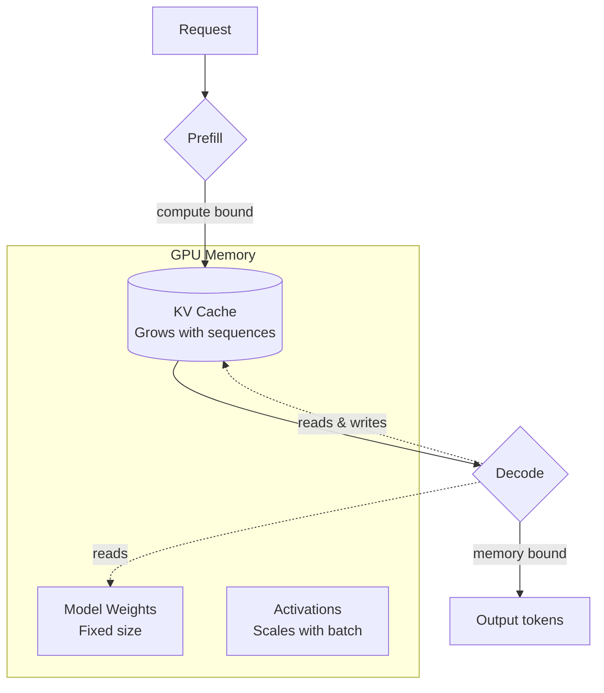

# Chapter 10 - How Transformers Actually Serve Requests

> Understanding inference mechanics is not optional. Every capacity model, every
> latency budget, and every cost estimate depends on knowing where the time and
> memory actually go.

---

## Learning Objectives

By the end of this chapter you will be able to:

- Explain why attention is O(n^2) in sequence length and why that matters for
  capacity planning.
- Calculate KV cache memory requirements for a given model and context length.
- Distinguish prefill from decode and explain why they have different bottlenecks.
- Choose a batching strategy based on throughput vs latency requirements.
- Estimate GPU memory partitioning between model weights, KV cache, and
  activations.
- Predict how time-to-first-token changes with prompt length.

---

## The Production Story

Consider an inference platform team running a 7B parameter model on A100 GPUs.
The deployment handles both chat traffic (short prompts, long outputs, latency
sensitive) and summarization traffic (long documents, short outputs, throughput
sensitive). Each workload was assigned its own GPU pool.

The chat pool ran at 40% GPU memory utilization and delivered consistent
sub-second time-to-first-token. The summarization pool ran at 95% memory
utilization and occasionally OOMed when documents exceeded 6,000 tokens.

The team's first instinct was to add memory. The 40GB A100s became 80GB A100s.
The summarization OOMs continued. Documents that worked yesterday failed today.
The pattern was not correlated with document size alone - some 8,000 token
documents succeeded while some 5,000 token documents failed.

The answer was batching. The summarization workload used static batching:
requests arrived, accumulated until the batch was full, then processed together.
When several long documents arrived simultaneously, their combined KV cache
exceeded GPU memory. The failure was not "this document is too long" but "these
documents together are too long," and the logs said nothing about which
combination caused the problem.

The fix was switching to continuous batching with per-sequence memory tracking.
New sequences only joined the batch if their KV cache would fit. The 80GB GPUs
went back to being 40GB GPUs, and the OOMs stopped.

---

## Why This Exists

Every engineer using LLMs needs a mental model of what happens inside the
inference server. Not the mathematics of attention - the operations research of
it. Where does memory go? What determines latency? Why does a longer prompt
cost more even before any tokens are generated?

The literature is split between two audiences. Machine learning papers explain
the math to researchers who will modify it. API documentation treats the model
as a black box that accepts tokens and charges dollars. Neither helps the
platform engineer who must size GPU fleets, set request timeouts, and explain
to finance why inference costs tripled when average prompt length doubled.

This chapter bridges that gap. The model we build is a simulation - it performs
no actual neural network math - but it captures the computational structure that
determines production behavior. Specifically: where memory goes, which
operations are parallelizable, and why some workloads hit GPU limits that others
never approach.

---

## Core Concepts

**Transformer.** The neural network architecture underlying all modern LLMs. A
transformer is a stack of identical layers, each containing an attention
mechanism and a feed-forward network. The number of layers determines depth;
the hidden size determines width.

**Attention.** The mechanism that lets each token in a sequence interact with
every other token. For a sequence of length n, attention computes an n-by-n
matrix of pairwise relationships. This is where the O(n^2) comes from.

**KV cache.** During generation, the key and value projections from attention
are cached so they do not need to be recomputed for each new token. The cache
grows linearly with sequence length. For long contexts, the KV cache dominates
GPU memory usage.

**Prefill.** The phase where the model processes the input prompt. All input
tokens are processed in parallel, making this phase compute-bound. The time to
complete prefill is the time-to-first-token.

**Decode.** The phase where the model generates output tokens one at a time.
Each token requires reading the model weights and the entire KV cache, making
this phase memory-bound. Decode is dramatically slower per token than prefill.

**Batch size.** The number of sequences processed simultaneously. Larger
batches amortize the cost of reading model weights across more sequences,
improving throughput at the cost of latency.

**Arithmetic intensity.** The ratio of compute operations to memory operations.
High intensity means compute-bound; low intensity means memory-bound. Prefill
has high intensity; decode has low intensity.

---

## Internal Architecture

A transformer inference server partitions GPU memory three ways: model weights,
KV cache, and activation memory for intermediate computations. Understanding
this partition is the foundation of all capacity planning.



*GPU memory is partitioned between fixed model weights, growing KV cache, and
transient activations. The KV cache is what limits concurrency.*

### Model weights

For a model with L layers, hidden dimension H, and vocabulary size V, the
parameter count is approximately:

```
Parameters ≈ 12 * L * H^2 + 2 * V * H
```

The 12x multiplier accounts for the attention projections (QKV and output, each
H-by-H) plus the feed-forward network (typically 4H intermediate dimension, so
two H-by-4H matrices).

A 7B parameter model in fp16 requires approximately 14 GB for weights alone.
This is a fixed cost that does not change with batch size or sequence length.

### KV cache

For each token in the context, we store the key and value projections across
all layers:

```
KV memory per token = 2 * L * H * bytes_per_element
```

For a 7B model (L=32, H=4096) in fp16, this is 512 KB per token. A 4,096 token
context requires 2 GB of KV cache per sequence.

This is where the memory scaling matters. Ten concurrent sequences at 4K
context each require 20 GB of KV cache - more than the model weights.
Double the context length, double the KV cache, halve the number of concurrent
sequences you can serve.

### Activation memory

During a forward pass, intermediate tensors must be stored temporarily. For
prefill, this scales with batch size and sequence length. For decode, the
sequence length is 1 (we process one new token), so activation memory is
typically small.

A rough budget: reserve 10-20% of GPU memory for activations. The exact amount
depends on the inference framework and optimization techniques like activation
checkpointing.

### The prefill/decode asymmetry

This is the single most important concept for understanding inference latency.

**Prefill** processes all input tokens in parallel. The attention matrix is
computed once for the entire prompt. Prefill is compute-bound because we are
doing many operations per byte of memory read. A 1,000 token prompt processed
in prefill requires roughly the same wall-clock time as a 100 token prompt with
the same model - the operations parallelize.

**Decode** generates one token at a time. For each token, we must:
1. Read all model weights (14 GB for a 7B model)
2. Read the entire KV cache (2 GB for a 4K context)
3. Compute attention against all previous tokens
4. Generate one token

Step 2 grows with each generated token. Step 3 has O(n) compute for each new
token. Decode is memory-bound because we are reading gigabytes of data to
produce a few hundred bytes of output.

The practical consequence: decode is 10-100x slower per token than prefill.
A prompt that takes 50ms to prefill might generate output at 50 tokens per
second - 20ms per token, or 40x slower than the effective prefill rate.

---

## Production Design

### Memory budgeting

Start with total GPU memory and subtract:

1. **Model weights** - fixed, known from parameter count
2. **Activation overhead** - 10-20% of remaining memory
3. **Safety margin** - 5-10% to avoid OOM on allocation spikes

What remains is available for KV cache. Divide by per-token KV memory to get
maximum total tokens across all sequences.

For an 80 GB A100 with a 7B fp16 model:
- Model weights: 14 GB
- Activations: 8 GB
- Safety margin: 4 GB
- Available for KV: 54 GB
- At 512 KB per token: 108,000 total tokens

With a 4K context, that supports 27 concurrent sequences. With an 8K context,
13 sequences. Context length directly trades against concurrency.

### Batching strategy

**Static batching** groups requests together and processes them as a unit. All
sequences are padded to the length of the longest. When the batch completes,
all sequences complete.

Advantages: simple to implement, predictable memory usage.
Disadvantages: short sequences wait for long ones, padding wastes compute.

**Continuous batching** (also called iteration-level batching) allows sequences
to join and leave the batch independently. When a sequence completes
generation, its slot is immediately filled by a waiting request.

Advantages: better GPU utilization, lower average latency.
Disadvantages: more complex memory management, requires per-sequence tracking.

Use continuous batching for production workloads. The complexity is justified
by the efficiency gains.

### Sizing by concurrency

Do not size by requests per second. Size by concurrent sequences.

A serving instance handling 10 requests per second where each request takes 5
seconds needs capacity for 50 concurrent sequences. If each sequence averages
2K context, you need KV cache for 100K tokens. Work backward from that to GPU
memory requirements.

Little's Law applies directly: concurrency = arrival rate * service time.

### Time-to-first-token budgets

TTFT is the prefill latency - the time to process the prompt before any output
begins. It scales linearly with prompt length (more tokens to process) and
with model size (more computation per token).

For interactive applications, budget 500ms-1s for TTFT. For a 7B model on an
A100, this allows prompts up to roughly 4,000 tokens. For 70B models, the limit
drops to hundreds of tokens at the same latency target.

If prompts are longer than your TTFT budget allows, you have three options:
1. Use a smaller model for long prompts
2. Accept higher latency
3. Truncate or summarize the prompt

---

## Failure Scenarios

### Failure: KV cache OOM

**Symptom.** Inference server OOMs intermittently. Failures correlate loosely
with traffic but not with any single request's size.

**Mechanism.** Total KV cache across all concurrent sequences exceeds GPU
memory. This depends on the combination of requests in flight, not on any
individual request. A burst of long-context requests arriving together triggers
the OOM.

**Detection.** Monitor total KV cache memory across all sequences. Alert when
approaching 90% of the KV cache budget. Track maximum context length in the
active batch.

**Mitigation.** Reject new requests when KV cache budget is exhausted. Return
a 503 with a retry hint. Do not let the server OOM - recovery takes longer than
shedding the request.

**Prevention.** Admission control based on available KV memory. A request
reserves its maximum possible KV cache (prompt length plus max_tokens) at
admission and releases it at completion. Continuous batching with per-sequence
memory tracking.

### Failure: prefill starvation

**Symptom.** New requests queue indefinitely while the system appears to have
available GPU capacity. Throughput is high but TTFT is unbounded.

**Mechanism.** The batch is fully occupied with decode steps for existing
sequences. Decode is the only work happening. No GPU time is allocated to
prefill new requests because the batch never has an empty slot.

**Detection.** Track prefill queue depth and wait time. Alert on prefill
latency percentiles, not just throughput.

**Mitigation.** Reserve a fraction of batch capacity for prefill. Even when
decode is backlogged, run prefill for new requests to bound TTFT.

**Prevention.** Most continuous batching implementations include prefill
scheduling. Configure it to guarantee TTFT SLOs. Accept slightly lower
decode throughput in exchange for bounded admission latency.

### Failure: context length surprise

**Symptom.** A workload that handled 4K context suddenly fails at 4K context
after a model upgrade.

**Mechanism.** Different models with the same parameter count can have different
KV cache requirements. A model with more layers and smaller hidden dimension
stores more data per token than one with fewer layers and larger hidden
dimension.

**Detection.** Include per-token KV memory in model metadata. Compute maximum
context length from available memory and compare to expected workload.

**Mitigation.** Reduce batch size to free KV cache memory. Reduce maximum
accepted context length.

**Prevention.** Treat KV cache per token as a first-class deployment parameter.
Test memory limits during model rollout before enabling production traffic.

---

## Scaling Strategy

Things break in this order as load increases:

**First: TTFT degrades, around 60-70% GPU utilization.** Prefill latency grows
because new requests must wait for batch slots. The GPU is spending most of
its time on decode for existing sequences. Fix: schedule prefill explicitly
rather than opportunistically.

**Second: KV cache exhaustion, around 80% memory utilization.** New requests
cannot find memory for their KV cache. Fix: admission control with memory
reservation. Reject requests that would exceed budget.

**Third: batch slot starvation, around max concurrent sequences.** Even with
memory available, the batch cannot accept more sequences because continuous
batching overhead grows with batch size. Fix: scale horizontally. Each GPU
handles fewer sequences but more total capacity.

**Fourth: model weight memory, when adding GPUs.** Tensor parallelism across
GPUs requires splitting model weights, but also requires communication between
GPUs. Past 4-8 GPUs, the communication overhead dominates. Fix: data
parallelism (multiple independent replicas) rather than more tensor parallelism.

---

## Trade-offs

| Decision | Buys you | Costs you | Choose when |
| --- | --- | --- | --- |
| Longer max context | Can handle long documents | Fewer concurrent sequences, higher OOM risk | Workload requires long context |
| Larger batch size | Higher throughput | Higher latency per request | Throughput-sensitive, latency-tolerant |
| Smaller batch size | Lower latency | Lower throughput | Latency-sensitive chat/interactive |
| Static batching | Simple implementation | Padding waste, head-of-line blocking | Prototyping, uniform sequence lengths |
| Continuous batching | Better utilization | Complex memory management | Production, variable workloads |
| Higher GPU memory | More concurrent sequences | Higher cost per GPU | Memory is the bottleneck |
| More GPUs (replicas) | Linear throughput scaling | Linear cost scaling | Horizontal scaling needed |
| Tensor parallelism | Can serve larger models | Communication overhead, diminishing returns | Single model does not fit one GPU |

---

## Code Walkthrough

From `examples/ch10-transformers/`. The full simulation is about 600 lines; the
two pieces below capture the key concepts.

### KV cache memory calculation

The formula that determines how many sequences fit in GPU memory:

```ts
// examples/ch10-transformers/src/kv-cache.ts

/**
 * Calculate KV cache memory for a single sequence.
 *
 * KV cache stores the key and value projections for all previous tokens,
 * allowing autoregressive generation without recomputing attention.
 *
 * Memory per token = 2 * numLayers * hiddenSize * bytesPerParam
 *
 * The factor of 2 is for both K and V.
 */
export function kvCacheMemoryPerToken(config: ModelConfig): number {
  const { numLayers, hiddenSize, bytesPerParam } = config;
  return 2 * numLayers * hiddenSize * bytesPerParam;        // (1)
}

/**
 * Calculate total KV cache memory for a sequence of given length.
 */
export function kvCacheMemoryForSequence(
  config: ModelConfig,
  seqLen: number,
): number {
  return kvCacheMemoryPerToken(config) * seqLen;            // (2)
}

/**
 * Calculate how many concurrent sequences can fit in GPU memory.
 */
export function maxConcurrentSequences(
  config: ModelConfig,
  gpuMemoryBytes: number,
  modelMemoryBytes: number,
  activationOverheadBytes: number,
  avgSeqLen: number,
): number {
  const availableForKV = gpuMemoryBytes -                   // (3)
    modelMemoryBytes - activationOverheadBytes;
  const kvPerSequence = kvCacheMemoryForSequence(config, avgSeqLen);

  return Math.floor(availableForKV / kvPerSequence);        // (4)
}
```

1. For each token, we store K and V (factor of 2) for every layer.
2. Linear scaling: double the sequence length, double the memory.
3. GPU memory minus fixed costs leaves what is available for KV cache.
4. Integer division - partial sequences do not count.

### Phase asymmetry demonstration

This function shows why prefill and decode have such different characteristics:

```ts
// examples/ch10-transformers/src/phases.ts

/**
 * Demonstrate the prefill/decode asymmetry with concrete numbers.
 */
export function demonstratePhaseAsymmetry(
  modelConfig: ModelConfig,
  gpu: GPUSpec,
): {
  prefill: { tokens: number; msPerToken: number; bound: string };
  decode: { tokens: number; msPerToken: number; bound: string };
  speedupRatio: number;
} {
  const testTokens = 1000;

  const prefill = simulatePrefill(modelConfig, gpu, testTokens);   // (1)
  const decode = simulateDecode(modelConfig, gpu, testTokens, testTokens);

  const prefillMsPerToken = prefill.durationMs / testTokens;       // (2)
  const decodeMsPerToken = decode.durationMs / testTokens;

  return {
    prefill: {
      tokens: testTokens,
      msPerToken: prefillMsPerToken,
      bound: prefill.computeUtilization > 0.5 ? 'compute' : 'memory',
    },
    decode: {
      tokens: testTokens,
      msPerToken: decodeMsPerToken,
      bound: decode.memoryBandwidthUtilization > 0.5 ? 'memory' : 'compute',
    },
    speedupRatio: decodeMsPerToken / prefillMsPerToken,            // (3)
  };
}
```

1. Prefill processes all tokens in parallel (compute-bound).
2. Divide total time by tokens to get per-token rate.
3. The ratio is typically 10-100x - decode is dramatically slower per token.

---

## Hands-On Lab

**Goal:** observe the key behaviors that determine inference performance. About
30 seconds of runtime, Node 22.6+, no dependencies and no GPU.

```bash
cd examples/ch10-transformers
node scripts/lab.mjs
```

That runs all thirteen steps and asserts thirty-eight claims. The rest of this
section explains what it is checking.

**Step 1-3: scaling behavior.** Verify that attention scores grow quadratically
(O(n^2)) with sequence length while KV cache grows linearly (O(n)). Double the
sequence length, attention memory quadruples, KV cache doubles.

**Step 4-5: memory management.** Verify the KV cache correctly tracks memory
usage, evicts LRU entries when full, and correctly calculates maximum
concurrent sequences for a given GPU and context length.

**Step 6-7: batching strategies.** Show that static batching has significant
padding overhead with variable sequence lengths (50% of compute wasted in the
test case). Continuous batching maintains high utilization by filling slots
dynamically.

**Step 8-9: phase asymmetry.** Demonstrate that prefill is compute-bound while
decode is memory-bound. Decode is over 100x slower per token than prefill in
the simulation - the ratio in production is typically 10-100x depending on
model size and hardware.

**Step 10-11: context length impact.** Show that time-to-first-token grows
linearly with context length (prefill processes all tokens), and that longer
contexts also slow decode (larger KV cache to read).

**Step 12: throughput/latency tradeoff.** Demonstrate that larger batches
improve throughput (4.6x improvement with 8x batch in the test) but increase
per-request latency. This is the fundamental tradeoff in inference serving.

**Step 13: generation metrics.** Verify that total generation time is the sum
of prefill and decode, and that decode dominates for outputs longer than
inputs.

---

## Interview Questions

1. Why is attention O(n^2) and what are the implications for long contexts?
2. A 7B model fits in 14 GB of GPU memory. Why can you not run it on a 16 GB
   GPU at 4K context with multiple concurrent requests?
3. You observe that time-to-first-token is 200ms for short prompts and 2s for
   long prompts, but tokens-per-second during generation is the same for both.
   Explain why.
4. Your inference server is at 40% GPU utilization but requests are queuing.
   What is the likely bottleneck?
5. A workload has highly variable sequence lengths (100 to 4000 tokens). Which
   batching strategy should you use and why?
6. How does doubling the context window affect the number of concurrent
   sequences you can serve?
7. You need to improve throughput without adding GPUs. What are your options?
8. A model upgrade from 7B to 13B parameters doubles inference cost. Is this
   expected?

## Staff-Level Answers

**Q1 - Why O(n^2).** Each token attends to every other token, producing an
n-by-n attention matrix. For a 4K context, that is 16 million attention scores
per layer. The memory required is proportional to n^2; the compute is also
proportional to n^2.

The staff-level addition: O(n^2) means doubling context does not double
resources - it quadruples them. This is why context length is the single most
important parameter for capacity planning. A model that handles 4K contexts
cannot handle 16K contexts with the same fleet size. The scaling is worse than
linear and worse than most engineers expect.

**Q3 - TTFT vs generation speed.** TTFT is prefill latency - processing the
entire prompt before any output. Longer prompts mean more prefill work.
Generation speed is decode throughput - generating tokens one at a time, which
depends on model size and batch configuration but not significantly on prompt
length.

The asymmetry is fundamental: prefill is compute-bound and parallelizable,
decode is memory-bound and sequential. A 2,000 token prompt does not slow down
generation of a 100 token output; it just delays when generation starts.

**Q4 - 40% utilization with queueing.** Memory-bound, not compute-bound. GPU
compute is 40% utilized because decode only needs one token's worth of
computation per step. But GPU memory is likely near full with KV cache for
concurrent sequences.

The metric to check: KV cache memory utilization. If it is at 90%+, new requests
cannot start because their KV cache would not fit. The solution is not to add
compute - it is to reduce concurrent sequences or add GPU memory.

**Q6 - Context doubling effect.** Exactly halves the number of concurrent
sequences. KV cache per sequence doubles, so the same memory budget holds half
as many sequences.

The implication: a platform that supports both short-context (2K) and
long-context (32K) workloads should not mix them on the same GPU pool. The
long-context sequences will starve the short-context traffic of batch slots.

**Q7 - Throughput without more GPUs.** Three main options:

1. Larger batch size - amortize weight reads across more sequences. Works until
   you hit memory limits.
2. Quantization - 4-bit weights instead of 16-bit. Reduces memory footprint,
   allowing larger batches. Quality tradeoff.
3. Request routing - send long-context requests to dedicated pools, keep
   short-context batches dense.

The staff addition: model selection may matter more than serving optimization.
A smaller model that meets quality requirements will have better throughput
than a larger model with perfect serving efficiency.

---

## Exercises

1. **Memory budget.** An 80 GB A100 runs a 13B parameter model in fp16. The
   model uses 26 GB for weights. Reserve 8 GB for activations. Calculate the
   maximum context length if you want to support 20 concurrent sequences.

2. **TTFT estimation.** A model processes prefill at 50,000 tokens per second
   on an A100. What is the expected TTFT for a 2,000 token prompt? For a 10,000
   token prompt?

3. **Batching tradeoff.** A workload requires p99 latency under 500ms for each
   request. Each request generates 100 tokens and the server decodes at 50
   tokens per second per sequence. What is the maximum batch size?

4. **Scaling calculation.** You need to serve 100 requests per minute, each
   with 2,000 token prompts and 500 token outputs. Average TTFT is 200ms and
   decode is 50 tokens/second. Calculate the concurrency requirement and
   estimate GPU count for a 7B model.

5. **Design question.** A chat application uses a 7B model with 8K context
   window. User sessions can last 30 minutes with continuous back-and-forth.
   How do you prevent older sessions from consuming all KV cache? Write a
   one-page design.

---

## Further Reading

- **Vaswani et al., "Attention Is All You Need"** - The original transformer
  paper. Dense but essential for understanding why the architecture exists.
  Focus on sections 3.2 (attention) and 3.3 (position encoding).

- **Pope et al., "Efficiently Scaling Transformer Inference"** - Google's
  analysis of inference efficiency. Excellent treatment of memory bandwidth
  as the decode bottleneck. The arithmetic intensity analysis is particularly
  useful.

- **Yu et al., "Orca: A Distributed Serving System for Transformer-Based
  Generative Models"** - Introduces continuous batching. The iteration-level
  scheduling discussion explains why dynamic batching outperforms static
  batching by 36x in some workloads.

- **Kwon et al., "Efficient Memory Management for Large Language Model Serving
  with PagedAttention"** - The vLLM paper. PagedAttention solves the memory
  fragmentation problem that limits KV cache efficiency. Worth reading for
  the memory management insights even if you do not use vLLM.

- **Leviathan et al., "Fast Inference from Transformers via Speculative
  Decoding"** - Shows how to accelerate decode by using a smaller model to
  draft tokens that a larger model verifies. Demonstrates that decode latency
  is not fundamental - it is an engineering problem with engineering solutions.

- **GPU vendor documentation (NVIDIA, AMD)** - Memory bandwidth specifications
  and theoretical FLOPS. You cannot estimate inference performance without
  knowing the hardware's actual capabilities, and vendor specs are the only
  reliable source.
