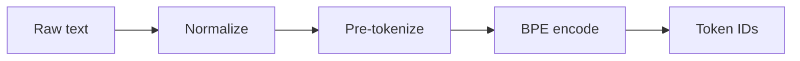

# Chapter 11 - Tokenization and Context Windows

> Tokens are not words, context windows have hard limits, and every
> character you send costs money. Understanding the mismatch between
> human text and model input is the foundation of LLM cost control.

---

## Learning Objectives

By the end of this chapter you will be able to:

- Explain why token counts differ from word counts and predict the
  direction of the difference for different text types.
- Implement token estimation strategies with known error bounds and
  choose between speed and accuracy based on use case.
- Design context window management that preserves critical information
  while respecting hard limits.
- Select truncation strategies appropriate to content type and explain
  their trade-offs.
- Calculate token budgets that reserve space for output while maximizing
  useful input.
- Debug the three most common tokenization failures in production and
  explain their mechanisms.

---

## The Production Story

Consider a customer support platform handling 100,000 conversations per
day. The team builds a conversation summarization feature: after each
call, the system generates a 3-sentence summary for the case file.

Initial testing looks fine. Summaries are accurate, latency is
acceptable, cost projections are reasonable. The team estimates token
usage at 1.3 tokens per word, based on documentation they read
somewhere.

Two weeks after launch, the billing report arrives. Actual costs are 2.4x
the projection. The CFO schedules a meeting.

Investigation reveals the problem is not in the model or the prompts. It
is in the token estimation. Customer service conversations contain:

- Product SKUs like `ABC-123-XL-BLU-24` (10+ tokens for one "word")
- URLs that customers paste from confirmation emails (40+ tokens each)
- Quoted error messages with JSON payloads (JSON averages 2.5 tokens per
  word)
- Phone numbers, order IDs, and tracking numbers (digits tokenize
  inefficiently)

The 1.3 tokens-per-word assumption holds for clean English prose. Customer
service transcripts are not clean English prose.

Worse, some conversations exceed the context window. The system silently
truncates them. The model sees the beginning of the conversation (the
greeting and problem statement) but not the resolution. Summaries say
things like "Customer reported an issue with their order" — technically
accurate but operationally useless.

The team adds proper token counting. They discover that 15% of
conversations were truncating, and the truncation strategy was the
worst possible choice for their use case.

At the incident review, someone asks: "Why did we assume tokens were
close to words when the documentation says otherwise?"

---

## Why This Exists

Every LLM processes text as tokens, not characters or words. A token is
the atomic unit of the model's vocabulary, learned during training
through algorithms like Byte Pair Encoding (BPE). The vocabulary
typically contains 50,000-100,000 entries: common words, word fragments,
punctuation, and special characters.

Before tokenization was understood, teams estimated costs and capacity
using word counts or character counts. This worked poorly because:

**Token counts do not correlate linearly with word counts.** The word
"unhappiness" might become `["un", "happiness"]` or `["unhapp", "iness"]`
depending on the vocabulary. Contractions, compound words, and technical
terms tokenize unpredictably.

**Different content types tokenize differently.** English prose averages
1.3 tokens per word. Code averages 1.8. JSON averages 2.5. CJK languages
can be as high as 1.5 tokens per character because the vocabulary is
trained primarily on English.

**Context windows are measured in tokens, not characters.** A model with
an 8,192 token context window accepts roughly 6,000 words of English
prose — but only 3,000 words of JSON. Capacity planning that ignores this
difference is capacity planning that is wrong by 2x.

**Pricing is per token, not per request.** A 100-token request and a
4,000-token request to the same endpoint cost 40x different amounts. Cost
control without token awareness is not cost control.

---

## Core Concepts

**Token.** The atomic unit of text that the model processes. A subword or
character sequence from the trained vocabulary. Common words are often
single tokens; rare words split into multiple tokens.

**Byte Pair Encoding (BPE).** The algorithm most modern tokenizers use.
Starts with individual characters, then iteratively merges the most
frequent adjacent pairs until reaching the target vocabulary size. The
result is a vocabulary where common sequences are single tokens.

**Context window.** The maximum number of tokens a model can process in
one request, including both input and output. Exceeding this limit causes
an error or truncation depending on the API.

**Token budget.** The allocation of context window tokens across different
purposes: system prompt, conversation history, current message, and
reserved space for output.

**Truncation.** Removing content to fit within a token limit. Different
strategies preserve different parts of the content: head keeps the
beginning, tail keeps the end, middle keeps both ends.

**Token estimation.** Approximating token count without running the full
tokenizer. Useful for admission control and capacity planning when exact
counting is too expensive.

---

## Internal Architecture

Tokenization happens in three steps: normalization, pre-tokenization, and
BPE encoding.



*Text flows through normalization, pre-tokenization, and BPE encoding to
produce token IDs that the model processes.*

**Normalization** standardizes the input: lowercasing (sometimes),
Unicode normalization, whitespace handling. Different tokenizers
normalize differently, which means the same text can produce different
token counts across models.

**Pre-tokenization** splits text into words or word-like units before
applying BPE. Most tokenizers split on whitespace and punctuation. The
pre-tokenization rules determine whether "don't" is one unit or three.

**BPE encoding** maps each pre-token to one or more tokens from the
vocabulary. Common words match directly. Rare words split into subwords
that do match.

### Why tokens differ from words

Consider the word "tokenization":

- If "tokenization" is in the vocabulary: 1 token
- If "token" and "ization" are in vocabulary: 2 tokens
- If "tok", "en", "ization" are the longest matches: 3 tokens

The vocabulary is learned from training data. Words common in training
are likely to be single tokens. Domain-specific terms are likely to split.

Numbers are particularly expensive. Most tokenizers encode 1-3 digits per
token. The number "123456789" becomes 3-4 tokens, not one. Phone numbers,
order IDs, and timestamps consume far more tokens than their character
count suggests.

### Token estimation approaches

Exact token counting requires running the tokenizer, which is O(n) in
text length. For high-throughput systems, this cost matters.

Estimation approaches trade accuracy for speed:

| Method | Speed | Error range | Use case |
| --- | --- | --- | --- |
| Exact | O(n) | 0% | Billing, final validation |
| Char ratio | O(1) | 15-30% | Fast admission control |
| Word ratio | O(n) for split | 20-35% | Quick estimates |
| Hybrid sample | O(sample size) | 3-8% | Balanced accuracy/speed |

The hybrid approach samples beginning, middle, and end of the text,
calculates tokens-per-character for the sample, and extrapolates. This
captures variation across the document while running the tokenizer on
only a fraction of the content.

---

## Production Design

**Always use the exact tokenizer for the target model.** Different models
use different vocabularies. A token count from one tokenizer is not valid
for another model. Most providers publish their tokenizer libraries.

**Reserve output tokens explicitly.** The context window is shared between
input and output. If you fill the window with input, the model cannot
respond. A common allocation is 75% input, 25% output, but this varies by
use case.

```ts
// examples/ch11-tokenization/src/counting.ts

export function calculateTokenBudget(
  contextLimit: number,
  options: {
    systemPromptTokens?: number;
    reserveForOutput?: number;
    reserveForSafety?: number;
  } = {}
): TokenBudget {
  const systemPrompt = options.systemPromptTokens ?? 0;
  const reservedForOutput = options.reserveForOutput ??
    Math.floor(contextLimit * 0.25);
  const safetyBuffer = options.reserveForSafety ?? 50;

  const available = contextLimit - systemPrompt -
    reservedForOutput - safetyBuffer;

  // Split available between history and current message
  const currentMessage = Math.floor(available * 0.4);
  const conversationHistory = available - currentMessage;

  return {
    systemPrompt,
    conversationHistory,
    currentMessage,
    reservedForOutput,
    safetyBuffer,
    total: contextLimit,
  };
}
```

1. Safety buffer accounts for estimation error. Without it, edge cases
   exceed the limit and fail.
2. Output reservation is configurable per use case. Summarization needs
   less output space than generation.
3. Current message gets priority over history because it contains the
   immediate task.

**Implement sliding window for conversations.** Long conversations exceed
any context window eventually. A sliding window keeps the most recent N
turns plus system context. Old turns are dropped or summarized.

**Count tokens at ingestion, not at request time.** For documents and
cached content, count once and store the count. Recounting the same
content on every request wastes compute.

**Monitor these metrics:**

| Metric | Why it matters | Alert threshold |
| --- | --- | --- |
| `estimate_error` | Estimation drift | >20% sustained |
| `truncation_rate` | Content loss | >5% of requests |
| `context_utilization` | Wasted capacity | <50% average |
| `token_count_p99` | Capacity planning | >80% of limit |

---

## Failure Scenarios

### Failure: context window exceeded

**Symptom.** API returns error: "This model's maximum context length is
X tokens. Your message resulted in Y tokens."

**Mechanism.** Input tokens plus expected output tokens exceed the model's
context window. The request cannot be processed.

**Detection.** API error response with specific error code for context
overflow.

**Mitigation.** Truncate input to fit. Apply truncation strategy
appropriate to content type. Retry with truncated input.

**Prevention.** Count tokens before sending. Implement hard limits with
buffer space. Reject or truncate at the application layer before hitting
the API.

### Failure: silent truncation causing wrong output

**Symptom.** Model responses are technically correct but miss critical
context. Summaries are incomplete. Answers ignore relevant information.

**Mechanism.** Some systems silently truncate input rather than erroring.
The model sees only part of the content and responds based on what it
saw. No error is raised.

**Detection.** Compare input token count to model's limit. If close,
truncation is likely. Validate output against full input for correctness.

**Mitigation.** Detect truncation and flag affected outputs for review.
Consider re-processing with different truncation strategy.

**Prevention.** Prefer APIs that error on overflow rather than truncate.
If truncation is necessary, use explicit truncation with markers so the
model knows content is missing.

### Failure: token estimation drift

**Symptom.** Estimated token counts diverge from actual by >30%. Cost
projections become unreliable. Admission control rejects valid requests
or admits oversized ones.

**Mechanism.** Estimation ratios are calibrated for one content type but
applied to another. English prose ratios applied to JSON. Code ratios
applied to natural language.

**Detection.** Track estimation error as a metric. Alert when error
exceeds threshold consistently.

**Mitigation.** Recalibrate ratios for the actual content distribution.
Consider content-type-specific estimators.

**Prevention.** Use hybrid sampling for heterogeneous content. Update
calibration as content mix changes.

### Failure: output truncation mid-response

**Symptom.** Model responses end abruptly mid-sentence. JSON responses
are syntactically invalid. Code snippets are incomplete.

**Mechanism.** Insufficient output token reservation. The model hit the
context limit while generating and stopped. The response is partial.

**Detection.** Check response for finish reason. "length" indicates
truncation. Validate response structure for completeness.

**Mitigation.** Request continuation if the API supports it. Otherwise
accept partial response or retry with smaller input.

**Prevention.** Reserve adequate output tokens based on expected response
length. For variable outputs, reserve generously and accept lower input
utilization.

---

## Scaling Strategy

Tokenization scales differently than other text processing because it
involves vocabulary lookups and merging operations.

**First: tokenizer throughput, around 10 MB/sec per core.** Production
tokenizers process text at roughly this rate. At 4 bytes per character,
that's 2.5 million characters per second. This becomes a bottleneck when
processing large document batches.

**Second: memory for vocabulary, around 50-200 MB.** The vocabulary and
merge rules consume memory. In high-concurrency systems, this memory is
per-instance. Thousands of instances means hundreds of gigabytes of
duplicate vocabulary storage.

**Third: estimation accuracy at scale.** As request volume grows, even
small estimation errors compound. A 10% overestimate means 10% of
capacity is wasted. A 10% underestimate means 10% of requests fail.
High-scale systems need tighter estimation bounds.

**Scaling approaches:**

| Scale | Approach |
| --- | --- |
| <1K req/min | Exact counting for everything |
| 1K-10K req/min | Hybrid estimation for admission, exact for billing |
| >10K req/min | Character-based admission, sample-based estimation |

At extreme scale, the cost of exact counting exceeds the cost of
estimation error. The crossover depends on your error tolerance.

---

## Trade-offs

| Decision | Buys you | Costs you | Choose when |
| --- | --- | --- | --- |
| Exact token counting | Perfect accuracy | CPU cost, latency | Billing, final validation |
| Character-ratio estimation | Speed | 15-30% error | High-throughput admission |
| Hybrid sampling | Balanced accuracy | Complexity | Variable content |
| Head truncation | Preserves intro | Loses ending | Narratives, documents |
| Tail truncation | Preserves recent | Loses beginning | Logs, chat history |
| Middle truncation | Preserves both ends | Loses details | Structured documents |
| Large output reservation | Never truncates | Lower input capacity | Variable length output |
| Small output reservation | More input capacity | Risk of truncation | Predictable output |
| Sliding window | Simple, predictable | Loses context | Long conversations |
| Priority-based selection | Keeps important | Requires scoring | Task-oriented assistants |

---

## Code Walkthrough

From `examples/ch11-tokenization/`. The tokenizer is implemented in pure
TypeScript to model BPE behavior without requiring external dependencies.

### Simple BPE tokenizer

```ts
// examples/ch11-tokenization/src/tokenizer.ts

export class SimpleTokenizer {
  private nextId: number;
  private vocab: Map<string, number>;

  tokenize(text: string, maxTokens?: number): TokenizeResult {
    const tokens: Token[] = [];
    let pos = 0;

    while (pos < text.length) {
      if (maxTokens !== undefined && tokens.length >= maxTokens) {
        return {
          tokens,
          tokenCount: tokens.length,
          truncated: true,                              // (1)
        };
      }

      const char = text[pos];

      // Whitespace is typically its own token
      if (WHITESPACE.test(char)) {                      // (2)
        const start = pos;
        while (pos < text.length && WHITESPACE.test(text[pos])) {
          pos++;
        }
        tokens.push(this.makeToken(text.slice(start, pos), start, pos));
        continue;
      }

      // Word: extract and apply subword tokenization
      const start = pos;
      while (pos < text.length && !WHITESPACE.test(text[pos])) {
        pos++;
      }
      const word = text.slice(start, pos);
      const subTokens = this.tokenizeWord(word, start); // (3)
      tokens.push(...subTokens);
    }

    return { tokens, tokenCount: tokens.length, truncated: false };
  }
}
```

1. Truncation is explicit. When maxTokens is set, the tokenizer stops
   and marks the result as truncated.
2. Whitespace becomes tokens. This is why token counts exceed word
   counts — spaces are counted.
3. Words undergo subword tokenization. Common sequences become single
   tokens; rare sequences split.

### Context window management

```ts
// examples/ch11-tokenization/src/context.ts

export class ContextWindowManager {
  fitMessages(messages: Message[]): ContextFitResult {
    const availableForMessages =
      this.config.maxTokens -
      this.config.reservedForOutput -
      this.config.reservedForSystem;

    // Separate system messages (always included)
    const systemMessages = messagesWithTokens.filter(
      (m) => m.role === 'system'
    );
    const conversationMessages = messagesWithTokens.filter(
      (m) => m.role !== 'system'
    );                                                  // (1)

    // System messages use reserved space
    const systemTokens = systemMessages.reduce(
      (sum, m) => sum + (m.tokens ?? 0), 0
    );

    // Available for conversation after system messages
    const conversationBudget = availableForMessages - systemTokens;

    // Fit conversation messages, prioritizing recent ones
    const { fitted, dropped } = this.fitConversation(
      conversationMessages,
      conversationBudget
    );                                                  // (2)

    const result: Message[] = [...systemMessages, ...fitted];
    const totalTokens = result.reduce(
      (sum, m) => sum + (m.tokens ?? 0), 0
    );

    return {
      messages: result,
      totalTokens,
      availableForOutput: this.config.maxTokens - totalTokens,
      droppedCount: dropped.length,                     // (3)
    };
  }
}
```

1. System messages are mandatory. They use reserved space and are never
   dropped regardless of conversation length.
2. Recent messages are prioritized. The fitting algorithm works
   backwards from most recent, keeping messages until budget exhausts.
3. Drop tracking enables monitoring. High drop rates indicate the
   context window is too small for the use case.

### Truncation strategies

```ts
// examples/ch11-tokenization/src/truncation.ts

export class TruncationEngine {
  truncate(
    text: string,
    maxTokens: number,
    strategy: TruncationStrategy = 'head'
  ): TruncationResult {
    const originalTokens = this.tokenizer.countTokens(text);

    if (originalTokens <= maxTokens) {
      return { text, truncated: false };                // (1)
    }

    const markerTokens = this.tokenizer.countTokens(
      TRUNCATION_MARKERS[strategy]
    );
    const targetTokens = maxTokens - markerTokens;      // (2)

    let truncatedText: string;

    switch (strategy) {
      case 'head':
        truncatedText = this.truncateHead(text, targetTokens);
        break;
      case 'tail':
        truncatedText = this.truncateTail(text, targetTokens);
        break;
      case 'middle':
        truncatedText = this.truncateMiddle(text, targetTokens);
        break;
      case 'sentence':
        truncatedText = this.truncateSentence(text, targetTokens);
        break;                                          // (3)
    }

    return { text: truncatedText, truncated: true };
  }
}
```

1. No-op when content fits. Truncation only happens when necessary.
2. Reserve space for marker. The truncation indicator itself consumes
   tokens, which must be accounted for.
3. Strategy selection is caller's choice. Different content types need
   different strategies — the engine does not guess.

---

## Hands-On Lab

**Goal:** observe tokenization behavior, estimation accuracy, and
truncation strategies. About 1 second of runtime, Node 22.6+, no
dependencies.

```bash
cd examples/ch11-tokenization
node scripts/lab.mjs
```

That runs all thirteen steps and asserts forty-one claims. The rest of
this section explains what it is checking and why.

**Step 1 — token count differs from word count.**

Tokenize simple sentences and verify that token counts exceed word
counts. Compound words and punctuation increase the ratio further.
Numbers split into multiple tokens.

Observed: "The quick brown fox..." produces 10 tokens from 9 words.
Punctuation and spaces become their own tokens.

**Step 2 — tokenizer behavior verification.**

Verify that tokenize-decode roundtrip preserves text exactly. Check that
token positions span the entire input. Verify truncation with maxTokens
parameter.

**Step 3 — token estimation accuracy.**

Compare word-ratio, character-ratio, and hybrid estimation against exact
counts. Hybrid estimation achieves <5% error on average by sampling.

**Step 4 — token budget calculation.**

Calculate budgets for an 8,192-token context window. Verify that all
components sum to total and reservations are respected.

**Step 5 — context window management.**

Fit messages into a constrained context window. System messages are
always included. Recent messages are prioritized over older ones.

**Step 6 — sliding window behavior.**

Apply a 2-turn sliding window to a long conversation. Verify that only
the most recent turns are kept and system messages are preserved.

**Step 7 — truncation strategies.**

Test head, tail, middle, and sentence truncation. Each preserves
different parts of the content with appropriate markers.

**Step 8 — no truncation when under limit.**

Verify that short text is returned unchanged with truncated=false.

**Step 9 — smart document truncation.**

Truncate a structured document while preserving section headers. The
introduction is always kept.

**Step 10 — batch truncation with budget.**

Truncate multiple documents to fit a shared budget. Budget is distributed
proportionally to original sizes.

**Step 11 — priority-based selection.**

Select messages by priority score. System messages come first, then
high-priority messages, until budget exhausts.

**Step 12 — output budget calculation.**

Calculate available output tokens after input consumption. When input is
large, output budget is constrained below the reservation.

**Step 13 — estimation confidence bounds.**

Verify that exact counts fall within the estimate's confidence bounds.
Hybrid estimation provides tighter bounds than ratio-based methods.

---

## Interview Questions

1. Why does the same text produce different token counts for different
   models?

2. A system has 30% token estimation error. What problems does this
   cause and how would you fix them?

3. You are building a summarization service. How do you decide how much
   of the context window to reserve for output?

4. A conversation exceeds the context window. Compare sliding window,
   truncation, and summarization approaches.

5. Why do numbers tokenize inefficiently? How does this affect cost for
   data-heavy applications?

6. A customer reports that AI responses are ignoring important context.
   What is your debugging process?

7. Should token counting happen at request time or ingestion time?
   Defend your choice.

8. What truncation strategy would you use for (a) a legal document,
   (b) a chat log, (c) source code? Explain each choice.

9. How would you design a token budget system for a multi-tenant
   platform where tenants have different context window sizes?

10. You need to process 1 million documents through an LLM. How do you
    estimate total token cost before processing?

---

## Staff-Level Answers

**Q1 — different token counts for different models.** Each model has its
own vocabulary learned during training. The vocabulary is optimized for
that model's training data distribution. A model trained heavily on
English has different vocabulary than one trained on code.

The staff addition: this means you cannot estimate costs for one model
based on token counts from another. If you are comparing providers, you
need to run their tokenizers on your actual data distribution. Published
"tokens per 1K characters" ratios are averages that may not match your
content.

**Q4 — conversation exceeds context window.** Three approaches:

**Sliding window:** Keep the most recent N turns. Drop older messages.
Simple and predictable, but loses early context that may be important
for coherence. Good for short-term task conversations, bad for
multi-session relationships.

**Truncation:** Keep everything until a limit, then truncate. The model
sees a marker indicating content was removed. Good when the full context
is not needed for the current turn. Bad when coherence depends on early
messages.

**Summarization:** Periodically summarize old messages into a condensed
form. Preserves the gist of old context at lower token cost. Good for
long-running conversations. Bad when exact details matter — summaries
lose nuance.

The staff answer picks one and defends it: For a customer service bot, I
would use summarization with sliding window. Summarize after every 10
turns, keeping the summary plus the last 5 turns. This preserves context
(customer's issue, previous attempts) while bounding token usage.

The trade-off I am accepting: summarization is another LLM call with its
own cost and latency. I would batch summarization asynchronously and
cache results. The summary quality depends on the summarization prompt,
which needs its own evaluation.

**Q7 — request time vs ingestion time.** Ingestion time. Count once,
store the count, reuse on every request.

Arguments for ingestion time:

1. Documents and knowledge base content are read many times. Counting
   once amortizes the cost across all reads.
2. Request latency is more sensitive than ingestion latency. Users wait
   for responses, not for document uploads.
3. Token counts are deterministic for the same tokenizer version. The
   count will not change between ingestion and request.

The exception: user input. You cannot count user messages at ingestion
because they do not exist until request time. Use estimation for
admission control, exact counting for billing.

**Q10 — estimate 1 million documents.** Sample and extrapolate. Exact
counting of 1 million documents is expensive. Instead:

1. Random sample 1,000 documents (0.1%).
2. Count exact tokens for the sample.
3. Calculate mean and standard deviation.
4. Extrapolate to full corpus with confidence interval.

For a sample of 1,000, the 95% confidence interval on the mean is roughly
±6% of the standard error. If your sample shows 500 tokens average with
standard deviation 200, the total is approximately 500M tokens ± 4%.

The staff addition: stratify the sample by document type or size. If
your corpus is 80% short emails and 20% long reports, random sampling
may over- or under-represent one category. Stratified sampling ensures
each category contributes to the estimate proportionally.

---

## Exercises

1. **Tokenizer comparison.** Get token counts for the same text using
   three different providers' tokenizers. Calculate the variance. How
   much does provider choice affect cost estimation?

2. **Estimation calibration.** Build a calibration dataset of 100 texts
   from your domain. Measure estimation error for each method. Calculate
   custom ratios that minimize error for your content.

3. **Truncation evaluation.** Take 20 documents and truncate each to 50%
   of original tokens using each strategy. Have a human rate which
   truncation preserves the most important information.

4. **Context window simulation.** Simulate a 50-turn conversation with
   varying message lengths. Compare sliding window sizes of 5, 10, and
   20 turns. Measure information loss by testing if the model can
   answer questions about dropped messages.

5. **Cost projection.** You are launching a new feature. Design a
   methodology to estimate token costs from pilot data before full
   rollout. What sample size do you need for 95% confidence within 10%?

---

## Further Reading

- **OpenAI tiktoken documentation** — the reference tokenizer for GPT
  models. The Python and JavaScript libraries are open source. Start
  here to understand real-world BPE behavior.

- **"Neural Machine Translation of Rare Words with Subword Units"
  (Sennrich et al., 2016)** — the paper that introduced BPE for NLP.
  Short and readable, explains why subword tokenization works.

- **Hugging Face Tokenizers library** — high-performance tokenizer
  library supporting multiple algorithms. The documentation explains
  BPE, WordPiece, and Unigram in depth.

- **Anthropic prompt engineering guide, context management section** —
  practical advice on managing context windows for Claude. The
  strategies generalize to other models.

- **"What Language Model Architecture and Pretraining Objective Work
  Best for Zero-Shot Generalization?"** — academic paper comparing
  how different tokenization affects model capability. Context for why
  tokenizers matter beyond just counting.

- **Google SentencePiece** — alternative tokenizer used by many open
  models. Understanding both BPE and SentencePiece covers most
  production tokenizers.
