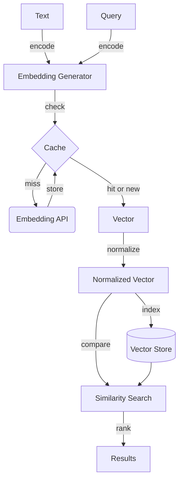

# Chapter 12 — Embeddings

> Embeddings convert text into fixed-length vectors where semantic similarity
> becomes geometric proximity; production systems must treat these vectors as
> versioned artifacts subject to drift, caching, and dimension trade-offs.

---

## Learning Objectives

By the end of this chapter you will be able to:

- Explain what embeddings represent and why semantic similarity translates to
  vector proximity in the embedding space.
- Implement and compare cosine similarity, dot product, and Euclidean distance,
  and explain when to use each metric.
- Design an embedding cache that correctly handles model version changes.
- Detect embedding drift when models are updated and determine whether
  reindexing is necessary.
- Make informed trade-offs between embedding dimensions, storage costs, and
  retrieval quality.
- Normalize embeddings at index time and explain why this makes search faster.

---

## The Production Story

Consider a document search team at a fintech company maintaining 2 million
indexed documents. Search worked well for months. Users found relevant
contracts, reports, and policies. Then the team upgraded their embedding model
from v1 to v2 — a routine update that promised better accuracy on benchmarks.

Search quality collapsed. Users reported that queries returned completely
different results. A search for "credit risk assessment" that previously found
risk reports now returned unrelated documents about credit card processing.
Some documents that ranked first now ranked twentieth.

The team's first instinct was to check the model. It worked correctly in
isolation. The second instinct was to reindex everything. That would take 12
hours and require downtime. Instead, they investigated.

The problem: the cache. The team had cached embeddings aggressively to reduce
API costs. When the model changed, the cache key was just the text — not the
text plus model version. The search index held v2 embeddings, but the query
embeddings came from the cache and were v1. Comparing v1 query vectors against
v2 document vectors produced nonsense rankings.

The deeper problem: no drift detection. Even after fixing the cache keys, how
would they know if a future model update required reindexing? Some model
updates are compatible — all embeddings shift uniformly, preserving relative
similarities. Others are incompatible — relative similarities change, breaking
rankings. Without measurement, every update was a gamble.

The fix required three changes: cache keys that include model version, drift
detection before any model rollout, and a reindex decision based on measured
similarity changes rather than hunches. This chapter covers all three.

---

## Why This Exists

Before embeddings, search meant keywords. If your query terms appeared in a
document, that document matched. If they did not, it did not. Synonyms and
stemming helped, but the fundamental problem remained: search required exact
vocabulary matches between query and document.

Embeddings solve this by representing text as dense vectors in a
high-dimensional space. The key property: texts with similar meaning produce
vectors that are close together. "Car repair" and "automotive maintenance"
have different words but similar embeddings. Search becomes finding the
nearest neighbors to the query vector.

This works because embedding models learn from massive text corpora. During
training, they compress the patterns of how words appear together into vector
representations. Words that appear in similar contexts get similar vectors.
Sentences that mean similar things get similar vectors. The geometry encodes
semantics.

But this power comes with operational complexity. Embeddings are not stable
across model versions. They require storage proportional to dimensions times
documents. They need caching to avoid repeated API calls. And they drift over
time in ways that silently degrade search quality.

This chapter treats embeddings as production artifacts: things that need
versioning, caching, monitoring, and careful upgrade paths.

---

## Core Concepts

**Embedding.** A fixed-length vector representation of text. Common dimensions
range from 256 to 1536. Each dimension is a floating-point number learned
during model training. The dimensions do not have human-interpretable meaning —
you cannot say "dimension 47 represents sentiment." The meaning emerges from
the relationships between vectors.

**Normalization.** Scaling a vector to unit length (magnitude = 1). For a
vector v, the normalized form is v / ||v||. Normalizing at index time makes
similarity computation faster because cosine similarity becomes a simple dot
product. Most production systems normalize all embeddings before storage.

**Cosine similarity.** Measures the angle between two vectors. Ranges from -1
(opposite directions) through 0 (orthogonal) to 1 (same direction). For
normalized vectors, cosine similarity equals the dot product. This is the
default metric for text embeddings because it is scale-invariant: a short
document and a long document about the same topic have similar embeddings
regardless of length.

**Dot product.** The sum of element-wise products: a · b = Σ(aᵢ × bᵢ). For
unnormalized vectors, dot product is affected by magnitude — longer vectors
produce larger dot products. For normalized vectors, dot product equals cosine
similarity. Using normalized vectors with dot product is the fastest way to
compute semantic similarity.

**Euclidean distance.** The straight-line distance between two points:
||a - b|| = √Σ(aᵢ - bᵢ)². Unlike cosine similarity, Euclidean distance is
affected by vector magnitude. It is less common for text embeddings but
sometimes used in clustering. Lower values mean more similar.

**Embedding drift.** When a model is updated, the same text produces a
different vector. If the change is uniform (all vectors shift the same way),
relative similarities are preserved and search quality is unaffected. If the
change is non-uniform (some pairs become more similar, others less), rankings
change and search quality may degrade.

**Model version.** Embedding models are versioned like any software. v1 and v2
of the same model family may produce completely different vectors. You cannot
compare a v1 embedding to a v2 embedding meaningfully. All embeddings in a
search index must use the same model version.

---

## Internal Architecture

An embedding system has three main components: generation, storage, and
comparison. In production, caching sits between generation and storage to
avoid redundant API calls.



*Text passes through the embedding generator, cache, normalization, and into
the vector store. Queries follow the same path and then compare against
stored vectors.*

### Embedding generation

The embedding generator converts text to vectors. In production, this is
typically an API call to a hosted model. The generator should:

1. Accept text and model version as input
2. Return a vector of the configured dimensions
3. Be deterministic — the same text always produces the same vector
4. Handle batching for efficiency (one API call for 100 texts is faster than
   100 calls for 1 text each)

### Caching layer

Embeddings are expensive. A mid-tier embedding API charges roughly $0.10 per
million tokens. For a corpus of 2 million documents averaging 500 tokens each,
initial indexing costs $100. Queries add ongoing costs. Caching identical
texts eliminates redundant charges.

The cache key must include model version. The same text with different model
versions produces different vectors. A cache that ignores version will serve
stale embeddings after model upgrades.

```ts
// examples/ch12-embeddings/src/caching.ts

private makeKey(text: string, modelVersion: string): string {
  // Normalize whitespace to avoid cache misses on formatting differences
  const normalizedText = text.trim().replace(/\s+/g, ' ');
  return `${modelVersion}:${normalizedText}`;
}
```

The key concatenates model version and normalized text. Whitespace
normalization prevents cache misses when the same content has different
formatting.

### Normalization

Normalize embeddings at index time, not query time. This makes similarity
computation a single dot product instead of computing magnitudes during
search.

```ts
// examples/ch12-embeddings/src/embedding.ts

export function normalize(vec: number[]): number[] {
  const mag = Math.sqrt(vec.reduce((sum, v) => sum + v * v, 0));
  if (mag === 0) return vec.map(() => 0);
  return vec.map((v) => v / mag);
}
```

For normalized vectors (magnitude = 1):

```
cosine(a, b) = (a · b) / (||a|| × ||b||) = (a · b) / (1 × 1) = a · b
```

The dot product is one loop through the vectors. Computing magnitudes adds
two more loops. Normalization at index time cuts similarity computation cost
by roughly two-thirds.

### Similarity computation

```ts
// examples/ch12-embeddings/src/similarity.ts

export function cosineSimilarity(a: number[], b: number[]): number {
  if (a.length !== b.length) {
    throw new Error(`Dimension mismatch: ${a.length} vs ${b.length}`);
  }

  let dot = 0;
  let magA = 0;
  let magB = 0;

  for (let i = 0; i < a.length; i++) {
    dot += a[i] * b[i];
    magA += a[i] * a[i];
    magB += b[i] * b[i];
  }

  magA = Math.sqrt(magA);
  magB = Math.sqrt(magB);

  if (magA === 0 || magB === 0) {
    return 0;
  }

  return dot / (magA * magB);
}
```

This is the full formula. For pre-normalized vectors, only the dot product
loop is necessary.

---

## Production Design

**Normalize at index time, not query time.** Store only normalized vectors.
This makes every similarity computation a dot product, which is 2-3x faster
than full cosine computation. The query path normalizes once; the storage
path normalizes once per document.

**Cache with model version in the key.** A text-only cache key will serve v1
embeddings for v2 queries after a model upgrade. This silently breaks search.
The cache key must be `{modelVersion}:{normalizedText}`.

**Set cache TTL based on reindex frequency.** If you reindex weekly, a 7-day
cache TTL is reasonable. If you reindex daily, a 24-hour TTL prevents stale
entries from accumulating. Indefinite caching works only if you clear the
cache on model upgrades.

**Choose dimensions based on latency budget.** Higher dimensions capture more
semantic nuance but cost more storage and slower search. The trade-offs:

| Dimensions | Storage per vector | Search latency | Semantic resolution |
| --- | --- | --- | --- |
| 256 | 1 KB | ~5 ms | Coarse |
| 768 | 3 KB | ~15 ms | Balanced |
| 1536 | 6 KB | ~30 ms | Fine |

For most production systems, 768 dimensions provide good balance. Go higher
only if you need to distinguish subtle semantic differences.

**Batch embedding requests.** Embedding APIs have high per-request overhead.
A single call for 100 texts costs roughly the same as a single call for 1
text. Batch during indexing. For queries, single-text latency is unavoidable,
so choose a model with low cold-start time.

**Monitor embedding API latency separately from search latency.** Embedding
generation and vector search are different operations with different failure
modes. A spike in embedding latency does not indicate a search problem.
Separate metrics help isolate issues.

---

## Failure Scenarios

### Failure: cache serves wrong model version

**Symptom.** After a model upgrade, search quality degrades. Some queries
return relevant results; others return nonsense. The degradation is
inconsistent across queries.

**Mechanism.** The cache key does not include model version. Some cached
embeddings are v1; new embeddings are v2. Queries that hit cached v1
embeddings compare against v2 indexed embeddings, producing meaningless
similarity scores.

**Detection.** Compare cache hit rate before and after model upgrade. A high
hit rate after upgrade suggests stale cache entries. Or add a metric that
logs model version of served embeddings and alert when it differs from the
current model.

**Mitigation.** Clear the cache immediately after model upgrade. Or
invalidate all entries for the old model version.

**Prevention.** Include model version in cache keys. Design cache invalidation
into the model upgrade procedure.

### Failure: dimension mismatch after model change

**Symptom.** Similarity computations throw errors or return NaN. Vector
searches fail entirely.

**Mechanism.** The new model produces embeddings with different dimensions
than the old model. A 768-dimension query vector cannot be compared to a
1536-dimension stored vector.

**Detection.** Log embedding dimensions at generation time. Alert when
dimensions change.

**Mitigation.** Reindex the entire corpus with the new model. There is no
way to convert embeddings between dimensions.

**Prevention.** Before deploying a new model, verify that its dimensions
match the existing index. If they differ, schedule a reindex before the
model change.

### Failure: embedding drift breaks rankings

**Symptom.** After a model upgrade, relevant documents no longer rank first.
Users report that search "stopped working" even though no errors occur.

**Mechanism.** The new model changed relative similarities between texts.
Document A was more similar to query Q than document B with the old model.
With the new model, B is more similar. Rankings changed even though both
models are "correct."

**Detection.** Run drift detection before any model rollout. Compare
pairwise similarities for a sample of texts between old and new models.
Alert if any pair changes by more than a threshold (typically 0.1).

**Mitigation.** Reindex if drift is significant. If drift is minor, the
new model may actually be better — run retrieval evaluations to confirm.

**Prevention.** Never deploy a new embedding model without drift analysis.
Build drift detection into the CI/CD pipeline for model updates.

### Failure: cache memory exhaustion

**Symptom.** The embedding service becomes slow, then crashes. Memory usage
graphs show steady increase.

**Mechanism.** The cache has no size limit or eviction policy. Every unique
text adds an entry. Over time, the cache grows until it exhausts memory.

**Detection.** Monitor cache entry count and memory usage. Alert when either
exceeds a threshold.

**Mitigation.** Restart the service and implement an LRU eviction policy.

**Prevention.** Set a maximum cache size. Use LRU (least recently used)
eviction. Size the cache to fit in available memory with margin for the
rest of the service.

---

## Scaling Strategy

Embedding systems scale along two axes: embedding generation throughput and
vector storage size.

**First bottleneck: embedding API throughput, around 100-500 texts per
second.** A single mid-tier embedding model processes about 100 texts per
second. High-throughput models reach 500. Beyond that, you need multiple
model instances or concurrent API calls.

**Second bottleneck: initial indexing time, around 1 million documents.**
At 100 texts per second, indexing 1 million documents takes about 3 hours.
At 10 million documents, it takes 30 hours — longer than most maintenance
windows. Solutions:

- Parallelize embedding across multiple API keys or instances
- Use incremental indexing (only embed new or changed documents)
- Pre-embed during document ingestion, not in batch

**Third bottleneck: vector storage, around 10 million documents.** At 768
dimensions with 4-byte floats, each vector is 3 KB. Ten million vectors
require 30 GB. This fits in memory on a large instance but not on a small
one. Beyond this, consider:

- Sharding vectors across multiple nodes
- Using quantization to reduce vector size (e.g., int8 instead of float32)
- Moving to a dedicated vector database with built-in scaling

**Fourth bottleneck: cache size, around 100,000 unique texts.** At 3 KB per
embedding plus overhead, 100,000 cached embeddings require about 500 MB.
Beyond that, cache eviction becomes frequent and hit rate drops. Solutions:

- Increase cache memory allocation
- Use a distributed cache (Redis) instead of in-process cache
- Accept lower hit rates for long-tail queries

---

## Trade-offs

| Decision | Buys you | Costs you | Choose when |
| --- | --- | --- | --- |
| Higher dimensions (1536) | Better semantic discrimination | 2x storage, slower search | Subtle distinctions matter |
| Lower dimensions (256) | Faster search, less storage | May miss nuances | Speed matters more than nuance |
| Normalize at index time | Faster similarity computation | One-time normalization cost | Almost always |
| Normalize at query time | Simpler indexing | 3x slower search | Almost never |
| Aggressive caching | Lower API costs, faster queries | Memory usage, staleness risk | High query volume, stable models |
| No caching | Always fresh embeddings | Higher API costs, latency | Low volume, frequent model updates |
| Model version in cache key | Correct behavior across upgrades | Larger keys, cache invalidation on upgrade | Always |
| Text-only cache key | Simpler keys | Broken search after model upgrade | Never |
| Drift detection before upgrade | Safe model updates | Engineering time | Always |
| Skip drift detection | Faster deployments | Silent quality degradation | Never |

---

## Code Walkthrough

From `examples/ch12-embeddings/`. The full system is about 600 lines; the
pieces below are where the key decisions live.

### Deterministic embedding with semantic clustering

The simulation creates embeddings where semantically similar words produce
similar vectors.

```ts
// examples/ch12-embeddings/src/embedding.ts

export function generateEmbedding(
  text: string,
  dimensions: number = DEFAULT_DIMENSIONS,
  shouldNormalize: boolean = true
): number[] {
  const tokens = tokenizeForEmbedding(text);
  if (tokens.length === 0) {
    const rng = createRng(hashString(text || 'empty'));
    const vec = new Array(dimensions);
    for (let i = 0; i < dimensions; i++) {
      vec[i] = rng() * 2 - 1;
    }
    return shouldNormalize ? normalize(vec) : vec;
  }

  const accumulated = new Array(dimensions).fill(0);
  const clusterCounts = new Map<string, number>();

  for (const token of tokens) {
    const cluster = wordToCluster.get(token);
    let tokenVec: number[];

    if (cluster) {
      clusterCounts.set(cluster, (clusterCounts.get(cluster) ?? 0) + 1);
      const clusterVec = getClusterVector(cluster, dimensions);
      const tokenRng = createRng(hashString(token));
      tokenVec = clusterVec.map((v) => v + (tokenRng() - 0.5) * 0.1);
    } else {
      const rng = createRng(hashString(token));
      tokenVec = new Array(dimensions);
      for (let i = 0; i < dimensions; i++) {
        tokenVec[i] = rng() * 2 - 1;
      }
    }

    for (let i = 0; i < dimensions; i++) {
      accumulated[i] += tokenVec[i];
    }
  }

  // Boost cluster signals
  for (const [cluster, count] of clusterCounts) {
    if (count >= 1) {
      const clusterVec = getClusterVector(cluster, dimensions);
      const boostFactor = count * 0.5;
      for (let i = 0; i < dimensions; i++) {
        accumulated[i] += clusterVec[i] * boostFactor;
      }
    }
  }

  for (let i = 0; i < dimensions; i++) {
    accumulated[i] /= tokens.length;
  }

  return shouldNormalize ? normalize(accumulated) : accumulated;
}
```

1. Tokens map to semantic clusters (finance, technology, etc.)
2. Clustered words contribute their cluster's base vector plus noise
3. Non-clustered words contribute random vectors from their hash
4. Final vector is normalized to unit length

### Embedding cache with model version

```ts
// examples/ch12-embeddings/src/caching.ts

export class EmbeddingCache {
  private cache: Map<string, EmbeddingCacheEntry>;
  private maxSize: number;
  private stats: { hits: number; misses: number; evictions: number };

  private makeKey(text: string, modelVersion: string): string {
    const normalizedText = text.trim().replace(/\s+/g, ' ');
    return `${modelVersion}:${normalizedText}`;                    // (1)
  }

  get(text: string, modelVersion: string): number[] | null {
    const key = this.makeKey(text, modelVersion);
    const entry = this.cache.get(key);

    if (!entry) {
      this.stats.misses++;
      return null;
    }

    // Update access tracking for LRU
    entry.hitCount++;
    entry.lastAccessedAt = new Date();

    // Move to end (most recently used)
    this.cache.delete(key);
    this.cache.set(key, entry);                                    // (2)

    this.stats.hits++;
    return entry.embedding;
  }

  set(text: string, embedding: number[], modelVersion: string): void {
    const key = this.makeKey(text, modelVersion);

    if (this.cache.size >= this.maxSize) {
      const oldestKey = this.cache.keys().next().value;
      if (oldestKey !== undefined) {
        this.cache.delete(oldestKey);
        this.stats.evictions++;                                    // (3)
      }
    }

    const entry: EmbeddingCacheEntry = {
      key,
      embedding,
      modelVersion,
      hitCount: 0,
      createdAt: new Date(),
      lastAccessedAt: new Date()
    };

    this.cache.set(key, entry);
  }
}
```

1. Cache key includes model version. Different versions cannot share entries.
2. LRU implementation: move accessed entry to the end of the Map.
3. Eviction tracking helps monitor cache pressure.

### Drift detection

```ts
// examples/ch12-embeddings/src/drift.ts

export function detectDrift(
  textsA: string[],
  embeddingsOld: number[][],
  embeddingsNew: number[][],
  modelA: string,
  modelB: string,
  config: Partial<DriftConfig> = {}
): DriftReport {
  const deltas: number[] = [];
  const affectedPairs: DriftPair[] = [];

  // Compare similarity between all pairs of texts
  for (let i = 0; i < textsA.length; i++) {
    for (let j = i + 1; j < textsA.length; j++) {
      const oldSim = cosineSimilarity(embeddingsOld[i], embeddingsOld[j]);
      const newSim = cosineSimilarity(embeddingsNew[i], embeddingsNew[j]);
      const delta = Math.abs(newSim - oldSim);                     // (1)

      deltas.push(delta);

      if (delta > cfg.deltaThreshold) {
        affectedPairs.push({
          textA: textsA[i],
          textB: textsA[j],
          oldSimilarity: oldSim,
          newSimilarity: newSim,
          delta
        });
      }
    }
  }

  const avgDelta = deltas.reduce((a, b) => a + b, 0) / deltas.length;
  const maxDelta = Math.max(...deltas);

  const driftDetected = affectedPairs.length > 0 ||
                        avgDelta > cfg.deltaThreshold / 2;         // (2)

  return {
    modelA,
    modelB,
    sampleSize: textsA.length,
    avgCosineDelta: avgDelta,
    maxCosineDelta: maxDelta,
    driftDetected,
    affectedPairs: affectedPairs.sort((a, b) => b.delta - a.delta)
  };
}
```

1. Drift is measured by how much pairwise similarities change, not how much
   individual embeddings change. A uniform shift preserves rankings.
2. Drift is detected if any pair exceeds the threshold or if average change
   is high enough to suggest instability.

---

## Hands-On Lab

**Goal:** Demonstrate embedding properties, similarity metrics, caching
behavior, and drift detection. About one second of runtime, Node 22.6+, no
dependencies and no API key.

```bash
cd examples/ch12-embeddings
node scripts/lab.mjs
```

Or from the repo root:

```bash
node examples/ch12-embeddings/scripts/lab.mjs
```

That runs sixteen steps with 40 assertions.

**Expected output:**

```
Step 1 - embeddings are deterministic
  [PASS] same text produces identical embedding
  [PASS] different text produces different embedding

Step 2 - embeddings are normalized
  [PASS] embedding 1 has unit magnitude
  [PASS] embedding 2 has unit magnitude

Step 3 - cosine similarity bounds
  [PASS] identical vectors have similarity 1.0
  [PASS] cosine similarity is within [-1, 1]
  [PASS] cosine similarity validation works

Step 4 - semantic similarity
  [PASS] related texts have higher similarity
  Finance-to-finance similarity: 0.9910
  Finance-to-tech similarity: -0.0028

...

Step 16 - near-duplicate detection
  [PASS] identical texts are detected as near-duplicates
  [PASS] different texts are not near-duplicates

40/40 checks passed
```

**What each step demonstrates:**

| Step | What it shows |
| --- | --- |
| 1 | Embeddings are deterministic |
| 2 | Embeddings are normalized to unit length |
| 3 | Cosine similarity is bounded [-1, 1] |
| 4 | Similar texts have higher similarity scores |
| 5 | Dot product equals cosine for normalized vectors |
| 6 | Euclidean distance properties |
| 7 | Dimensions can be configured |
| 8 | Cache miss on first lookup, hit on second |
| 9 | Cache tracks hits, misses, hit rate |
| 10 | Cached generator reduces API calls |
| 11 | Drift detection identifies model changes |
| 12 | Single-text drift measurement |
| 13 | Drift monitor tracks baselines |
| 14 | Reindex recommendation based on drift severity |
| 15 | Similarity search returns ranked results |
| 16 | Near-duplicate detection |

**Things worth breaking on purpose:**

- Remove model version from cache key and observe incorrect embeddings
  served after simulated model change.
- Set cache size to 1 and observe high eviction rate with repeated queries.
- Change drift threshold to 0.001 and observe that minor variations trigger
  reindex recommendations.

---

## Interview Questions

1. Explain why cosine similarity is preferred over Euclidean distance for
   comparing text embeddings.

2. Your embedding cache is serving stale embeddings after a model upgrade.
   How do you fix it? How do you prevent it in the future?

3. What happens if you compare a 768-dimension embedding to a 1536-dimension
   embedding? Why?

4. Walk me through how drift detection works. Why do we measure pairwise
   similarity changes instead of individual embedding changes?

5. You need to reindex 10 million documents. The embedding API processes 100
   texts per second. How long will it take? What can you do to speed it up?

6. A colleague suggests caching embeddings indefinitely to save API costs.
   What are the risks? When might this be acceptable?

7. How would you decide between 256-dimension and 1536-dimension embeddings
   for a new search system?

8. Explain the relationship between normalization and dot product similarity.

---

## Staff-Level Answers

**Q1 — cosine vs Euclidean.** Cosine similarity measures angle, not magnitude.
A short document and a long document about the same topic have embeddings
pointing in similar directions but with different magnitudes. Cosine
similarity captures that they are semantically similar. Euclidean distance
would penalize the magnitude difference.

The staff addition: for normalized embeddings, the distinction disappears.
Euclidean distance on unit vectors is monotonically related to cosine
similarity: d = √(2 - 2×cos). The real reason we use cosine is that it
ranges from -1 to 1, which is interpretable. Euclidean distance ranges from
0 to √2 for unit vectors, which is less intuitive.

**Q4 — drift detection mechanism.** Drift detection compares pairwise
similarities before and after a model change. For each pair of texts (A, B),
compute similarity with the old model and with the new model. If the
difference exceeds a threshold, that pair is affected by drift.

We measure pairwise changes, not individual embedding changes, because
search quality depends on relative rankings. If all embeddings shift
uniformly, rankings are preserved and search quality is unaffected. If some
pairs become more similar while others become less similar, rankings change.
That is the drift that breaks search.

The staff addition: in practice, sample 50-100 diverse texts and compute
all pairwise similarities. That is 1,225-4,950 pairs, enough to detect
systematic drift. If more than 5-10% of pairs change significantly, reindex.
If the change is smaller, the new model may actually be better — run
retrieval evaluations to confirm.

**Q7 — choosing embedding dimensions.** Start by understanding the use case.
Higher dimensions capture more semantic nuance but cost more:

- Storage: 768 dims = 3 KB per vector; 1536 dims = 6 KB per vector
- Search latency: roughly proportional to dimensions
- Embedding cost: some APIs charge more for higher dimensions

For most production search, 768 dimensions provide good balance. Choose 256
when latency is critical and exact semantic matching is not (e.g., coarse
filtering before reranking). Choose 1536 when you need to distinguish subtle
differences (e.g., legal documents where "shall" and "may" have different
meanings).

The staff addition: measure recall on your actual corpus, not benchmarks.
Embed 1,000 representative queries, retrieve top-10 with both dimension
settings, and compare recall against ground truth. If 768 matches 1536
within 2%, there is no reason to pay the cost of higher dimensions.

---

## Exercises

1. **Cache eviction analysis.** Instrument the embedding cache to log every
   eviction. Run 10,000 queries with cache size 1,000. What fraction of
   queries cause eviction? What is the access pattern of evicted entries?

2. **Dimension reduction study.** Take 100 documents, embed at 256, 768, and
   1536 dimensions. For each dimension, compute all pairwise similarities.
   How much does ranking change between dimension settings?

3. **Drift threshold tuning.** Generate embeddings with two model versions
   (v1 and v2 in the simulation). Vary the drift threshold from 0.01 to 0.5.
   At what threshold does drift detection become useful vs noisy?

4. **Batch vs single performance.** Measure the time to embed 100 texts
   one at a time vs in a single batch. What is the overhead per API call?

5. **Model version migration.** Design a zero-downtime procedure for
   migrating from embedding model v1 to v2. How do you handle queries during
   the transition? How do you validate that the migration is complete?

6. **Design question, no code.** A company indexes 50 million product
   descriptions for semantic search. They want to upgrade their embedding
   model, but reindexing takes 5 days. Write a one-page design for a safe
   upgrade procedure that minimizes search quality degradation.

---

## Further Reading

- **Mikolov et al., "Efficient Estimation of Word Representations in Vector
  Space" (2013)** — the Word2Vec paper that started modern embeddings. Short
  and foundational.

- **Reimers and Gurevych, "Sentence-BERT: Sentence Embeddings using Siamese
  BERT-Networks" (2019)** — how transformer-based sentence embeddings work.
  Essential background for understanding modern embedding models.

- **MTEB benchmark (Massive Text Embedding Benchmark)** — the standard
  benchmark for comparing embedding models. Use this to select a model, but
  always validate on your own corpus.

- **Pinecone engineering blog, "Understanding Embeddings"** — practical
  guidance on embedding dimensions, normalization, and similarity metrics.
  Vendor-written but technically accurate.

- **OpenAI embedding documentation** — describes the text-embedding-3 family
  and dimension trade-offs. Useful for understanding production embedding
  API design.

- **Weaviate documentation on distance metrics** — compares cosine, dot
  product, L2, and other metrics with concrete examples. Helpful for
  choosing a metric.
