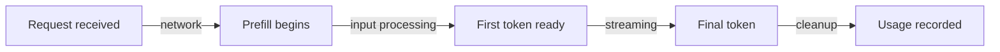

# Chapter 13 — Streaming and Token Economics

> Time-to-first-token is the latency users perceive; total-time-to-completion
> is the latency you pay for. Understanding both changes how you design.

---

## Learning Objectives

By the end of this chapter you will be able to:

- Explain why streaming reduces perceived latency without reducing actual
  latency, and quantify the difference for a given workload.
- Model time-to-first-token as a function of input size, model tier, and queue
  depth, and predict when a request will miss its SLA before sending it.
- Calculate the cost of a request given input tokens, output tokens, and model
  tier, and explain why two requests to the same endpoint can differ by 30x.
- Implement budget enforcement using reserve-then-reconcile, bounding overshoot
  to a function of concurrency rather than traffic volume.
- Decide when to use streaming versus buffered responses based on the
  trade-offs in user experience, error handling, and cost control.

---

## The Production Story

Consider a customer support platform that routes tickets to an LLM for initial
triage. The system classifies each ticket by urgency, suggests a response
draft, and extracts relevant account information. Average response time is
about 8 seconds, which the product team accepted as reasonable for background
processing.

Then the product team ships a live-chat feature. The same model, the same
prompt template, the same 8-second average response time. Users type a question
and watch a blank screen for 8 seconds before anything appears. Support tickets
climb. The NPS score for the chat feature lands 40 points below the email
feature running the same model.

The engineering team's first instinct is to switch to a faster model. They test
a mid-tier model with 3-second responses. Users still hate it. They test a
small model with 1.5-second responses. Quality drops and users hate it
differently.

The actual problem becomes visible when someone measures time-to-first-token
rather than total time. The 8-second request spends 600 milliseconds in prefill
processing input tokens, then streams output tokens over the remaining 7.4
seconds. A user watching a streaming response sees text appearing at 600
milliseconds and watches it build progressively. A user waiting for a buffered
response sees nothing until second 8.

The fix is not a faster model. The fix is enabling SSE and streaming the
response that was already being generated token by token on the provider's
side. Total latency stays at 8 seconds. Perceived latency drops to 600
milliseconds. The feature ships the following week.

---

## Why This Exists

Token-based pricing changes the economics of API workloads in ways that
request-based pricing does not. Two requests to the same endpoint can differ in
cost by two orders of magnitude based on input length, output length, and model
tier. Rate limiting by request count is nearly meaningless. Capacity planning
that counts requests misses the resource actually being consumed.

Streaming changes the user experience in ways that matter independently of
actual latency. A response that appears to be thinking — text building
progressively on screen — is psychologically different from a response that
feels stuck. The difference is not subjective: it shows up in abandonment
rates, retry behavior, and satisfaction scores.

The two concerns intersect in budget enforcement. You cannot know the cost of a
request until after you have spent it, because output length is not known until
generation completes. Naive enforcement either rejects too much (estimating
worst-case output) or overspends too much (checking only after completion). A
production system needs to reserve pessimistically, reconcile to actual, and
bound the overshoot to a number you can reason about.

---

## Core Concepts

**Time-to-first-token (TTFT).** The interval between sending a request and
receiving the first output token. Dominated by prefill — processing input
tokens to build the attention state before generation begins. A 4,000-token
input prompt has roughly 50x the TTFT of a 100-token prompt, all else equal.

**Prefill vs decode.** The two phases of inference. Prefill processes input
tokens in parallel, building the key-value cache. Decode generates output
tokens one at a time (or in small batches), using the cache to attend to prior
context. TTFT is prefill; inter-token latency is decode. They scale
differently.

**Streaming.** Sending output tokens to the client as they are generated rather
than buffering the complete response. Does not reduce total latency; does
reduce perceived latency to TTFT plus network overhead. Requires holding
connections open for seconds to minutes.

**Server-sent events (SSE).** The wire format. A long-lived HTTP connection
where the server sends text chunks prefixed with `data:` and terminated with
double newlines. Simpler than WebSockets, well-supported by browsers, but has
no framing that marks a stream as complete — you build your own terminal event
or truncation is indistinguishable from completion.

**Token economics.** Cost scales with tokens, not requests. Providers charge
per million tokens, differentiated by input vs output and by model tier. Output
tokens typically cost 3–5x more than input tokens because decode is more
expensive than prefill per-token. Model tier matters more: a frontier model can
cost 30x a small model for the same tokens.

**Reserve-then-reconcile.** Budget enforcement pattern for costs that are not
known until after spending. At admission, reserve a pessimistic estimate
(counted input tokens plus `max_tokens`). On completion, reconcile to actual
usage and release the difference. Overshoot becomes bounded by concurrent
requests times per-request maximum.

---

## Internal Architecture

A streaming response moves through three phases. Understanding the timing of
each phase is necessary for TTFT modeling, capacity planning, and error
handling.



*The four boundaries that define streaming latency. TTFT is A-to-C; total
latency is A-to-E.*

**Phase 1 — Prefill.** The inference server processes input tokens in parallel
to build the key-value cache. Time scales roughly linearly with input token
count. Larger models are slower because each layer takes longer. This phase
determines TTFT.

**Phase 2 — Decode.** The server generates output tokens one at a time, each
attending to the cache from prefill plus all prior output tokens. Time scales
linearly with output token count. Inter-token interval is roughly constant for
a given model and load — typically 20–50 milliseconds per token for mid-tier
models.

**Phase 3 — Finalization.** The server sends a terminal frame with usage
information (actual input and output token counts) and a stop reason. The
gateway records usage and closes the connection. If the client disconnects
before this phase, the gateway must estimate usage from accumulated chunks.

### SSE wire format

A typical stream looks like this:

```
data: {"type":"token","text":"The"}

data: {"type":"token","text":" answer"}

data: {"type":"token","text":" is"}

data: {"type":"usage","input":150,"output":42}

data: {"type":"done","stop":"complete"}

```

Each line starting with `data:` is an event. Blank lines separate events. There
is no built-in completion signal — the `done` event is your own convention, and
clients must be written to expect its absence if the connection drops.

### TTFT scaling

TTFT is approximately:

```
TTFT = base_latency + (input_tokens * prefill_time_per_token)
```

For a mid-tier model at moderate load:
- Base latency: ~50 ms (queue time, network, framework overhead)
- Prefill time per token: ~0.5 ms

A 100-token input has TTFT around 100 ms. A 4,000-token input has TTFT around
2,050 ms. This is why retrieval-augmented prompts — which stuff thousands of
context tokens into the input — have noticeably higher latency even when the
response is short.

Model tier shifts the multiplier. Frontier models have larger attention layers
and more total parameters, so prefill is slower. Expect roughly:
- Small: 0.5x the mid-tier TTFT
- Mid: baseline
- Frontier: 2x the mid-tier TTFT

These are approximations; actual numbers vary by provider and current load.

---

## Production Design

**Enable streaming by default for interactive workloads.** The perceived
latency improvement is too large to leave on the table. Total tokens generated,
total duration, and total cost are unchanged — you are getting the same work
done with a better user experience.

**Buffer responses for batch workloads.** Streaming adds complexity to error
handling, and the perceived latency benefit does not exist when there is no
user watching. For offline processing, document summarization, and background
classification, collect the full response before acting on it.

**Measure TTFT and total duration separately.** These metrics move
independently. A provider brownout often increases total duration while TTFT
stays constant, because the decode phase slows without affecting prefill. A
single blended latency metric hides the divergence.

**Set timeouts on both TTFT and total duration.** A stuck prefill is different
from a stuck decode. If you only timeout on total duration, a request that
never starts generating will hold a connection slot for the full timeout
window. A TTFT timeout catches this case early.

**Send heartbeat comments during long generations.** SSE allows comment lines
prefixed with `:`. Send one every 15 seconds during streaming to prevent
intermediate proxies from closing idle connections. This costs nothing — the
comment is not delivered to the application-layer parser.

**Emit an explicit terminal event.** Define a schema-level end marker carrying
stop reason and usage totals. Without this, clients cannot distinguish a
complete response from a truncated one, and the failure mode is silent data
loss.

### Metrics to collect

| Metric | Type | Purpose |
| --- | --- | --- |
| `time_to_first_token` | histogram | Perceived latency, SLA compliance |
| `total_duration` | histogram | Capacity planning (Little's Law) |
| `tokens_in` / `tokens_out` | counter | Cost attribution, budget enforcement |
| `stream_interrupted` | counter | Split by cause: client, provider, timeout |
| `budget_headroom` | gauge | Early warning before hard cap hit |

---

## Failure Scenarios

### Failure: silent stream truncation

**Symptom.** Users report answers that stop mid-sentence. No errors in logs.
Metrics show successful requests. Correlation with longer responses.

**Mechanism.** Something between the provider and the client closed the
connection due to idle timeout — a load balancer, a CDN, a corporate proxy. SSE
has no built-in completion framing, so a closed connection looks identical to a
finished stream unless you build your own termination marker.

**Detection.** Count streams that end without a terminal event. This requires
client cooperation: the client must report whether it received the end marker.
Server-side metrics alone cannot detect the problem.

**Mitigation.** Raise idle timeouts on every hop. Send heartbeat comment lines
every 15 seconds so the connection is never idle. Clients should retry if they
do not receive a terminal event within a timeout window after the last data
chunk.

**Prevention.** Design the terminal event into the schema before the first
integration. Retrofitting it requires changing every client, and the failure it
prevents is invisible until production complaints accumulate.

### Failure: budget overshoot under concurrency

**Symptom.** A tenant's spend exceeds its configured cap, sometimes by 2–5x,
despite budget enforcement being enabled and working.

**Mechanism.** Budget is checked before the request and charged after it. With
100 concurrent requests, each checking a budget with 1,000 tokens of headroom,
all 100 pass the check before any of them complete and charge usage. Total
spend can reach 100x the headroom.

**Detection.** Compare ledger totals to configured limits at the end of each
budget period. A persistent gap that scales with peak concurrency is this bug.

**Mitigation.** Reserve the pessimistic estimate at admission, not just check
it. Headroom reflects both settled usage and outstanding reservations. When a
request completes, settle to actual and release the difference.

**Prevention.** Bound overshoot to concurrency times per-request maximum. With
100 concurrent requests and 4,000 max tokens each at mid-tier pricing, worst
case is 400,000 cost units over budget, which is a number you can reason about
and decide whether to accept. If not acceptable, add per-tenant concurrency
limits.

### Failure: TTFT SLA miss on long prompts

**Symptom.** Requests with large context windows (4,000+ tokens of input)
consistently miss the 500 ms TTFT SLA even when the model is healthy and
lightly loaded.

**Mechanism.** TTFT scales with input token count. A 4,000-token input at 0.5
ms per token prefill adds 2,000 ms to TTFT before accounting for base latency.
The SLA is not achievable without a faster model or shorter input.

**Detection.** Plot TTFT against input token count. The relationship should be
linear. If you see a flat line below the SLA with occasional spikes above it,
something else is the cause. If you see a linear ramp, the cause is prefill.

**Mitigation.** Route long-context requests to a model tier that can meet the
SLA, accepting the quality trade-off. Alternatively, compress or truncate
context before sending. Neither is free.

**Prevention.** Set different SLAs for different input size buckets. A 500 ms
SLA for requests under 500 tokens, 2,000 ms for requests over 2,000 tokens.
Publish the buckets and SLAs to consumers so they know what to expect.

---

## Scaling Strategy

Things break in a predictable order. Knowing the order tells you what to
instrument first.

**First: connection pool exhaustion, around 100–500 concurrent streams.** Each
streaming request holds an HTTP connection open for the duration of the
response. Default connection pool limits in most HTTP clients are 50–100.
Requests queue invisibly, appearing as latency spikes with no server-side
correlate. Raise pool limits, export queue depth as a metric, and alert when
it exceeds zero for more than a few seconds.

**Second: load balancer idle timeout, around 30–60 seconds.** Responses longer
than the LB idle timeout are silently truncated. The symptom is streams that
end without error mid-response, correlating with response length. Raise the
idle timeout above your longest expected generation, and send heartbeat
comments.

**Third: memory pressure from concurrent streams, around 1,000–5,000.** Each
stream accumulates state: the request context, accumulated chunks for usage
estimation, and pending writes. At high concurrency the footprint is dominated
by connection count, not payload size. Scale horizontally before you hit this;
a single process does not go much further without careful tuning.

**Fourth: budget store contention, around 10,000 reserve/settle operations per
second.** A single Redis key per tenant becomes a hot key. Shard the counter,
accept slight imprecision, or move to a different consistency model.

---

## Trade-offs

| Decision | Buys you | Costs you | Choose when |
| --- | --- | --- | --- |
| Streaming responses | 5–10x reduction in perceived latency | Complex error handling, no retry after first byte | Interactive UX with user watching |
| Buffered responses | Simple error handling, full retry | Users wait for entire response | Batch processing, no watching user |
| Hard budget cap | Bounded spend, safe for untrusted tenants | Production features can stop mid-request | External tenants, abuse risk |
| Soft cap with alerts | Never the cause of an outage | Requires someone to respond to the alert | Internal tenants, trusted workloads |
| Reserve-then-reconcile | Bounded overshoot under concurrency | Slightly more rejection than necessary | Always, when enforcing budgets |
| Per-input-size SLAs | Achievable SLAs for all request types | Complexity for consumers | Workloads with variable context size |
| Smaller model for TTFT | Meeting tight SLAs | Quality reduction | Latency-critical, quality-tolerant tasks |
| Prompt caching | 40% TTFT reduction on repeated prompts | Cache misses see no benefit | Repeated system prompts, few-shot examples |

---

## Code Walkthrough

From `examples/ch13-streaming/`. The lab runs in about five seconds with no
dependencies and asserts 37 claims about streaming behavior and token
economics.

### Streaming generator with TTFT measurement

The core abstraction: an async generator that simulates the prefill/decode
phases and emits chunks with timing information.

```ts
// examples/ch13-streaming/src/streaming.ts

export async function* streamTokens(
  request: GenerationRequest,
  signal: AbortSignal,
  model: LatencyModel = DEFAULT_LATENCY_MODEL,
): AsyncGenerator<StreamChunk> {
  const startTime = performance.now();
  const inputTokens = estimateTokens(request.prompt);

  // Simulate prefill phase (processing input)
  const ttft = calculateTTFT(inputTokens, model);           // (1)
  await sleep(ttft, signal);

  if (signal.aborted) {
    yield makeEndChunk('aborted', inputTokens, 0, startTime, ttft);
    return;
  }

  const firstTokenTime = performance.now();
  const actualTtft = firstTokenTime - startTime;

  // Generate response tokens
  const responseTokens = generateResponseTokens(request.maxTokens);
  let outputTokens = 0;

  for (let i = 0; i < responseTokens.length; i++) {
    if (signal.aborted) {                                   // (2)
      yield makeEndChunk('aborted', inputTokens, outputTokens,
        startTime, actualTtft);
      return;
    }

    const interval = calculateTokenInterval(model);         // (3)
    await sleep(interval, signal);

    outputTokens++;
    yield {
      kind: 'token',
      token: { index: i, text: responseTokens[i], timestamp: performance.now() },
    };
  }

  yield makeEndChunk(stopReason, inputTokens, outputTokens, // (4)
    startTime, actualTtft);
}
```

1. TTFT is calculated from input token count, then simulated as a sleep.
   Prefill happens before any output is emitted.
2. Abort handling at every yield point. Streaming enables early termination —
   if the user cancels, stop generating and report partial usage.
3. Inter-token interval simulates decode latency. Roughly constant per token,
   unlike prefill which scales with input.
4. The terminal chunk carries stop reason and usage. Without this, clients
   cannot distinguish complete from truncated.

### Budget with reserve-then-reconcile

The pattern that bounds overshoot under concurrent requests.

```ts
// examples/ch13-streaming/src/budget.ts

reserve(
  tenant: string,
  inputTokens: number,
  maxOutputTokens: number,
  tier: ModelTier,
): { reservationId: string; allowed: boolean } {
  // Calculate pessimistic estimate                         // (1)
  const estimatedCost = calculateCost(inputTokens, maxOutputTokens, tier);
  const estimatedTokens = estimatedCost.totalCost;

  const checkResult = this.check(tenant, estimatedTokens);  // (2)
  if (!checkResult.allowed) {
    return { reservationId: '', allowed: false };
  }

  // Create reservation
  const id = `res_${++this.reservationCounter}`;
  const reservation: Reservation = {
    id,
    tenant,
    estimatedTokens,
    tier,
    timestamp: Date.now(),
    settled: false,
  };

  this.reservations.set(id, reservation);                   // (3)
  return { reservationId: id, allowed: true };
}

settle(
  reservationId: string,
  actualInputTokens: number,
  actualOutputTokens: number,
): { refund: number } {
  const reservation = this.reservations.get(reservationId);
  if (!reservation || reservation.settled) {
    return { refund: 0 };
  }

  const actualCost = calculateCost(                         // (4)
    actualInputTokens,
    actualOutputTokens,
    reservation.tier,
  );

  const currentUsage = this.usage.get(reservation.tenant) ?? 0;
  this.usage.set(reservation.tenant, currentUsage + actualCost.totalCost);

  reservation.settled = true;

  const refund = reservation.estimatedTokens - actualCost.totalCost;
  return { refund: Math.max(0, refund) };                   // (5)
}
```

1. Reserve the maximum possible cost: all input tokens plus `max_tokens` output
   at the request's tier.
2. Check includes both settled usage and outstanding reservations. Effective
   headroom accounts for in-flight work.
3. The reservation is tracked but not yet charged to settled usage. It reduces
   headroom for subsequent requests.
4. On completion, calculate actual cost from actual tokens. This is always less
   than or equal to the reservation.
5. The difference between reserved and actual is the refund. Headroom is
   restored by this amount.

---

## Hands-On Lab

**Goal:** measure the streaming latency benefit and verify budget enforcement
bounds. About five seconds, Node 22.6+, no dependencies.

```bash
cd examples/ch13-streaming
node scripts/lab.mjs
```

The lab runs fourteen steps and asserts 37 claims. The numbers below are what
to expect.

**Step 1 — TTFT vs total duration.** For a 50-token response, TTFT is under 5%
of total duration. The user sees content in under 100 ms while the full
response takes over 1 second.

**Step 2 — TTFT scales with input.** A 4,000-character input (about 1,000
tokens) has 50x the TTFT of a 10-character input. The relationship is linear
in input token count.

**Step 3 — Tier affects TTFT.** A frontier-tier request has 4x the TTFT of a
small-tier request for the same input size. Larger models have slower prefill.

**Step 4 — Token economics.** Output tokens cost 4x input tokens. A 100-token
input with 100-token output at mid tier costs 3,000 cost units (600 input + 2400
output). The same request at frontier tier costs 15,000 cost units — a 30x
multiplier over small tier.

**Step 5 — Cost variance.** The same task can cost 30x more depending on model
tier alone. Add variation in output length and the variance reaches 100x.

**Step 6 — Hard budget enforcement.** With a 100,000 cost-unit daily limit,
requests are rejected once the limit is reached. Headroom never goes negative
because reservations are checked before acceptance.

**Step 7 — Soft budget with alerts.** A soft cap accepts requests but sets an
over-budget flag. Use this for internal tenants where stopping production is
worse than an unexpected invoice.

**Step 8 — Reserve-then-reconcile.** A request reserving 60,000 cost units but
settling for 15,000 releases the 45,000-unit difference back to headroom. Actual
spend is tracked accurately even when estimates are pessimistic.

**Step 9 — Early termination savings.** Stopping a stream at 30% completion
saves 70% of output token cost. Streaming enables this; buffered responses do
not.

**Step 10 — Concurrent overshoot bounds.** With 20 concurrent requests each
reserving 30,000 cost units, maximum reserved is 600,000. This is the bound.
Actual settled usage is lower because reservations are pessimistic.

---

## Interview Questions

1. Why does enabling streaming reduce perceived latency without reducing actual
   latency?
2. A 4,000-token input has 2-second TTFT; the same model with 100-token input
   has 100 ms TTFT. What is happening, and can you make the long prompt faster?
3. Two requests to the same model endpoint differ in cost by 30x. What factors
   explain the difference?
4. How do you enforce a spend cap when you do not know the cost until after you
   have spent it?
5. A streaming response stops mid-sentence, and there are no errors anywhere.
   What is the cause and how do you prevent it?
6. When should you use buffered responses instead of streaming?
7. How do you size capacity for a streaming workload where each request holds a
   connection open for 20 seconds?

## Staff-Level Answers

**Q1 — streaming vs perceived latency.** A streaming response sends the first
token as soon as prefill completes, then sends subsequent tokens as they are
generated. A buffered response waits for all tokens before sending anything.
Total generation time is identical — the model does the same work either way.
Perceived latency is TTFT for streaming (hundreds of milliseconds) versus total
duration for buffered (seconds to tens of seconds). The factor of 5–10x in
perceived latency maps directly to user satisfaction metrics.

The staff addition: this breaks retries. Once you have sent the first token,
you cannot transparently retry against another provider, because the user has
already rendered partial text. A retry produces a different continuation.
Streaming and automatic failover are in tension. Choose per workload:
interactive chat takes streaming and gives up post-first-byte failover; batch
summarization buffers and gets full retry semantics.

**Q2 — TTFT scaling with input.** TTFT is dominated by prefill, which processes
input tokens in parallel to build the key-value cache. Time scales roughly
linearly with input count. A 4,000-token input has 40x the prefill time of a
100-token input.

Making the long prompt faster has three options. First, use a smaller model:
prefill is faster per token, though output quality may suffer. Second, use
prompt caching: if the same prefix is repeated, the provider may skip
re-computing its cache. Third, truncate or compress the context: fewer input
tokens means less prefill. None are free, and the staff answer names the
trade-off: smaller models lose capability, caching only helps repeated prompts,
and compression loses information.

**Q4 — budget enforcement without knowing cost.** Reserve pessimistically,
reconcile actually. At admission, count input tokens and add `max_tokens` for
the ceiling; deduct that reservation from the tenant's headroom. On completion,
replace the reservation with actual usage from the provider's trailing usage
frame.

The bound this provides is: worst-case overshoot equals in-flight concurrency
times per-request maximum. With 100 concurrent requests each reserving 4,000
cost units, worst case is 400,000 units over budget. That number is visible and
controllable — you can add per-tenant concurrency limits if it is too high.

Then push back on the premise. For internal tenants, a hard cap is usually
wrong. Stopping a production feature mid-incident to save a few hundred dollars
is a worse outcome than the overspend. Soft caps with escalating alerts; hard
caps only for external tenants where the exposure is unbounded abuse.

**Q6 — when to buffer.** Buffer when there is no user watching. Batch
processing, offline summarization, background classification — these have no
perceived latency because nobody is staring at a blank screen. Buffering
simplifies error handling because you can retry the entire request on failure,
and it simplifies downstream processing because you have the complete response
before acting on it.

Streaming for interactive UX. Buffering for everything else.

---

## Exercises

1. **TTFT math.** A mid-tier model has 50 ms base latency and 0.5 ms per input
   token prefill. Calculate expected TTFT for inputs of 100, 1,000, and 5,000
   tokens. What input size exceeds a 1-second SLA?
2. **Cost model.** Build a spreadsheet that calculates monthly cost given
   requests per day, average input tokens, average output tokens, and model
   tier. What happens to the ratio of input cost to output cost as response
   length grows?
3. **Reservation sizing.** You have 100 concurrent requests, each with 2,000
   input tokens and max 4,000 output tokens, at mid tier. What is the maximum
   possible reservation total? What per-tenant concurrency limit bounds
   worst-case overshoot to 100,000 cost units?
4. **Terminal event design.** Design a terminal event schema for a streaming
   API that carries stop reason, usage totals, and enough information for the
   client to detect truncation. Then implement client code that treats a missing
   terminal event as an error.
5. **Heartbeat implementation.** Add heartbeat comments to a streaming HTTP
   handler that sends `: keepalive` every 15 seconds during an active stream.
   Test it by setting an artificially low idle timeout on a reverse proxy.

---

## Further Reading

- **Anthropic, OpenAI, and Google API documentation on streaming** — read the
  wire format specification for each. The differences in how they encode
  events, report usage, and signal completion motivate the canonical schema
  design in Chapter 18.
- **The SSE section of the WHATWG HTML specification** — short and precise. It
  makes clear that the protocol has no completion semantics, which is why you
  must build your own terminal event.
- **Little's Law** — the capacity model for streaming workloads. Concurrency
  equals arrival rate times duration. A 20-second average stream duration at 50
  requests per second means 1,000 concurrent connections, regardless of how fast
  each individual request is.
- **Anil Dash, "The Cloud's Dirty Secret"** (not about AI, but about cost
  modeling) — the argument for understanding unit economics before scaling.
  Token economics is the AI version of the same discipline.
- **The Vercel AI SDK documentation on streaming** — one implementation of
  server-sent events for LLM responses. Worth reading as a concrete example,
  even if you do not use the library.
