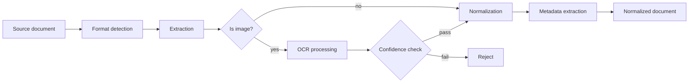

# Chapter 14 — Document Ingestion and OCR

> Every retrieval failure you will ever debug begins at ingestion. If the text
> is wrong, corrupted, or missing metadata, no amount of embedding quality or
> ranking sophistication will save you.

---

## Learning Objectives

By the end of this chapter you will be able to:

- Design a document ingestion pipeline that handles multiple formats without
  format-specific code paths in downstream stages.
- Explain why OCR confidence matters and how to set acceptance thresholds that
  balance coverage against quality.
- Preserve metadata through the pipeline and explain why source traceability
  prevents debugging nightmares.
- Implement normalization that produces consistent output without silently
  dropping content.
- Detect and handle extraction failures before they propagate to the retrieval
  index.
- Measure content retention and set assertions that catch extraction bugs
  before they reach production.

---

## The Production Story

Consider an insurance company building a claims processing assistant. The
assistant needs to answer questions about policies, which exist as PDFs
scanned from paper originals, HTML exports from the policy management system,
and plaintext files from legacy mainframe reports. The team builds an
ingestion pipeline that calls three different extraction libraries — one for
each format — and concatenates the output into a search index.

For the first month, everything works. Queries about recent policies return
correct results. The team celebrates shipping ahead of schedule.

In month two, a claims adjuster asks: "What is the deductible for policy
47823?" The assistant returns nothing. The adjuster opens the policy PDF
manually, searches for "deductible," and finds it immediately: "$2,500
deductible per occurrence."

The engineering team investigates. The PDF was scanned from a physical
document in 2019. The OCR library extracted the text, but the page containing
the deductible had a coffee stain in the corner. The OCR confidence for that
page was 0.47 — well below the threshold where the extraction is reliable. The
library returned partial text, missing the deductible entirely. The pipeline
had no confidence check. It indexed what it received.

The team adds a confidence threshold: reject pages below 0.70. The next day,
40% of the legacy policies disappear from the index. Each had at least one
low-confidence page, and the pipeline now rejected entire documents when any
page failed.

They adjust: accept documents but flag low-confidence pages. A week later, a
different adjuster asks about coverage limits. The assistant returns a
confidently-wrong answer — it found a different policy with similar wording
but a different limit. The returned document has no source information. The
adjuster cannot tell which policy the answer came from, cannot verify whether
the correct policy was even indexed, and cannot determine whether the problem
is retrieval, ingestion, or the original scan.

The debugging session that follows takes six hours. Three engineers trace the
query through the retrieval layer, through the embedding service, back to the
ingestion pipeline, and finally to the OCR output. The problem: the pipeline
did not preserve page numbers, so even after finding the correct document in
the index, they cannot identify which page of the 47-page PDF contained the
text that was or was not extracted.

---

## Why This Exists

Document ingestion is invisible when it works and catastrophic when it fails.
The failure modes are silent: a dropped paragraph does not throw an error, a
mangled table produces valid text, a missing page leaves no trace. The first
symptom is a retrieval miss, weeks or months after ingestion, when nobody
remembers what the original document looked like.

Before dedicated ingestion pipelines, teams handled each format separately.
The PDF path called `pdftotext`. The HTML path called `beautifulsoup`. The
image path called Tesseract. Each path produced slightly different output
structures. Downstream code had format-specific branches. Every new format
required changes in multiple places.

The problems were predictable:

1. **Inconsistent normalization.** The PDF extractor preserved soft hyphens;
   the HTML extractor converted them to regular hyphens. Search for "self-
   service" and miss "self­service" (with a soft hyphen).

2. **Lost metadata.** PDFs have page numbers. HTML has section IDs. Plaintext
   has neither. After extraction, all three looked the same, and nobody could
   answer "where in the document did this text appear?"

3. **Silent failures.** OCR errors looked like valid text. A 0 misread as O,
   an l misread as 1. The pipeline accepted everything. The index contained
   garbage that nobody noticed until a user complained.

4. **No observability.** How many documents were ingested? How long did
   extraction take? What fraction were images requiring OCR? Nobody knew,
   because nobody instrumented the path.

A proper ingestion pipeline solves these by establishing a contract: whatever
goes in, the same shape comes out. Extraction is format-specific, but
normalization produces a canonical representation. Metadata is preserved and
enriched. Failures are detected and surfaced. The downstream retrieval stage
sees consistent input regardless of original format.

---

## Core Concepts

**Extraction.** The process of converting a document from its native format
into raw text. PDF extraction parses the internal structure to find text
streams. HTML extraction strips tags and decodes entities. Image extraction
runs OCR. Each format has its own extraction path, but all paths produce the
same output structure: a list of pages, each with text and confidence.

**OCR (Optical Character Recognition).** The conversion of images containing
text into machine-readable characters. OCR output includes confidence scores
at the character, word, or page level. A confidence of 0.95 means the OCR
engine is highly certain; a confidence of 0.60 means the output is likely
wrong. Production systems must decide what to do with low-confidence output:
reject it, accept it with warnings, or accept it and flag for human review.

**Confidence.** A measure of extraction quality. High confidence (>0.90)
indicates reliable output. Medium confidence (0.70-0.90) indicates output that
is probably correct but may contain errors. Low confidence (<0.70) indicates
output that should not be trusted for critical applications. Confidence is not
binary — the threshold depends on the use case.

**Bounding boxes.** Spatial coordinates identifying where text appears on a
page. Useful for table extraction, document layout analysis, and correlating
text back to visual elements. OCR engines produce bounding boxes; native PDF
extraction usually does not.

**Metadata.** Information about the document beyond its text content: title,
author, creation date, source path, page count, extraction timestamp. Metadata
enables traceability — given a chunk in the index, you can identify which
document it came from, which page, and when it was ingested.

**Normalization.** The conversion of extracted text into a consistent format.
Unicode normalization (NFC), whitespace collapsing, control character removal,
entity decoding. The goal: two documents with the same logical content produce
the same normalized output, regardless of their original format.

**Sections.** Structural divisions within a document: chapters, headings,
subsections. Section detection identifies these boundaries in the extracted
text. Preserving sections enables smarter chunking — breaking on section
boundaries rather than arbitrary character counts.

---

## Internal Architecture

The ingestion pipeline has four stages. Each stage can fail independently, and
each stage produces output that the next stage validates.



*The pipeline splits on format: images go through OCR; other formats go
directly to normalization. Confidence checks gate low-quality OCR output.*

**Stage 1: Format detection.** Identify what kind of document we have. Check
file extension first (fast), then content signatures (reliable). A `.pdf`
extension plus `%PDF-` header means PDF. A `.html` extension plus `<!DOCTYPE`
means HTML. An image extension plus binary content means OCR is needed.

**Stage 2: Extraction.** Convert the native format to raw text. PDF extraction
walks the internal structure to find text streams, handling multi-page
documents and preserving page boundaries. HTML extraction strips tags,
converts block elements to newlines, decodes entities. Plaintext extraction is
trivial — the text is already text.

**Stage 3: OCR (conditional).** If the document is an image, run OCR. This is
the expensive step: OCR is CPU-intensive and slow. The output includes
per-word bounding boxes and confidence scores. If confidence is below the
configured threshold, reject the document or flag it for review.

**Stage 4: Normalization.** Convert extracted text to a canonical form.
Normalize Unicode to NFC. Collapse whitespace. Remove control characters. Fix
common extraction artifacts (hyphenation at page breaks, missing spaces after
periods). Detect and remove repeating headers/footers from multi-page
documents.

**Stage 5: Metadata enrichment.** Extract or infer metadata from the content.
Detect the title from the first heading. Detect the author from attribution
patterns. Detect the language from word frequency. Detect sections from
heading patterns. Merge detected metadata with explicit metadata provided at
ingestion time.

The output of the pipeline is a `NormalizedDocument`: a single object
containing the cleaned text, section boundaries, metadata, and source
traceability.

---

## Production Design

**Separate extraction from indexing.** The ingestion pipeline produces
normalized documents; a separate pipeline chunks and indexes them. This
separation lets you re-run ingestion without re-indexing, re-index without
re-extracting, and debug each stage independently.

**Set a document size limit.** A 500MB PDF will OOM your extraction process.
Set a limit (10MB is reasonable) and reject documents that exceed it. The
rejection should be early — before spending CPU on extraction — and should
produce a clear error that operators can act on.

**Make OCR optional and configurable.** Not every deployment needs OCR. If all
your documents are native PDFs and HTML, skip the OCR dependency entirely. If
you do need OCR, make the confidence threshold configurable per deployment.
Scanned contracts need higher thresholds than internal memos.

**Preserve page numbers.** When the downstream retrieval stage returns a chunk,
the user needs to know where to look in the original document. "Page 47 of
policy 12345" is actionable. "Somewhere in policy 12345" is not. Page numbers
survive extraction, normalization, and chunking only if you preserve them
explicitly.

**Emit these metrics:**

| Metric | Type | Why it matters |
| --- | --- | --- |
| `ingestion_total` | counter | Track throughput |
| `ingestion_failed` | counter | Track reliability |
| `extraction_duration_ms` | histogram | Find slow documents |
| `ocr_confidence` | histogram | Understand OCR quality |
| `document_size_bytes` | histogram | Understand input distribution |
| `word_count` | histogram | Understand output distribution |

**Validate before indexing.** After normalization, validate that the document
has content. A zero-word document should fail. A document where normalization
dropped more than 10% of the words should warn. These validations catch bugs
in the extraction and normalization code before they pollute the index.

**Keep the raw extraction output.** Store the pre-normalization text alongside
the normalized text. When debugging an ingestion problem six months later, you
will want to know whether the bug was in extraction or normalization. Without
the intermediate state, you have to re-extract the original document — and
the extraction library may have changed.

---

## Failure Scenarios

### Failure: OCR silently produces garbage

**Symptom.** Retrieval returns a document that contains the query terms, but
the surrounding text is nonsense. The user opens the original document and
finds that the actual text is completely different.

**Mechanism.** The original document was a low-quality scan. The OCR engine
did its best, but the output is mostly wrong. Character confidence was low,
but the pipeline accepted the output anyway because it had no confidence
threshold.

**Detection.** Monitor the `ocr_confidence` histogram. A bimodal distribution
— high confidence for good scans, low confidence for bad ones — indicates the
problem exists. A spike in low-confidence extractions indicates a batch of bad
source documents.

**Mitigation.** Re-ingest the affected documents with manual transcription or
higher-quality scans. This is expensive — there is no automated fix for bad
source documents.

**Prevention.** Set a confidence threshold at ingestion time. Documents below
the threshold are rejected with a clear error, flagged for human review, or
indexed with a quality warning that the retrieval layer can use to downrank
them.

### Failure: extraction drops content from tables

**Symptom.** A query about a specific value returns no results. The value
exists in the original document, in a table. The indexed text contains the
table headers but not the cell values.

**Mechanism.** The extraction library does not handle tables well. It extracts
text in reading order, but tables have two-dimensional structure that reading
order destroys. The cell values ended up interleaved in a way that made them
unsearchable.

**Detection.** Compare word counts between original documents (if available)
and extracted text. A systematic shortfall — extracted text is consistently
30% shorter than expected — indicates missing content.

**Mitigation.** Re-extract with a table-aware extraction library. For PDFs,
tools like Camelot or Tabula handle tables better than generic text
extraction.

**Prevention.** Test extraction on representative documents before deploying.
Include documents with tables, multi-column layouts, and headers/footers.
Verify that the extracted text contains the expected content.

### Failure: metadata loss breaks traceability

**Symptom.** A user reports that a retrieval result is incorrect. The
debugging engineer asks: "Which document did this come from?" The answer is:
"We don't know."

**Mechanism.** The ingestion pipeline extracted text but did not preserve
source metadata. The chunks in the index have no document ID, no page number,
no timestamp. There is no way to trace them back to the original source.

**Detection.** Audit a sample of indexed chunks. Can you identify the source
document for each? If not, metadata is being lost somewhere in the pipeline.

**Mitigation.** This is a re-ingestion problem. You must re-ingest all
documents with proper metadata preservation. There is no way to retroactively
add metadata to chunks that lack it.

**Prevention.** Make source metadata a required field at every stage of the
pipeline. Reject documents that cannot be traced. Test the full flow from
ingestion to retrieval and verify that the source document can be identified.

### Failure: normalization drops significant content

**Symptom.** A document that should match a query does not. Investigation
reveals that the query terms existed in the raw extraction but were removed
during normalization.

**Mechanism.** The normalization step removed content it should not have. A
common cause: aggressive header/footer removal that identified actual content
as a repeating header. Another common cause: whitespace normalization that
collapsed significant separators.

**Detection.** The content retention assertion: compare word counts before and
after normalization. A drop greater than 10% is a warning. A drop greater than
20% is likely a bug.

**Mitigation.** Re-ingest with the normalization bug fixed.

**Prevention.** The content retention assertion, run on every ingestion, not
just in tests. If normalization drops too much content, fail the ingestion
and log the document for investigation.

---

## Scaling Strategy

**First: extraction CPU, around 100 documents per minute per core.** PDF
extraction is CPU-bound. Parallelize across cores, not by running multiple
extractors on the same document (which does not help), but by processing
multiple documents concurrently. A queue of pending documents, workers pulling
from the queue, each worker handling one document at a time.

**Second: OCR throughput, around 10 pages per minute per core.** OCR is much
slower than native extraction. A 50-page scanned document takes 5 minutes of
CPU time. If OCR is a significant fraction of your documents, dedicated OCR
workers with more cores (or GPU acceleration if using a model-based OCR) will
be necessary.

**Third: memory for large documents.** A 100-page PDF with embedded images can
expand to gigabytes in memory during extraction. Set memory limits per worker,
and restart workers that exceed them. Better: process pages incrementally
rather than loading the entire document at once.

**Fourth: storage for intermediate results.** If you keep raw extraction
output (you should), storage grows proportionally to document volume. Budget
for this. Compress intermediate results — they are text-heavy and compress
well.

---

## Trade-offs

| Decision | Buys you | Costs you | Choose when |
| --- | --- | --- | --- |
| High OCR confidence threshold | Clean index, fewer errors | Lower coverage, more rejections | Legal, medical, financial |
| Low OCR confidence threshold | Higher coverage | More errors in index | Internal search, low stakes |
| Preserve page numbers | Full traceability | Larger metadata | User-facing applications |
| Strip page numbers | Simpler schema | Lost traceability | Internal tools only |
| Detect sections | Better chunking | More complex extraction | Long, structured documents |
| Ignore sections | Simpler pipeline | Worse chunk boundaries | Short, flat documents |
| Keep raw extraction | Debuggability | 2x storage | Production systems |
| Discard raw extraction | Lower storage | Harder debugging | Development, prototypes |
| Synchronous ingestion | Simpler architecture | Slow API responses | Low volume |
| Async queue-based ingestion | Fast API, scalable | More moving parts | High volume |

---

## Code Walkthrough

From `examples/ch14-document-ingestion/`. The pipeline demonstrates format
detection, extraction, OCR, and normalization.

### Format detection

Identify what we are dealing with before we try to extract.

```ts
// examples/ch14-document-ingestion/src/extractor.ts

export function detectFormat(
  content: string,
  filename: string,
): DocumentFormat {
  const lower = filename.toLowerCase();

  if (lower.endsWith('.pdf')) return 'pdf';                    // (1)
  if (lower.endsWith('.html') || lower.endsWith('.htm'))
    return 'html';
  if (lower.endsWith('.png') || lower.endsWith('.jpg') ||
      lower.endsWith('.jpeg') || lower.endsWith('.tiff'))
    return 'image';

  // Check content signatures
  if (content.startsWith('%PDF')) return 'pdf';                // (2)
  if (content.includes('<!DOCTYPE html') ||
      content.includes('<html>'))
    return 'html';

  return 'plaintext';                                          // (3)
}
```

1. Extension check is fast — do it first.
2. Content signature check is reliable — do it when extension is ambiguous.
3. Default to plaintext. Everything can be treated as text in the worst case.

### OCR with confidence tracking

OCR produces text, but also tells you how confident it is.

```ts
// examples/ch14-document-ingestion/src/ocr.ts

export function processOcr(
  imageContent: string,
  quality: 'high' | 'medium' | 'low' = 'medium',
): ExtractedPage {
  // ... extraction logic ...

  const avgConfidence = boundingBoxes.length > 0
    ? boundingBoxes.reduce((sum, b) => sum + b.confidence, 0) /
      boundingBoxes.length
    : 0;

  const confidenceLevel: ExtractionConfidence =             // (1)
    avgConfidence >= 0.9 ? 'high' :
    avgConfidence >= 0.7 ? 'medium' : 'low';

  return {
    pageNumber: 1,
    text: ocrText,
    confidence: confidenceLevel,                            // (2)
    wordCount,
    boundingBoxes,                                          // (3)
  };
}
```

1. Convert numeric confidence to categorical level for easier downstream
   handling.
2. Confidence travels with the page, not just logged.
3. Bounding boxes preserved for applications that need spatial information.

### Normalization

Convert extracted text to a consistent format, regardless of source.

```ts
// examples/ch14-document-ingestion/src/normalizer.ts

export function normalizeWhitespace(
  text: string,
  preserve: boolean,
): string {
  if (preserve) return text;

  let normalized = text;

  normalized = normalized.replace(/\r\n/g, '\n');           // (1)
  normalized = normalized.replace(/\r/g, '\n');

  normalized = normalized.replace(/[ \t]+/g, ' ');          // (2)

  normalized = normalized
    .split('\n')
    .map((line) => line.trim())
    .join('\n');

  normalized = normalized.replace(/\n{3,}/g, '\n\n');       // (3)

  return normalized.trim();
}
```

1. Normalize line endings — Windows and Unix should produce the same output.
2. Collapse multiple spaces — extraction often produces extra whitespace.
3. Limit consecutive newlines — preserve paragraph breaks but not excessive
   spacing.

### Pipeline orchestration

Coordinate the stages and validate each output.

```ts
// examples/ch14-document-ingestion/src/pipeline.ts

export class IngestionPipeline {
  config: PipelineConfig;

  constructor(config: Partial<PipelineConfig> = {}) {
    this.config = { ...DEFAULT_CONFIG, ...config };
  }

  ingest(
    content: string,
    filename: string,
    sourceId?: string,
  ): IngestionResult {
    // Check size limit first
    if (stats.inputBytes > this.config.maxSizeBytes) {      // (1)
      return {
        success: false,
        error: `Document exceeds size limit`,
        // ...
      };
    }

    // Step 1: Extract
    const extraction = extractText(content, filename, sourceId);

    // Step 2: Validate extraction
    const errors = validateExtraction(extraction);           // (2)
    if (errors.some(e => e.includes('Unknown extraction error'))) {
      return { success: false, error: errors.join('; ') /* ... */ };
    }

    // Step 3: OCR if needed
    if (format === 'image') {
      const ocrPage = processOcr(content, 'medium');
      if (!isOcrUsable(ocrPage, this.config.minConfidence)) { // (3)
        return {
          success: false,
          error: `OCR confidence too low`,
          // ...
        };
      }
      // ... use OCR output
    }

    // Step 4: Normalize
    const normalized = normalizeDocument(extraction, this.config);

    // Step 5: Validate normalized output
    const normalizeErrors = validateNormalized(normalized);  // (4)
    if (normalizeErrors.length > 0) {
      return { success: false, error: normalizeErrors.join('; ') /* ... */ };
    }

    return { success: true, normalized /* ... */ };
  }
}
```

1. Fail fast on size — do not spend CPU extracting a document we will reject.
2. Validate extraction output before proceeding. Catch errors early.
3. Gate OCR output on confidence. Low confidence is a failure, not a warning.
4. Validate normalization output. Zero-content documents should not pass.

---

## Hands-On Lab

**Goal:** extract text from multiple formats, observe OCR confidence, and
verify that normalization preserves content. About 2 minutes, Node 22.6+, no
dependencies.

```bash
cd examples/ch14-document-ingestion
node scripts/lab.mjs
```

The lab runs thirteen steps and asserts forty-three claims. The test documents
are synthetic but representative: a markdown report, an HTML page, a simulated
PDF, and a simulated image.

**Step 1 — format detection.**

The first four assertions verify that format detection works:

```
Step 1 - format detection
  [PASS] detects plaintext format
         expected plaintext, observed plaintext
  [PASS] detects HTML format by extension
         expected html, observed html
  [PASS] detects PDF format by content
         expected pdf, observed pdf
  [PASS] detects image format
         expected image, observed image
```

**Step 2 — text extraction.**

Extraction from different formats produces usable output:

```
Step 2 - text extraction
  [PASS] plaintext extraction succeeds
         expected true, observed true
  [PASS] plaintext has high confidence
         expected high, observed high
  [PASS] HTML extraction removes script tags
         expected false (script content stripped), observed false
  [PASS] PDF extraction handles multiple pages
         expected >= 2 pages, observed 3
```

Note that HTML extraction strips script tags — executable content should not
end up in the search index.

**Step 3 — OCR processing.**

The simulated OCR produces text, bounding boxes, and confidence:

```
Step 3 - OCR processing
  [PASS] OCR extracts text from image
         expected true, observed true
  [PASS] OCR produces bounding boxes
         expected true, observed true
  [PASS] low quality OCR has higher error rate
         expected true, observed true
```

The final assertion verifies that simulated low-quality OCR produces more
errors than high-quality OCR — the confidence levels mean something.

**Step 13 — the content retention assertion.**

This is the assertion that catches silent content loss:

```
Step 13 - content preservation assertion
  [PASS] content retention >= 90%
         expected >= 0.9, observed 1
  [PASS] no content added during normalization
         expected true, observed true
```

Normalization should not drop significant content. If this assertion fails,
the normalization code has a bug.

---

## Interview Questions

1. Why is format detection necessary if the file extension is available?

2. A scanned document produces OCR output with 0.55 average confidence. What
   are your options, and how do you decide between them?

3. How do you handle a multi-page PDF where some pages have high-confidence
   extraction and others have low confidence?

4. Your ingestion pipeline processes 10,000 documents. How do you verify that
   the indexed content matches the source documents?

5. An HTML document contains a table with important data. After extraction,
   the table data is garbled. What went wrong and how do you fix it?

6. Why should normalization be deterministic, and how do you test that it is?

7. The extraction library for PDFs changes behavior between versions. How do
   you detect this before it reaches production?

8. A document in the index returns wrong results for searches. How do you
   trace the problem back to ingestion?

---

## Staff-Level Answers

**Q2 — low OCR confidence options.** The senior answer lists the options:
reject the document, accept with a warning, or send for human review. That is
correct but incomplete.

The staff answer starts with the business context. What is this document used
for? A scanned receipt for expense reporting can tolerate errors — the human
reviewer will see the original image. A scanned contract for compliance search
cannot — returning a wrong clause is worse than returning nothing.

Then the technical factors. Is the confidence uniformly low (bad scan) or
variable (some pages good, some bad)? Uniform low confidence suggests the
source quality is the problem. Variable confidence suggests specific pages
need attention. Can we request a better scan? That is often cheaper than
improving OCR quality.

The decision tree: if the stakes are high (legal, medical, financial), reject
and request a better source. If the stakes are medium, accept but flag for
human review before the content is trusted. If the stakes are low, accept with
a quality warning that the retrieval layer can use to downrank.

Then the meta-question: who owns the quality decision? The ingestion pipeline
should not make business decisions. It should surface quality information that
other systems use to make decisions. The pipeline says "this document has 0.55
confidence." The retrieval layer says "documents below 0.70 get a -10 ranking
penalty." The user-facing application says "results from low-quality documents
are marked with a warning."

**Q4 — verifying 10,000 documents.** You cannot manually verify 10,000
documents. You need automated verification at multiple levels.

Level 1: structural validation. Every indexed document has a source path, a
page count, a word count. Spot-check that these match the originals for a
sample.

Level 2: content sampling. For a random sample (1-5%), compare the first 500
characters of indexed text against the original. Automated comparison, human
review of mismatches.

Level 3: aggregate statistics. Total word count across all documents. Total
page count. Average extraction time. Compare these against expected values
from a known-good baseline. A 20% drop in total word count indicates a
systematic problem.

Level 4: retrieval testing. Run a test suite of queries with known-correct
results. If the queries fail after re-ingestion, something broke.

The staff addition: verification is not a one-time task. Run it continuously.
Every batch of new documents goes through the same validation. The aggregate
metrics are monitored. Drift from baseline triggers an alert.

**Q6 — normalization determinism.** Normalization should be deterministic:
the same input produces the same output, every time. Non-determinism in
normalization produces non-determinism in chunking and embedding, which
produces non-determinism in retrieval.

Testing determinism: run normalization twice on the same input, assert
equality. Run normalization on a corpus, store hashes, re-run a week later,
compare hashes. Any difference is a bug.

Common causes of non-determinism: timestamp injection (the normalization
includes "processed at"), random ID generation, dependency on undefined
iteration order (object keys in some languages), floating-point operations
that vary by CPU.

The staff addition: determinism also matters for debugging. If you cannot
reproduce the output from a given input, you cannot debug extraction problems.
Store the normalization parameters (configuration, library versions) alongside
the output so you can reproduce the exact processing later.

**Q8 — tracing ingestion problems.** Start from the indexed chunk. Does it
have a document ID? If not, metadata preservation is broken — fix that first.

With the document ID, find the source document. Compare the indexed chunk text
against the raw extraction output. If they differ, the bug is in normalization
or chunking. If they match, the bug is in extraction.

With raw extraction output, compare against the original document. If they
differ, the bug is in extraction. Identify which format-specific extractor was
used. Test that extractor on the original document.

The staff addition: this trace should be scriptable. Given a chunk ID, produce
a report showing: the chunk text, the raw extraction for that document, the
original document location, and a diff between extracted and expected.
Building this traceability into the system — not as an afterthought but as a
design requirement — is what separates production systems from prototypes.

---

## Exercises

1. **Format coverage.** Add support for a new format to the extraction layer:
   Markdown files with embedded code blocks. The code blocks should be
   extracted as-is, not normalized. Test with a document containing Python
   code with significant whitespace.

2. **OCR quality gates.** Implement a two-threshold system: documents between
   0.60 and 0.80 confidence are accepted with a `review_needed` flag.
   Documents below 0.60 are rejected. Add metrics to track how many documents
   fall into each bucket.

3. **Content retention monitoring.** Add a pre-ingestion word count and
   post-normalization word count to every ingestion result. Emit the ratio as
   a metric. Set an alert for when the average ratio drops below 0.90.

4. **Parallel extraction.** Modify the pipeline to extract pages from a
   multi-page PDF in parallel. Verify that the output is identical to
   sequential extraction (determinism check).

5. **Design question.** A customer wants to ingest email threads as documents.
   Emails have headers, quoted replies, and attachments. Write the one-page
   design doc for email ingestion, covering: what counts as "the document,"
   how to handle threads, whether attachments are separate documents, and what
   metadata to preserve.

---

## Further Reading

- **Apache Tika documentation** — the most comprehensive open-source
  extraction library. Handles hundreds of formats with a consistent API. The
  documentation explains extraction challenges that are not obvious until you
  encounter them: password-protected documents, embedded objects, corrupted
  files.

- **Tesseract OCR documentation** — the standard open-source OCR engine.
  The documentation explains confidence scoring, language models, and
  preprocessing steps that improve accuracy. Essential reading before
  deploying OCR in production.

- **PDF specification (ISO 32000)** — not something you read cover to cover,
  but useful for understanding why PDF extraction is hard. Text in a PDF is
  not stored as a string — it is stored as instructions for placing glyphs at
  specific positions. The extraction library must reconstruct text from these
  instructions, which is why extraction quality varies.

- **Unicode normalization forms (UAX #15)** — the standard that explains NFC,
  NFD, NFKC, and NFKD. Most ingestion pipelines should use NFC. Understanding
  why requires understanding the standard.

- **Chapter 15: Chunking Strategies** — the next chapter in this book. Good
  ingestion is necessary for good chunking. The section boundaries extracted
  here enable smarter chunking strategies there.

- **Your extraction library's changelog** — not generic reading, but essential
  before any upgrade. Extraction libraries change behavior between versions.
  A new version of `pdftotext` might produce different output for the same
  input. Track these changes and test against your corpus before upgrading.
