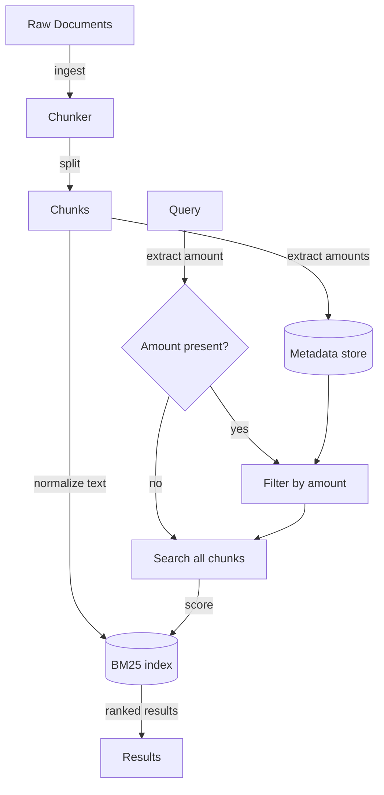

# Chapter 15 — Chunking Strategies

> Text chunking feels like plumbing, but a bad chunking strategy corrupts every
> downstream decision — and the corruption is invisible until a user asks exactly
> the wrong question.

---

## Learning Objectives

By the end of this chapter you will be able to:

- Explain why chunking decisions affect retrieval precision and recall, and
  identify which downstream components inherit chunking errors.
- Distinguish between treating query terms as search hints versus hard
  constraints, and choose the right strategy for numeric values.
- Diagnose a prefix collision bug in canonicalized money tokens and explain why
  substring matching on such tokens fails.
- Implement an amount-based filter that runs before BM25 scoring to eliminate
  false positives on numeric queries.
- Design a chunking strategy that preserves semantic coherence while staying
  within embedding model context limits.
- Measure recall and precision on a controlled corpus and use those measurements
  to validate chunking changes before deployment.

---

## The Production Story

Consider a regional insurance company building a policy document search system.
The product requirement seemed simple: agents should be able to ask questions
like "What coverage does the $300,000 umbrella policy provide?" and get the
right policy section back.

The team chunked 12,000 policy documents at 500-character boundaries with
50-character overlap. They ran BM25 keyword search over the chunks, and early
testing looked promising. Then they noticed a pattern in support tickets: about
8% of queries mentioned specific dollar amounts, and those queries failed at
three times the rate of text-only queries.

The obvious fix was canonicalization. Convert every money format — `$300,000`,
`$300K`, `$0.3M` — to a single token like `money:30000000`. Now the query would
match regardless of how the document wrote the number.

They deployed the change. Recall on the $300K test queries did not move. It
stayed at 0.50 where it had been, returning two of four relevant documents.
Worse, precision dropped from 0.60 to 0.40. They were now returning more wrong
documents than before.

The team spent two weeks looking in the wrong places: embedding quality, chunk
boundaries, BM25 tuning. None of it helped. The measurement they eventually ran
was this: query for $300,000, look at what came back, and look at what the
canonical tokens actually were.

The $3,000,000 policy — ten times the amount asked for — was ranking second.
Its canonical token was `money:300000000`. That token contains `money:30000000`
as a substring. BM25 does not require exact matches; it scores terms that
appear anywhere in the document. A document with `money:300000000` gets partial
credit for a query containing `money:30000000`, because the query term is
literally inside the document term.

The insight that fixed it: a stated amount is a constraint, not a hint. When
someone asks about the $300,000 policy, they do not mean "policies with amounts
vaguely resembling $300,000." They mean policies containing exactly $300,000.
That is a filter, not a search term. Extract the amount from the query, filter
the corpus to chunks containing that exact amount, then run BM25 on the filtered
set.

Recall went from 0.50 to 1.00. Precision went from 0.40 to 1.00. The fix was
not better chunking or better canonicalization — it was recognizing that some
query terms should constrain the candidate set rather than influence the score.

---

## Why This Exists

Before retrieval systems existed, answering a question against a large document
set required either a perfect keyword match or a human who knew where to look.
Search engines brought term frequency and inverse document frequency. Vector
embeddings brought semantic similarity. Each step improved recall at the cost of
precision: more relevant documents came back, but so did more irrelevant ones.

Chunking sits at the interface between the document store and everything
downstream. A retrieval system does not see documents — it sees chunks. A
question-answering model does not receive documents — it receives chunks. Every
choice made at chunk time propagates forward:

- **Chunk too large** and the embedding model loses fine-grained semantics. A
  2,000-word chunk about both coverage and exclusions gets a single vector that
  represents neither well.
- **Chunk too small** and context disappears. A sentence mentioning "$300,000"
  means nothing without the surrounding paragraph explaining what that amount
  covers.
- **Chunk on the wrong boundary** and critical information splits across two
  chunks, neither of which retrieves alone.
- **Normalize incorrectly** and the normalization itself introduces bugs, as
  the insurance company discovered.

The lesson from this chapter is narrower than "chunk carefully." It is that
some information — especially structured data like amounts, dates, and
identifiers — should be extracted and stored as metadata for filtering, not
embedded into the text for scoring.

---

## Core Concepts

**Chunk.** A contiguous piece of text derived from a source document, stored and
retrieved as a unit. A document becomes many chunks; a chunk belongs to one
document. The canonical schema includes the document ID, chunk index, text, and
any extracted metadata.

**Overlap.** The number of characters (or tokens) duplicated between adjacent
chunks. Overlap exists to preserve context when a sentence straddles a chunk
boundary. Too little overlap and you lose context; too much and you waste space
and distort term frequencies.

**BM25.** A ranking function that scores documents against a query based on term
frequency, inverse document frequency, and document length normalization. It
treats each term as a bag-of-words signal. BM25 is fast, interpretable, and
requires no training data — and it has no concept of "exact match" for
structured values.

**Canonicalization.** Transforming varied surface forms into a single standard
form. `$300,000`, `$300K`, and `$0.3M` might all become `money:30000000`. The
intent is to improve recall by collapsing variations. The risk is that the
canonical form introduces new ambiguities, as when one canonical token is a
substring of another.

**Filter versus search term.** A search term influences the ranking: documents
containing it score higher. A filter constrains the candidate set: documents
not matching it are excluded before scoring begins. The choice matters when the
query contains structured data that admits only exact matches.

**Recall.** The fraction of relevant documents that were retrieved. If four
documents are relevant and two were returned, recall is 0.50.

**Precision.** The fraction of retrieved documents that were relevant. If five
documents were returned and two were relevant, precision is 0.40.

---

## Internal Architecture

A retrieval pipeline moves from raw documents through chunking, optional
normalization, indexing, and query-time retrieval. The critical decision —
where the insurance company went wrong — is whether structured values flow
through the BM25 index or through a parallel filter path.



*Amounts are extracted at ingest time and stored as metadata. At query time, a
detected amount filters the candidate set before BM25 scoring begins.*

### Ingest path

**Document ingestion.** Raw documents arrive from a document store or file
system. Each document has an ID and text content.

**Chunking.** The chunker splits documents into pieces no larger than
`maxChunkSize` characters, respecting sentence boundaries where possible and
applying overlap.

**Amount extraction.** For each chunk, a regex extracts all money amounts and
normalizes them to cents (an integer). These amounts are stored alongside the
chunk as an array. This is the critical step the insurance team initially
skipped: extracting structured data into a filterable field rather than leaving
it embedded in text.

**Indexing.** The chunk text goes into a BM25 index (or a vector store for
embedding-based retrieval). The metadata, including amounts, goes into a
separate store that supports exact-match queries.

### Query path

**Query analysis.** Before searching, the system checks whether the query
contains exactly one money amount. If so, that amount becomes a filter
constraint. If zero or multiple amounts are present, no filter is applied.

**Filtering.** When a filter is active, the candidate set shrinks to only
chunks containing that exact amount. This is a set intersection, not a scoring
operation.

**Scoring.** BM25 runs on the filtered set. Scores depend on term frequency and
IDF computed over the filtered corpus, not the full corpus.

**Result assembly.** Top-K chunks return with their scores, document IDs, and
text.

---

## Production Design

**Choose chunk size based on your embedding model's effective context.** If
using an embedding model with a 512-token limit, chunk to roughly 400 tokens to
leave room for metadata and avoid truncation. For keyword-only retrieval, 300–
600 characters works well. Measure recall on a held-out set rather than
guessing.

**Overlap should be 10–20% of chunk size.** For a 500-character chunk, 50–100
characters of overlap. Less loses cross-boundary context; more duplicates too
much content and inflates the corpus.

**Extract structured data at ingest, not query time.** Every piece of
information that needs exact-match semantics — amounts, dates, product codes,
policy numbers — should be parsed during ingestion and stored as filterable
metadata. The BM25 index should contain text that benefits from fuzzy matching.

**Normalize money to cents as an integer, not a string.** The insurance team's
bug existed because `money:300000000` contains `money:30000000` as a string
substring. Integer comparison has no such problem: `300000000 !== 30000000`,
full stop.

**Validate canonicalization with collision tests.** Before deploying any
canonicalization scheme, enumerate all pairs of values in your corpus and check
whether any pair collides under substring matching. The lab in this chapter
includes an assertion for exactly this.

**Run recall and precision on a labeled test set before every chunking change.**
The insurance team's bug persisted for two weeks because nobody measured. A test
set of 50 queries with ground-truth relevant documents catches most regressions
in seconds.

**Log the filter and candidate-set size at query time.** If a query filters to
zero candidates, you need to see that. If it filters to one, that is probably
correct. If it filters to 200, the filter may be too broad. This metadata is
often more useful for debugging than the final results.

---

## Failure Scenarios

### Failure: prefix collision in canonicalized tokens

**Symptom.** A query for "$300,000" returns documents containing "$3,000,000"
ranked highly. Users report getting the wrong policy versions.

**Mechanism.** The canonical token `money:30000000` is a prefix of
`money:300000000`. BM25 tokenization or substring matching gives partial credit
to the larger amount, because the smaller token appears literally within it.
The same bug affects `money:3000000` ($30,000) as a prefix of `money:30000000`
($300,000).

**Detection.** Add an assertion to the test suite that checks, for every pair
of amounts in the corpus, that neither canonical token is a substring of the
other. Run this on every ingest. The lab in `examples/ch15-document-search/`
includes this exact assertion.

**Mitigation.** Stop using canonical tokens for matching. Convert amounts to
integers and use exact equality in a filter, not substring matching in a
search.

**Prevention.** Treat structured values as filter constraints from the start.
If you must embed them in text, pad canonical tokens to fixed width and delimit
them so that one cannot be a substring of another.

### Failure: chunk boundary splits key information

**Symptom.** A query for "umbrella coverage $300,000" fails to retrieve a
document that clearly contains both terms. Manual inspection shows the amount
is in chunk 3 and the coverage description is in chunk 2.

**Mechanism.** Sentence-boundary chunking placed the amount at the start of a
chunk and the context at the end of the previous chunk. Neither chunk alone
matches the query well enough to rank in the top K.

**Detection.** Monitor recall over time. Boundary splits cause gradual recall
decay that is hard to notice without measurement. Also check whether top-K
results frequently come from adjacent chunks — that suggests information
spanning boundaries.

**Mitigation.** Increase overlap to 20% of chunk size. This duplicates more
content but ensures boundary sentences appear in both adjacent chunks.

**Prevention.** Use semantic chunking strategies that respect paragraph and
section boundaries rather than character counts alone. When ingesting
structured documents like policies, use the document's own section markers.

### Failure: over-reliance on embedding similarity

**Symptom.** A query for "home insurance" returns "auto insurance" documents
because the embeddings are semantically close. The user did not ask a fuzzy
question — they wanted home, not auto.

**Mechanism.** Dense embeddings collapse semantically similar concepts to
nearby vectors. "Home" and "auto" are both types of insurance; the embedding
model learned this relationship and applies it even when it is unhelpful.

**Detection.** Measure precision on queries containing specific category terms.
If "home insurance" queries return auto, renters, and umbrella policies,
embedding similarity is overriding user intent.

**Mitigation.** Hybrid retrieval: BM25 for exact keyword matches plus embedding
for semantic expansion, with explicit category filters where applicable.

**Prevention.** Identify the axes of variation that users care about — product
type, coverage amount, effective date — and expose them as structured filters
rather than relying on embeddings to infer intent.

---

## Scaling Strategy

Chunking and retrieval scale along two dimensions: corpus size and query
throughput. Each breaks at a different point.

**First: indexing time, around 100,000 documents.** A naive loop that chunks,
extracts metadata, and indexes sequentially takes hours at this scale. Parallelize
ingestion across workers, with each worker handling a shard of documents.
BM25 index writes are the bottleneck — batch them into bulk operations.

**Second: query latency, around 1,000 queries per second.** BM25 scoring over a
million chunks cannot run inline. Pre-compute IDF values, cache them in memory,
and shard the index across multiple processes. Each shard handles a portion of
the corpus; a coordinator merges results.

**Third: filter cardinality, around 10,000 unique amounts.** An exact-match
filter on a metadata field is fast when the field has low cardinality. High
cardinality requires an inverted index on the metadata or a query planner that
pushes the filter into the storage layer.

**Fourth: embedding recomputation, when the embedding model changes.** Switching
embedding models or updating chunking strategy requires re-embedding the entire
corpus. At 100,000 documents with a mid-tier embedding model, this is a 4-hour
batch job. Plan for it, and version your indexes so you can roll back.

---

## Trade-offs

| Decision | Buys you | Costs you | Choose when |
| --- | --- | --- | --- |
| Large chunks (1,000+ chars) | Fewer chunks, cheaper embedding | Lost fine-grained semantics, worse retrieval precision | Documents have long, coherent sections |
| Small chunks (200–400 chars) | Precise retrieval, good for QA | More chunks, higher storage and query cost | Documents are heterogeneous or FAQ-shaped |
| High overlap (20%+) | Context preserved across boundaries | Duplicate content, inflated corpus size | Many multi-sentence concepts |
| No overlap | Smaller corpus, faster indexing | Context lost at boundaries | Documents have natural section breaks |
| Canonicalization | Format-agnostic matching | Substring collisions, false positives | Only if you also filter structured data |
| Amount filtering | Exact matches, no false positives | Additional metadata store, query complexity | Any query containing structured values |
| BM25 only | Fast, no training data, interpretable | Poor semantic matching | Keyword-heavy queries |
| Embeddings only | Semantic understanding | Ignores exact keywords, slow, expensive | Open-ended questions |
| Hybrid (BM25 + embeddings) | Best of both, highest recall | Complexity, two indexes, score fusion | Production systems with mixed query types |

---

## Code Walkthrough

From `examples/ch15-document-search/`. The full system is about 400 lines; the
pieces below are where the bugs live.

### Money parsing and extraction

The normalizer handles multiple formats and converts to cents.

```ts
// examples/ch15-document-search/src/normalizer.ts

export function parseMoney(raw: string): number | null {
  const match = raw.match(
    /^\$\s*([\d,]+(?:\.\d+)?)\s*(m|mm|mil|million|k|thousand)?$/i
  );
  if (!match) return null;

  const numPart = match[1].replace(/,/g, '');
  let value = parseFloat(numPart);
  if (Number.isNaN(value)) return null;

  const suffix = (match[2] ?? '').toLowerCase();
  if (suffix === 'm' || suffix === 'mm' || suffix === 'mil' ||
      suffix === 'million') {
    value *= 1_000_000;
  } else if (suffix === 'k' || suffix === 'thousand') {
    value *= 1_000;
  }

  return Math.round(value * 100);                          // (1)
}
```

1. Converting to cents as an integer eliminates floating-point precision issues
   and makes exact comparison reliable.

### The canonicalization bug, demonstrated

This function does what the insurance team tried. It works in isolation and
fails in BM25.

```ts
// examples/ch15-document-search/src/normalizer.ts

export function canonicalizeMoney(text: string): string {
  return text.replace(MONEY_PATTERN, (match) => {
    const cents = parseMoney(match);
    if (cents === null) return match;
    return `money:${cents}`;                                // (1)
  });
}
```

1. The canonical token embeds the integer directly. `money:30000000` (300K) is a
   substring of `money:300000000` (3M). This is the bug.

### The fix: filtering by exact amount

The filter runs before BM25 scoring and eliminates false positives.

```ts
// examples/ch15-document-search/src/filter.ts

export function filterByAmount(chunks: Chunk[], amount: number): Chunk[] {
  return chunks.filter((chunk) => chunk.amounts.includes(amount));  // (1)
}

export function extractQueryAmount(query: string): number | null {
  const amounts = extractAmounts(query);
  if (amounts.length === 1) {                               // (2)
    return amounts[0];
  }
  return null;
}
```

1. Integer comparison via `includes()` on an array of numbers. No substring
   issues because integers do not have substrings.
2. Only filter when the query mentions exactly one amount. Multiple amounts
   are ambiguous — which one is the constraint?

### The combined retriever

This is the pattern that works: optional amount filter, then BM25 on the
filtered set.

```ts
// examples/ch15-document-search/src/retriever.ts

search(query: string, searchOpts: SearchOptions = {}): SearchResult[] {
  const topK = searchOpts.topK ?? 5;
  let candidateChunks = chunks;

  if (opts.useAmountFilter) {
    const amount = searchOpts.amountFilter ?? extractQueryAmount(query);
    if (amount !== null) {
      candidateChunks = filterByAmount(chunks, amount);      // (1)
      if (candidateChunks.length === 0) {
        candidateChunks = chunks;                            // (2)
      }
    }
  }

  const filteredStats = candidateChunks === chunks
    ? stats
    : buildStats(candidateChunks, opts.canonicalizeAmounts); // (3)

  return searchBM25(
    query,
    candidateChunks,
    filteredStats,
    opts.canonicalizeAmounts,
    topK
  );
}
```

1. Filter first. Only chunks with the exact amount remain.
2. Fallback: if the filter returns nothing (typo, amount not in corpus), search
   the full corpus rather than returning empty results.
3. Rebuild IDF for the filtered corpus. IDF depends on document frequency, which
   changes when the corpus shrinks.

---

## Hands-On Lab

**Goal:** reproduce the insurance company's bug and the fix. About one second of
runtime, Node 22.6+, no dependencies and no API key.

```bash
cd examples/ch15-document-search
node scripts/lab.mjs
```

Or from the repo root:

```bash
node examples/ch15-document-search/scripts/lab.mjs
```

That runs thirteen steps with 28 assertions. The rest of this section explains
what it checks and why.

**Expected output:**

```
Step 1 - money parsing
  [PASS] $300,000 parses to 30000000 cents
  [PASS] $3,000,000 parses to 300000000 cents
  [PASS] $300K parses to 30000000 cents
  [PASS] $0.3M parses to 30000000 cents

...

Step 13 - the bug assertion
  [PASS] integer comparison avoids prefix bug
  [PASS] string includes() has prefix bug

28/28 checks passed
```

**What each step demonstrates:**

| Step | What it shows |
| --- | --- |
| 1 | Money parsing handles $300K, $0.3M, $300,000 correctly |
| 2 | BM25 baseline works for text queries |
| 3 | Canonicalization produces expected tokens |
| 4 | **The bug**: `money:300000000` contains `money:30000000` as prefix |
| 5 | Recall with canonicalization alone (the broken approach) |
| 6 | **The fix**: amount filter removes distractors |
| 7 | Filter handles format variations ($300K = $300,000) |
| 8 | Filter precision >= canonicalization precision |
| 9 | Amount extraction from queries |
| 10 | Chunk amounts are correctly stored |
| 11 | Direct filter function correctness |
| 12 | Real-world query scenario |
| 13 | **The assertion**: integer comparison vs string includes() |

**Things worth breaking on purpose:**

- Remove the `amountFilter` logic from the retriever and watch the $3M
  document appear in results for "$300K" queries.
- Change `filterByAmount` to use string comparison instead of integer
  comparison and observe the prefix collision return.
- Search for "$30,000" and verify that it does not incorrectly match "$300,000"
  documents — the filter works bidirectionally.

---

## Interview Questions

1. A user searches for "coverage amount $500,000" and gets back policies for
   $50,000 and $5,000,000 but not $500,000. What went wrong?

2. Why is money canonicalization not enough to fix numeric recall in BM25?

3. You have a corpus of 50,000 documents averaging 4,000 words each. Walk me
   through how you would choose a chunk size and overlap.

4. Explain the difference between using a value as a search term versus a
   filter. When would you choose each?

5. A colleague proposes removing overlap from chunks to reduce corpus size by
   15%. What do you ask before approving?

6. How would you measure whether a chunking change improved retrieval quality?
   What metrics, what test set?

7. Design a chunking strategy for legal contracts where clause references like
   "Section 3.2(a)" must stay with their surrounding context.

8. Your embedding model has a 512-token context window, but some chunks exceed
   it. What happens, and how do you fix it?

9. The same query returns different results depending on whether the user types
   "$1M" or "$1,000,000". Is this a bug?

10. A retrieval system returns high recall but low precision. Which part of the
    pipeline would you examine first?

---

## Staff-Level Answers

**Q1 — wrong amounts returned.** The system is matching on substrings of
canonicalized tokens or digit patterns rather than exact amounts.
`money:50000000` is a substring of `money:500000000`, and both contain the
digits of `money:5000000`. BM25 gives partial credit for these overlaps.

The fix is to treat the amount as a filter, not a search term. Extract the
amount from the query, filter the corpus to documents containing exactly that
amount (as an integer, not a string), then run BM25 on the filtered set. This
eliminates false positives from substring matches.

The staff addition: this bug is invisible in testing unless your test set
includes documents with amounts that share digit patterns. Most test sets do
not, because humans write "$500,000" and "$1,000,000" without thinking about
substring relationships. The assertion that catches it is simple: for all
pairs of amounts in the corpus, verify that neither canonical token is a
substring of the other.

**Q2 — canonicalization not enough.** Canonicalization collapses format
variations to a single token, which helps recall when the query says "$300K"
and the document says "$300,000." But it does not change how BM25 scores that
token.

BM25 treats the canonical token as one term among many. A document about
"coverage $3,000,000 premium payment" scores on multiple terms, and the
canonical `money:300000000` contributes alongside "coverage," "premium," and
"payment." Worse, if the query contains `money:30000000` ($300K), the $3M
document gets partial credit because the query token is a substring of the
document token.

Canonicalization solves the wrong problem. The real problem is that amounts
need exact semantics, which BM25 cannot provide. The fix is architectural:
extract amounts into a filterable field and constrain the candidate set before
scoring.

**Q6 — measuring chunking quality.** Build a labeled test set: 50–100 queries
with ground-truth relevant document IDs. For each query, run retrieval at K=10
and compute:

- **Recall@K**: fraction of relevant documents retrieved.
- **Precision@K**: fraction of retrieved documents that are relevant.
- **MRR (mean reciprocal rank)**: average of 1/rank for the first relevant
  document.

Run this before and after any chunking change. A 5% recall drop is a regression
that needs investigation. A 10% precision improvement with stable recall is a
win.

The staff addition: the test set must include adversarial cases. Queries with
amounts that share digit patterns. Queries that span chunk boundaries in the
current strategy. Queries where the relevant document has unusual formatting.
A test set of "normal" queries catches obvious bugs; adversarial queries catch
subtle ones.

**Q9 — different results for $1M vs $1,000,000.** It depends on whether the
system handles format normalization.

If amounts are extracted and stored as integers at ingest time, both formats
parse to the same cents value and retrieve the same documents. This is correct
behavior and not a bug.

If amounts are left as raw text in the BM25 index, "$1M" and "$1,000,000"
tokenize differently and may retrieve different documents. This is a bug —
surface formatting should not affect retrieval semantics.

The fix is the same as for substring collisions: parse amounts to integers at
ingest, store them as metadata, and filter by exact numeric equality at query
time.

---

## Exercises

1. **Substring collision enumeration.** Given the corpus in
   `examples/ch15-document-search/`, enumerate all pairs of amounts and check
   for substring collisions between their canonical tokens. How many collisions
   exist?

2. **Overlap experiment.** Modify the chunker to use 0%, 10%, and 30% overlap.
   Create a query that spans a chunk boundary and measure recall at each
   overlap level.

3. **Hybrid retrieval.** Add an embedding-based retriever alongside BM25 and
   implement score fusion (e.g., reciprocal rank fusion). Measure whether
   hybrid retrieval improves recall on semantic queries while maintaining
   precision on exact-match queries.

4. **Structured field extraction.** Extend the normalizer to extract dates
   (e.g., "January 15, 2024") and policy numbers (e.g., "POL-12345"). Store
   them as chunk metadata and implement filters for queries like "policies
   effective after 2023."

5. **Chunking strategy comparison.** Implement three chunking strategies:
   fixed-size, sentence-boundary, and paragraph-boundary. Create a test set of
   20 queries and measure recall and precision for each strategy.

6. **Design question, no code.** A legal tech company ingests contracts ranging
   from 2 pages to 200 pages. Some clauses reference others ("as defined in
   Section 2.1"). Write a one-page design for a chunking strategy that handles
   cross-references without losing context.

---

## Further Reading

- **Robertson et al., "The Probabilistic Relevance Framework: BM25 and Beyond"
  (2009)** — the definitive treatment of BM25 scoring. Dense but necessary
  reading to understand why BM25 cannot enforce exact matching and why IDF
  depends on corpus size.

- **Langchain documentation on text splitters** — not because you should use
  Langchain, but because the documentation catalogs the trade-offs between
  character-based, sentence-based, and recursive splitting. Read it as a survey
  of failure modes.

- **Hugging Face MTEB leaderboard** — if you move to embedding-based retrieval,
  this benchmark shows how different models perform on retrieval tasks. Pay
  attention to context window size, which determines your chunk size ceiling.

- **Pinecone engineering blog, "Chunking Strategies for LLM Applications"** —
  practical guidance on chunk sizing with experimental results. The numbers are
  vendor-specific but the methodology transfers.

- **OpenAI Cookbook, "Embedding long inputs"** — covers the mechanics of what
  happens when your chunk exceeds the embedding model's context window. Spoiler:
  truncation or failure, neither good.

- **Elasticsearch BM25 tuning guide** — even if you do not use Elasticsearch,
  this explains k1 and b parameters in terms of what they actually change about
  ranking. Useful for debugging unexpected BM25 behavior.
