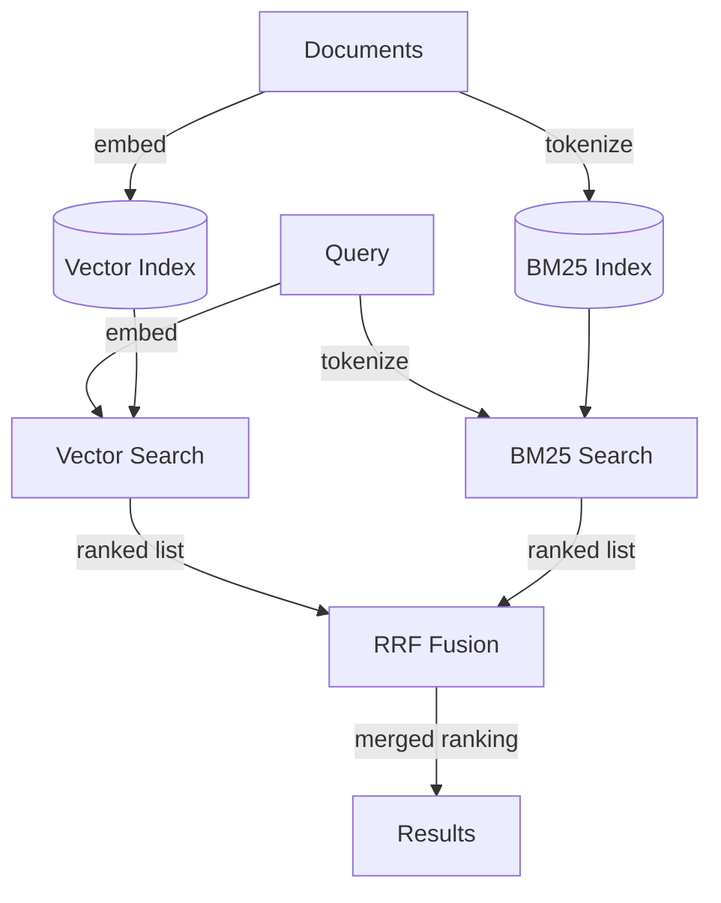
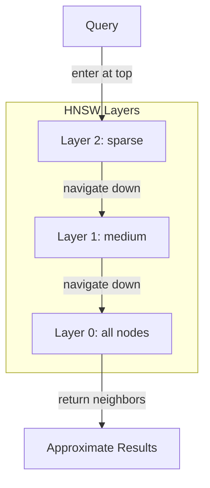

# Chapter 16 — Vector Databases and Hybrid Search

> Vector search and keyword search fail on different queries; hybrid search
> accepts this and combines them, using rank fusion to avoid the score
> normalization problem that breaks naive averaging.

---

## Learning Objectives

By the end of this chapter you will be able to:

- Explain why vector similarity and keyword matching fail on different query
  types, and predict which method will underperform on a given query.
- Implement cosine similarity search over normalized embeddings and explain
  why normalization matters for meaningful scores.
- Build a BM25 index and describe how term frequency, inverse document
  frequency, and length normalization combine to produce scores.
- Apply Reciprocal Rank Fusion (RRF) to combine ranked lists from different
  retrievers without score normalization.
- Design a hybrid retrieval system that runs vector and keyword search in
  parallel, fuses results, and adapts to query characteristics.
- Measure retrieval quality with precision, recall, and mean reciprocal rank,
  and use those metrics to validate system changes.

---

## The Production Story

Consider a software company building internal documentation search for 40,000
engineering documents: RFCs, runbooks, postmortems, and API specifications.
The first version used embedding-based vector search. Engineers could ask
"how do we handle authentication?" and get back relevant documents about
identity, session management, and access control even when those documents
never used the word "authentication."

Then a new engineer searched for "PostgresAdapter timeout configuration" and
got back documents about MySQL, MongoDB, and general database design. The
embedding model understood that these were all related to databases. It did
not understand that the engineer wanted a specific class name in a specific
codebase.

The team added BM25 keyword search as a fallback. Now exact matches worked
perfectly. But semantic queries degraded. "How do we handle auth" (without
the full word) returned nothing useful from BM25. The team let users toggle
between modes, which nobody did — they just complained that search did not
work.

The third attempt ran both retrievers on every query and averaged the scores.
This was worse than either method alone. Vector similarity scores ranged from
-1 to 1. BM25 scores ranged from 0 to infinity. A document with BM25 score 50
and vector similarity 0.8 seemed to beat a document with BM25 score 2 and
vector similarity 0.95, even when the second was obviously more relevant.
Normalizing to 0-1 ranges helped, but the choice of normalization method
changed the rankings unpredictably.

The measurement that mattered: what fraction of searches found the right
document in the first three results? For vector-only: 72%. For BM25-only:
61%. For naive score averaging: 58%. Something was clearly wrong.

The fix was to stop trying to combine scores and combine ranks instead. A
document ranked first by BM25 gets the same fusion credit as a document
ranked first by vector search, regardless of the underlying score magnitudes.
A document ranked highly by both methods gets more credit than a document
ranked highly by only one. This is Reciprocal Rank Fusion.

After deploying RRF-based hybrid search, relevance in the top three rose to
84%. The system no longer needed to decide whether a query was "semantic" or
"keyword" — it ran both and let the fusion handle it.

---

## Why This Exists

Before dense embeddings, retrieval meant keyword matching. Systems like
Lucene and Elasticsearch built empires on inverted indexes: maps from terms
to the documents containing them. If your query terms appeared in a document,
that document scored; if they did not, it did not. This worked remarkably
well for 30 years.

Then embedding models arrived and promised semantic understanding. The query
"car repair" would match a document about "automotive maintenance" because
their vectors were close, even with zero keyword overlap. This was genuinely
useful for natural language queries where users do not know the exact
vocabulary of the corpus.

But embeddings have a failure mode that keywords do not: they collapse
distinctions that matter. "PostgresAdapter" and "MySQLConnector" are both
database classes, so their embeddings are similar. An embedding model trained
on general text does not know that in your codebase these are different
things in different files doing different things.

Keyword search has the opposite failure mode: it requires exact matches. If
the user types "auth" and the document says "authentication," BM25 gives zero
credit. Stemming and synonyms help but do not solve the problem. You cannot
enumerate every way a user might phrase a concept.

Hybrid search acknowledges that both failure modes are real. Rather than
choosing one method and accepting its failures, run both and combine. The
combination is the interesting part: scores are incomparable, so you need
a fusion method that operates on ranks instead.

---

## Core Concepts

**Embedding.** A fixed-length vector representation of text. Two texts with
similar meaning produce vectors that are close in the embedding space. The
dimensions are learned during training and do not have human-interpretable
meaning. Common embedding dimensions range from 384 to 1536.

**Cosine similarity.** A measure of angle between two vectors, ranging from
-1 (opposite directions) through 0 (orthogonal) to 1 (same direction). For
normalized vectors (magnitude 1), cosine similarity equals the dot product.
Retrieval systems typically normalize embeddings at index time to make
similarity computation a single dot product.

**BM25.** Best Matching 25, a ranking function that scores documents against
a query based on term frequency (TF), inverse document frequency (IDF), and
document length normalization. BM25 has two tunable parameters: k1 (controls
TF saturation, typically 1.2) and b (controls length normalization, typically
0.75). Unlike raw TF-IDF, BM25 saturates so that additional occurrences of a
term add diminishing value.

**Inverted index.** A data structure mapping terms to the documents containing
them. Given a query term, the index returns all matching documents without
scanning the full corpus. BM25 and other keyword methods rely on inverted
indexes for sub-linear lookup.

**Approximate Nearest Neighbor (ANN).** Algorithms that find vectors close to
a query vector without computing distance to every stored vector. HNSW
(Hierarchical Navigable Small World) is the dominant ANN algorithm in
production vector databases. ANN trades exactness for speed: it might miss
the true nearest neighbor but finds very close ones in O(log n) time.

**Reciprocal Rank Fusion (RRF).** A method for combining ranked lists that
uses ranks instead of scores. For each item, compute 1 / (k + rank) where k
is a constant (typically 60). Sum these contributions across all lists. Higher
totals rank higher in the fused output. RRF is immune to score scale
differences because it only uses ordinal position.

**Recall.** The fraction of relevant documents that were retrieved. If 4
documents are relevant and 3 were returned, recall is 0.75. High recall
means you are not missing relevant results.

**Precision.** The fraction of retrieved documents that were relevant. If 5
documents were returned and 3 were relevant, precision is 0.60. High precision
means you are not returning irrelevant results.

**Mean Reciprocal Rank (MRR).** The average of 1/rank for the first relevant
document across a set of queries. If the first relevant document appears at
position 1, the reciprocal rank is 1.0. If it appears at position 3, the
reciprocal rank is 0.33. MRR measures how quickly users find what they need.

---

## Internal Architecture

A hybrid retrieval system maintains two parallel indexes: a vector index for
semantic similarity and an inverted index for keyword matching. Queries flow
through both, and results fuse before returning to the user.



*Queries run through both vector and BM25 paths. RRF fuses the ranked lists
using ordinal position, not scores.*

### Indexing path

**Document embedding.** Each document (or chunk) passes through an embedding
model to produce a vector. The vector is normalized to unit length so that
cosine similarity reduces to a dot product. Production systems batch embedding
calls — a mid-tier embedding model handles about 100 chunks per second per
instance.

**BM25 tokenization.** The same text is tokenized into terms for the inverted
index. Tokenization includes lowercasing, removing punctuation, and optionally
stemming. Each unique term creates an entry in the inverted index pointing to
the documents containing it, along with term frequency.

**Dual storage.** The vector index stores embeddings with document references.
The inverted index stores term-to-document mappings. Both indexes must stay
synchronized. In practice, this means atomic writes or a reconciliation job.

### Query path

**Parallel retrieval.** The query embeds and tokenizes simultaneously. Vector
search computes similarity against all stored vectors (or uses ANN for
approximate results). BM25 looks up query terms in the inverted index, scores
matching documents, and returns the top candidates.

**Over-retrieval.** Each retriever returns more candidates than the final
top-K, typically 2-3x. RRF needs overlap between lists to detect consensus.
If you only retrieve 5 from each and there is no overlap, fusion degrades
to interleaving.

**Rank fusion.** RRF assigns each result a score of 1 / (k + rank) where k is
typically 60 and rank is 1-indexed. If a document appears in both lists, its
RRF scores sum. The merged list sorts by total RRF score.

**Truncation.** The fused list truncates to the requested top-K. Results
return with their fusion scores, not the original retriever scores.

### HNSW for approximate vector search

Production vector databases do not scan all vectors for every query. They
use ANN algorithms, most commonly HNSW.



*HNSW builds a hierarchy where upper layers have fewer nodes and longer
edges. Search enters at the top and descends, reducing the search space at
each layer.*

HNSW has two build-time parameters: M (connections per node, typically 16-64)
and efConstruction (search width during build, typically 100-200). Higher
values improve recall but increase index size and build time. Query time has
one parameter: ef (search width during query, typically 50-200). Higher ef
means more accurate results but slower queries.

---

## Production Design

**Run retrieval in parallel, not sequentially.** Vector search and BM25 have
different latency profiles. Vector search with HNSW is typically 10-50 ms.
BM25 with a warm cache is typically 5-20 ms. Running them sequentially doubles
your p50; running them in parallel keeps it near the slower method.

**Over-retrieve by 2-3x for fusion.** If you want top-10 results, retrieve
20-30 from each method. RRF rewards documents that appear in both lists. If
a document ranks 15th in vector and 12th in BM25, it might fuse into the
top 10 because both methods agreed it was relevant. You cannot find this
consensus if you only retrieve 10.

**Set the RRF constant k based on list length.** The original paper uses
k=60, which works well when retrieving 100+ candidates per method. With
shorter lists (10-30), smaller k values (20-40) can work better. The tradeoff:
smaller k gives more weight to exact rank positions; larger k flattens the
curve.

**Index vectors as normalized unit vectors.** Normalize at index time, not
query time. This makes cosine similarity a single dot product, which is 2x
faster than computing magnitudes during search. All common vector databases
support this.

**Choose embedding dimensions for your latency budget.** Higher dimensions
(1024-1536) capture more nuance but require more storage and slower dot
products. Lower dimensions (256-384) are faster but may miss subtle
distinctions. For most production systems, 384-768 dimensions provide a
good balance. Measure recall on your corpus, not benchmark datasets.

**Batch embedding requests.** Embedding models have high per-request overhead.
A single request for 1 document and a single request for 100 documents have
similar latency (until you hit context limits). Batch during indexing. For
queries, single-document latency is unavoidable, so choose a model with low
cold-start time.

**Cache BM25 IDF values.** IDF depends on the corpus, not the query. Compute
it once during indexing and store it. Recompute only when the corpus changes
significantly (>5% of documents added or removed). Most changes are
incremental — add a new document, update its TF entry, leave IDF alone until
the next periodic refresh.

**Monitor retriever agreement.** Track what fraction of top-K results appear
in both lists. High agreement (>50%) suggests the retrievers are redundant
for that query type — you might speed things up by running only one. Low
agreement (<20%) suggests the query is ambiguous or the retrievers see
different signals. Neither is wrong; both are useful for understanding
system behavior.

---

## Failure Scenarios

### Failure: embedding model domain mismatch

**Symptom.** Vector search returns irrelevant results for domain-specific
queries. A search for "K8s pod eviction" returns documents about "container
orchestration best practices" and "cloud-native architecture" but not the
specific runbook about eviction policies.

**Mechanism.** The embedding model was trained on general web text. It
learned that Kubernetes, containers, pods, and cloud-native are all related
concepts. It did not learn that "pod eviction" is a specific failure mode
requiring specific remediation. The general embeddings are too similar.

**Detection.** Measure recall on a held-out test set of domain-specific
queries. If recall on technical queries is 20+ points lower than recall on
natural language queries, the embedding model is likely mismatched.

**Mitigation.** Short-term: weight BM25 higher for queries containing
technical terms. Medium-term: fine-tune the embedding model on your corpus
or choose a model trained on technical text.

**Prevention.** Before deploying any embedding model, evaluate it on your
actual queries. General benchmarks (MTEB) measure general performance; your
users are not general.

### Failure: score scale drift after reindexing

**Symptom.** After a routine reindex, search quality degrades. Users report
that results are "different" but cannot articulate how. Metrics show recall
unchanged but user satisfaction dropped.

**Mechanism.** The reindex used a different embedding model version, a
different BM25 tokenizer, or a different corpus subset. Scores shifted, and
the naive weighted average between retrievers now weights them differently
than before.

**Detection.** Track score distributions before and after reindex. If the
median BM25 score doubled or the median vector similarity dropped by 0.1,
the fusion weights are now wrong.

**Mitigation.** Use RRF instead of score-based fusion. RRF does not care
about score magnitudes, only ranks. A model update that shifts all scores
by a constant factor produces identical fusion results.

**Prevention.** Require that any change to indexing — model version,
tokenization, corpus scope — goes through the same evaluation as a code
change. Measure recall and MRR on a fixed test set before and after.

### Failure: HNSW recall degradation at scale

**Symptom.** As the corpus grows from 1 million to 10 million vectors,
observed recall drops from 95% to 80%. Users notice that known relevant
documents no longer appear in results.

**Mechanism.** HNSW recall depends on the ef parameter at query time. A
value that provided 95% recall on 1M vectors provides lower recall on 10M
vectors because there are more candidates to search through. The same ef
value explores a smaller fraction of the space.

**Detection.** Run periodic exact-search evaluations on a sample of queries.
Compare the HNSW results to the true nearest neighbors. If recall drops below
your threshold (typically 90-95%), ef is too low.

**Mitigation.** Increase ef. This increases query latency roughly linearly.
If 2x latency is unacceptable, shard the index so each shard has fewer
vectors.

**Prevention.** Monitor recall continuously, not just at launch. Set alerts
when recall drops below threshold. Plan for ef increases or sharding in
capacity planning.

### Failure: BM25 returns nothing for variant spellings

**Symptom.** A search for "postgres adapter timeout" returns results, but
"postgresql adapter timeout" returns nothing despite matching documents
existing.

**Mechanism.** BM25 tokenized "postgres" and "postgresql" as different
terms. Neither is in the other's document frequency map. The query gets
zero matches.

**Detection.** Log zero-result queries. Sample them weekly. If many are
spelling variants of successful queries, tokenization is too strict.

**Mitigation.** Add synonym expansion at query time: "postgresql" also
searches for "postgres". Or use character n-gram tokenization, which treats
"postgresql" as containing "postgres".

**Prevention.** Build a synonym list for your domain. Include common
abbreviations (k8s, kubernetes), variant spellings (gray, grey), and
branded terms (Postgres, PostgreSQL). Update it quarterly based on
zero-result logs.

---

## Scaling Strategy

Hybrid search scales along three axes: query throughput, corpus size, and
embedding model throughput. Each breaks at a different point.

**First: query throughput, around 100 queries per second.** A single process
running HNSW and BM25 can handle about 100 qps with p99 under 100 ms. Beyond
that, add read replicas. Each replica holds the full index in memory. A load
balancer distributes queries across replicas.

**Second: corpus size, around 10 million vectors.** HNSW memory scales
linearly with vector count. At 10M vectors with 768 dimensions, the index
alone is about 30 GB. Beyond that, shard the corpus. Each shard holds a
subset of documents. Queries fan out to all shards; results merge and re-rank.

**Third: index write throughput, around 1,000 documents per second.** Writes
to HNSW require graph updates, which are O(log n) but with high constant
factors. BM25 inverted index writes are cheaper. If you need sustained write
throughput above 1K/s, separate the write path: write to a staging area,
batch into the main index periodically.

**Fourth: embedding throughput, around 100,000 documents per day.** A
single mid-tier embedding model instance processes about 100 chunks per
second. At 100K documents with 5 chunks each, embedding takes about 2 hours.
Beyond that, run multiple embedding instances in parallel. Embedding is
embarrassingly parallel — no coordination needed.

**Scaling order for typical growth:**

1. **Read replicas** — cheapest, solves most throughput problems
2. **Larger instances** — more memory for larger indexes
3. **Sharding** — required above 10-50M vectors depending on dimensions
4. **Embedding parallelism** — required if reindex time exceeds your window

---

## Trade-offs

| Decision | Buys you | Costs you | Choose when |
| --- | --- | --- | --- |
| Hybrid search | Best recall across query types | Two indexes, fusion complexity | Mixed semantic and keyword queries |
| Vector-only | Simpler system, good semantic recall | Misses exact keywords | Conversational, exploratory search |
| BM25-only | Fast, interpretable, exact matches | Misses semantic similarity | Known vocabulary, technical terms |
| Higher embedding dimensions (768+) | Better semantic discrimination | 2x storage, slower search | Subtle distinctions matter |
| Lower embedding dimensions (384-) | Faster search, less storage | May miss nuances | Speed matters more than nuance |
| RRF fusion | Scale-invariant, no tuning | Ignores score magnitudes | Default choice for hybrid |
| Score-based fusion | Uses full information | Sensitive to scale, needs tuning | Scores are calibrated and stable |
| HNSW with high ef | Higher recall | Higher latency | Recall-critical applications |
| HNSW with low ef | Lower latency | May miss relevant results | Latency-critical applications |
| Fine-tuned embeddings | Domain-specific accuracy | Training cost, maintenance | Strong domain-specific vocabulary |
| General embeddings | No training, easy updates | May miss domain nuances | General-purpose or quick start |

---

## Code Walkthrough

From `examples/ch16-vector-search/`. The full system is about 500 lines; the
pieces below are where the key decisions live.

### Deterministic embedding simulation

In production you would call an embedding API. For testing, we simulate
embeddings that preserve semantic relationships.

```ts
// examples/ch16-vector-search/src/embedding.ts

const SEMANTIC_CLUSTERS: Record<string, string[]> = {
  finance: [
    'money', 'payment', 'budget', 'cost', 'price', 'revenue',
    'profit', 'expense', 'financial', 'dollar', 'fund'
  ],
  technology: [
    'software', 'computer', 'system', 'digital', 'technology',
    'data', 'algorithm', 'code', 'program', 'network', 'server'
  ],
  // ... more clusters
};

export function embed(text: string): number[] {
  const tokens = tokenizeForEmbedding(text);
  const accumulated = new Array(DIMENSIONS).fill(0);

  for (const token of tokens) {
    const cluster = wordToCluster.get(token);
    let tokenVec: number[];

    if (cluster && clusterVectors.has(cluster)) {
      // Token in semantic cluster: use cluster vector with noise
      const clusterVec = clusterVectors.get(cluster)!;
      const tokenRng = createRng(hashString(token));
      tokenVec = clusterVec.map((v) => v + (tokenRng() - 0.5) * 0.3);
    } else {
      // Token not in cluster: generate from hash
      const rng = createRng(hashString(token));
      tokenVec = new Array(DIMENSIONS);
      for (let i = 0; i < DIMENSIONS; i++) {
        tokenVec[i] = rng() * 2 - 1;
      }
    }

    for (let i = 0; i < DIMENSIONS; i++) {
      accumulated[i] += tokenVec[i];
    }
  }

  return normalize(accumulated);                              // (1)
}
```

1. Always normalize to unit length. This makes cosine similarity a dot
   product, which is 2x faster and numerically stable.

### Vector index with cosine similarity

The search method computes similarity against all stored vectors. Production
systems use HNSW; this demonstrates the correctness baseline.

```ts
// examples/ch16-vector-search/src/vector-index.ts

search(query: string, topK: number = 5): SearchResult[] {
  if (chunks.length === 0) {
    return [];
  }

  const queryEmbedding = normalize(embed(query));

  const scored: Array<{ chunk: Chunk; score: number }> = [];
  for (const chunk of chunks) {
    const score = cosineSimilarity(queryEmbedding, chunk.embedding);
    scored.push({ chunk, score });
  }

  scored.sort((a, b) => b.score - a.score);                   // (1)

  return scored.slice(0, topK).map(({ chunk, score }) => ({
    docId: chunk.docId,
    chunkIndex: chunk.chunkIndex,
    score,
    text: chunk.text,
  }));
}
```

1. Sort descending: highest similarity first. This is O(n log n) but
   dominated by the O(n) similarity computations.

### Reciprocal Rank Fusion

The core insight: ranks are comparable across systems, scores are not.

```ts
// examples/ch16-vector-search/src/fusion.ts

export function reciprocalRankFusion(
  rankedLists: SearchResult[][],
  rrfK: number = 60
): RankedResult[] {
  const scores = new Map<string, {
    docId: string;
    chunkIndex: number;
    text: string;
    rrfScore: number;
  }>();

  for (const list of rankedLists) {
    for (let rank = 0; rank < list.length; rank++) {
      const result = list[rank];
      const key = `${result.docId}:${result.chunkIndex}`;

      // RRF contribution: 1 / (k + rank + 1)                 // (1)
      const contribution = 1 / (rrfK + rank + 1);

      if (scores.has(key)) {
        scores.get(key)!.rrfScore += contribution;            // (2)
      } else {
        scores.set(key, {
          docId: result.docId,
          chunkIndex: result.chunkIndex,
          text: result.text,
          rrfScore: contribution,
        });
      }
    }
  }

  // Convert to array and sort by RRF score descending
  const results: RankedResult[] = [];
  for (const [, value] of scores) {
    results.push({
      docId: value.docId,
      chunkIndex: value.chunkIndex,
      rank: 0,
      score: value.rrfScore,
      text: value.text,
    });
  }

  results.sort((a, b) => b.score - a.score);

  for (let i = 0; i < results.length; i++) {
    results[i].rank = i + 1;
  }

  return results;
}
```

1. The k constant (typically 60) controls how much rank matters. With k=60,
   rank 1 scores 1/61 = 0.0164, rank 10 scores 1/70 = 0.0143. The difference
   is small, so consensus across lists dominates.
2. If a document appears in multiple lists, scores sum. A document ranked
   1st in both lists scores 2 * 1/61 = 0.0328. A document ranked 1st in one
   list scores 1/61 = 0.0164. The consensus document wins.

### Hybrid search combining both methods

The hybrid index runs both retrievers and fuses results.

```ts
// examples/ch16-vector-search/src/hybrid.ts

search(
  query: string,
  options: HybridSearchOptions = {}
): RankedResult[] {
  const topK = options.topK ?? 5;
  const vectorWeight = options.vectorWeight ?? 0.5;
  const rrfK = options.rrfK ?? 60;

  const retrieveK = Math.max(topK * 2, 20);                   // (1)

  const vectorResults = vectorIndex.search(query, retrieveK);
  const bm25Results = bm25Index.search(query, retrieveK);

  if (vectorResults.length === 0) {
    return bm25Results.slice(0, topK).map((r, i) => ({
      ...r,
      rank: i + 1,
    }));
  }
  if (bm25Results.length === 0) {
    return vectorResults.slice(0, topK).map((r, i) => ({
      ...r,
      rank: i + 1,
    }));
  }

  let fused: RankedResult[];
  if (vectorWeight === 0.5) {
    fused = reciprocalRankFusion([vectorResults, bm25Results], rrfK);
  } else {
    const bm25Weight = 1 - vectorWeight;
    fused = weightedRankFusion(
      [vectorResults, bm25Results],
      [vectorWeight, bm25Weight],
      rrfK
    );
  }

  return fused.slice(0, topK);
}
```

1. Over-retrieve by 2x or at least 20 to give fusion enough candidates to
   find consensus.

---

## Hands-On Lab

**Goal:** build a hybrid retrieval system and measure how fusion improves
recall over single methods. About one second of runtime, Node 22.6+, no
dependencies and no API key.

```bash
cd examples/ch16-vector-search
node scripts/lab.mjs
```

Or from the repo root:

```bash
node examples/ch16-vector-search/scripts/lab.mjs
```

That runs thirteen steps with 24 assertions.

**Expected output:**

```
Step 1 - embedding properties
  [PASS] same text produces same embedding
  [PASS] embedding has correct dimensions
  [PASS] embedding is normalized to unit length

Step 2 - semantic similarity
  [PASS] related terms have higher similarity
  [PASS] finance similarity is positive

...

Step 12 - full evaluation across queries
  Average hybrid recall: 1.00
  Average vector recall: 1.00
  Average BM25 recall: 0.77
  [PASS] hybrid average recall >= best single method

Step 13 - RRF scale invariance
  [PASS] RRF produces same result regardless of score scale
  [PASS] RRF scores are identical for same ranks

24/24 checks passed
```

**What each step demonstrates:**

| Step | What it shows |
| --- | --- |
| 1 | Embeddings are deterministic and normalized |
| 2 | Cosine similarity reflects semantic similarity |
| 3 | Vector index search finds semantically similar docs |
| 4 | BM25 search finds exact keyword matches |
| 5 | RRF fuses ranked lists, promoting consensus |
| 6 | Hybrid recall >= max(vector, BM25) recall |
| 7 | Vector catches semantic matches BM25 misses |
| 8 | BM25 catches exact keywords vector might miss |
| 9 | Weighted fusion allows tuning vector vs BM25 |
| 10 | Rank correlation measures retriever agreement |
| 11 | Precision, recall, MRR metrics work correctly |
| 12 | Full evaluation across mixed query types |
| 13 | **The assertion**: RRF is scale-invariant |

**Things worth breaking on purpose:**

- Remove BM25 from hybrid fusion and observe degraded recall on keyword
  queries like "database server".
- Set vectorWeight to 1.0 and observe that hybrid becomes equivalent to
  vector-only.
- Change rrfK from 60 to 1 and observe how rank position suddenly matters
  much more.

---

## Interview Questions

1. A search system uses both vector and BM25 retrieval. When you average
   the scores, results get worse. What is happening and how do you fix it?

2. Explain why cosine similarity is preferred over Euclidean distance for
   comparing text embeddings.

3. Your vector search returns good results on general queries but fails on
   technical queries containing acronyms and code names. Diagnose and fix.

4. Walk me through the RRF algorithm. Why does it use 1/(k+rank) instead
   of just 1/rank?

5. You need to search 50 million documents with p99 latency under 100 ms.
   Describe your architecture.

6. How would you measure whether hybrid search is actually better than
   single-method search for your use case?

7. A colleague proposes fine-tuning the embedding model on your corpus.
   What questions do you ask before approving?

8. Explain the relationship between HNSW ef parameter and recall. What
   happens if ef is too low?

---

## Staff-Level Answers

**Q1 — score averaging makes results worse.** The scores from different
retrievers are on incompatible scales. Vector cosine similarity ranges from
-1 to 1. BM25 scores are unbounded positive numbers depending on corpus
statistics. Averaging them weights whichever system produces larger numbers,
not whichever system is more accurate.

The fix is Reciprocal Rank Fusion. RRF converts scores to ranks, which are
comparable: rank 1 is rank 1 regardless of score magnitude. A document that
ranks highly in both systems gets credit for both, regardless of the
underlying numbers. This makes fusion immune to score scale differences and
model changes.

The staff addition: even if you normalize scores to 0-1, the normalization
method matters. Min-max normalization is sensitive to outliers. Z-score
normalization assumes normal distributions. Both require knowing corpus
statistics. RRF avoids all of this by discarding scores entirely.

**Q4 — why 1/(k+rank) instead of 1/rank.** Pure 1/rank gives rank 1 a score
of 1.0 and rank 10 a score of 0.1 — a 10x difference. This makes the system
extremely sensitive to exact rank positions, which are often noisy.

Adding k flattens the curve. With k=60, rank 1 scores 1/61 = 0.0164 and rank
10 scores 1/70 = 0.0143 — only a 1.15x difference. This makes consensus
(appearing in multiple lists) more important than exact position within a
list. A document ranked 1st in one list beats a document ranked 2nd in both
lists, but only barely.

The k=60 value comes from the original RRF paper and works well when
retrieving 100+ candidates. With shorter lists, smaller k values (20-40)
can work better because there is less room for noise in the rankings.

**Q6 — measuring hybrid improvement.** Build a test set of queries with
labeled relevant documents. Include:

- Pure semantic queries ("how do we handle authentication")
- Pure keyword queries ("PostgresAdapter timeout")
- Mixed queries ("configure auth for Postgres connections")

For each query, run vector-only, BM25-only, and hybrid retrieval. Measure:

- Recall@K: fraction of relevant docs retrieved
- MRR: how quickly the first relevant doc appears
- User clicks (if available): real engagement data

Compare the three methods across query types. Hybrid should match or beat the
best single method on every type. If it does not, check the fusion weights
and retrieval depths.

The staff addition: stratify by query characteristics, not just overall
averages. Hybrid might improve semantic queries by 5% and hurt keyword
queries by 15%, averaging to flat. The stratified view reveals whether you
need query-type detection and adaptive weighting.

**Q8 — HNSW ef and recall.** The ef parameter controls how many candidates
HNSW considers during search. Higher ef means exploring more of the graph,
which increases the probability of finding the true nearest neighbors.

If ef is too low, HNSW explores a small neighborhood and may miss vectors
that are globally close but not in that local region. Observed recall drops —
the true nearest neighbor might be in the top 5 of exact search but absent
from HNSW results.

The tradeoff is latency: higher ef means more distance computations. The
relationship is roughly linear — doubling ef roughly doubles query time. The
right ef depends on your recall target and latency budget. Start at ef=50,
measure recall against exact search on a sample, and increase until you hit
90-95% recall.

---

## Exercises

1. **Retriever disagreement analysis.** Run vector and BM25 search on 20
   queries. For each, count how many of the top-5 results appear in both
   lists. Which query types have highest agreement? Lowest?

2. **RRF constant tuning.** Modify the lab to test k values of 1, 10, 60,
   and 200. Measure recall on the test queries. At what k does performance
   stabilize?

3. **Weighted fusion.** Implement a query classifier that detects keyword-
   heavy queries (more than 50% of tokens are proper nouns or technical
   terms). Weight BM25 higher for those queries. Measure recall improvement.

4. **Embedding model comparison.** Swap the simulated embeddings for a real
   embedding model (requires API key). Compare recall between simulated and
   real embeddings on the same queries.

5. **HNSW simulation.** Implement a simplified HNSW index with configurable
   M and ef parameters. Measure recall vs exact search as the corpus grows
   from 100 to 10,000 documents.

6. **Design question, no code.** A legal tech company needs to search 100
   million court documents. Some queries are case citations
   ("Smith v. Jones, 2019 WL 12345"), some are topic searches ("securities
   fraud class action"). Write a one-page design for the retrieval system.

---

## Further Reading

- **Cormack, Clarke, and Buettcher, "Reciprocal Rank Fusion Outperforms
  Condorcet and Individual Rank Learning Methods" (2009)** — the original
  RRF paper. Short and practical. The k=60 constant comes from here.

- **Malkov and Yashunin, "Efficient and Robust Approximate Nearest Neighbor
  using Hierarchical Navigable Small World Graphs" (2018)** — the HNSW paper.
  Dense but essential reading if you need to tune or debug an HNSW index.

- **Robertson et al., "The Probabilistic Relevance Framework: BM25 and
  Beyond" (2009)** — the definitive BM25 paper. Explains why k1 and b have
  their default values and when to change them.

- **Karpukhin et al., "Dense Passage Retrieval for Open-Domain Question
  Answering" (2020)** — demonstrates that dense retrieval can match or beat
  BM25 on QA tasks. Important context for why hybrid is often unnecessary
  for pure semantic search.

- **Pinecone engineering blog, "Hybrid Search Explained"** — practical
  guidance on implementing hybrid search with real vector databases. The
  architecture is vendor-specific but the concepts transfer.

- **Weaviate documentation on hybrid search** — another vendor perspective.
  Useful for comparing how different systems expose fusion parameters.

- **MTEB leaderboard (Hugging Face)** — benchmark for embedding models on
  retrieval tasks. Use this to select an embedding model, but always validate
  on your own corpus.
