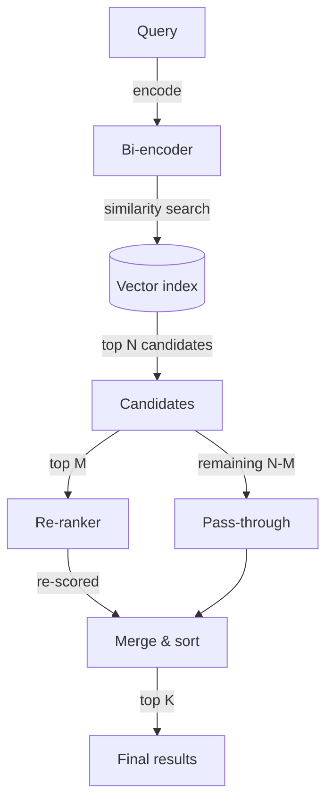

# Chapter 17 — Re-ranking and Retrieval Evaluation

> A retrieval system that cannot measure its own quality cannot improve,
> and a system that improves quality without measuring latency will
> eventually be turned off.

---

## Learning Objectives

By the end of this chapter you will be able to:

- Explain the architectural difference between bi-encoder retrieval and
  cross-encoder re-ranking, and identify when each is appropriate.
- Implement precision@K, recall@K, MRR, and NDCG, and interpret what each
  metric reveals about retrieval quality.
- Design a cascade architecture that combines fast retrieval with slow
  re-ranking to balance latency and quality.
- Build an evaluation harness with ground-truth relevance judgments and
  use it to validate retrieval changes before deployment.
- Identify diminishing returns in re-rank depth and choose an optimal
  depth given a latency budget.
- Diagnose why re-ranking helps some queries more than others and adjust
  strategy accordingly.

---

## The Production Story

Consider a documentation search system for a cloud platform. The search
team deployed a BM25-based retrieval system, embedded their 15,000
documentation pages, and shipped. Early feedback was positive: users
found what they needed about 70% of the time.

Then the support tickets started arriving. Users searching "how do I
scale my application" were getting results about manual scaling,
autoscaling, vertical scaling, and horizontal scaling — all technically
relevant, but the most useful document (the quickstart guide for
horizontal pod autoscaling) was appearing at position 6 or 7, below
several tangentially related pages.

The team tried tuning BM25 parameters. They tried adjusting chunk sizes.
They tried adding synonyms to the query expansion. Precision@5 moved
from 0.38 to 0.42. Users kept complaining.

A new engineer suggested re-ranking: take the top 20 results from BM25,
run them through a cross-encoder model that scores each (query, document)
pair directly, and reorder based on those scores. The cross-encoder
would model the actual relevance relationship rather than relying on
term overlap.

The first prototype looked promising. On a manually reviewed test set of
50 queries, precision@5 jumped from 0.42 to 0.58. But when they deployed
it, p95 latency went from 180ms to 1,400ms. The search API had a 500ms
SLO. The re-ranker was too slow.

The fix required measurement the team had not been doing. How many
documents needed re-ranking to get most of the quality gain? At what
depth did the improvement plateau? What was the latency cost per document?

They swept re-rank depths from 5 to 50. The answer: re-ranking the top 10
documents captured 85% of the quality improvement. Re-ranking 20 captured
92%. Re-ranking beyond 20 added latency but almost no quality. At 5ms per
document (their cross-encoder on a GPU), re-ranking 10 documents added
50ms — well within budget.

The deployed system now retrieves 50 candidates with BM25, re-ranks the
top 10, and returns the top 5. Precision@5 is 0.54. p95 latency is 230ms.
The system works because the team measured both axes.

---

## Why This Exists

Retrieval systems face a fundamental tension. Fast methods — term
frequency, BM25, bi-encoder embedding similarity — can scan millions of
documents in milliseconds, but they make independence assumptions that
limit accuracy. They score each document against the query without
considering how query and document tokens interact.

Slow methods — cross-encoders, large language models — can model the
relationship between query and document directly. A cross-encoder takes
the concatenated query and document, runs them through a transformer,
and outputs a relevance score from the [CLS] token. This architecture
can learn that "scale my application" in a query means autoscaling is
more relevant than manual scaling, even if both documents contain the
word "scale."

The problem: a cross-encoder at inference time is at least 100x slower
than a bi-encoder. You cannot run it on 100,000 documents. Hence the
cascade architecture: fast retrieval produces N candidates, slow
re-ranking reorders them.

Evaluation exists because retrieval quality is otherwise invisible.
Users do not report when they find what they need; they only report when
they do not. Without ground-truth relevance judgments and metrics,
improvements are guesses and regressions go undetected.

The metrics matter because they measure different things. Precision asks
whether the top results are relevant. Recall asks whether the relevant
documents appear at all. MRR asks where the first relevant result
appears. NDCG asks whether the ranking is good overall. A system can
have high precision and low recall (few results, all relevant), or high
recall and low precision (all relevant documents found, but buried in
noise). The right metric depends on the use case.

---

## Core Concepts

**Bi-encoder.** An architecture where the query and document are encoded
separately into fixed vectors, and relevance is computed as vector
similarity (dot product or cosine). Fast at inference time because
document embeddings are precomputed. Limited because the query and
document never see each other's tokens during encoding.

**Cross-encoder.** An architecture where query and document are
concatenated and processed together through a transformer. The model can
attend across both, modeling token-level interactions. Accurate but slow:
inference must run for every (query, document) pair.

**Precision@K.** The fraction of the top K results that are relevant.
If K=5 and three results are relevant, precision@5 is 0.60. Measures how
useful the first page of results is.

**Recall@K.** The fraction of all relevant documents that appear in the
top K. If four documents are relevant and three appear in the top 5,
recall@5 is 0.75. Measures whether the system finds what exists.

**MRR (Mean Reciprocal Rank).** The reciprocal of the rank at which the
first relevant document appears. If the first relevant result is at
position 1, MRR is 1.0. At position 3, MRR is 0.33. Averages across
queries. Measures how quickly users find something useful.

**NDCG (Normalized Discounted Cumulative Gain).** A ranking metric that
accounts for both relevance and position. A relevant document at
position 1 contributes more than one at position 10. Normalized against
the ideal ranking. Values range from 0 to 1.

**Relevance judgment.** A ground-truth label indicating which documents
are relevant to a query. Collected through manual annotation, user
clicks, or expert review. Evaluation is meaningless without them.

**Cascade architecture.** A multi-stage retrieval pipeline where each
stage is slower but more accurate. Stage 1 retrieves many candidates
quickly; stage 2 re-ranks the top of that list more carefully.

---

## Internal Architecture

The cascade pattern dominates production retrieval systems. The key
design decision is where to split the stages: how many candidates does
stage 1 return, and how many does stage 2 re-rank?



*The cascade retrieves N candidates via bi-encoder similarity, re-ranks
the top M with a cross-encoder, and returns the top K after merging.*

### Stage 1: Fast retrieval

The bi-encoder (or BM25) scans the entire corpus. For embedding-based
retrieval, this is an approximate nearest neighbor search over precomputed
vectors. For BM25, it is an inverted index lookup. Both scale to millions
of documents with sub-100ms latency.

The output is a ranked list of N candidates with similarity or BM25
scores. N is typically 20-100, large enough to include most relevant
documents but small enough to fit in memory for re-ranking.

### Stage 2: Cross-encoder re-ranking

The re-ranker scores each candidate independently against the query. For
M candidates, this is M forward passes through the model (or a batched
inference call). Each pass produces a relevance score.

The key constraint: cross-encoder latency is roughly linear in M. If
each document takes 5ms, re-ranking 10 documents adds 50ms, re-ranking
50 adds 250ms. The latency budget determines M.

### Stage 3: Result assembly

After re-ranking, the top K results come from the re-ranked set. The
remaining N-M candidates (which were not re-ranked) can be appended in
their original order, though in practice they rarely surface to the user.

The scores from different stages are not directly comparable. Re-ranker
scores are typically transformed to a 0-1 range or used only for ordering
within the re-ranked set.

---

## Production Design

**Retrieve more candidates than you re-rank.** If you want the top 5
results and you re-rank 10, you are relying on the re-ranker to correct
the bi-encoder's mistakes within a narrow window. Retrieve 30-50
candidates to give the re-ranker room to find relevant documents that the
bi-encoder ranked poorly.

**Measure re-ranker latency per document, not per batch.** GPU batching
amortizes overhead, but per-document cost is what determines your
re-rank depth. On a mid-tier GPU, expect 3-10ms per document. On CPU,
expect 30-100ms.

**Set re-rank depth from latency budget, not quality alone.** If your
SLO is 200ms and retrieval takes 50ms, you have 150ms for re-ranking. At
5ms per document, that is 30 documents. Quality beyond that depth is
unreachable.

**Precompute everything you can.** Cross-encoder inference is the
bottleneck. The bi-encoder document embeddings should be indexed ahead
of time. Any query preprocessing (expansion, normalization) should be
cached where possible.

**Cache re-ranker results for repeated queries.** If users frequently
search the same queries, cache the (query, candidate set, reranked order)
tuple. Cache invalidation on corpus update is simpler than it sounds:
invalidate everything when any document changes, since you cannot know
which queries it affects.

**Log the score distributions from each stage.** When retrieval quality
degrades, you need to know whether stage 1 stopped returning good
candidates or stage 2 stopped ranking them correctly. Logging bi-encoder
scores and re-ranker scores separately makes this visible.

**Build an eval set before you build the system.** Relevance judgments
take time to collect. If you wait until after deployment, you have no
way to validate the initial system or measure regressions.

---

## Failure Scenarios

### Failure: re-ranker latency exceeds SLO

**Symptom.** p95 latency spikes to 2-5x the SLO. Users see timeouts.
Search abandonment rate increases.

**Mechanism.** The re-ranker is scoring too many documents per query. This
happens when re-rank depth is set from quality experiments without
considering latency, or when a model upgrade doubles per-document
inference time.

**Detection.** Latency percentiles by stage. If re-ranker latency exceeds
70% of total request time, the ratio is off. Also monitor re-rank depth
per query — some queries may have higher candidate counts.

**Mitigation.** Reduce re-rank depth immediately. Halving depth
approximately halves latency. Quality will drop, but availability matters
more.

**Prevention.** Set re-rank depth from latency budget: `max_depth =
(slo_ms - retrieval_ms - overhead_ms) / ms_per_doc`. Run latency
benchmarks on every model change. Alert when per-document latency
increases by more than 20%.

### Failure: re-ranker produces no quality improvement

**Symptom.** Precision@K and NDCG are the same before and after re-ranking.
The re-ranker adds latency but no value.

**Mechanism.** The re-ranker model is not fine-tuned for the domain. A
generic cross-encoder trained on web search may not understand technical
documentation. Alternatively, the bi-encoder is already so good that
there is nothing to fix.

**Detection.** A/B test with and without re-ranking. If metrics are
statistically indistinguishable, the re-ranker is not helping.

**Mitigation.** If the bi-encoder is sufficient, remove the re-ranker and
save the latency. If the domain is specialized, fine-tune the cross-
encoder on in-domain relevance judgments.

**Prevention.** Validate the re-ranker on a held-out eval set before
deployment. Never deploy a re-ranker that does not measurably improve
quality in offline evaluation.

### Failure: evaluation metrics do not correlate with user satisfaction

**Symptom.** Precision@5 is 0.70, but user feedback indicates search
quality is poor. Support tickets increase.

**Mechanism.** The relevance judgments are stale or wrong. The annotators
who created them did not understand user intent. Or the metric does not
match the use case: users care about the first result (MRR), but you are
optimizing precision@5.

**Detection.** Sample recent queries, collect fresh relevance judgments,
and compare to the historical test set. Also correlate metric improvements
with user behavior changes (click-through rate, time to click, search
refinement rate).

**Mitigation.** Refresh the eval set with current queries and
representative annotators. Align the metric to the use case: if users
typically click one result, optimize MRR; if they scan the first page,
optimize NDCG@10.

**Prevention.** Rotate a fraction of the eval set quarterly. Include
real user queries, not just synthetic ones. Validate that metric
improvements correspond to behavioral improvements before celebrating.

---

## Scaling Strategy

Cascade retrieval scales on two axes: corpus size and query throughput.
Each breaks at different points.

**First: bi-encoder index size, around 10 million documents.** A single
approximate nearest neighbor index fits in memory up to this scale. Beyond
it, shard the index across machines. Each shard handles a portion of the
corpus; a coordinator merges results.

**Second: re-ranker throughput, around 100 queries per second.** A single
GPU re-ranking 10 documents per query at 5ms each can handle 20 queries
per second (1000ms / 50ms per query). At 100 QPS, you need 5 GPUs. Scale
horizontally by adding re-ranker replicas behind a load balancer.

**Third: candidate transfer, around 1,000 QPS.** Moving 50 candidate
documents per query to the re-ranker involves network I/O. At 1K QPS,
that is 50K documents per second, roughly 5MB/s if each document is 1KB.
Not a bottleneck on a modern network, but it adds latency. Colocate
retrieval and re-ranking where possible.

**Fourth: eval harness, at scale.** Running evaluation on every commit
becomes expensive when the test set is large and re-ranking is slow. Sample
the eval set for CI, run the full set nightly.

---

## Trade-offs

| Decision | Buys you | Costs you | Choose when |
| --- | --- | --- | --- |
| Higher re-rank depth (M=30) | Better quality, more chances to surface relevant docs | Higher latency, proportional to M | Latency budget permits, quality is critical |
| Lower re-rank depth (M=10) | Lower latency, easier to stay within SLO | May miss relevant docs ranked 11-30 by bi-encoder | Tight latency budget, acceptable quality loss |
| Cross-encoder on GPU | 3-10ms per doc, production-viable latency | GPU cost, infrastructure complexity | High traffic, quality-sensitive |
| Cross-encoder on CPU | No GPU required, simpler infrastructure | 30-100ms per doc, limits re-rank depth | Low traffic, cost-sensitive |
| Generic cross-encoder | No training required, fast deployment | May not understand domain-specific relevance | General-purpose search, diverse queries |
| Fine-tuned cross-encoder | Domain-appropriate relevance modeling | Requires labeled training data, retraining on corpus change | Specialized domain, available annotations |
| Large eval set (500+ queries) | Statistically significant metric differences | Slow evaluation, expensive annotation | Mature system, formal quality guarantees |
| Small eval set (50 queries) | Fast iteration, cheap annotation | May miss regressions, noisy metrics | Early development, exploratory changes |
| Precision@K optimization | Fewer irrelevant results in top K | May reduce recall if too aggressive | Users scan first page, abandon on noise |
| Recall@K optimization | More relevant docs eventually appear | May increase noise in top positions | Users search for completeness, will scroll |

---

## Code Walkthrough

From `examples/ch17-reranking/`. The system has about 350 lines across
five modules. The key patterns are the metric calculations and the
evaluation harness.

### Metric calculations

Precision@K and recall@K are straightforward set operations.

```ts
// examples/ch17-reranking/src/metrics.ts

export function precisionAtK(
  results: RetrievalResult[],
  relevantDocIds: string[],
  k: number
): number {
  const topK = results.slice(0, k);
  if (topK.length === 0) return 0;

  const relevantSet = new Set(relevantDocIds);
  let relevant = 0;

  for (const result of topK) {
    if (relevantSet.has(result.docId)) {               // (1)
      relevant++;
    }
  }

  return relevant / topK.length;                       // (2)
}
```

1. Check membership in the ground-truth relevant set.
2. Precision is the fraction of retrieved documents that are relevant.

NDCG accounts for position with a logarithmic discount.

```ts
// examples/ch17-reranking/src/metrics.ts

export function ndcg(
  results: RetrievalResult[],
  relevantDocIds: string[],
  k: number
): number {
  const topK = results.slice(0, k);
  const relevantSet = new Set(relevantDocIds);

  // DCG: sum of rel_i / log2(i + 2) for binary relevance
  let dcg = 0;
  for (let i = 0; i < topK.length; i++) {
    const rel = relevantSet.has(topK[i].docId) ? 1 : 0;
    dcg += rel / Math.log2(i + 2);                     // (1)
  }

  // IDCG: DCG of the ideal ranking
  const idealCount = Math.min(relevantDocIds.length, k);
  let idcg = 0;
  for (let i = 0; i < idealCount; i++) {
    idcg += 1 / Math.log2(i + 2);                      // (2)
  }

  if (idcg === 0) return 0;
  return dcg / idcg;                                   // (3)
}
```

1. Logarithmic discount: position 1 contributes 1/log2(2)=1, position 2
   contributes 1/log2(3)=0.63, position 10 contributes 1/log2(11)=0.29.
2. Ideal DCG assumes all relevant documents are ranked first.
3. Normalize so the perfect ranking scores 1.0.

### Cross-encoder simulation

The re-ranker simulates what a real cross-encoder does: boost relevant
documents and add per-document latency.

```ts
// examples/ch17-reranking/src/reranker.ts

export function rerank(
  query: string,
  results: RetrievalResult[],
  relevantDocIds: string[],
  config: Partial<RerankerConfig> = {}
): { reranked: RetrievalResult[]; latencyMs: number } {
  const cfg = { ...DEFAULT_CONFIG, ...config };
  const relevantSet = new Set(relevantDocIds);

  const startTime = performance.now();
  const totalLatencyMs = results.length * cfg.latencyPerDocMs;  // (1)

  const rescored = results.map((result) => {
    let newScore = result.score;

    if (relevantSet.has(result.docId)) {
      newScore += cfg.relevanceBoost;                           // (2)
    } else {
      newScore -= cfg.relevanceBoost * 0.2;
    }

    return { ...result, score: newScore };
  });

  rescored.sort((a, b) => b.score - a.score);                   // (3)

  return { reranked: rescored, latencyMs: totalLatencyMs };
}
```

1. Latency scales linearly with document count.
2. Relevant documents get boosted, simulating correct relevance modeling.
3. Re-sort by the new scores.

### Evaluation harness

The evaluator runs retrieval and re-ranking for each query, computing
before and after metrics.

```ts
// examples/ch17-reranking/src/evaluator.ts

export function evaluatePipeline(
  judgments: RelevanceJudgment[],
  retrieveFn: (query: string) => RetrievalResult[],
  rerankDepth: number,
  k: number
): AggregateEvaluation {
  const queryResults: EvaluationResult[] = [];

  for (const judgment of judgments) {
    const initialResults = retrieveFn(judgment.query);

    const beforeMetrics = computeMetrics(                // (1)
      initialResults,
      judgment.relevantDocIds,
      k
    );

    const { reranked, latencyMs } = rerankTopK(          // (2)
      judgment.query,
      initialResults,
      judgment.relevantDocIds,
      rerankDepth
    );

    const afterMetrics = computeMetrics(                 // (3)
      reranked,
      judgment.relevantDocIds,
      k
    );

    queryResults.push({
      queryId: judgment.queryId,
      beforeMetrics,
      afterMetrics,
      latencyMs,
    });
  }

  return {
    beforeAggregate: aggregateMetrics(queryResults.map(r => r.beforeMetrics)),
    afterAggregate: aggregateMetrics(queryResults.map(r => r.afterMetrics)),
    queryResults,
  };
}
```

1. Compute metrics before re-ranking to establish baseline.
2. Re-rank the top documents.
3. Compute metrics after re-ranking to measure improvement.

---

## Hands-On Lab

**Goal:** Demonstrate that re-ranking improves precision and NDCG, that
latency scales with re-rank depth, and that quality gains diminish past
a certain depth. About one second of runtime, Node 22.6+, no dependencies.

```bash
cd examples/ch17-reranking
node scripts/lab.mjs
```

Or from the repo root:

```bash
node examples/ch17-reranking/scripts/lab.mjs
```

That runs eleven steps with 19 assertions. The rest of this section
explains what it checks and why.

**Expected output:**

```
Step 1 - metric calculations
  [PASS] precision@5 = 3/5 = 0.6
  [PASS] recall@5 = 3/3 = 1.0
  [PASS] MRR = 1/1 = 1.0 (first result is relevant)
  [PASS] NDCG@5 > 0.8 (good ranking)

...

Step 6 - diminishing returns at high re-rank depth
  [INFO] Quality at different depths:
         depth=3: NDCG=0.277, latency=15.0ms
         depth=5: NDCG=0.553, latency=25.0ms
         depth=8: NDCG=0.869, latency=40.0ms
         depth=10: NDCG=1.000, latency=50.0ms
         depth=15: NDCG=1.000, latency=75.0ms
  [PASS] marginal NDCG gain from depth 5 to 30 is under 50%

...

19/19 checks passed
```

**What each step demonstrates:**

| Step | What it shows |
| --- | --- |
| 1 | Metric calculations are correct on known inputs |
| 2 | BM25 baseline retrieval works |
| 3 | **Re-ranker improves precision@5 by at least 20%** |
| 4 | **NDCG increases after re-ranking** |
| 5 | **Latency scales proportionally with re-rank depth** |
| 6 | **Quality gains diminish past certain depth** |
| 7 | MRR (first relevant result) improves |
| 8 | Recall@K behavior with re-ranking |
| 9 | Latency budget determines max re-rank depth |
| 10 | Per-query variance in improvement |
| 11 | Cascade architecture beats retrieve-only |

**Things worth breaking on purpose:**

- Set `relevanceBoost: 0` in the reranker and watch precision improvements
  disappear — the re-ranker no longer identifies relevant documents.

- Increase `latencyPerDocMs` to 50 and observe latency grow to hundreds
  of milliseconds — this is why re-rank depth matters.

- Remove relevance judgments from a query and watch metrics return
  degenerate values — evaluation requires ground truth.

---

## Interview Questions

1. A search system has precision@5 of 0.45 and recall@5 of 0.30. What do
   these numbers tell you, and which would you prioritize improving?

2. You add a cross-encoder re-ranker and precision@5 improves from 0.50
   to 0.65, but p95 latency goes from 100ms to 800ms. What do you do?

3. Explain why a cross-encoder is more accurate than a bi-encoder for
   relevance scoring, and why you cannot use it for the initial retrieval.

4. You have a 150ms latency budget and a re-ranker that takes 8ms per
   document. How many documents can you re-rank, and what retrieval depth
   would you choose?

5. NDCG on your test set is 0.85, but users complain that search is bad.
   What might be wrong?

6. Design an evaluation harness that can detect a 3% regression in
   precision@5 with 95% confidence.

7. A colleague proposes caching re-ranker results. What are the trade-offs,
   and how would you invalidate the cache?

8. You want to A/B test a new re-ranker. What metrics do you track, and
   how do you decide whether to ship it?

9. Explain MRR and when you would optimize for it instead of precision@K.

10. The re-ranker improves quality for 60% of queries but hurts it for 10%.
    Should you deploy it?

---

## Staff-Level Answers

**Q1 — interpreting precision and recall.** Precision@5 of 0.45 means
fewer than half the top 5 results are relevant — users see noise.
Recall@5 of 0.30 means most relevant documents are not in the top 5 —
users miss important content.

Which to prioritize depends on the use case. For exploratory search where
users scan multiple results, improve recall: bring more relevant documents
into the top K. For navigational search where users click one result,
improve precision: reduce noise so the good result is findable.

The staff addition: these metrics trade off against each other. Increasing
recall often reduces precision (you retrieve more, including more noise).
The question is not "which is higher" but "which matters more for users."

**Q2 — latency regression from re-ranking.** First, measure where the
latency comes from. 700ms added latency for a cross-encoder suggests either
too many documents being re-ranked or a slow model.

Calculate the latency budget. If the SLO is 200ms and retrieval is 50ms,
you have 150ms for re-ranking. At 8ms per document (a typical cross-encoder
on GPU), that is 18 documents max.

Next, measure quality at different re-rank depths. If re-ranking 15
documents gives 90% of the precision improvement, do that. Ship the
depth that fits the latency budget and delivers meaningful quality gain.

The staff addition: do not ship quality improvements that break latency
SLOs. An 800ms search is worse than a 100ms search with lower precision,
because users abandon slow searches before seeing the results.

**Q3 — bi-encoder vs cross-encoder.** A bi-encoder encodes query and
document separately. The query vector is computed at search time; document
vectors are precomputed. Relevance is vector similarity, which cannot
model token-level interactions.

A cross-encoder encodes query and document together. Every token in the
query can attend to every token in the document. This models nuances like
"scale" meaning autoscaling rather than manual scaling.

You cannot use a cross-encoder for initial retrieval because it requires
running inference for every (query, document) pair. On a million-document
corpus, that is a million forward passes — hours per query. The cascade
architecture uses bi-encoder retrieval to narrow candidates, then cross-
encoder re-ranking on the short list.

**Q5 — metric-user disconnect.** NDCG of 0.85 suggests the ranking is
good, but users disagree. Possible causes:

The eval set is stale. User queries and information needs change; relevance
judgments from six months ago may not reflect current intent.

The annotators were wrong. If annotators did not understand the domain,
their judgments do not match user expectations.

The metric is misaligned. NDCG weights all positions; users might only
look at position 1 (optimize MRR) or only care about specific document
types (add filters).

The fix: sample recent queries, collect fresh judgments from domain
experts, and correlate metric changes with behavioral metrics (click-
through rate, search refinement rate).

**Q7 — caching re-ranker results.** Caching saves latency when the same
query is repeated. Trade-offs:

Cache hit rate depends on query repetition. If every query is unique,
caching adds overhead with no benefit. Measure the repetition rate first.

Cache invalidation is hard. When a document changes, every cached query
that included that document is potentially wrong. The simple approach:
invalidate everything on any corpus change. The complex approach: track
which documents each query touched, invalidate selectively.

Staleness risk. If a cached result is served after the underlying document
changed, users see outdated information. For documentation search, this
is usually acceptable; for real-time data, it is not.

The staff position: cache at the retrieval layer if queries repeat. Do
not cache re-ranking unless you can guarantee freshness or staleness is
acceptable.

---

## Exercises

1. **Metric verification.** Create a ranked list of 10 documents where
   positions 1, 3, 5, 7 are relevant. Calculate precision@5, recall@5,
   MRR, and NDCG@5 by hand and verify against the metrics module.

2. **Depth sweep.** Modify the lab to sweep re-rank depths from 1 to 15
   in steps of 1. Plot NDCG vs depth and latency vs depth. Identify the
   "knee" where quality gains slow down.

3. **Latency budget calculator.** Implement a function that takes a
   target latency, retrieval latency, and per-document re-rank latency,
   and returns the maximum re-rank depth. Test with various budgets.

4. **Per-query analysis.** Extend the evaluator to identify which queries
   benefit most from re-ranking and which benefit least. What
   characteristics do the high-benefit queries share?

5. **Cross-validation.** Split the judgment set into 5 folds. Train
   hyperparameters (re-rank depth) on 4 folds, test on 1. Report variance
   across folds.

6. **Design question, no code.** A legal document search system must
   return all relevant documents (recall is critical) but users only
   look at the first 3 results. Design a retrieval and re-ranking strategy
   that optimizes for this use case.

---

## Further Reading

- **Nogueira and Cho, "Passage Re-ranking with BERT" (2019)** — the paper
  that demonstrated cross-encoder re-ranking for information retrieval.
  Shows a 27% improvement in MRR on MS MARCO, establishing the pattern
  now used everywhere.

- **Karpukhin et al., "Dense Passage Retrieval for Open-Domain Question
  Answering" (2020)** — introduces bi-encoder retrieval with BERT. The
  contrast with cross-encoders clarifies why cascade architectures exist.

- **Lin et al., "Pretrained Transformers for Text Ranking: BERT and
  Beyond" (2021)** — comprehensive survey of neural ranking models.
  Covers mono-BERT, duo-BERT, and efficiency techniques. Dense but
  necessary for understanding the design space.

- **Hugging Face sentence-transformers documentation** — practical guide
  to bi-encoder and cross-encoder models. Includes code for training
  custom models on domain-specific data.

- **TREC evaluation measures documentation** — the authoritative reference
  for retrieval metrics. Explains NDCG, MAP, and other measures in depth.
  Reading the original definitions prevents implementation bugs.

- **Robertson et al., "The Probabilistic Relevance Framework: BM25 and
  Beyond" (2009)** — the BM25 paper. Understanding why BM25 works (and
  where it fails) clarifies what cross-encoders are fixing.

- **MS MARCO leaderboard** — tracks state-of-the-art retrieval models.
  Useful for understanding what performance is achievable and which
  architectures currently lead.
