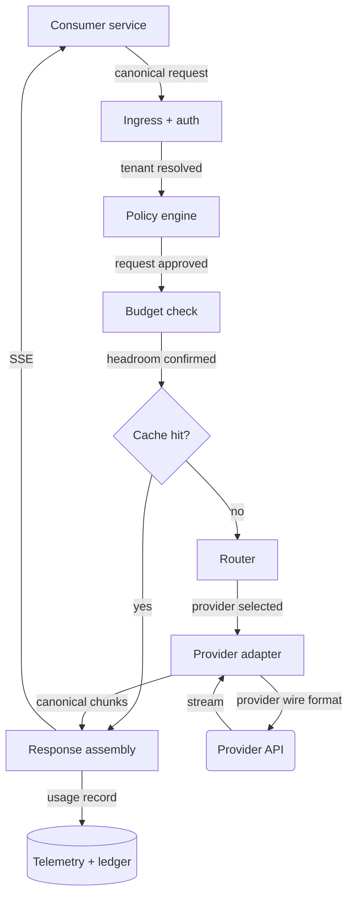

# Chapter 18 — The LLM Gateway

> A gateway is not a proxy with a nicer name. It is the only place in your
> architecture where model traffic is legible, and building it late costs more
> than building it wrong.

---

## Learning Objectives

By the end of this chapter you will be able to:

- Explain what an LLM gateway owns that an API gateway cannot, and why bolting
  model traffic onto an existing Kong or Envoy layer fails.
- Trace a streaming request through every stage of a gateway and identify the
  three points where a naive implementation loses data.
- Diagnose a provider brownout and explain why retries make it worse.
- Implement usage accounting that survives client disconnects mid-stream.
- Choose between fail-open and fail-closed for each gateway policy, and defend
  the choice.
- Size a gateway fleet using concurrency rather than requests per second.

---

## The Production Story

Consider a retail bank running four LLM features at the same time: a support
assistant, a document summarizer, an internal search tool, and a fraud-review
copilot. Each team held its own provider API key, called the provider SDK
directly from its own service, and expensed the bill to its own cost center.
Nobody thought this was elegant, but it worked, and there were features to ship.

On a Tuesday afternoon the provider entered a partial degradation. Not an
outage — the status page stayed green all day. Latency on the largest model went
from a p50 of about 4 seconds to a p50 of about 30 seconds, with a long tail past
90. Error rates barely moved.

The support assistant had a 30-second client timeout and a retry policy of three
attempts with a fixed 1-second backoff. When the provider slowed down, every
request timed out at 30 seconds and was retried. Then retried again. The
assistant's outbound request rate to the provider quadrupled within two minutes.

The provider's rate limiter, which the bank shared across all four teams' keys
through a shared organizational quota, started rejecting requests. Now the
document summarizer — which had done nothing wrong, had no traffic spike, and
had a perfectly reasonable timeout — began failing. So did fraud review. Nobody
on the summarizer team knew the support team existed.

The incident channel filled with four teams independently reporting that "the
LLM API is down." It was not down. It was slow, and the architecture converted
slowness into an outage.

Two questions took the next four hours to answer, and both should have been
instant. Which service caused the surge? And how much did the retry storm cost?
The answer to the second one was on a monthly invoice, undifferentiated by team,
and would not arrive for three weeks.

---

## Why This Exists

The first LLM feature in any company is built by calling the provider SDK
directly from an application service. This is correct. Building a gateway for one
consumer is architecture astronautics.

The second feature copies the first. The third copies the second. By the fourth,
the following facts are true and nobody has decided them:

- Provider API keys are distributed across four repositories and two secret
  managers, and rotating them requires coordinating four deploys.
- Nobody can answer "what did we spend on AI last month, by product" without
  reading a PDF invoice.
- Each team implemented retries differently. At least one of them implemented
  them wrong, and it is not obvious which.
- Switching providers, or adding a second one for redundancy, requires four
  separate migrations.
- There is no shared rate limiting, so any one team can exhaust the
  organizational quota for everyone.
- Safety filtering, PII redaction, and audit logging exist in whichever services
  had a compliance reviewer, which is not all of them.

Every one of these is a cross-cutting concern. Cross-cutting concerns get solved
at a chokepoint, and the gateway is that chokepoint.

### Why the API gateway you already have does not work

The obvious move is to add model routes to the existing edge gateway. Envoy,
Kong, and NGINX are all excellent proxies. They fail here for four specific
reasons.

**Requests are long and streaming.** A conventional API gateway is tuned for
requests that complete in tens of milliseconds. Model requests hold a connection
for tens of seconds while streaming server-sent events. Timeout defaults, buffer
settings, and connection pool sizing are all wrong out of the box, and the
failure mode when they are wrong is a silently truncated response rather than an
error.

**Cost is per-request and highly variable.** Two requests to the same endpoint
can differ in cost by three orders of magnitude. Rate limiting by request count
is nearly meaningless. You need to limit and account by tokens, and tokens are
only known after the response completes — which is after you have already spent
the money.

**The payload requires semantic handling.** Redacting PII, enforcing a system
prompt, counting tokens, and normalizing tool-call schemas all require parsing
and rewriting the body. A proxy that treats the body as an opaque byte stream
cannot do any of it.

**Failover is not stateless.** Retrying an HTTP GET against a second backend is
trivial. Retrying a request that has already streamed 400 tokens to the client is
not, and the difference determines your entire error-handling design.

A gateway is a stateful, payload-aware, cost-metering service. That is an
application, and you should build it like one.

---

## Core Concepts

**Gateway.** A service that terminates all model traffic from internal
consumers, applies policy, dispatches to one or more providers, and emits
telemetry. Single ingress, many egresses.

**Provider.** A third party serving model inference over an API. In this chapter,
providers are interchangeable at the interface level and very much not
interchangeable in behavior.

**Adapter.** The per-provider code that translates the gateway's canonical
request and response format to and from a provider's wire format. Adapters are
where every provider's peculiarities are quarantined.

**Canonical schema.** The gateway's own request and response shape. Consumers
code against this, never against a provider's. If a provider's schema leaks into
consumer code, you have built a proxy, not a gateway.

**Token budget.** A per-tenant allowance denominated in tokens or currency over a
window. Distinct from a rate limit, which is denominated in requests.

**Brownout.** Degraded provider performance without elevated error rates. The
dominant failure mode in practice, and the one most systems handle worst.

**Fail-open vs fail-closed.** Whether a policy check that cannot complete allows
the request through or rejects it. Budget checks should generally fail open;
PII redaction should generally fail closed. Every policy needs an explicit,
documented answer.

---

## Internal Architecture

A request moves through nine stages. The ordering is not arbitrary — each stage
depends on a fact established by the one before it.



*Every stage before the router is cheap and synchronous; everything after it is
slow and failure-prone. Put the work that can reject a request as early as
possible.*

**Stage 1 — Ingress and authentication.** Resolve the caller to a tenant and a
workload. "Tenant" is who pays; "workload" is which feature. You need both:
billing rolls up by tenant, and incident response needs workload granularity.
This is the stage the bank in the opening story was missing entirely, which is
why the question "which service caused this" took four hours.

**Stage 2 — Policy.** Request-shaped rules: which models this workload may call,
maximum output tokens, whether tool calling is permitted, whether the request
must carry a data-classification label. Cheap, deterministic, and it rejects bad
requests before they cost anything.

**Stage 3 — Budget.** Check remaining allowance for the tenant. The awkward part
is that you are checking a budget against a cost you cannot yet know. See
*Failure: budget overshoot* below.

**Stage 4 — Cache.** Exact-match caching on a hash of the normalized request is
safe and occasionally very effective — internal tooling with repeated prompts can
see hit rates above 30%. Semantic caching, where a nearby embedding counts as a
hit, is a much larger and much riskier idea; treat it as a product decision, not
an infrastructure one.

**Stage 5 — Routing.** Select a provider and model. Covered in depth in Chapter
19; here, assume a static mapping with a health-aware fallback.

**Stage 6 — Adapter, outbound.** Translate canonical to provider format. Attach
provider credentials, which consumers never see.

**Stage 7 — Provider call.** The long, slow, expensive part.

**Stage 8 — Adapter, inbound.** Translate the provider's stream back to canonical
chunks, incrementally, without buffering the whole response.

**Stage 9 — Response assembly and telemetry.** Forward chunks to the consumer,
accumulate usage, and write a ledger record when the stream ends — for any
definition of "ends," including the client hanging up.

### The three places a naive gateway loses data

**It buffers the stream.** The easiest way to write an adapter is to await the
full provider response, transform it, and return it. This works in tests and
destroys the product: time-to-first-token goes from 600 ms to 20 seconds, and the
gateway holds the entire response in memory for every concurrent request.
Adapters must transform incrementally.

**It writes the usage record on the success path only.** Usage arrives in the
final chunk of a provider stream. If the client disconnects at token 300 of 500,
that chunk never arrives — but the provider still generated and charged for the
tokens. A gateway that only records usage on clean completion under-reports
exactly the traffic that is misbehaving, which is exactly when you need the
numbers. Record usage in a `finally`, and estimate from the accumulated chunk
count when the authoritative number is missing.

**It retries after the first byte.** Once you have forwarded a chunk to the
consumer, you cannot transparently retry. The consumer has already rendered
partial text. A retry produces a different continuation, and the user watches the
answer rewrite itself. The rule: retries are free before first byte and forbidden
after it. This single constraint shapes the entire error-handling design, and it
is the thing most gateway implementations get wrong.

---

## Production Design

**Deploy it as a service, not a sidecar.** Sidecars share the fate of their host,
and the gateway's value is that it has a different fate. Central deployment also
means one place to see aggregate provider health, which sidecars cannot give you.

**Run at least three replicas across zones,** behind a load balancer configured
for long-lived connections. Set the LB idle timeout above your longest expected
generation — 120 seconds is a reasonable starting point — and above the
gateway's own upstream timeout, so that the gateway, not the LB, is the component
that decides a request has failed. An LB that times out first produces a
truncated stream with no error and no log line, which is the worst diagnostic
experience available.

**Size by concurrency, not RPS.** This is the single most common sizing mistake.
A gateway handling 50 requests per second where each request lasts 20 seconds is
holding roughly 1,000 concurrent connections. The relevant limits are file
descriptors, event-loop headroom, and upstream connection pool size — not CPU,
which will sit near idle. Little's Law is the whole capacity model here:
concurrency equals arrival rate times duration.

**Keep the hot path free of synchronous I/O.** Budget checks hit Redis; policy
lookups hit a config cache refreshed in the background; ledger writes go to a
buffered async channel with a bounded queue. If the ledger is full, drop records
and increment a counter — never block a customer request to write a billing row.

**Version the canonical schema from day one.** Consumers will code against it and
you will need to change it. A `schema_version` field costs nothing now and saves
a coordinated four-team migration later.

**Emit these metrics, labeled by tenant, workload, provider, and model:**

| Metric | Type | Why it matters |
| --- | --- | --- |
| `time_to_first_token` | histogram | The latency users actually perceive |
| `total_duration` | histogram | Capacity input for Little's Law |
| `tokens_in` / `tokens_out` | counter | Cost attribution and budget enforcement |
| `stream_interrupted` | counter | Split by cause: client, provider, gateway |
| `provider_status` | gauge | Circuit breaker state per provider |
| `queue_depth` | gauge | Leading indicator of concurrency exhaustion |
| `budget_headroom` | gauge | Alerting before a tenant hits a hard stop |

`time_to_first_token` and `total_duration` must be separate. A brownout usually
moves the second one long before the first, and a single blended latency metric
hides the divergence that is your earliest warning signal.

---

## Failure Scenarios

### Failure: provider brownout

**Symptom.** Consumer services report timeouts. Provider error rate is normal.
Provider status page is green. Multiple unrelated teams report the problem
simultaneously.

**Mechanism.** The provider is serving requests successfully but slowly, often
because of capacity pressure on a specific model. Client timeouts fire, clients
retry, retries add load, the provider slows further. The system converts a
latency problem into a capacity problem and then into an outage.

**Detection.** `total_duration` p50 rising while `provider_status` stays healthy
and the error-rate metric stays flat. A latency-aware circuit breaker — one that
trips on slow calls, not just failed ones — catches this; a conventional
error-rate breaker never trips at all.

**Mitigation.** Shed load deliberately. Reject low-priority workloads at the
policy stage with a clear error so consumers stop retrying. Route what remains to
a fallback provider or a smaller model. Reduce, do not increase, concurrency to
the degraded provider.

**Prevention.** Latency-based circuit breaking with a slow-call threshold.
Per-workload concurrency limits so no single consumer can consume the whole
upstream pool. Retry budgets rather than retry counts: cap retries at a fixed
percentage of total traffic, typically 10%, so that retries cannot become the
majority of your load no matter how many clients are misbehaving.

### Failure: the retry storm

**Symptom.** Outbound request rate to the provider is three to five times inbound
request rate from consumers. Costs spike far beyond the traffic increase.

**Mechanism.** Retries at multiple layers compose multiplicatively. The consumer
SDK retries three times; the gateway retries twice; the HTTP client library
retries once more on connection errors. Three layers of three attempts is
twenty-seven provider calls for one user request.

**Detection.** Alert on the ratio of `provider_requests` to `gateway_requests`.
Steady state should sit near 1.0. Anything above 1.3 sustained is a storm
forming. This one ratio is the highest-value alert in the whole system, and
almost nobody has it.

**Mitigation.** Set the retry budget to zero. Accept elevated error rates for the
minutes it takes the provider to recover. A fast failure the consumer can handle
beats a slow success that takes the platform down.

**Prevention.** Retries happen at exactly one layer, and that layer is the
gateway. Document it, and disable retries in every consumer SDK configuration.
Use exponential backoff with full jitter — fixed backoff synchronizes clients into
a thundering herd, which is precisely what the bank in the opening story built.

### Failure: silent stream truncation

**Symptom.** Users report answers that stop mid-sentence. No errors in any log.
Gateway metrics show successful requests. Reproduction is intermittent and
correlates with longer responses.

**Mechanism.** Something between the gateway and the consumer closed an idle
connection — a load balancer, a service mesh proxy, or a corporate egress
appliance. Because SSE has no framing that marks a stream as complete unless you
add one, a closed connection is indistinguishable from a finished response.

**Detection.** You cannot detect it without cooperation from the protocol. Emit
an explicit terminal event containing a stop reason and the usage totals, and
have consumers treat its absence as an error. Then alert on the rate of streams
that ended without one.

**Mitigation.** Raise idle timeouts on every hop, and send a heartbeat comment
line every 15 seconds during long generations so no hop sees the connection as
idle.

**Prevention.** Design the terminal event into the canonical schema before the
first consumer integrates. Retrofitting it requires changing every consumer, and
the failure it prevents is invisible until it is a customer complaint.

### Failure: budget overshoot

**Symptom.** A tenant's spend exceeds its configured cap, sometimes
substantially, despite budget enforcement being enabled and working.

**Mechanism.** The budget is checked before the request and decremented after it,
but cost is only known afterward. A tenant with 1,000 tokens of headroom and 200
concurrent in-flight requests can spend far more than 1,000 tokens, because all
200 requests passed the check while the ledger still read 1,000. This is a
straightforward read-modify-write race, made worse by the fact that the write is
delayed by tens of seconds.

**Detection.** Compare ledger totals against provider invoices monthly. A
persistent gap in the same direction is this bug, not rounding.

**Mitigation.** Reserve a pessimistic estimate at admission — `max_tokens` plus
the counted input tokens — and reconcile to actual on completion. Overshoot
becomes bounded by in-flight concurrency times the per-request maximum, which is
a number you can reason about and cap.

**Prevention.** Soft limits with alerting, not hard limits, for internal tenants.
A hard cap that stops a production feature mid-incident to save $40 is a worse
outcome than the overspend. Reserve hard caps for external, untrusted tenants
where the downside is unbounded abuse rather than a surprising invoice.

---

## Scaling Strategy

Things break in a specific order. Knowing the order tells you what to instrument
before you need it.

**First: upstream connection pool exhaustion, around 100–200 concurrent
requests.** Default HTTP agent pools in most runtimes are far too small for
workloads where connections are held for 20 seconds. Requests queue inside the
client library, invisibly, and appear to you as latency with no corresponding
provider-side latency. Raise the pool ceiling, and export queue depth — an
unexported queue is a blind spot that will cost you an afternoon.

**Second: event-loop starvation, around 1,000–2,000 concurrent streams on a
single Node process.** Not CPU exhaustion — the profile is mostly idle. The cause
is per-chunk work: parsing SSE frames, re-serializing them, incrementing
counters. At high chunk rates this becomes thousands of small synchronous tasks
per second. Scale horizontally; a single process does not go much past this, and
optimizing the parser buys you perhaps 30% before you hit it again.

**Third: the telemetry pipeline, around 5,000 concurrent streams.** Per-chunk
metrics or spans overwhelm the collector before the gateway itself struggles.
Sample aggressively: one span per request, not per chunk, with chunk-level detail
only for traces already sampled in.

**Fourth: the budget store, around 10,000 requests per second of check-and-
reserve.** A single Redis key per tenant becomes a hot key. Shard the counter
into N sub-counters per tenant and reconcile them periodically, accepting slight
imprecision in exchange for removing the contention point.

Beyond that you are into regional partitioning, which is Chapter 19's problem.

---

## Trade-offs

| Decision | Buys you | Costs you | Choose when |
| --- | --- | --- | --- |
| Central gateway service | Cost attribution, one key store, uniform policy | An extra network hop (~5 ms) and a new tier to run | Three or more consumer services, always |
| Sidecar gateway | No extra hop, no shared fate | No aggregate view, N× deploys for policy changes | Extreme latency sensitivity, single tenant |
| Canonical schema | Provider portability, consumers insulated | Adapter maintenance, lags new provider features | You expect to use more than one provider |
| Provider passthrough | Zero translation lag, day-one feature access | Provider lock-in in every consumer | One provider, and you have accepted that |
| Streaming passthrough | Low time-to-first-token, low memory | Retries impossible after first byte | Interactive UX, which is most cases |
| Buffered responses | Retries, full-response inspection, simpler code | Time-to-first-token equals total duration | Batch and async workloads only |
| Hard budget caps | Bounded spend, safe for untrusted tenants | Production features can stop mid-incident | External tenants, unbounded abuse risk |
| Soft caps with alerts | Never the cause of an outage | Requires someone to answer the alert | Internal tenants, always |
| Exact-match cache | Free latency and cost wins, zero correctness risk | Low hit rate on user-facing traffic | Everywhere; there is no argument against it |
| Semantic cache | High hit rates on FAQ-shaped traffic | Returns answers to questions nobody asked | Rarely, and never without eval coverage |

---

## Code Walkthrough

From `examples/ch18-llm-gateway/`. The full service is about 900 lines; the two
pieces below are the ones that are subtly hard.

### Streaming adapter with usage capture

The contract: transform incrementally, never buffer, and always produce a usage
record — including when the consumer disconnects mid-stream.

```ts
// examples/ch18-llm-gateway/src/adapter/stream.ts

export async function* streamCompletion(
  req: CanonicalRequest,
  provider: ProviderAdapter,
  signal: AbortSignal,
  onUsage: (u: Usage) => void,                        // (1)
): AsyncGenerator<CanonicalChunk> {
  const started = performance.now();
  let firstByteAt: number | null = null;
  let outputChunks = 0;
  let authoritative: Usage | null = null;

  try {
    for await (const raw of provider.stream(req, signal)) {
      const chunk = provider.toCanonical(raw);         // (2)
      if (chunk === null) continue;

      if (chunk.kind === 'usage') {
        authoritative = chunk.usage;                   // (3)
        continue;
      }

      if (firstByteAt === null) firstByteAt = performance.now();
      outputChunks += 1;
      yield chunk;
    }
    yield { kind: 'terminal', stop: 'complete' };      // (4)
  } catch (err) {
    if (firstByteAt === null) throw err;               // (5)
    yield signal.aborted                               // (6)
      ? { kind: 'terminal', stop: 'aborted' }
      : { kind: 'terminal', stop: 'error', detail: describe(err) };
  } finally {
    onUsage(                                           // (7)
      authoritative ?? {
        inputTokens: req.countedInputTokens,
        outputTokens: estimateFromChunks(outputChunks),
        estimated: true,
      },
    );
    metrics.observe('time_to_first_token',
      (firstByteAt ?? performance.now()) - started);
    metrics.observe('total_duration',
      performance.now() - started);
  }
}
```

1. Usage reporting is a callback, not a return value. A generator that is
   abandoned never returns, and abandonment is exactly the case we must not lose.
2. Translation happens per chunk. There is no point at which the whole response
   exists in memory.
3. Providers deliver authoritative usage in a trailing frame. It may never
   arrive; the code must not depend on it.
4. The explicit terminal event. Without this, a truncated stream and a complete
   one look identical to the consumer — see *Failure: silent stream truncation*.
5. The retry boundary, in one line. Before first byte, throw and let the router
   retry against another provider. After first byte, degrade to a terminal event
   so the consumer keeps the partial text it has already rendered.
6. A client hanging up is not an error, and conflating the two makes your
   `stream_interrupted` metric useless — you cannot tell "users are closing the
   tab" from "the provider is dropping connections" if both increment the same
   counter with the same label.
7. `finally` runs when the consumer disconnects and the generator is collected.
   This is the only reason the usage record survives a client hang-up.

### Latency-aware circuit breaker

A conventional breaker counts errors. During a brownout the error rate is normal,
so it never trips. This one counts slow calls too.

```ts
// examples/ch18-llm-gateway/src/router/breaker.ts

export const DEFAULT_BREAKER: BreakerOptions = {
  slowCallMs: 20_000,                                 // (1)
  slowCallRateThreshold: 0.5,
  minSamples: 20,
  openForMs: 30_000,
  windowMs: 30_000,
  halfOpenProbability: 0.1,
};

export class LatencyBreaker {
  enabled = false;

  private opts: BreakerOptions;
  private window: Sample[] = [];
  private openedAt: number | null = null;

  constructor(opts: Partial<BreakerOptions> = {}) {
    this.opts = { ...DEFAULT_BREAKER, ...opts };
  }

  allow(): boolean {
    if (!this.enabled) return true;
    if (this.openedAt === null) return true;
    if (Date.now() - this.openedAt < this.opts.openForMs) return false;
    return Math.random() < this.opts.halfOpenProbability;   // (2)
  }

  record(durationMs: number, failed: boolean): void {
    if (!this.enabled) return;

    this.window.push({ at: Date.now(), durationMs, failed });
    const cutoff = Date.now() - this.opts.windowMs;
    this.window = this.window.filter((s) => s.at >= cutoff);

    if (this.window.length < this.opts.minSamples) return;

    const bad = this.window.filter(
      (s) => s.failed || s.durationMs > this.opts.slowCallMs,
    ).length;                                                // (3)

    if (bad / this.window.length >= this.opts.slowCallRateThreshold) {
      this.openedAt = Date.now();
      this.window = [];                                      // (4)
    }
  }
}
```

1. Threshold in absolute milliseconds, not a multiple of p50 — during a brownout
   the p50 drifts upward and a relative threshold chases it forever, never
   tripping. Set it from your product's latency budget instead.
2. Probabilistic half-open. Letting 10% of traffic through avoids the herd that a
   binary open/closed transition produces when the provider recovers.
3. Slow calls and failed calls are counted together. This line is the entire
   point of the class.
4. Clear the window on trip, so recovery is judged on fresh samples rather than
   fighting the history that caused the trip.

---

## Hands-On Lab

**Goal:** reproduce the bank's Tuesday on your laptop, then stop it. About 90
seconds of runtime, Node 22.6+, no dependencies and no API key.

```bash
cd examples/ch18-llm-gateway
node scripts/lab.mjs
```

That runs all five steps and asserts thirteen claims. The rest of this section
explains what it is checking and why. To drive it by hand, start
`src/mock-provider/server.ts` and `src/gateway.ts` in two terminals and issue the
commands below.

The mock provider serves a deterministic token stream and accepts fault
injection. Timings throughout are compressed by roughly 5× so the lab finishes in
minutes — the upstream timeout is 4 seconds rather than 30. The ratios are the
lesson, not the absolute numbers.

**Step 1 — establish a baseline.**

```bash
node src/load.ts --rps 20 --duration 10s
```

Observed: `amplification` (the ratio of provider requests to gateway requests)
sits at 1.00. `time_to_first_token` p50 of 2 ms, `total_duration` p50 of 336 ms.
Note that the two metrics are already an order of magnitude apart, which is why
§Production Design insists on keeping them separate.

**Step 2 — induce the brownout, with the retry configuration the bank had.**

```bash
curl -X POST localhost:8080/admin/config \
  -d '{"retryBudgetRatio": 1.0, "maxAttempts": 3}'
curl -X POST localhost:8081/fault \
  -d '{"latencyMs": 12000, "errorRate": 0.0}'
node src/load.ts --rps 10 --duration 20s
```

Observed: amplification climbs to 2.0 and keeps rising with run length, while the
provider returns zero errors for the entire run. The breaker — which is enabled
but configured conventionally — never leaves the `closed` state, because there is
nothing in its error window to trip on. This is the bank's Tuesday.

Notice what had to be true for the storm to form: the gateway needed an upstream
timeout. Without one, a brownout produces slow successes rather than failures, no
retry ever fires, and the system degrades gracefully into unusability instead of
collapsing. The timeout is correct and necessary — but it is also the mechanism
that converts a latency problem into a load problem, and it is worth sitting with
that for a moment before continuing.

**Step 3 — enable the latency-aware breaker.**

```bash
curl -X POST localhost:8080/admin/config \
  -d '{"breaker": {"enabled": true, "slowCallMs": 3000}}'
node src/load.ts --rps 10 --duration 20s
```

Observed: amplification falls to 0.89 — below 1.0, because the gateway is now
rejecting most requests without calling the provider at all. 140 of 199 requests
are shed. Consumer-visible error rate goes to 100% and stays there.

That is the correct outcome, and it is worth being precise about why. The gateway
has not fixed anything. It has stopped amplifying, which means the provider gets
a chance to recover and the three other teams sharing the organizational quota
are unaffected. Failing fast is not a fix; it is refusing to make things worse.

**Step 4 — verify accounting survives disconnects.**

```bash
node src/load.ts --rps 5 --duration 8s --abort-after 0.15s
curl localhost:8080/ledger
```

Observed: 39 ledger rows, every one of them flagged `estimated: true` and
attributed `stop: "aborted"`, together accounting for 703 output tokens the
provider generated and charged for after the client had already hung up.

Now comment out the `finally` block in `adapter/stream.ts` and rerun. All 39 rows
disappear. That is the under-reporting bug from §Internal Architecture, and it
under-reports precisely the traffic you most need to see.

**Step 5 — watch a hard cap bound the overshoot.**

```bash
node src/load.ts --rps 10 --duration 8s --tenant externalco
```

`externalco` is seeded with a hard 2,000-token cap. Observed: 38 requests
complete, 41 are rejected with `budget_exhausted`, and headroom bottoms out at 24
tokens — never negative. Reserve-then-reconcile is what keeps it non-negative;
check-then-spend would have gone deep into the red at this concurrency.

---

## Interview Questions

1. Why can't you put LLM traffic behind your existing API gateway?
2. A provider's p50 latency triples but its error rate stays flat. Walk me
   through what happens to a system with default retry configuration.
3. How do you enforce a spend cap when you don't know a request's cost until
   after you've paid it?
4. Your gateway streams responses. A consumer reports answers cutting off
   mid-sentence, and there are no errors anywhere. How do you find the cause?
5. How do you decide whether to retry a failed model request?
6. You need to size a gateway fleet. What do you ask for, and what do you compute?
7. Design a canonical request schema across three providers with incompatible
   tool-calling formats. What do you do when one adds a feature the others lack?
8. Should the gateway fail open or fail closed when the budget store is
   unreachable?

## Staff-Level Answers

**Q2 — brownout with retries.** *(This one is worth reading closely, because it
is where the senior and staff answers diverge most visibly.)*

A senior answer describes the mechanism: timeouts fire, clients retry, load
multiplies, the provider degrades further. That is correct and incomplete.

A staff answer starts with the same mechanism and then does three more things.
It names the amplification factor as a function of the retry configuration —
three layers of three attempts is 27×, and the first question is how many layers
retry. It identifies the detection signal that most teams lack: the ratio of
outbound provider requests to inbound consumer requests, which is the only metric
that distinguishes a retry storm from a genuine traffic spike. And it states the
architectural fix as a rule rather than a tuning change: retries happen at
exactly one layer, with a budget expressed as a percentage of traffic rather than
a count per request, because a count per request cannot bound total load.

Then it names the trade-off, which is the part that actually signals staff level:
a retry budget of zero means accepting elevated user-facing errors during
provider degradation. That is the right call, and it is a call, and someone
outside engineering needs to have agreed to it before the incident rather than
during it.

**Q3 — spend caps under unknown cost.** Reserve pessimistically, reconcile
actually. At admission, count input tokens and add `max_tokens` for the ceiling;
decrement that reservation from the tenant's allowance. On completion, replace
the reservation with the authoritative number from the provider's trailing usage
frame.

The property this buys you is a bounded overshoot: worst case is in-flight
concurrency times per-request maximum, which is a number you control through
per-tenant concurrency limits. Unbounded overshoot becomes bounded overshoot,
which is the actual goal — exact enforcement is not achievable and chasing it
wastes time.

Then push back on the premise. For internal tenants, a hard cap is usually the
wrong instrument. Stopping a production feature mid-incident to save a few
hundred dollars is a bad trade, and the failure mode is worse than the thing it
prevents. Soft caps with escalating alerts, hard caps only for external tenants
where the downside is unbounded abuse.

**Q5 — retry decision.** One rule dominates everything else: retries are free
before the first byte reaches the consumer and forbidden after it. Before first
byte, nothing has been observed, so retrying against another provider is
transparent. After first byte, the consumer has rendered text, and a retry
produces a different continuation that visibly rewrites itself on screen.

Given that rule, the design falls out. Buffer nothing, but hold the first chunk
until you have decided the stream is healthy. Retry on connection errors,
5xx, and 429 with full jitter; never retry 4xx other than 429, because the
request is malformed and will stay malformed. Cap retries with a budget expressed
as a percentage of total traffic. And put the retry logic in exactly one layer.

The staff addition: this constraint is why streaming and automatic failover are
in tension, and the tension is not resolvable in general. You choose per
workload. Interactive chat takes streaming and gives up post-first-byte failover.
Batch summarization buffers and gets full retry semantics. A platform should
support both modes explicitly rather than picking one and hoping.

**Q8 — fail open or closed on budget store outage.** Fail open, and say why in
one sentence: the budget store protects against an unbounded invoice, and a
gateway-wide outage is more expensive than a few minutes of unmetered spend.

Then qualify it, because an unqualified answer to a fail-open question is a red
flag. Fail open with a circuit-breaker-style cap — allow unmetered traffic for a
bounded window, alert immediately, and fail closed if the store stays unreachable
past that window. Fail closed for external tenants regardless, because there the
exposure is abuse rather than overrun.

The general principle, which is what the interviewer is fishing for: fail open
when the policy protects money, fail closed when it protects data or safety. PII
redaction fails closed. Budget checks fail open. Every policy in the gateway
should have a documented answer, decided when the policy is written rather than
during the incident that first hits it.

---

## Exercises

1. **Amplification math.** Consumer SDK retries twice, gateway retries twice,
   HTTP client retries once on connect errors. Compute worst-case provider calls
   per user request. Now compute it with a 10% retry budget at the gateway only.
2. **Add a provider.** Implement an adapter for a second mock provider in
   `examples/ch18-llm-gateway/src/adapter/` whose stream format differs — chunks
   arrive as a JSON array with a different finish-reason vocabulary. Do not
   change any consumer code. If you have to, your canonical schema is leaking.
3. **Instrument the blind spot.** Export upstream connection pool queue depth as
   a gauge. Drive the gateway to 300 concurrent requests with a pool ceiling of
   50 and show the queue depth rising while provider-side latency stays flat.
4. **Break the terminal event.** Remove the terminal event from the canonical
   schema and write a consumer that cannot distinguish a truncated response from
   a complete one. Then propose the smallest schema change that fixes it without
   breaking existing consumers.
5. **Design question, no code.** Your gateway must support a workload that needs
   guaranteed failover and a workload that needs sub-second time-to-first-token.
   Write the one-page RFC. Chapter 32 covers the format.

---

## Further Reading

- **Anthropic, OpenAI, and Google API references** — read all three side by side,
  specifically the streaming and tool-calling sections. The differences between
  them are the entire justification for the adapter layer, and reading them
  together makes the canonical schema design obvious in a way that no amount of
  prose about it will.
- **Nygard, *Release It!*, 2nd ed., chapters on stability patterns** — circuit
  breakers, bulkheads, and timeouts, written before LLMs existed and applying to
  them almost without modification. The brownout discussion predates the term.
- **Brooker, "Timeouts, retries, and backoff with jitter" (AWS Builders' Library)**
  — the definitive short treatment of why fixed backoff synchronizes clients into
  a herd. Twenty minutes, and it will change your retry configuration.
- **Google SRE Book, chapter 21, "Handling Overload"** — the source of retry
  budgets as a percentage of traffic rather than a per-request count. Section on
  criticality maps directly onto per-workload load shedding.
- **The SSE section of the WHATWG HTML specification** — short, and it makes
  clear that the protocol has no completion semantics. This is why you build your
  own terminal event, and reading the spec is faster than being convinced by
  argument.
- **Envoy's documentation on the External Processing filter** — worth reading
  even if you build in-process, because it is a well-designed answer to the
  question of how much payload awareness you can push into a general proxy, and
  where that stops working.
