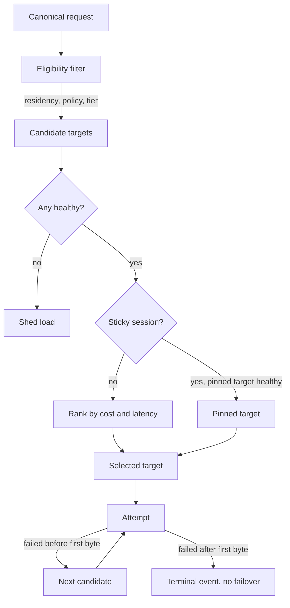

# Chapter 19 — Multi-Provider Routing and Failover

> Failover between providers is easy to build and hard to trust, because the
> second provider does not produce the same output as the first and your
> monitoring is not looking at output.

---

## Learning Objectives

By the end of this chapter you will be able to:

- Distinguish the four genuine reasons to run multiple providers from the three
  bad ones, and argue against multi-provider when it is not warranted.
- Explain why failover is not retry, and what changes when the second attempt
  goes somewhere else.
- Design a routing table that expresses capability, cost, health, and residency
  constraints without becoming unreadable.
- Detect a silent quality regression after failover, which is the failure mode
  that actually hurts.
- Decide when hedged requests are worth their cost multiplier.
- Explain what provider-side prompt caching does to your routing freedom.

---

## The Production Story

An insurance document platform ran extraction over policy PDFs — coverage limits,
effective dates, named insureds — feeding structured output into a downstream
rating engine. The team had done the responsible thing and built multi-provider
failover from the start. Primary provider, secondary provider, health checks,
automatic cutover. It had been tested. It worked.

On a Thursday the primary provider degraded and the gateway failed over. Cutover
took about eleven seconds. No alerts fired, because none of the things the team
alerted on had changed: availability stayed at 100%, latency stayed within
budget, error rate stayed at zero. The failover was, by every measure on the
dashboard, a complete success. Someone posted a note in the channel that the
system had ridden out a provider incident without anyone noticing. It was
briefly a good day.

The primary recovered four hours later and the gateway failed back.

Nine days after that, a rating analyst opened a ticket saying that a batch of
policies had come through with effective dates in the wrong field. Not many —
maybe 3% of the batch. It looked like a data entry problem, and it was routed to
the data quality queue, where it sat for another four days.

When someone eventually correlated the affected policy IDs against ingestion
timestamps, all of them landed inside the four-hour failover window. The
extraction prompt had been iterated on for months against the primary provider.
It relied on a particular way that provider handled a nested JSON schema with
optional fields. The secondary provider handled that schema differently — not
incorrectly, just differently — and silently flattened one level of nesting in a
minority of documents.

Every request during those four hours succeeded. Every response was valid JSON.
Every response was well-formed against the schema. Roughly 3% of them were wrong,
and the system that was supposed to catch that was a dashboard measuring
availability.

---

## Why This Exists

The pitch for multi-provider is redundancy, and redundancy is the weakest of the
real reasons. Providers are more reliable than the story above suggests, and a
failover path you exercise once a quarter is a failover path that has quietly
rotted. Before building this, be honest about which reason you actually have.

**Four reasons that hold up:**

*Capability matching.* Providers have genuinely different strengths, and the
differences are large enough to matter at the task level. Routing long-context
summarization one way and high-volume classification another is not vendor
hedging; it is using the right tool.

*Cost structure.* Capability tiers differ by more than an order of magnitude in
price. If 80% of your traffic is classification that a small model handles at
parity, routing it to a frontier model is a straightforward waste. This is
usually the reason with the clearest payback.

*Capacity and quota.* Provider rate limits are negotiated, finite, and slow to
raise. A second provider is sometimes the fastest available capacity increase,
particularly during a launch.

*Data residency and compliance.* Some workloads must run in a jurisdiction, or on
a specific deployment, or under a specific contract. This is not a preference and
does not negotiate.

**Three reasons that do not hold up:**

*"We don't want lock-in."* Portability has a running cost: you are limited to the
intersection of provider features, you maintain N adapters, and you tune prompts
N times or accept that they are tuned for one. Lock-in is a real risk and this is
a real price. Pay it deliberately, for a named workload, not as a reflex.

*"For redundancy"* — without a tested, continuously exercised failover path. An
untested failover path is not redundancy, it is a second way to fail, and the
story above is what that looks like.

*"To benchmark providers against each other."* Reasonable goal, wrong mechanism.
That is an evaluation harness (Chapter 21), run offline, not a production routing
layer.

### Failover is not retry

Chapter 18 established that retries are free before the first byte and forbidden
after it. Failover inherits that constraint and adds a harder one.

A retry sends the same request to the same place and expects the same
distribution of outcomes. A failover sends the same request somewhere else, and
the output distribution changes. The response will be valid. It will be
plausible. It may be differently structured, differently formatted, differently
hedged, or differently wrong. Everything downstream of the gateway that made
assumptions about the primary's output — parsers, schema validators tuned to a
particular quirk, prompt chains, few-shot examples, the human reviewers who
learned what normal looks like — is now receiving something else.

This is why multi-provider is a testing and evaluation problem wearing an
infrastructure costume. The routing code is a weekend. The confidence that
failover does not silently degrade your product is a quarter.

---

## Core Concepts

**Capability tier.** An abstraction over specific models: `frontier`, `mid`,
`small`. Consumers request a tier and a task, never a model name. This is the
single most important design decision in the chapter — model names in consumer
code are the thing that makes providers unswappable.

**Route.** A rule mapping a request's attributes (tier, workload, tenant,
residency) to an ordered list of provider targets.

**Target.** A specific provider plus model plus deployment plus region.

**Preference order.** The ordered targets for a route. First healthy target wins.

**Failover.** Automatic movement to the next target after a failed attempt.

**Fallback tier.** Degrading to a cheaper or smaller target under pressure, which
is a different decision from failing over to a peer.

**Hedged request.** Dispatching to two targets concurrently and taking whichever
responds first, cancelling the other.

**Sticky routing.** Pinning a conversation to the target that served its first
turn.

**Semantic equivalence.** The property that two targets produce
interchangeable-quality output for a task. It is never free, rarely verified, and
always the thing that breaks.

---

## Internal Architecture

Routing slots into stage 5 of the Chapter 18 pipeline. It decomposes into four
decisions made in a fixed order, each narrowing the candidate set.



*Eligibility is a hard filter and runs first; ranking is a soft preference and
runs last. Inverting them is how residency violations happen.*

**Eligibility filtering is a hard constraint.** Residency, tenant policy, and
capability tier remove targets from consideration entirely. A target that is
ineligible is never selected, no matter how healthy or cheap. Model this as a
filter, not as a weight — the moment residency is a scoring input rather than a
gate, some combination of health and cost will eventually outrank it, and you
will discover this during an audit.

**Health gating is a hard constraint, evaluated second.** Each target carries the
latency-aware breaker from Chapter 18. Open breakers are removed from the
candidate set. If the set empties, shed load rather than sending traffic to a
target you know is broken.

**Stickiness overrides ranking.** If the request belongs to a conversation
already served by an eligible, healthy target, use that target. Provider-side
prompt caching makes this worth real money — a cached prefix is substantially
cheaper and faster than an uncached one, and moving providers mid-conversation
throws that away. It also keeps the assistant's voice consistent within a
session, which users notice even when they cannot name it.

**Ranking is a soft preference, applied last.** Among eligible, healthy,
non-sticky candidates, order by cost then observed latency. Keep this simple. A
routing layer with a learned scoring function is a system nobody can debug at 3
a.m., and the wins over "cheapest healthy target" are smaller than the debugging
cost.

### The routing table

Express routes as data, not code. This one is a policy artifact — auditors,
security reviewers, and finance all have legitimate reasons to read it.

```yaml
routes:
  - match: { tier: small, workload: "*" }
    targets: [provider_a.small, provider_b.small]

  - match: { tier: frontier, workload: policy-extraction }
    # Deliberately single-target. Chapter 19's opening story is why.
    # Prompts are tuned to provider_a's schema handling; failover has
    # never passed the extraction eval. Do not add a target here
    # without an eval run on the extraction set.
    targets: [provider_a.frontier]

  - match: { tier: frontier, residency: eu }
    targets: [provider_a.frontier.eu]

  - match: { tier: frontier, workload: "*" }
    targets: [provider_a.frontier, provider_b.frontier]
```

The comment on the second route is the most valuable line in the file, and it is
worth stating why explicitly. A single-target route in a multi-provider system
looks like an oversight. Somebody will "fix" it. The comment converts an
invisible decision into a visible one, and that is most of what configuration
review is for.

---

## Production Design

**Consumers request tiers, never models.** If a model name appears in consumer
code, that consumer cannot be routed. This constraint is easy to hold on day one
and nearly impossible to retrofit, because by then the model name is in a
database column, three config files, and a dashboard.

**Every route with more than one target needs a passing eval on every target.**
This is the load-bearing rule of the chapter. A target that has not passed the
route's eval set is not a fallback; it is an untested code path that runs only
during incidents, which is the worst possible time to first execute it. Wire this
into CI: adding a target to a route without a corresponding eval run should fail
the build.

**Exercise failover continuously, not during incidents.** Route 1–5% of
production traffic to the secondary target permanently. This costs a little money
and buys three things: the path is warm, the quality signal is continuous, and
the credentials are known to work. A failover path exercised only during
incidents will fail during an incident.

**Label every telemetry event and ledger row with the target.** Chapter 18's
ledger already carries `provider`; add model, deployment, and region. Without
this, correlating a quality regression against a routing change requires the
archaeology the insurance team spent thirteen days on.

**Alert on routing distribution, not just health.** A sudden shift in the share
of traffic going to each target is the earliest signal that something changed.
This alert fires before latency moves and long before anyone notices output
quality.

**Keep prompts per target if they differ.** The instinct is to keep one prompt
for portability. The insurance story is what that instinct costs. If a workload's
prompt is tuned to a target, store it against the target and version it with the
route, and accept that this is part of the price of multi-provider.

---

## Failure Scenarios

### Failure: silent quality regression after failover

**Symptom.** Nothing. Availability, latency, and error rate are all nominal.
Downstream data quality degrades by a few percent. Discovery is by human
complaint, typically one to three weeks later.

**Mechanism.** The secondary target produces valid, well-formed, plausible output
that differs from the primary's in a way the prompt was implicitly relying on.
Structured extraction is the most exposed case because the damage is machine-
readable and flows straight into downstream systems, but free-text workloads have
the same problem with worse detectability.

**Detection.** Requires an output-quality signal, which availability monitoring
cannot provide. Two mechanisms, both cheap relative to the damage: run a small
golden set against every target continuously, alerting on divergence, and emit a
per-target distribution of a cheap structural proxy — schema validation pass
rate, output length percentiles, refusal rate, field-population rate. A 3%
flattening of a nested field moves the field-population distribution immediately,
days before a human notices.

**Mitigation.** Fail back, then quarantine and reprocess everything served by the
secondary during the window. This is only possible if the ledger records which
target served each request, which is why that field is not optional.

**Prevention.** No target enters a route without passing that route's eval set.
Continuous 1–5% traffic to the secondary so the quality signal exists in steady
state rather than only during incidents.

### Failure: correlated provider failure

**Symptom.** Both providers degrade simultaneously. Failover finds no healthy
target. The gateway sheds all traffic.

**Mechanism.** Independence was assumed and not verified. Providers can share
underlying cloud regions, and the accelerator supply chain is concentrated enough
that capacity crunches correlate. Your own network path can also be the common
factor, in which case both providers are fine and you are not.

**Detection.** Simultaneous breaker trips across targets that are supposed to be
independent. Alert on "count of healthy targets" per route, not on per-target
health, so the alert fires on the condition you actually care about.

**Mitigation.** Degrade the feature rather than the platform. Serve a cached
response, a non-LLM fallback, or an honest "this feature is temporarily
unavailable." Decide which of these before the incident, because deciding during
one produces whichever is fastest to ship rather than whichever is right.

**Prevention.** Ask providers where they run, and route across genuine
infrastructure diversity where the workload justifies it. Accept that full
independence is unachievable and design the degraded mode properly instead.

### Failure: routing churn destroys prompt caching

**Symptom.** Cost per request rises 30–60% with no traffic change. Time-to-first-
token rises. Both start immediately after a routing change.

**Mechanism.** Provider-side prompt caching gives a large discount and latency
improvement on a repeated prefix. Cost-based ranking that reevaluates on every
request moves conversations between targets mid-session, and every move is a cold
prefix. The router optimizes the per-request price it can see and destroys the
caching discount it cannot.

**Detection.** Cache hit rate per target against session-to-target cardinality. If
the average conversation touches more than one target, this is happening.

**Mitigation.** Turn on stickiness. Pin conversations to their first target for
their lifetime.

**Prevention.** Make stickiness the default for anything multi-turn and treat
cache-adjusted cost, not list cost, as the ranking input. This failure is
particularly annoying because the router is behaving exactly as designed.

### Failure: quota exhaustion cascade

**Symptom.** Primary target starts returning rate-limit errors. Traffic fails over
to the secondary. The secondary hits its own quota within minutes. Both targets
are now rate-limited and the system is fully down.

**Mechanism.** The secondary was provisioned for its steady-state share of
traffic, not for the primary's full load. Failover moved 100% of traffic onto a
target sized for 5%.

**Detection.** Alert on the ratio of current throughput to provisioned quota per
target, not on rate-limit errors, which arrive too late to act on.

**Mitigation.** Shed load by workload priority before the secondary saturates.
This requires having classified workloads by criticality in advance — the Google
SRE material on criticality is directly applicable and worth reading before you
need it.

**Prevention.** Provision the secondary for the load it takes during failover,
not its steady-state share, or accept explicitly and in writing that failover is
partial and sheds low-priority traffic. Both are defensible. Assuming the first
while having built the second is not.

---

## Scaling Strategy

**First: routing table comprehensibility, at roughly 20 routes.** The binding
constraint here is human, not computational. Past about twenty routes nobody can
predict where a given request lands, and the table starts accumulating rules
added to fix incidents whose reasons are forgotten. Mitigate with a `route
explain` endpoint that takes a request and returns the matched rule, the
eligibility decisions, and the ranking — this pays for itself the first time
someone asks why a request went somewhere unexpected.

**Second: health-check cost, at roughly 50 targets.** Active health checks against
every target from every gateway replica is O(replicas × targets) of pure overhead
traffic, and providers will notice. Derive health passively from live traffic
where volume permits, and reserve active probing for targets with no traffic.

**Third: config propagation, at roughly 100 gateway replicas.** Routing changes
must reach every replica quickly and atomically — a partial rollout means
different replicas route the same request differently, which produces the least
debuggable class of incident there is. Version the routing table, propagate the
version, and expose the active version in the metrics endpoint so a split brain
is visible rather than inferred.

**Fourth: cross-region routing, past a single region.** At this point routing
becomes a distributed systems problem: where does the session-to-target map live,
what happens on partition, and is the answer allowed to differ per tenant for
residency reasons. This is genuinely hard, and Chapter 31 treats it properly.

---

## Trade-offs

| Decision | Buys you | Costs you | Choose when |
| --- | --- | --- | --- |
| Single provider | Prompts tuned once, newest features, simplest ops | Correlated failure, no cost arbitrage | Until you have a named reason not to |
| Multi-provider, same tier | Redundancy, capacity headroom | N evals per route, N prompt variants | Capacity or residency forces it |
| Capability tiers in the API | Consumers become routable | An abstraction that lags provider features | Always; retrofitting is far worse |
| Model names in the API | Day-one access to new features | Consumers are unroutable forever | Never, in a platform |
| Sticky routing | Prompt cache hits, consistent voice | Slower rebalancing, uneven target load | Any multi-turn workload |
| Per-request ranking | Optimal per-request cost | Destroys prompt caching | Single-turn, high-volume, cache-irrelevant |
| Hedged requests | Cuts tail latency hard | Pays for every hedge, ~1.8x cost | Latency-critical, low-volume, well-funded |
| Cascade (small then escalate) | Large cost reduction | Added latency on escalation, needs a confidence signal | High-volume, mostly-easy traffic |
| Continuous 1–5% to secondary | Failover that actually works | A little money, some quality variance | Any route with more than one target |
| Failover only during incidents | Costs nothing in steady state | A path first exercised under load | Never |

Two of these deserve a note.

**Hedged requests** are the most misunderstood entry. Dispatching to two targets
and taking the first response roughly doubles cost for the hedged fraction, and
the benefit is entirely in the tail — p99 improves substantially, p50 not at all.
Hedge a small percentage of requests selected by elapsed time (hedge only if the
first target has not responded within, say, p95), not unconditionally. Unconditional
hedging is how a platform doubles its bill to fix a problem three users had.

**Cascade routing** is where the real money is for most platforms, and it is
underused because it needs something most systems lack: a signal for when the
small model's answer is not good enough. Without that signal you are guessing,
and guessing wrong sends a bad answer to a user to save a fraction of a cent.
Build the confidence signal first — Chapter 21 — then the cascade.

---

## Code Walkthrough

From `examples/ch19-routing/`. The router slots into stage 5 of the Chapter 18
gateway; the breaker and streaming machinery are unchanged.

```ts
// examples/ch19-routing/src/router/select.ts

export function selectTargets(
  req: CanonicalRequest,
  table: RoutingTable,
  health: HealthView,
  session: SessionPin | null,
): Selection {
  const route = table.match(req);                          // (1)
  if (route === null) {
    return { targets: [], reason: 'no_matching_route' };
  }

  // Hard filters first. Residency is a gate, never a weight.
  const eligible = route.targets.filter(
    (t) =>
      table.residencyOf(t) === req.residency &&            // (2)
      table.tierOf(t) === req.tier,
  );

  const healthy = eligible.filter((t) => health.isClosed(t));
  if (healthy.length === 0) {
    return { targets: [], reason: 'no_healthy_target' };   // (3)
  }

  // Stickiness overrides ranking, but never eligibility.
  if (session !== null && healthy.includes(session.target)) {
    return {                                               // (4)
      targets: [session.target, ...healthy.filter((t) => t !== session.target)],
      reason: 'sticky',
    };
  }

  const ranked = [...healthy].sort(
    (a, b) =>
      table.cacheAdjustedCost(a, req) -                    // (5)
      table.cacheAdjustedCost(b, req) ||
      health.observedLatency(a) - health.observedLatency(b),
  );

  return { targets: ranked, reason: 'ranked' };
}
```

1. Returning the whole route, not a single target, is what makes failover
   possible — the caller walks the list.
2. Residency compared with `===`, inside a `filter`. It cannot be outranked
   because it never reaches the ranking step.
3. Empty candidate set returns a reason rather than falling back to an ineligible
   target. Shedding load is the correct behavior and the reason string is what
   makes the resulting alert actionable.
4. The pinned target is moved to the front, not returned alone. If it fails
   before first byte, the rest of the healthy set is still available.
5. Cache-adjusted cost, not list cost. Ranking on list price is what causes
   *Failure: routing churn destroys prompt caching*.

The failover loop in the gateway is four lines longer than Chapter 18's retry
loop, and the difference is the whole chapter:

```ts
for (const target of selection.targets) {
  try {
    yield* attempt(req, target);
    return;
  } catch (err) {
    if (sawFirstByte) throw err;                           // (6)
    if (!isRetryable(err)) throw err;
    metrics.inc('failover', { from: target.name });        // (7)
  }
}
```

6. Chapter 18's rule, unchanged and load-bearing. Once bytes have reached the
   consumer, moving providers would rewrite the answer on screen.
7. Labelled by target. Without this label, "how often do we fail over, and to
   where" is unanswerable, and that question is the input to every capacity
   decision in this chapter.

---

## Hands-On Lab

**Goal:** observe a silent quality regression — the failure that dashboards miss.
About 3 minutes.

```bash
cd examples/ch19-routing
node scripts/lab.mjs
```

The lab runs two mock providers. Both are healthy, both return valid JSON against
the same schema, and one of them flattens a nested field in 3% of responses.

**Step 1 — baseline against the primary.** 500 extraction requests. Observed:
100% availability, 100% schema validity, zero errors. Every dashboard metric is
green.

**Step 2 — fail the primary and let failover run.** Observed: 100% availability,
100% schema validity, zero errors. Failover took under a second. Every dashboard
metric is still green, and 3% of the output is wrong.

**Step 3 — add the structural proxy.** Enable field-population rate as a
per-target metric and rerun step 2. Observed: `effective_date` population drops
from 1.00 to 0.97 on the secondary, and the alert fires within the first 200
requests.

That three-point gap is the entire lesson. It was always visible; nothing was
measuring it.

**Step 4 — quantify the archaeology.** Query the ledger for every request served
by the secondary during the window. With per-target labels this is one filter.
Then remove the target label from the ledger schema and try again — this is what
the insurance team faced, and it is why that field is not optional.

---

## Interview Questions

1. When should a platform *not* be multi-provider? Argue the case.
2. Failover fires and every dashboard stays green. What could still be broken?
3. Why can't you fail over after the first byte has reached the consumer?
4. Your secondary provider is provisioned for 5% of traffic. Primary goes down.
   What happens, and what should have happened?
5. Cost per request rises 40% after a routing change with no traffic change.
   Diagnose it.
6. Design the routing table for a platform with EU residency requirements, three
   capability tiers, and one workload whose prompts are tuned to a single
   provider.
7. When are hedged requests worth the cost?
8. How do you know your failover path works, without waiting for an incident?

## Staff-Level Answers

**Q2 — green dashboards, broken system.** The senior answer lists things that
could be wrong. The staff answer starts by naming the category: availability
monitoring measures whether you got a response, and failover changes what is in
the response. The dashboard is not failing, it is answering a different question
than the one that matters.

Then the specifics: output structure differing in ways the prompt implicitly
relied on, formatting or verbosity shifts that break downstream parsers, refusal
behavior differing on edge-case inputs, and — the one people miss — tool-calling
schemas being interpreted differently, which corrupts agent workflows silently
because the agent just takes a different action.

Then the fix, which is what separates the answer: you need an output-quality
signal in production, not just in CI. A golden set run continuously against every
target, and a cheap structural proxy emitted per target — schema validation rate,
field-population rate, output length distribution, refusal rate. These are nearly
free and they move within hundreds of requests rather than thousands.

Then the organizational point, because this failure is organizational as much as
technical: the team that owns the gateway sees availability, and the team that
owns the product sees quality, and the failover window is exactly where those two
views diverge. Somebody has to own the joined view. If nobody does, you get
thirteen days.

**Q3 — no failover after first byte.** The consumer has already rendered text. A
different provider produces a different continuation, so the user watches the
answer rewrite itself — visibly worse than an error, because an error is
something the UI can handle and a self-contradicting answer is something the user
has to interpret.

The staff addition is that this constraint is architectural rather than a
detail. It means streaming and transparent failover are fundamentally in tension,
and the tension does not resolve — it gets allocated. Interactive workloads take
streaming and give up post-first-byte failover, buffered workloads take failover
and give up time-to-first-token, and a platform should offer both modes
explicitly rather than picking one globally and discovering the consequences per
workload.

There is a partial third option worth naming, because interviewers like it:
buffer only the first N tokens, holding them briefly before forwarding. You buy a
small failover window at a small latency cost. It is a real technique and it does
not change the fundamental trade, it just moves where you sit on it.

**Q4 — undersized secondary.** What happens: failover moves 100% of traffic to a
target provisioned for 5%, the secondary saturates its quota in minutes, and now
both targets are rate-limited. You have converted a single-provider outage into a
total outage, using the redundancy mechanism.

What should have happened is one of exactly two things, chosen deliberately.
Either provision the secondary for full failover load — expensive, since quota
generally has to be committed in advance — or design failover as explicitly
partial: classify workloads by criticality, and shed the low-priority ones at the
gateway the moment failover engages, so that only critical traffic reaches the
secondary. Both are defensible engineering positions.

The failure is having neither: assuming full failover while having built partial
capacity. That is not a capacity problem, it is a documentation problem, and it
is extremely common because the assumption is never written down anywhere it
could be challenged.

The staff move in the interview is to ask what the business actually requires
during a provider outage before answering, because "degrade to critical workloads
only" is a perfectly good answer that costs an order of magnitude less, and
nobody can choose it if engineering never offers it.

**Q8 — knowing failover works.** Route 1–5% of production traffic to the
secondary permanently. Everything else is a worse version of this.

Why the alternatives are worse: game days exercise the path quarterly, which
means credentials expire, adapters drift, and prompts get tuned to the primary in
between. Synthetic health checks prove the target answers, not that it answers
well. Staging does not reproduce production's prompt distribution, which is
precisely where the divergences live.

Continuous traffic gives you three things at once. The credentials and adapter
are known-good right now. The quality signal exists in steady state, so a
regression is visible before you need the target rather than after. And capacity
is warm, which matters for providers with cold-start behavior on unusual
deployments.

The cost is real and should be stated plainly: you pay for the secondary
continuously, and a small share of users get slightly different output. Name that
trade rather than presenting continuous exercise as free. For a product where
output consistency matters more than failover confidence, routing the 1% to
internal or synthetic traffic instead is the right variant.

---

## Exercises

1. **Argue the other side.** Write the case against multi-provider for a
   platform with one workload, one region, and 50 requests per minute. Then write
   the trigger conditions that would change your answer. The second half is the
   exercise.
2. **Build the proxy metric.** Add field-population rate per target to the
   Chapter 19 example. Tune the alert threshold so it fires on the 3% regression
   within 200 requests without firing on normal variance. Report your false
   positive rate over 5,000 requests.
3. **Break stickiness.** Disable sticky routing in the example and measure the
   change in cache hit rate and cost per conversation over a 10-turn session.
4. **Hedging math.** For a workload with p50 800 ms and p99 12 s, compute the
   cost multiplier of hedging every request, then of hedging only requests that
   have not responded by p95. Which p99 improvement is worth which multiplier?
5. **Route explain.** Implement `POST /route/explain` returning the matched rule,
   each eligibility decision with its reason, the health state of every candidate,
   and the final ranking. Use it to debug exercise 3.

---

## Further Reading

- **Google SRE Book, chapter 21, "Handling Overload"** — the criticality
  classification that Q4's partial-failover answer depends on. Read it before you
  need to shed load, not during.
- **Dean and Barroso, "The Tail at Scale"** (CACM, 2013) — the origin of hedged
  requests and still the clearest treatment of why tail latency behaves
  differently from median latency. Short.
- **Provider documentation on prompt caching, for every provider you use** — the
  mechanics differ enough that a routing decision that is correct for one is
  wrong for another. This is the fastest-rotting item in this list; check current
  behavior rather than trusting anything written here.
- **Nygard, *Release It!*, on bulkheads** — per-target concurrency isolation, which
  is what prevents one degraded target from consuming the connection capacity all
  targets share.
- **Your own eval harness** — not a citation, a prerequisite. Every claim in this
  chapter about verifying semantic equivalence assumes Chapter 21 exists. If it
  does not exist yet, read that chapter before adding a second target to any
  route.
