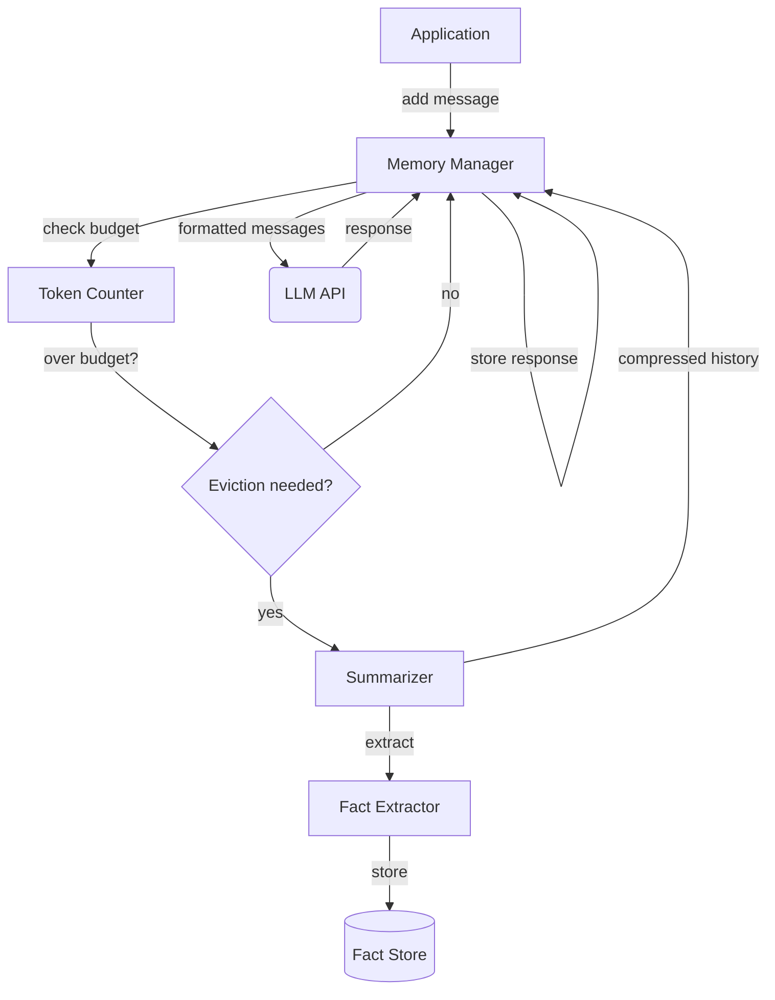

# Chapter 20 — Conversational Memory

> The model has no memory. Every apparent memory is a copy of the past
> injected into the present, and every copy costs tokens.

---

## Learning Objectives

By the end of this chapter you will be able to:

- Explain why conversation history must be actively managed rather than
  naively accumulated.
- Implement a sliding window that enforces a turn limit and stays within
  a token budget.
- Design a summarization strategy that compresses old history while
  preserving key facts.
- Choose between eviction strategies (FIFO, importance-based, hybrid)
  and defend the choice with a named trade-off.
- Calculate the token cost of memory management and size the reserved
  headroom for a new response.
- Implement fact extraction that persists information across compression
  cycles.

---

## The Production Story

Consider a customer support assistant for a telecommunications company.
The assistant handles billing questions, service changes, and technical
troubleshooting. A typical conversation runs 15-20 turns as the customer
describes their problem, the assistant asks clarifying questions, and
they work toward a resolution.

On a Tuesday morning, support tickets begin arriving about the assistant
"forgetting" what customers told it. A customer says "I already told you
my account number" but the assistant asks for it again. Another customer
spends five turns explaining a complex billing dispute, then the assistant
responds as if the conversation just started.

The team investigates. The assistant's context window is 8,192 tokens.
The system prompt is 800 tokens. That leaves 7,392 tokens for conversation
history and the new response. At turn 15, with detailed customer
explanations and assistant responses, the conversation history has grown
to 9,000 tokens. The API call fails with a context length error. The
application's error handler catches the failure and retries with a fresh
context, losing everything.

The fix seems obvious: truncate the history to fit. The team implements
a simple approach: before each API call, count tokens, drop the oldest
messages until the history fits, then make the call. The context length
errors stop.

But a week later, a different class of complaints emerges. "The assistant
remembered my account number but forgot my problem." "It kept asking
questions I'd already answered." The truncation fix preserved recency
but lost the information that actually mattered. The customer's account
number was in turn 2. Their problem description was in turn 3. The last
10 turns were the assistant's troubleshooting steps, which became
incoherent when the original problem was removed from context.

The team realizes that simple truncation is not memory management. The
question is not how many tokens to keep, but which tokens to keep, and
that question has no universal answer.

---

## Why This Exists

Language models have no persistent memory. Every request includes the
full context required to produce a response. What appears to be memory
is actually the application copying prior messages into each new request.

This design has a constraint: the context window is finite. Early models
offered 2,048 or 4,096 tokens. Current models range from 8,192 to 200,000
tokens for the largest context windows. But regardless of the size, the
limit exists, and conversations that exceed it must be handled.

The naive approach is to fail or truncate at the boundary. Both are
inadequate. Failing loses the conversation entirely. Truncating loses
whatever was in the dropped portion, which may be the most important
part of the conversation.

Memory management exists to make conversations durable across the context
boundary. The core operations are:

1. **Tracking** — counting tokens as messages accumulate.
2. **Eviction** — deciding which messages to remove when the limit
   approaches.
3. **Compression** — transforming verbose history into compact summaries.
4. **Extraction** — identifying key facts that must persist regardless
   of compression.

Each operation has multiple strategies with different trade-offs. The
right choice depends on the conversation type, the user expectations,
and the cost tolerance.

### The hidden cost of memory

Memory is not free. Every token of history consumes context that could
be used for output or for other input. A 4,000-token conversation history
in an 8,192-token window leaves 4,192 tokens for the system prompt, the
new user message, and the response.

Memory also costs money. Input tokens are billed. A conversation that
accumulates 10,000 tokens of history sends 10,000 tokens with every
request. Ten requests in that conversation consume 100,000 input tokens
just for the repeated history.

Production systems therefore minimize carried history, not maximize it.
The goal is to carry exactly enough context for the model to respond
coherently, and no more.

---

## Core Concepts

**Context window.** The maximum number of tokens a model can accept in
a single request. Includes the system prompt, conversation history, and
the space reserved for the response. Exceeding it causes the request to
fail.

**Token budget.** The portion of the context window allocated to
conversation history. Calculated as: context window minus system prompt
minus reserved response space. A 16,000-token window with an 800-token
system prompt and 2,000 tokens reserved for response has a 13,200-token
history budget.

**Turn.** A user message paired with the assistant's response. Memory
management typically operates on turns rather than individual messages
because splitting a turn loses coherence.

**Sliding window.** A memory strategy that keeps the most recent N turns
and discards older ones. Simple and predictable but loses early context
that may be important.

**Eviction.** The process of removing messages or turns from history.
Strategies include FIFO (oldest first), importance-based (lowest priority
first), and hybrid approaches.

**Summarization.** Compressing multiple turns into a shorter summary.
Preserves the semantic content while reducing token count. Requires
either an LLM call or extractive heuristics.

**Key fact.** A piece of information that must persist regardless of
compression. Examples: the user's name, their stated goal, constraints
they specified, decisions made during the conversation. Facts are
extracted during summarization and injected into new contexts.

**Headroom.** The tokens remaining between current usage and the budget.
When headroom approaches zero, eviction or compression must occur before
the next request.

---

## Internal Architecture

Memory management sits between the application and the LLM API. It
intercepts outgoing requests to enforce the token budget and compress
history as needed.



*Memory management happens before each API call. The application adds
messages; the manager enforces the budget; the API sees only what fits.*

### Component responsibilities

**Token counter.** Estimates the token count for messages and the total
context. Must be fast because it runs on every message. Exact counting
requires a model-specific tokenizer; approximations (word count * 1.3)
are often sufficient for budgeting decisions.

**Memory manager.** Maintains the message list, tracks token usage, and
triggers compression when the budget is exceeded. Provides the message
list for API calls.

**Summarizer.** Compresses a sequence of turns into a summary. In
production, this is typically an LLM call with a summarization prompt.
The summary replaces the original turns, reducing token count while
preserving (hopefully) the essential content.

**Fact extractor.** Identifies key facts in messages before they are
summarized or evicted. Facts are stored separately and injected into
new contexts regardless of what happens to the original messages.

**Fact store.** Persists extracted facts for the duration of the
conversation (or longer, for persistent memory across sessions). Facts
have categories (name, preference, goal, constraint) and confidence
scores.

### The compression decision

When does compression happen? There are two triggers:

1. **Reactive.** Compress when the token budget is about to be exceeded.
   This is the minimal approach: no work until necessary.

2. **Proactive.** Compress when the turn count exceeds a threshold,
   regardless of token usage. This prevents spiky behavior where a
   single large message forces sudden compression.

Proactive compression adds predictability. The user experience is
smoother when compression happens gradually rather than suddenly on
turn 15 of a long conversation.

### The summarization call

Summarization itself costs tokens. If you use an LLM to summarize, you
send the turns being summarized as input and receive a summary as output.
For 3,000 tokens of input producing 300 tokens of output, you spend
3,300 tokens to save 2,700 tokens per subsequent request.

The break-even point depends on how many more requests the conversation
will have. If the conversation ends in 2 more requests, summarization
wastes tokens. If it continues for 10 more requests, summarization saves
27,000 tokens minus the 3,300 spent — a net saving of 23,700 tokens.

Production systems often use heuristics instead of LLM summarization
for cost control. Extractive summaries (pull key sentences) require
no LLM call. Template-based summaries (fill in slots for name, goal,
status) are fast and predictable.

---

## Production Design

**Reserve headroom for the response.** The token budget must leave space
for the model's output. If you fill the context to the limit, the model
has no room to respond. Reserve at least the `max_tokens` you request,
plus a buffer for variance. A 2,000-token reservation is a reasonable
default; adjust based on your typical response length.

**Count tokens accurately enough.** Exact token counting requires the
model's tokenizer, which may not be available or may be slow. For memory
management, 10% accuracy is usually sufficient. A word-based heuristic
(words * 1.3 for English) is within that tolerance for most text.

**Compress aggressively early.** The first turns often contain the most
important context: who the user is, what they want, what constraints
apply. Compress these early while you have room, so the summary becomes
part of the stable context. Do not wait until you are forced to compress.

**Extract facts before summarizing.** Once turns are summarized, their
original content is gone. Extract key facts before compression and store
them separately. Facts can be re-injected into context even if the
summary is later compressed again.

**Emit these metrics:**

| Metric | Type | Why it matters |
| --- | --- | --- |
| `memory_token_count` | gauge | Current history size |
| `memory_headroom` | gauge | Space remaining before compression |
| `compression_count` | counter | How often compression triggers |
| `fact_count` | gauge | Extracted facts in current session |
| `evicted_turns` | counter | Turns lost to eviction |
| `summary_token_ratio` | histogram | Compression efficiency |

**Alert on repeated compression.** A conversation that compresses every
turn has a configuration problem. Either the budget is too small, the
messages are too large, or the summarization is not actually reducing
size. Alert when compression occurs on consecutive turns.

**Persist facts across sessions.** For returning users, load their
extracted facts from previous sessions. "You mentioned last week you
prefer email communication" demonstrates memory that spans sessions.
Store facts with timestamps and confidence scores for relevance ranking.

---

## Failure Scenarios

### Failure: compression loses critical information

**Symptom.** After compression, the assistant behaves as if it has never
heard information the user provided. "I already told you my account
number" complaints increase.

**Mechanism.** The summarizer compressed or discarded turns containing
critical information. Either the summarizer's prompt did not emphasize
retention, or the information was in a turn that got evicted before
summarization.

**Detection.** Track "already told you" signals in user messages. These
indicate memory failures. Log the pre-compression and post-compression
state to identify what was lost.

**Mitigation.** Re-extract facts from the current context if the user
repeats information. Store the repeated fact with higher confidence.

**Prevention.** Extract facts before compression, not during. Use
explicit fact categories (name, account, goal) with extraction patterns
tuned to your domain. Test with conversations that contain critical
information in early turns.

### Failure: infinite compression loop

**Symptom.** CPU spikes and requests time out. Logs show repeated
compression attempts with no progress.

**Mechanism.** The summary produced by compression is larger than the
turns it replaced, or close enough that adding one more message triggers
compression again. Each compression adds overhead without reducing size.

**Detection.** Count compression operations per conversation. Alert when
a single request triggers more than 2 compressions.

**Mitigation.** Add a hard limit on compression attempts per request.
After N attempts, evict turns directly without summarization.

**Prevention.** Verify that summarization actually reduces token count.
Set a minimum compression ratio (e.g., summary must be < 50% of original).
If the ratio is not achieved, fall back to extractive summarization or
direct eviction.

### Failure: token count drift

**Symptom.** Requests fail with context length errors despite the memory
manager believing headroom exists.

**Mechanism.** The token counting approximation drifted from reality.
The approximation might be 10% low, accumulating over many messages into
a significant undercount.

**Detection.** Compare estimated token count against actual (from API
response metadata) periodically. Alert when drift exceeds 15%.

**Mitigation.** Recalibrate by using the actual count from the API as
ground truth. Reduce headroom to add a safety margin.

**Prevention.** Use the model's actual tokenizer if available. If using
approximation, validate periodically against real counts and adjust the
heuristic. Add a 10-15% safety buffer to the token budget.

### Failure: fact extraction extracts noise

**Symptom.** The fact store fills with useless entries. Context becomes
polluted with irrelevant "facts" that confuse the model.

**Mechanism.** The extraction patterns are too broad. Statements like
"I think the weather is nice" get extracted as preferences. False
positives accumulate over long conversations.

**Detection.** Review fact stores periodically. Check that fact counts
grow sublinearly with conversation length. Flag conversations with >50
facts.

**Mitigation.** Add confidence scores to facts. Only inject high-
confidence facts into context. Prune low-confidence facts after N turns.

**Prevention.** Use narrow extraction patterns tuned to your domain.
Test with adversarial inputs (casual small talk) and verify they do not
produce spurious facts. Set a maximum fact count per conversation.

---

## Scaling Strategy

**First: single-conversation memory, below 100 turns.** The strategies
in this chapter work directly. Memory management is per-conversation
with no cross-conversation concerns.

**Second: long conversations, 100-1000 turns.** Summarization must be
hierarchical. Summarize old summaries into higher-level summaries. Store
an outline structure: session summary, then topic summaries, then recent
turns. The outline provides context without full history.

**Third: persistent memory across sessions, 1000+ total turns.** Facts
and summaries must be stored externally. Load relevant facts based on
the current conversation topic. Use retrieval to find relevant past
conversation fragments. This becomes a retrieval problem (see Chapter
16) rather than a context management problem.

**Fourth: multi-user or multi-tenant memory.** Each user's memory is
isolated. The storage backend must handle concurrent access. Consider
privacy implications: facts about one user must never leak into another
user's context.

---

## Trade-offs

| Decision | Buys you | Costs you | Choose when |
| --- | --- | --- | --- |
| Sliding window (turns) | Simplicity, predictability | Loses early context | Short conversations, recency matters most |
| Sliding window (tokens) | Accurate budget control | More complex to implement | Token cost is primary concern |
| FIFO eviction | Simple, deterministic | May evict important turns | All turns equally important |
| Importance-based eviction | Preserves critical turns | More complex, requires scoring | Some turns clearly matter more |
| LLM summarization | High-quality summaries | Cost per summarization, latency | Quality matters, cost acceptable |
| Extractive summarization | No LLM cost, fast | Lower quality summaries | Cost-sensitive, high volume |
| Proactive compression | Predictable behavior | May compress unnecessarily | Long conversations, UX matters |
| Reactive compression | Minimal work | Spiky behavior, sudden compression | Short conversations |
| Fact extraction | Preserves key info | Complexity, potential false positives | Critical information must persist |
| No fact extraction | Simpler implementation | Information lost in compression | Ephemeral conversations |

---

## Code Walkthrough

From `examples/ch20-memory/`. The memory manager integrates token counting,
sliding windows, and summarization into a unified interface.

### Token counting

The approximation must be fast and close enough for budget decisions.

```ts
// examples/ch20-memory/src/tokenizer.ts

export function countTokens(text: string): number {
  if (!text) return 0;

  const words = text.trim().split(/\s+/)
    .filter((w) => w.length > 0);                     // (1)

  let tokenEstimate = 0;

  for (const word of words) {
    if (word.length <= 3) {
      tokenEstimate += 1;                             // (2)
    } else if (word.length <= 8) {
      tokenEstimate += 1.3;
    } else {
      tokenEstimate += Math.ceil(word.length / 4);    // (3)
    }
  }

  const punctuation = (text.match(/[.,!?;:'"()\[\]{}]/g)
    || []).length;
  tokenEstimate += punctuation * 0.5;                 // (4)

  return Math.ceil(tokenEstimate);
}
```

1. Split on whitespace, filter empty strings.
2. Short words are typically single tokens in most tokenizers.
3. Long words get subword-tokenized; estimate based on length.
4. Punctuation often becomes separate tokens.

This is within 30% of actual for English text — sufficient for memory
management decisions.

### Sliding window

The simplest memory strategy: keep recent turns, drop old ones.

```ts
// examples/ch20-memory/src/sliding-window.ts

export class SlidingWindow {
  private config: SlidingWindowConfig;
  private turns: Turn[];

  private enforceWindow(): void {
    while (this.turns.length > this.config.maxTurns) {
      this.turns.shift();                              // (1)
    }

    let totalTokens = this.getTotalTokens();
    while (
      totalTokens > this.config.maxTokens &&
      this.turns.length > 1                            // (2)
    ) {
      this.turns.shift();
      totalTokens = this.getTotalTokens();
    }
  }

  trimToFit(tokenBudget: number): TrimResult {
    let droppedTurns = 0;
    let availableBudget = tokenBudget;

    if (this.systemPrompt && this.config.preserveSystemPrompt) {
      availableBudget -= this.systemPrompt.tokenCount; // (3)
    }

    while (this.turns.length > 0) {
      const current = this.turns.reduce(
        (sum, t) => sum + t.totalTokens, 0);

      if (current <= availableBudget) break;

      this.turns.shift();
      droppedTurns++;
    }

    return {
      messages: this.getMessages(),
      totalTokens: this.getTotalTokens(),
      droppedTurns,
      summarized: false,
      preservedFacts: [],
    };
  }
}
```

1. FIFO eviction: remove the oldest turn first.
2. Always keep at least one turn to maintain conversation continuity.
3. System prompt is preserved; its tokens come out of the budget first.

### Fact extraction

Pattern-based extraction runs before summarization to preserve key facts.

```ts
// examples/ch20-memory/src/summary.ts

private extractFactsFromContent(
  content: string,
  source: 'user' | 'assistant',
  timestamp: number
): KeyFact[] {
  const facts: KeyFact[] = [];

  // Name patterns
  const nameMatch = content.match(
    /(?:my name is|I'm|I am|call me)\s+([A-Z][a-z]+)/i
  );                                                   // (1)
  if (nameMatch) {
    facts.push({
      id: `fact_${++this.factCounter}`,
      content: `User's name is ${nameMatch[1]}`,
      source,
      timestamp,
      category: 'name',
      confidence: 0.9,                                 // (2)
    });
  }

  // Goal patterns
  const goalPatterns = [
    /(?:I'm trying to|I want to|my goal is to)\s+(.{10,80})/i,
    /(?:help me|can you help)\s+(.{10,80})/i,
  ];
  for (const pattern of goalPatterns) {
    const match = content.match(pattern);
    if (match) {
      facts.push({
        id: `fact_${++this.factCounter}`,
        content: match[0].trim(),
        source,
        timestamp,
        category: 'goal',
        confidence: 0.8,
      });
    }
  }

  return facts;
}
```

1. Pattern matching for common ways users state their name.
2. Confidence score indicates how reliable the extraction is. Higher
   confidence facts are more likely to be injected into context.

### Memory manager compression

The combined manager handles the compression decision and fact
preservation.

```ts
// examples/ch20-memory/src/memory.ts

private compress(): void {
  const budget = this.config.maxTokens -
    this.config.reserveTokens;
  const overBudget = this.getTotalTokens() > budget;

  let keepCount: number;
  if (overBudget) {
    keepCount = Math.max(2, Math.floor(
      this.turns.length / 2));                         // (1)
  } else {
    keepCount = Math.min(
      this.config.slidingWindowTurns,
      this.turns.length);
  }

  const summarizeCount = this.turns.length - keepCount;
  if (summarizeCount <= 0) return;

  const toSummarize = this.turns.slice(0, summarizeCount);
  const toKeep = this.turns.slice(summarizeCount);

  const result = this.summarizer.summarize(toSummarize);

  if (this.summary) {
    const combinedContent =
      this.summary.content + '\n\n' + result.summary.content;
    this.summary = {
      role: 'system',
      content: combinedContent,
      timestamp: Date.now(),
      metadata: { summary: true },
    };
    this.summary.tokenCount = countMessageTokens(
      this.summary);                                   // (2)
  } else {
    this.summary = result.summary;
  }

  this.facts.push(...result.extractedFacts);           // (3)
  this.turns = toKeep;
  this.compressionCount++;

  while (
    this.getTotalTokens() > budget &&
    this.turns.length > 1
  ) {
    this.turns.shift();                                // (4)
  }
}
```

1. When over budget, be aggressive: keep only half the turns.
2. Existing summaries merge with new ones. The combined summary
   represents all compressed history.
3. Facts persist independently of the turns they came from.
4. After compression, evict further if still over budget. Compression
   adds tokens (the summary itself), so we may still need to drop turns.

---

## Hands-On Lab

**Goal:** observe memory management strategies and verify that facts
persist through compression. About 3 minutes, Node 22.6+, no dependencies.

```bash
cd examples/ch20-memory
node scripts/lab.mjs
```

The lab runs six steps with 16 assertions covering token counting,
sliding windows, summarization, eviction strategies, and fact extraction.

**Step 1 — token counting accuracy.**

Verify the word-based approximation is within tolerance:

```
[PASS] token estimation within 30% for test samples
       observed 4 of 5 samples accurate
```

The approximation works well enough for memory management decisions.
Exact counting requires a model-specific tokenizer.

**Step 2 — sliding window budget enforcement.**

Add 20 turns to a 500-token budget:

```
[PASS] sliding window stays under token budget
       observed 500 tokens (configured max)
[PASS] sliding window evicted old turns
       observed 8 turns (some evicted to stay within budget)
[PASS] oldest remaining turn is not turn 0
       observed turn 12 (turns 0-11 evicted)
```

The window enforced the budget by evicting the oldest 12 turns.

**Step 3 — fact extraction from turns.**

Summarize turns containing user information:

```
[PASS] summary extracts facts
       observed 4 facts extracted
[PASS] name fact extracted correctly
       observed "User's name is Alice"
[PASS] summary achieves compression
       observed 3.5x compression ratio
```

The summarizer found the user's name in "My name is Alice" and preserved
it as a fact.

**Step 4 — deterministic eviction.**

Verify that the same input produces the same eviction decisions:

```
[PASS] FIFO preserves most recent turns
       observed most recent turn preserved
[PASS] importance strategy preserves high-importance turns
       observed high/critical importance preserved over low
[PASS] eviction is deterministic
       observed same input produces same output
```

Eviction must be deterministic. Non-deterministic eviction would make
conversations unpredictable and testing impossible.

**Step 5 — automatic compression.**

Fill a small budget and observe compression:

```
[PASS] memory manager stays within budget
       observed 271 tokens (<= 400 max)
[PASS] memory manager compressed history
       observed compression triggered
[PASS] compression count is positive
       observed 3 compressions occurred
```

The manager compressed history multiple times to stay within budget.

**Step 6 — facts persist through compression.**

Add facts early, compress, verify they remain:

```
[PASS] facts extracted from conversation
       observed 8 facts extracted
[PASS] name fact preserved through compression
       observed "Bob" preserved
```

Even though the original turn containing "My name is Bob" was compressed,
the fact persists in the fact store.

---

## Interview Questions

1. Why can you not just accumulate all conversation history and send it
   with every request?

2. A user says "I already told you my account number" after turn 15 of
   a conversation. What went wrong and how do you fix it?

3. Should you use the model's tokenizer or a word-based approximation
   for memory management? What are the trade-offs?

4. Design a fact extraction system for a healthcare assistant. What
   categories of facts would you extract, and what are the risks?

5. How do you decide when to compress: reactively (when over budget) or
   proactively (when turn count exceeds threshold)?

6. The summarizer produces summaries larger than the input. How does
   this happen and how do you prevent it?

7. How would you implement memory that persists across sessions for
   returning users?

8. A conversation about technical troubleshooting has 50 turns. The
   first 5 turns contain the problem description. The last 45 are
   back-and-forth debugging. Which turns should you preserve?

---

## Staff-Level Answers

**Q2 — "I already told you."** The senior answer: the turn containing
the account number was evicted or summarized, and the information was
lost. Use fact extraction to preserve account numbers.

The staff answer starts there but adds the system design question: why
is the account number in conversation history at all? In a well-designed
system, the account number is passed as structured metadata, not buried
in prose. The assistant would receive `account_id: 12345` as a parameter,
not parse "my account number is 12345" from turn 2.

The "I already told you" signal means two things: (1) the memory system
failed to preserve the information, and (2) the information should
probably not be in the memory system in the first place. Structured
data belongs in structured fields. Memory is for context that cannot
be structured.

**Q4 — healthcare fact extraction.** The senior answer lists categories:
diagnoses, medications, allergies, care preferences. That is correct
but misses the risk analysis.

The staff answer starts with the risks. Healthcare facts have legal
weight. An extracted fact of "patient is allergic to penicillin" that
was actually "patient's mother was allergic to penicillin" could cause
harm. The confidence scoring must be conservative. Facts extracted from
patient statements require verification before influencing care.

The categories would be: verified facts (from medical records, high
confidence), stated facts (from patient statements, medium confidence),
and inferred facts (from conversation patterns, low confidence). Only
verified facts should influence clinical decisions. Stated facts should
be flagged for verification. Inferred facts should be used only for
UX personalization, never for clinical guidance.

The staff move is to recognize that this is a clinical safety question
disguised as a memory management question.

**Q5 — reactive vs proactive compression.** The senior answer: reactive
is simpler, proactive is smoother. Choose proactive for long conversations.

The staff answer adds the user experience dimension. With reactive
compression, the user experiences normal conversation for 14 turns, then
sudden context loss on turn 15. The assistant's behavior changes
abruptly. With proactive compression, the compression happens earlier
and more often, but each compression removes less context. The degradation
is gradual rather than sudden.

The specific numbers matter. Compress when turn count exceeds half the
capacity. If you expect to compress at turn 16, compress at turn 8
instead. The first compression loses less (turns 1-2 out of 8, not
turns 1-8 out of 16), and subsequent compressions happen at predictable
intervals.

The general principle: smooth degradation is better than cliff edges.
Users can adapt to gradually reduced context. They cannot adapt to
sudden discontinuities.

**Q8 — troubleshooting conversation retention.** The senior answer:
keep the first 5 turns (problem description) and the last 10 turns
(recent context). That is reasonable but incomplete.

The staff answer recognizes the structure of troubleshooting
conversations. Turns 1-5: problem statement. Turns 6-45: hypothesis
testing. Turns 46-50: resolution (or escalation). The hypothesis-testing
phase has a specific structure: assistant proposes check, user reports
result, repeat.

What matters from turns 6-45 is not the prose but the outcomes: which
checks passed, which failed, what was ruled out. Extract these as
structured facts: "checked power supply: OK", "checked network
connection: failed", "replaced router: fixed". The specific dialogue
can be compressed; the test results must persist.

The retention strategy: keep turns 1-5 in full (problem statement),
extract structured results from turns 6-45, keep turns 46-50 in full
(recent context and resolution). The structured results live in the
fact store with category "diagnostic_result".

---

## Exercises

1. **Compression ratio analysis.** Modify the summarizer to track
   input and output token counts. Run it on conversations of different
   lengths (5, 10, 20, 50 turns) and plot the compression ratio. At
   what point does summarization become inefficient?

2. **Importance scoring.** Implement an importance scorer that assigns
   weights to turns based on their content. Questions should be higher
   importance than acknowledgments. User messages containing "important"
   or "critical" should be marked high priority. Test with the buffer's
   importance-based eviction.

3. **Hierarchical summarization.** Implement a two-level summary
   structure: recent turns, session summary (from current session),
   and historical summary (from previous summaries). Compress session
   summary into historical summary when it exceeds a threshold.

4. **Cross-session memory.** Extend the fact store to persist facts
   to a file. Load facts when starting a new conversation with the
   same user. Demonstrate that "My name is Alice" from session 1 is
   available in session 2.

5. **Design question.** A legal assistant processes contracts. Users
   paste contract text (5,000-20,000 tokens) and ask questions. The
   contract must remain available throughout the conversation. Design
   the memory architecture. Write a one-page RFC covering how you
   handle the large input, what you compress, and how you preserve
   access to specific clauses.

---

## Further Reading

- **Anthropic, "Long context prompting tips"** — practical guidance on
  using large context windows effectively. The key insight: more context
  is not always better. Irrelevant context can hurt performance.

- **Liu et al., "Lost in the Middle"** — research showing that models
  pay less attention to information in the middle of long contexts.
  Relevant to memory management: put important facts at the start or
  end of the context, not buried in the middle.

- **LangChain Memory documentation** — a popular framework's approach
  to conversation memory. Shows common patterns and their implementations.
  Compare their abstractions against your requirements.

- **Recursive summarization papers** — academic work on multi-level
  summarization for very long documents. Relevant when conversations
  span thousands of turns across multiple sessions.

- **Your model provider's tokenizer** — the authoritative source for
  token counting. Most providers publish tokenizer libraries. Use them
  for exact counts when approximation is not sufficient.

- **The ledger from Chapter 18** — memory operations are billable. Every
  time you compress using an LLM call, you spend tokens. Track these
  costs in the ledger alongside regular API calls.
