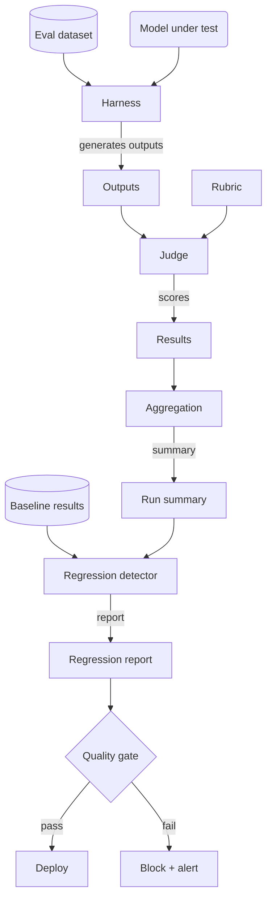

# Chapter 21 — Evaluation Pipelines

> An evaluation pipeline that cannot catch a regression before deployment is not
> an evaluation pipeline — it is a post-mortem generator.

---

## Learning Objectives

By the end of this chapter you will be able to:

- Explain why eval quality is a prerequisite for shipping model changes and
  identify the failure modes of skipping evaluation.
- Implement LLM-as-judge scoring and calibrate it against human labels before
  trusting it in production.
- Design a regression detection pipeline that uses statistical tests to
  distinguish real degradations from noise.
- Build and maintain an eval dataset with versioning, stratified sampling, and
  category coverage.
- Choose between automated evals and human review for a given use case, naming
  the trade-off that drives the decision.
- Integrate evaluation into CI/CD to gate deployments on quality thresholds.

---

## The Production Story

Consider an e-commerce company running a product search assistant. The team
has been iterating rapidly — three model updates in the past month, each
claiming better results. The updates went live because they passed a vibe check:
an engineer ran a few queries, the answers looked reasonable, and the deploy
went through.

On a Thursday afternoon, a product manager noticed that queries about electronics
were returning gardening products. Not always, but often enough that customers
had started complaining. The support team had logged 47 tickets in the past week.
Nobody had connected them to the model update from twelve days ago.

The team traced the issue to a prompt change that improved accuracy on apparel
queries (their test category) while degrading electronics (which nobody had
checked). The change had been reviewed, approved, and deployed without running
a single automated eval. The team had evals — they just did not run them before
shipping.

When they finally ran the eval suite, the results were damning: 23% drop in
accuracy for electronics, 8% drop overall. The vibe check had passed because
the engineer happened to test apparel queries. The numbers showed a regression
that any automated check would have caught. The tickets showed a regression
that customers had already noticed.

The question the team asked next was the wrong one: "How do we run evals
faster?" The right question was: "Why did we ship without running them at all?"

---

## Why This Exists

The first model change at any company ships without evaluation because there is
no baseline to compare against. The change is the baseline. The second change
ships without evaluation because writing an eval suite takes longer than the
change itself, and the deadline is tomorrow.

By the fifth change, the team knows they need evals, but they have shipped four
changes without them, nothing broke visibly, and the eval infrastructure is
still unbuilt. The feeling is: it has worked so far, we will build it when we
have time.

The sixth change introduces a regression that takes two weeks to notice and
three days to diagnose. The post-mortem says "add evaluation to the deploy
pipeline." The team agrees. The next change still ships without evals because
the pipeline is not built yet.

This is not a failure of discipline. It is a failure of infrastructure. Manual
evaluation does not scale, humans forget, and "I looked at a few examples" has
a confidence interval the width of a highway. Automated evaluation exists to
replace the human who was supposed to check but did not.

### The evaluation problem is harder for LLMs

Classical ML evaluation had three properties that made it tractable:

1. **Outputs were low-dimensional.** A classifier outputs a class label.
   Compare it to the ground truth label. Done.
2. **Ground truth was available.** The training data included labels. The eval
   data could include labels too.
3. **Metrics were agreed-upon.** Precision, recall, F1. Arguments happened about
   thresholds, not definitions.

LLM outputs are high-dimensional (free text), ground truth is often unavailable
(what is the "correct" summary of a document?), and metrics are contested (is
"helpful" more important than "harmless"?).

Evaluation pipelines exist to impose structure on this problem: standardized
datasets, scoring rubrics, statistical tests, and regression thresholds. Without
the structure, every model change is an opinion about whether the output "looks
better." Opinions do not catch the electronics-to-gardening regression.

---

## Core Concepts

**Eval dataset.** A versioned collection of (input, expected output) pairs,
optionally grouped by category and difficulty. The version matters because
adding or removing examples changes the baseline. A 90% pass rate on 100
examples is not the same as 90% on 200.

**Ground truth.** The expected output for an eval example. For some tasks this
is unambiguous (the capital of France is Paris). For others it is a reference
answer that a good output should resemble, not match exactly.

**LLM-as-judge.** Using a model (typically a frontier model) to score another
model's outputs. The judge receives a rubric, the input, the expected output,
and the actual output, then returns a score. Faster than human evaluation,
cheaper at scale, but requires calibration.

**Judge calibration.** The process of verifying that the judge's scores
correlate with human judgments. A judge that agrees with humans 90% of the time
can gate deployments. A judge that agrees 60% of the time should not.

**Regression.** A statistically significant decrease in eval scores between a
baseline run and a candidate run. Not every score drop is a regression — noise
produces score variation. A regression is a drop that exceeds a threshold and
passes a significance test.

**Pass rate.** The fraction of eval examples where the judge score exceeds a
threshold (commonly 0.7 or 0.8). Pass rate is easier to communicate than
average score and provides a natural deployment gate: "do not ship if pass rate
drops below 85%."

**Statistical significance.** The probability that an observed difference is
due to chance. A p-value of 0.05 means there is a 5% chance the difference is
noise. Significance tests prevent you from blocking a deploy over random
variation.

**Effect size.** How large the difference is, independent of whether it is
significant. A 0.1% score drop can be statistically significant with enough
examples; that does not mean you should block the deploy. Effect size answers
"is this difference meaningful?" where significance answers "is this difference
real?"

---

## Internal Architecture

An evaluation pipeline has four stages, each with different failure modes.



*The harness runs the model, the judge scores outputs, the aggregator computes
summaries, and the regression detector compares against baseline. The quality
gate makes the deploy decision.*

**Dataset.** The source of truth for what to evaluate. Must be versioned. Must
have category coverage. Must not include examples from the training data (if
you control training). A contaminated dataset produces inflated scores that do
not generalize.

**Harness.** Orchestrates the eval run: loads the dataset, calls the model for
each example, collects outputs, and tracks metadata (latency, token counts,
errors). The harness is stateless — given the same dataset and model, it
produces the same outputs (modulo model non-determinism, which is why we set
temperature to 0 for evals).

**Judge.** Scores each output. Can be human, model, or heuristic. Human judges
are expensive and slow but set the standard. Model judges scale but require
calibration. Heuristic judges (regex match, contains keyword, parseable JSON)
are fast and cheap but limited to structural checks.

**Regression detector.** Compares a candidate run against a baseline run.
Matches examples by ID, computes paired differences, runs statistical tests,
and produces a report. The report includes: overall delta, significant
individual regressions, statistical test results, and the deploy recommendation.

### The judge prompt

An LLM-as-judge receives a system prompt like this:

```
You are evaluating an AI assistant's response to a user query.

Input: {input}
Expected output: {expected}
Actual output: {actual}

Evaluate the response on these criteria:
1. Correctness (50%): Is the response factually accurate?
2. Completeness (30%): Does it fully address the question?
3. Clarity (20%): Is it clear and well-structured?

Return a JSON object:
{
  "score": <0.0 to 1.0>,
  "rationale": "<one sentence explaining the score>"
}
```

The rubric weights (50/30/20) are a design decision. Different use cases weight
differently — a coding assistant might weight correctness at 80%.

### Paired testing

Regression detection uses paired tests (same examples, different models) rather
than unpaired tests (independent samples). Paired tests are more powerful because
they control for example difficulty. If example #37 is hard, both models will
struggle with it; the paired difference isolates the model effect from the
example effect.

The paired t-test is the standard choice. Alternatives include the Wilcoxon
signed-rank test (for non-normal distributions) and bootstrap confidence
intervals (for small samples).

---

## Production Design

**Version the dataset alongside the code.** The dataset is as much a part of
the system as the code. A change to the dataset without a version bump makes
historical comparisons meaningless. Use the same version control as the code.

**Set temperature to 0 for evals.** Non-determinism in outputs creates noise
in scores. For evaluation, you want reproducibility. Save the randomness for
production. Some providers offer a seed parameter for additional control.

**Store every eval run.** Do not overwrite. Each run gets a unique ID, a
timestamp, the model version, and the dataset version. This lets you trace
regressions to specific changes and re-run comparisons later.

**Separate judge model from model under test.** If you use the same model to
judge itself, you are measuring consistency, not quality. Use a frontier model
for judging, even if the model under test is a smaller model.

**Calibrate the judge before trusting it.** Run the judge on a sample of
examples with known human scores. Compute the Pearson correlation. If the
correlation is below 0.7, the judge is not ready for production. Common causes:
the rubric is unclear, the judge model is too weak, or the task requires
domain expertise the judge lacks.

**Emit these metrics per eval run:**

| Metric | Type | Why it matters |
| --- | --- | --- |
| `eval_pass_rate` | gauge | Primary deployment gate |
| `eval_average_score` | gauge | Secondary quality signal |
| `eval_latency_p99` | histogram | Model performance tracking |
| `eval_examples_failed` | counter | Infrastructure reliability |
| `judge_human_correlation` | gauge | Judge calibration tracking |

**Alert on correlation drop.** If the judge-human correlation drops below the
threshold, stop trusting the judge. This can happen when the model under test
produces outputs the judge was not calibrated for.

**Run evals on every PR that touches model or prompt.** Not optional. The CI
check should block merge if the pass rate drops below threshold or a regression
is detected. This is the infrastructure that prevents "we will run evals later."

---

## Failure Scenarios

### Failure: regression not detected before deploy

**Symptom.** Customer complaints spike two days after a model change. The change
was reviewed and approved. Nobody ran evals, or the evals did not cover the
affected category.

**Mechanism.** The eval dataset did not include examples for the regressed
category, or the category existed but was not checked for regressions. The
deploy gate looked at overall pass rate, which was fine; the category-level
drop was invisible.

**Detection.** Segment eval results by category. Alert if any category drops
more than the threshold, even if overall pass rate is stable.

**Mitigation.** Roll back the model change. Re-run evals with the previous
version to confirm. Identify which category regressed and why.

**Prevention.** Enforce category coverage in the dataset. Add a check that
every category has at least N examples. Add category-level regression gates
alongside overall gates.

### Failure: judge scores do not match human judgment

**Symptom.** The judge approves outputs that humans rate as poor. The pass rate
is high, but user satisfaction is low. The eval numbers look good; the product
does not feel good.

**Mechanism.** The judge was calibrated on one type of output (short answers)
but the model is now producing a different type (long explanations). The rubric
rewards completeness; the users want brevity. The judge optimizes for the wrong
criterion.

**Detection.** Periodically sample outputs that passed the judge and send them
to human review. Compute correlation. A declining correlation signals drift.

**Mitigation.** Stop trusting the judge until re-calibrated. Fall back to human
review for deployment decisions. This is expensive but necessary.

**Prevention.** Include the user-facing quality criterion in the rubric. Re-
calibrate the judge quarterly, or whenever the model's output style changes
significantly. Track judge-human correlation as a metric, not just as a one-
time check.

### Failure: statistical test gives false confidence

**Symptom.** A small score drop triggers a regression alert. The team
investigates, finds nothing wrong, and disables the alert. The next time, a
real regression gets ignored because the team expects false positives.

**Mechanism.** The regression threshold was set too low. A 1% drop is
statistically significant with enough examples, but it is not meaningful. The
test answered "is this real?" when the question should have been "is this
worth blocking?"

**Detection.** Track how often regression alerts lead to actual fixes versus
dismissals. A high dismissal rate indicates the threshold is too aggressive.

**Mitigation.** Raise the regression threshold. Add an effect-size check:
a difference must be both significant and meaningful to block.

**Prevention.** Set thresholds based on business impact, not statistical purity.
A 5% drop might be the right threshold; a 1% drop probably is not. Document the
reasoning so future teams understand why the threshold was chosen.

### Failure: eval dataset contaminates training

**Symptom.** Eval scores are suspiciously high and do not match production
quality. The model performs well on the eval set but poorly on new inputs.

**Mechanism.** Examples from the eval dataset leaked into the training data.
The model memorized the answers. The eval is now measuring recall, not
generalization.

**Detection.** Track eval performance over time. If scores jump discontinuously
after a training run, suspect contamination. Verify by running on held-out
examples that were never in any dataset.

**Mitigation.** Retire the contaminated eval dataset. Build a new one from
examples that provably post-date the training data cutoff.

**Prevention.** Cryptographically sign eval datasets with timestamps. Exclude
any example with a timestamp before the training cutoff. If you control
training, build the exclusion into the pipeline.

---

## Scaling Strategy

**First: eval run time, around 1,000 examples.** A 1,000-example eval with 2
seconds per inference takes 30 minutes. Parallelize across workers. Most model
APIs allow concurrent requests; scale until you hit rate limits or the eval
completes in your target time (usually under 10 minutes for CI).

**Second: judge cost, around 10,000 examples per day.** LLM-as-judge is
expensive — each example requires a frontier model call. Batch scoring to
reduce overhead. Consider caching: if the same (input, output) pair appears
twice, reuse the score. At very high volume, train a small model to mimic the
frontier judge.

**Third: dataset management, around 50,000 examples.** Large datasets become
hard to version, sample, and analyze. Partition by category. Use stratified
sampling to run fast CI checks on a representative subset; run full evals
nightly. Store examples in a database rather than flat files.

**Fourth: coordination, around 10 teams using evals.** Different teams need
different datasets and rubrics. Build a shared eval platform with pluggable
components: datasets are registered, rubrics are versioned, results are
queryable. Without the platform, each team builds their own, inconsistently.

---

## Trade-offs

| Decision | Buys you | Costs you | Choose when |
| --- | --- | --- | --- |
| LLM-as-judge | Scale, speed, consistency | Money, requires calibration | Volume exceeds human capacity |
| Human evaluation | Ground truth quality | Time, cost, availability | Calibrating the judge, high-stakes decisions |
| Per-example regression check | Fine-grained detection | Computation, false positives | You need to know which examples regressed |
| Overall pass rate only | Simplicity, speed | Misses category-level regressions | Categories have similar difficulty |
| Low regression threshold (1%) | Catches small drops | Many false positives, alert fatigue | Changes have high business impact |
| High regression threshold (10%) | Few false positives | Misses small but real regressions | Noise is high, changes are frequent |
| Full eval on every PR | Maximum safety | CI time, cost | Model/prompt changes are infrequent |
| Sampled eval on PR, full nightly | Faster CI | Delayed regression detection | Rapid iteration, rollback is cheap |
| Single judge model | Simplicity, consistency | Single point of failure | Judge model is stable |
| Ensemble of judges | Robustness, reduces bias | Complexity, cost | Judge failure is costly |

---

## Code Walkthrough

From `examples/ch21-evaluation/`. The harness runs models against datasets,
scores with a judge, and detects regressions.

### Judge scoring

The judge receives an input, expected output, and actual output, then returns
a score with rationale.

```ts
// examples/ch21-evaluation/src/judge.ts

export class JudgeScorer {
  private rubric: JudgeRubric;
  private noise: number;

  constructor(rubric?: JudgeRubric, noise?: number) {
    this.rubric = rubric ?? DEFAULT_RUBRIC;
    this.noise = noise ?? 0.05;
  }

  score(
    input: string,
    expected: string,
    actual: string,
    seed?: number
  ): { score: number; rationale: string } {
    const semantic = semanticSimilarity(expected, actual);    // (1)
    const exact = exactMatch(expected, actual);

    const containsExpected = actual                           // (2)
      .toLowerCase()
      .includes(expected.toLowerCase());

    let baseScore: number;
    if (exact) {
      baseScore = 1.0;
    } else if (containsExpected) {
      baseScore = 0.75 + 0.08;                                // (3)
    } else {
      baseScore = semantic * 0.9;
    }

    const finalScore = Math.max(0, Math.min(1, baseScore));
    const rationale = this.generateRationale(finalScore, exact, semantic);

    return { score: finalScore, rationale };
  }
}
```

1. Semantic similarity uses Jaccard distance on tokens. In production, this
   would be cosine similarity on embeddings.
2. Check if the expected answer appears in the actual output. This handles
   verbose responses that contain the correct answer.
3. Score above 0.7 (passing threshold) if the answer is present. In production,
   the rubric weights would be configurable.

### Regression detection

Compare a candidate run against a baseline run, using a paired t-test to
determine significance.

```ts
// examples/ch21-evaluation/src/regression.ts

export function detectRegressions(
  baseline: EvalResult[],
  candidate: EvalResult[],
  options?: {
    regressionThreshold?: number;
    confidenceLevel?: number;
  }
): RegressionReport {
  const threshold = options?.regressionThreshold ?? 0.05;
  const confidence = options?.confidenceLevel ?? 0.95;

  // Match examples by ID                                    // (1)
  const baselineMap = new Map(baseline.map((r) => [r.exampleId, r]));
  const candidateMap = new Map(candidate.map((r) => [r.exampleId, r]));

  const matchedPairs: Array<{
    exampleId: string;
    baselineScore: number;
    candidateScore: number;
  }> = [];

  for (const [id, baseResult] of baselineMap) {
    const candResult = candidateMap.get(id);
    if (candResult) {
      matchedPairs.push({
        exampleId: id,
        baselineScore: baseResult.metrics.judgeScore,
        candidateScore: candResult.metrics.judgeScore,
      });
    }
  }

  const overallDelta = candidateAvg - baselineAvg;           // (2)

  const statResult = pairedTTest(                            // (3)
    matchedPairs.map((p) => p.baselineScore),
    matchedPairs.map((p) => p.candidateScore),
    confidence
  );

  const hasRegression =                                      // (4)
    overallDelta < -threshold && statResult.isSignificant;

  return {
    hasRegression,
    overallDelta,
    statisticalSignificance: statResult,
    significantRegressions: /* per-example drops */,
    improvements: /* per-example gains */,
  };
}
```

1. Pairing by example ID ensures we compare the same inputs. Unpaired tests
   would conflate model differences with example difficulty.
2. Overall delta is candidate minus baseline. Negative means regression.
3. Paired t-test on the differences. More powerful than unpaired because it
   controls for example difficulty.
4. Both conditions must hold: the drop exceeds the threshold AND the difference
   is statistically significant. Either alone is insufficient.

### Harness orchestration

The harness ties everything together: dataset, model, judge, and regression
detection.

```ts
// examples/ch21-evaluation/src/harness.ts

export class EvalHarness {
  private judge: JudgeScorer;
  private regressionThreshold: number;
  private confidenceLevel: number;

  run(
    dataset: EvalDataset,
    model: ModelSimulator,
    runId?: string
  ): { results: EvalResult[]; summary: EvalRunSummary } {
    const results: EvalResult[] = [];
    const examples = dataset.getAllExamples();

    for (let i = 0; i < examples.length; i++) {
      const example = examples[i];

      const { output, latencyMs } = model.generate(          // (1)
        example.input,
        example.expectedOutput,
        i
      );

      const { score, rationale } = this.judge.score(         // (2)
        example.input,
        example.expectedOutput,
        output,
        i
      );

      const metrics = computeMetrics(
        example.expectedOutput,
        output,
        score,
        latencyMs,
        rationale
      );

      results.push({
        exampleId: example.id,
        input: example.input,
        expectedOutput: example.expectedOutput,
        actualOutput: output,
        metrics,
        timestamp: Date.now(),
        modelVersion: model.getVersion(),
      });
    }

    const summary = aggregateResults(results, runId, model.getVersion());
    return { results, summary };
  }

  runWithRegression(                                         // (3)
    dataset: EvalDataset,
    candidateModel: ModelSimulator,
    baselineResults: EvalResult[]
  ) {
    const { results, summary } = this.run(dataset, candidateModel);
    const regression = detectRegressions(baselineResults, results, {
      regressionThreshold: this.regressionThreshold,
      confidenceLevel: this.confidenceLevel,
    });
    return { results, summary, regression };
  }
}
```

1. Generate output from the model. In production, this is an API call with
   retry logic.
2. Score with the judge. In production, this is a second API call to a
   different model.
3. Full regression check: run the candidate, compare to baseline, report.
   This is the CI integration point.

---

## Hands-On Lab

**Goal:** build an evaluation pipeline that detects quality regressions. About
5 minutes, Node 22.6+, no dependencies.

```bash
cd examples/ch21-evaluation
node scripts/lab.mjs
```

The lab runs seven steps and asserts 23 claims.

**Step 1 — basic metrics work correctly.**

```bash
# Exact match normalizes case and whitespace
exactMatch('Paris', 'paris')           // true
exactMatch('hello  world', 'hello world')  // true

# Semantic similarity high for same content
semanticSimilarity('The capital is Paris', 'Paris is the capital')  // > 0.5
```

Observed: exact match handles case and whitespace normalization. Semantic
similarity gives high scores for matching content, low scores for unrelated
content.

**Step 2 — judge scoring produces reasonable scores.**

```bash
# Exact match scores high
judge.score('What is 2+2?', '4', '4')  // >= 0.8

# Partial match (verbose but correct) scores medium
judge.score('Capital of France?', 'Paris', 'The capital is Paris.')  // 0.5-0.95

# Wrong answer scores low
judge.score('Capital of France?', 'Paris', 'I am not sure.')  // < 0.5
```

Observed: the judge differentiates between exact matches, partial matches, and
wrong answers. The scoring aligns with intuition about answer quality.

**Step 3 — judge correlates with human labels.**

```bash
# Human labels
humanLabels = [
  { exampleId: 'ex1', humanScore: 0.9 },
  { exampleId: 'ex2', humanScore: 0.3 },
  ...
]

# Judge scores (should correlate)
judgeScores = new Map([
  ['ex1', 0.85],
  ['ex2', 0.35],
  ...
])

correlation = computeJudgeCorrelation(judgeScores, humanLabels)
// pearsonR > 0.8, isCalibrated = true
```

Observed: Pearson correlation above 0.8 indicates the judge is aligned with
human judgment. The judge can be trusted for deployment decisions.

**Step 4 — regression detection catches quality drops.**

```bash
# Baseline results (good model)
baseline = [
  { exampleId: 'ex1', metrics: { judgeScore: 0.9 } },
  ...
]

# Candidate results (degraded model)
degraded = [
  { exampleId: 'ex1', metrics: { judgeScore: 0.65 } },
  ...
]

regression = detectRegressions(baseline, degraded)
// hasRegression = true, overallDelta < -0.15
```

Observed: regression detection correctly identifies the quality drop. The
overall delta is negative (candidate worse than baseline) and statistically
significant.

**Step 5 — harness produces reproducible results.**

```bash
# Same model and seed produces identical scores
model1 = new ModelSimulator('v1.0', 0.95, 12345)
model2 = new ModelSimulator('v1.0', 0.95, 12345)

run1 = harness.run(dataset, model1)
run2 = harness.run(dataset, model2)

// All scores match
```

Observed: deterministic seeds produce reproducible results. This is critical
for debugging and for comparing runs meaningfully.

**Step 6 — end-to-end regression detection.**

```bash
# Baseline with good model
baseline = harness.run(dataset, goodModel)

# Candidate with degraded model
{ regression } = harness.runWithRegression(dataset, degradedModel, baseline.results)
// regression.hasRegression = true

# Candidate with improved model
{ regression } = harness.runWithRegression(dataset, improvedModel, baseline.results)
// regression.hasRegression = false
```

Observed: the full pipeline catches the degraded model and passes the improved
model. This is the CI gate that would block the bad deploy.

**Step 7 — statistical tests.**

```bash
# Paired t-test on clearly different samples
result = pairedTTest(sample1, sample2, 0.95)
// isSignificant = true, pValue < 0.01

# Confidence interval for pass rate
ci = wilsonConfidenceInterval(7, 10, 0.95)
// { lower: ~0.4, upper: ~0.9 }
```

Observed: the statistical tests correctly identify significant differences and
produce reasonable confidence intervals. These are the tools that prevent false
positives in regression detection.

---

## Interview Questions

1. Why is LLM-as-judge useful, and what are its limitations?

2. A regression detector flags a 2% score drop as significant. Should you
   block the deploy? What additional information would you need?

3. How do you calibrate a judge, and what correlation threshold would you
   require before trusting it in production?

4. Your eval dataset has 500 examples but only 10 in the "financial advice"
   category. How do you handle this imbalance?

5. Describe the difference between statistical significance and practical
   significance in the context of regression detection.

6. A model update improves overall pass rate by 3% but drops one category by
   15%. How do you make the deploy decision?

7. How would you design an eval pipeline for a task with no clear "correct"
   answer, like creative writing or conversation?

8. Your eval suite takes 45 minutes to run. How do you integrate it into CI
   without blocking rapid iteration?

---

## Staff-Level Answers

**Q2 — 2% drop flagged as significant.** The senior answer says: check if the
drop is within normal variation, maybe re-run to confirm. That is reasonable
but incomplete.

The staff answer starts with effect size. A 2% drop is statistically significant
if you have enough examples, but is it meaningful? If baseline pass rate is 90%,
a drop to 88% might be noise in production. If baseline is 70%, a drop to 68%
in a category that matters (say, customer-facing answers) could be worth
blocking.

Next question: what is the confidence interval on the delta? If the 95% CI is
[-4%, 0%], the true effect could be anywhere in that range; 2% is the point
estimate. If the CI is [-2.5%, -1.5%], you have more confidence in the size.

Then: what category regressed? A 2% overall drop might hide a 15% drop in one
category offset by improvements elsewhere. Check category-level metrics.

Finally: what is the cost of being wrong in each direction? Blocking a good
deploy is a cost (delay). Shipping a bad deploy is a cost (user impact). The
threshold should reflect the asymmetry. For a low-stakes feature, ship and
monitor. For customer-facing functionality, block and investigate.

The staff move is to frame this as a decision under uncertainty with asymmetric
costs, not a binary significance test.

**Q3 — calibrating a judge.** Collect 100-200 examples with human-labeled
scores. Run the judge on the same examples. Compute Pearson correlation.

Threshold: 0.7 is a common minimum. Below 0.7, the judge disagrees with humans
too often to trust. Above 0.85 is strong. Above 0.95 suggests the task is
probably automatable without a judge (e.g., exact match would suffice).

Calibration is not one-time. Re-calibrate when: (1) the model under test
changes significantly, (2) the judge model changes, (3) the task definition
changes, or (4) you observe a correlation drop in production.

The staff addition: calibration is on examples the judge has not seen, but
those examples should be representative of production distribution. If your
calibration set is all easy questions and production is hard, the correlation
will not transfer.

**Q6 — overall up, one category down.** The answer depends on who uses that
category and how much.

If the regressed category is 5% of traffic and the improved categories are 95%,
you might ship with monitoring. If the regressed category is customer-facing
and the improved categories are internal tooling, you block.

The decision framework:

1. Who is affected by the regression? How badly?
2. Is the improvement worth the regression? (Pareto improvement is easy;
   trade-offs are hard.)
3. Can you mitigate the regression without blocking? (Route that category to
   the old model while you fix?)
4. What is the root cause? (A prompt change that was supposed to be neutral
   but was not needs investigation, not shipping.)

The staff move: document the decision and the trade-off explicitly. "We shipped
knowing category X would regress by 15% because Y and Z." This prevents future
arguments about whether someone noticed.

**Q7 — eval for creative tasks.** When there is no correct answer, you evaluate
on criteria rather than correctness:

1. Define the criteria (engaging, coherent, on-topic, appropriate tone).
2. Create a rubric that operationalizes each criterion with examples.
3. Use multiple judges (human or model) and aggregate their scores.
4. Accept that inter-rater reliability will be lower than for factual tasks.

The judge prompt changes from "is this correct?" to "rate this on criteria X,
Y, Z." You need more examples to overcome noise, and you need to track
judge-to-judge agreement, not just judge-to-truth.

The staff insight: some "creative" tasks are less subjective than they appear.
Conversation quality often reduces to: did the assistant stay on topic, was
the response relevant to the prior turn, did it avoid forbidden content. These
are evaluable. The truly subjective portion (style, voice) may need to be
measured via user preference signals rather than offline eval.

**Q8 — 45-minute eval in CI.** Run a stratified sample (e.g., 10% of examples
from each category) on every PR. Takes 4-5 minutes. Blocks merge if the sample
regresses.

Run the full eval nightly, or on merge to main, or on release branches. If the
full eval regresses but the sample did not, the sample was unlucky — update the
sampling strategy to ensure the regressed examples are included.

For very fast iteration (many merges per day), queue full evals and run them
behind the development pace. Alert if any run regresses; the offending commit
is traceable.

The staff addition: the 45-minute runtime is a symptom. Ask why it takes 45
minutes. If it is model latency, parallelize across more workers. If it is
dataset size, question whether all 5,000 examples are necessary for CI. If it
is rate limits, cache outputs or request a higher limit. Accepting the
constraint without questioning it is a junior move.

---

## Exercises

1. **Build a judge prompt.** Write a prompt for evaluating customer support
   responses. Include at least three criteria with weights that sum to 1.0.
   Test the prompt on 10 examples and adjust until the scores match your
   intuition.

2. **Measure contamination.** Take the sample dataset in `examples/ch21-
   evaluation/`. Add three of its examples to a mock "training set." Verify
   that the model produces perfect scores on those examples. Implement a
   contamination check that flags examples with suspiciously high scores.

3. **Category-level gates.** Modify the regression detector to flag regressions
   at the category level, not just overall. A 5% category drop should block
   even if overall is flat. Test with the sample dataset.

4. **Bootstrap confidence intervals.** The lab uses the Wilson interval for
   pass rates. Implement bootstrap confidence intervals: resample the results
   1,000 times, compute the pass rate for each resample, and return the 2.5th
   and 97.5th percentiles. Compare to Wilson.

5. **Design question.** A team asks for "continuous evaluation" — running evals
   on a sample of live production traffic rather than a fixed dataset. Write
   the one-page RFC: what traffic do you sample, how do you avoid latency
   impact, how do you handle the lack of ground truth, and how do you detect
   regression when the input distribution is non-stationary?

---

## Further Reading

- **Zheng et al., "Judging LLM-as-a-Judge with MT-Bench and Chatbot Arena"
  (2023)** — the paper that established LLM-as-judge as a viable evaluation
  method. Demonstrates high correlation with human preference rankings and
  provides benchmark data. Read for calibration methodology.

- **OpenAI Evals documentation** — practical guidance on building eval datasets,
  writing judge prompts, and integrating evals into development workflows.
  Vendor-specific but the patterns generalize.

- **Anthropic's "Constitutional AI" paper** — describes using a model to
  evaluate and revise its own outputs. Relevant to understanding the limits
  of self-evaluation and why you need a separate judge.

- **Gelman & Hill, *Data Analysis Using Regression and Multilevel/Hierarchical
  Models*** — the statistical foundation for regression detection. Chapter 4
  on inference is directly applicable to deciding when a score difference is
  real.

- **Cumming, *Understanding the New Statistics*** — effect sizes, confidence
  intervals, and why p-values alone are insufficient. Essential reading for
  anyone setting regression thresholds.

- **The dataset you are building** — no external citation, a reminder. The eval
  dataset is the most important artifact in the pipeline. A bad dataset
  produces bad evals that produce bad decisions. Spend time curating examples,
  balancing categories, and versioning carefully.
