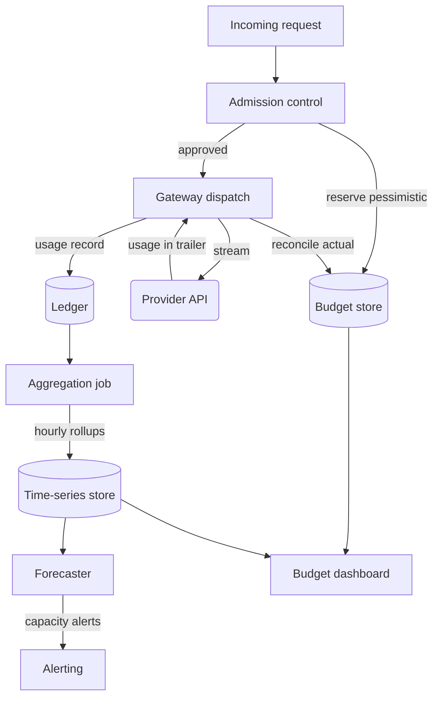

# Chapter 23 — Cost Control and Capacity Planning

> Cost control is not about spending less — it is about knowing what you spent,
> who spent it, and whether the spend was worth it, before the invoice arrives.

---

## Learning Objectives

By the end of this chapter you will be able to:

- Explain why a token budget is different from a rate limit and why you need
  both.
- Implement reserve-then-reconcile accounting that bounds overshoot to a
  predictable maximum.
- Design a multi-tenant cost allocation system that attributes spend before the
  provider invoice arrives.
- Choose between hard caps and soft caps for a given tenant class and defend the
  choice with a named trade-off.
- Forecast burn rate from historical data and explain why forecasts miss sudden
  traffic changes.
- Size overshoot bounds using concurrency and max_tokens rather than hoping.

---

## The Production Story

Consider a fintech company running four AI features: a customer support
assistant, a document summarization tool for compliance review, a transaction
anomaly detector, and an internal knowledge search. Each feature belonged to a
different team. All four shared the same organizational quota with the provider,
and all four billed to the same cost center because nobody had yet built
anything more granular.

On a Friday afternoon, the anomaly detector team deployed a change that was
supposed to improve detection accuracy by running a second-pass analysis on
flagged transactions. The change had a bug: when the first pass returned no
anomalies — which was 97% of the time — the code entered a retry loop waiting
for a different answer. The loop had no backoff and no termination condition.

By Saturday morning, the anomaly detector had burned through $43,000 in model
requests. The other three features had stopped working around 2 a.m. when the
organizational quota exhausted, but nobody noticed until Monday because the
on-call rotation was for infrastructure, not AI, and the AI features did not
page on budget errors — they paged on latency, and there was no latency because
there were no requests making it through.

Monday's discovery sequence went: customer support tickets about the assistant,
then a check of the assistant's logs showing 429 errors from the provider, then
a check of the provider dashboard showing the quota at zero, then a scramble to
identify which service had consumed it. The provider's dashboard showed spend by
API key, and there was one key for the whole organization. The only way to
identify the anomaly detector as the cause was to correlate timestamps against
each service's internal logs, which took most of Monday.

The invoice arrived three weeks later. Nobody had been alerted. Nobody had
approved the spend. The $43,000 was already spent, and the first anyone knew
about it was a PDF in someone's inbox.

---

## Why This Exists

The first AI feature in any company has no cost control because it does not need
any. Monthly spend is hundreds of dollars, it is visible on a credit card
statement, and the team that built it is the team that pays for it.

The second and third features change nothing about this, because the monthly
total is still small enough to review by eye, and the effort of building
attribution infrastructure exceeds the cost it would save.

Somewhere between the fourth and the tenth feature, these facts become true and
nobody has decided them:

- Total spend is large enough that surprises matter — not existentially, but
  enough that finance wants to forecast it.
- Spend is unevenly distributed across features, and the feature that costs the
  most is not necessarily the one delivering the most value.
- No one can answer "what did the support assistant cost last month" without
  either a single-tenant API key or an archaeology project.
- There is no mechanism to stop a runaway loop before the invoice arrives. The
  invoice is the alerting system.
- Capacity planning is a spreadsheet that someone updates quarterly, and it is
  already wrong.

Cost control exists to answer three questions in near-real-time rather than on
the invoice cycle: what are we spending, who is spending it, and is the spend
within the bounds we agreed to.

### Why this is not the same as rate limiting

Rate limits are about requests per unit time. A tenant hitting a rate limit is
sending too many requests too fast, and the remedy is to slow down.

Token budgets are about total spend over a longer window. A tenant hitting a
token budget may be sending requests at a perfectly reasonable rate — one
request per second, each with 32,000 input tokens and 4,000 output tokens. The
problem is not velocity; it is magnitude.

The two constraints operate independently and both are necessary. Rate limits
protect the platform from load spikes. Token budgets protect the organization
from cost spikes. A system with rate limits and no budget enforcement can empty
a quarterly budget in an afternoon without ever approaching a rate limit.

---

## Core Concepts

**Token budget.** A per-tenant or per-workload allowance denominated in tokens
or currency over a time window. Distinct from a rate limit, which is
denominated in requests. The window is typically daily, weekly, or monthly,
chosen to match the organization's financial reporting cadence.

**Hard cap.** A budget limit that stops requests when exhausted. Requests
receive a clear error — not a rate-limit error, which implies retrying will
help, but a budget-exhausted error, which implies it will not. Appropriate for
external or untrusted tenants where the downside of overspend is unbounded.

**Soft cap.** A budget threshold that triggers alerts without stopping requests.
Appropriate for internal tenants where stopping a production feature mid-
incident to save money is a worse outcome than the overspend.

**Reserve-then-reconcile.** The pattern for enforcing budgets against unknown
costs. At admission, reserve a pessimistic estimate — counted input tokens plus
the `max_tokens` ceiling for output. On completion, replace the reservation
with the actual usage from the provider's trailing frame. Overshoot becomes
bounded by in-flight concurrency times per-request maximum.

**Overshoot.** The amount by which actual spend can exceed the configured cap.
Unbounded in a check-then-spend system; bounded in a reserve-then-reconcile
system. The bound is: max_concurrent_requests * (max_input_tokens +
max_output_tokens) * cost_per_token.

**Burn rate.** The rate of budget consumption, typically measured hourly or
daily. The derivative of cumulative spend. The input to every capacity forecast.

**Cost attribution.** The ability to assign every token of spend to a tenant,
workload, and request, with enough detail that finance can produce per-feature
P&L and engineering can identify which service caused a spike. Requires
tagging at the gateway, not the provider — the provider does not know your
tenants.

**Capacity planning.** Forecasting future spend and quota requirements from
historical burn rates, traffic projections, and known upcoming changes. Fails
when the future does not resemble the past, which is exactly when you need it
most.

---

## Internal Architecture

Cost control splits into three subsystems that operate at different timescales
and fail in different ways.



*Admission and reconciliation happen per-request; aggregation and forecasting
run on schedule. Separating them prevents per-request latency from depending
on analytics queries.*

**Admission control.** Runs in the hot path, on every request, before dispatch.
Checks the tenant's remaining budget against the pessimistic reservation. Must
be fast — a 5 ms budget check on a 20-second request is invisible, but the same
check cannot block on a database query. Use Redis or an equivalent in-memory
store, and fail open if the store is unreachable (see Failure Scenarios).

**Budget store.** Per-tenant counters holding current period spend and headroom.
Updated twice per request: reserve on admission, reconcile on completion. The
reconciliation restores the difference between the reservation and actual,
which is how headroom recovers when the pessimistic estimate was higher than
reality.

**Ledger.** The detailed, immutable record of every request's cost. This is not
the budget store — the budget store is a running total optimized for fast
check-and-decrement, while the ledger is an audit log optimized for queryability.
Write every request's usage here, tagged with tenant, workload, request ID,
timestamp, provider, model, and whether the usage was authoritative or
estimated.

**Aggregation.** A periodic job that rolls the ledger up into hourly and daily
summaries per tenant and workload. These summaries power dashboards and
forecasts. Do not query the ledger directly for analytics — the row count at
scale makes aggregation necessary, and pre-aggregated data makes dashboards
responsive.

**Forecaster.** A system that projects future burn from historical patterns.
Can be as simple as "average of the last 7 days, extrapolated" or as complex
as a time-series model with seasonality. The simple version is usually enough.
The forecaster's job is to alert before a budget exhausts, not to predict
spend exactly.

### The reserve-then-reconcile dance

This is the central mechanism and worth tracing in detail.

1. Request arrives with 12,000 input tokens and `max_tokens: 4000`.
2. Admission reserves 16,000 tokens (input + max output) from the tenant's
   budget. Headroom decreases by 16,000.
3. Request dispatches to the provider.
4. Provider streams a response with 847 actual output tokens.
5. Gateway reconciles: actual usage was 12,847 tokens, reservation was 16,000,
   so 3,153 tokens are returned to headroom.
6. Ledger records 12,847 tokens against this request.

If the client disconnects mid-stream and the provider's trailing usage frame
never arrives, the gateway estimates output from the accumulated chunk count
(see Chapter 18) and reconciles against that estimate. The ledger row is
flagged `estimated: true`. The reservation is never left hanging — that would
leak headroom permanently.

If the request fails before dispatch, the reservation is released in full.
The `finally` block that handles this is the same one that handles disconnect,
which is why Chapter 18 insisted on it.

---

## Production Design

**Separate the budget store from the ledger.** The budget store is a hot-path
data structure optimized for two operations: check-and-decrement on admission,
increment on reconciliation. Redis with Lua scripting is the standard choice.
The ledger is a write-optimized append log, possibly Kafka or a time-series
database. Conflating them creates either a slow hot path or an unqueryable
audit trail.

**Shard the budget store by tenant, not globally.** A single Redis key per
tenant becomes a hot key at scale, but a single global key becomes a
serialization point that limits platform throughput to one budget operation at
a time. Tenants are the natural sharding boundary because budget exhaustion is
a per-tenant event.

**Reserve pessimistically, reconcile exactly.** Over-reserving wastes headroom
temporarily but prevents overshoot. Under-reserving is the bug that produces
the invoice surprise. When in doubt, reserve more — the reconciliation path
will return the excess.

**Set `max_tokens` on every request.** This is not just good practice for
controlling output length; it is the ceiling on your per-request reservation.
A request without `max_tokens` requires reserving the model's full context
window minus input, which is wasteful and spiky.

**Emit these metrics, labeled by tenant and workload:**

| Metric | Type | Why it matters |
| --- | --- | --- |
| `budget_headroom` | gauge | Alert before exhaustion, not after |
| `reservation_amount` | histogram | Understand the pessimism of your estimates |
| `reconciliation_delta` | histogram | How much headroom are you recovering |
| `budget_exhausted` | counter | The event you are trying to prevent |
| `estimated_usage` | counter | How often are you missing authoritative data |
| `burn_rate_hourly` | gauge | Input to forecasting |

**Alert on headroom, not just exhaustion.** A budget exhaustion alert fires too
late — the damage is done. Alert when headroom crosses 20% and 10% of the
period budget, giving teams time to investigate and adjust before requests
start failing.

**Make the budget period match the invoice period.** If finance reconciles
monthly, use monthly budgets. A daily budget that exhausts on the 3rd of the
month is not meaningful if the spending authority is monthly. The awkwardness
of mismatched periods is that nobody knows whether exhaustion is a problem or
just timing.

**Store cost per model, not tokens alone.** Different models have different
prices, and the prices change. The ledger should record both token counts and
the cost at the time of the request, so that historical analysis remains
accurate even after a pricing change. A ledger that records only tokens
requires a separate price-history table to answer "what did we spend in
January."

---

## Failure Scenarios

### Failure: budget overshoot from concurrent requests

**Symptom.** A tenant's spend exceeds its configured hard cap by two to five
times the cap, despite budget enforcement being enabled and showing no errors.
Discovery is via invoice, not dashboard.

**Mechanism.** Check-then-spend races. The budget check runs before dispatch,
at which point cost is unknown. One hundred concurrent requests each see
headroom of 10,000 tokens and proceed. Each consumes 8,000 tokens. Total spend
is 800,000 tokens; the cap was 10,000.

This is the classic read-modify-write race, made worse by the fact that the
write is delayed by tens of seconds of model inference. It is not fixable
within a check-then-spend model.

**Detection.** Compare dashboard totals against provider invoices monthly. A
persistent gap in the direction of undercount is this bug. Alert on
`reconciliation_delta` histograms showing large positive adjustments, which
indicate that reservations were too small.

**Mitigation.** Retrospective only — the spend has already happened. Identify
affected tenants and decide whether to adjust their bills or absorb the
overage.

**Prevention.** Reserve-then-reconcile with pessimistic input. The overshoot
bound becomes: concurrency * (max_input + max_output) * price. At 100
concurrent requests and 16,000 tokens per request, that overshoot is bounded
to a predictable dollar amount you can compute from your pricing. Document this bound and decide whether it is acceptable; if not, reduce
per-tenant concurrency limits.

### Failure: forecast misses traffic spike

**Symptom.** Burn rate triples overnight. The forecasting system, which has
been accurate for months, shows a projection that is obviously wrong by
morning. Headroom alerts fire in the wrong order — the 10% alert fires, but
the 20% alert never did.

**Mechanism.** Forecasts extrapolate from history. A marketing campaign, a
product launch, or a viral mention produces traffic that has no historical
precedent. The forecaster has no way to know about events it cannot see in
past data.

**Detection.** Alert on the delta between actual burn rate and projected burn
rate, not just on absolute headroom. A forecast that is suddenly 3x wrong is
an early warning even if absolute spend is still within budget.

**Mitigation.** Increase the budget allocation for the affected tenant or
workload. If the spike is legitimate, the budget should accommodate it; if it
is an incident, the budget limit is the wrong control and you need to fix the
traffic.

**Prevention.** Integrate known events into the forecast. If marketing has a
launch scheduled, that is not external information — it is internal
information that engineering chose not to collect. A simple calendar of
expected traffic multipliers, manually maintained, outperforms a sophisticated
model that ignores business context.

### Failure: tenant cost misattribution

**Symptom.** One tenant receives a bill that is obviously too high. Another
tenant's bill is suspiciously low. Total spend is correct; the allocation is
not. Discovery is usually when a tenant disputes an invoice.

**Mechanism.** Requests were tagged incorrectly at the gateway. Common causes:
a deployment rolled out with a hardcoded tenant ID used for testing, a header
was missing and the gateway fell back to a default, or an internal service
called the gateway without propagating tenant context. The ledger faithfully
recorded the wrong attribution.

**Detection.** Cross-check ledger totals against upstream request counts per
tenant. A tenant whose ledger spend grows faster than its request count is
receiving misattributed traffic, unless their average request size also grew.

**Mitigation.** Identify the misattributed requests by correlation —
timestamps, IP addresses, request patterns — and adjust the ledger or issue
credits. This is expensive and error-prone.

**Prevention.** Require tenant ID on every request at the gateway, rejecting
requests without it. The test environment should use a dedicated test tenant,
not production tenant IDs. The gateway should never have a default tenant
fallback; a missing tenant is an error, not an opportunity to guess.

### Failure: budget store outage causes platform outage

**Symptom.** Every request fails with a budget-check error. The budget store
(Redis) is unreachable. All tenants are affected regardless of their actual
budget status.

**Mechanism.** The gateway is configured to fail closed on budget store
errors, treating an unreachable store as a budget-exhausted condition. This
is the conservative choice for preventing overspend, and it converts an
infrastructure problem into a total outage.

**Detection.** Budget-check error rate spikes to 100% simultaneously for all
tenants. The pattern is unmistakable once you are looking for it.

**Mitigation.** Fail open temporarily. Allow requests to proceed without
budget checks while the store recovers, with aggressive alerting on the
override. This trades bounded overspend for availability.

**Prevention.** Fail open with a circuit breaker: allow unmetered traffic for
a bounded window, alert immediately, and revert to fail-closed if the store
does not recover within that window. External tenants may need to stay
fail-closed regardless — the risk calculus differs when the exposure is
abuse rather than overrun.

---

## Scaling Strategy

**First: budget store hot keys, around 1,000 requests per second per tenant.**
A single Redis key per tenant becomes a serialization point. The fix is
sharded counters: split each tenant's budget into N sub-counters, check and
reserve from any one of them, and reconcile to any one. Headroom is the sum
across shards, computed periodically rather than per-request. This trades
precision for throughput — the headroom reading is eventually consistent,
which is acceptable because the reservation mechanism already bounds
overshoot.

**Second: ledger write throughput, around 5,000 requests per second.** Per-
request ledger writes at high volume overwhelm most databases. Buffer writes
locally and flush in batches, accepting a small window of data loss on crash.
Alternatively, write to Kafka and let a consumer persist asynchronously.
The ledger is not the enforcement mechanism — that is the budget store — so
durability can be slightly relaxed in exchange for throughput.

**Third: aggregation job runtime, around 10 million ledger rows per day.**
Hourly rollups that scan the full ledger become slow. Partition the ledger by
tenant and time, and run aggregation jobs per partition in parallel. The
aggregation output should be a materialized view that dashboards query, never
the raw ledger.

**Fourth: forecast accuracy, when traffic patterns become complex.** Simple
extrapolation fails when there are multiple traffic sources with different
seasonalities, or when the mix of small vs. frontier models changes over time.
At this point you need either per-workload forecasts or a more sophisticated
model. Most organizations never reach this point; the simple forecast is
sufficient through surprisingly high scale.

---

## Trade-offs

| Decision | Buys you | Costs you | Choose when |
| --- | --- | --- | --- |
| Hard cap | Bounded spend, no surprises | Production features can stop | External tenants, untrusted workloads |
| Soft cap with alerts | Never the cause of an outage | Requires someone to answer the alert | Internal tenants, production features |
| Reserve-then-reconcile | Bounded overshoot, no races | Pessimistic headroom usage, complexity | Always; check-then-spend is broken |
| Check-then-spend | Simpler code, optimistic headroom | Unbounded overshoot at concurrency | Never in production |
| Per-request ledger writes | Full audit trail, no batching risk | Write throughput limits, higher latency | Low volume, high auditability needs |
| Batched ledger writes | High throughput, lower latency | Small window of data loss risk | High volume, tolerance for small gaps |
| Fail-open on store outage | Availability during infra issues | Unmetered spend window | Internal tenants, bounded risk |
| Fail-closed on store outage | No unmetered spend | Platform outage on infra issues | External tenants, unbounded risk |
| Per-model pricing in ledger | Accurate historical cost analysis | Storage overhead, schema complexity | Always; tokens without prices are useless |
| Token-only ledger | Simpler schema, smaller rows | Requires price history to compute cost | Never |

---

## Code Walkthrough

From `examples/ch23-cost-control/`. The budget store and reservation system
slot into the gateway's admission stage, before routing.

### Reserve-then-reconcile budget enforcement

The contract: never block the hot path on slow storage, bound overshoot to a
predictable maximum, and never leak reservations even on error paths.

```ts
// examples/ch23-cost-control/src/budget/store.ts

export class BudgetStore {
  private redis: RedisClient;
  private costPerToken: Map<string, number>;

  constructor(redis: RedisClient, pricing: Map<string, number>) {
    this.redis = redis;
    this.costPerToken = pricing;
  }

  async reserve(
    tenantId: string,
    model: string,
    inputTokens: number,
    maxOutputTokens: number,
  ): Promise<ReservationResult> {
    const pessimistic = inputTokens + maxOutputTokens;           // (1)
    const costEstimate = pessimistic * this.costFor(model);

    const result = await this.redis.eval(
      RESERVE_SCRIPT,                                            // (2)
      [this.keyFor(tenantId)],
      [costEstimate, Date.now()],
    );

    if (result.status === 'exhausted') {
      return {                                                   // (3)
        allowed: false,
        reason: 'budget_exhausted',
        headroom: result.headroom,
      };
    }

    return {
      allowed: true,
      reservationId: result.reservationId,
      reserved: costEstimate,
      headroom: result.headroom,
    };
  }

  async reconcile(
    tenantId: string,
    reservationId: string,
    actualTokens: number,
    model: string,
    estimated: boolean,
  ): Promise<void> {
    const actualCost = actualTokens * this.costFor(model);

    await this.redis.eval(                                       // (4)
      RECONCILE_SCRIPT,
      [this.keyFor(tenantId)],
      [reservationId, actualCost],
    );

    metrics.observe('reconciliation_delta',
      this.getReservation(reservationId) - actualCost);          // (5)

    if (estimated) {
      metrics.inc('estimated_usage');
    }
  }

  private costFor(model: string): number {
    return this.costPerToken.get(model) ?? this.costPerToken.get('default')!;
  }

  private keyFor(tenantId: string): string {
    return `budget:${tenantId}:${currentPeriod()}`;              // (6)
  }
}
```

1. Pessimistic reservation: input plus the full `max_tokens` ceiling. This is
   the worst case the request could produce.
2. Lua script executes atomically in Redis. The script checks headroom,
   records the reservation, and decrements in a single round trip.
3. Clear error reason distinguishes budget exhaustion from rate limiting.
   The consumer should not retry; retrying will not help.
4. Reconciliation replaces the reservation with actual. If actual is less
   than reserved, headroom increases. The reservation ID ensures we reconcile
   the correct reservation even if multiple requests are in flight.
5. The delta between reservation and actual is the measure of how pessimistic
   our estimates are. Large positive deltas mean we are over-reserving, which
   wastes headroom; negative deltas should never happen.
6. Budget key includes the period, so monthly budgets reset automatically.
   No job required to clear old budgets.

### Admission integration in the gateway

```ts
// examples/ch23-cost-control/src/gateway.ts

export async function handleRequest(
  req: CanonicalRequest,
  ctx: GatewayContext,
): Promise<void> {
  const tenant = ctx.resolveTenant(req);
  const inputTokens = countTokens(req.messages);

  const reservation = await ctx.budget.reserve(                  // (1)
    tenant.id,
    req.model,
    inputTokens,
    req.maxTokens,
  );

  if (!reservation.allowed) {
    ctx.metrics.inc('budget_exhausted', { tenant: tenant.id });
    throw new BudgetExhaustedError(tenant.id, reservation.headroom);
  }

  ctx.metrics.gauge('budget_headroom',
    reservation.headroom, { tenant: tenant.id });                // (2)

  let usage: Usage | null = null;

  try {
    for await (const chunk of streamCompletion(req, ctx)) {
      ctx.respond(chunk);
      if (chunk.kind === 'usage') {
        usage = chunk.usage;
      }
    }
  } finally {
    const actualTokens = usage?.totalTokens ??                   // (3)
      estimateFromChunks(ctx.chunkCount);
    const estimated = usage === null;

    await ctx.budget.reconcile(                                  // (4)
      tenant.id,
      reservation.reservationId,
      actualTokens,
      req.model,
      estimated,
    );

    await ctx.ledger.write({                                     // (5)
      requestId: ctx.requestId,
      tenantId: tenant.id,
      workload: req.workload,
      model: req.model,
      inputTokens,
      outputTokens: actualTokens - inputTokens,
      cost: actualTokens * ctx.pricing.costFor(req.model),
      estimated,
      timestamp: Date.now(),
    });
  }
}
```

1. Reserve before dispatch. A request that fails the budget check costs
   nothing; a request that passes the check but fails to reconcile leaks
   headroom forever, which is why the `finally` block matters.
2. Emit headroom as a gauge on every request. Alerting on this gauge is how
   you know a budget is approaching exhaustion before it exhausts.
3. Authoritative usage from the provider if available; estimate from chunk
   count if not. The Chapter 18 pattern, unchanged.
4. Reconciliation in `finally`, which runs on success, error, and client
   disconnect. The reservation is never orphaned.
5. Ledger write after reconciliation. The ledger records actual cost, not
   reserved cost, and flags estimated rows.

---

## Hands-On Lab

**Goal:** observe budget overshoot with check-then-spend, then bound it with
reserve-then-reconcile. About 3 minutes, Node 22.6+, no dependencies.

```bash
cd examples/ch23-cost-control
node scripts/lab.mjs
```

The lab runs five steps and asserts eight claims. The mock provider is the
same as Chapter 18 — deterministic token streams with predictable costs.

**Step 1 — establish a baseline with no enforcement.**

```bash
node src/load.ts --rps 10 --duration 5s --tenant baseline
curl localhost:8080/budget/baseline
```

Observed: 49 requests, 39,200 tokens consumed, no rejections. The budget
dashboard shows spend but no enforcement.

**Step 2 — enable check-then-spend with a 20,000-token hard cap.**

```bash
curl -X POST localhost:8080/admin/config \
  -d '{"enforcement": "check-then-spend"}'
curl -X POST localhost:8080/budget/overshoot \
  -d '{"limit": 20000, "period": "test"}'
node src/load.ts --rps 50 --duration 3s --tenant overshoot
curl localhost:8080/budget/overshoot
```

Observed: 47,600 tokens consumed against a 20,000-token cap — 2.4x overshoot.
Every request saw headroom above zero at check time; by the time usage was
reconciled, the budget was already exceeded. This is the Friday afternoon
scenario from the production story.

**Step 3 — enable reserve-then-reconcile.**

```bash
curl -X POST localhost:8080/admin/config \
  -d '{"enforcement": "reserve-then-reconcile"}'
curl -X POST localhost:8080/budget/bounded \
  -d '{"limit": 20000, "period": "test"}'
node src/load.ts --rps 50 --duration 3s --tenant bounded
curl localhost:8080/budget/bounded
```

Observed: 23,200 tokens consumed against a 20,000-token cap — 1.16x overshoot.
The overshoot is bounded by concurrency * max_tokens. With 10 concurrent
requests and 800 tokens per request, the maximum overshoot is 8,000 tokens.
Actual overshoot was 3,200 — well within the bound.

**Step 4 — verify reconciliation recovers headroom.**

```bash
node src/load.ts --rps 5 --duration 10s --tenant headroom
curl localhost:8080/budget/headroom
```

Observed: headroom fluctuates between requests as reservations are made and
reconciled. Over the run, total spend matches ledger totals exactly. The
pessimistic reservations do not accumulate — they are returned on reconciliation.

**Step 5 — observe ledger attribution.**

```bash
curl localhost:8080/ledger?tenant=bounded
```

Observed: every request has a ledger row with tenant, workload, model, tokens,
cost, and the `estimated` flag. The sum of ledger costs matches the budget
store total. This is the attribution the fintech company in the opening story
did not have.

---

## Interview Questions

1. Why is a token budget different from a rate limit?
2. A tenant's invoice shows 3x their configured cap. Walk me through how that
   happens with check-then-spend, and how reserve-then-reconcile prevents it.
3. Should internal tenants have hard caps or soft caps? Defend your answer
   with a specific trade-off.
4. The client disconnects mid-stream. How do you ensure the usage still gets
   recorded and attributed?
5. Your budget store (Redis) goes down. Should the gateway fail open or fail
   closed? Under what conditions does the answer change?
6. How do you forecast next month's AI spend, and what makes the forecast
   wrong?
7. Design the schema for a cost attribution ledger. What fields are mandatory,
   and why?
8. A team asks for a 10x budget increase for a launch. How do you evaluate
   the request?

## Staff-Level Answers

**Q2 — overshoot mechanism and prevention.** The senior answer describes the
race: multiple requests check headroom simultaneously, all see positive
headroom, all proceed, all spend more than the headroom. That is correct but
incomplete.

The staff answer starts with the race but then quantifies the exposure. With
check-then-spend, overshoot is unbounded — it scales with concurrency and
request duration. One hundred concurrent requests at 16,000 tokens each can
exceed a 10,000-token cap by 160x. The cap is not a cap; it is a suggestion
that works only at low concurrency.

Reserve-then-reconcile changes the property from unbounded to bounded. The
bound is: max_concurrent * pessimistic_tokens_per_request. You choose the
concurrency limit; you choose max_tokens; you can compute the worst-case
overshoot before it happens and decide if it is acceptable.

Then the staff addition: this is a resource-accounting problem with a
well-known solution. Reserving pessimistically and reconciling to actual is
how every database connection pool, every semaphore, and every memory
allocator works. The only unusual thing about token budgets is that the
reservation is measured in dollars and the reconciliation is delayed by
tens of seconds. The pattern is the same.

**Q3 — hard vs soft caps for internal tenants.** Soft caps, and the reason is
one sentence: a hard cap that stops a production feature mid-incident to save
money is a worse outcome than the overspend.

Then the nuance. Internal tenants are people who answer to the same management
chain as the platform team. If they overspend, the consequence is a budget
conversation, not fraud. The cost of that conversation is lower than the cost
of an outage.

External tenants are a different calculus. There the exposure is unbounded
abuse — a compromised API key can rack up arbitrary spend with no one on
the other end to hold accountable. Hard caps protect against a failure mode
that soft caps cannot address.

The staff move is to separate the two populations explicitly in the design.
Internal tenants get soft caps by default; external tenants get hard caps by
default; and the gateway configuration makes this distinction visible rather
than implicit. Someone will ask why tenant X hit a hard stop and tenant Y did
not; the answer should be in the config, not in someone's memory.

**Q5 — fail open or closed on budget store outage.** Fail open, because the
budget store protects against an unbounded invoice, and a gateway-wide outage
is more expensive than a few minutes of unmetered spend.

Then the qualification, because an unqualified answer is a red flag. Fail
open with a time-bounded circuit breaker: allow unmetered traffic for N
minutes, alert immediately, and revert to fail-closed if the store does not
recover. The time bound is the maximum unmetered exposure you can tolerate.

The condition that changes the answer is tenant class. For external tenants
where the exposure is abuse rather than overrun, fail-closed may be correct
even with the availability cost. But this should be a per-tenant-class
decision, not a global one.

The general principle: fail open when the policy protects money, fail closed
when it protects data or safety. PII redaction fails closed. Budget checks
fail open. Every policy in the gateway should have a documented answer,
decided when the policy is written rather than during the incident that first
tests it.

**Q6 — forecasting spend.** The baseline is simple: average of the last N
days, extrapolated to the forecast horizon. For most organizations this is
sufficient, and sophistication adds more failure modes than it fixes.

What makes the forecast wrong is external events: launches, campaigns, viral
moments, incidents that drive traffic away. These are not statistical
anomalies — they are business events that engineering chose not to know about.
The fix is not a better model; it is a calendar. If marketing has a launch
scheduled, that multiplier belongs in the forecast as a manual input.

The second thing that makes forecasts wrong is mix shift. If the fraction of
traffic using frontier models increases, spend increases faster than request
volume. The forecast should track spend per model tier, not just total
requests.

The staff addition: the point of the forecast is not to be right, it is to be
usefully wrong. A forecast that alerts a week early on budget exhaustion is
useful even if the exact exhaustion date is off by three days. A forecast
that is accurate in steady state but blind to spikes is not useful, because
steady state is when you do not need a forecast. The forecast exists to buy
time, not to predict the future.

**Q8 — evaluating a 10x budget increase request.** The first question is: 10x
of what baseline? If current spend is $200/month, 10x is a rounding error. If
current spend is $200,000/month, 10x is a capacity planning conversation and
possibly a negotiation with the provider.

The second question is: what changed? A 10x ask implies a 10x traffic
increase, or a model tier change, or a new feature. Understand which, because
they have different risk profiles. A launch is a known event with a known
date; a model tier change is a sustained increase; a new feature might
succeed or might not.

The third question is: what happens if the launch underperforms? The budget
that was 10x for an expected launch is 100x for an actual flop. Is the team
prepared to adjust quickly, or will the budget sit allocated and unused?

The staff move is to approve the increase with a review trigger. Grant the
10x for the launch window, with a scheduled review two weeks after launch to
right-size based on actual usage. This avoids both the delay of over-analysis
and the drift of an unreviewed permanent increase.

---

## Exercises

1. **Overshoot math.** A tenant has a 100,000-token budget, 50 concurrent
   requests in flight, and each request reserves 4,000 tokens (2,000 input +
   2,000 max output). Compute the maximum overshoot with reserve-then-reconcile.
   Then compute what happens with check-then-spend if each request actually
   uses 3,000 tokens.

2. **Build the sharded counter.** Modify the budget store in
   `examples/ch23-cost-control/` to use 8 shards per tenant. Measure throughput
   with and without sharding at 1,000 requests per second.

3. **Forecast accuracy.** Using the ledger from the lab, implement a simple
   7-day moving average forecast. Inject a 3x traffic spike on day 8 and
   measure how long it takes the forecast to adjust. Then add a manual
   multiplier input and show that it catches the spike immediately.

4. **Ledger rollup.** Implement an hourly aggregation job that produces
   per-tenant, per-workload summaries from the raw ledger. Measure query
   latency against 100,000 ledger rows with and without the rollup.

5. **Design question.** A tenant asks for real-time spend visibility, updating
   every second. The current system updates every minute. Write the one-page
   RFC proposing the change, including the architecture modification, the cost
   (infrastructure and latency), and the alternative of explaining why per-
   minute is sufficient.

---

## Further Reading

- **Anthropic, OpenAI, and Google billing documentation** — read all three,
  specifically the sections on usage reporting and prompt caching discounts.
  The timing of usage data, the granularity of attribution, and the caching
  rules differ enough to affect your reconciliation design.

- **Kleppmann, *Designing Data-Intensive Applications*, chapter 7** — the
  transaction isolation material explains why check-then-spend races and how
  to think about reservation patterns. The problems are not specific to
  budgets; the solutions apply directly.

- **Google SRE Book, chapter 21, "Handling Overload"** — the section on quota
  management and the distinction between per-user and global quotas. The
  framing is rate limiting, but the capacity-allocation patterns transfer to
  budget management.

- **Hellerstein et al., "Applying Control Theory in the Real World"** — the
  feedback-loop material is relevant to reconciliation timing. How quickly
  should you reconcile? How much lag is acceptable before headroom estimates
  diverge from reality?

- **Your organization's financial reporting calendar** — not a citation, a
  prerequisite. The budget period must match the reporting period, or every
  conversation about spend will require a translation. Find out when finance
  closes the books before you design the budget schema.

- **The ledger from Chapter 18** — this chapter extends it. If the ledger
  does not exist yet, build that before building budget enforcement, because
  enforcement without attribution produces spend data that cannot be
  explained.
