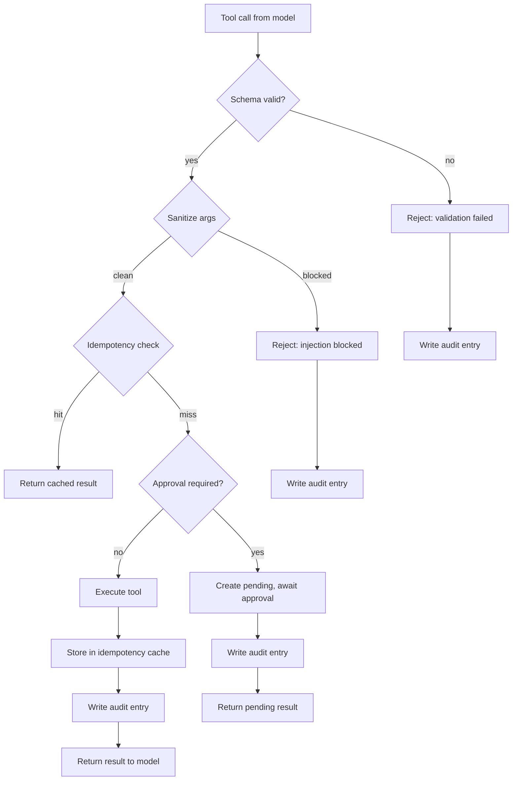

# Chapter 24 — Tool Calling and Tool Security

> The moment you give a model the ability to act on the world, every prompt
> injection becomes a potential remote code execution.

---

## Learning Objectives

By the end of this chapter you will be able to:

- Explain why tool calling requires different security controls than text
  generation and identify the specific risks that tools introduce.
- Implement idempotency keys that guarantee exactly-once execution even when
  the model retries or the client reconnects.
- Design an approval workflow that gates high-stakes operations behind human
  review without blocking low-stakes operations.
- Validate tool arguments against a JSON schema before execution and reject
  calls that do not conform.
- Sanitize tool arguments to block injection attacks, distinguishing between
  patterns that should block execution and patterns that should be stripped.
- Build an audit trail that records every tool operation with enough detail
  for forensics while avoiding sensitive data in logs.

---

## The Production Story

Consider a retail bank running an AI assistant for customer service. The
assistant can answer questions about account balances, explain transaction
history, and — after a product launch — initiate transfers between a
customer's own accounts. The transfer capability had been tested extensively:
the model understood the difference between "move $500 to savings" and "what
would happen if I moved $500 to savings," and the team had run thousands of
synthetic conversations without incident.

Three weeks after launch, a customer reported that their checking account was
empty. The fraud team investigated and found six transfers, each for $8,000,
executed within 90 seconds. The transfers went to an external account the
customer had never added. The session logs showed a conversation that began
normally — the customer asked about their balance — and then contained
messages that made no sense: fragments of what looked like system prompts,
repeated requests to "confirm the transfer," and finally a string of transfer
confirmations.

The root cause was a prompt injection embedded in an email that the customer
had asked the assistant to summarize. The email contained invisible Unicode
characters and a payload that exploited the assistant's tool-calling
capability. The payload was crafted to make the model believe it was in a
different conversation where a transfer had already been approved.

Three security failures had compounded:

1. The tool had no idempotency protection. The model called it six times with
   six different request IDs, and it executed six times.

2. The tool had no approval workflow. $48,000 transferred without human
   review because the amount per transfer was below the $10,000 threshold —
   and the threshold was per-transfer, not per-session.

3. The sanitizer checked for visible injection markers but not invisible
   Unicode. The payload passed validation because it contained no angle
   brackets or obvious command sequences.

The bank recovered the funds through the ACH dispute process, but the
incident exposed a gap that no amount of prompt engineering could close: when
a model can take actions with real consequences, the security boundary must
be in the tool layer, not the prompt layer.

---

## Why This Exists

The first generation of LLM applications were text-in, text-out. A prompt
went in, a completion came out, and the only consequence was what a human
decided to do with the text. The security model was simple: filter inputs for
policy violations, filter outputs for harmful content, and treat everything
in between as a string-processing problem.

Tool calling changed this. When a model can invoke functions — check a
balance, book a flight, send an email, transfer money — the output is no
longer advisory. It is an action. The distinction matters because:

**Actions are not reversible by editing.** If a text generation contains an
error, you delete the response and regenerate. If a transfer executes, you
need a dispute process, a reversal transaction, and possibly legal review.
The cost of a mistake scales with the stakes of the action.

**Actions are not contained by the conversation.** A bad response affects one
user. A bad tool call can affect a database, an external service, or another
user's account. The blast radius expands beyond the session.

**Actions are triggered by model output, not user input.** In a text
application, the user controls what they send. In a tool-calling application,
the user controls what they say, but the model controls what gets executed.
A prompt injection that corrupts the model's reasoning can trigger actions
the user never requested.

These properties mean that the security controls for text generation are
necessary but not sufficient for tool calling. You still need input filtering
and output filtering, but you also need:

- **Schema validation** to ensure tool arguments match their declared types
  before execution.
- **Idempotency** to ensure the same logical operation executes exactly once
  even if the model retries.
- **Approval workflows** to ensure high-stakes operations require human
  confirmation.
- **Audit trails** to ensure every operation is recorded for forensics and
  compliance.
- **Argument sanitization** to ensure injection payloads in tool arguments
  are blocked before they reach business logic.

None of these are new ideas — they are standard practice in API design. What
is new is applying them to model output, where the caller is not a trusted
service but a neural network that can be manipulated by adversarial input.

---

## Core Concepts

**Tool calling.** The capability for a model to output structured function
invocations alongside or instead of text. The model specifies a function name
and arguments; the application executes the function and returns the result
to the model for incorporation into its response. Also called function
calling in some provider APIs.

**Tool definition.** A schema that declares a tool's name, description, and
parameter types. The model uses this schema to understand when and how to
invoke the tool. The application uses it to validate incoming calls.

**Idempotency key.** A client-supplied identifier that uniquely identifies a
logical operation. If the same key is seen twice, the second execution
returns the result of the first without re-executing. Prevents duplicate
side effects from retries.

**Approval workflow.** A pattern where high-stakes operations are recorded
as pending and require explicit human approval before completion. The model
can initiate but not finalize. Sometimes called human-in-the-loop.

**Audit trail.** An append-only log of every tool operation, recording who
requested it, what arguments were supplied, what the outcome was, and when it
happened. The foundation for forensics, compliance, and anomaly detection.

**Schema validation.** Checking that tool arguments conform to the declared
types, required fields, and constraints before execution. Malformed calls
are rejected without reaching business logic.

**Argument sanitization.** Cleaning tool arguments to remove or block
potentially dangerous content such as injection payloads, control characters,
or excessive length. Sanitization happens after validation.

---

## Internal Architecture

Tool execution is a pipeline with multiple stages, each of which can reject
the call. The order matters: validation before sanitization, sanitization
before idempotency, idempotency before approval.



*Every path through the executor ends with an audit entry. Rejections are
logged with the reason; successes are logged with the outcome.*

### Why this order

**Validation first** because there is no point sanitizing an argument that
fails type checking. A string where a number was expected will not become
valid by removing control characters.

**Sanitization before idempotency** because a poisoned idempotency key could
be crafted to collide with a legitimate one. Sanitizing first ensures the key
that gets looked up is clean.

**Idempotency before approval** because a pending operation should return the
same pending result on retry, not create a second approval request.

**Approval before execution** because once the action happens, it is too late
to ask for permission.

**Audit everywhere** because every decision point is a potential incident
that needs investigation.

### The idempotency contract

Idempotency is about outcomes, not inputs. If you see the same key, you
return the same result, even if the underlying state has changed since the
first execution.

```
First call:    key="abc", amount=100 -> executes, stores {transferId: "xyz"}
Second call:   key="abc", amount=100 -> returns stored {transferId: "xyz"}
Third call:    key="abc", amount=200 -> returns stored {transferId: "xyz"}
                                        (amount ignored, key wins)
```

This is not a bug. The third call has a different amount, but the key is the
same, so it returns the same result. The alternative — re-executing with
different arguments — defeats the purpose of idempotency. The model may
hallucinate different amounts on retry; the idempotency layer ensures the
first execution is the only execution.

The TTL on idempotency keys must be long enough to cover the retry window.
24 hours is typical. After expiration, the same key can trigger a new
execution, which is correct behavior: if a day has passed, it is probably a
new request with a reused key, and the operation should proceed.

### The approval workflow

For operations above a threshold, execution pauses after validation and
sanitization:

```
1. Model requests transfer of $20,000
2. Executor validates and sanitizes
3. Executor checks: $20,000 > $10,000 threshold
4. Executor creates ApprovalRequest, stores TransferResult as pending
5. Executor stores pending result in idempotency cache
6. Executor returns {status: pending_approval, approvalId: "..."}
7. Human reviews via separate channel (dashboard, Slack, email)
8. Human approves
9. Executor completes the transfer, updates idempotency cache
```

If the model retries with the same idempotency key while the approval is
pending, it gets the pending result. After approval, it gets the completed
result. The idempotency layer handles both cases correctly.

Rejection works similarly: the human rejects, the executor marks the transfer
as rejected, updates the idempotency cache, and future retries return the
rejected result.

---

## Production Design

**Put the executor in front of every tool.** Do not expose tools directly to
the model-calling code. Every tool invocation should flow through the
executor pipeline, which handles validation, sanitization, idempotency,
approval, and audit. A tool that bypasses the executor is a tool with no
security controls.

**Use the model's native tool schema where possible.** Most providers support
JSON schema for tool definitions. Use that schema for both model guidance and
server-side validation. Maintaining two schemas that can drift is a bug
waiting to happen.

**Emit these metrics, labeled by tool name:**

| Metric | Type | Why it matters |
| --- | --- | --- |
| `tool_call_count` | counter | Baseline for anomaly detection |
| `tool_validation_failures` | counter | Schema bugs or fuzzing attacks |
| `tool_injection_blocks` | counter | Active attacks or false positives |
| `tool_idempotency_hits` | counter | Retry rate, may indicate instability |
| `tool_approval_pending` | gauge | Backlog of human review |
| `tool_execution_duration` | histogram | Performance baseline |

**Alert on injection blocks, not just log them.** An injection block is
either an attack or a false positive. Both need investigation. A spike in
blocks that correlates with a single user or session is an active attack.
A steady rate across many users suggests the sanitizer is too aggressive.

**Set per-session limits, not just per-call limits.** The banking incident
involved multiple transfers each below the threshold. Per-session limits
would have caught it: "this session has already transferred $24,000, the
next $8,000 request exceeds the $10,000 session limit."

**Store the sanitization result, not just the sanitized value.** When an
incident happens, you need to know what was removed, not just what remained.
The audit entry should include the modifications list.

**Fail closed on idempotency store errors.** If you cannot check whether
a key has been seen, assume it has not and proceed — but only if the
operation is retriable. For transfers, fail closed: a Redis outage should
not cause duplicate transfers.

**Separate the idempotency store from the business database.** Idempotency
checks are on the hot path; business logic may involve slow transactions.
Use Redis or a similar low-latency store for idempotency, write the result
to the business database after execution, and accept that a crash between
the two can leave an orphaned idempotency entry. The alternative — a
distributed transaction — is slower and more complex.

---

## Failure Scenarios

### Failure: duplicate execution from retry

**Symptom.** A customer complains of double-charged or double-transferred
amounts. The audit log shows two executions with different tool call IDs
but identical logical operations.

**Mechanism.** The model generated two tool calls because of a network
timeout, a streaming disconnect, or a hallucinated retry. Each call had a
different tool call ID, and the executor treated them as independent
operations.

**Detection.** Alert on tool executions where the arguments (minus the
call ID) match a recent execution for the same session. Also alert on
idempotency key collisions that return different results.

**Mitigation.** Reverse one of the duplicate transactions. Identify which
was the user's intent (usually the first) and reverse the other.

**Prevention.** Require idempotency keys for all state-changing tools.
Generate the key client-side or model-side, not server-side. The key must
be stable across retries: derive it from session ID + operation type +
timestamp, or let the model generate it as part of the tool arguments.

### Failure: approval backlog causes timeouts

**Symptom.** High-value operations time out waiting for approval. Users see
"pending" status indefinitely. The model may interpret this as failure and
tell the user their request could not be processed.

**Mechanism.** Approvals are queued but humans are not reviewing them fast
enough. The queue grows, latency increases, and eventually requests hit the
client timeout before approval arrives.

**Detection.** Alert on `tool_approval_pending` gauge above threshold, and
on average approval latency exceeding SLA.

**Mitigation.** Add reviewers temporarily. Consider auto-approving requests
below a lower threshold to reduce volume, with post-hoc audit.

**Prevention.** Set approval thresholds based on review capacity, not just
risk. If you can review 50 requests per hour and you receive 200, the
threshold is too low. Either raise it or add automation for low-risk cases.

### Failure: sanitizer blocks legitimate input

**Symptom.** Users report that certain operations fail with "request blocked"
errors. The operations are legitimate; the sanitizer is too aggressive.

**Mechanism.** A pattern intended to catch injection matches legitimate
content. Example: blocking "OR" catches SQL injection but also blocks the
word "Oregon" or "order."

**Detection.** Monitor `tool_injection_blocks` by user and compare against
baseline. A single user with many blocks may be an attacker; many users with
occasional blocks suggests false positives.

**Mitigation.** Add the false-positive pattern to an allowlist, or refine
the blocking regex to be more specific.

**Prevention.** Test sanitizers against a corpus of legitimate inputs before
deployment. The corpus should include edge cases: addresses with special
characters, memos with punctuation, names with apostrophes.

### Failure: injection bypass via encoding

**Symptom.** An injection attack succeeds despite the sanitizer. The audit
log shows the payload passed validation and sanitization.

**Mechanism.** The payload used an encoding the sanitizer did not check:
URL encoding, Unicode normalization, Base64, or mixed-case variations. The
sanitizer checked for `<system>` but not `%3Csystem%3E` or `<SYSTEM>`.

**Detection.** Post-hoc analysis of successful attacks. Also monitor for
unusual Unicode in tool arguments.

**Mitigation.** Depends on the attack. May require reversing transactions,
rotating credentials, or notifying affected users.

**Prevention.** Normalize inputs before pattern matching: decode URL
encoding, normalize Unicode, lowercase. Check against a canonicalized form,
not the raw input.

---

## Scaling Strategy

**First: idempotency store hot keys, around 500 requests per second per key
prefix.** The store is keyed by idempotency key, which should be unique per
operation. If keys are poorly distributed (e.g., all starting with the same
prefix), the store becomes a bottleneck. Use random or timestamp-based
prefixes.

**Second: audit log write throughput, around 2,000 entries per second.** Each
tool call generates at least one audit entry; rejections generate more. At
high volume, synchronous writes block execution. Buffer writes and flush
asynchronously, accepting a small window of data loss on crash.

**Third: approval queue depth, depends on human capacity.** There is no
technical scaling strategy for human review; you either raise thresholds,
add automation, or add reviewers. The queue depth is a product decision.

**Fourth: schema validation cost, negligible until 10,000+ properties.** JSON
schema validation is fast for typical tool schemas. If you have tools with
thousands of properties (unusual), consider compiled validators.

---

## Trade-offs

| Decision | Buys you | Costs you | Choose when |
| --- | --- | --- | --- |
| Client-generated idempotency keys | Stability across retries | Trust in client behavior | Model or SDK generates keys |
| Server-generated idempotency keys | No client trust required | Retries create duplicates | Client cannot be trusted |
| Per-call approval threshold | Simple to implement | Bypassed by splitting | Low attack sophistication |
| Per-session approval threshold | Catches split attacks | Tracking complexity | High-value targets |
| Block on injection match | No false negatives | False positives | Sensitive operations |
| Strip on injection match | No false positives | False negatives | Low-sensitivity operations |
| Synchronous audit writes | No data loss window | Higher latency | Compliance requirements |
| Async audit writes | Lower latency | Small loss window on crash | Performance requirements |
| Fail open on idempotency store error | Availability | Possible duplicates | Low-stakes operations |
| Fail closed on idempotency store error | No duplicates | Unavailability | High-stakes operations |

---

## Code Walkthrough

From `examples/ch24-tool-calling/`. The executor orchestrates all security
guards and invokes business logic only after all checks pass.

### Tool schema definition

The schema serves two purposes: guiding the model and validating calls.

```ts
// examples/ch24-tool-calling/src/types.ts

export const TRANSFER_TOOL: ToolDefinition = {
  name: 'transfer_funds',
  description: 'Transfer funds between bank accounts',
  parameters: {
    type: 'object',
    properties: {
      from_account: {
        type: 'string',
        description: 'Source account ID',
        pattern: '^[a-zA-Z0-9_-]+$',                        // (1)
        maxLength: 64,
      },
      to_account: {
        type: 'string',
        description: 'Destination account ID',
        pattern: '^[a-zA-Z0-9_-]+$',
        maxLength: 64,
      },
      amount: {
        type: 'number',
        description: 'Amount to transfer in cents',
        minimum: 1,
        maximum: 100_000_000,                               // (2)
      },
      currency: {
        type: 'string',
        enum: ['USD', 'EUR', 'GBP'],                        // (3)
      },
      idempotency_key: {
        type: 'string',
        pattern: '^[a-zA-Z0-9_-]+$',
        maxLength: 128,
      },
    },
    required: ['from_account', 'to_account', 'amount',
               'currency', 'idempotency_key'],
    additionalProperties: false,                            // (4)
  },
};
```

1. Pattern constraint rejects SQL injection at the schema level. An account
   ID with `'; DROP TABLE` fails validation before sanitization.
2. Maximum bounds the model's authority. Even if tricked, it cannot request
   more than $1M in a single call.
3. Enum prevents currency injection. Only known currencies are accepted.
4. No extra properties means the model cannot add unexpected fields that
   might bypass later checks.

### Argument sanitization

Sanitization is defense in depth — it catches what validation misses.

```ts
// examples/ch24-tool-calling/src/sanitizer.ts

const INJECTION_PATTERNS: Array<{
  pattern: RegExp;
  name: string;
  severity: 'block' | 'strip';
}> = [
  {
    pattern: /('|--|;|\bOR\b\s+\d+\s*=\s*\d+)/i,           // (1)
    name: 'sql_injection',
    severity: 'block',
  },
  {
    pattern: /(\$\(|`|&&|\|\|)/,                           // (2)
    name: 'command_injection',
    severity: 'block',
  },
  {
    pattern: /(<\/?system>|ignore\s+previous)/i,           // (3)
    name: 'prompt_injection',
    severity: 'block',
  },
  {
    pattern: /[\u200B-\u200D]/,                            // (4)
    name: 'invisible_chars',
    severity: 'strip',
  },
];
```

1. SQL injection markers. Apostrophe, comment, semicolon, and tautology.
2. Command injection markers. Subshell, backtick, and logical operators.
3. Prompt injection markers. XML tags and directive phrases.
4. Invisible characters. These are stripped rather than blocked because they
   sometimes appear in legitimate copy-pasted text. Blocking would create
   false positives; stripping neutralizes the threat.

### The executor pipeline

All security guards in sequence, with early exit on rejection.

```ts
// examples/ch24-tool-calling/src/executor.ts

execute(toolCall: ToolCall, actor: ActorContext): ToolResult {
  const startTime = Date.now();
  this.audit.logToolCallReceived(actor.userId, toolCall);

  // Step 1: Schema validation
  const validation = this.validator.validate(
    toolCall.name, toolCall.arguments);
  if (!validation.valid) {
    this.audit.logValidationFailed(
      actor.userId, toolCall, validation.errors);               // (1)
    return {
      toolCallId: toolCall.id,
      success: false,
      error: `Validation failed: ${validation.errors
        .map(e => e.message).join('; ')}`,
    };
  }

  // Step 2: Sanitize
  const sanitizeResult = this.sanitizer.sanitize(
    toolCall.arguments, toolDef);
  if (sanitizeResult.blocked) {
    this.audit.logInjectionBlocked(
      actor.userId, toolCall, sanitizeResult.blockReason);      // (2)
    return {
      toolCallId: toolCall.id,
      success: false,
      error: `Request blocked: ${sanitizeResult.blockReason}`,
    };
  }

  // Steps 3-6 depend on tool type
  return this.executeTransfer(
    toolCall.id, sanitizeResult.sanitized, actor, startTime);
}
```

1. Validation failures are logged with the specific errors. This helps debug
   schema mismatches and identify fuzzing attempts.
2. Injection blocks include the reason but not the full payload. The payload
   might contain sensitive content; the reason is enough for investigation.

### Idempotency and approval in the transfer handler

```ts
// examples/ch24-tool-calling/src/executor.ts

private executeTransfer(
  toolCallId: string,
  args: Record<string, unknown>,
  actor: ActorContext,
  startTime: number
): ToolResult {
  const idempotencyKey = args.idempotency_key as string;

  // Step 3: Check idempotency cache
  const cached = this.idempotency.get(idempotencyKey);
  if (cached) {
    this.audit.logIdempotencyHit(
      actor.userId, toolCallId, idempotencyKey);                // (1)
    return { toolCallId, success: true, result: cached };
  }

  const request: TransferRequest = { /* build from args */ };
  this.audit.logTransferInitiated(actor.userId, ...);

  // Step 4: Check approval requirement
  if (this.approvals.requiresApproval(request)) {
    const approval = this.approvals.createRequest(
      request, actor.userId);
    const pendingResult = this.bank.recordPendingTransfer(
      request, transferId, approval.id);
    this.idempotency.set(idempotencyKey, pendingResult);        // (2)
    this.audit.logApprovalRequested(actor.userId, ...);
    return {
      toolCallId,
      success: true,
      result: pendingResult,
      requiresApproval: true,
      approvalId: approval.id,
    };
  }

  // Step 5: Execute
  try {
    const result = this.bank.executeTransfer(request, transferId);
    this.idempotency.set(idempotencyKey, result);
    this.audit.logTransferCompleted(actor.userId, ...);
    return { toolCallId, success: true, result };
  } catch (error) {
    this.audit.logTransferRejected(actor.userId, ...);          // (3)
    return { toolCallId, success: false, error: error.message };
  }
}
```

1. Idempotency hit returns the cached result without re-executing. The audit
   entry records the hit, not a new execution.
2. Pending results are cached. A retry while pending returns the pending
   result, not a second approval request.
3. Execution failures are logged and returned. The idempotency cache is not
   updated, so a retry will attempt execution again.

---

## Hands-On Lab

**Goal:** observe idempotency, approval gating, injection blocking, and
audit logging. About 3 minutes, Node 22.6+, no dependencies.

```bash
cd examples/ch24-tool-calling
node scripts/lab.mjs
```

The lab runs five steps and asserts 17 claims.

**Step 1 — idempotency enforcement.**

The lab executes a transfer twice with the same idempotency key. The first
call executes; the second returns the cached result. The balance changes
only once.

```
  [PASS] first transfer succeeds
  [PASS] second call returns same result (idempotent)
  [PASS] balance only changes once
  [PASS] audit records idempotency hit
```

**Step 2 — approval gating.**

A transfer below $10,000 executes immediately. A transfer above $10,000
returns pending status. The balance does not change until a human approves.

```
  [PASS] small transfer executes immediately
  [PASS] large transfer requires approval
  [PASS] large transfer status is pending
  [PASS] balance unchanged while pending
  [PASS] approved transfer completes
  [PASS] balance changes after approval
```

**Step 3 — injection resistance.**

The lab attempts SQL injection, command injection, and prompt injection.
All three are blocked; the audit log records the blocks.

```
  [PASS] all injection attempts blocked
  [PASS] audit records injection attempts
```

**Step 4 — schema validation.**

The lab sends malformed calls: missing fields, wrong types, invalid enums,
out-of-range values. All are rejected before reaching business logic.

```
  [PASS] invalid calls rejected by validation
  [PASS] audit records validation failures
```

**Step 5 — audit completeness.**

Every operation has an audit entry with timestamp, actor, action, and
result. Blocked entries are correctly marked.

```
  [PASS] successful transfer has full audit trail
  [PASS] all entries have required fields
  [PASS] blocked entries correctly marked
```

---

## Interview Questions

1. Why is idempotency more important for tool calling than for text
   generation?

2. A model generates a tool call to transfer $50,000. Walk me through the
   execution path, including all security checks.

3. How do you decide whether an injection pattern should block execution or
   just strip the offending content?

4. The approval queue is backing up. What are your options, and what are the
   trade-offs of each?

5. Design the audit schema for tool operations. What fields are mandatory,
   and what fields should be omitted?

6. A prompt injection bypasses your sanitizer. How do you detect it, and
   what do you do next?

7. Should the idempotency key be generated by the model, the client, or the
   server? Defend your choice.

8. How do you test a tool security pipeline? What inputs should be in your
   test corpus?

---

## Staff-Level Answers

**Q2 — execution path for a $50,000 transfer.** The senior answer lists the
stages: validation, sanitization, idempotency, approval, execution. That is
correct but incomplete.

The staff answer traces the data flow. The tool call arrives with arguments.
Validation checks: is `from_account` a string matching the pattern? Is
`amount` a number between 1 and 100M? Is `currency` one of USD/EUR/GBP? Is
`idempotency_key` present and valid? If any check fails, log and reject.

Sanitization checks: do any string arguments contain SQL injection markers,
command injection markers, or prompt injection markers? If yes, log and
block. Do any contain invisible characters? If yes, strip them and log the
modification.

Idempotency check: has this key been seen? If yes, return the cached result.
If no, acquire a short-lived lock to prevent races and proceed.

Approval check: is $50,000 greater than the $10,000 threshold? Yes, so
create an ApprovalRequest, record the transfer as pending, store the pending
result in the idempotency cache, and return.

Human reviews and approves via a separate channel. The approval handler
completes the transfer, updates the idempotency cache with the completed
result, and logs.

Future retries with the same idempotency key return the completed result.

The staff addition: identify what happens on each failure path. Validation
failure logs and returns error. Sanitization block logs and returns error.
Idempotency hit logs and returns cached. Approval creates pending and returns
pending. Business logic failure logs and returns error but does not update
idempotency, so retry will attempt again. Each path ends with an audit entry.

**Q3 — block vs strip decision.** Block when the pattern indicates clear
malicious intent with no legitimate use case. SQL injection markers in an
account ID field have no legitimate use. Command injection markers in a
memo field have no legitimate use. Prompt injection phrases like "ignore
previous instructions" have no legitimate use.

Strip when the pattern might appear in legitimate content but should be
neutralized. Invisible Unicode characters are an example: they sometimes
appear in copy-pasted text from documents, but they should not be present
in tool arguments. Stripping removes the threat without rejecting the
request.

The staff refinement: the decision depends on the field. A control character
in a memo might be stripped; the same character in an account ID should
probably block, because account IDs should never contain control characters.
Context matters, and a single global policy may be too coarse.

**Q6 — detecting and responding to a bypass.** Detection is hard because a
successful bypass looks like a legitimate request. Start with anomaly
detection: unusual patterns in tool arguments, unusual sequences of calls,
unusual amounts or destinations. Correlate with upstream indicators: did
this session recently process user-provided content that could contain a
payload?

If you detect a bypass after the fact, response depends on impact. Reverse
transactions if possible. Notify affected users. Rotate credentials if the
attack involved credential extraction. File a fraud report if funds left
the system.

Then fix: identify what the sanitizer missed, add the pattern, and backfill
detection for historical data that might have been affected.

The staff perspective: assume bypasses will happen. The sanitizer is not a
guarantee; it is a layer. The approval workflow is a second layer — even if
the sanitizer is bypassed, high-value operations still require human review.
The audit trail is a third layer — even if both are bypassed, you can
reconstruct what happened. Defense in depth means no single failure causes
total compromise.

**Q7 — who generates the idempotency key.** The model should generate it,
with the key derived from a stable seed (session ID, timestamp, operation
type). This is counterintuitive — we do not trust the model's reasoning, so
why trust its key generation?

The answer: the key does not need to be trusted, only stable. If the model
generates the same key on retry, idempotency works. If the model generates
a different key, the worst case is duplicate execution, which is the same
failure mode as having no idempotency at all — we are no worse off.

Server-side generation does not help because the server has no way to know
that two different tool calls are retries of the same logical operation.
The server sees two calls with two IDs; without a stable key from the caller,
they are independent.

Client-side generation (in the SDK) works but requires SDK changes. Model-
side generation works with any SDK by making the key a required argument.

The staff move: validate the key format and reject obviously malformed keys,
but do not try to verify that the key is "correct" for the operation. The
goal is stability across retries, not cryptographic proof of intent.

---

## Exercises

1. **Threshold bypass.** The lab uses per-call thresholds. Modify the
   approval manager to track per-session totals and reject when the session
   total exceeds a second threshold. Test with multiple small transfers that
   sum above the threshold.

2. **Sanitizer bypass.** The sanitizer blocks `$(...)` but not `$( ... )`
   with spaces. Add a test that exploits this gap, then fix the regex.

3. **Idempotency races.** Simulate concurrent calls with the same idempotency
   key arriving at the same time. Verify that only one executes. Hint: you
   will need to modify the store to add a lock.

4. **Audit query performance.** Add 100,000 audit entries and measure query
   latency for by-actor, by-tool, and by-time-range queries. Implement an
   index structure that keeps all queries under 10 ms.

5. **Design question.** A compliance team asks for the ability to replay
   any tool execution from the audit log. What additional data would you
   need to store, and what are the risks of storing it?

---

## Further Reading

- **Anthropic tool use documentation** — the reference for structured tool
  calling with Claude. Pay attention to the schema format and the handling
  of tool results in multi-turn conversations.

- **OWASP Injection Prevention Cheat Sheet** — not AI-specific, but the
  patterns are directly applicable. Parameterized queries, input validation,
  and context-aware encoding.

- **Simon Willison's writing on prompt injection** — the best ongoing
  coverage of prompt injection attacks and defenses. His blog and talks
  cover real-world examples and the limitations of current mitigations.

- **Stripe's idempotency documentation** — the gold standard for API
  idempotency design. Their patterns for key generation, storage, and
  expiration are directly applicable to tool calling.

- **"Designing Data-Intensive Applications," chapter 11** — the stream
  processing chapter covers exactly-once semantics and idempotency in
  distributed systems. The problems are the same; the context is different.

- **Your organization's incident response playbook** — tool security
  incidents require coordination across security, engineering, and
  sometimes legal. Know the playbook before you need it.
