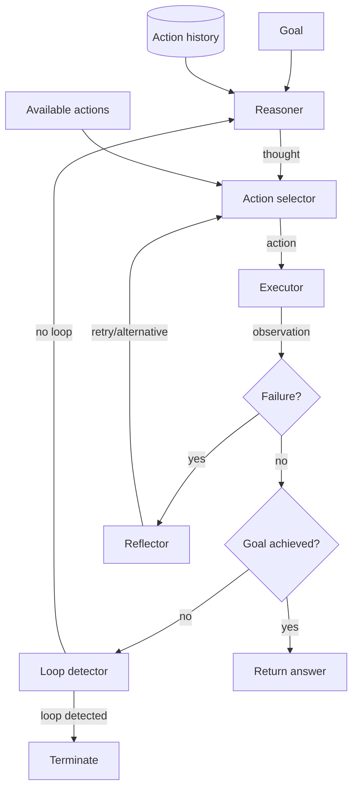

# Chapter 25 — Planning, Reflection, and ReAct

> An agent that cannot reflect on failure will repeat it. An agent that cannot
> detect a loop will never terminate.

---

## Learning Objectives

By the end of this chapter you will be able to:

- Implement the ReAct (Reason-Act-Observe) loop and explain why each phase
  exists.
- Design reflection mechanisms that analyze action failures and suggest
  alternative approaches.
- Build loop detection that terminates agents stuck in repetitive patterns
  before they exhaust resources.
- Decompose complex goals into task graphs with dependencies and execute them
  in correct order.
- Track goal state to detect drift and enable backtracking when an approach
  fails.
- Configure termination conditions that balance thoroughness against runaway
  execution.

---

## The Production Story

Consider a financial services company deploying an agent to help customers
manage their accounts. The agent can check balances, transfer funds, set up
automatic payments, and answer questions about fees. During initial testing,
everything works: simple queries complete in seconds, transfers succeed, and
the team celebrates a successful launch.

Two days after deployment, the monitoring dashboard shows a spike in provider
costs. One user's session has been running for 47 minutes and has made 2,400
API calls. The agent is stuck. The user asked "What's the best way to save
money on fees?" — an open-ended question with no definitive answer. The agent
searched for fee information, found some, decided the answer was incomplete,
searched again with slightly different terms, found the same information,
searched again. Each iteration produced a thought like "I should find more
details about fees" followed by a search that returned the same results.

The on-call engineer killed the session manually. The post-mortem revealed
three missing pieces: no maximum iteration limit, no loop detection, and no
reflection that would recognize "I already tried this and it did not help."
The agent had everything it needed to answer the question after the first
search. It lacked the ability to recognize that it had enough.

The team's first instinct was to add a timeout. That prevented runaway costs
but created a new problem: the agent now failed hard on complex legitimate
tasks. A multi-step request — "transfer $500 to savings, then set up a weekly
auto-transfer of $50" — sometimes hit the timeout mid-execution, leaving the
transfer complete but the auto-payment not configured. The user saw a failure
message but their money had moved.

What the team needed was not a wall clock limit but a structured execution
model: one that tracked progress, detected when no progress was being made,
and could terminate gracefully with a partial result rather than crashing.

---

## Why This Exists

Early language model integrations were stateless: one prompt, one response,
done. The model answered a question or it did not. There was no notion of
multi-step execution because the model itself had no memory of prior turns
within a single task.

Tool calling changed this. Once a model could call functions, it could act
on the world, observe results, and decide what to do next. But the initial
implementations were naive: loop until the model says "done" or you hit a
limit. This works for demos. It fails in production for three reasons.

First, models hallucinate tool calls. A model might call a function that
does not exist, pass invalid parameters, or misinterpret the result. Without
reflection, the model cannot recover — it either crashes or repeats the
same mistake.

Second, models get stuck. Given a vague goal like "find the best option,"
a model can spin indefinitely, searching for an optimum that does not exist.
Without loop detection, this runs until an external timeout kills it, often
at the least convenient moment.

Third, models drift. A complex goal decomposes into subgoals, but the model
may lose track of the original objective while pursuing a subgoal. Without
goal tracking, the agent returns a perfect answer to a question nobody asked.

The ReAct pattern — Reason, Act, Observe — emerged from research showing
that interleaving reasoning traces with actions improved both accuracy and
interpretability. But the research focused on benchmark tasks with clear
endpoints. Production requires the machinery that the benchmarks take for
granted: termination, recovery, and state management.

---

## Core Concepts

**ReAct loop.** A cycle of three phases: the model reasons about the current
state (produces a "thought"), selects and executes an action, then observes
the result. The observation feeds into the next reasoning step. The loop
continues until a termination condition is met.

**Thought.** The model's internal reasoning, made explicit. A thought might
be "I need to find the user's account balance before I can calculate fees."
Thoughts provide interpretability (you can see why the agent did what it did)
and structure (the model explicitly plans before acting).

**Action.** A function call with parameters. Actions are typed — the agent
knows what actions are available and what parameters each expects. An action
might be `lookup(entity: "france", attribute: "capital")` or
`calculate(expression: "500 * 0.02")`.

**Observation.** The result of an action, including success/failure status,
the actual result (if any), and error details (if failed). Observations are
the ground truth that reasoning builds on.

**Reflection.** Analysis of an observation to decide next steps. When an
action fails, reflection asks: should I retry? Try something different? Give
up? Reflection learns from failure rather than blindly repeating it.

**Loop detection.** Identification of repetitive action patterns that indicate
the agent is stuck. A simple detector tracks a sliding window of recent
actions; if a pattern repeats, the agent is looping. More sophisticated
detectors track "progress" and flag lack of forward movement.

**Task decomposition.** Breaking a complex goal into subtasks with
dependencies. "Transfer money and set up auto-pay" becomes two tasks where
the second depends on the first. The planner tracks which tasks are complete,
which are blocked, and which are ready to execute.

**Goal drift.** When an agent's recent actions no longer relate to the
original goal. Drift detection compares recent action signatures against
goal keywords and flags divergence. A drifting agent needs intervention,
not more iterations.

**Checkpoint.** A saved state of the plan and goal tracking, enabling
backtracking. When an approach fails, the agent can restore a checkpoint
and try a different path rather than starting from scratch.

**Planning horizon.** How far ahead the agent plans before acting. A short
horizon (one step) is reactive. A long horizon (full task graph) is
deliberate but fragile — the plan may become invalid after the first action
if the world changes.

---

## Internal Architecture

The ReAct loop has four components that work together.



*The reasoner produces thoughts, the selector picks actions, the executor
runs them, and the reflector handles failures. Loop detection prevents
infinite execution.*

**Reasoner.** Takes the goal, recent history, and learned lessons as input;
produces a thought as output. In production, this is a model call with a
prompt that includes the context. The thought is free-form text but typically
follows a pattern: "I need to X because Y, so I should Z."

**Action selector.** Parses the thought to determine which action to take
and with what parameters. In a simple implementation, this is rule-based
pattern matching. In a sophisticated implementation, the model outputs
structured JSON with action name and parameters directly.

**Executor.** Calls the actual function and captures the result. The executor
is responsible for timeouts, retries at the network level, and error capture.
It returns an observation regardless of success or failure.

**Reflector.** Analyzes failed observations. Given a failure, reflection
decides:
1. **Retry** — The error is transient (timeout, rate limit). Try again.
2. **Alternative** — The approach is wrong. Suggest a different action.
3. **Escalate** — The failure is unrecoverable. Terminate with an error.

The reflector also extracts "lessons" — patterns like "lookup fails for
unknown entities" — that inform future reasoning.

### Loop detection

Loop detection maintains a sliding window of recent actions (typically the
last 6-10). Each action is converted to a signature string that includes the
action name and parameters. A loop is detected when a pattern of length 2 or
more repeats consecutively.

```
Window: [A, B, A, B, A, B]
Pattern detected: [A, B] repeats 3 times
```

Detection triggers termination with reason `loop_detected`. The agent returns
whatever progress it made rather than continuing to spin.

A more nuanced approach tracks "progress" — milestones like completed
subtasks or successful information retrieval. If N iterations pass without
any milestone, the agent is flagged as stuck even if its exact actions vary.

### Task decomposition

Complex goals decompose into dependency graphs:

```
Goal: "Compare the populations of France and Germany"

Tasks:
  lookup_france (dependencies: none)
  lookup_germany (dependencies: none)
  compare (dependencies: lookup_france, lookup_germany)
```

The planner executes tasks in topological order. `lookup_france` and
`lookup_germany` can run in parallel (or sequentially); `compare` waits for
both. If a task fails after maximum retries, it is marked `failed` and
dependent tasks are marked `blocked`.

---

## Production Design

**Set explicit iteration limits.** Never run a ReAct loop without a maximum
iteration count. Ten iterations is enough for most tasks. Twenty is generous.
Beyond that, the agent is likely stuck. The limit should be configurable per
use case — a research task might warrant more iterations than a quick lookup.

**Emit metrics at each phase.** Track:

| Metric | Type | Why |
| --- | --- | --- |
| `agent_iterations_total` | counter | Detect high-iteration sessions |
| `agent_iteration_duration_ms` | histogram | Identify slow steps |
| `agent_termination_reason` | counter by reason | Understand how sessions end |
| `agent_reflection_count` | counter | Track error frequency |
| `agent_loop_detected` | counter | Monitor loop prevalence |
| `agent_goal_drift_detected` | counter | Catch runaway behavior |

**Log the full trace.** Every thought, action, and observation should be
logged with a session ID. When something goes wrong, you need the complete
reasoning chain to diagnose it. Structured logging (JSON) makes analysis
tractable at scale.

**Separate model for reasoning vs. action selection.** The reasoning model
can be a frontier model for quality. The action selector, if it just parses
structured output, can be a smaller model or even deterministic rules. This
reduces cost for high-volume deployments.

**Configure conservative defaults.** Out of the box:
- Max iterations: 10
- Consecutive error limit: 3
- Loop detection window: 6
- Progress timeout: 5 iterations without milestone

Users can increase limits for specific use cases; defaults should prevent
runaway.

**Implement graceful degradation.** When terminating early (loop, timeout,
error limit), return partial results rather than failing completely. "I
found the capital of France is Paris but could not determine the population"
is better than "Error: maximum iterations exceeded."

---

## Failure Scenarios

### Failure: infinite loop on ambiguous goal

**Symptom.** Session runs for minutes, burns through API budget, user sees
spinner, eventually times out.

**Mechanism.** The goal has no clear completion criterion ("find the best
option"). The agent searches, finds candidates, decides none are definitively
"best," searches again. Each iteration is slightly different (different
search terms), so simple loop detection does not trigger.

**Detection.** Progress detector fires — many iterations without a milestone
(a completed subtask or successful answer component).

**Mitigation.** Kill the session, return the best partial result. "I found
these options: X, Y, Z. I cannot determine which is definitively best."

**Prevention.** For open-ended goals, require the prompt to specify a
completion criterion. "Find three options" instead of "find the best option."
Alternatively, add a rule: after N candidates are found, terminate and return
them.

### Failure: goal drift during multi-step task

**Symptom.** Agent returns a confident answer to the wrong question. User
asked about fees; agent provides an exhaustive guide to account types.

**Mechanism.** While researching fees, the agent found a link to account
types, decided that was relevant context, explored it, and forgot the
original question. Each step made local sense; the trajectory as a whole
drifted.

**Detection.** Goal drift detector compares recent action signatures against
original goal keywords. "Account types" does not appear in "What fees apply
to my checking account."

**Mitigation.** Flag the drift in logs, return to the original goal or
terminate with what was found about fees specifically.

**Prevention.** Include the original goal in every reasoning prompt, not
just the first. After every N steps, explicitly check: "Are my recent actions
still addressing [original goal]?"

### Failure: reflection suggests same failing action

**Symptom.** Agent retries an action that cannot succeed, burns through retry
budget, then fails.

**Mechanism.** The reflector does not track failure history per action. It
decides "lookup failed, I should retry lookup" without recognizing that
lookup has failed three times for the same reason.

**Detection.** Count retries per action per failure reason. Flag when the
same action fails with the same error class repeatedly.

**Mitigation.** After detecting repeated failure, force an alternative rather
than allowing another retry.

**Prevention.** Track lessons learned keyed by action and error type. On
reflection, check lessons before recommending retry. If a lesson says
"lookup fails for unknown entities" and the error is "entity not found,"
do not retry.

### Failure: plan explosion on compound goals

**Symptom.** A simple-sounding goal decomposes into hundreds of tasks. The
agent spends all its iterations planning and none executing.

**Mechanism.** The planner recursively decomposes tasks. "Analyze the
market" becomes "analyze sector A," "analyze sector B," ... "analyze sector
Z," each of which decomposes further. The plan grows without bound.

**Detection.** Track task count during decomposition. Alert when task count
exceeds a threshold (e.g., 20 for a single goal).

**Mitigation.** Cap decomposition depth. Return the high-level decomposition
without recursive expansion.

**Prevention.** Decompose lazily — only expand a task when it becomes the
next to execute. This prevents exponential growth up front and allows the
agent to make progress on early tasks while later tasks remain high-level.

---

## Scaling Strategy

**First: reasoning latency, around 10 iterations.** Each iteration requires
a model call for reasoning. At 2 seconds per call, a 10-iteration session
takes 20 seconds of model time alone. Reducing iteration count is the primary
lever — better prompts that reach conclusions faster, more aggressive loop
detection to terminate stuck sessions.

**Second: reflection cost, around 100 sessions per minute.** Reflection adds
a model call on every failure. If 30% of actions fail, reflection increases
model calls by 30%. Batch reflections when possible — reflect on the full
session at the end rather than after each failure, if real-time adjustment
is not critical.

**Third: state management, around 1,000 concurrent sessions.** Each session
maintains history, checkpoints, and learned lessons. At 1,000 sessions, this
is megabytes of state. Store state in Redis rather than in-memory. Expire
checkpoints after the session ends; they are useless afterward.

**Fourth: trace storage, around 10,000 sessions per day.** Every thought,
action, and observation is logged. At verbose logging levels, this is
kilobytes per session. Use structured logging, sample low-value sessions
(ones that succeeded quickly), and retain full traces only for failures or
anomalies.

---

## Trade-offs

| Decision | Buys you | Costs you | Choose when |
| --- | --- | --- | --- |
| Short iteration limit (5) | Fast termination, low cost | May give up too early | Simple lookup tasks |
| Long iteration limit (20+) | Completes complex tasks | Risk of runaway, higher cost | Research/analysis tasks |
| Aggressive loop detection (window 4) | Catches loops early | False positives on legitimate retries | Cost-sensitive environments |
| Relaxed loop detection (window 10) | Fewer false positives | Loops run longer before detection | Error-prone tools that need retries |
| Reflect on every failure | Fast recovery | Higher model cost | High-value tasks |
| Reflect at session end | Lower cost | No mid-session recovery | Low-stakes, high-volume tasks |
| Full task decomposition upfront | Clear plan visible | May over-plan, plan may become stale | Well-defined goals |
| Lazy decomposition | Only plans what is needed | Less visibility, may repeat planning | Open-ended goals |
| Checkpoint every N iterations | Can backtrack | Storage cost, complexity | Tasks where backtracking helps |
| No checkpoints | Simpler | Cannot recover from bad paths | Tasks that are cheap to restart |

---

## Code Walkthrough

From `examples/ch25-planning/`. The ReAct loop coordinates reasoning,
action execution, reflection, and loop detection.

### The ReAct loop

The main loop executes thought-action-observation cycles until a termination
condition is met.

```ts
// examples/ch25-planning/src/react.ts

export class ReActLoop {
  private config: ReActConfig;
  private executor: ActionExecutor;
  private reflector: Reflector;
  private loopDetector: LoopDetector;

  async run(goal: string): Promise<ReActResult> {
    const steps: ReActStep[] = [];
    let iteration = 0;
    let consecutiveErrors = 0;

    while (iteration < this.config.maxIterations) {       // (1)
      iteration++;

      const thought = await this.reason(goal, steps);     // (2)
      const action = await this.selectAction(thought);    // (3)
      const observation = await this.executor.execute(action);  // (4)

      steps.push({ thought, action, observation });

      const loopState = this.loopDetector.recordObservation(
        action, observation
      );
      if (loopState.loopDetected) {                       // (5)
        return { terminationReason: 'loop_detected', ... };
      }

      if (!observation.success) {
        consecutiveErrors++;
        if (consecutiveErrors >= this.config.maxConsecutiveErrors) {
          return { terminationReason: 'error_limit', ... };  // (6)
        }
        this.reflector.reflect(action, observation, ...);    // (7)
      } else {
        consecutiveErrors = 0;
      }

      if (this.isGoalAchieved(action, observation)) {        // (8)
        return { terminationReason: 'goal_achieved', ... };
      }
    }

    return { terminationReason: 'max_iterations', ... };
  }
}
```

1. Hard limit on iterations prevents runaway.
2. Reasoning produces a thought based on goal and history.
3. Action selection parses the thought to determine what to do.
4. Execution runs the action and captures the observation.
5. Loop detection checks for repetitive patterns.
6. Consecutive error limit prevents thrashing on broken tools.
7. Reflection analyzes failures and updates lessons.
8. Goal check determines if we are done.

### Loop detection

The detector tracks a sliding window of action signatures and identifies
repeating patterns.

```ts
// examples/ch25-planning/src/loop-detector.ts

export class LoopDetector {
  private windowSize: number;
  private history: string[];

  recordAction(action: Action): LoopDetectorState {
    const signature = this.actionSignature(action);       // (1)
    this.history.push(signature);

    if (this.history.length > this.windowSize) {
      this.history.shift();                               // (2)
    }

    return this.checkForLoop();
  }

  private findRepeatingPattern(length: number): string[] | null {
    const endIndex = this.history.length;
    const pattern = this.history.slice(endIndex - length, endIndex);
    const previous = this.history.slice(
      endIndex - length * 2, endIndex - length
    );

    if (this.patternsMatch(pattern, previous)) {          // (3)
      return pattern;
    }
    return null;
  }
}
```

1. Convert action to a canonical string signature including parameters.
2. Maintain fixed-size sliding window.
3. Check if the most recent N actions repeat the preceding N.

### Reflection on failure

The reflector analyzes failures and decides whether to retry or try an
alternative.

```ts
// examples/ch25-planning/src/reflection.ts

export class Reflector {
  reflect(
    action: Action,
    observation: Observation,
    availableActions: string[],
    goal: string
  ): Reflection {
    const shouldRetry = this.shouldRetry(action, observation);  // (1)
    const lesson = this.extractLesson(action, observation);     // (2)

    let alternativeAction: Action | undefined;
    if (!shouldRetry && !observation.success) {
      alternativeAction = this.suggestAlternative(              // (3)
        action, observation, availableActions, goal
      );
    }

    this.recordLesson(action.name, lesson);                     // (4)

    return { shouldRetry, alternativeAction, lessonLearned: lesson, ... };
  }

  private shouldRetry(action: Action, observation: Observation): boolean {
    const error = observation.error ?? '';

    // Transient errors: retry
    if (error.includes('timeout') || error.includes('temporarily')) {
      return true;
    }

    // Permanent errors: do not retry
    if (error.includes('not found') || error.includes('invalid')) {
      return false;
    }

    // Check if we already failed with this exact action
    const priorFailures = this.reflectionHistory.filter(...);
    return priorFailures.length === 0;                          // (5)
  }
}
```

1. Decide retry based on error type and history.
2. Extract a lesson for future reasoning.
3. Suggest an alternative action if retry is not recommended.
4. Store lessons keyed by action name.
5. Do not retry if the same action already failed identically.

### Task decomposition

The planner breaks compound goals into dependency graphs.

```ts
// examples/ch25-planning/src/planner.ts

export class Planner {
  decompose(goal: string): Plan {
    const tasks = this.generateTasks(goal);               // (1)
    return { id: `plan_${Date.now()}`, goal, tasks, status: 'created' };
  }

  getNextTask(plan: Plan): Task | null {
    for (const task of plan.tasks) {
      if (task.status === 'pending' &&
          this.dependenciesMet(task, plan)) {             // (2)
        return task;
      }
    }
    return null;
  }

  private dependenciesMet(task: Task, plan: Plan): boolean {
    for (const depId of task.dependencies) {
      const dep = this.findTask(plan, depId);
      if (!dep || dep.status !== 'completed') {
        return false;                                     // (3)
      }
    }
    return true;
  }

  createCheckpoint(plan: Plan, goalState: GoalState): Checkpoint {
    return {
      id: `checkpoint_${Date.now()}`,
      planState: JSON.parse(JSON.stringify(plan)),        // (4)
      goalState: JSON.parse(JSON.stringify(goalState)),
      ...
    };
  }
}
```

1. Generate tasks based on goal patterns.
2. Find next executable task with satisfied dependencies.
3. A task is blocked if any dependency is not completed.
4. Deep copy for checkpoints enables independent backtracking.

---

## Hands-On Lab

**Goal:** Build a ReAct loop with reflection, loop detection, and task
decomposition. About 5 minutes, Node 22.6+, no dependencies.

```bash
cd examples/ch25-planning
node scripts/lab.mjs
```

The lab runs thirteen steps and asserts 43 claims.

**Step 1 — ReAct loop executes thought-action-observation cycle.**

```bash
# Run the loop with a simple goal
const result = await react.run('What is the capital of France?')

# Each step has thought, action, observation
result.steps[0].thought.content  // "I need to find the capital..."
result.steps[0].action.name      // "lookup"
result.steps[0].observation.success  // true or false
```

Observed: the loop completes with multiple steps, each containing all three
phases.

**Step 2 — Loop detection triggers on repetitive patterns.**

```bash
# Record the same action repeatedly
loopDetector.recordAction({ name: 'search', parameters: { q: 'same' } })
loopDetector.recordAction({ name: 'search', parameters: { q: 'same' } })
loopDetector.recordAction({ name: 'search', parameters: { q: 'same' } })
state = loopDetector.recordAction({ name: 'search', parameters: { q: 'same' } })

state.loopDetected  // true
state.loopPattern   // ['search(q=same)']
```

Observed: after four identical actions, the detector flags a loop.

**Step 3 — Reflection catches errors and suggests alternatives.**

```bash
# Reflect on a failed lookup
reflection = reflector.reflect(
  { name: 'lookup', parameters: { entity: 'atlantis' } },
  { success: false, error: 'Entity not found: atlantis' },
  ['search', 'lookup', 'calculate'],
  'Find information about Atlantis'
)

reflection.shouldRetry         // false (not found is permanent)
reflection.alternativeAction   // { name: 'search', ... }
reflection.lessonLearned       // "Entity does not exist..."
```

Observed: reflection recognizes that retrying a "not found" error is
pointless and suggests searching instead.

**Step 4 — Plan decomposition for complex tasks.**

```bash
plan = planner.decompose('Find capital of France and population')

plan.tasks.length     // 3 (find_first, find_second, combine)
plan.tasks[2].dependencies  // ['find_first', 'find_second']
```

Observed: compound goals decompose into multiple tasks with dependencies.

**Step 5-7 — Goal tracking, drift detection, backtracking.**

```bash
# Goal state tracks progress
goalState = createGoalState(plan)
updated = markSubgoalComplete(goalState, goalState.remainingSubgoals[0])
updated.completedSubgoals.length  // 1

# Drift detection
driftState = detectGoalDrift(goalState, ['check weather', 'send email'])
driftState.driftDetected  // true

# Backtracking
checkpoint = planner.createCheckpoint(plan, goalState)
planner.updateTaskStatus(plan, 'task1', 'completed')
restored = planner.restoreFromCheckpoint(checkpoint.id)
restored.plan.tasks[0].status  // 'pending' (restored)
```

Observed: goal tracking, drift detection, and backtracking all work as
expected.

**Steps 8-13 — Error recovery, termination conditions, patterns.**

The remaining steps verify error recovery with retry, termination on max
iterations, termination on loop detection, progress tracking, reflection
pattern analysis, and end-to-end goal achievement.

---

## Interview Questions

1. What are the three phases of the ReAct loop, and why is each necessary?

2. An agent is calling the same action with the same parameters repeatedly.
   How would you detect and handle this?

3. Describe how reflection differs from simple retry logic. When would you
   use each?

4. An agent is making progress (different actions each iteration) but has
   been running for 50 iterations without achieving its goal. What might be
   happening, and how would you address it?

5. How would you decompose a goal like "Compare the weather in three cities
   and recommend the best one to visit"?

6. What is goal drift, and how would you detect it in a production system?

7. Design a checkpointing strategy for an agent that can backtrack. When
   should checkpoints be created? When should they be restored?

8. An agent has a 10-iteration limit. On complex tasks, it often terminates
   at the limit without completing. What are your options, and how would
   you choose?

---

## Staff-Level Answers

**Q2 — Same action repeatedly.** The senior answer says: add loop detection.
Track recent actions, compare for repetition, terminate if detected.

The staff answer goes deeper. Loop detection needs a signature function that
captures what matters. Two lookups with the same entity are a loop; two
lookups with different entities are not. The signature must include
parameters, but which parameters? All of them creates false negatives (minor
parameter variations are treated as different); none of them creates false
positives (all lookups are treated as identical).

The right answer depends on the action. For search, the query is what
matters. For lookup, the entity matters but the timestamp does not.
Configure signature extraction per action type.

Also consider: why is the agent repeating? If the action succeeded but the
agent did not recognize success, the problem is observation parsing, not
loop detection. If the action failed and the agent keeps retrying, the
problem is reflection not learning from failure. Loop detection is a
backstop, not a fix for broken reasoning.

**Q4 — 50 iterations without completion.** The agent might be:
1. Working on a legitimately complex task (okay).
2. Spinning without progress — different actions but no subgoal completions
   (problem).
3. Drifting — making progress on the wrong goal (problem).

Distinguish by tracking milestones, not just actions. A milestone is a
completed subtask, a retrieved piece of information, a confirmed
intermediate result. If the agent has 50 iterations and zero milestones,
it is not making progress.

The staff response is to add a progress detector with a configurable
threshold. If N iterations pass without a milestone, flag the session. Do
not immediately terminate — flag it, alert on-call, and let the agent
continue for a few more iterations with heightened monitoring. Maybe it is
about to achieve the goal.

For open-ended goals where milestones are hard to define, use a different
heuristic: semantic similarity between recent observations and the goal.
If the last five observations are all irrelevant to the goal, the agent is
probably drifting.

**Q7 — Checkpointing strategy.** Create checkpoints:
- Before risky operations (money movement, state changes).
- After each completed subtask.
- At fixed intervals (every N iterations).

Restore checkpoints when:
- A subtask fails after max retries and there is an alternative path.
- Goal drift is detected and you want to "reset" to before the drift.
- The agent enters a loop and you want to try a different approach.

Storage strategy: checkpoints are cheap if you are serializing JSON objects.
Store them in-memory for sessions under 5 minutes; write to Redis for longer
sessions. Expire checkpoints 24 hours after session completion — they are
useless for replay but useful for debugging.

The staff insight: not all checkpoints are equal. A checkpoint before a
money transfer is high-value (you need to know the pre-transfer state). A
checkpoint after a search is low-value (you can just re-search). Assign
priorities to checkpoints and, under memory pressure, evict low-priority
ones first.

**Q8 — 10-iteration limit on complex tasks.** Options:
1. Raise the limit for complex tasks. Configure per-task-type limits.
2. Improve the prompt so the agent reaches conclusions faster.
3. Decompose better so each subtask fits within the limit.
4. Accept partial results: "I completed 3 of 5 subtasks within the limit."

How to choose: analyze the failure cases. If the agent is achieving 8 of 10
subtasks before the limit, raising the limit to 15 solves the problem. If
the agent is spending 7 iterations on the first subtask, raising the limit
does not help — the problem is the subtask, not the total.

The staff approach: instrument iteration counts by subtask. Identify which
subtasks consume iterations. Optimize or further decompose those. The limit
should be generous enough for legitimate work but tight enough to terminate
runaway. If you cannot find that balance, the task is not a good fit for
autonomous execution.

---

## Exercises

1. **Add a progress detector.** Extend the ReAct loop to track milestones
   (successful observations that contain goal-relevant information).
   Terminate if 5 iterations pass without a milestone.

2. **Implement lazy decomposition.** Modify the planner to decompose tasks
   only when they become the next to execute, not upfront. Test with a goal
   that would explode into hundreds of tasks with eager decomposition.

3. **Build an action blacklist.** After an action fails with "not found"
   twice for the same entity, add the (action, entity) pair to a blacklist.
   The action selector should not choose blacklisted actions.

4. **Visualize the trace.** Write a function that takes a ReActResult and
   produces a Mermaid diagram showing the sequence of thoughts, actions, and
   observations with success/failure coloring.

5. **Design question.** An enterprise wants to deploy agents that manage
   internal documents: searching, summarizing, and drafting responses.
   Documents can be confidential. Write the one-page RFC covering: how the
   agent is authorized to access documents, how actions are logged for
   audit, and how loop/drift detection prevents the agent from exfiltrating
   data by iterating until it has seen everything.

---

## Further Reading

- **Yao et al., "ReAct: Synergizing Reasoning and Acting in Language
  Models" (2023)** — The foundational paper introducing the ReAct pattern.
  Demonstrates that interleaving reasoning traces with actions improves
  performance on multi-step tasks. Read for the core idea and benchmark
  results; adapt for production constraints not covered.

- **Wei et al., "Chain-of-Thought Prompting Elicits Reasoning in Large
  Language Models" (2022)** — The paper that popularized explicit reasoning
  traces. ReAct builds on this by adding actions and observations to the
  chain. Essential background for understanding why "think before acting"
  helps.

- **Shinn et al., "Reflexion: Language Agents with Verbal Reinforcement
  Learning" (2023)** — Extends ReAct with explicit self-reflection and
  memory. Agents learn from failures across episodes. Read for ideas on
  persistent learning.

- **Park et al., "Generative Agents: Interactive Simulacra of Human
  Behavior" (2023)** — Describes agents with reflection, planning, and
  memory operating in a simulated environment. Good for understanding
  longer-horizon agent architectures.

- **Russell & Norvig, "Artificial Intelligence: A Modern Approach"** —
  Classic textbook covering planning, search, and agent architectures.
  Chapters 3 (search), 10 (planning), and 2 (agents) provide theoretical
  foundations that remain relevant.

- **Your monitoring dashboard** — No external citation. The first time your
  agent gets stuck in production, the dashboard and logs will teach you
  more about your specific failure modes than any paper. Instrument
  aggressively; learn from incidents.
