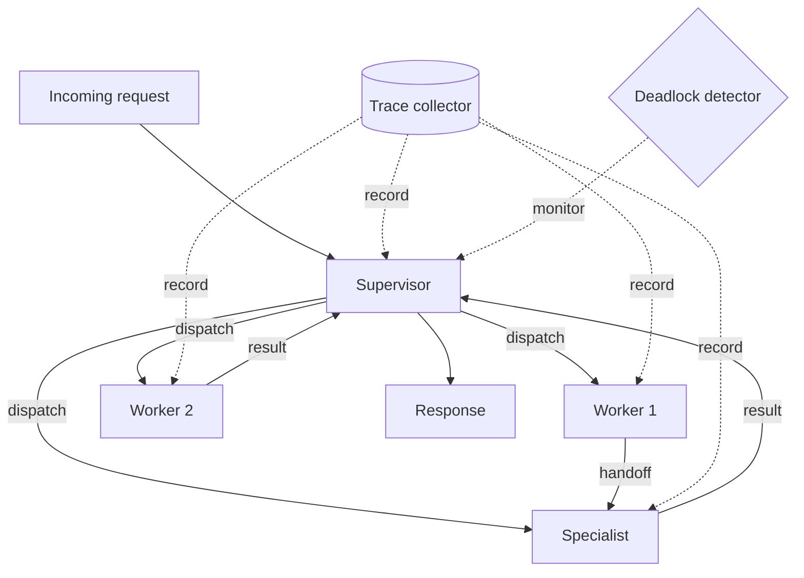

# Chapter 27 — Multi-Agent Systems and Orchestration

> The complexity of a multi-agent system is not in the agents — it is in
> the coordination failures that occur when agents depend on each other.

---

## Learning Objectives

By the end of this chapter you will be able to:

- Design agent hierarchies with supervisors, workers, and specialists that
  maintain clear responsibility boundaries.
- Implement context-preserving handoffs that transfer full conversation
  history without data loss.
- Correlate distributed traces across agent boundaries to debug multi-agent
  interactions.
- Detect and resolve deadlocks when agents form circular wait dependencies.
- Apply the supervisor interrupt pattern to halt runaway agent execution.
- Choose between pipeline and swarm orchestration patterns based on task
  dependencies and latency requirements.

---

## The Production Story

Consider a financial services firm building an AI assistant that handles
customer inquiries. The system uses three agent types: a triage agent that
classifies incoming requests, specialist agents for different domains
(billing, accounts, compliance), and a supervisor that coordinates
escalations.

One Friday afternoon, the on-call engineer notices that request latency has
spiked from 2 seconds to 45 seconds. The dashboards show no errors — every
request eventually completes. CPU and memory are normal. The model provider
reports no issues.

After 90 minutes of investigation, the engineer discovers the cause: two
specialist agents are waiting for each other. The billing agent is waiting
for account verification from the accounts agent. The accounts agent is
waiting for a compliance check from the compliance agent. The compliance
agent is waiting for transaction history from the billing agent. A perfect
cycle.

Each agent is functioning correctly in isolation. Each handoff completes
without error. The system has no deadlock detection, so the wait continues
until the request timeout at 60 seconds. The timeout looks like a slow
response, not a coordination failure.

The post-mortem reveals that this cycle exists in the design: certain
requests genuinely require information from all three agents. The design
assumed agents would respond immediately, not that they would wait for
each other. The fix requires either removing the circular dependency (a
multi-week refactor) or adding deadlock detection that breaks the cycle
and retries.

The question the team asks is the wrong one: "How did the agents get into
a deadlock?" The right question is: "Why did nobody notice for 90 minutes
that every request was timing out?"

---

## Why This Exists

Single-agent systems reached their limit around 2024. A single model can
follow instructions, call tools, and maintain context, but it cannot
simultaneously be an expert in every domain, hold an arbitrarily long
conversation, and respond quickly. The constraints trade off against each
other.

Multi-agent systems split these constraints across specialized components.
A triage agent can respond quickly because it only classifies requests. A
domain specialist can go deep because it only handles one domain. A
supervisor can coordinate because coordination is its only job.

The first multi-agent architectures were ad hoc: developers chained
function calls between models, passed JSON between scripts, and hoped
the result was coherent. When something broke, debugging required
reconstructing the sequence of calls from logs that were never designed
to be correlated.

Orchestration patterns emerged from this chaos. The supervisor pattern
centralizes control — one agent decides who handles what. The pipeline
pattern sequences work — each agent transforms the output of the
previous agent. The swarm pattern parallelizes work — multiple agents
execute simultaneously and their results are aggregated.

Each pattern has different failure modes. Supervisors become bottlenecks.
Pipelines amplify latency. Swarms require idempotent tasks. Multi-agent
orchestration is less about making agents talk to each other and more
about choosing the failure modes you can tolerate.

### The coordination problem

When a single agent fails, it fails visibly: the request errors, the
log shows the exception, the metric spikes. When multiple agents fail
to coordinate, the system often continues running with incorrect behavior.

Consider a handoff where Agent A transfers a conversation to Agent B.
Agent A has the conversation history. Agent B receives some of the
history but not all of it — perhaps a message was lost, or the context
exceeded a limit and was truncated. Agent B continues the conversation
without knowing it missed context. The customer repeats information.
The experience degrades. No error was logged.

Distributed tracing solves part of this problem by correlating actions
across agents. A single trace ID propagates through every agent that
participates in a request. When something goes wrong, you can see the
full sequence: which agents were involved, how long each took, what
messages they exchanged.

Deadlock detection solves another part. When agents wait for each other
in a cycle, detection can identify the cycle and break it — typically
by interrupting one agent and forcing it to retry. The choice of which
agent to interrupt is a policy decision: the one with the least work
invested, the one that can retry cheaply, or simply the most recent one.

---

## Core Concepts

**Agent.** A component that receives messages, performs work, and produces
outputs. In this chapter, agents wrap model calls, but the orchestration
patterns apply regardless of what the agent does internally.

**Supervisor.** An agent that coordinates other agents. It receives
incoming requests, routes them to appropriate workers, monitors progress,
and handles failures. The supervisor does not perform domain work itself;
it orchestrates.

**Worker.** An agent that performs specific tasks. Workers have capabilities
(what they can do) and capacity (how many concurrent tasks they can handle).
The supervisor assigns tasks to workers based on matching capabilities.

**Specialist.** A worker with domain expertise. Specialists handle specific
categories of work — billing, compliance, technical support. They may have
different prompts, tools, or model configurations than general workers.

**Handoff.** The transfer of a conversation from one agent to another.
A complete handoff includes conversation history, trace context, and any
metadata the receiving agent needs. Incomplete handoffs lose context and
degrade user experience.

**Trace correlation.** The practice of propagating a trace ID across agent
boundaries so that all actions related to a request can be linked. Without
trace correlation, debugging multi-agent interactions requires manual log
correlation.

**Deadlock.** A state where two or more agents are waiting for each other
and none can proceed. Deadlocks occur when agents have circular dependencies
and no timeout or detection mechanism exists.

**Pipeline pattern.** Sequential execution where each agent's output becomes
the next agent's input. Useful when work must happen in order — extract,
then transform, then load.

**Swarm pattern.** Parallel execution where multiple agents work
simultaneously on different aspects of the same task. Useful when work is
independent and latency matters more than resource efficiency.

---

## Internal Architecture

A multi-agent orchestration system has three layers: agents, coordination,
and tracing.



*The supervisor dispatches work to workers and specialists. The trace
collector records spans from all agents. The deadlock detector monitors
wait states.*

### Agent lifecycle

Each agent moves through states: idle, working, waiting, terminated. The
state machine is simple but the transitions matter:

1. **Idle to working.** The agent receives a task and begins processing.
2. **Working to idle.** The task completes (success or failure).
3. **Working to waiting.** The agent needs input from another agent.
4. **Waiting to working.** The dependency resolves.
5. **Any to terminated.** The supervisor interrupts the agent.

The waiting state is where deadlocks form. When Agent A waits for Agent B,
and Agent B waits for Agent A, both are stuck in waiting indefinitely.

### Trace propagation

Every message between agents carries trace context: a trace ID that
identifies the overall request, a span ID for the current operation,
and a parent span ID linking to the previous operation. This forms a
tree of spans:

```
Trace: abc123
├── Span: supervisor:dispatch (root)
│   ├── Span: worker-1:extract
│   │   └── Span: handoff to specialist
│   │       └── Span: specialist:analyze
│   └── Span: worker-2:transform
```

When debugging, you query by trace ID and see the full tree. If the
specialist took 30 seconds, you know which request it was and which
agent handed off to it.

### Deadlock detection

The deadlock detector maintains a wait-for graph: vertices are agents,
edges represent "A is waiting for B." When Agent A records that it is
waiting for Agent B, an edge is added. When the wait resolves, the
edge is removed.

Deadlock exists if and only if the graph contains a cycle. Detection
runs periodically or on demand. Finding a cycle is O(V + E) using
depth-first search — not a performance concern for typical agent counts
(tens to hundreds, not millions).

---

## Production Design

**Timeouts at every layer.** Each agent has a task timeout. Each handoff
has a timeout. Each wait has a timeout. Without timeouts, a single slow
agent can stall the entire system indefinitely.

**Idempotent task handling.** When a deadlock is detected and one agent is
interrupted, its task will be retried. The task must be idempotent — retrying
it must not duplicate side effects. If the task sends an email, the retry
must detect that the email was already sent.

**Context size limits.** Conversation history grows with each turn. Handoffs
transfer the full history, but the receiving agent's context window is
finite. Truncate strategically: keep the most recent turns and a summary
of earlier ones, or keep turns marked as important.

**Supervisor redundancy.** A single supervisor is a single point of failure.
Run multiple supervisor instances with leader election, or make the
supervisor stateless so any instance can handle any request.

**Emit these metrics:**

| Metric | Type | Why it matters |
| --- | --- | --- |
| `agent_tasks_completed` | counter | Basic throughput tracking |
| `agent_tasks_failed` | counter | Error rate by agent |
| `agent_task_duration_seconds` | histogram | Latency by agent type |
| `handoff_context_size_bytes` | histogram | Context transfer health |
| `handoff_success_rate` | gauge | Context preservation rate |
| `deadlock_detected_total` | counter | Coordination failures |
| `deadlock_resolution_duration_seconds` | histogram | Recovery time |

**Alert on deadlock detection.** Every deadlock represents a design flaw or
an unexpected interaction. Treat deadlocks like exceptions: acceptable
during development, concerning in staging, unacceptable in production.

**Log trace IDs everywhere.** Every log line should include the trace ID.
When a user reports a problem, you ask for the request ID (which is the
trace ID), and you can reconstruct the entire multi-agent interaction.

---

## Failure Scenarios

### Failure: lost handoff context

**Symptom.** The receiving agent asks the user to repeat information they
already provided. User satisfaction scores drop. No errors in logs.

**Mechanism.** The handoff truncated conversation history due to context
length limits, or serialization failed silently for one message type, or
the receiving agent's prompt template did not include the history.

**Detection.** Measure context size before and after handoff. Alert if
post-handoff context is smaller than pre-handoff. Sample handoffs and
verify history completeness.

**Mitigation.** Re-transfer the context with correct serialization. If
the history is truly lost, ask the supervisor to replay the request
from the beginning.

**Prevention.** Test handoffs with maximum-size contexts. Implement
checksums on transferred history. Verify the receiving agent's context
includes all expected turns before proceeding.

### Failure: deadlock between agents

**Symptom.** Request latency spikes to the timeout threshold. All requests
eventually complete (after timing out). No errors logged — just slow
responses.

**Mechanism.** Two or more agents formed a circular wait. Each is waiting
for the other, and neither can proceed. The timeout eventually fires, but
until then the request is stuck.

**Detection.** The deadlock detector finds cycles in the wait-for graph.
Alert immediately when a cycle is detected, not when the timeout fires.

**Mitigation.** Break the cycle by interrupting one agent. Choose the
agent with the least work invested (most recent to start waiting) or
the one whose task is cheapest to retry.

**Prevention.** Design agent dependencies as a DAG (directed acyclic graph).
If cycles are unavoidable, add explicit timeouts to waits and retry logic
to the waiting agent.

### Failure: trace orphan

**Symptom.** Some requests appear in the trace system with incomplete
span trees. Parent spans reference child span IDs that do not exist.
Debugging is impossible because the picture is incomplete.

**Mechanism.** An agent crashed after creating a span but before recording
it. Or the trace collector was unavailable when the agent tried to record.
Or the parent context was not propagated correctly during handoff.

**Detection.** Validate span trees: every child should reference an existing
parent (except the root). Alert on orphaned spans.

**Mitigation.** This is a tooling problem, not a user-facing problem.
Improve trace collection reliability rather than fixing individual traces.

**Prevention.** Record spans synchronously before proceeding to the next
operation. Use a local buffer that retries on collection failure. Include
span validation in integration tests.

### Failure: supervisor bottleneck

**Symptom.** Worker agents are idle while requests queue at the supervisor.
Supervisor CPU is high. Adding workers does not improve throughput.

**Mechanism.** The supervisor is doing too much work per request — complex
routing logic, synchronous calls to external services, or logging that
blocks. Every request must pass through the supervisor, so it becomes the
constraint.

**Detection.** Measure supervisor latency separately from end-to-end
latency. If supervisor latency grows while worker latency is constant,
the supervisor is the bottleneck.

**Mitigation.** Profile the supervisor and eliminate blocking operations.
Move synchronous calls to async. Simplify routing logic. Consider
splitting the supervisor into multiple specialized supervisors.

**Prevention.** Keep the supervisor minimal. Its job is dispatch, not
processing. Any work that could happen in a worker should happen in a
worker.

---

## Scaling Strategy

**First: supervisor capacity, around 100 requests per second.** The
supervisor touches every request. Its throughput is the system's
throughput. Make the supervisor stateless and run multiple instances
behind a load balancer. Shard by tenant or conversation ID if state
is unavoidable.

**Second: worker pool size, around 500 concurrent tasks.** Add workers
as task volume grows. The supervisor must track available workers; use
a pull model (workers request tasks) rather than push (supervisor assigns
tasks) to avoid overloading slow workers.

**Third: trace collection volume, around 10,000 spans per second.** Trace
collection becomes a write bottleneck. Sample traces probabilistically
(keep 10% at high volume) or use a dedicated trace backend designed for
high ingest rates.

**Fourth: deadlock detection frequency, around 1,000 agents.** Cycle
detection scales with the number of agents. At thousands of agents,
run detection asynchronously rather than synchronously on every wait.
Consider hierarchical detection: detect cycles within clusters first.

---

## Trade-offs

| Decision | Buys you | Costs you | Choose when |
| --- | --- | --- | --- |
| Single supervisor | Simplicity, consistent routing | Single point of failure, bottleneck risk | Small scale, simple routing |
| Multiple supervisors | Throughput, resilience | Coordination complexity | High volume, complex routing |
| Full context handoff | Complete conversation | Large payloads, latency | Context is critical to quality |
| Summary-only handoff | Small payloads, fast | Lost details, potential confusion | Context is supplementary |
| Synchronous deadlock detection | Immediate detection | Latency overhead on every wait | Few agents, reliability critical |
| Periodic deadlock detection | Lower overhead | Detection delay | Many agents, some deadlock tolerance |
| Pipeline orchestration | Deterministic flow, easy debugging | Sequential latency, no parallelism | Ordered transformations |
| Swarm orchestration | Parallelism, lower latency | Result aggregation complexity | Independent tasks |
| Aggressive timeouts (1s) | Fast failure detection | False positives under load | Low-latency requirements |
| Conservative timeouts (60s) | Tolerates slow operations | Slow failure detection | High-latency operations |

---

## Code Walkthrough

From `examples/ch27-multi-agent/`. The orchestration system demonstrates
agent handoffs, trace correlation, and deadlock detection.

### Agent handoff with context preservation

The handoff manager transfers conversation history from one agent to
another while maintaining trace correlation.

```ts
// examples/ch27-multi-agent/src/handoff.ts

export class HandoffManager {
  private agents: Map<string, Agent>;
  private traceCollector: TraceCollector;

  handoff(
    fromAgentId: string,
    toAgentId: string,
    parentContext: TraceContext,
    additionalPayload?: unknown
  ): HandoffResult {
    const fromAgent = this.agents.get(fromAgentId);
    const toAgent = this.agents.get(toAgentId);

    // Create a handoff span linked to parent                    // (1)
    const { context, span } = createChildSpan(
      parentContext,
      'handoff',
      fromAgentId
    );
    span.tags['handoff.from'] = fromAgentId;
    span.tags['handoff.to'] = toAgentId;

    // Get conversation history from source agent
    const history = fromAgent.getConversationHistory();

    // Transfer to target agent                                  // (2)
    toAgent.setConversationHistory(history);

    // Add system turn noting the handoff
    toAgent.addToHistory({
      role: 'system',
      content: `Conversation handed off from ${fromAgentId}`,
      timestamp: Date.now(),
      agentId: toAgentId,
    });

    // Send handoff message with trace context                   // (3)
    const message: AgentMessage = {
      id: generateId(),
      traceId: parentContext.traceId,
      parentSpanId: context.spanId,
      spanId: generateId(),
      fromAgent: fromAgentId,
      toAgent: toAgentId,
      type: 'handoff',
      payload: handoffContext,
      timestamp: Date.now(),
    };

    toAgent.receiveMessage(message);

    return { success: true, contextPreserved: true, /* ... */ };
  }
}
```

1. The handoff span is a child of the parent span, maintaining the trace
   tree. Anyone querying this trace will see the handoff as part of the
   request flow.
2. The full conversation history is copied to the target agent. This is
   the context preservation — the receiving agent knows everything the
   sending agent knew.
3. The handoff message carries trace IDs, allowing the receiving agent
   to continue the trace. All subsequent work by the receiving agent
   will be linked.

### Deadlock detection

The deadlock detector maintains a wait-for graph and detects cycles
using depth-first search.

```ts
// examples/ch27-multi-agent/src/deadlock.ts

export class DeadlockDetector {
  private waitGraph: Map<string, WaitState>;

  recordWait(agentId: string, waitingFor: string, taskId: string): void {
    this.waitGraph.set(agentId, {                                // (1)
      agentId,
      waitingFor,
      since: Date.now(),
      taskId,
    });
  }

  detectDeadlock(): DeadlockResult {
    const visited = new Set<string>();
    const recursionStack = new Set<string>();
    const path: string[] = [];

    const detectCycle = (agentId: string): string[] | null => {
      visited.add(agentId);
      recursionStack.add(agentId);
      path.push(agentId);

      const waitState = this.waitGraph.get(agentId);
      if (waitState) {
        const waitingFor = waitState.waitingFor;

        if (!visited.has(waitingFor)) {
          const cycle = detectCycle(waitingFor);                 // (2)
          if (cycle) return cycle;
        } else if (recursionStack.has(waitingFor)) {
          // Found a cycle                                       // (3)
          const cycleStart = path.indexOf(waitingFor);
          return path.slice(cycleStart);
        }
      }

      path.pop();
      recursionStack.delete(agentId);
      return null;
    };

    for (const agentId of this.waitGraph.keys()) {
      if (!visited.has(agentId)) {
        const cycle = detectCycle(agentId);
        if (cycle) {
          return { detected: true, cycle, waitStates: /* ... */ };
        }
      }
    }

    return { detected: false, cycle: [], waitStates: /* ... */ };
  }
}
```

1. Each wait creates an edge in the wait-for graph: agentId waits for
   waitingFor. The timestamp allows breaking ties when resolving.
2. Standard DFS: visit unvisited neighbors recursively.
3. If we encounter a node already in the current recursion stack, we
   have found a cycle. Extract the cycle by slicing the path from
   where the repeated node first appeared.

### Supervisor orchestration

The supervisor dispatches tasks to workers and implements pipeline and
swarm patterns.

```ts
// examples/ch27-multi-agent/src/supervisor.ts

export class SupervisorAgent extends Agent {
  private workers: Map<string, WorkerAgent | SpecialistAgent>;

  async executePipeline(
    stages: PipelineStage[],
    initialInput: unknown
  ): Promise<{ success: boolean; output: unknown }> {
    const { context, span } = createTrace('pipeline', this.config.id);
    let currentInput = initialInput;

    for (const stage of stages) {
      const worker = this.workers.get(stage.agentId);

      const task: AgentTask = {                                  // (1)
        id: generateId(),
        traceId: context.traceId,
        spanId: generateId(),
        type: 'pipeline-stage',
        payload: currentInput,
        /* ... */
      };

      const result = await worker.processTask(task, context);

      if (result.status !== 'completed') {                       // (2)
        return { success: false, output: result.error };
      }

      currentInput = stage.transform(result.result);             // (3)
    }

    return { success: true, output: currentInput };
  }

  async executeSwarm(
    workerIds: string[],
    taskType: string,
    payload: unknown,
    aggregator: (results: unknown[]) => unknown
  ): Promise<SwarmResult> {
    const { context, span } = createTrace('swarm', this.config.id);

    const taskPromises = workerIds.map(async (workerId) => {     // (4)
      const task: AgentTask = {
        traceId: context.traceId,
        /* ... */
      };
      const result = await worker.processTask(task, context);
      return { agentId: workerId, result: result.result };
    });

    const results = await Promise.all(taskPromises);
    const aggregated = aggregator(                               // (5)
      results.filter(r => r.result !== null).map(r => r.result)
    );

    return { results, aggregated, completedAt: Date.now() };
  }
}
```

1. Each pipeline stage creates a task with the same trace ID. All
   stages appear as siblings under the pipeline span.
2. Pipeline stops on first failure. This is a design choice — you
   might instead continue and mark failed stages.
3. The stage transform converts the result to the next stage's input.
   This is where the pipeline logic lives.
4. Swarm executes all tasks in parallel. Each task has the same trace
   ID but a different span ID.
5. The aggregator combines successful results. Common aggregators:
   merge objects, concatenate arrays, pick best by score.

---

## Hands-On Lab

**Goal:** build a multi-agent system with handoffs, trace correlation, and
deadlock detection. About 5 minutes, Node 22.6+, no dependencies.

```bash
cd examples/ch27-multi-agent
node scripts/lab.mjs
```

The lab runs six steps and asserts 16 claims.

**Step 1 — agent handoff preserves context.**

```bash
# Create two agents with conversation history in agent 1
agent1.addToHistory({ role: 'user', content: 'Hello' })
agent1.addToHistory({ role: 'assistant', content: 'Hi there!' })
agent1.addToHistory({ role: 'user', content: 'I need help with billing' })

# Perform handoff
result = handoffManager.handoff('agent-1', 'agent-2', context)

# Agent 2 now has the full history plus a handoff note
agent2.getConversationHistory().length  // 4 (3 original + 1 handoff)
```

Observed: the receiving agent has all conversation turns from the source
agent, plus a system message noting the handoff. Context is preserved.

**Step 2 — trace IDs correlate across agents.**

```bash
# Dispatch tasks across multiple workers
await supervisor.dispatchTask('extract', payload, 'extract')
await supervisor.executeSwarm(['worker-1', 'worker-2'], 'analyze', payload)

# All spans in the swarm share the same traceId
traceSpans.every(span => span.traceId === expectedTraceId)  // true
```

Observed: tasks executed by different workers share a trace ID. The trace
collector can reconstruct the full request flow across agents.

**Step 3 — deadlock detection.**

```bash
# Create circular wait: A -> B -> C -> A
detector.recordWait('agent-a', 'agent-b', 'task-1')
detector.recordWait('agent-b', 'agent-c', 'task-2')
detector.recordWait('agent-c', 'agent-a', 'task-3')

result = detector.detectDeadlock()
result.detected  // true
result.cycle     // ['agent-a', 'agent-b', 'agent-c'] or rotated
```

Observed: the detector finds the cycle and identifies all participating
agents. This is the information needed to break the deadlock.

**Step 4 — no false positive for linear wait.**

```bash
# Linear chain: A -> B -> C (no cycle)
detector.recordWait('agent-a', 'agent-b', 'task-1')
detector.recordWait('agent-b', 'agent-c', 'task-2')
# agent-c is not waiting for anyone

result = detector.detectDeadlock()
result.detected  // false
```

Observed: a linear wait chain (where the final agent is not waiting) is
correctly identified as not a deadlock.

**Step 5 — supervisor interrupt capability.**

```bash
# Interrupt a worker
supervisor.interrupt('slow-worker', 'task-1', 'Test interrupt')

slowWorker.isInterrupted()  // true
```

Observed: the supervisor can halt a worker mid-task. The worker's state
changes to interrupted and pending tasks are marked as cancelled.

**Step 6 — pipeline pattern execution.**

```bash
# Execute two-stage pipeline
result = await supervisor.executePipeline([
  { agentId: 'worker-1', transform: x => ({ stage1: x }) },
  { agentId: 'worker-2', transform: x => ({ stage2: x }) },
], { initial: 'data' })

result.success           // true
result.stagesCompleted   // 2
result.output.stage2     // present (output flowed through)
```

Observed: the pipeline executes stages in order. Each stage's output
becomes the next stage's input after transformation. All stages share
the same trace context.

---

## Interview Questions

1. What problems does the supervisor pattern solve, and what new problems
   does it introduce?

2. How do you decide between pipeline and swarm orchestration for a
   given task?

3. Explain how trace correlation works across agent boundaries. What
   information must be passed?

4. A deadlock is detected between three agents. Which agent should be
   interrupted, and why?

5. How do you handle context transfer when the conversation history
   exceeds the receiving agent's context window?

6. What metrics would you monitor to detect coordination failures in
   a multi-agent system?

7. Describe a scenario where the swarm pattern would perform worse than
   the pipeline pattern.

8. How would you design a multi-agent system to be resilient to
   individual agent failures?

---

## Staff-Level Answers

**Q1 — supervisor pattern.** The supervisor centralizes routing decisions,
which simplifies worker implementation — workers do not need to know about
each other. It provides a single place for logging, metrics, and access
control.

The new problems: the supervisor is a single point of failure and a
potential bottleneck. Every request passes through it. If the supervisor
is slow or unavailable, the entire system stops.

The staff insight: the supervisor pattern works until it does not. At
low scale, one supervisor is fine. At high scale, you need either
stateless supervisors behind a load balancer, or a different pattern
(like peer-to-peer routing with a service mesh). The architecture
should make the supervisor easily replaceable.

**Q2 — pipeline vs swarm.** Pipeline when: the work has inherent ordering
(parse before transform before render), or each stage's output is
required as the next stage's input, or debugging requires knowing the
exact sequence.

Swarm when: the work is independent (each worker handles a different
aspect of the same input), or latency matters more than efficiency
(parallel is faster than sequential), or workers might fail and you
want partial results.

The staff addition: consider hybrid patterns. A pipeline where one stage
is a swarm. A swarm where each worker runs a pipeline internally. The
patterns compose.

Also consider failure handling. Pipeline fails fast (first failure stops
the chain). Swarm fails slowly (all workers run, failures are aggregated).
Choose based on whether partial results are useful.

**Q4 — which agent to interrupt.** The simple answer: the one with the
least work invested (most recent to start waiting). Interrupting that
agent loses the least progress.

The better answer: it depends on the cost of retrying each agent's work.
If Agent A has done 10 minutes of computation and Agent B has done 10
seconds, interrupt B even if B started waiting first. The goal is to
minimize total wasted work, not to be fair.

The staff answer: this is a policy decision that should be configurable.
Different systems have different retry costs. The deadlock detector
should identify the cycle; a separate policy module should decide which
agent to interrupt. Hard-coding the decision in the detector couples
detection to resolution.

**Q5 — context exceeding window.** First, measure the problem. What
fraction of handoffs exceed the limit? If it is rare, truncate and
monitor. If it is common, the architecture is wrong.

Truncation strategies: keep the most recent N turns (users care about
recent context). Keep turns marked as important (system-determined
relevance). Summarize old turns and keep the summary plus recent turns.

The staff addition: context limits are a design constraint, not a runtime
problem. If handoffs regularly exceed limits, either the conversations
are too long (add earlier handoffs or sub-conversations) or the limits
are too low (use a model with a larger window). The fix is not better
truncation; it is rethinking the flow.

---

## Exercises

1. **Add retry logic.** Modify the pipeline execution to retry failed
   stages up to 3 times with exponential backoff. Track retry counts
   in metrics.

2. **Implement hierarchical supervisors.** Create a system with two
   levels: a primary supervisor that routes to domain supervisors,
   which route to workers. Verify that traces span all three levels.

3. **Build timeout-based deadlock detection.** Instead of detecting
   cycles, detect waits that exceed a threshold. Compare false positive
   rates between cycle detection and timeout detection.

4. **Implement context summarization.** When conversation history
   exceeds 10 turns, summarize turns 1-7 into a single turn and keep
   turns 8-10 verbatim. Test that the receiving agent can still
   answer questions about summarized content.

5. **Design question.** A multi-agent system needs to handle 10,000
   requests per second with a p99 latency under 500ms. Each request
   involves 3 agents on average. Write the one-page capacity estimate:
   how many supervisors, how many workers, what throughput per
   component, where the bottlenecks will appear first.

---

## Further Reading

- **Anthropic's "Building effective agents" guide (2024)** — practical
  patterns for agent orchestration including the delegation and
  parallelization patterns discussed here. Read for production-tested
  approaches.

- **OpenAI's Swarm framework** — an educational reference implementation
  of multi-agent orchestration. Not production-ready but useful for
  understanding the core abstractions.

- **The Model Context Protocol (MCP) specification** — defines how
  agents communicate with tools and each other. Relevant for
  standardizing agent interfaces in multi-agent systems.

- **Silberschatz, Galvin & Gagne, *Operating System Concepts*, Chapter 8:
  Deadlocks** — the classic treatment of deadlock detection and
  prevention. The algorithms transfer directly to agent systems.

- **Kleppmann, *Designing Data-Intensive Applications*, Chapter 9:
  Consistency and Consensus** — distributed systems foundations for
  multi-agent coordination. Read for understanding the impossibility
  results that constrain what agent systems can guarantee.

- **OpenTelemetry distributed tracing specification** — the standard
  for trace context propagation. Follow this when implementing trace
  correlation across agents.
