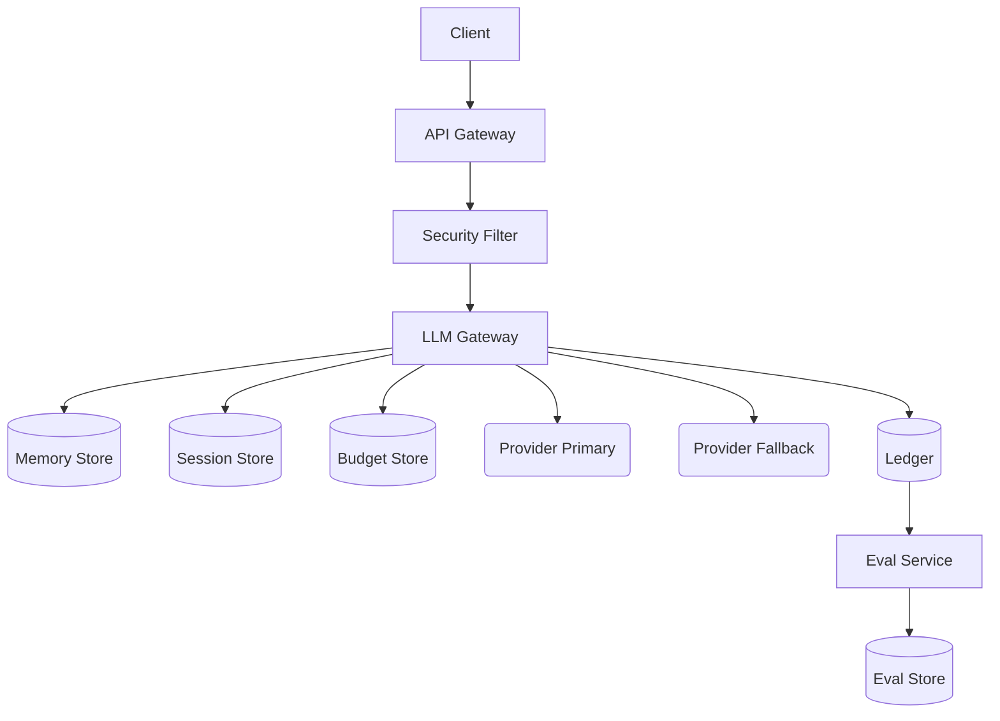

# Chapter 28 — Design: A Conversational Assistant at Scale

> System design for AI is capacity planning for an API that costs money per
> token and takes seconds to respond — the numbers you choose determine
> whether you have a product or an invoice.

---

## Learning Objectives

By the end of this chapter you will be able to:

- Translate user requirements into concrete capacity estimates: messages per
  second, tokens per day, and memory per conversation.
- Design a multi-component architecture that assembles the gateway, memory,
  routing, and cost control patterns from earlier chapters.
- Calculate gateway concurrency requirements using Little's Law and explain
  why naive estimates fail under load.
- Size memory budgets for conversation history and explain when summarization
  or eviction is required.
- Project costs at different user scales and validate that cost projections
  align with token estimates.
- Identify the bottleneck component at each scaling milestone and explain what
  to change when you grow from 1K to 1M users.

---

## The Production Story

Consider a consumer fintech company building a support assistant. The product
team wants users to ask questions about their accounts, dispute transactions,
and get help with product features. The initial scope is narrow: answer
questions using account data, escalate to humans when needed, never move money
autonomously.

The engineering team builds a prototype in two weeks. It works. A small beta
with 500 users shows strong engagement — users prefer the assistant to
searching help articles. The product team asks for a launch timeline. The
engineering team says "three months" and the product team hears "three weeks."

Launch happens six weeks later. The assistant handles the first day's traffic
without incident. By day three, the provider starts rate-limiting. By day
seven, the monthly budget is exhausted, and the assistant returns errors for
the rest of the month. The on-call engineer discovers that the retry logic
was amplifying failed requests 3x, and that conversation history was being
sent in full on every request, hitting context limits on long conversations.

The post-incident review produces a familiar list: no capacity planning, no
memory management, no cost budgets, no failover. The prototype architecture
worked at 500 users and collapsed at 50,000. The team needs a design that
handles 500,000.

This chapter is that design. It starts with requirements, translates them
into capacity estimates, builds an architecture from the patterns in earlier
chapters, and answers the follow-up questions an interviewer or architecture
reviewer would ask.

---

## Why This Exists

Most AI system design discussions jump to architecture diagrams. This is
backwards. An architecture diagram without capacity estimates is a picture,
not a design. The numbers determine the design, not the other way around.

Consider the difference between these two prompts:

- "Design a conversational assistant." (A picture.)
- "Design an assistant for 100K daily users sending 10 messages each, using
  70% mid-tier models, with a 99.5% availability target." (A design.)

The second prompt forces concrete decisions: How many requests per second?
How much memory for conversation history? What happens when the provider is
slow? What does it cost?

System design for AI differs from traditional system design in three ways:

**Latency is seconds, not milliseconds.** A database query takes 5 ms; a model
request takes 3,000 ms. This changes concurrency math: you need 600x more
connections in flight to achieve the same throughput.

**Cost is per-request, not per-capacity.** A database server costs the same
whether you run 100 queries or 100,000. A model provider charges per token.
Cost scales with usage, not infrastructure. An unbounded loop can empty your
budget in hours.

**Context is finite and expensive.** Every conversation turn consumes context
window capacity. A 20-turn conversation with 2,000 tokens per turn uses 40,000
tokens just in history, before the system prompt or the current query. Memory
management is not optional.

This chapter builds a design that addresses all three. The example code
validates the capacity calculations, so the numbers in the chapter are
assertions, not hopes.

---

## Core Concepts

**Capacity estimate.** The translation of user requirements into infrastructure
requirements. Users per day becomes messages per second becomes tokens per
second becomes concurrent connections. Every capacity estimate has a peak-to-
average ratio, typically 3-5x for consumer applications.

**Token budget.** The allowance of tokens per user, per day, or per month.
Distinct from a rate limit. A user can exhaust a token budget at any request
rate, and the rate limit will not help. Cost control (Chapter 23) requires
both.

**Memory budget.** The maximum tokens of conversation history to retain per
conversation. Bounded by context window size minus system prompt minus
expected output. Unbounded history causes context overflow, which causes
truncation or errors.

**Concurrency requirement.** The number of requests in flight at any moment,
calculated by Little's Law: L = λ × W, where L is concurrent requests, λ is
arrival rate (requests/second), and W is service time (seconds). A gateway
handling 50 requests/second with 3-second latency needs 150 concurrent
connections, minimum.

**Bottleneck component.** The component that saturates first as load increases.
In AI systems, this is often the model provider (rate limits), then the memory
store (conversation retrieval), then the gateway (connection handling). The
scaling strategy must address bottlenecks in order.

**Scaling milestone.** A user count at which the architecture must change.
Typical milestones: 10K users (add horizontal scaling), 100K users (add a
second provider), 500K users (add a second region), 1M users (negotiate
dedicated capacity). The cost multiplier increases at each milestone.

**Availability target.** The fraction of requests that succeed. 99% allows 14
minutes of downtime per day; 99.9% allows 86 seconds. Multi-provider failover
(Chapter 19) improves availability by routing around single-provider outages.
The formula: availability = 1 - (1 - single_provider_uptime)^provider_count.

---

## Internal Architecture

The architecture assembles components from earlier chapters. Each component
has a specific role; none is optional at scale.



*Request flow from client through security, gateway, and provider, with
supporting stores for memory, budget, and evaluation. External providers
shown as rounded nodes; internal services as rectangles; datastores as
cylinders.*

**API Gateway.** Entry point for client requests. Handles authentication, TLS
termination, and basic rate limiting. Stateless; scale horizontally.

**Security Filter.** Prompt injection detection (Chapter 22). Inspects user
input before it reaches the LLM. Blocks or flags suspicious patterns. Must
be fast — adds latency to every request.

**LLM Gateway.** The core routing and streaming component (Chapter 18).
Handles model selection, retries, failover, and usage tracking. Manages the
reserve-then-reconcile flow for cost control (Chapter 23).

**Memory Store.** Conversation history for context assembly (Chapter 20).
Redis for fast access; conversation history is read on every request.
The memory budget determines how much history to retain per conversation.

**Session Store.** Active conversation state: current turn, pending responses,
rate limit counters. Lower latency requirements than memory store; typically
the same Redis cluster with different key patterns.

**Budget Store.** Per-tenant token budgets (Chapter 23). Checked on every
request. Reserve-then-reconcile prevents overshoot. Fail-open with circuit
breaker to avoid platform-wide outage on store failure.

**Ledger.** Immutable record of every request's cost. Written asynchronously
after request completion. Used for billing, attribution, and audit. Higher
write throughput requirements than the budget store.

**Provider Primary.** The main model provider. Most requests route here.
Subject to rate limits and occasional outages.

**Provider Fallback.** The secondary provider for failover (Chapter 19).
Lower capacity than primary; accepts traffic when primary is unavailable or
slow. May use a different model tier to control costs.

**Eval Service.** Offline quality evaluation (Chapter 21). Samples requests
from the ledger, runs quality checks, stores results. Not in the hot path;
runs on a schedule.

### Request flow

1. Client sends message to API Gateway.
2. API Gateway authenticates, rate limits, forwards to Security Filter.
3. Security Filter inspects input, passes clean requests to LLM Gateway.
4. LLM Gateway retrieves conversation history from Memory Store.
5. LLM Gateway checks Budget Store; reserves pessimistic token estimate.
6. LLM Gateway routes to Provider Primary (or Fallback if Primary is down).
7. Provider streams response; gateway streams to client.
8. On completion: reconcile budget, write ledger, update memory.

The entire flow takes 2-15 seconds depending on model tier and output length.
Most of that time is provider inference; internal components add tens of
milliseconds.

---

## Production Design

### Capacity planning: from users to infrastructure

The design starts with requirements:

| Requirement | Value | Source |
| --- | --- | --- |
| Daily active users | 100,000 | Product target |
| Messages per user per day | 10 | Usage analytics |
| Average conversation turns | 5 | Usage analytics |
| Peak-to-average ratio | 4x | Industry typical |
| Model tier distribution | 70% mid, 25% small, 5% frontier | Cost constraint |
| Availability target | 99.5% | SLA requirement |

From these, calculate capacity:

**Messages per day:** 100,000 users × 10 messages = 1,000,000 messages/day

**Messages per second (average):** 1,000,000 / 86,400 = 11.6 msg/sec

**Messages per second (peak):** 11.6 × 4 = 46.3 msg/sec

**Tokens per message:** Weighted average across tiers. Mid-tier: 2,000 input +
800 output = 2,800 tokens. Weighted: ~2,400 tokens/message.

**Tokens per day:** 1,000,000 × 2,400 = 2.4 billion tokens/day

**Concurrent connections (Little's Law):** 46.3 msg/sec × 3 sec latency = 139
concurrent connections minimum. With 50% headroom: 209 connections.

**Memory per conversation:** 5 turns × 2,400 tokens × 4 bytes/token = 48 KB

**Concurrent conversations:** 1,000,000 messages / 5 turns / 10 = 20,000
conversations active at once.

**Total conversation memory:** 20,000 × 48 KB = 960 MB in hot storage.

### Sizing components

From capacity estimates:

| Component | Replicas | Per-replica capacity | Total capacity |
| --- | --- | --- | --- |
| API Gateway | 2 | 5,000 req/sec | 10,000 req/sec |
| Security Filter | 2 | 2,000 req/sec | 4,000 req/sec |
| LLM Gateway | 3 | 100 req/sec | 300 req/sec |
| Memory Store | 3 | 50,000 req/sec | 150,000 req/sec |
| Budget Store | 3 | 10,000 req/sec | 30,000 req/sec |

The LLM Gateway is the constraint — each instance handles 100 concurrent
connections to providers, and we need 209 concurrent connections at peak.
Three replicas provide headroom for failures.

### Cost projection

**Token cost:** At mid-tier pricing (~$1.50 per million tokens), 2.4 billion
tokens/day costs ~$3,600/day or ~$108,000/month.

**Infrastructure cost:** Compute, memory, and storage total ~$5,000/month at
this scale — an order of magnitude less than token costs.

**Cost per user:** $113,000 / 100,000 users = $1.13/user/month.

**Cost per message:** $113,000 / 30M messages = $0.0038/message.

Token costs dominate. Infrastructure optimization yields single-digit
percentage savings; model tier optimization yields 10x.

---

## Failure Scenarios

### Failure: conversation context overflow

**Symptom.** Long-running conversations start failing with context errors.
Users report that the assistant "forgets" earlier parts of the conversation
or responds with truncation errors.

**Mechanism.** No memory budget enforced. The gateway sends full conversation
history on each request. After 40 turns at 2,400 tokens each, history alone
is 96,000 tokens — exceeding the context window before adding system prompt
or current query.

**Detection.** Alert on context utilization percentage. Track input token
counts; alert when approaching 80% of context window.

**Mitigation.** Immediate: truncate oldest turns until history fits. Better:
summarize old history into a compact representation.

**Prevention.** Define a memory budget at design time. Implement summarization
triggers at 80% of budget. Store full history in cold storage; load only
recent turns plus summary into context.

### Failure: budget exhaustion without warning

**Symptom.** All users start receiving budget-exhausted errors. The monthly
budget was consumed in the first week. Nobody was alerted.

**Mechanism.** Soft cap without alerting. The budget store tracked spending
but alerts were not configured for the new tenant. A traffic spike (launch,
viral moment) consumed the budget faster than expected.

**Detection.** Alert on budget headroom at 50%, 20%, and 10% remaining.
Alert on burn rate exceeding 2x historical average.

**Mitigation.** Increase budget allocation. If the traffic is legitimate,
accommodate it; if it's a bug (retry loop), fix the bug.

**Prevention.** Require alert configuration when registering a tenant budget.
No tenant should have a budget without alerts. Default to hard caps for
external tenants, soft caps with aggressive alerts for internal tenants.

### Failure: provider brownout causes gateway overload

**Symptom.** Request latency increases 5x. Error rate spikes even though the
provider is not returning errors — just slowness. Gateway CPU and connection
pool exhaust.

**Mechanism.** No latency-aware circuit breaker. The provider's p99 latency
increased from 5 seconds to 25 seconds. Each request holds a connection 5x
longer. Connection pool exhausts; new requests queue and timeout.

**Detection.** Alert on p99 latency. Alert on connection pool utilization.
The circuit breaker should track slow calls, not just errors.

**Mitigation.** Trip the breaker manually. Reduce inbound rate until provider
recovers.

**Prevention.** Configure the circuit breaker with a slow-call threshold
(Chapter 18). If p99 exceeds 3x baseline, start rejecting requests. Fail
fast rather than holding connections.

### Failure: memory store outage loses conversation context

**Symptom.** All conversations restart from scratch. Users report that the
assistant "forgot everything." No data loss visible in logs.

**Mechanism.** Memory store (Redis) restarted without persistence. In-memory
data was lost. The gateway fell back to empty history rather than erroring.

**Detection.** Alert on memory store restart. Monitor conversation continuity
— unexpected new-conversation starts indicate context loss.

**Mitigation.** Inform affected users. Accept that history is lost; rebuild
from user's next message.

**Prevention.** Enable persistence (RDB or AOF). Replicate across
availability zones. For critical conversations, also write history to a
durable store (Postgres) and hydrate from there on cache miss.

---

## Scaling Strategy

**1K users.** Baseline deployment. Two gateway replicas, single provider,
single region. Memory fits in one Redis node. Cost: $1,200/month.

**10K users.** Scale gateway to 4 replicas. Memory store grows to 3-node
cluster. Add budget alerts. First operational load. Cost: $4,000/month.

**50K users.** Memory reads become the bottleneck. Add read replicas to
memory store. Provider rate limits start to bind; consider second provider.
Cost: $15,000/month.

**100K users.** Add second provider for failover. Traffic is high enough
that single-provider outages affect enough users to matter. Start
evaluating quality to catch model degradation. Cost: $40,000/month.

**250K users.** Deploy to second region for latency. Users in other
continents get 200ms RTT to a single-region deployment; a second region
cuts that to 50ms. Cost: $100,000/month.

**500K users.** Scale gateway to 16 replicas per region. Shard memory store.
Consider dedicated provider capacity agreements rather than shared rate
limits. Cost: $250,000/month.

**1M users.** Third region. Dedicated provider agreements. Full-time
operations team. At this scale, custom negotiated pricing matters —
standard pricing is a baseline, not a ceiling. Cost: depends on
negotiation.

The cost multiplier from 1K to 1M is approximately 200x, while the user
multiplier is 1000x. This is the scaling efficiency: infrastructure costs
sub-linearly with users, but token costs linearly. At large scale, token
cost dominates, and the cost-per-user stabilizes.

---

## Trade-offs

| Decision | Buys you | Costs you | Choose when |
| --- | --- | --- | --- |
| Single provider | Simpler operations, one integration | Downtime during outages | Low availability target (<99%) |
| Multi-provider | Higher availability, rate limit headroom | Integration complexity, prompt tuning per model | Availability target >99% |
| Full history in context | Best coherence, no summarization artifacts | Context overflow on long conversations | Short conversations only |
| Summarized history | Long conversations, bounded cost | Summarization latency, potential detail loss | Conversations >10 turns expected |
| Hard budget cap | No surprise bills | Production features can stop | External/untrusted tenants |
| Soft cap with alerts | No budget-driven outages | Requires someone to respond to alerts | Internal tenants, production features |
| Single-region | Lower cost, simpler deployment | Higher latency for distant users | Regional user base |
| Multi-region | Lower latency globally, regional failover | Operational complexity, data replication | Global user base, high availability |
| Mid-tier default | Lower cost per message | Lower quality for complex queries | High volume, simple queries |
| Frontier for complex | Higher quality | 10x cost per message | Complex reasoning required |

---

## Code Walkthrough

From `examples/ch28-conversational-assistant/`. These functions validate the
design calculations.

### Capacity calculation

```ts
// examples/ch28-conversational-assistant/src/capacity.ts

export function calculateCapacity(
  requirements: CapacityRequirements
): CapacityEstimates {
  const {
    dailyActiveUsers,
    messagesPerUserPerDay,
    averageConversationTurns,
    peakToAverageRatio,
    modelTierDistribution,
  } = requirements;

  // Messages per day = users * messages per user                 (1)
  const messagesPerDay = dailyActiveUsers * messagesPerUserPerDay;

  // Average messages per second = total / seconds in day
  const messagesPerSecondAverage = messagesPerDay / SECONDS_PER_DAY;

  // Peak = average * ratio (typically 3-5x for consumer apps)    (2)
  const messagesPerSecondPeak =
    messagesPerSecondAverage * peakToAverageRatio;

  // Tokens per message, weighted by tier distribution            (3)
  let avgTokensPerMessage = 0;
  for (const tier of Object.keys(modelTierDistribution) as ModelTier[]) {
    const profile = TIER_TOKEN_PROFILE[tier];
    const weight = modelTierDistribution[tier];
    avgTokensPerMessage +=
      (profile.avgInputTokens + profile.avgOutputTokens) * weight;
  }

  const tokensPerDay = messagesPerDay * avgTokensPerMessage;

  // ... remaining calculations
}
```

1. The fundamental equation. Every other number derives from this.
2. Peak-to-average ratio is an input, not calculated. Get it from your
   analytics or use 4x as a starting point for consumer apps.
3. Tokens per message depends on model tier. Frontier models produce longer,
   higher-quality outputs; small models produce shorter outputs.

### Gateway concurrency

```ts
// examples/ch28-conversational-assistant/src/capacity.ts

export function calculateGatewayRequirements(
  estimates: CapacityEstimates,
  avgRequestDurationMs: number
): {
  minConcurrentConnections: number;
  recommendedConcurrentConnections: number;
  headroomFactor: number;
} {
  // Little's Law: L = lambda * W                                 (1)
  const arrivalRate = estimates.messagesPerSecondPeak;
  const serviceTime = avgRequestDurationMs / 1000;

  const minConcurrentConnections = Math.ceil(arrivalRate * serviceTime);

  // Add 50% headroom for bursts                                  (2)
  const headroomFactor = 1.5;
  const recommendedConcurrentConnections = Math.ceil(
    minConcurrentConnections * headroomFactor
  );

  return {
    minConcurrentConnections,
    recommendedConcurrentConnections,
    headroomFactor,
  };
}
```

1. Little's Law is the foundation of queueing theory. It holds under any
   arrival distribution, any service time distribution. The only input is
   average rate and average service time.
2. Headroom accounts for bursts. Peak-to-average ratio handles daily
   variation; headroom handles second-to-second spikes.

### Memory budget

```ts
// examples/ch28-conversational-assistant/src/capacity.ts

export function calculateMemoryBudget(
  maxContextTokens: number,
  reservedForSystemPrompt: number,
  reservedForOutput: number
): MemoryBudget {
  // Available for conversation history                           (1)
  const availableTokens =
    maxContextTokens - reservedForSystemPrompt - reservedForOutput;

  // Typical turn size (input + output)
  const avgTokensPerTurn = 2500;

  // How many turns fit in the budget
  const maxTurns = Math.floor(availableTokens / avgTokensPerTurn);

  // Summarize when we hit 80% of capacity                        (2)
  const summaryThreshold = Math.floor(maxTurns * 0.8);

  return {
    maxTurns,
    maxTokensPerTurn: avgTokensPerTurn,
    summaryThreshold,
    bytesPerToken: BYTES_PER_TOKEN,
    totalBudgetBytes: availableTokens * BYTES_PER_TOKEN,
  };
}
```

1. The context window is shared between system prompt, history, current
   query, and expected output. Reserve space for each before allocating
   to history.
2. Trigger summarization before hitting the limit, not at the limit. This
   leaves room for the summarization prompt itself.

---

## Hands-On Lab

**Goal:** validate capacity planning calculations. About 2 minutes,
Node 22.6+, no dependencies.

```bash
cd examples/ch28-conversational-assistant
node scripts/lab.mjs
```

The lab runs eleven steps with 24 assertions. All calculations are
deterministic; no external services required.

**Step 1 — capacity estimation consistency.**

The lab calculates capacity from requirements and validates internal
consistency: tokens per user times users equals total tokens.

```
Step 1 - capacity estimation consistency
  [PASS] capacity estimates are internally consistent
  [PASS] messages per day matches users * messages/user
  [PASS] peak throughput matches average * ratio
```

**Step 3 — gateway throughput.**

Validates that gateway concurrent connections follow Little's Law:
concurrent = arrival_rate × service_time.

```
Step 3 - gateway throughput
  [PASS] gateway concurrent connections calculated
  [PASS] concurrent connections follows Little's Law
```

**Step 7 — failover availability.**

Simulates a 60-second primary provider outage. Validates that the fallback
provider handles traffic and availability stays above 90%.

```
Step 7 - failover availability
  [PASS] some requests rerouted during failover
  [PASS] availability > 90% during failover
  [PASS] multi-provider availability > single provider
```

**Expected output:** `24/24 checks passed`

---

## Interview Questions

1. Walk me through capacity planning for a conversational assistant. What
   numbers do you need, and how do they flow into infrastructure decisions?

2. You have 100K daily users sending 10 messages each. How many concurrent
   connections does your gateway need if average model latency is 3 seconds?
   Show your work.

3. How do you handle conversation history that exceeds the context window?
   What are the trade-offs between truncation and summarization?

4. Your primary provider has 99% uptime. Your fallback has 99% uptime. What
   is your combined availability, and what assumptions does that calculation
   make?

5. At what user count do you add a second region? What drives that decision?

6. Token costs dominate infrastructure costs at scale. How does this change
   your optimization priorities?

7. The product team wants unlimited conversation history. The context window
   is 128K tokens. How do you handle this?

8. Your gateway is overloaded. How do you identify the bottleneck component?

---

## Staff-Level Answers

**Q2 — concurrent connections calculation.** The interview answer applies
Little's Law directly: 100K users × 10 messages / 86,400 seconds = 11.6
messages/second average. With a 4x peak-to-average ratio: 46.3
messages/second peak. At 3-second latency: 46.3 × 3 = 139 concurrent
connections.

The staff addition: this is a floor, not a ceiling. Add headroom for bursts
(50% is typical), bringing it to 209. Then consider failure modes: if one
gateway instance fails, the others must absorb its load. With 3 instances
handling 209 connections, each handles 70. If one fails, each handles 105.
Size for the failure case, not the steady state.

The deeper insight: 3-second latency is 600x longer than a typical database
query. Traditional gateway sizing rules assume millisecond latencies; AI
workloads break those rules. A gateway sized for "100 requests/second" that
expects 10ms latency can only handle 1 request/second at 3000ms latency
with the same connection pool.

**Q4 — multi-provider availability.** The formula is: availability = 1 -
(1 - p1) × (1 - p2), assuming independent failures. With two 99% providers:
1 - 0.01 × 0.01 = 0.9999, or 99.99%.

Then the qualifications, because an unqualified answer is incomplete.
First: this assumes independent failures, which is optimistic. A shared
dependency (DNS, certificate authority, common peering point) can cause
correlated failures. Second: the formula assumes instant failover, but
failover detection takes time. If detection takes 500ms and you have 46
requests/second, you lose 23 requests during failover.

The staff move is to bound the failover cost. With 500ms detection and 46
req/sec, each failover event costs 23 requests. At 99% single-provider
uptime, you expect ~14 minutes of outage per day, which is ~850 failover
events per month at 1 event per second. But outages cluster: a typical
outage is 5-10 minutes, not 1 second. You might see 1-2 outages per month,
each lasting 5-10 minutes, each with one failover event at the start.
The failover cost is a rounding error.

**Q6 — token cost dominance.** At 100K users, token costs are ~$100K/month;
infrastructure is ~$5K/month. Optimizing infrastructure by 50% saves $2.5K.
Optimizing token usage by 10% saves $10K. The economics push toward token
optimization.

Token optimization strategies, in order of impact:
1. Route simple queries to small-tier models. Classification: "$0.15/million
   tokens." Summarization: "$1.50/million." Complex reasoning: "$15/million."
   The tier decision has the highest impact.
2. Reduce input tokens. Trim conversation history. Compress system prompts.
   Cache repeated context.
3. Limit output tokens. Set `max_tokens` on every request. A 4,000-token
   limit prevents runaway outputs.
4. Cache repeated queries. Semantic caching is fragile, but exact-match
   caching for common questions works.

The staff insight: infrastructure optimization is a one-time activity; token
optimization compounds with usage. A 10% token reduction at 100K users saves
$10K/month. The same reduction at 1M users saves $100K/month. The impact
increases with scale.

**Q7 — unlimited history.** The product ask is impossible as stated: 128K
tokens is a hard limit, and a 100-turn conversation at 2,400 tokens/turn is
240K tokens. The engineering response is to deliver the user's actual need
(long coherent conversations) rather than the stated requirement (unlimited
history).

Options in order of complexity:
1. **Sliding window.** Keep the last N turns. Simple, loses old context.
2. **Summarization.** Periodically summarize old turns into a compact
   representation. Preserves essence, loses detail.
3. **Retrieval.** Store full history externally; retrieve relevant turns
   when needed. Complex, but preserves everything.

The staff move is to ask what "unlimited" means in user terms. Does the
user need to reference something from turn 50 in turn 100? If so,
retrieval. Does the user just want coherence over long sessions? Then
summarization. Does the user rarely go past 20 turns? Then a sliding
window is fine.

Design for the actual use case, not the stated requirement. "Unlimited"
is a requirement born from not knowing what limit would hurt; the
engineering response is to find that limit.

---

## Exercises

1. **Capacity math.** A support assistant has 500K daily users, 8 messages
   per user per day, 60% mid-tier and 40% small-tier models, with a
   peak-to-average ratio of 5x. Calculate: messages per day, peak
   messages per second, concurrent connections at 4-second latency, and
   daily token cost at $1.50/million for mid and $0.15/million for small.

2. **Memory budget.** A 200K-token context window must accommodate a 3,000-
   token system prompt, 4,000-token expected output, and conversation
   history. Each turn averages 3,000 tokens. How many turns fit? At what
   turn count should summarization trigger?

3. **Availability.** Provider A has 99.5% uptime; Provider B has 98% uptime.
   Calculate combined availability. Then recalculate assuming they share a
   DNS provider with 99.9% uptime.

4. **Cost projection.** At 100K users, token cost is $100K/month and
   infrastructure is $5K/month. Project costs at 1M users, assuming token
   cost scales linearly and infrastructure scales at 0.7x (sublinear).
   What fraction of total cost is infrastructure at each scale?

5. **Bottleneck analysis.** Your gateway handles 100 req/sec per instance,
   memory store handles 50,000 req/sec total, budget store handles 10,000
   req/sec total. Traffic is 80 req/sec. Which component saturates first
   if traffic doubles? At what traffic level does each component saturate?

---

## Further Reading

- **Chapter 18, "The LLM Gateway"** — the core gateway patterns this design
  depends on. Read it before attempting to implement this design.

- **Chapter 19, "Multi-Provider Routing and Failover"** — the failover
  strategy that achieves the availability targets. Contains the latency-
  aware circuit breaker configuration.

- **Chapter 20, "Conversational Memory"** — memory budget implementation,
  summarization strategies, and retrieval-augmented history.

- **Chapter 23, "Cost Control and Capacity Planning"** — reserve-then-
  reconcile budgets, cost attribution, and burn rate forecasting.

- **Kleinrock, "Queueing Systems, Volume 1"** — the mathematical foundation
  for capacity planning. Chapter 1 on Little's Law is the essential minimum;
  the rest is useful if you need to model specific queue behaviors.

- **Hamilton, "On Designing and Deploying Internet-Scale Services"** —
  operations principles for large-scale systems. Written before AI, but
  the fundamentals (redundancy, failover, monitoring) apply unchanged.
