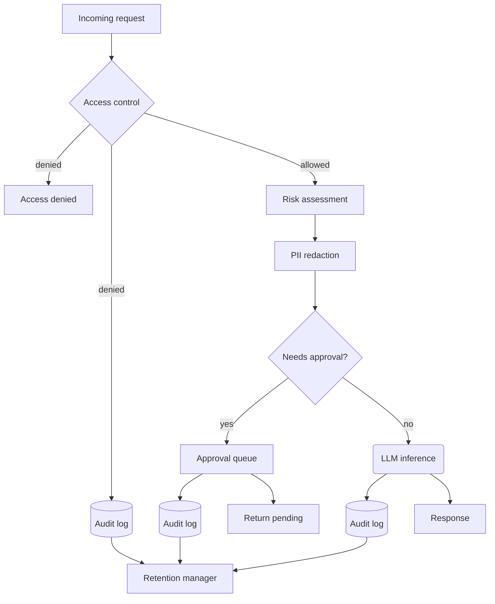

# Chapter 29 — Design: An AI Assistant in a Regulated Domain

> In regulated industries, the AI system you cannot audit is the AI system you
> cannot deploy, and the audit trail you cannot recover from is the audit trail
> that will end your deployment.

---

## Learning Objectives

By the end of this chapter you will be able to:

- Explain why regulated AI systems require different design patterns than
  consumer-facing assistants and identify the specific compliance constraints
  that drive those patterns.
- Implement an audit trail that records every AI decision with enough detail
  for forensics while protecting sensitive data from unauthorized access.
- Design a human-in-the-loop approval workflow that gates high-stakes actions
  without creating bottlenecks for routine operations.
- Build PII redaction that protects privacy in logs while preserving the
  ability to recover original content for legitimate compliance review.
- Enforce data retention policies that satisfy regulatory requirements while
  automatically expiring data that no longer needs to be kept.
- Integrate role-based access control with AI decision pipelines to prevent
  unauthorized actions before they reach the model.

---

## The Production Story

Consider a healthcare startup building a clinical decision support system. The
system assists clinicians by answering questions about patient records,
suggesting treatment options based on clinical guidelines, and generating
referral letters. It integrates with the electronic health record system and
has read access to patient data.

The initial design follows patterns from consumer AI assistants: requests go
in, responses come out, errors are logged, and the team focuses on response
quality. The system works well in testing. Clinicians find it helpful.

Three months before the planned launch, the compliance team arrives for a
pre-deployment review. They ask questions the engineering team has not
considered:

"If a patient requests their records under HIPAA, can you show every AI
interaction that touched their data?"

The team realizes their logs are scattered across services, some contain
plaintext patient data, and there is no way to query by patient ID.

"If a clinician disputes an AI recommendation that led to an adverse outcome,
can you reconstruct exactly what the system saw and said?"

The team realizes their logs store only error cases. Successful interactions
are ephemeral, lost when the request completes.

"If an employee with elevated access misuses the system, can you demonstrate
that the access was logged and auditable?"

The team realizes their access control exists at the API gateway but not in
the AI layer. Anyone with API access can ask any question about any patient.

"Can you prove that diagnosis suggestions require human review before action?"

The team realizes there is no human-in-the-loop for any AI output. Every
response goes directly to the clinician's screen. There is no approval step,
no review queue, no distinction between low-risk queries and high-stakes
recommendations.

The compliance review identifies 47 findings. Fourteen are blockers. The
launch is delayed by six months.

The engineering team learns that regulated AI is not regular AI plus
compliance checks. It is a different architecture from the start, one where
every decision is auditable, every action is gated by role, high-risk outputs
require human approval, and the audit trail is itself a first-class system
component.

---

## Why This Exists

Consumer AI systems optimize for user experience. A chatbot should respond
quickly, minimize friction, and keep the user engaged. Compliance is a
constraint, not a feature.

Regulated AI systems operate under a different set of priorities. In
healthcare, finance, and legal contexts, the consequences of AI errors are not
frustrated users but patient harm, financial loss, or legal liability. The
regulatory frameworks that govern these domains — HIPAA, GDPR, SOC2, FINRA,
FDA — require specific capabilities that consumer systems do not need:

**Audit trails.** Every action must be recorded with enough detail to
reconstruct what happened, when, and why. This is not logging for debugging;
it is logging for legal discovery, regulatory audit, and incident forensics.
The audit trail must be complete (no gaps), immutable (no modifications after
the fact), and queryable (find all actions affecting a specific patient).

**Human-in-the-loop.** High-stakes decisions cannot be fully automated. A
prescription suggestion, a diagnosis, or a financial transfer must require
human review before taking effect. The system must distinguish between actions
that can proceed automatically and actions that must wait for approval.

**Data residency and privacy.** Sensitive data has legal restrictions on where
it can be stored, who can access it, and how long it can be retained. A system
that logs patient SSNs to a third-party monitoring service is a HIPAA
violation. A system that stores EU customer data in US-based caches is a GDPR
violation.

**Explainability.** When a decision is challenged, the system must be able to
explain why it made that decision. This is not just about model
interpretability; it is about reconstructing the full context — what data was
available, what the prompt contained, what the model output was, and how that
output was transformed into the final response.

**Access control.** Not everyone should be able to ask the AI anything. A
patient should be able to query their own records but not prescribe medication.
A clinician should be able to make recommendations but not access another
clinician's patient without authorization. Role-based access control must be
enforced at the AI layer, not just the API layer.

These requirements are not features you add after the core system is built.
They are architectural decisions that shape the entire design. An AI system
designed for consumer use cannot be retrofitted for regulated use without
substantial rearchitecture.

---

## Core Concepts

**Audit trail.** An append-only log of every decision, action, and access. Each
entry records who acted, what they did, when they did it, what data was
involved, and what the outcome was. The trail must survive system failures and
be queryable for compliance investigations.

**Human-in-the-loop (HITL).** A workflow pattern where high-stakes AI outputs
are held pending until a human reviewer approves or rejects them. The system
distinguishes between actions that can proceed automatically (low-risk queries)
and actions that require approval (prescriptions, diagnoses, financial
transfers above a threshold).

**PII redaction.** The process of removing personally identifiable information
from data before it is logged, cached, or sent to external services. Redaction
must be reversible for legitimate compliance access — you cannot audit what
you cannot read — so redacted data is linked to recovery tokens that
authorized personnel can use to retrieve the original.

**Data retention policy.** Rules that specify how long different types of data
must be kept. HIPAA requires seven years for medical records. GDPR requires
deletion on request. SOC2 requires immutable audit logs. These requirements
often conflict, and the system must handle each data type according to its
specific policy.

**Role-based access control (RBAC).** A security model where permissions are
assigned to roles, and users are assigned to roles. A "patient" role can query
their own data. A "clinician" role can make recommendations. An "admin" role
can access audit logs. RBAC in AI systems extends beyond API access to
constrain what questions the AI will answer for which users.

**Compliance check.** An automated verification that the system's current state
satisfies regulatory requirements. Compliance checks run periodically and
before deployment, flagging violations like missing audit entries, unapproved
high-risk actions, or retention policy violations.

---

## Internal Architecture

A regulated AI system wraps every decision in a compliance layer that enforces
access control, creates audit trails, and gates high-risk actions for approval.



*Every path through the system creates an audit entry. Access denials,
approval requests, and successful executions all feed the same audit log.*

### Access control layer

Before any AI processing, the system checks whether the user's role permits
the requested action at the requested risk level. A patient asking "what
medications am I on?" is a low-risk query that proceeds. A patient asking
"prescribe me medication X" is denied outright — the patient role cannot
initiate prescriptions regardless of content.

Access control operates on role, action type, and risk level:

```
Rule: (patient, query, low) -> allowed
Rule: (patient, query, high) -> denied (risk exceeds role limit)
Rule: (patient, prescription, any) -> denied (action not permitted)
Rule: (clinician, prescription, high) -> allowed with approval
```

The access check happens before the LLM sees the request. This is defense in
depth — even if the model can be manipulated to generate a prescription, the
access layer will not allow a patient to submit it.

### Risk assessment

Not all requests are equally sensitive. A query about general medication
information is low-risk. A query that mentions specific controlled substances
or emergency situations is high-risk. The system assesses risk based on:

- **Action type.** Prescriptions and diagnoses are inherently higher risk than
  informational queries.
- **Content patterns.** Mentions of controlled substances, emergency keywords,
  or life-threatening conditions elevate risk.
- **Context.** The same question may have different risk levels depending on
  who is asking and why.

Risk assessment informs both access control (some roles have risk limits) and
approval workflows (high-risk actions require human review).

### PII redaction

Before any data is logged, PII is detected and replaced with placeholders. An
email address becomes `[EMAIL:j***@***.com]`. A Social Security Number becomes
`[SSN:***-**-6789]`. A medical record number becomes `[MRN:****5678]`.

The redaction preserves structure (you can see that an email was present) while
removing identifying content (you cannot see what the email was). This allows
debugging and monitoring without creating a PII liability in the logs.

For legitimate compliance access — a HIPAA audit, a legal discovery request —
the original content can be recovered using a recovery token stored separately
from the logs. The recovery token is encrypted and access-controlled; only
users with the compliance role can use it.

### Approval workflow

When a decision requires human review, it enters the approval queue:

1. The AI generates its output.
2. The output is redacted and stored as pending.
3. An approval request is created with expiration (24 hours typical).
4. A reviewer with appropriate role (clinician, admin) reviews the request.
5. On approval, the pending action is released. On rejection, it is blocked.
6. Both outcomes are logged with reviewer ID and notes.

The approval workflow has its own failure modes: what happens if reviewers are
overwhelmed? If requests expire before review? If a reviewer approves
something they should not have? Each case must be audited.

### Audit trail structure

Every audit entry contains:

- **Identity fields:** entry ID, timestamp, session ID, user ID, user role.
- **Action fields:** action type, risk level, decision (executed, pending,
  denied, blocked).
- **Content hashes:** input hash, output hash (for correlation without storing
  plaintext).
- **Redacted content:** the redacted versions of input and output (for human
  review).
- **Approval fields:** approval ID, approval status (if applicable).
- **Retention fields:** expiration timestamp based on retention policy.

Entries are append-only. Once written, they cannot be modified. Deletion
happens only through retention policy enforcement, and deletions are
themselves logged.

---

## Production Design

**Design for audit from the start.** The audit trail is not a feature you add
later. It is a data model you build first. Every AI interaction should create
an audit entry before returning a response. If the audit write fails, the
request should fail.

**Separate audit storage from application storage.** Audit logs have different
access patterns, retention requirements, and availability needs than
application data. Store them in a dedicated system optimized for append-only
writes and range queries by time, user, and session.

**Encrypt recovery tokens at rest.** The recovery tokens that allow PII
reconstruction are themselves sensitive. Encrypt them with a key that requires
compliance role access. Log every recovery operation.

**Set approval timeouts based on risk.** High-risk actions (prescription of
controlled substances) should have short timeouts (2 hours) to prevent
lingering unreviewed requests. Lower-risk actions can have longer timeouts (24
hours). Expired requests should auto-reject, not auto-approve.

**Emit these metrics:**

| Metric | Type | Why it matters |
| --- | --- | --- |
| `audit_entries_total` | counter | Volume tracking, capacity planning |
| `audit_entries_by_action` | counter (labeled) | Distribution of action types |
| `approval_pending_count` | gauge | Reviewer workload, bottleneck detection |
| `approval_latency_seconds` | histogram | Time to human decision |
| `approval_expired_count` | counter | Timeouts, inadequate review capacity |
| `access_denied_count` | counter (labeled by role) | Security events, role misfit |
| `pii_redactions_count` | counter | Privacy surface area |
| `retention_deletions_count` | counter | Policy enforcement working |

**Alert on approval queue depth.** If pending approvals exceed reviewer
capacity, either the threshold is too low (too many false positives) or the
team is understaffed. Either way, the situation needs attention before SLAs
are breached.

**Implement compliance checks as scheduled jobs.** Run daily checks that verify:
all high-risk actions have approval records, all audit entries have required
fields, retention policies are being enforced, and no entries exist past their
expiration. Failures should page the compliance team.

---

## Failure Scenarios

### Failure: audit trail gap

**Symptom.** A compliance audit reveals that some AI decisions have no audit
entry. The auditor asks for all interactions for a specific patient, and some
interactions are missing.

**Mechanism.** The audit write is asynchronous and best-effort. Under load, the
queue backs up. Some writes are lost when the service restarts. Or the audit
write is conditional and skips "uninteresting" cases that turn out to be
interesting later.

**Detection.** Compare the count of audit entries against the count of API
requests. If they diverge, there are gaps. Monitor the audit queue depth and
error rate.

**Mitigation.** If gaps are discovered, reconstruct from other sources: API
gateway logs, database write-ahead logs, monitoring traces. This is expensive
and incomplete. Notify affected parties that the audit trail is partial.

**Prevention.** Make audit writes synchronous and required. If the audit write
fails, the request fails. Accept the latency cost. Audit is not optional in
regulated contexts.

### Failure: approval bypass

**Symptom.** A high-risk action was executed without approval. The audit log
shows the action was executed, but there is no approval record.

**Mechanism.** The risk assessment was incorrect (classified high-risk as low).
Or the approval check had a bug. Or the system was deployed with approvals
disabled for testing and never re-enabled.

**Detection.** The compliance check job should catch this: query for all
executed actions where risk is high and approval ID is null. Alert immediately.

**Mitigation.** If the action had real-world consequences (a prescription was
filled, a transfer was made), engage the appropriate remediation process:
patient notification, transaction reversal, incident report.

**Prevention.** Test the risk assessment against a labeled dataset. Test the
approval workflow with synthetic high-risk requests. Include approval bypass
detection in the deployment checklist.

### Failure: retention policy violation

**Symptom.** Data that should have been deleted is still present. Or data that
must be retained has been deleted.

**Mechanism.** Retention policies are complex: different data types have
different requirements, and requirements differ by jurisdiction. A bug in the
retention manager deleted HIPAA-required records early. Or a GDPR deletion
request was not honored because the deletion job was paused.

**Detection.** Audit the retention manager's deletion log against the expected
schedule. Query for entries past their expiration that still exist. Query for
entries required to exist that do not.

**Mitigation.** If data was deleted early, attempt recovery from backups.
Document the incident. If data was retained too long, delete it now and
document the delay.

**Prevention.** Test retention policies with synthetic data before production.
Include retention enforcement in the compliance check job. Monitor the
deletion job's health separately from the application.

### Failure: PII leak in logs

**Symptom.** An audit of log storage reveals plaintext PII. The redaction
system missed a pattern, or a developer logged a debug statement that included
raw input.

**Mechanism.** PII patterns are heuristics. New formats (international phone
numbers, custom ID schemes) are not recognized. Or the redaction layer was
bypassed by a code path that logs directly.

**Detection.** Periodic PII scanning of log storage. Flag entries that match
PII patterns but are not redacted.

**Mitigation.** Delete or re-redact affected entries. If logs were accessed by
unauthorized parties, treat as a data breach.

**Prevention.** Route all logging through a single path that enforces
redaction. Test redaction against a corpus of known PII formats. Block log
writes that fail redaction validation.

---

## Scaling Strategy

**First: audit log write throughput, around 5,000 entries per second.** Each AI
decision generates at least one audit entry; complex decisions generate more.
At high volume, synchronous writes become a bottleneck. Buffer writes and
batch-insert, but ensure the buffer is durable (persist to disk before
acknowledging) to avoid gaps on crash.

**Second: approval queue depth, depends on human capacity.** There is no
technical solution to insufficient reviewers. Either raise thresholds (fewer
requests need approval), add automation for low-risk cases, or add reviewers.
The queue depth is a product and staffing decision.

**Third: PII redaction cost, around 1,000 requests per second per core.** Regex
matching for PII patterns is CPU-bound. Multiple patterns compound. At high
volume, consider precompiled patterns and parallel processing. Most systems
never hit this limit; audit writes saturate first.

**Fourth: retention enforcement, depends on data volume.** Expiration queries
scale with data volume. Index by expiration timestamp. Run deletions during
low-traffic periods. Consider partitioning by time for efficient bulk
deletion.

**Fifth: compliance check latency, depends on audit log size.** The daily
compliance check scans the audit log for violations. As the log grows, the
check takes longer. Use incremental checks (only scan since last check) rather
than full scans. Index by decision type and timestamp.

---

## Trade-offs

| Decision | Buys you | Costs you | Choose when |
| --- | --- | --- | --- |
| Synchronous audit writes | No gaps, guaranteed completeness | Latency on every request | Regulatory requirement for completeness |
| Async audit writes | Lower latency | Possible gaps on crash | Completeness is best-effort |
| Approval for all high-risk | Human review catches AI errors | Latency, reviewer burden | High-stakes domain (healthcare, finance) |
| Approval threshold by amount | Reduces review burden | Some high-risk slips through | Risk correlates with amount |
| PII redaction in logs | No PII liability in log storage | Recovery complexity | Privacy regulations apply |
| Store plaintext with access control | Simple recovery | PII in logs, audit scope creep | Trust access control completely |
| Short approval timeout (2h) | Fast resolution, no stale requests | May expire before review | Adequate reviewer capacity |
| Long approval timeout (24h) | Accommodates reviewer schedules | Stale requests accumulate | Limited reviewer availability |
| Per-action retention policies | Meets varied requirements | Configuration complexity | Multiple regulations apply |
| Single retention policy | Simple to manage | May not meet all requirements | Single regulation applies |

---

## Code Walkthrough

From `examples/ch29-regulated-ai/`. The compliance system integrates audit
logging, approval workflows, retention policies, and access control.

### Audit entry structure

Every AI decision creates an audit entry with identity, content hashes, and
redacted versions.

```ts
// examples/ch29-regulated-ai/src/types.ts

export interface AuditEntry {
  id: string;
  timestamp: number;
  sessionId: string;
  userId: string;
  userRole: UserRole;
  actionType: ActionType;
  riskLevel: RiskLevel;
  inputHash: string;                                         // (1)
  outputHash: string;
  redactedInput: string;                                     // (2)
  redactedOutput: string;
  piiFields: string[];                                       // (3)
  approvalId: string | null;
  approvalStatus: ApprovalStatus | null;
  decision: 'executed' | 'pending' | 'denied' | 'blocked';
  reason: string;
  expiresAt: number;                                         // (4)
}
```

1. Content hashes enable correlation without storing plaintext. Two entries
   with the same input hash had the same input.
2. Redacted versions are readable for human review but contain no PII.
3. List of PII types found (email, SSN, MRN) for statistics and auditing.
4. Expiration timestamp for retention policy enforcement.

### PII redaction with recovery

Redaction replaces PII with placeholders while generating a recovery token.

```ts
// examples/ch29-regulated-ai/src/audit.ts

const PII_PATTERNS: Array<{
  type: string;
  pattern: RegExp;
  redactor: (match: string) => string;
}> = [
  {
    type: 'ssn',
    pattern: /\b\d{3}[-.\s]?\d{2}[-.\s]?\d{4}\b/g,
    redactor: (m) =>
      `[SSN:***-**-${m.replace(/\D/g, '').slice(-4)}]`,       // (1)
  },
  {
    type: 'mrn',
    pattern: /\bMRN[-:\s]?\d{6,10}\b/gi,
    redactor: (m) =>
      `[MRN:****${m.replace(/\D/g, '').slice(-4)}]`,
  },
  // ... additional patterns
];

export function redactPII(text: string): RedactionResult {
  const piiFields: PIIMatch[] = [];
  let redactedText = text;
  const recoveryData: Array<{ type: string; original: string }> = [];

  for (const { type, pattern, redactor } of PII_PATTERNS) {
    // Detect and record each match
    let match;
    while ((match = pattern.exec(text)) !== null) {
      piiFields.push({
        type,
        originalValue: match[0],
        redactedValue: redactor(match[0]),
        startIndex: match.index,
        endIndex: match.index + match[0].length,
      });
      recoveryData.push({ type, original: match[0] });
    }
  }

  // Apply redactions in reverse order to preserve indices
  for (const field of piiFields.sort((a, b) => b.startIndex - a.startIndex)) {
    redactedText = redactedText.substring(0, field.startIndex) +
      field.redactedValue +
      redactedText.substring(field.endIndex);
  }

  // Recovery token is base64-encoded (encrypted in production)
  const recoveryToken = Buffer.from(
    JSON.stringify(recoveryData)
  ).toString('base64');                                       // (2)

  return { redactedText, piiFields, recoveryToken };
}
```

1. Last four digits are preserved for correlation. A compliance reviewer can
   match `[SSN:***-**-6789]` to a patient without seeing the full SSN.
2. Recovery token encodes original values. In production, this would be
   encrypted with a key requiring compliance role access.

### Approval workflow

High-risk actions create approval requests that must be reviewed.

```ts
// examples/ch29-regulated-ai/src/approval.ts

export class ApprovalManager {
  requiresApproval(actionType: ActionType, riskLevel: RiskLevel): boolean {
    // Actions that always require approval
    if (this.config.alwaysRequireApproval.includes(actionType)) {
      return true;                                             // (1)
    }

    // Risk levels that require approval
    if (this.config.requireApprovalForRisk.includes(riskLevel)) {
      return true;                                             // (2)
    }

    return false;
  }

  approve(
    approvalId: string,
    reviewerId: string,
    reviewerRole: UserRole,
    notes: string | null
  ): { success: boolean; error: string | null } {
    const request = this.requests.get(approvalId);

    if (!this.config.approverRoles.includes(reviewerRole)) {
      return {
        success: false,
        error: `Role ${reviewerRole} cannot approve requests`,
      };                                                       // (3)
    }

    if (Date.now() >= request.expiresAt) {
      request.status = 'expired';
      return { success: false, error: 'Approval request has expired' };
    }

    request.status = 'approved';
    request.reviewerId = reviewerId;
    request.reviewedAt = Date.now();
    request.reviewNotes = notes;
    return { success: true, error: null };
  }
}
```

1. Prescriptions and diagnoses always require approval regardless of assessed
   risk level.
2. High and critical risk levels require approval for any action type.
3. Only clinicians and admins can approve. Patients and compliance officers
   cannot.

### Access control integration

Access control runs before the AI sees the request.

```ts
// examples/ch29-regulated-ai/src/access.ts

checkAccess(
  userId: string,
  userRole: UserRole,
  actionType: ActionType,
  riskLevel: RiskLevel
): AccessCheckResult {
  const key = `${userRole}:${actionType}`;
  const rule = this.rules.get(key);

  if (!rule) {
    return {
      allowed: false,
      reason: `No rule for role ${userRole} and action ${actionType}`,
    };
  }

  if (!rule.allowed) {
    return {
      allowed: false,
      reason: `Action ${actionType} not permitted for role ${userRole}`,
    };                                                         // (1)
  }

  if (RISK_ORDER[riskLevel] > RISK_ORDER[rule.maxRiskLevel]) {
    return {
      allowed: false,
      reason: `Risk ${riskLevel} exceeds max ${rule.maxRiskLevel}`,
    };                                                         // (2)
  }

  return {
    allowed: true,
    requiresApproval: rule.requiresApproval,
    reason: 'Access granted',
  };
}
```

1. Some actions are forbidden for certain roles entirely. A patient cannot
   initiate a prescription regardless of risk level.
2. Some roles have risk limits. A patient can ask low-risk queries but not
   high-risk queries.

---

## Hands-On Lab

**Goal:** Verify audit trail completeness, PII redaction with recovery, approval
workflow enforcement, retention policy enforcement, and access control. About
5 minutes, Node 22.6+, no dependencies.

```bash
cd examples/ch29-regulated-ai
node scripts/lab.mjs
```

The lab runs seven steps and asserts 42 claims.

**Step 1 — Audit trail completeness.**

Every AI decision creates an audit entry with required fields.

```
  [PASS] audit entry has required id
  [PASS] audit entry has timestamp
  [PASS] audit entry has session id
  [PASS] audit entry has user id
  [PASS] audit entry has input hash
  [PASS] audit entry has output hash
  [PASS] audit trail is complete
```

**Step 2 — PII redaction in logs.**

Sensitive data is detected and replaced with placeholders.

```
  [PASS] MRN is redacted in audit entry
  [PASS] patient name is redacted
  [PASS] original MRN not in redacted input
  [PASS] email is redacted
  [PASS] SSN is redacted
  [PASS] phone is redacted
  [PASS] recovery token is generated
```

**Step 3 — PII recovery for compliance.**

Original content can be recovered by authorized personnel.

```
  [PASS] original content can be recovered
  [PASS] recovered content contains original MRN
```

**Step 4 — Human-in-the-loop approval.**

High-risk actions require human review before execution.

```
  [PASS] prescription requires approval
  [PASS] diagnosis requires approval
  [PASS] high-risk query requires approval
  [PASS] low-risk query does not require approval
  [PASS] approval request created with pending status
  [PASS] approval succeeds
  [PASS] request status is approved
```

**Step 5 — Data retention policy.**

Different action types have different retention requirements.

```
  [PASS] query has 30-day retention
  [PASS] prescription has 7-year retention
  [PASS] entry is expired after retention period
  [PASS] expired entry is deleted
  [PASS] entry no longer exists after deletion
```

**Step 6 — Role-based access control.**

User roles constrain what actions are permitted.

```
  [PASS] patient cannot prescribe
  [PASS] clinician can prescribe
  [PASS] clinician prescription requires approval
  [PASS] patient denied high-risk query
  [PASS] compliance can recover PII
  [PASS] clinician cannot recover PII
```

**Step 7 — Integrated compliance system.**

All components work together in the compliance pipeline.

```
  [PASS] low-risk query is allowed
  [PASS] low-risk query has audit entry
  [PASS] prescription requires approval
  [PASS] prescription has approval id
  [PASS] patient prescription is blocked
  [PASS] compliance check runs
  [PASS] metrics track total decisions
  [PASS] metrics track pending approvals
```

**Expected output:** 42/42 checks passed.

---

## Interview Questions

1. A regulator asks to see all AI interactions for a specific patient over the
   last year. Describe the data model and query patterns that make this
   possible.

2. Why does access control need to happen before the LLM sees the request,
   rather than filtering the response afterward?

3. How do you handle a situation where the approval queue is backing up and
   requests are expiring before review?

4. A compliance officer needs to investigate an incident but your logs only
   contain redacted content. Walk through the recovery process and its access
   controls.

5. Your retention policy requires deleting query logs after 30 days, but a
   legal hold requires preserving all records. How do you handle the conflict?

6. Design the schema for audit entries in a system that must support both
   HIPAA (US healthcare) and GDPR (EU privacy) requirements.

7. How would you test that your approval workflow cannot be bypassed? What
   specific test cases would you include?

8. A developer proposes making audit writes asynchronous to reduce latency.
   What are the trade-offs, and what is your recommendation?

---

## Staff-Level Answers

**Q1 — Querying all AI interactions for a patient.** The senior answer
describes indexing by patient ID and querying by timestamp range. This is
necessary but not sufficient.

The staff answer addresses the complication: patient ID may not be directly in
the audit entry. The entry might reference a session, which references a
patient. Or the patient ID appears in the input, which is redacted. The query
must join across tables or use the recovery process.

Additionally, "all AI interactions" includes interactions that were denied or
blocked, not just executed. The query must cover all decision types. And the
year timeframe may span retention boundaries — older entries might be deleted.
The answer to "show all interactions" might be "some were deleted per
retention policy, here is the deletion log showing when and why."

The staff refinement: design the schema with this query in mind. Include a
patient ID field in the audit entry (redacted, with recovery token) even if it
is not technically required for the AI decision. Index by patient ID hash for
efficient queries without exposing the ID in the index.

**Q3 — Approval queue backing up.** The immediate response is to add reviewers
or extend timeouts. But both are band-aids.

The staff analysis asks why the queue is backing up. Possibilities:

- **Threshold too low.** Too many low-risk actions are flagged for review.
  Raise the threshold based on observed false positive rate.
- **Reviewer capacity mismatch.** Peak hours generate more requests than
  reviewers can handle. Add shift coverage or implement auto-approval for
  lowest-risk items during peak.
- **Review process too slow.** Each review takes too long because the
  interface is poor or reviewers need more context. Improve the review UI,
  pre-fetch relevant patient context, streamline the approval flow.
- **Organizational issue.** Reviewers are assigned but not actually reviewing.
  This is a management problem, not a technical one.

The staff move is to measure: what is the review latency distribution? Where
are reviewers spending time? What percentage of reviews are approvals vs
rejections? If 99% are approvals, the threshold is too low. If 50% are
rejections, the AI quality needs work.

**Q5 — Retention vs legal hold conflict.** HIPAA says delete after seven years.
Legal hold says delete nothing. Both are legal requirements. What do you do?

The staff answer: legal hold wins, but implement it correctly. Legal hold is
not "stop deleting." It is "stop deleting for records relevant to the hold."
The hold should specify scope (which patients, which time range, which case).
Records outside the scope continue under normal retention.

Implementation: add a legal hold flag to records. The retention job skips
flagged records. When the hold is released, those records resume normal
retention from where they were (not from zero).

Document everything. The deletion log should show "deletion skipped, legal
hold active." The release should be logged with the authorization.

The staff nuance: consult legal. The engineer does not decide what the hold
covers or when it is released. The engineer builds the mechanism; legal uses
it.

**Q8 — Async audit writes.** The developer's proposal trades audit completeness
for latency. In regulated contexts, this trade-off is usually unacceptable.

The analysis: how much latency does synchronous audit writing add? In well-
designed systems, it is 5-20 ms. If the AI inference takes 2-10 seconds, the
audit overhead is noise. If the developer is worried about 10 ms, they are
optimizing the wrong thing.

When might async be acceptable? For actions that are not themselves subject to
audit requirements. Logging debug information, recording metrics, or tracking
usage patterns for analytics. These can be best-effort.

For regulated actions, the recommendation is: no. Synchronous writes, fail
closed. If the audit system is down, the AI system is down. The latency cost
is real but small. The compliance cost of gaps is existential.

---

## Exercises

1. **Extend PII patterns.** Add detection for credit card numbers (with Luhn
   validation) and international phone numbers. Verify that the recovery
   process still works.

2. **Implement tiered approval.** Modify the approval workflow so that
   critical-risk actions require two approvers (dual control), while high-risk
   actions require only one.

3. **Build a compliance dashboard.** Create a simple web interface that
   displays pending approvals, recent denials, and compliance metrics. Include
   a search by patient ID (with appropriate access control).

4. **Simulate an audit.** Write a script that generates a year of synthetic AI
   interactions, then runs compliance checks and produces a report. Include
   intentional violations and verify they are caught.

5. **Design question.** A new regulation requires that patients can request a
   copy of all AI decisions that affected their care. Design the user-facing
   API and the backend implementation. Consider: what does "affected their
   care" mean? How do you handle decisions that were denied or pending? What
   access controls apply?

---

## Further Reading

- **HIPAA Security Rule** — The US regulation governing protected health
  information. Pay attention to the audit controls (164.312(b)) and access
  controls (164.312(a)). The technical safeguards map directly to the patterns
  in this chapter.

- **GDPR Article 17 (Right to Erasure) and Article 20 (Right to Data
  Portability)** — These create tension with audit trail immutability. The
  guidance is evolving; implement erasure as "soft delete with access control"
  rather than physical deletion.

- **SOC2 Trust Service Criteria** — The control framework for service
  organizations. CC6 (logical and physical access) and CC7 (system operations)
  are most relevant. SOC2 does not prescribe implementation; it evaluates
  whether your controls meet the criteria.

- **FDA guidance on Clinical Decision Support Software** — Relevant if your AI
  makes clinical recommendations. The FDA distinguishes between CDS that
  requires human interpretation (lower regulatory burden) and CDS that
  provides specific patient recommendations (higher burden). Design your
  approval workflow accordingly.

- **"Designing Data-Intensive Applications," chapter 11** — The stream
  processing chapter covers audit log design, immutability, and exactly-once
  semantics. The problems are the same; the context is different.

- **Your organization's compliance officer** — The most important resource.
  Regulations are interpreted differently by different organizations.
  Technical implementation must align with organizational policy. Build the
  relationship before you need it.
