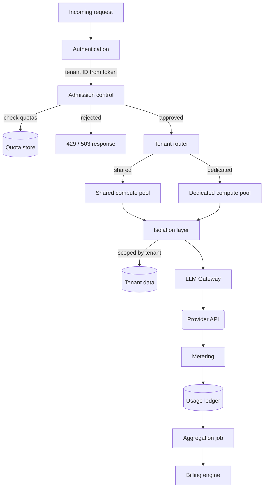

# Chapter 31 — Design: A Multi-Tenant Agent Platform

> Multi-tenancy is not a feature bolted on at the end. It is an architectural
> decision that permeates every layer, and retrofitting it after launch costs
> more than getting it wrong the first time.

---

## Learning Objectives

By the end of this chapter you will be able to:

- Explain why tenant ID must come from authentication context, not request
  parameters, and trace the vulnerability created by trusting the request.
- Design a data isolation layer that fails closed on ownership mismatches and
  never leaks the existence of other tenants' data.
- Implement per-tenant rate limiting that operates independently of global
  platform limits and survives tenant-specific quota changes at runtime.
- Detect noisy neighbors using resource scoring and apply proportional
  throttling without fully blocking the offending tenant.
- Choose an isolation level for a tenant class and defend the choice with a
  cost-versus-protection trade-off.
- Design a billing pipeline that computes per-tenant costs from metered usage
  before the provider invoice arrives.

---

## The Production Story

Consider a B2B SaaS company offering AI features to enterprise customers. The
platform started with three tenants — all early design partners, all trusted,
all paying fixed annual contracts that did not vary with usage. Each tenant had
its own configuration in a YAML file, rate limits enforced by a single shared
counter, and usage data written to the same Postgres table with a tenant_id
column. This worked.

By month eight the company had forty tenants. Three things had changed. First,
some tenants were on usage-based pricing, which required accurate metering.
Second, some tenants were competitors of each other, which required strict data
isolation for SOC 2 compliance. Third, one tenant — a high-volume logistics
company — generated 60% of total platform traffic and occasionally saturated
the shared rate limiter, causing request rejections for everyone.

The logistics company complained that their rate limit was too low. The
platform team raised it. Now the logistics company generated 75% of traffic,
and two smaller tenants churned because their requests kept timing out during
the logistics company's peak hours. The churned tenants were also the most
profitable on a per-request basis.

A compliance audit asked a question the team could not answer: "Show me every
request that accessed tenant X's data in the last 90 days." The tenant_id
column existed, but the query returned requests from tenant X *and* requests
that had accessed tenant X's documents through a retrieval pipeline that
cross-indexed everything. The documents were isolated; the retrieval embeddings
were not.

The platform needed three things it did not have: per-tenant resource quotas
that were enforced independently, metering granular enough to bill by usage,
and data isolation that covered not just primary storage but every index and
cache. All three required changes across the stack, and all three would have
been cheaper to build correctly on day one.

---

## Why This Exists

Single-tenant AI systems scale until they hit one of three walls.

**The first wall is cost attribution.** When there is one customer, the invoice
is the cost. When there are forty customers on usage-based pricing, the invoice
is the sum. You need per-tenant metering before the provider invoice arrives,
or you cannot send your own invoices, or worse, you send estimates and reconcile
later with credits that eat your margin.

**The second wall is resource isolation.** A single large tenant can consume
all available capacity — rate limit tokens, model context, compute time —
leaving nothing for smaller tenants. This is not malicious; it is the
predictable result of giving all tenants equal access to a shared pool. The
loud tenant churns quietly, but the quiet tenants churn first.

**The third wall is data isolation.** Enterprise customers require proof that
their data cannot be accessed by other tenants. This seems simple — add a
tenant_id column — until you discover that the embeddings index does not have
tenant filters, the cache does not namespace by tenant, and the retrieval
pipeline returns documents based on similarity without checking ownership.

Multi-tenancy solves all three by making tenant boundaries explicit at every
layer: admission, data, compute, metering, and billing. The tenant ID is not a
tag; it is a routing key that determines which resources a request can touch.

### Why tenant ID must come from authentication

A request arrives with a header claiming to be from tenant X. Should the
platform believe it?

No. The tenant ID must come from the authentication context — the verified
token that the identity provider issued — not from any value in the request
body or headers that the caller controls. Trusting the request is an
authorization bypass: any tenant can claim to be any other tenant by sending
the right header.

This seems obvious in isolation. It becomes non-obvious when the platform grows
a service mesh where internal services call each other. Service A receives a
request from tenant X, extracts the tenant ID from the verified token, and then
calls service B. How does service B know the request is for tenant X? If
service B trusts a header that service A sets, then a compromised service A
(or a bug in service A) can impersonate any tenant to service B.

The fix is either mutual TLS between services with tenant ID in the certificate
subject, or a platform-wide identity propagation mechanism like SPIFFE. Both
are expensive. The alternative — trusting headers between services — is a
latent privilege escalation that waits for a bug to exploit it.

---

## Core Concepts

**Tenant.** An organizational unit with its own data, quotas, configuration,
and billing. Typically maps to a customer account, though some platforms
support sub-tenants for enterprise customers with multiple internal teams.

**Isolation level.** The degree of separation between tenants. Shared isolation
uses common infrastructure with logical separation. Dedicated isolation uses
separate compute pools with shared infrastructure. Isolated uses fully separate
infrastructure, typically for highly regulated tenants or those with extreme
security requirements.

**Quota.** A per-tenant limit on resource consumption. Quotas include rate
limits (requests per second), concurrency limits (simultaneous in-flight
requests), token budgets (daily and monthly), and storage limits. Quotas are
enforced at admission, before the request consumes resources.

**Noisy neighbor.** A tenant whose resource consumption affects other tenants'
performance. Detected by scoring resource usage relative to fair share, and
mitigated by temporary throttling rather than hard blocking.

**Fair scheduling.** The principle that each tenant should receive a fair share
of platform capacity when demand exceeds supply. "Fair" typically means
proportional to tier or contract, not equal per tenant.

**Metering.** Recording resource consumption at request granularity for billing
and analytics. Metering must happen in the hot path but should not block the
hot path — write to a buffer, not a database.

**Cost attribution.** Assigning monetary cost to metered usage. Requires
mapping token counts to prices by model tier, which change over time. The
ledger stores tokens and the price at the time of the request, so historical
queries remain accurate after price changes.

---

## Internal Architecture

A multi-tenant platform adds three layers to the single-tenant architecture:
tenant resolution at admission, isolation enforcement at every data access, and
aggregation for billing.



*Tenant ID is resolved at authentication and carried through every layer. The
isolation layer ensures data access is always scoped, regardless of how the
request is routed.*

**Authentication.** Verifies the request's identity token and extracts the
tenant ID. This is the only place where tenant ID is established; all
subsequent layers trust this value because they cannot verify it themselves.

**Admission control.** Checks tenant status (is the tenant active?), rate
limits, concurrency limits, and token budgets. Runs in priority order:
cheapest checks first, most likely to reject first. A suspended tenant is
rejected before checking rate limits; no point counting requests for an
inactive tenant.

**Tenant router.** Directs the request to the appropriate compute pool based
on the tenant's isolation level. Shared tenants go to the shared pool;
dedicated tenants go to their own pool. The router also applies tenant-specific
configuration: which model tiers are allowed, which tools are enabled, what
system prompt prefix to prepend.

**Isolation layer.** Wraps every data access with tenant verification. A read
operation that returns data belonging to a different tenant is a security
incident. The isolation layer prevents this by checking ownership on every
read and failing closed — returning null, not an error — when ownership does
not match. Returning null rather than an error prevents information leakage:
the caller cannot distinguish "data does not exist" from "data exists but you
cannot access it."

**Metering.** Records usage to the ledger after request completion. The record
includes tenant ID, request ID, model tier, input tokens, output tokens,
duration, and timestamp. Metering happens in the finally block, not the success
path, because failed requests also consume resources.

**Aggregation.** A periodic job that rolls up raw usage records into hourly
and daily summaries. Dashboards and billing query the summaries, not the raw
ledger. This is the same pattern as Chapter 23's cost control — separate the
hot path from analytics.

---

## Production Design

**Enforce tenant ID in the platform, not the application.** Application code
should receive a request context that already contains a verified tenant ID.
The application should not parse tokens, extract claims, or validate
signatures. Every application that does its own tenant resolution is an
opportunity for inconsistency or bypass.

**Namespace every cache by tenant.** The cache key for "conversation history
for session X" is not `session:X`. It is `tenant:T:session:X`. If the cache
is shared across tenants and keys do not include tenant ID, a cache collision
is a data leak.

**Namespace every index by tenant.** Vector indexes, search indexes, and
full-text indexes must support tenant filtering at query time, not just at
document ingestion. An index that stores tenant ID per document but does not
filter by tenant ID on query is a retrieval vulnerability.

**Store tenant configuration in a fast cache with a slower backing store.**
Tenant configuration changes infrequently, but it is read on every request.
Load it into Redis or a local cache, with a TTL that balances freshness against
read load on the backing store. Configuration changes should invalidate the
cache explicitly, not wait for TTL expiry.

**Emit these metrics, labeled by tenant and isolation level:**

| Metric | Type | Why it matters |
| --- | --- | --- |
| `request_count` | counter | Volume per tenant |
| `request_latency` | histogram | SLA monitoring per tenant |
| `quota_remaining` | gauge | Early warning before exhaustion |
| `quota_rejected` | counter | How often quotas block requests |
| `noisy_neighbor_score` | gauge | Detect before throttling |
| `data_access_denied` | counter | Isolation enforcement working |
| `metering_records` | counter | Billing pipeline health |

**Run isolation verification tests continuously.** Create synthetic tenants A
and B, store data for each, and verify that A cannot read B's data and vice
versa. Run this in production, not just CI. A production isolation failure
is a security incident; discovering it in CI is a good day.

**Define SLAs per tenant tier, not per endpoint.** A shared tenant on a
starter plan should not have the same latency SLA as a dedicated tenant on an
enterprise plan. The SLA is a property of the tenant, not the platform. Alert
thresholds should vary accordingly.

---

## Failure Scenarios

### Failure: cross-tenant data access

**Symptom.** A tenant's retrieval results include documents they did not
upload. Discovery is usually during a customer demo or a compliance audit,
rarely from automated monitoring.

**Mechanism.** The retrieval index was built without tenant filtering. When a
query runs, it returns the most similar documents regardless of ownership. Or:
the index has tenant filtering, but a query was constructed without the tenant
filter parameter.

**Detection.** Isolation verification tests that run continuously against
production indexes. Alert if any test returns data for the wrong tenant. Also:
audit logging of every retrieval result, with tenant ID of the query and tenant
ID of each returned document. A mismatch is an incident.

**Mitigation.** Immediate: disable the retrieval feature until fixed. Assess
what data was exposed, to whom, and for how long. Notify affected tenants per
your data breach policy.

**Prevention.** Require tenant ID as a mandatory parameter on all index
queries. The index client library should fail loudly if tenant ID is missing,
not default to unfiltered. Review every index for tenant filtering during
security audits.

### Failure: noisy neighbor saturates platform

**Symptom.** Multiple tenants report increased latency or request rejections
at the same time. Dashboards show one tenant consuming 80% of total platform
requests. That tenant's metrics look fine; everyone else's metrics show
degradation.

**Mechanism.** The noisy tenant is operating within their per-tenant rate
limit, but their limit is high enough to saturate shared resources: model
provider rate limits, database connections, or compute capacity. The
per-tenant limit is too high relative to total platform capacity.

**Detection.** Alert on per-tenant traffic share. If any tenant exceeds 50% of
total traffic, investigate. Also: alert on noisy neighbor score exceeding
threshold before throttling activates.

**Mitigation.** Throttle the noisy tenant immediately. This is what the noisy
neighbor detector is for — automatic, proportional throttling that kicks in
before other tenants are affected. If automatic throttling is not enabled,
manually reduce the tenant's rate limit.

**Prevention.** Size per-tenant rate limits relative to total platform
capacity, not tenant requests. A tenant with a 10,000 requests/minute limit on
a platform that handles 15,000 requests/minute total can starve everyone else.
Also: enable noisy neighbor detection with appropriate thresholds.

### Failure: metering gap

**Symptom.** The monthly invoice to a tenant does not match their dashboard
usage. Typically the invoice is lower than expected, because metering gaps
undercount.

**Mechanism.** The metering buffer filled faster than the flush rate, and
records were dropped. Or: a service restart lost buffered records. Or: a
network partition between the application and the metering queue caused writes
to fail silently.

**Detection.** Compare request count (from admission logs) against metering
record count. A persistent gap indicates dropped records. Alert if the gap
exceeds 1%.

**Mitigation.** Estimate the missing usage from admission logs or provider
usage reports, and adjust the invoice. This is error-prone and expensive.

**Prevention.** Meter synchronously in the hot path, accepting the latency
cost, rather than buffering. Or: use a durable queue (Kafka) as the metering
buffer, which survives restarts and tolerates slow consumers. Never drop
metering records; they are money.

### Failure: tenant configuration stale

**Symptom.** A tenant's configuration change — new rate limit, new allowed
model tiers, suspended status — does not take effect. Requests continue under
the old configuration.

**Mechanism.** Tenant configuration is cached with a long TTL, and the cache
was not invalidated when the configuration changed. Or: the configuration
change was written to the backing store but not propagated to all cache
instances.

**Detection.** Compare the effective configuration (from request logs) against
the configured configuration (from the backing store). A mismatch that persists
beyond the expected propagation delay is this bug.

**Mitigation.** Force-invalidate all caches for the affected tenant. This
usually requires a platform-wide cache flush command or a deployment.

**Prevention.** Implement explicit cache invalidation on configuration change,
not just TTL-based expiry. Use a pub/sub mechanism to notify all cache
instances when configuration changes. Alternatively, accept slightly stale
configuration and set TTLs short enough that staleness is tolerable.

---

## Scaling Strategy

**First: admission control hot path, around 10,000 requests per second.**
The quota check runs on every request. A synchronous database call per request
fails here. Use Redis with Lua scripts for atomic check-and-decrement, same as
Chapter 23's budget store. Shard by tenant to avoid hot keys.

**Second: metering write throughput, around 50,000 requests per second.**
One ledger row per request at high volume overwhelms most databases. Buffer
locally and flush in batches, or write to Kafka and consume asynchronously.
The ledger is not the enforcement mechanism — quotas are — so durability can
be slightly relaxed for throughput.

**Third: aggregation job runtime, around 100 million ledger rows per day.**
Daily rollups that scan the full ledger become slow. Partition by tenant and
time, run aggregation per partition in parallel. Pre-compute the summaries
that dashboards and billing need.

**Fourth: tenant configuration cache, around 10,000 tenants.**
Loading all tenant configurations into a single Redis instance works until
memory limits hit. Shard by tenant ID hash. Implement lazy loading: do not
load a tenant's configuration until their first request, then cache it. Most
tenants do not send requests every cache TTL interval.

**Fifth: isolation verification tests, around 10,000 tenants.**
Testing every pair of tenants is O(n^2), which is unworkable at scale.
Sample: test every tenant against a small set of canary tenants, plus random
pairs. Accept that you are testing a sample, not the full space.

---

## Trade-offs

| Decision | Buys you | Costs you | Choose when |
| --- | --- | --- | --- |
| Shared isolation | Lower infrastructure cost | Noisy neighbor risk | Starter tiers, low-trust tenants |
| Dedicated isolation | No noisy neighbor | Higher cost, more ops | Enterprise tiers, SLA-bound tenants |
| Isolated infrastructure | Maximum separation | Highest cost, most ops | Regulated tenants, extreme security |
| Per-tenant rate limits | Fair resource allocation | Complexity in limit sizing | Multiple tenants, varying tiers |
| Global rate limits | Simpler to implement | Noisy neighbor risk | Single-tenant or very few tenants |
| Synchronous metering | No lost records | Higher latency | High-accuracy billing requirements |
| Buffered metering | Lower latency | Possible lost records | High-volume, tolerant billing |
| Fail-closed isolation | Security guarantee | False negatives block users | Enterprise, compliance-sensitive |
| Fail-open isolation | Availability | Security risk on bugs | Internal tenants, testing |
| Short cache TTL | Fresh configuration | Higher load on backing store | Frequent config changes |
| Long cache TTL | Lower load | Stale configuration risk | Infrequent config changes |

---

## Code Walkthrough

From `examples/ch31-multi-tenant/`. The isolation and quota systems implement
the admission and data access layers described above.

### Tenant-isolated data access

The key property: every data operation takes tenant ID as a parameter, and the
data layer never returns data from a different tenant.

```ts
// examples/ch31-multi-tenant/src/isolation.ts

export class IsolatedDataStore {
  private data: Map<string, TenantData>;
  private tenantIndex: Map<string, Set<string>>;

  retrieve(tenantId: string, dataId: string): TenantData | null {
    const data = this.data.get(dataId);

    if (!data) {
      this.logAccess(tenantId, 'retrieve', dataId, false);
      return null;
    }

    // Critical isolation check: verify tenant ownership
    if (data.tenantId !== tenantId) {                          // (1)
      this.logAccess(tenantId, 'retrieve', dataId, false);
      return null;                                              // (2)
    }

    this.logAccess(tenantId, 'retrieve', dataId, true);
    return data;
  }
}
```

1. Every read checks ownership. This is not an optimization; it is the
   security boundary. The caller cannot construct a query that bypasses this
   check.
2. Return null, not an error. The caller cannot distinguish "does not exist"
   from "exists but you cannot access it." This prevents enumeration attacks.

### Per-tenant quota enforcement

Quotas are checked in priority order, with the cheapest and most likely to
reject first.

```ts
// examples/ch31-multi-tenant/src/quota.ts

export class QuotaManager {
  checkQuotas(
    tenantConfig: TenantConfig,
    estimatedTokens: number
  ): QuotaCheckResult {
    const tenantId = tenantConfig.id;
    const quotas = tenantConfig.quotas;

    // 1. Check tenant status
    if (tenantConfig.status !== 'active') {                    // (1)
      return { allowed: false, reason: 'tenant_suspended' };
    }

    // 2. Check rate limit (requests per second)
    const secondWindow = this.getOrCreateWindow(tenantId, 1000);
    if (secondWindow.requestCount >= quotas.requestsPerSecond) {
      return { allowed: false, reason: 'rate_limit' };         // (2)
    }

    // 3. Check concurrency limit
    const inFlight = this.inFlightRequests.get(tenantId)?.size ?? 0;
    if (inFlight >= quotas.maxConcurrentRequests) {
      return { allowed: false, reason: 'concurrency_limit' };
    }

    // 4. Check daily token budget
    if (dailyUsed + estimatedTokens > quotas.tokensPerDay) {
      return { allowed: false, reason: 'daily_token_limit' };  // (3)
    }

    return { allowed: true };
  }
}
```

1. Tenant status is checked first. No point counting rate limits for a
   suspended tenant.
2. Rate limits are cheap to check (counter lookup) and frequently reject during
   bursts. Check them early.
3. Token budgets are more expensive (requires token estimation) and less
   frequently hit. Check them later.

### Noisy neighbor detection

Detection is based on accumulated resource score, with automatic throttling
when the score exceeds a threshold.

```ts
// examples/ch31-multi-tenant/src/quota.ts

export class NoisyNeighborDetector {
  recordUsage(
    tenantId: string,
    resourceUnits: number,
    totalTenants: number
  ): boolean {
    let state = this.tenantScores.get(tenantId);

    // Check if currently throttled
    if (state?.isThrottled) {
      if (Date.now() < state.throttleUntil) {
        return true;  // Still throttled                       // (1)
      }
      state.isThrottled = false;
    }

    // Accumulate score
    state.resourceScore += resourceUnits;                      // (2)

    // Throttle if threshold exceeded
    if (state.resourceScore >= this.threshold) {
      state.isThrottled = true;
      state.throttleUntil = Date.now() + this.throttleDurationMs;
      return true;                                              // (3)
    }

    return false;
  }
}
```

1. Throttling is temporary, not permanent. The tenant can resume after the
   throttle duration expires.
2. Score accumulates over a window. A tenant using resources steadily builds
   score gradually; a tenant bursting hits the threshold quickly.
3. Return true means the caller should reject or delay the request. The caller
   decides the specific behavior — reject with 429, delay, or degrade to a
   smaller model.

---

## Hands-On Lab

**Goal:** verify tenant isolation, quota enforcement, and noisy neighbor
detection. About 1 minute, Node 22.6+, no dependencies.

```bash
cd examples/ch31-multi-tenant
node scripts/lab.mjs
```

The lab runs seven steps and asserts 28 claims.

**Step 1 — create tenants with different quotas.**

Two tenants are created: Acme Corp with a 5 req/s rate limit, Beta Inc with a
20 req/s rate limit. The lab verifies that each tenant receives its configured
quotas, not the defaults.

**Step 2 — verify data isolation.**

Each tenant stores a document. The lab verifies that tenant A cannot read
tenant B's document and vice versa. Then runs the formal isolation verification
that checks every cross-tenant access attempt.

**Step 3 — enforce per-tenant rate limits.**

Sends requests until the rate limit triggers. Verifies that tenant A hits
their limit at 5 requests, not at 20, and that tenant B can send more requests
because their limit is higher.

**Step 4 — verify metering accuracy.**

Records usage for each tenant and verifies that token counts are accurate,
tier breakdown is correct, and metering is isolated between tenants.

**Step 5 — detect and throttle noisy neighbor.**

Simulates heavy resource usage from one tenant. Verifies that the tenant is
detected as noisy and throttled, while other tenants remain unaffected.

**Step 6 — apply tenant configuration.**

Updates a tenant's allowed model tiers and tools. Verifies that the
restrictions are enforced — disallowed tiers and tools are rejected.

**Step 7 — generate billing.**

Creates usage summaries and generates an invoice. Verifies that tier-based
pricing is applied and the invoice total matches the computed cost.

---

## Interview Questions

1. Why must tenant ID come from the authentication token, not a request header?
2. A tenant reports they can see another tenant's documents in retrieval
   results. Walk me through the investigation.
3. How do you size per-tenant rate limits relative to total platform capacity?
4. What is the difference between shared, dedicated, and isolated tenancy?
   When would you choose each?
5. A tenant asks for real-time usage visibility. Your metering pipeline has a
   5-minute delay. How do you respond?
6. Describe the noisy neighbor problem and three approaches to mitigate it.
7. How do you test isolation in production without risking actual data leaks?
8. A tenant's invoice is significantly lower than their dashboard usage.
   What went wrong?

---

## Staff-Level Answers

**Q2 — cross-tenant data in retrieval results.** The senior answer is to check
the retrieval index for tenant filtering and verify the query includes the
tenant parameter. That is correct and necessary, but insufficient.

The staff answer starts with impact assessment: which tenants were affected,
what data was exposed, and for how long. This is a security incident, not a
debugging exercise. The first action is to disable the retrieval feature while
investigating, not to start debugging while the leak continues.

Then the root cause analysis, which must cover every layer where tenant
boundaries exist: the index itself (does it support tenant filtering?), the
query construction (is tenant ID always passed?), the cache (is it namespaced
by tenant?), and the embedding pipeline (are embeddings isolated or shared?).
The bug is rarely in one place; it is usually a combination of a missing filter
at one layer and a shared resource at another.

The staff addition is the systemic fix: continuous isolation verification that
would have caught this before a customer did. Create canary tenants, run
retrieval queries, and alert if any results cross tenant boundaries. This runs
in production, not CI, because production is where the configuration drifts.

**Q4 — isolation levels and when to choose them.** Shared isolation is the
default: common infrastructure, logical separation, lowest cost. Tenants share
compute, share caches, share indexes. The risk is noisy neighbors and the
perception of shared infrastructure, which some enterprise customers reject on
principle.

Dedicated isolation gives each tenant their own compute pool, but shared
infrastructure for caches, queues, and databases (namespaced by tenant). The
compute isolation eliminates noisy neighbor issues for model inference, which
is usually the loudest neighbor. Cost is higher because you cannot bin-pack
across tenants; each dedicated pool must handle peak load independently.

Isolated infrastructure is separate everything: compute, storage, network,
sometimes even provider API keys. This is for regulated industries where the
auditor requires proof of physical separation, or for tenants whose security
posture is so high that shared infrastructure is a deal-breaker. Cost is much
higher, and operational burden scales with tenant count.

The staff move is to recognize that isolation level is a business decision, not
a technical one. The platform should support all three and let pricing drive
adoption. Shared is cheap, dedicated is more expensive, isolated is expensive.
Tenants self-select based on their security requirements and budget. The
platform's job is to make all three reliable, not to choose for the tenant.

**Q6 — noisy neighbor mitigation.** Three approaches, escalating in
effectiveness and complexity.

First: per-tenant rate limiting. Each tenant gets a rate limit that, if fully
consumed, cannot starve other tenants. This requires sizing limits relative to
total capacity: if the platform handles 10,000 req/s and you have 100 tenants,
the average tenant can have 100 req/s, but no tenant should have 5,000. The
limit is a contract, not an optimization.

Second: noisy neighbor detection with automatic throttling. Score each tenant
by resource consumption over a sliding window. When the score exceeds a
threshold, throttle that tenant's requests — reject some, delay others, or
downgrade to cheaper models. The throttle is temporary; it buys time for the
tenant to back off or for operations to intervene.

Third: dedicated compute pools. The definitive fix for noisy neighbors is to
give each tenant their own pool. This is expensive, but it is the only solution
that provides a guarantee rather than a mitigation. Enterprise tenants who
cannot tolerate any noisy neighbor risk should be on dedicated pools; the
pricing should reflect the cost.

The staff answer acknowledges that all three are usually needed. Rate limits
are the baseline. Detection and throttling handle the 80% case where a tenant
briefly exceeds their fair share. Dedicated pools handle the remaining cases
where fair share is not good enough.

**Q8 — invoice lower than dashboard.** The investigation starts with the
metering pipeline: are records being dropped? Compare request counts from
admission logs against metering records. A gap indicates dropped records.

If records are not dropped, check aggregation: are the rollups computing
correctly? A bug in the aggregation job might under-count, especially if it
mishandles time zone boundaries or partial periods.

If aggregation is correct, check pricing: is the billing engine using the
right prices? A pricing update that applied retroactively to already-metered
usage would cause the invoice to diverge from the dashboard.

The staff addition: this is a billing pipeline failure, which means it is also
a revenue recognition issue. Finance needs to know before the invoice goes out.
The fix is not just technical — it involves adjusting invoices, possibly
issuing credits, and explaining the discrepancy to affected tenants. The
engineering fix is to add reconciliation checks that catch the gap before
invoicing, not after.

---

## Exercises

1. **Isolation penetration test.** Modify the lab to create a malicious query
   that attempts to read another tenant's data by manipulating the data ID.
   Verify that the isolation layer blocks the access. Then remove the ownership
   check and observe the leak.

2. **Rate limit sizing.** The platform handles 10,000 requests per second with
   50 tenants. Ten tenants are enterprise tier (40% of revenue), forty are
   starter tier. Design rate limits for each tier such that enterprise tenants
   get 10x the rate limit of starter tenants, and total assigned limits do not
   exceed 80% of platform capacity.

3. **Noisy neighbor simulation.** Modify the noisy neighbor detector to use a
   sliding window that decays over time rather than a fixed window. Compare the
   detection characteristics: which approach throttles faster on bursts? Which
   is fairer to sustained high usage?

4. **Metering durability.** Add a simulated failure to the metering pipeline
   that drops 5% of records randomly. Measure the invoice discrepancy. Then add
   a reconciliation step that compares metering records against admission logs
   and estimates the dropped records.

5. **Design question.** A tenant requests dedicated infrastructure with their
   own provider API key, billed directly to them rather than through the
   platform. Write the one-page RFC covering the technical changes, the billing
   model, and the risks (hint: the tenant can now bypass platform rate limits).

---

## Further Reading

- **Chapter 18, "The LLM Gateway"** — the single-tenant gateway this chapter
  extends. Multi-tenancy adds isolation and per-tenant quotas; the streaming,
  metering, and cost attribution patterns are unchanged.

- **Chapter 19, "Multi-Provider Routing"** — routing decisions can vary by
  tenant. Enterprise tenants might have different provider preferences or
  failover policies. The routing layer needs tenant context.

- **Chapter 22, "AI Security and Prompt Injection"** — security policies must
  be tenant-scoped. A tenant's custom system prompt should not be injectable by
  another tenant's inputs.

- **Chapter 23, "Cost Control and Capacity Planning"** — the reserve-then-
  reconcile pattern from this chapter applies directly to per-tenant token
  budgets. The same mechanism, different scope.

- **AWS Well-Architected Framework, SaaS Lens** — Amazon's guidance on
  multi-tenant architecture. Not AI-specific, but the patterns for tenant
  isolation, tiering, and metering transfer directly.

- **Stripe's multi-tenant billing documentation** — if your billing is
  usage-based, study how Stripe handles metering, aggregation, and invoice
  generation. Their API design reflects years of iteration on exactly these
  problems.
