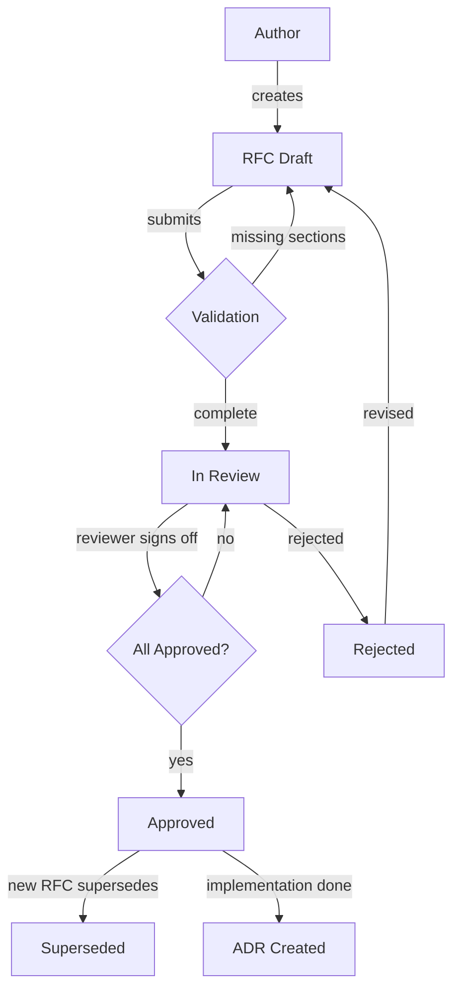

# Chapter 32: Architecture Reviews and RFCs

## Learning Objectives

After completing this chapter, you will be able to:

1. Structure an RFC with required sections that prevent incomplete proposals from reaching review
2. Document trade-offs for each alternative so reviewers can evaluate decisions, not just solutions
3. Link RFCs to Architecture Decision Records (ADRs) for long-term knowledge preservation
4. Apply AI-specific checklist items covering latency, cost, security, reliability, and scalability
5. Implement RFC workflow states that enforce review before approval
6. Generate ADRs from approved RFCs to capture decisions in a searchable format

## The Production Story

Consider a mid-size fintech company with eight engineering teams building AI features. The payments team ships a new fraud detection model that calls a frontier-tier LLM for transaction analysis. Two weeks later, the compliance team deploys a document classification system using the same provider. Neither team consulted the other.

The monthly bill arrives: $340,000, three times the projected budget. Both systems hit the same rate limits, causing cascading failures during peak hours. The compliance system's prompts occasionally leak PII because nobody reviewed them for injection vulnerabilities.

The VP of Engineering calls an all-hands. "How did two teams build the same integration without talking to each other?" The answer is uncomfortable: there was no process requiring them to. Feature specs existed, but architecture decisions lived in Slack threads and meeting notes that nobody outside the team ever saw.

The company institutes an RFC process. Every AI system change above a cost threshold requires a written proposal with alternatives, trade-offs, and explicit sign-off from platform, security, and finance. The first month produces twelve RFCs. Three get rejected—not because the ideas were bad, but because the trade-off analysis revealed better approaches. One RFC for a new embedding pipeline gets merged with another team's proposal, saving six weeks of duplicate work.

Six months later, a new engineer joins and asks why the company uses a specific vector database. Instead of hunting through Slack, she finds ADR-047, which links to RFC-023, which documents the evaluation criteria, the alternatives considered, and the reasons for the final choice. The decision is not just recorded—it is searchable, linkable, and updatable.

## Why This Exists

Architecture decisions in AI systems have unusually high blast radius. A poor choice of embedding model affects every downstream retrieval system. A rate limiting strategy that works for one team breaks another's SLA. A prompt template with injection vulnerabilities exposes customer data.

Traditional code review catches implementation bugs but not architectural mistakes. By the time code exists, the architecture is already decided. RFCs move the review earlier, when changing direction costs hours instead of months.

AI systems also accumulate decisions that seem arbitrary to newcomers. Why do we chunk documents at 512 tokens? Why is the retry budget 3 attempts? ADRs preserve the reasoning so future engineers can distinguish intentional constraints from historical accidents.

## Core Concepts

**RFC (Request for Comments)**: A written proposal for a significant technical change. Contains context (why now), decision (what specifically), consequences (what follows), and alternatives (what else was considered). Must reach "approved" status before implementation begins.

**ADR (Architecture Decision Record)**: A point-in-time record of an architectural decision. Captures the context, decision, and consequences at the moment of decision. Unlike RFCs, ADRs are never edited after acceptance—if the decision changes, a new ADR supersedes the old one.

**Trade-off**: An explicit statement of what a decision buys and what it costs. Every alternative must have documented trade-offs, or reviewers cannot evaluate whether the proposal chose correctly.

**AI Checklist**: A set of review questions specific to AI systems. Covers five categories: latency (p99 targets, TTFT requirements), cost (token budgets, model tier), security (injection mitigations, PII handling), reliability (fallback strategies, timeout policies), and scalability (concurrent request limits, batch sizes).

**Workflow State**: The current status of an RFC in its lifecycle. Valid states are draft, review, approved, rejected, and superseded. Transitions are constrained—you cannot go directly from draft to approved.

**Reviewer**: A person assigned to evaluate an RFC. Must explicitly approve or request changes. An RFC cannot be approved until all required reviewers sign off.

## Internal Architecture



The workflow enforces that RFCs cannot skip review. The validation step checks for required sections (context, decision, consequences, alternatives) and ensures each alternative has documented trade-offs. Reviewers must explicitly approve—silence is not consent.

## Production Design

**RFC Storage**: Store RFCs in version control alongside code. This ensures RFCs are reviewed with the same rigor as code and are searchable with standard tools. Use a consistent directory structure: `rfcs/RFC-NNN-short-title.md`.

**Required Reviewers**: For AI system changes, require sign-off from at least: one platform engineer (for infrastructure impact), one security engineer (for prompt injection and PII), and the cost owner (for budget impact). Optional reviewers can be added per-RFC.

**Checklist Enforcement**: The AI checklist should be a required section in the RFC template. Unanswered questions block approval. Common questions:

| Category | Question |
|----------|----------|
| Latency | What is the p99 latency target? |
| Latency | What is the acceptable time-to-first-token? |
| Cost | What is the monthly token budget? |
| Cost | Which model tier is required (frontier/mid/small)? |
| Security | How is prompt injection mitigated? |
| Security | Does the system handle PII? If so, how is it protected? |
| Reliability | What is the fallback when the provider is unavailable? |
| Reliability | What is the timeout policy? |
| Scalability | What is the peak QPS? |
| Scalability | Can requests be batched? |

**ADR Generation**: When an RFC is approved and implemented, generate an ADR automatically. The ADR inherits context, decision, and consequences from the RFC. Link the ADR back to the RFC for full history.

## Failure Scenarios

**Scenario 1: RFC Approved Without Trade-off Analysis**

*Symptom*: An RFC is approved recommending a specific vector database. Three months later, the team discovers it cannot handle their scale.

*Mechanism*: The RFC listed alternatives but did not document trade-offs. Reviewers approved based on the author's recommendation without seeing the evaluation criteria.

*Detection*: Validation should require that every alternative has at least one trade-off entry. RFCs without trade-offs fail automated checks.

*Mitigation*: Add trade-offs retroactively before allowing approval.

*Prevention*: RFC template includes a trade-offs section per alternative. Validation blocks submission without it.

**Scenario 2: Orphaned ADR**

*Symptom*: An ADR references an RFC that no longer exists. The decision rationale is lost.

*Mechanism*: RFCs were stored in a wiki that was migrated. Links broke during migration.

*Detection*: Automated link checking in CI. Broken RFC links fail the build.

*Mitigation*: Recover RFC from backups or reconstruct from Git history.

*Prevention*: Store RFCs in the same repository as ADRs. Use relative links.

**Scenario 3: Stale Checklist**

*Symptom*: RFCs are approved but miss critical considerations. A new attack vector (prompt injection via tool calls) is not on the checklist.

*Mechanism*: The checklist was written once and never updated as the threat landscape changed.

*Detection*: Quarterly review of checklist items against recent incidents.

*Mitigation*: Update checklist and re-review recent RFCs.

*Prevention*: Include checklist review in the incident postmortem process. New failure modes become new checklist items.

**Scenario 4: Approval Bottleneck**

*Symptom*: RFCs wait weeks for approval. Teams bypass the process for urgent changes.

*Mechanism*: Required reviewers are overloaded. There is no escalation path for delays.

*Detection*: Track time-in-review metrics. Alert when RFCs exceed SLA.

*Mitigation*: Add backup reviewers. Escalate to engineering leadership.

*Prevention*: Limit required reviewers to three. Use optional reviewers for additional input. Set explicit SLA (e.g., 5 business days).

## Scaling Strategy

**10 engineers, 1 team**: Informal RFCs. Write a document, share in Slack, get verbal approval. ADRs are optional but helpful.

**50 engineers, 5 teams**: Formal RFC process with required template. Store in shared repository. Require platform and security review for AI changes. Generate ADRs for approved RFCs.

**200 engineers, 20 teams**: RFC committee rotates weekly. Automated validation in CI. Searchable RFC/ADR index. Metrics on review time and rejection rate.

**500+ engineers**: Dedicated architecture team triages RFCs. Domain-specific checklists (payments, ML, infrastructure). Cross-team RFC visibility requirements to prevent duplicate work.

## Trade-offs

| Decision | Buys you | Costs you | Choose when |
|----------|----------|-----------|-------------|
| Require trade-offs per alternative | Informed reviewer decisions | Longer RFC writing time | Decisions are hard to reverse |
| Auto-generate ADRs from RFCs | Consistent documentation | ADRs may include draft content | Most RFCs are implemented as approved |
| Store RFCs in code repo | Version control, code review tooling | Separate from wiki docs | Engineering-owned decisions |
| Require security reviewer | Catch injection vulnerabilities early | Adds review latency | System handles user input |
| Time-bound review SLA | Predictable approval timeline | Pressure on reviewers | Fast iteration needed |
| AI-specific checklist | Catches AI failure modes | Checklist fatigue | System uses LLMs |
| Allow RFC rejection | Prevents bad decisions | Author frustration | Alternatives exist |
| Link ADRs to RFCs | Full decision history | Maintenance burden | Long-lived systems |

## Code Walkthrough

The example code demonstrates RFC validation, workflow management, and ADR generation.

**RFC Builder** (`src/rfc.ts`):

```typescript
const rfc = new RFCBuilder('RFC-001', 'Replace LLM Gateway', 'alice')
  .withContext('Current gateway has 500ms p99 latency, need 200ms.')
  .withDecision('Build custom gateway with connection pooling.')
  .addConsequence('Reduced latency by 60%')
  .addAlternative('Build custom', 'Build in-house solution')
  .addTradeoffToAlternative('Build custom', 'latency',
    'Full control over optimization', 'Higher development cost')
  .addAIChecklistItem('latency', 'What is the p99 target?', '200ms')
  .build();
```

The builder pattern ensures RFCs are constructed incrementally. Each method returns the builder for chaining. The `build()` method validates completeness.

**Workflow Transitions** (`src/workflow.ts`):

```typescript
const workflow = new RFCWorkflow();

// Valid: draft -> review
workflow.submitForReview(rfc, 'alice');  // returns true

// Invalid: draft -> approved (must go through review)
workflow.canTransition('draft', 'approved');  // returns false

// After reviewer approves
workflow.approve(rfc, 'bob');  // returns true if all reviewers signed off
```

The workflow enforces valid state transitions. Direct jumps from draft to approved are blocked.

**ADR Generation** (`src/adr.ts`):

```typescript
const adrGenerator = new ADRGenerator();
const adr = adrGenerator.fromApprovedRFC(rfc);

// ADR inherits RFC fields
adr.context === rfc.context;  // true
adr.relatedRFCs.includes(rfc.id);  // true
adr.status === 'proposed';  // starts as proposed
```

ADRs are generated from approved RFCs to preserve the decision record.

## Hands-On Lab

Run the lab to verify RFC validation, workflow transitions, and ADR generation:

```bash
node examples/ch32-architecture-rfcs/scripts/lab.mjs
```

**Expected output**:

```
Step 1 - RFC has required sections
  [PASS] complete RFC passes validation
  [PASS] no validation errors
  [PASS] RFC has context, decision, consequences, alternatives

Step 2 - trade-offs documented for each alternative
  [PASS] all alternatives have tradeoffs
  [PASS] RFC without tradeoffs flagged

...

28/28 checks passed
```

The lab validates that incomplete RFCs fail validation, workflows enforce state transitions, and ADRs correctly inherit RFC content.

## Interview Questions

1. Why would you reject an RFC that has a good solution but no alternatives documented?

2. An RFC proposes using a frontier-tier model for a feature. What checklist questions would you require answers for before approving?

3. How would you handle an urgent production fix that cannot wait for the standard RFC review timeline?

4. What is the difference between an RFC and an ADR, and why do you need both?

5. A team consistently has their RFCs rejected. What process changes might help?

6. How would you structure RFC reviews to prevent a single senior engineer from becoming a bottleneck?

7. An approved RFC turns out to be wrong after implementation. What happens to the ADR?

8. How would you measure whether your RFC process is working?

## Staff-Level Answers

**Q1: Why reject an RFC with a good solution but no alternatives?**

The purpose of an RFC is not to document what you already decided—it is to show reviewers why this decision is better than the alternatives. Without alternatives, reviewers cannot evaluate whether the author considered other approaches. The "good solution" might be the third-best option.

More importantly, documenting alternatives creates organizational knowledge. When a future engineer asks "why didn't we use X?", the RFC should answer that question. If the answer is "we didn't consider it," that is a process failure.

The fix is not to reject the RFC permanently but to send it back for revision. The author adds alternatives and trade-offs. If no alternatives exist, that itself is worth documenting ("we evaluated X, Y, and Z; only Z meets our latency requirements").

**Q4: Difference between RFC and ADR, and why both?**

An RFC is a proposal. It lives before the decision is made, collects feedback, and may be rejected or revised. It represents the deliberation process.

An ADR is a record. It lives after the decision is made, captures the final choice, and is immutable. It represents the outcome.

You need both because they serve different audiences at different times. During the decision, you need the RFC to facilitate review. After the decision, you need the ADR to explain it to future engineers.

The RFC can contain draft content, abandoned ideas, and reviewer debates. The ADR is clean—it states what was decided and why, without the noise of the deliberation process.

If you only have RFCs, you must read the entire history to understand the final decision. If you only have ADRs, you lose the deliberation that explains why alternatives were rejected.

**Q6: Preventing a bottleneck on a senior engineer?**

Three structural changes help:

First, limit required reviewers to three people maximum. Additional reviewers can be optional—they can comment but cannot block approval.

Second, create a reviewer rotation. Instead of one senior engineer reviewing all RFCs, rotate responsibility weekly among a pool of qualified reviewers. This distributes load and builds review skills across the team.

Third, set an explicit SLA with escalation. RFCs not reviewed within five business days escalate to the reviewer's manager. This creates accountability without requiring constant nagging.

The goal is to make review predictable without making it a single point of failure.

**Q8: Measuring RFC process effectiveness?**

Four metrics matter:

*Time to approval*: How long from RFC submission to approval? Increasing time suggests bottlenecks or scope creep.

*Rejection rate*: What percentage of RFCs are rejected? Too low (< 5%) suggests rubber-stamping. Too high (> 50%) suggests misaligned expectations.

*Post-implementation changes*: How often do approved RFCs require significant changes during implementation? Frequent changes suggest RFCs are too abstract or reviews are too shallow.

*ADR reference rate*: How often do engineers cite ADRs when explaining decisions? Low citation suggests ADRs are not discoverable or not useful.

Track these quarterly and look for trends rather than absolute numbers.

## Exercises

1. **Write an RFC**: Draft an RFC for adding a caching layer to an LLM gateway. Include two alternatives (Redis vs. in-memory), trade-offs for each, and answers to the AI checklist questions.

2. **Review an RFC**: Given a sample RFC missing trade-offs, write reviewer feedback explaining what is missing and why it matters.

3. **Design a checklist**: Create an AI checklist for a system that handles medical records. What additional questions beyond the standard five categories are needed?

4. **Implement superseding**: Extend the workflow to handle RFC superseding. When a new RFC supersedes an old one, what state transitions occur?

5. **Build metrics**: Design a dashboard showing RFC health metrics. What queries would you run against the RFC repository to populate it?

## Further Reading

- **Documenting Architecture Decisions** (Michael Nygard): The original ADR format proposal. Short and practical.

- **Design Docs at Google** (Google Engineering Practices): How Google structures design documents for large-scale systems.

- **RFC 2119: Key Words for Use in RFCs** (IETF): The standard for "MUST", "SHOULD", "MAY" terminology in technical documents.

- **The Staff Engineer's Path** (Tanya Reilly): Chapter on technical decision-making and influence without authority.

- **Architecture Decision Records** (GitHub): Collection of ADR templates and examples from open source projects.

- **Lightweight Architecture Decision Records** (ThoughtWorks): A minimal ADR format for teams starting out.
