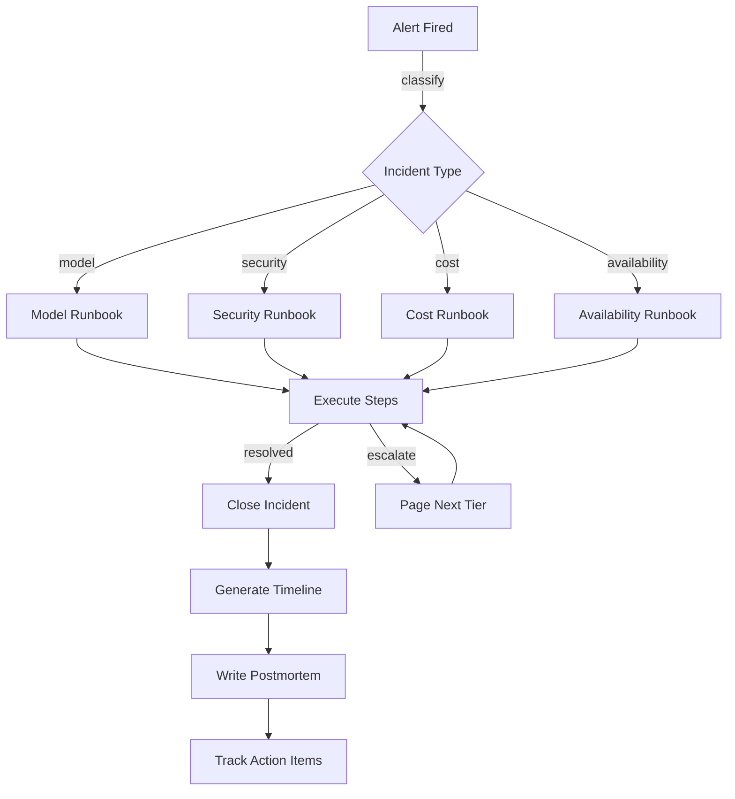

# Chapter 33: Incident Management for AI Systems

## Learning Objectives

After completing this chapter, you will be able to:

1. Classify AI-specific incidents by type (model, security, cost, availability, data) using observable symptoms
2. Calculate incident severity based on user impact, service criticality, and blast radius
3. Execute runbook steps in sequence with checkpoints to ensure consistent response
4. Construct incident timelines that capture detection, triage, mitigation, and resolution
5. Generate post-incident reports with required sections (summary, timeline, root cause, action items)
6. Track action items from postmortems to prevent recurrence

## The Production Story

Consider a fintech company whose AI fraud detection system starts blocking legitimate transactions at 2 AM on a Saturday. The on-call engineer receives a page: "Fraud model rejection rate exceeded 40%." Normal is 3%.

The engineer opens the dashboard and sees the spike started 47 minutes ago. Forty-seven minutes of legitimate transactions blocked. Customers are already complaining on social media. The engineer has never worked on the fraud system before.

She finds the runbook: "Fraud Model High Rejection Rate." Step one: check model version. The model version is the same as yesterday. Step two: check input distribution. The input features look normal. Step three: check provider status. The LLM provider's status page shows "degraded performance" starting 50 minutes ago.

The model uses an LLM for transaction context analysis. When the LLM responds slowly, the fraud system times out and defaults to "reject." The runbook's step four: "If provider degraded, switch to fallback model." She toggles the feature flag. Rejection rate drops to 4% within two minutes.

The incident lasted 52 minutes. Mean time to detect (MTTD): 5 minutes (alerting worked). Mean time to resolve (MTTR): 47 minutes (too long—the runbook was buried in a wiki nobody could find at 2 AM).

The postmortem identifies three action items: move runbooks to the alerting system so they appear alongside pages, add provider latency to the dashboard, and implement automatic fallback when provider latency exceeds threshold. Six weeks later, the provider has another outage. The automatic fallback triggers in 30 seconds. Nobody gets paged.

## Why This Exists

AI system incidents differ from traditional software incidents in three ways.

First, the failure modes are novel. Model drift, prompt injection, hallucination, and cost runaway do not exist in traditional software. On-call engineers trained on "server down" playbooks do not know how to diagnose "model accuracy degraded."

Second, the blast radius is often financial. A bug that doubles LLM API calls doubles the bill. A model that starts recommending expensive options to every customer burns budget in hours. Traditional monitoring catches errors and latency but not cost anomalies.

Third, the root cause is often external. When your database is slow, you can profile it. When your LLM provider is slow, you wait for their status page. This external dependency requires different response strategies—fallback to alternatives rather than internal debugging.

Incident management for AI systems requires AI-specific classification, AI-specific runbooks, and AI-specific postmortem questions.

## Core Concepts

**Incident**: An unplanned event that disrupts or degrades service. Distinguished from alerts (signals that may indicate an incident) and problems (underlying causes that may produce multiple incidents).

**Severity**: A classification of incident impact. Common scale: SEV1 (critical, all-hands response), SEV2 (major, immediate response), SEV3 (minor, next business day), SEV4 (low, backlog). Severity determines response urgency and escalation path.

**Incident Type**: The category of incident based on root cause. AI-specific types include model (accuracy, drift, hallucination), security (prompt injection, data leak), cost (budget exceeded, runaway usage), availability (timeout, rate limit), and data (training data issue, embedding corruption).

**Runbook**: A documented procedure for responding to a specific incident type. Contains ordered steps, decision points, and escalation criteria. Good runbooks are executable by an engineer who has never seen the system.

**Timeline**: A chronological record of incident events. Captures when the incident started (even if detected later), when it was detected, who responded, what actions were taken, and when it was resolved.

**Postmortem**: A post-incident analysis conducted without blame. Identifies root cause, contributing factors, and action items to prevent recurrence. Also called "incident review" or "retrospective."

**Action Item**: A specific task arising from a postmortem. Has an owner, due date, priority, and status. Tracked until completed.

**MTTD (Mean Time to Detect)**: Average time from incident start to detection. Measures monitoring effectiveness.

**MTTR (Mean Time to Resolve)**: Average time from detection to resolution. Measures response effectiveness.

## Internal Architecture



The incident flow starts with classification, which determines the runbook. Runbook execution is iterative—steps may escalate to higher tiers if resolution is not achieved. After resolution, the timeline is reconstructed and the postmortem is written.

## Production Design

**Classification Rules**: Classify incidents by primary symptom:

| Symptom | Type | Example |
|---------|------|---------|
| Accuracy drop | Model | Fraud model false positive spike |
| Unexpected output | Model | Chatbot producing nonsense |
| Injection detected | Security | User input executing as prompt |
| Data in logs | Security | PII appearing in debug output |
| Budget exceeded | Cost | Monthly spend hit in week two |
| Usage spike | Cost | 10x normal token consumption |
| Timeout increase | Availability | p99 latency exceeded SLA |
| Error rate spike | Availability | 5xx responses above threshold |

**Severity Matrix**: Calculate severity from impact and urgency:

| Impact / Urgency | Critical System | Major System | Minor System |
|-----------------|-----------------|--------------|--------------|
| >50% users affected | SEV1 | SEV1 | SEV2 |
| 10-50% users affected | SEV1 | SEV2 | SEV3 |
| <10% users affected | SEV2 | SEV3 | SEV4 |

**Runbook Structure**: Every runbook should have:
1. Trigger conditions (what alerts link to this runbook)
2. Initial assessment steps (gather context before acting)
3. Mitigation steps (stop the bleeding)
4. Resolution steps (fix the root cause)
5. Verification steps (confirm the fix worked)
6. Escalation criteria (when to page someone else)

**Timeline Events**: Capture these events at minimum:
- `detected`: When the incident was first noticed
- `acknowledged`: When someone claimed ownership
- `investigating`: When diagnosis began
- `mitigating`: When a fix was attempted
- `resolved`: When service was restored
- `closed`: When postmortem was completed

## Failure Scenarios

**Scenario 1: Model Drift Undetected**

*Symptom*: Customer complaints increase gradually over two weeks. Support tickets mention "unhelpful responses." No alerts fired.

*Mechanism*: The model's accuracy degraded as input distribution shifted. Accuracy monitoring only checked aggregate metrics daily, missing the slow drift.

*Detection*: Add segment-level accuracy monitoring. Track accuracy by customer cohort, query type, and time of day. Alert on segment degradation even if aggregate looks fine.

*Mitigation*: Roll back to previous model version. Manually review recent predictions.

*Prevention*: Implement continuous evaluation with segment breakdowns. Set alerts on 7-day rolling accuracy by segment.

**Scenario 2: Prompt Injection Escalates**

*Symptom*: Security team notices unusual LLM outputs in audit logs. One user's session shows the model revealing system prompts.

*Mechanism*: A sophisticated injection bypassed input sanitization. The attacker iterated over several sessions, probing for weaknesses.

*Detection*: Pattern matching on outputs caught the leak, but only after several successful extractions.

*Mitigation*: Immediately revoke the user's session. Rotate any secrets that may have been exposed. Review all sessions from the same IP.

*Prevention*: Add output filtering for sensitive patterns. Implement rate limiting on unusual query patterns. Log and alert on potential injection attempts.

**Scenario 3: Cost Spike from Retry Storm**

*Symptom*: Daily LLM spend jumps 5x. No new features launched. Traffic is normal.

*Mechanism*: An upstream service started returning errors, triggering retries. Each retry used tokens. The retry loop amplified 100 errors into 10,000 LLM calls.

*Detection*: Cost alerting caught the spike after 4 hours. By then, $12,000 was spent.

*Mitigation*: Disable the feature causing retries. Add circuit breaker to prevent future amplification.

*Prevention*: Set per-request cost budgets. Implement exponential backoff with jitter. Add circuit breakers that trip on consecutive failures.

**Scenario 4: Hallucination in Production**

*Symptom*: Customer reports receiving medical advice from a support chatbot that should only handle billing questions.

*Mechanism*: A prompt that normally constrains the model was accidentally removed in a deployment. The model responded to out-of-scope questions without guardrails.

*Detection*: Manual customer report. No automated detection.

*Mitigation*: Roll back the deployment. Review all conversations since deployment.

*Prevention*: Add output classification that flags out-of-scope responses. Implement deployment checks that verify prompt integrity. Add integration tests for guardrail behavior.

## Scaling Strategy

**10 engineers**: Informal incident response. Whoever notices the problem fixes it. Postmortems are optional. Runbooks live in a shared doc.

**50 engineers**: On-call rotation per team. Incident commander role for SEV1/SEV2. Required postmortems for SEV1/SEV2. Runbooks linked from alerting system.

**200 engineers**: Centralized incident management platform. Cross-team incident commanders. All incidents tracked in database. Metrics on MTTD/MTTR by team. Quarterly incident review meetings.

**500+ engineers**: Dedicated incident management team. Automated classification and routing. Predictive alerting using ML. Post-incident reports reviewed by leadership. Public status page with automated updates.

## Trade-offs

| Decision | Buys you | Costs you | Choose when |
|----------|----------|-----------|-------------|
| Page on-call for SEV3 | Faster response | Alert fatigue | SEV3 affects revenue |
| Require postmortem for all incidents | Learning from everything | Time overhead | Small team, few incidents |
| Automate runbook steps | Consistent execution | Less flexibility | Steps are well-understood |
| Public status page | Customer trust | Exposure of issues | B2B customers demand it |
| Blameless postmortems | Honest analysis | No accountability | Trust exists |
| Track all action items | Nothing forgotten | Tracking overhead | Action items often slip |
| Classify by symptom | Fast triage | May misclassify | Root cause unclear initially |
| Escalate after timeout | Expertise brought in | Interrupted sleep | Resolution is time-sensitive |

## Code Walkthrough

The example code demonstrates incident classification, runbook execution, and postmortem generation.

**Incident Classification** (`src/classifier.ts`):

```typescript
const classifier = new IncidentClassifier();

// Classify by symptoms
const modelIncident = classifier.classify({
  symptoms: ['accuracy_drop', 'false_positive_spike'],
  affectedService: 'fraud-detection'
});
// Returns: { type: 'model', confidence: 0.9 }

const securityIncident = classifier.classify({
  symptoms: ['injection_detected', 'unexpected_output'],
  affectedService: 'chatbot'
});
// Returns: { type: 'security', confidence: 0.85 }
```

Classification uses symptom patterns to determine incident type with confidence scores.

**Runbook Execution** (`src/runbook.ts`):

```typescript
const runner = new RunbookRunner();
const execution = runner.start('model-degradation-runbook', incidentId);

// Steps must execute in order
execution.canStart('step-2');  // false (step-1 not complete)
execution.complete('step-1', { modelVersion: 'v2.3' });
execution.canStart('step-2');  // true

// Track progress
execution.progress();  // { completed: 1, total: 5, percentage: 20 }
```

The runner enforces step ordering and tracks completion progress.

**Postmortem Generation** (`src/postmortem.ts`):

```typescript
const generator = new PostmortemGenerator();
const report = generator.generate(incident, rootCause, impact);

// Report has required sections
report.summary;      // "On 2024-01-15, a SEV2 model incident..."
report.timeline;     // Array of timeline events
report.rootCause;    // { category: 'external', description: '...' }
report.actionItems;  // Array of action items with owners and due dates
```

The generator creates structured postmortems from incident data.

## Hands-On Lab

Run the lab to verify incident classification, runbook execution, and postmortem generation:

```bash
node examples/ch33-incident-management/scripts/lab.mjs
```

**Expected output**:

```
Step 1 - incident classified correctly
  [PASS] model degradation classified as model incident
  [PASS] prompt injection classified as security incident
  [PASS] budget exceeded classified as cost incident
  [PASS] timeout storm classified as availability incident

Step 2 - severity matches impact criteria
  [PASS] high impact incident scored as sev1
  [PASS] low impact incident scored as sev4

...

26/26 checks passed
```

The lab validates classification accuracy, severity calculation, runbook step ordering, and postmortem completeness.

## Interview Questions

1. How would you design an alerting system that distinguishes between a model accuracy drop and a model hallucination?

2. A SEV1 incident is ongoing, but the on-call engineer is unsure whether to page the next tier. What criteria should guide this decision?

3. What AI-specific items would you add to an incident postmortem template?

4. How would you handle an incident caused by a third-party LLM provider outage when you have no control over the fix?

5. A team's MTTR for AI incidents is 3x higher than for traditional incidents. What might explain this, and how would you address it?

6. How would you design runbooks for incidents that have never happened before?

7. An incident recurs three months after the postmortem. What process failures might explain this?

8. How would you balance blameless postmortems with accountability for preventable mistakes?

## Staff-Level Answers

**Q1: Alerting for accuracy drop vs. hallucination?**

These are different failure modes requiring different detection.

Accuracy drop is a statistical degradation—the model is still producing outputs in the expected format, but the outputs are more often wrong. Detection: track prediction accuracy against ground truth over a rolling window. Alert when accuracy falls below threshold or drops more than X% in 24 hours.

Hallucination is a qualitative failure—the model produces outputs that are confidently wrong or outside its domain. Detection: add output classifiers that flag responses containing forbidden content (medical advice in a billing bot) or factual claims that contradict known data. Alert immediately on classification match.

The key difference: accuracy monitoring requires labeled data and tolerates some delay. Hallucination detection requires real-time output analysis and should alert immediately because a single hallucination may cause harm.

**Q4: Handling third-party provider outages?**

When you cannot fix the root cause, focus on mitigation and communication.

Immediate response: Activate fallback provider or graceful degradation. If no fallback exists, consider disabling the feature entirely rather than serving errors. Update your status page to reflect the dependency.

Communication: Be transparent with customers. "Our AI features are currently degraded due to an upstream provider issue. We are monitoring and will restore full service when the provider recovers." Do not blame the provider by name unless they have publicly acknowledged the issue.

During the incident: Monitor the provider's status page. Prepare to restore service quickly when they recover. Document the timeline from your perspective.

Postmortem: Even though you did not cause the issue, conduct a postmortem on your response. Did fallback work? Was detection fast enough? Should you add a second provider for redundancy?

**Q5: AI incident MTTR 3x higher than traditional?**

Several factors may explain the gap:

*Unfamiliar failure modes*: Engineers know how to debug a slow database but not a drifting model. Training and AI-specific runbooks help.

*Observability gaps*: Traditional systems have mature monitoring. AI systems may lack equivalent tooling for model performance, token costs, and output quality. Invest in AI observability.

*External dependencies*: AI incidents often involve providers you cannot debug. MTTR includes waiting for their response. Mitigate by adding fallbacks.

*Diagnosis complexity*: "Why is the model wrong?" is harder than "why is the server slow?" Improve debugging tools and pre-compute diagnostic queries in runbooks.

Address by: training engineers on AI failure modes, building AI-specific dashboards, pre-writing diagnostic runbooks, and adding provider fallbacks.

**Q7: Incident recurs after postmortem?**

The postmortem process failed in one of three ways:

*Action items not completed*: The postmortem identified the fix, but nobody did the work. Fix: track action items in a system with owners and due dates. Review completion in engineering meetings.

*Action items insufficient*: The postmortem identified a fix, the fix was implemented, but it did not actually prevent recurrence. Fix: include "how will we verify this fix works?" in the action item. Add monitoring that would detect recurrence.

*Root cause misidentified*: The postmortem blamed the wrong thing. The real root cause was not addressed. Fix: conduct a more thorough analysis. Use "5 whys" to dig deeper. Review postmortems with someone unfamiliar with the system.

The recurrence itself should trigger a postmortem of the postmortem process.

## Exercises

1. **Write a runbook**: Create a runbook for "LLM provider rate limit exceeded." Include detection, triage, mitigation, and resolution steps.

2. **Design severity criteria**: Create a severity matrix for a healthcare AI system where patient safety is a concern. How do your criteria differ from a standard e-commerce system?

3. **Analyze a timeline**: Given a sample incident timeline, identify the largest time gap and propose a process change to reduce it.

4. **Build an action item tracker**: Design a system that prevents postmortem action items from being forgotten. What integrations would help?

5. **Classify incidents**: Given ten incident descriptions, classify each by type and severity. Justify your classifications.

## Further Reading

- **Site Reliability Engineering** (Google): Chapters on incident management and postmortems. The foundation for modern incident response.

- **The Phoenix Project** (Gene Kim): Novel format introduction to incident management principles and DevOps culture.

- **Incident Management for Operations** (Rob Schnepp): Practical guide to incident command systems adapted for tech.

- **How Complex Systems Fail** (Richard Cook): Short paper on systemic causes of failure. Essential reading for blameless postmortems.

- **PagerDuty Incident Response Guide**: Open documentation of PagerDuty's incident response process. Practical templates.

- **Learning from Incidents** (Nora Jones): Modern approach to incident analysis focused on learning rather than blame.
