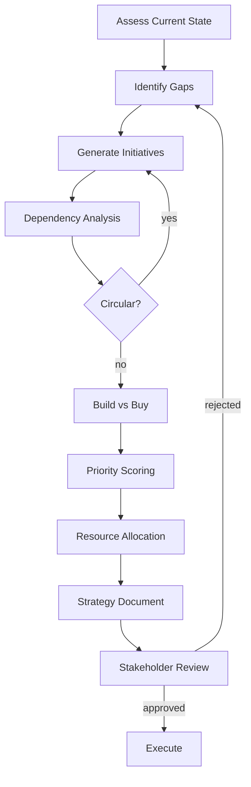

# Chapter 34: Technical Strategy and Influence

## Learning Objectives

After completing this chapter, you will be able to:

1. Construct a technical roadmap with validated dependencies that prevents circular planning
2. Perform build vs. buy analysis with explicit cost/benefit comparison across multiple dimensions
3. Score technical debt by impact and effort to prioritize reduction work objectively
4. Write strategy documents with required sections (vision, goals, milestones, risks) that executives can act on
5. Prioritize initiatives using weighted factors that balance impact, effort, and organizational constraints
6. Communicate technical decisions to non-technical stakeholders without losing precision

## The Production Story

Consider a VP of Engineering at a Series C startup asking her most senior staff engineer to present an AI strategy to the board. The company has grown from one AI feature to seven, built by four teams with no coordination. Token costs are $180,000 monthly and climbing. Three different vector databases are in production. Nobody knows which models are used where.

The staff engineer has six weeks. She starts by mapping what exists: seven features, four LLM providers, three vector stores, two embedding models, and one shared component that nobody owns. She interviews each team: "What would you build if you had infinite time?" The answers reveal three overlapping initiatives and two critical gaps.

She builds a roadmap. Quarter one: consolidate to one vector database (saves ops burden). Quarter two: build a shared embedding service (enables cross-team search). Quarter three: implement cost controls (prevents budget overruns). Quarter four: add multi-provider routing (reduces vendor lock-in).

The dependencies are explicit. Multi-provider routing requires the shared embedding service. Cost controls require consolidated infrastructure to measure. Each initiative has a build vs. buy analysis: the vector database is buy (Pinecone), the embedding service is build (internal traffic is too high for external pricing), cost controls are build (nothing fits their needs), routing is buy initially, build later.

She presents to the board. The CEO asks: "Why not do cost controls first? We're bleeding money." She shows the dependency graph: cost controls require knowing what to measure, which requires consolidated infrastructure. The CFO asks: "What if Pinecone raises prices?" She shows the second slide: vendor lock-in risk is mitigated by the embedding abstraction layer in quarter two.

The board approves. Six months later, token costs are flat despite 3x traffic growth. The staff engineer did not write a line of code. She changed how the organization makes technical decisions.

## Why This Exists

AI systems require strategic coordination that traditional software does not.

First, AI costs are variable and often surprising. A feature that costs $100/day in testing may cost $10,000/day in production. Without strategy, each team discovers this independently. With strategy, one team's learning prevents another's surprise.

Second, AI components have high reuse potential. Embeddings computed for search can power recommendations. A prompt tested for support can inform sales. Without coordination, teams duplicate work. With strategy, shared components multiply value.

Third, AI decisions compound. Choosing an embedding model locks in a vector dimension. Choosing a vector database locks in a query interface. Bad early decisions constrain good later ones. Strategy front-loads the decisions that matter most.

Technical strategy is not planning—it is deciding what to decide now versus later.

## Core Concepts

**Technical Strategy**: A framework for making consistent technical decisions across an organization. Contains vision (where we are going), principles (how we decide), and roadmap (what we do when).

**Roadmap**: A time-ordered sequence of initiatives with dependencies. Not a commitment to dates but a statement of priorities and prerequisites.

**Initiative**: A discrete unit of work with defined scope, owner, and success criteria. Larger than a feature, smaller than a strategy. Typically one quarter of one team.

**Build vs. Buy**: A structured comparison of implementing internally versus purchasing externally. Evaluates cost, time, control, risk, and strategic fit.

**Technical Debt**: Work deferred that increases future cost. Scored by impact (how much does this hurt us?) and effort (how hard is it to fix?). High impact, low effort items should be fixed immediately.

**Influence**: The ability to change organizational direction without direct authority. Requires credibility (you know what you're talking about), communication (others understand your argument), and relationships (people trust your judgment).

**Stakeholder**: Anyone affected by or affecting a technical decision. Includes engineers, product managers, executives, customers, and vendors.

## Internal Architecture



Strategy development is iterative. Circular dependencies force initiative redesign. Stakeholder rejection sends you back to identify gaps. Execution reveals new gaps, restarting the cycle.

## Production Design

**Roadmap Format**: Use quarters, not months or weeks. Quarters are long enough to complete meaningful work and short enough to adapt to change. Format:

```
Q1 2025: Infrastructure Consolidation
  - Migrate to single vector database
  - Blockers: None
  - Success: One vector store in production

Q2 2025: Shared Embedding Service
  - Build internal embedding API
  - Blockers: Q1 (need consolidated infra)
  - Success: 3+ teams using shared embeddings
```

**Build vs. Buy Criteria**: Score each option on five dimensions (1-5 scale):

| Dimension | Build | Buy |
|-----------|-------|-----|
| Time to value | Slower (3) | Faster (4) |
| Long-term cost | Lower (4) | Higher (2) |
| Customization | Full (5) | Limited (2) |
| Maintenance | You own it (2) | Vendor owns it (4) |
| Strategic fit | Depends | Depends |

Total the scores. But also note: some dimensions matter more for some decisions. Weight accordingly.

**Technical Debt Scoring**: Use a 2x2 matrix:

| | Low Effort | High Effort |
|---|---|---|
| **High Impact** | Fix immediately | Plan and schedule |
| **Low Impact** | Fix opportunistically | Ignore |

"Impact" means: production incidents caused, developer hours wasted, or customer complaints generated. "Effort" means: engineering weeks to fix.

**Communication Cadence**:
- Weekly: team-level progress updates
- Monthly: cross-team initiative reviews
- Quarterly: roadmap reviews with leadership
- Annually: strategy refresh with board

## Failure Scenarios

**Scenario 1: Strategy-Execution Gap**

*Symptom*: The strategy document says "consolidate to one database" but six months later, three databases are still in production.

*Mechanism*: The strategy was never translated into team OKRs. Teams continued their existing priorities because nobody told them to stop.

*Detection*: Quarterly review comparing strategy milestones against actual state.

*Mitigation*: Create explicit OKRs from strategy. Assign owners. Track weekly.

*Prevention*: Strategy must include resource allocation. If no team is assigned, the initiative will not happen.

**Scenario 2: Wrong Build vs. Buy Decision**

*Symptom*: A team spent six months building an internal embedding service. A vendor solution with identical capabilities launched two months in.

*Mechanism*: The build vs. buy analysis was done once at project start and never revisited.

*Detection*: Monthly scan of vendor landscape for relevant solutions.

*Mitigation*: Evaluate switching cost. If low, migrate. If high, continue building.

*Prevention*: Add checkpoints to long build decisions. At each checkpoint, re-evaluate the market.

**Scenario 3: Ignored Technical Debt**

*Symptom*: Every new feature takes 3x longer than estimated because it must work around legacy systems.

*Mechanism*: Technical debt was documented but never prioritized. Product always won the roadmap negotiation.

*Detection*: Track developer velocity over time. Declining velocity despite stable team size indicates debt accumulation.

*Mitigation*: Allocate fixed percentage (e.g., 20%) of each quarter to debt reduction.

*Prevention*: Include technical debt in product roadmap discussions. Show the cost of not fixing it.

**Scenario 4: Lost Influence**

*Symptom*: A staff engineer's recommendations are consistently overruled by leadership. Teams stop consulting them.

*Mechanism*: The engineer made a high-profile recommendation that failed. Credibility eroded.

*Detection*: Track recommendation acceptance rate over time.

*Mitigation*: Start with smaller, higher-confidence recommendations to rebuild trust.

*Prevention*: Never recommend without data. Acknowledge uncertainty explicitly. Build relationships before you need them.

## Scaling Strategy

**10 engineers**: Strategy is informal. The CTO holds it in their head. Decisions happen in Slack. This works until it doesn't.

**50 engineers**: Written strategy is necessary. Roadmap shared quarterly. Build vs. buy decisions documented. One staff engineer owns strategy coherence.

**200 engineers**: Strategy team or architecture review board. Domain-specific strategies (data, ML, platform). Formal RFC process for significant decisions.

**500+ engineers**: Dedicated technical strategy function. Multi-year planning horizons. Board-level technical updates. Strategy cascades to business unit strategies.

## Trade-offs

| Decision | Buys you | Costs you | Choose when |
|----------|----------|-----------|-------------|
| Detailed roadmap | Predictability | Flexibility | Stable domain |
| High-level roadmap | Adaptability | Coordination difficulty | Fast-changing domain |
| Build | Control, customization | Time, maintenance | Core competency |
| Buy | Speed, less maintenance | Vendor lock-in, less control | Commodity capability |
| Fix debt immediately | Developer velocity | Short-term slowdown | Debt causing incidents |
| Defer debt | Short-term velocity | Long-term pain | Deadline pressure |
| Consensus decisions | Buy-in | Speed | Reversible decisions |
| Top-down decisions | Speed | Buy-in | Irreversible decisions |
| Document everything | Future engineers understand | Writing time | Long-lived systems |
| Document minimally | Move faster | Knowledge silos | Prototypes |

## Code Walkthrough

The example code demonstrates roadmap validation, build vs. buy analysis, and initiative prioritization.

**Roadmap Validation** (`src/roadmap.ts`):

```typescript
const planner = new RoadmapPlanner();

// Add initiatives with dependencies
planner.addInitiative('vector-consolidation', { quarter: 'Q1' });
planner.addInitiative('embedding-service', {
  quarter: 'Q2',
  dependencies: ['vector-consolidation']
});

// Validate no circular dependencies
const result = planner.validate();
result.valid;  // true
result.errors; // []

// Circular dependency detected
planner.addInitiative('infra', { dependencies: ['routing'] });
planner.addInitiative('routing', { dependencies: ['infra'] });
planner.validate().valid; // false
```

The planner detects circular dependencies before they cause planning confusion.

**Build vs. Buy Analysis** (`src/build-buy.ts`):

```typescript
const analyzer = new BuildBuyAnalyzer();

const analysis = analyzer.compare('embedding-service', {
  build: {
    timeToValue: 3,
    longTermCost: 4,
    customization: 5,
    maintenance: 2,
    strategicFit: 4
  },
  buy: {
    timeToValue: 5,
    longTermCost: 2,
    customization: 2,
    maintenance: 5,
    strategicFit: 3
  }
});

analysis.recommendation;  // 'build'
analysis.rationale;       // 'Build scores higher on strategic fit and customization'
```

The analyzer provides a structured comparison with explicit scoring.

**Initiative Prioritization** (`src/prioritization.ts`):

```typescript
const prioritizer = new InitiativePrioritizer();

const result = prioritizer.prioritize([
  { id: 'vector', impact: 'high', effort: 'medium', priority: 1 },
  { id: 'routing', impact: 'medium', effort: 'low', priority: 2 },
  { id: 'cost-controls', impact: 'high', effort: 'high', priority: 1 }
]);

result.topPriorities;  // ['vector', 'cost-controls', 'routing']
result.initiatives[0].score;  // 78
result.initiatives[0].factors;  // [{ name: 'impact', contribution: 28 }, ...]
```

Prioritization uses weighted factors to produce a ranked list.

## Hands-On Lab

Run the lab to verify roadmap validation, build vs. buy analysis, and prioritization:

```bash
node examples/ch34-technical-strategy/scripts/lab.mjs
```

**Expected output**:

```
Step 1 - roadmap dependencies validated
  [PASS] valid roadmap passes dependency check
  [PASS] no circular dependencies detected
  [PASS] circular dependency detected
  [PASS] cycle reported as error

Step 2 - build vs buy analysis has cost/benefit
  [PASS] build option has benefits
  [PASS] buy option has benefits

...

25/25 checks passed
```

The lab validates dependency detection, analysis completeness, and prioritization consistency.

## Interview Questions

1. How would you build a technical roadmap for a company with no existing AI infrastructure?

2. A team wants to build an internal LLM gateway. Leadership wants to buy one. How do you structure the decision?

3. How do you prioritize technical debt when product is pushing for new features every sprint?

4. An executive asks you to cut three months from the roadmap. How do you decide what to cut?

5. How do you build influence with teams that do not report to you?

6. A strategy you championed failed. How do you recover credibility?

7. How would you explain transformer architecture tradeoffs to a CFO?

8. When should technical strategy override business priorities?

## Staff-Level Answers

**Q2: Build vs. buy LLM gateway?**

Structure the decision with explicit criteria and data.

First, define what "gateway" means in your context. Is it just routing? Does it include caching? Rate limiting? Observability? Make sure both options are solving the same problem.

Second, list criteria that matter: time to value, long-term cost, customization needs, maintenance burden, vendor risk, and strategic importance.

Third, score each option honestly. Internal build: longer time to value (6 months vs. 2 weeks), lower long-term cost (no per-request fees), high customization (you control everything), high maintenance (you fix bugs), no vendor risk, strategically important if AI is core to the business.

Fourth, present the tradeoff, not a recommendation. "Building gives us control but delays our launch by six months. Buying gets us live quickly but costs $X/month and limits what we can customize."

Let leadership make the decision with full information. Your job is to clarify tradeoffs, not to lobby.

**Q4: Cutting three months from the roadmap?**

Do not cut uniformly. Cut strategically.

First, identify which initiatives are dependencies for others. Cutting a dependency affects everything downstream. These are harder to cut.

Second, identify which initiatives have the highest uncertainty. High-uncertainty work is likely to slip anyway. Removing it from the roadmap may just reflect reality.

Third, identify which initiatives have the lowest strategic impact. Some roadmap items are "nice to have" that accumulated momentum. Cut these first.

Present options, not a single answer: "We can cut the recommendation engine (low impact, no dependencies) or defer the multi-provider routing (high impact, but high uncertainty). I recommend cutting recommendations."

Finally, be honest about consequences. "Cutting this saves three months but means we cannot launch feature X in Q4."

**Q5: Building influence without authority?**

Three components: credibility, communication, and relationships.

Credibility comes from being right. Start with small recommendations where you have high confidence. When they work, people trust your judgment on bigger issues. Being wrong once costs credibility. Being uncertain and saying so does not.

Communication means tailoring your message. Engineers want technical depth. PMs want user impact. Executives want business outcomes. Same decision, three different explanations.

Relationships mean helping before you need help. Review others' RFCs. Offer debugging assistance. Share credit. When you later need support for your initiative, people remember.

Influence compounds. Early wins create later leverage.

**Q7: Transformer tradeoffs to a CFO?**

Translate to business terms.

"Larger models are smarter but more expensive. A frontier model costs roughly $30 per 1,000 requests. A small model costs $0.50. The question is: when does the smarter answer pay for itself?

For high-value interactions—closing a sale, preventing fraud—the extra accuracy is worth it. For low-stakes interactions—answering common questions, summarizing documents—the cheaper model is good enough.

Our strategy is to use expensive models where accuracy matters and cheap models everywhere else. We estimate this saves $40,000 monthly compared to using frontier everywhere, with no measurable quality impact on low-stakes tasks."

The CFO does not care about attention mechanisms. They care about cost vs. value.

## Exercises

1. **Build a roadmap**: Create a four-quarter AI platform roadmap for a company currently using three different LLM providers with no shared infrastructure. Include dependencies.

2. **Analyze build vs. buy**: Evaluate build vs. buy for a vector database. Your company has 10 million documents and expects 100 QPS. Show your scoring.

3. **Prioritize debt**: Given five technical debt items with impact and effort estimates, produce a prioritized list with justification.

4. **Write a strategy document**: Draft a one-page technical strategy for AI cost management. Include vision, goals, milestones, and risks.

5. **Practice communication**: Write three versions of the same technical decision (using retrieval-augmented generation vs. fine-tuning) for three audiences: engineers, product managers, and the CEO.

## Further Reading

- **The Staff Engineer's Path** (Tanya Reilly): Comprehensive guide to staff engineering, including technical strategy and influence.

- **An Elegant Puzzle** (Will Larson): Systems thinking for engineering management. Relevant sections on organizational strategy.

- **Good Strategy Bad Strategy** (Richard Rumelt): General strategy principles. The "kernel" framework applies directly to technical strategy.

- **Thinking in Systems** (Donella Meadows): Mental models for understanding complex systems. Essential for seeing how technical decisions interact.

- **The Architecture of Open Source Applications**: Case studies of real system architectures. Useful for understanding tradeoffs in practice.

- **Staff Eng Podcast**: Interviews with staff engineers about strategy, influence, and decision-making.
